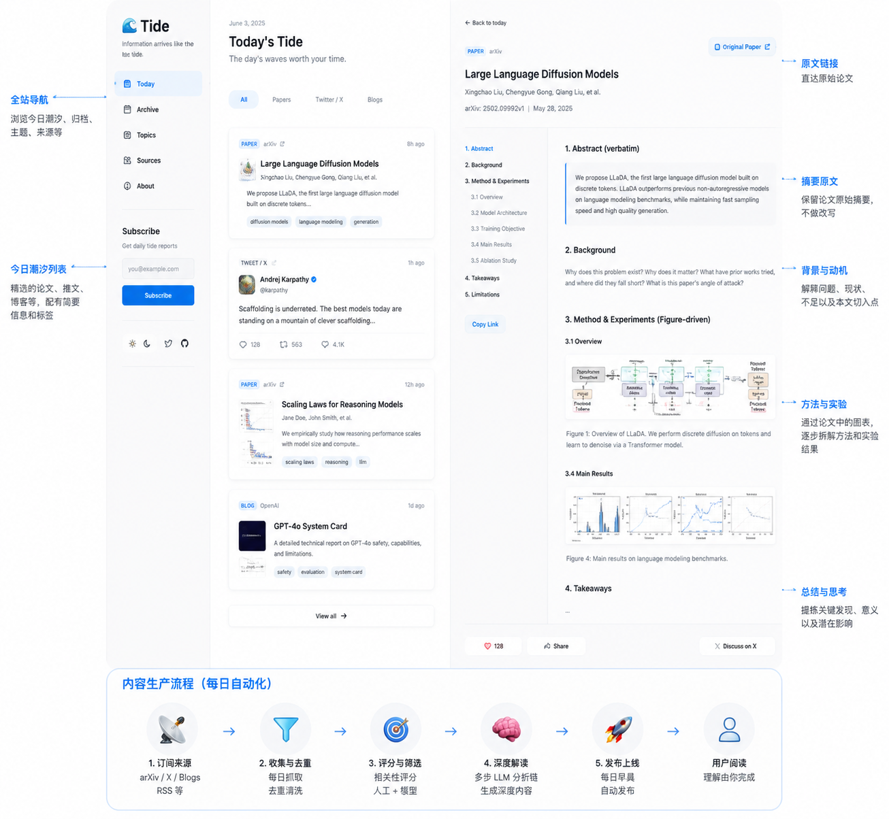

# 🌊 Tide（潮汐）

[English](./README.md) | **中文**

> 资讯如潮汐，一波接一波，永不停歇。你无法阻挡海洋，但你可以学会读懂它。

**Tide** 是一个开源的 AI 资讯网站：每天自动摄入重要的信息源（arXiv 论文、Twitter/X 上的声音、AI 实验室博客……），挑出值得读的那几朵浪，并在网页上发布**深度解读**——不是一句话摘要。一份写给"想真正理解正在发生什么、而不是刷过就忘"的人的每日潮汐报告。

## 为什么叫 "Tide"（潮汐）？

新闻、论文、热点每天像潮水一样涌来。大多数聚合工具试图*把海喝干*：抓取一切、压缩成要点、完事。结果是一条你刷完就忘的信息流。

Tide 站在相反的立场上。潮水无论如何都会来——问题不是"我怎么看完所有东西"，而是"**我允许哪些东西塑造我的思考，以及塑造到多深？**"。Tide 替你观察水面，挑出值得研究的浪，帮你认真地与它们交手。

## 核心信念：理解是无法外包的

这个项目建立在一个想法之上，来自 Andrej Karpathy：

> **"理解是无法外包的。"（Understanding cannot be outsourced.）**

在 AI 时代，把*阅读*外包出去从未如此容易。任何一个 LLM 都乐意把一篇论文压缩成五个要点。但一份你没有与之搏斗过的摘要，就不是你真正拥有的东西。如果消化全部交给 AI，你最终得到的只是一座整理得井井有条、却从未真正理解过的图书馆。

所以 Tide 刻意**不**以"帮你省去阅读"为目标。它的目标是：

1. **过滤** —— 每天呈现真正值得关注的少数内容，而不是倾倒 50 条。
2. **深度解读** —— 对每一条入选内容发布真正的分析：它在攻克什么问题、真正的新意在哪、为什么重要、它可能错在哪里。
3. **把你请进来** —— 每篇解读都链接回原始来源。Tide 的文章是入口，不是终点。
4. **把理解留给你** —— Tide 负责备好材料、提出问题；最后那一步理解，始终由人完成。

把它想象成一个替所有人预读的研究助理——而不是替你阅读的替身。

## Tide 是什么

一个每天更新的网站，你可以在上面：

- 🌊 **浏览今日潮汐** —— 当天精选的论文、推文和文章，每条都配深度解读，而不是一句话。
- 📄 **阅读论文深潜** —— 原文摘要 → 背景细讲 → 图文结合的方法与实验，附原文链接（详见下文）。
- 🐦 **跟上对话** —— 值得倾听的研究者和 builder 们正在说什么，以及为什么重要。
- 🗂 **回看** —— 按日期和主题浏览的归档，让潮水留下记录，而不是退去无痕。

## 一篇论文深潜长什么样

Tide 上的每个论文页面都遵循同一个形状。我们给出原文链接，然后只增加一样属于我们自己的东西：**解读**。

1. **摘要，原样保留** —— 论文自己的摘要一字不动地放在页面上，附原文链接。这是基本盘，我们不会把它改写掉。
2. **背景，讲透** —— 大多数摘要工具跳过的部分。这个问题为什么存在？为什么重要？前人试过什么、卡在哪里？这篇论文的切入角度是什么？本质上是把 Introduction 放慢、讲清楚。
3. **方法与实验，用论文自己的图讲** —— 这部分*一定*是图文结合的。我们以作者自己画的图和表为锚点，粗讲方法和结果。论文里没有图可依托的部分，我们宁可跳过，也不堆一面文字墙。
4. **重理解，不重公式** —— 我们不复述推导。想看数学，原文链接就是为此而在。我们的任务是让你理解这个方法*在做什么*、*为什么有效*，而不是把它重新排版一遍。

指导性的画面：一朵浪应该**拍到你身上，而不是把你淹没**。Tide 把论文从水里捞出来、溅到你的皮肤上——足以让你判断要不要跳进去。跳水这件事，由你自己去原文完成。

## 网页背后的流水线

- 📡 **订阅** —— arXiv 主题/关键词、精选的 Twitter/X 账号、博客等一切可 RSS 化的信息源。
- 🧹 **采集与去重** —— 每日抓取、跨源去重、噪声清理。采集是脏活，它应该无聊而可靠。
- 🔍 **打分与精选** —— 相关性打分，让每日精选既少又值得读。
- 🧠 **深度解读** —— 多步 LLM 分析链，产出上文的页面结构（不是一次性摘要）。
- 🚀 **发布** —— 每天早上，当日报告自动上线网站。

## 当前状态

🚧 **早期阶段。** 这份 README 是项目的立项文档——刻意写在代码之前。"为什么做"应当比任何具体实现活得更久。

粗略路线图：

- [ ] v0：网站 —— arXiv 摄入 → 每日精选 → 深度解读页面，每日自动发布
- [ ] v1：Twitter/X 信息源上站
- [ ] v2：归档与主题导航、搜索
- [ ] v3：站点之上的订阅（RSS / 邮件 / 飞书）

## 致谢

- Andrej Karpathy——"个人 LLM wiki" 的理念，以及点燃这个项目的那句话。
- 众多开源每日简报项目（arXiv digest、KOL 聚合器、meridian 等）——它们证明了采集层已是被解决的问题，Tide 因此得以把精力集中在解读层。

## 许可证

MIT
