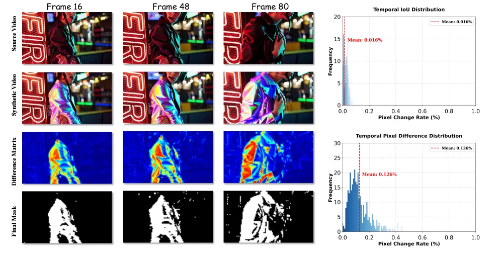
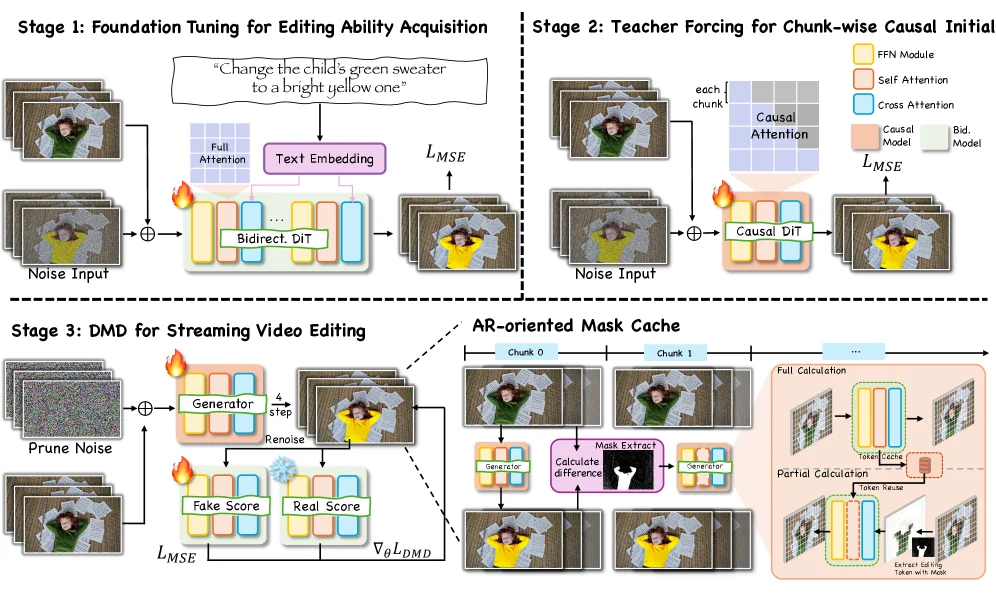
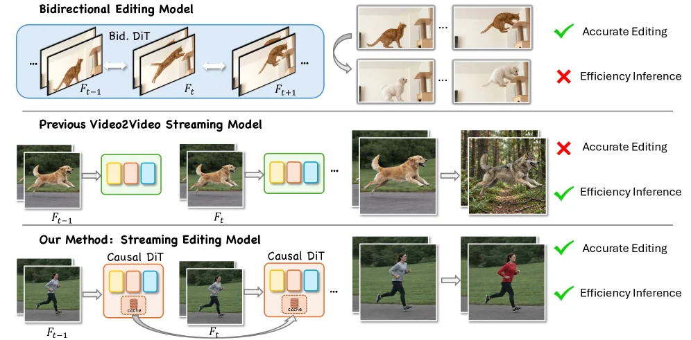
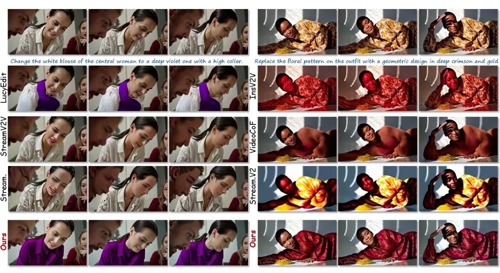
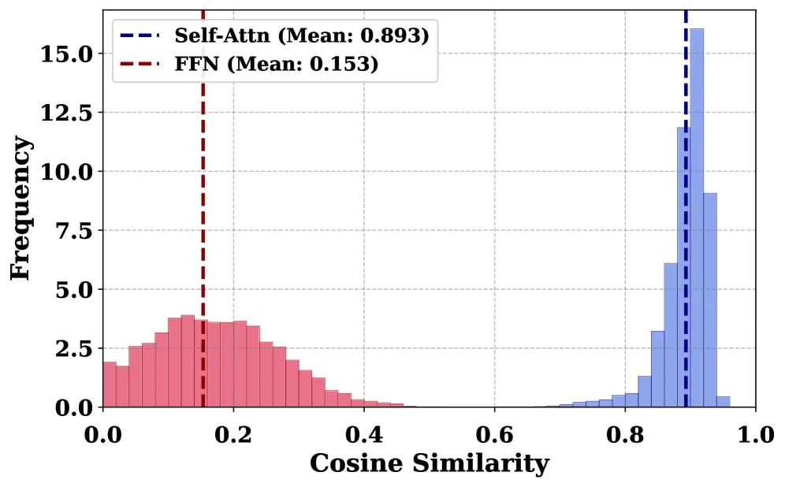

# LiveEdit: Towards Real-Time Diffusion-Based Streaming Video Editing

[arXiv](https://arxiv.org/abs/2606.26740) · [HuggingFace](https://huggingface.co/papers/2606.26740) · ▲82

## Abstract (verbatim)

> Streaming video editing has made rapid progress, yet practical deployment is still limited by two core issues: maintaining stable backgrounds and non-edited regions over time, and achieving the low latency required for real-time interactive scenarios. Meanwhile, recent streaming video generation methods are mostly developed for synthesis and cannot be directly applied to editing due to the strict preservation requirement and region-specific control. In this work, we present a novel streaming video editing framework that performs causal, frame-by-frame editing with strong content preservation and real-time responsiveness. Our key design is a three-stage distillation pipeline that progressively transfers editing capability from a powerful bidirectional foundation model to an efficient unidirectional streaming editor, enabling stable long-horizon edits without sacrificing visual fidelity. To further support real-time deployment, we introduce an AR-oriented mask cache that reuses region-related computation across frames, substantially reducing redundant processing and accelerating inference. Finally, we establish a dedicated benchmark for streaming video editing. Extensive evaluations demonstrate that our method achieves state-of-the-art visual quality among streaming baselines while drastically boosting inference speed to 12.66 FPS, making it suitable for interactive and augmented reality applications.

## Background

### Background Analysis  

**1. Technical Context and Real-World Needs**  
With the rise of augmented reality (AR), live streaming, and real-time interactive applications, video editing is shifting from offline batch processing to **real-time streaming editing**. For example, in AR scenarios, users need to modify specific objects in videos (e.g., changing virtual backgrounds) while preserving background stability; in live streaming, low-latency editing is critical for interactivity (e.g., adding effects in real time). The core requirements include: **stable, high-quality, and low-latency frame-by-frame editing without future frame information**.  

**2. Previous Limitations and Bottlenecks**  
Existing methods face two major challenges:  
- **Temporal Inconsistency**: Traditional video diffusion models rely on bidirectional or global attention for consistency, but direct adaptation to streaming (only current/historical frames available) causes “forgetting effects” or flickering due to lack of global context.  
- **Computational Redundancy**: Standard diffusion treats each frame as an independent task, but repeating dense computations (e.g., attention) on static or linearly moving backgrounds is inefficient for edge devices.  

**3. Proposed Solution**  
The paper introduces a **staged distillation framework** and **AR-oriented mask caching**:  
- **Three-Stage Distillation**: Transfers editing capabilities from a powerful bidirectional diffusion model (Bidirectional DiT) to an efficient unidirectional streaming model (Causal DiT). Stage 1 trains the bidirectional model; Stage 2 uses teacher forcing to adapt to unidirectional inputs; Stage 3 compresses inference to 4 steps via Distribution Matching Distillation (DMD), achieving real-time performance (12.66 FPS).  
- **Mask Caching**: Dynamically extracts masks by comparing edited outputs with source frames, reusing computations for static regions to reduce redundancy.  

**4. Key Differences from Prior Work**  
- **Causality-Efficiency Trade-off**: Unlike non-causal models, this work balances editing capability with streaming constraints via distillation.  
- **Targeted Optimization**: Focuses on stream-specific issues (e.g., background redundancy) rather than general video generation.  
- **Benchmark Establishment**: Introduces a dedicated benchmark for streaming video editing, demonstrating state-of-the-art performance in quality, consistency, and throughput.  

This work bridges the gap between theory and deployment for real-time interactive and AR applications.

## Method, Figure by Figure

> Figure 4 : Visualization of the temporal consistency analysis and mask generation process. The left panels show (from top to bottom) the source video frames, the synthesized video frames, the computed difference matrices, and the resulting binary masks. The right panels display the statistical distributions of Temporal IoU and Pixel Difference across the sequence, with mean values of 0.016% and 0.126%, respectively, indicating high structural stability.

This figure (Figure 4) from the paper "LiveEdit: Towards Real-Time Diffusion-Based Streaming Video Editing" visualizes the temporal consistency analysis and mask generation process, demonstrating how the proposed method achieves stable video editing.

The figure is structured into two main sections:

**Left Panel (Process Visualization):**
This section visually represents the key steps in the video editing process, arranged in three columns corresponding to specific frames (Frame 16, Frame 48, Frame 80) in chronological order.
1.  **First Row (Source Video):** Displays frames from the original, unedited video. These serve as the input reference for subsequent processing.
2.  **Second Row (Synthetic Video):** Displays the frames of the video after editing by the proposed method. These are the results of applying edits to the source frames.
3.  **Third Row (Difference Matrix):** Shows the difference matrix between the source video frames and the synthetic video frames. This is typically a heatmap, using colors (e.g., blue for small differences, red or yellow for large differences) to intuitively illustrate pixel-level changes between the two frames. By observing these difference maps, one can assess the extent of changes introduced by the editing operation and the stability of the background.
4.  **Fourth Row (Final Mask):** Displays the final generated binary mask. Masks are usually black-and-white images where white regions indicate areas that have been edited or are of interest, and black regions represent the background or unedited areas. This mask guides the editing process, ensuring that modifications are made only to specific regions while maintaining background stability.

The data flow order is: Source video frames -> Edit to generate new frames -> Calculate differences between old and new frames -> Generate final mask based on differences or editing targets.

**Right Panel (Statistical Distributions):**
This section contains two histograms quantitatively evaluating temporal consistency and pixel differences.
1.  **Top Plot (Temporal IoU Distribution):**
    *   **X-axis (Pixel Change Rate %):** Represents the pixel change rate, i.e., the proportion of pixel values that have changed between two frames.
    *   **Y-axis (Frequency):** Represents the frequency of frames having a specific pixel change rate.
    *   **Curve and Mean:** The red dashed line indicates the mean, which is labeled as 0.016%. This distribution shows the statistical distribution of pixel changes between frames in the video sequence. A very low mean (0.016%) indicates that the video exhibits high structural stability over time, meaning that background and non-edited regions experience very little change during editing.
2.  **Bottom Plot (Temporal Pixel Difference Distribution):**
    *   **X-axis (Pixel Change Rate %):** Also represents the pixel change rate.
    *   **Y-axis (Frequency):** Represents the frequency of frames having a specific pixel change rate.
    *   **Curve and Mean:** The red dashed line indicates the mean, which is labeled as 0.126%. This distribution might measure another form of pixel difference (e.g., the sum of absolute differences or some normalized difference). Although the mean is slightly higher than the IoU mean, 0.126% is still a very small number, further confirming high temporal stability in the video sequence.

**Revealing How the Method Works:**
This figure reveals the method's operation in the following ways:
*   **Temporal Consistency:** The difference matrices on the left and the statistical distributions on the right collectively demonstrate that the method maintains high temporal consistency during video editing. The small difference regions (blue) in the difference matrices and the low means in the statistical distributions indicate that editing operations have minimal impact on the background and non-edited regions, thus achieving stable long-term edits.
*   **Mask Generation:** The final masks on the left show how the method identifies and localizes regions for editing. By generating such masks, the method ensures that editing operations are confined to specific areas, without affecting other parts, which is crucial for content preservation.
*   **Process Effectiveness:** The entire process (from source frames to synthetic frames, then to difference analysis and mask generation) illustrates how the method step-by-step achieves its goals: editing based on the input video while maintaining background stability.

**Conclusion:**
This figure clearly demonstrates how the method proposed in the paper achieves stable, real-time diffusion-based streaming video editing through a three-stage distillation pipeline and techniques like AR-oriented mask caching. The left-side process visualization shows the specific steps of the method, while the right-side statistical distributions quantify the method's excellent performance in maintaining temporal consistency (with very low mean pixel change rates). This proves that the method achieves state-of-the-art levels in both visual quality and inference speed, making it suitable for interactive and augmented reality applications.

---

> Figure 3 : Overview of the proposed streaming video editing framework. Our approach features a three-stage distillation pipeline that transfers editing capabilities from a bidirectional DiT to a 4-step causal model. Furthermore, an AR-oriented Mask Cache accelerates real-time inference by dynamically decoupling computation and reusing tokens in unedited background regions.

This diagram illustrates an overview of the streaming video editing framework proposed in the paper *LiveEdit: Towards Real-Time Diffusion-Based Streaming Video Editing*. The framework transfers editing capabilities from a bidirectional DiT to a unidirectional causal model through a three-stage distillation pipeline and introduces AR-oriented masked caching to accelerate real-time inference.

---

### Stage 1: Foundation Tuning for Editing Ability Acquisition  
- **Input**: Noise input and text instructions (e.g., "Change the child's green sweater to a bright yellow one"). The text instruction is first converted into a text embedding.  
- **Model Components**: Bidirectional DiT, which includes components like full attention, feed-forward network (FFN), self-attention, and cross-attention (represented by blocks of different colors). A flame icon likely represents computational or optimization steps during training.  
- **Loss Function**: Mean Squared Error loss (\(L_{MSE}\)), used to measure the difference between the generated image and the target image.  
- **Data Flow**: Noise input and text embedding are fed into the bidirectional DiT, which processes them to generate an edited image. This stage aims to teach the model how to edit images based on text instructions, optimizing its editing ability using \(L_{MSE}\) loss.  

---

### Stage 2: Teacher Forcing for Chunk-wise Causal Initialization  
- **Input**: Noise input.  
- **Model Components**: Causal DiT, which includes components like causal attention and a mask model (represented by blocks of different colors). A flame icon again represents computational steps.  
- **Loss Function**: Mean Squared Error loss (\(L_{MSE}\)).  
- **Data Flow**: Noise input is fed into the causal DiT, which processes it to generate an image. This stage uses teacher forcing to initialize the model’s causal editing capability, ensuring stable frame-by-frame editing in streaming video applications. Optimization is done using \(L_{MSE}\) loss.  

---

### Stage 3: DMD for Streaming Video Editing  
- **Input**: Pruned noise and real video frames (e.g., an image of a child in a green sweater).  
- **Model Components**: A generator that performs a 4-step re-noising process; modules for calculating fake scores and real scores; and gradients (\(\nabla_{\theta}L_{DMD}\)) for model optimization.  
- **Loss Function**: Mean Squared Error loss (\(L_{MSE}\)) and \(L_{DMD}\) (used for dynamic masked distillation).  
- **Data Flow**: Pruned noise and real frames are fed into the generator, which performs a 4-step re-noising process to generate an edited frame. The fake score of the generated frame and the real score of the original frame are then calculated. Optimization of the generator is done using \(L_{MSE}\) and \(L_{DMD}\) losses to ensure the edited frame maintains background and non-edited region stability.  

---

### AR-Oriented Mask Cache  
- **Data Flow**: This component accelerates real-time inference by dynamically decoupling computations and reusing tokens in unedited background regions. The diagram shows different chunks (e.g., Chunk 0, Chunk 1), each containing steps like generator processing, difference calculation, and reusing masked tokens (Extract Editing Token with Mask). A comparison between "full computation" and "partial computation" highlights how reusing masked tokens reduces redundant processing, speeding up inference.  

---

### Overall Workflow of the Method  
1. **Stage 1**: The bidirectional DiT model learns image editing capabilities from text instructions and noise input, optimized using \(L_{MSE}\) loss. This provides a foundation for subsequent streaming video editing.  
2. **Stage 2**: The causal DiT model undergoes chunk-wise causal initialization using teacher forcing, ensuring stable frame-by-frame editing. Optimization uses \(L_{MSE}\) loss.  
3. **Stage 3**: The generator processes pruned noise and real frames through a 4-step re-noising process, optimized using \(L_{MSE}\) and \(L_{DMD}\) losses. This ensures edited frames maintain background and non-edited region stability. The AR-oriented mask cache accelerates real-time inference by reusing tokens in unedited background regions.  

This framework transfers editing capabilities from a bidirectional model to a unidirectional causal model through a three-stage distillation pipeline and accelerates real-time inference using masked caching. It achieves stable long-term editing and real-time interactivity.

---

> Figure 1 : Comparison of video editing paradigms. Unlike bidirectional models that suffer from inefficient inference, and past streaming models that fail to preserve accurate unedited content, our proposed streaming editing model leverages a Causal DiT with a mask-guided cache mechanism to achieve high-fidelity and efficient editing.

This figure (Figure 1) clearly compares three different video editing paradigms, aiming to highlight the advantages of the proposed "Streaming Editing Model." We can analyze these paradigms from top to bottom:

1.  **Top Section: Bidirectional Editing Model**
    *   **Components & Flow**: This module illustrates the working of a Bidirectional Diffusion Transformer (Bid. DiT). It takes the current frame \( F_t \) and information from its preceding frame \( F_{t-1} \) and succeeding frame \( F_{t+1} \) (indicated by bidirectional arrows). This model edits the current frame by referencing context from both past and future frames.
    *   **Results & Issues**: The example on the right shows that this model achieves "Accurate Editing" (marked with a green check), as seen in the change of the cat's action. However, it has a significant drawback: "Inefficient Inference" (marked with a red cross). This means the model performs poorly in terms of real-time responsiveness, making it unsuitable for scenarios requiring quick reactions.

2.  **Middle Section: Previous Video2Video Streaming Model**
    *   **Components & Flow**: This module shows a traditional streaming video generation model. It processes frames sequentially, e.g., from \( F_{t-1} \) to \( F_t \), where each frame is processed by a model (represented by colored blocks). The processing is unidirectional, primarily relying on information from the previous frame.
    *   **Results & Issues**: The example on the right indicates that while this model has the advantage of "Efficient Inference" (marked with a green check), it fails to achieve "Accurate Editing" (marked with a red cross). As seen in the dog editing result, its appearance changes significantly, possibly not the intended precise edit.

3.  **Bottom Section: Our Method: Streaming Editing Model**
    *   **Components & Flow**: This is the method proposed in the paper. It uses a Causal Diffusion Transformer (Causal DiT) and introduces a key "mask-guided cache mechanism," represented by the orange "cache" box in the diagram. This model also processes frames sequentially, from \( F_{t-1} \) to \( F_t \), but the critical improvements are:
        *   **Causal Processing**: Causal DiT means it primarily relies on information from the current and previous frames for editing, rather than future frames like the bidirectional model.
        *   **Cache Mechanism**: An arrow from the cache of \( F_{t-1} \) to the cache of \( F_t \) indicates that cached information (possibly about backgrounds or unedited regions) is reused across frames to reduce redundant computation.
    *   **Results & Advantages**: The example on the right shows that this method achieves both "Accurate Editing" (marked with a green check) and "Efficient Inference" (marked with a green check). As seen in the change of the person's shirt color, the editing is precise, and the processing speed is also fast.

**Summary of Method's Operating Mechanism**:
This figure reveals the core idea of the proposed method: by combining causal processing (to avoid dependency on future frames for real-time performance) and a mask-guided caching mechanism (to reuse redundant computations across frames, such as background information), it achieves both precise and efficient streaming video editing. It addresses the inefficiency of bidirectional models and the lack of precision in traditional streaming models.

**Comparative Conclusion**:
Through the side-by-side comparison of the three paradigms, the figure clearly indicates:
*   Bidirectional Model: Accurate but inefficient.
*   Previous Streaming Model: Efficient but not accurate.
*   Our Streaming Editing Model: Both accurate and efficient.

This comparison intuitively demonstrates the advantages of the proposed method in addressing key challenges in real-time video editing.

---

> Figure 5 : Qualitative comparison of streaming video editing performance. The source videos and instructions are displayed at the top. While existing methods exhibit significant limitations, leading to structural collapse or an inability to accurately follow the text, our approach precisely modifies the target regions and preserves the visual quality and temporal coherence of the original scenes.

This figure (Figure 5) is a qualitative comparison of streaming video editing performance from the paper "LiveEdit: Towards Real-Time Diffusion-Based Streaming Video Editing." It showcases the performance of different streaming video editing methods on two distinct editing tasks. Our explanation will break down the components, information flow, and the insights into how the methods operate, particularly highlighting the advantages of the proposed method ("Ours").

**Overall Structure and Information Flow:**

The image uses a grid layout to present two main editing tasks. Each task occupies half of the image (left and right). For each task:

1.  **Top Row (Source Videos and Instructions):** This is the input section. The very top row shows a few frames (typically consecutive frames) from the original video, accompanied by a text description of the desired editing operation. These are the raw inputs processed by all methods.
    *   **Left Task:** The instruction is "Change the white blouse of the central woman to a deep violet one with a high collar." (Change the white blouse of the central woman to a deep violet one with a high collar.). The image shows a woman from different angles over a few frames, wearing a white blouse.
    *   **Right Task:** The instruction is "Replace the floral pattern on the outfit with a geometric design in deep crimson and gold." (Replace the floral pattern on the outfit with a geometric design in deep crimson and gold.). The image shows a man in different poses over a few frames, wearing clothing with a floral pattern.

2.  **Method Comparison Rows:** Below the source videos and instructions are the output results of different editing methods. Each method occupies a row, labeled with its name (e.g., LucyEdit, InsV2V, StreamV2V, Stream, Ours). Each row displays the edited frames resulting from that method's processing of the source video. These results are organized by method, with each row corresponding to one method.

**Revealing How the Methods Operate (Through Comparison):**

This figure, through visual comparison, reveals the strengths and weaknesses of different methods in achieving editing goals, thereby indirectly demonstrating the advantages of the proposed method ("Ours"). The paper's method aims to address two core issues in streaming video editing: **maintaining stable backgrounds and non-edited regions** and **achieving low latency required for real-time interactivity**.

*   **Left Task (Blouse Color Change):**
    *   **LucyEdit:** The result shows the blouse color changed to purple, but it appears somewhat flat, lacking depth and texture. It might not have fully followed the "high collar" instruction, or the integration with the background might be less natural.
    *   **InsV2V:** The blouse color becomes purple, but it seems to affect only parts of the region, or the color distribution might be uneven, leading to a less than ideal blend with the original image.
    *   **StreamV2V:** The blouse color shows little to no change, or the change is very subtle, failing to effectively execute the editing instruction.
    *   **Stream:** Similar to StreamV2V, the blouse color change is not noticeable.
    *   **Ours (Our Method):** The result shows the blouse successfully changed to a deep violet color with a high collar. The color transition appears natural, and the integration with the background is better, resulting in improved visual quality. This indicates that our method can modify the target region more precisely.

*   **Right Task (Outfit Pattern Replacement):**
    *   **LucyEdit:** The result shows the floral pattern on the outfit replaced with a red and gold pattern, but the details and distribution of the pattern might not be ideal, or the color contrast with the person's skin might be handled poorly.
    *   **InsV2V:** The result shows the floral pattern on the outfit replaced with a red and gold geometric pattern, but the clarity and naturalness of the pattern might be inferior to our method, or the person's skin tone might be affected.
    *   **VideoCoF:** The result shows the outfit turned into a solid red color, with no discernible geometric pattern, completely deviating from the editing instruction.
    *   **StreamV2:** The result shows the floral pattern on the outfit replaced with a yellow and red pattern, which is significantly different from the instructed "deep crimson and gold" and "geometric pattern."
    *   **Ours (Our Method):** The result shows the floral pattern on the outfit successfully replaced with a deep crimson and gold geometric pattern. The pattern details are clear, the colors match the requirements, and the integration with the person's skin and other regions is natural. This indicates that our method can accurately follow the text instruction for editing.

**Conclusion:**

From the figure, it is clear that compared to existing methods (LucyEdit, InsV2V, StreamV2V, Stream, VideoCoF, StreamV2), **our method (Ours) performs better in two aspects:**
1.  **Precision:** Our method can more accurately modify the target regions according to the text instructions.
2.  **Visual Quality and Temporal Coherence:** Our method, while modifying the target regions, better preserves the visual quality of the original scene (e.g., natural color transitions, clear pattern details) and temporal coherence (i.e., smooth content changes between video frames, without obvious flickering or breaks).

As stated in the original caption of the figure: "Existing methods exhibit significant limitations, leading to structural collapse or an inability to accurately follow the text, while our approach precisely modifies the target regions and preserves the visual quality and temporal coherence of the original scenes." This figure, through intuitive visual comparison, strongly supports this conclusion.

---

> Figure 7 : Distribution of token cosine similarity between consecutive denoising step.

This figure illustrates the **distribution of token cosine similarity between consecutive denoising steps** within the "LiveEdit" real-time streaming video editing framework. Let's break it down:

1.  **Chart Type and Axes**:
    *   This is a histogram, which visualizes the distribution of data.
    *   The X-axis represents "Cosine Similarity," ranging from 0.0 to 1.0. Cosine similarity measures the directional similarity between two vectors (here, tokens), where values closer to 1 indicate high similarity, and values closer to 0 indicate low similarity.
    *   The Y-axis represents "Frequency," indicating how often token pairs with a specific cosine similarity occur.

2.  **Data Series and Comparison Objects**:
    *   There are two main distribution curves (represented by different colored histograms and dashed lines):
        *   **Blue Dashed Line (Self-Attn, Mean: 0.893)**: Represents the cosine similarity distribution of tokens between consecutive denoising steps when using Self-Attention. Its mean (average) similarity is 0.893.
        *   **Red Dashed Line (FFN, Mean: 0.153)**: Represents the cosine similarity distribution of tokens between consecutive denoising steps when using a Feed-Forward Network (FFN). Its mean similarity is 0.153.

3.  **Distribution Interpretation and Method Operation Insight**:
    *   **Self-Attn (Self-Attention)**: The blue distribution is concentrated between 0.8 and 1.0, with its peak near 0.9. This indicates that in the self-attention mechanism, tokens between consecutive denoising steps maintain very high similarity. This suggests that self-attention effectively preserves and propagates information, leading to minimal changes in tokens (which can be understood as local feature representations of the image) between adjacent steps, thus helping to maintain content stability and coherence. High similarity also implies information continuity and consistency.
    *   **FFN (Feed-Forward Network)**: The red distribution is concentrated between 0.0 and 0.4, with its peak around 0.2. This indicates that in the FFN mechanism, the similarity between tokens between consecutive denoising steps is lower. This suggests that FFN introduces more significant changes to tokens during processing, possibly incorporating new information or performing more drastic transformations.
    *   **Insight into Method Operation**: The figure reveals a potential design choice or observation in the "LiveEdit" framework: **self-attention tends to maintain token stability (high similarity), while FFN may introduce more variation (low similarity)**. In real-time video editing, maintaining the stability of non-edited regions and backgrounds is crucial. Therefore, the high-similarity self-attention distribution (Self-Attn) likely corresponds to the part of the framework responsible for maintaining content consistency, while the low-similarity FFN distribution might correspond to the part performing editing or generating new content, or it could reflect different processing characteristics at various stages. This comparison helps us understand that to achieve stable real-time editing, the framework might leverage the strong correlation of self-attention to preserve existing content, while guiding FFN for required edits through other mechanisms (like conditional control) or selectively using these mechanisms at different stages.

4.  **Conclusion**:
    *   The chart clearly shows that within the "LiveEdit" framework, the self-attention mechanism maintains a high token cosine similarity (mean 0.893) between consecutive denoising steps, whereas the FFN has a lower token similarity (mean 0.153).
    *   This result indicates that self-attention helps maintain information continuity and stability, which is vital for preserving backgrounds and non-edited regions in real-time video editing. This supports the paper's goal of "strong content preservation."
