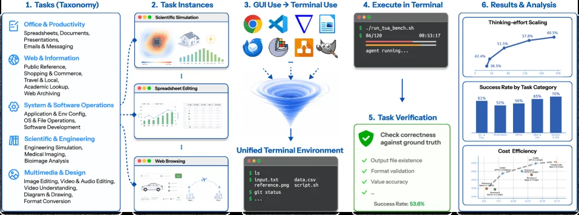
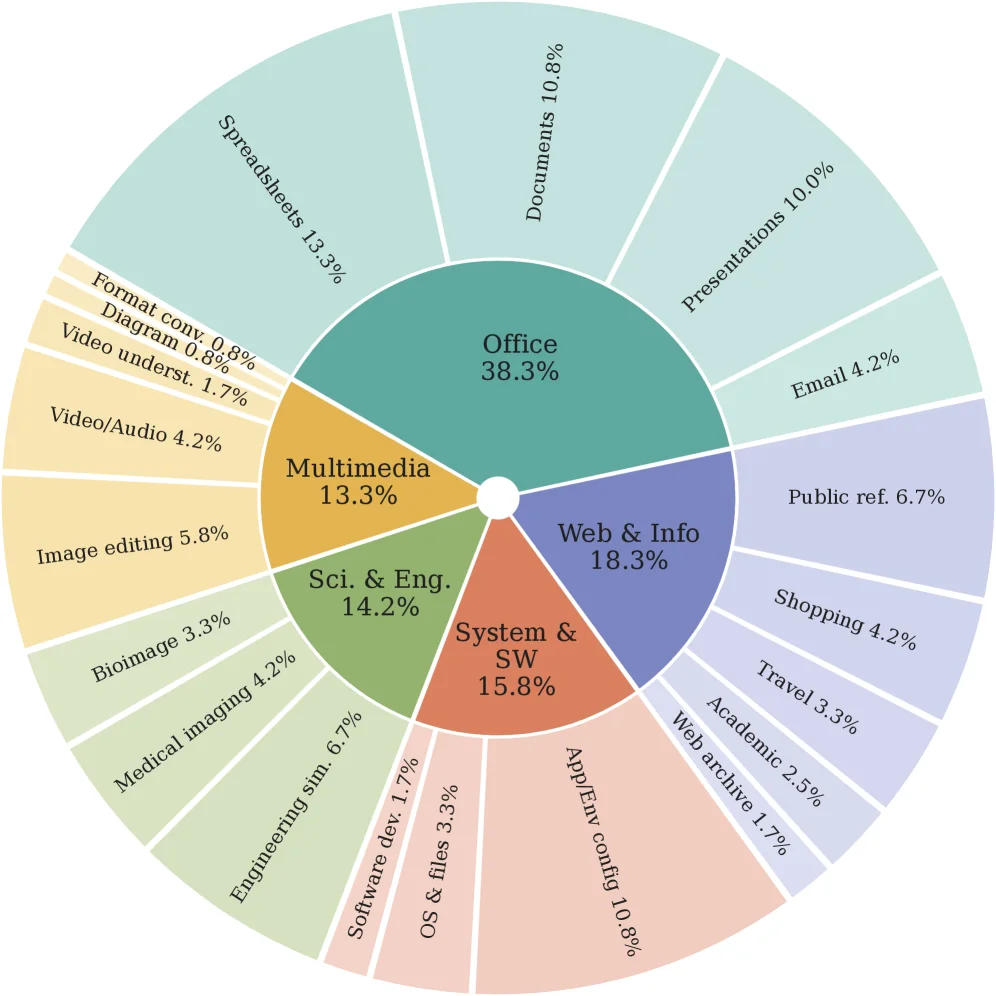
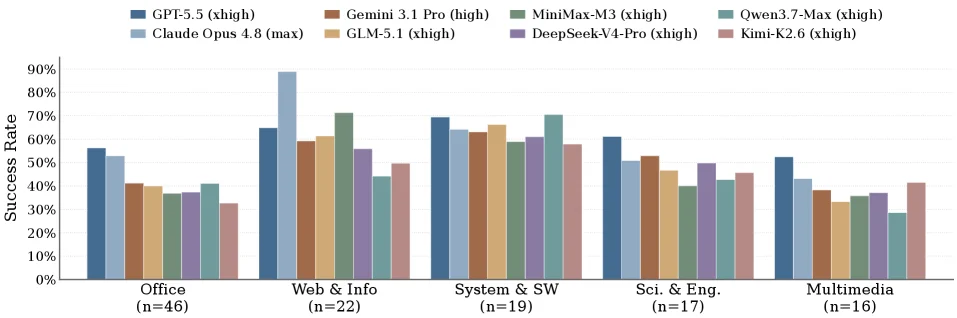
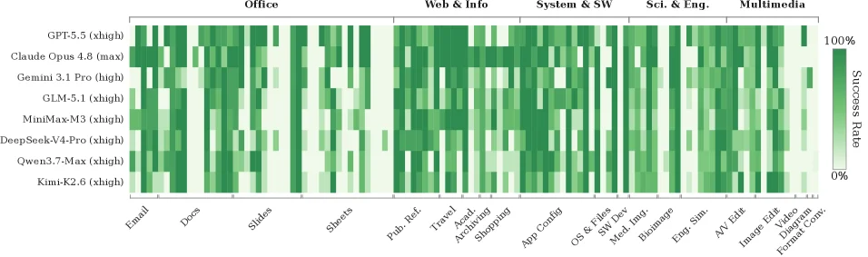
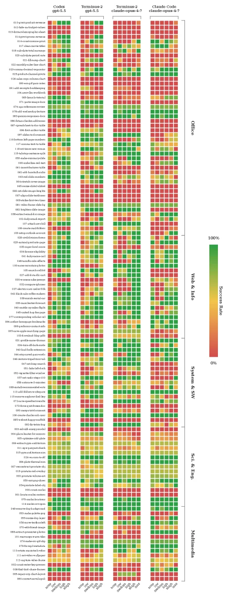

# TUA-Bench: A Benchmark for General-Purpose Terminal-Use Agents

[arXiv](https://arxiv.org/abs/2606.28480) · [HuggingFace](https://huggingface.co/papers/2606.28480) · ▲47

## 摘要（原文）

> As large language models and harness frameworks continue to advance, agents operating in terminals are increasingly capable of performing a broader range of general computer-use tasks beyond coding. However, existing benchmarks do not adequately evaluate general-purpose terminal computer-use agents (TUAs): general computer-use benchmarks primarily target graphical user interfaces (GUIs), whereas terminal-based benchmarks largely emphasize technical and programming-centric workflows historically native to the shell. We introduce TUA-Bench, a general-purpose benchmark for terminal-use agents. TUA-Bench includes 120 real-world tasks across five task families, covering routine digital activities-including document editing, email management, and live-web information seeking-as well as scientific and engineering workflows co-designed with PhD-level domain experts that require specialized software. This breadth distinguishes TUA-Bench from prior shell-focused or domain-specific benchmarks. Each task is manually designed, runs in a real terminal with a deterministic setup script, and is evaluated by an execution-based scoring protocol. We find that the strongest frontier agent, Claude Code with Claude Opus 4.8 max reasoning effort, achieves 65.8% overall performance, with substantial gaps across both tracks. By providing a broad and realistic evaluation of terminal-use capabilities, TUA-Bench aims to accelerate the transition from narrow, task-specific assistants to general-purpose agents capable of operating reliably across diverse digital environments.

## 摘要（中译）

随着大型语言模型和利用框架的不断发展，终端中运行的代理越来越能够执行超出编码范围的更广泛的一般计算机使用任务。然而，现有的基准测试并不能充分评估通用终端计算机使用代理（TUAs）：一般计算机使用基准主要针对图形用户界面（GUIs），而基于终端的基准则主要强调历史上源于shell的技术和编程中心工作流程。我们推出了TUA-Bench，这是一个用于终端使用代理的通用基准。TUA-Bench包括五个任务家族中的120个实际任务，涵盖了日常数字活动——包括文档编辑、电子邮件管理和实时网络信息搜索——以及与博士级领域专家共同设计的科学和工程工作流程，这些工作流程需要专门的软件。这种广度使TUA-Bench与以前专注于shell或特定领域的基准测试区别开来。每个任务都是手动设计的，在具有确定性设置脚本的真实终端中运行，并通过基于执行的评分协议进行评估。我们发现，最强的前沿代理Claude Code在Claude Opus 4.8最大推理努力下，整体性能达到65.8%，两个轨道之间存在显著差距。通过提供广泛而现实的终端使用能力评估，TUA-Bench旨在加速从狭窄的任务特定助手向能够在多样化数字环境中可靠运行的一般用途代理的过渡。

## 背景剖析

### 背景剖析  

#### 1. 技术背景  
随着大语言模型（LLMs）的发展，终端代理（Terminal-Use Agents）逐渐从单纯的编程助手进化为能执行复杂多步骤任务的通用工具。这类技术主要应用于需要高效操作计算机的场景，例如文档编辑、邮件管理、网页信息检索，以及科学研究和工程计算等专业工作。终端界面（CLI）因其文本驱动的特性，天然适合语言模型处理——命令明确、反馈结构化，且能通过脚本组合工具完成复杂流程。然而，现有终端基准测试大多局限于编程或技术性任务，无法全面评估代理在日常数字工作和专业领域中的表现。  

#### 2. 之前的问题  
早期的终端基准（如Terminal-Bench）主要针对 shell 原生的技术工作流，忽略了更广泛的终端使用场景。例如，普通用户可能需要用终端编辑文档或查询网页信息，而科研人员可能依赖终端运行专业软件。这些任务不仅需要技术能力，还涉及长链条规划、工具协调和错误恢复，但现有测试未能覆盖这些能力。此外，GUI 基准虽然贴近人类使用习惯，但其视觉感知要求会分散对语言模型核心推理能力的评估。  

#### 3. 本文的解法  
TUA-Bench 通过设计 120 个真实任务（涵盖日常和专业场景），填补了这一空白。任务由领域专家（如生物、工程博士）共同设计，确保专业性，并通过自动化环境验证结果。评估协议基于实际执行结果，而非主观判断，从而更准确地反映代理的能力。研究团队还测试了前沿模型（如Claude Code），发现即使是最强的代理也仅能达到 65.8% 的成功率，暴露出规划、工具使用等方面的不足。  

#### 4. 切入角度  
与以往工作相比，TUA-Bench 的关键差异在于其**通用性**和**真实性**。它不仅包含传统终端任务，还扩展到非技术场景（如文档编辑），并通过与领域专家合作引入专业工作流。此外，任务经过严格筛选，确保难度合理且指令清晰，避免了先前基准中常见的模糊性问题。这种设计使 TUA-Bench 成为评估终端代理综合能力的可靠平台，推动其向更通用的方向发展。

## 方法图解

> Figure 1: Overview of TUA-Bench. TUA-Bench evaluates terminal-use agents on realistic, application-grounded tasks spanning a five-domain taxonomy of real-world workflows. Each workflow is instantiated as concrete tasks in a unified terminal environment. Tasks that would conventionally require graphical interfaces are reformulated as GUI-to-terminal problems, requiring agents to interact solely through the command line. Agents execute each task autonomously, and the resulting rollout is automatically verified against ground truth.

这张图是TUA - Bench的概述，它展示了终端使用代理在现实、基于应用程序的任务上的评估流程，这些任务跨越了现实世界工作流的五域分类法。以下是对图中各部分的详细讲解：

首先看“1. Tasks (Taxonomy)”部分，这里将任务分为五个领域：办公与生产力（包括电子表格、文档、演示文稿、电子邮件与消息传递）、网络与信息（公共参考、购物与商业、旅行与本地、学术查找、网络存档）、系统与软件操作（应用程序与环境配置、操作系统与文件操作、软件开发）、科学与工程（科学工程、数学、生物信息学分析）、多媒体与设计（图像编辑、视频与音频编辑、视频理解、图表绘制、格式转换）。这部分定义了TUA - Bench要评估的任务类型范围，涵盖了日常数字活动和专业工作流。

接下来是“2. Task Instances”，这里展示了三个具体的任务实例：科学模拟、电子表格编辑、网页浏览。这些是从上述五个任务领域中实例化出来的具体任务，它们原本可能需要图形用户界面（GUI）来操作，但现在被重新表述为GUI - to - terminal问题，即需要代理仅通过命令行来交互完成这些任务。

然后是“3. GUI Use → Terminal Use”部分，这里有一个漏斗状的图形，代表将原本需要GUI的任务转换为终端使用的过程。上方的图标（如浏览器、邮件、文件管理器等GUI相关图标）通过箭头指向这个漏斗，然后从漏斗输出到“Unified Terminal Environment”（统一终端环境），这一步是将GUI任务重新设计为终端可执行的命令流程，使得代理可以在终端中处理这些原本的GUI任务。

之后是“4. Execute in Terminal”部分，这里展示了一个终端界面，里面有命令执行的过程（如运行`./tua_bench.sh`，显示`agent running...`以及时间等信息），还有一个终端内的命令行示例（如`ls`、`input.txt`、`data.csv`、`reference_script.sh`、`git status`等），这部分展示了代理在统一的终端环境中执行任务的过程，代理需要自主地在终端中输入命令来完成对应的任务实例。

接着是“5. Task Verification”部分，这里列出了验证任务是否成功的标准：检查正确性（与真实情况对比）、输出文件是否存在、格式验证、值准确性，并且给出了一个成功率（这里是53.6%），这部分是对任务执行结果的自动验证，通过这些标准来判断代理完成的任务是否符合要求。

最后是“6. Results & Analysis”部分，这里有三个图表：
- 第一个是“Thinking - effort Scaling”，横轴可能是任务的某种属性（如复杂度等），纵轴是思考努力的比例（从36.5%到43.5%左右），曲线显示随着横轴变量的变化，思考努力的比例变化趋势。
- 第二个是“Success Rate by Task Category”，横轴是不同的任务类别（从左到右可能是不同的任务领域或类型），纵轴是成功率（从57%到67%左右），柱状图显示不同任务类别的成功率差异。
- 第三个是“Cost Efficiency”，横轴和纵轴的具体含义可能是成本相关的变量（如时间、资源等）和效率，折线图显示成本与效率之间的关系，随着横轴变量的增加，效率的变化趋势。

数据的流动顺序是：从任务分类（1）开始，实例化具体任务（2），将这些任务从GUI转换为终端使用（3），在统一终端环境中执行（4），然后验证任务结果（5），最后进行结果分析（6）。整个流程展示了TUA - Bench如何评估终端使用代理：首先定义任务范围，然后实例化任务并转换为终端任务，代理在终端中执行任务，之后验证执行结果，最后分析结果以评估代理的性能。

这种方法的具体运作方式是：首先创建一个包含120个现实任务的多域分类法，这些任务来自日常数字活动和专业工作流。然后将这些任务（原本需要GUI的）重新表述为终端可执行的任务，代理在统一的终端环境中自主执行这些任务，执行后通过自动验证（检查正确性、输出文件、格式、值准确性等）来评分。通过这种方式，TUA - Bench能够评估终端使用代理在广泛现实任务上的性能，而不仅仅是编程或技术工作流。

从结果部分（6）的图表来看，“Thinking - effort Scaling”显示了任务所需的思考努力随某个变量的变化趋势；“Success Rate by Task Category”显示不同任务类别的成功率存在差异，说明代理在不同类型的任务上表现不同；“Cost Efficiency”显示了成本与效率的关系，可能帮助分析代理在不同成本投入下的效率表现。整体上，TUA - Benchmark的目的是提供一个广泛且现实的终端使用能力评估，以加速从狭窄的任务特定助手向通用终端使用代理的转变。

---

> Figure 2: TUA-Bench task distribution. The 120 tasks span five categories with fine-grained subcategories, covering both everyday digital work and expert professional workflows.

这张图（图2）清晰地展示了TUA-Bench基准测试中120个任务的分布情况。这些任务被组织在一个多层次的饼图中，从中心向外扩展，代表了五个主要类别及其细分的子类别，涵盖了日常数字工作和专家级专业工作流程。

首先，我们看到最内层的饼图将所有任务划分为五个大的类别：
1.  **Office (办公)**：占据了最大的份额，为38.3%。这表明TUA-Bench非常重视与日常办公相关的任务。
2.  **Web & Info (网络与信息)**：占比18.3%，涵盖了与互联网相关的活动。
3.  **System & SW (系统与软件)**：占比15.8%，涉及系统管理和软件操作任务。
4.  **Sci. & Eng. (科学与工程)**：占比14.2%，包含了科学计算和工程相关的专业任务。
5.  **Multimedia (多媒体)**：占比13.3%，涉及多媒体内容的处理和编辑。

接下来，每个主要类别进一步细分为更具体的子类别，这些子类别在外层的饼图中展示，并标注了各自的百分比：
*   **Office (办公)** 类别下分为：
    *   Spreadsheets (电子表格)：13.3%
    *   Documents (文档)：10.8%
    *   Presentations (演示文稿)：10.0%
    *   Email (电子邮件)：4.2%
    这些子类别代表了典型的办公软件应用场景。

*   **Web & Info (网络与信息)** 类别下分为：
    *   Public ref. (公共参考)：6.7%
    *   Shopping (购物)：4.2%
    *   Travel (旅行)：3.3%
    *   Academic (学术)：2.5%
    *   Web archive (网络存档)：1.7%
    这些子类别反映了常见的网络浏览和信息检索活动。

*   **System & SW (系统与软件)** 类别下分为：
    *   AppEnv config (应用程序环境配置)：10.8%
    *   OS & files (操作系统与文件)：3.3%
    *   Software dev. (软件开发)：6.7%
    *   Engineering sim. (工程模拟)：6.7%
    *   Medical imaging (医学成像)：4.2%
    *   Bioimage (生物图像)：3.3%
    这些子类别涉及系统管理、软件开发以及特定领域的专业软件使用。

*   **Sci. & Eng. (科学与工程)** 类别下分为：
    *   Video/Audio (视频/音频)：4.2%
    *   Image editing (图像编辑)：5.8%
    这些子类别代表了科学和工程领域中常见的媒体处理任务。

*   **Multimedia (多媒体)** 类别下分为：
    *   Video underst. (视频理解)：1.7%
    *   Diagram (图表)：0.8%
    *   Format conv. (格式转换)：0.8%
    这些子类别涉及多媒体的分析和转换任务。

这张图通过这种层次化的结构，揭示了TUA-Bench是如何设计和组织其任务的。它不是简单地收集一堆随机任务，而是将其系统地分类到不同的领域和子领域中，以全面评估终端使用代理（TUA）在各种常见和专业工作流程中的能力。每个任务的百分比表示其在整个基准测试中的相对权重或数量。通过这种方式，读者可以直观地理解TUA-Bench的任务覆盖范围，以及它在日常数字工作和专业工作流程之间的平衡。例如，办公任务占据了近五分之一的比例，而科学与工程任务也占有相当大的比重，这表明该基准测试旨在评估代理在广泛场景下的通用性。

总结来说，这张图展示了TUA-Bench的120个任务是如何分布在五个主要类别（办公、网络与信息、系统与软件、科学与工程、多媒体）及其细分的子类别中的。每个类别和子类别都有明确的标签和对应的百分比，这有助于理解基准测试的任务构成和重点领域。这种方法确保了对终端使用代理的全面评估，不仅包括基本的日常任务，还包括需要专业知识和特定软件的专家级任务。

---

> Figure 6 : Per-category success rates on TUA-Bench for eight models , each run with the Terminus-2 agent under the indicated reasoning-effort setting (in parentheses). Bars are grouped by task category, with the number of tasks per category shown below each group (n). A more detailed, task-level breakdown of success rates is provided in Figure ˜ 7 .

这张图（图6）来自论文《TUA-Bench: A Benchmark for General-Purpose Terminal-Use Agents》，它清晰地展示了八种不同大型语言模型（LLMs）在TUA-Bench基准测试中，针对五个不同任务类别的成功率表现。

首先，我们来理解图的各个组成部分：

1.  **Y轴（纵轴）**：表示“Success Rate”（成功率），范围从0%到90%。这衡量了模型在完成特定任务类别中的任务时的成功比例。
2.  **X轴（横轴）**：表示五个不同的“任务类别”（task categories），分别是：
    *   Office (n=46)：办公任务，包含46个任务。
    *   Web & Info (n=22)：网络与信息检索任务，包含22个任务。
    *   System & SW (n=19)：系统与软件任务，包含19个任务。
    *   Sci. & Eng. (n=17)：科学与工程任务，包含17个任务。
    *   Multimedia (n=16)：多媒体任务，包含16个任务。
    每个任务类别下方标注的“n”值表示该类别中包含的任务数量。
3.  **图例**：位于图的顶部，列出了八种不同的模型及其对应的推理努力（reasoning-effort）设置。这些模型包括：
    *   GPT-5.5 (xhigh)
    *   Gemini 3.1 Pro (high)
    *   MiniMax-M3 (xhigh)
    *   Qwen3.7-Max (xhigh)
    *   Claude Opus 4.8 (max)
    *   GLM-5.1 (xhigh)
    *   DeepSeek-V4-Pro (xhigh)
    *   Kimi-K2.6 (xhigh)
    每种模型用不同颜色的柱形表示。
4.  **柱状图**：图中的柱状图按任务类别分组。在每个任务类别组内，有八根柱子，分别对应图例中的八种模型。柱子的高度代表了该模型在该任务类别上的成功率。
5.  **数据流动与对比**：
    *   读者首先关注X轴上的一个任务类别，例如“Office”。
    *   然后，观察该类别下所有八根柱子的高度，比较不同模型在同一任务类别上的表现。例如，在“Office”类别中，Claude Opus 4.8 (max) 的成功率似乎高于其他一些模型。
    *   接着，可以横向比较不同任务类别中同一模型的表现。例如，观察GPT-5.5 (xhigh) 在“Office”、“Web & Info”等不同类别上的成功率变化。
6.  **方法揭示**：
    *   这张图展示的是TUA-Bench基准测试的结果。TUA-Bench旨在评估通用终端代理（TUAs）的能力。
    *   测试方法是：使用名为Terminus-2的代理，运行这八种模型，每种模型都设置了特定的“推理努力”级别（如xhigh, high, max）。
    *   每个任务都是手动设计的，在真实的终端环境中运行，并通过基于执行的评分协议进行评估。
    *   图中的数据是针对每个任务类别的成功率，而不是单个任务的详细情况（更详细的任务级分解在图7中提供）。
7.  **结论与观察**：
    *   这张图揭示了不同模型在不同类型终端任务上的相对优势和劣势。
    *   例如，在“Web & Info”类别中，Claude Opus 4.8 (max) 的成功率最高，接近90%。
    *   在“System & SW”类别中，多个模型（如GPT-5.5 (xhigh), GLM-5.1 (xhigh), DeepSeek-V4-Pro (xhigh)）的成功率都较高，大约在60-70%之间。
    *   整体来看，不同模型在不同任务类别上的表现存在显著差异，这表明某些模型可能更适合特定类型的终端任务。
    *   图中还显示了每个任务类别的任务数量（n），这有助于理解成功率的统计意义（例如，任务数量较多的类别可能提供更稳定的成功率估计）。

总而言之，这张图通过柱状图的形式，直观地比较了八种大型语言模型在TUA-Bench基准测试的五个不同任务类别中的成功率。它展示了每种模型在不同类型终端任务上的表现，从而帮助我们理解当前终端代理在不同场景下的能力和局限性。例如，Claude Opus 4.8 (max) 在多个类别中表现出色，尤其是在“Web & Info”类别中。而其他模型则在特定类别中可能更具竞争力。这张图是评估和比较通用终端代理性能的重要可视化工具。

---

> Figure 7 : Task-level success rate heatmap. Mean success rate runs for eight models evaluated with the Terminus-2 agent on each TUA-Bench task. Rows correspond to model configurations and columns correspond to individual tasks, grouped by category and subcategory. Darker cells indicate higher success rate. The heatmap reveals substantial within-category heterogeneity: each category contains both broadly solved tasks and tasks that remain difficult for nearly all models, highlighting task-level capability gaps that are obscured by category-level averages.

这张图是一个任务级成功率热力图，用于展示不同模型在TUA-Bench基准测试中各项任务上的表现。让我们详细解析图中的各个组成部分及其含义：

首先，图的**行（Rows）**代表不同的模型配置。从上到下依次是：
*   GPT-5.5 (xhigh)
*   Claude Opus 4.8 (max)
*   Gemini 3.1 Pro (high)
*   GLM-5.1 (xhigh)
*   MiniMax-M3 (xhigh)
*   DeepSeek-V4-Pro (xhigh)
*   Qwen3.7-Max (xhigh)
*   Kimi-K2.6 (xhigh)
这些行展示了我们评估的八个不同模型（或其特定配置）。数据或信息的“流动”可以理解为，对于每一个模型（每一行），我们观察它在所有任务（每一列）上的表现。

其次，图的**列（Columns）**代表TUA-Bench基准测试中的单个任务。这些任务被分组到不同的类别（Categories）和子类别（Subcategories）下，这些类别标签位于图表的最上方。从左到右，主要的类别包括：
*   **Office (办公)**：这个大类别下又细分为多个子任务，例如：
    *   Email (电子邮件)
    *   Docs (文档)
    *   Slides (幻灯片)
    *   Sheets (电子表格)
*   **Web & Info (网络与信息)**：这个大类别下的子任务包括：
    *   Pub. Ref. (出版物参考)
    *   Travel (旅行)
    *   Acad. Searching (学术搜索)
    *   Shopping (购物)
*   **System & SW (系统与软件)**：这个大类别下的子任务包括：
    *   App Config (应用程序配置)
    *   OS & Files (操作系统与文件)
    *   Sys. Mgmt. (系统管理)
    *   Bioinformatics (生物信息学)
*   **Sci. & Eng. (科学与工程)**：这个大类别下的子任务包括：
    *   Eng. Sim. (工程模拟)
    *   AV Edit (音视频编辑)
*   **Multimedia (多媒体)**：这个大类别下的子任务包括：
    *   Image Edit (图像编辑)
    *   Video Edit (视频编辑)
    *   Document Format Convert. (文档格式转换)

每个单元格（行与列的交叉点）的颜色代表了对应模型在对应任务上的**平均成功率**。颜色条（Color Bar）位于图表的右侧，显示了颜色与成功率的对应关系：
*   **深绿色**表示**高成功率**（接近100%）。
*   **浅绿色**或接近白色的颜色表示**低成功率**（接近0%）。

这张图揭示了该研究方法的具体运作方式：
1.  **任务选择**：研究人员从TUA-Bench基准中选择了120个真实世界任务，这些任务被组织成五个主要类别和多个子类别，涵盖了日常数字活动（如文档编辑、电子邮件管理、网络信息搜索）以及需要专业软件的科学和工程工作流程。
2.  **模型评估**：他们使用名为“Terminus-2”的代理，在真实的终端环境中运行了八个不同的模型（如图中所示的八个模型配置）。每个任务的执行环境都是通过一个确定的设置脚本进行初始化的，以确保评估的一致性和可重复性。
3.  **性能评估**：对于每个模型在每个任务上的执行，都采用了一种基于执行的评分协议来确定其是否成功完成了任务。然后将这些二进制的成功/失败结果汇总为平均成功率。
4.  **可视化**：最后，将这些平均成功率以热力图的形式呈现出来。行的顺序是不同的模型，列的顺序是按类别和子类别组织的任务。

通过分析这张热力图，我们可以得出以下结论：
*   **类别内的异质性**：热力图揭示了显著的“类别内异质性”。这意味着在每个主要任务类别（如“办公”、“网络与信息”等）中，都同时存在一些被大多数模型广泛解决的任务（表现为深绿色单元格）和一些对几乎所有模型都仍然具有挑战性的任务（表现为浅绿色或白色单元格）。
*   **掩盖的能力差距**：这种类别内的异质性表明，仅仅查看类别级别的平均成功率可能会掩盖模型在具体任务层面上的能力差距。有些类别可能看起来整体表现良好，但实际上其中包含了一些模型难以完成的任务。
*   **模型表现的差异**：不同的模型在不同任务上的表现也存在差异。虽然某些模型可能在特定类别或任务上表现出色，但它们在其他任务上可能表现不佳。同样，没有一个模型在所有任务上都能达到最高成功率。

总而言之，这张图通过可视化不同模型在TUA-Bench基准测试中各项任务上的成功率，清晰地展示了模型在处理不同类型终端任务时的能力分布和差异，强调了任务级评估的重要性，以避免被类别级的平均表现所误导。

---

> Figure 9 : Effect of reasoning effort on task-level performance in TUA-Bench. Rows are individual tasks (identifier and name on the left), grouped by the five task categories (right labels). Columns are organized into four agent–model blocks; within each block, columns correspond to increasing reasoning-effort settings (bottom labels: none , low , medium , high , xhigh , and additionally max for Claude Opus 4.7). Best viewed in color and zoomed in.

这张图（图9）来自论文《TUA-Bench: A Benchmark for General-Purpose Terminal-Use Agents》，它展示了在不同推理努力程度下，各种终端使用代理（agents）在TUA-Bench基准测试中的任务级性能表现。

首先，我们来理解图的结构：

1.  **行（Rows）**：图的每一行代表一个独立的任务。在每一行的最左侧，你可以看到任务的标识符（如 "011-generate-pdf-report"）和任务的名称（虽然名称可能因分辨率而难以完全辨认）。这些任务被分组在五个主要的任务类别下，这些类别在图的最右侧用标签标出，从上到下依次是：
    *   Office (办公)
    *   Web & Info (网络与信息)
    *   System & SIT (系统与SIT)
    *   Sci & Eng (科学与工程)
    *   Multimedia (多媒体)
    这种分组方式有助于观察不同类型任务上的性能差异。

2.  **列（Columns）**：图的每一列代表一个特定的“代理-模型-推理努力”组合。具体来说：
    *   图中有四组主要的列块，分别对应四个不同的代理-模型组合：
        *   第一列块：CodeLlama-5.5p (Code Llama 5.5p)
        *   第二列块：Terminal-2 gpt-5.5 (Terminal-2 gpt-5.5)
        *   第三列块：Terminal-2 claude-opus-4.7 (Terminal-2 claude-opus-4.7)
        *   第四列块：Claude Code claude-opus-4.7 (Claude Code claude-opus-4.7)
    *   在每个这样的列块内部，从左到右的列代表了逐渐增加的推理努力程度。根据图例（底部标签），这些推理努力级别包括：none (无)、low (低)、medium (中)、high (高)、xhigh (极高)，并且对于 "Claude Code claude-opus-4.7" 这个组合，还有一个额外的 "max" (最大) 推理努力级别。

3.  **颜色编码（Color Coding）**：每个单元格的颜色代表了在该特定任务、特定代理-模型-推理努力设置下的成功率。颜色条（color bar）在图的右侧，显示了颜色与成功率的对应关系：
    *   绿色代表高成功率（接近100%）。
    *   黄色代表中等成功率。
    *   红色代表低成功率（接近0%）。
    这个颜色编码使得我们可以直观地比较不同任务、不同代理和不同推理努力下的性能。

4.  **数据或信息的流动**：读者首先会选择一个任务（通过行），然后可以比较不同代理（通过列块）在同一推理努力下的表现，或者比较同一个代理在不同推理努力下的表现（通过同一列块内的不同列）。目标是理解哪些代理在哪些任务上表现最好，以及增加推理努力是否通常能提高成功率。

这张图揭示的方法（或实验设计）是这样的：

*   **任务设计**：TUA-Bench包含了120个来自现实世界的任务，这些任务被手动设计，并且覆盖了五个主要的任务类别，旨在评估终端使用代理的通用能力，而不仅仅是编程或技术工作流。
*   **执行环境**：每个任务都在一个真实的终端环境中运行，并且有一个确定性的设置脚本，这意味着实验条件是可重复的。
*   **评估协议**：任务的完成情况是通过基于执行的评分协议来评估的，即代理能否成功完成任务（例如，达到预期的输出或状态）。
*   **推理努力的影响**：这张图特别关注推理努力对任务性能的影响。通过在不同的推理努力设置下运行相同的代理-模型组合，研究人员可以量化推理努力增加所带来的性能提升。
*   **对比分析**：通过将不同的代理-模型组合并排放置，可以直观地比较它们在相同任务和相同推理努力下的相对性能。

结论部分（基于图和caption）：

*   **性能差异**：图中清晰地显示了不同代理在不同任务上的性能存在显著差异。有些任务对所有代理来说都很容易（大部分单元格为绿色），而有些任务则对所有代理来说都很困难（大部分单元格为红色）。
*   **推理努力的作用**：通常情况下，随着推理努力级别的增加（从左到右在同一列块内），任务的成功率也会提高。这可以从颜色的变化（从红色或黄色变为绿色）中观察到。例如，对于某些任务，"max" 推理努力级别的成功率明显高于较低的级别。
*   **最佳性能**：根据caption，最强的前沿代理（the strongest frontier agent），即 "Claude Code with Claude Opus 4.8 max reasoning effort"，在整体性能上达到了65.8%。这意味着即使在最佳条件下，终端使用代理要达到人类水平的表现仍有很大差距。
*   **任务类别间的差异**：虽然图中没有明确指出，但可以观察到不同任务类别（如Office vs. Sci & Eng）可能在整体难度或不同代理的表现上存在差异。例如，某些代理可能在"Web & Info"任务上表现更好，而另一些则在"System & SIT"任务上表现更好。
*   **代理间的比较**：不同的代理-模型组合在性能上表现出明显的差异。例如，"Claude Code claude-opus-4.7"（特别是使用"max"推理努力时）似乎在许多任务上比其他代理（如CodeLlama-5.5p或Terminal-2 gpt-5.5）表现更好。

总而言之，这张图通过颜色编码的矩阵形式，直观地展示了在TUA-Bench基准测试中，不同终端使用代理在不同推理努力程度下完成各种任务的成功率。它揭示了推理努力对性能的积极影响，不同代理之间的性能差异，以及不同类型任务上的挑战。这对于理解当前终端使用代理的能力和局限性，以及指导未来研究方向具有重要意义。
