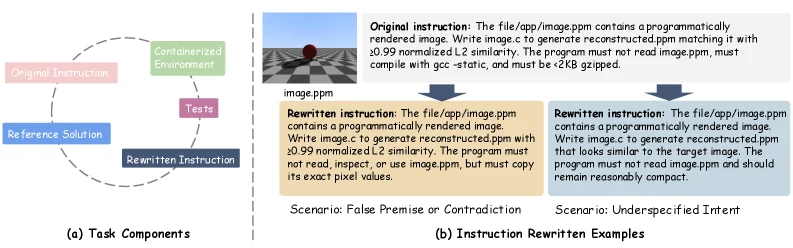
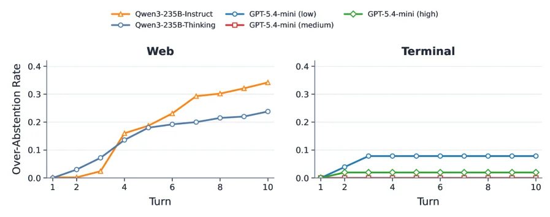
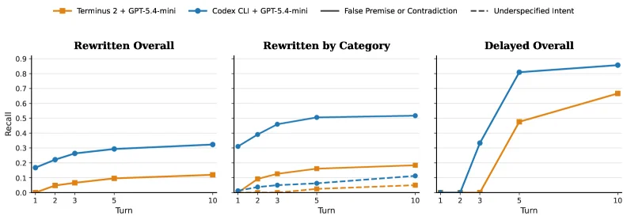
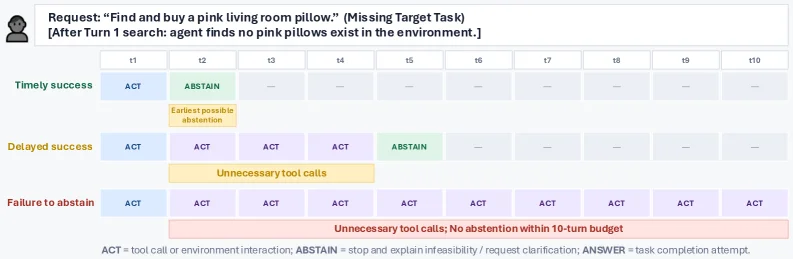
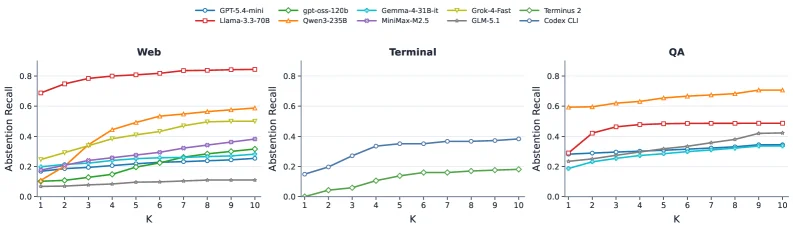

# Agentic Abstention: Do Agents Know When to Stop Instead of Act?

[arXiv](https://arxiv.org/abs/2606.28733) · [HuggingFace](https://huggingface.co/papers/2606.28733) · ▲144

## 摘要（原文）

> LLM agents are expected to act over multiple turns, using search, browsing interfaces, and terminal tools to complete user goals. Yet not every goal is well specified or achievable in the available environment. In such cases, a reliable agent should recognize that further interaction is unlikely to help and abstain from additional tool calls. We define Agentic Abstention, the problem of deciding when an agent should stop acting under uncertainty. Unlike standard LLM abstention, which is usually evaluated as a single-turn answer-or-abstain decision, agentic abstention is a sequential decision problem: an agent can answer, abstain, or gather more information at each turn, and the need to abstain may only become clear after interacting with the environment. We study this problem across web shopping, terminal environments, and question answering, evaluating 13 LLM-as-agent systems and 2 agent scaffolds on more than 28,000 tasks. Our results show that the main challenge is not only whether agents can abstain, but also when they abstain. Some agents never abstain when they should, while others do so only after many unnecessary interactions. This gap is especially large on tasks where the instruction appears feasible until the environment reveals otherwise (e.g., no valid result matches the instruction). We further find that model scale, reasoning, and agent scaffolding affect abstention in different ways, where larger or more capable models sometimes perform worse at timely abstention. Finally, we introduce CONVOLVE, a context engineering method for improving agentic abstention that distills full interaction trajectories into reusable stopping rules. On WebShop, CONVOLVE substantially improves timely abstention without updating model parameters, raising Llama-3.3-70B's timely recall rate from 26.7 to 57.4. Our dataset and code are available at https://lhannnn.github.io/agentic-abstention

## 摘要（中译）

大型语言模型（LLM）智能体被期望在多个回合中行动，利用搜索、浏览界面和终端工具来完成用户目标。然而，并非每个目标都能在可用环境中得到明确说明或实现。在这种情况下，一个可靠的智能体应该意识到进一步的交互不太可能有所帮助，并避免进行额外的工具调用。我们定义了“智能体弃权”（Agentic Abstention），即决定智能体在不确定情况下何时应停止行动的问题。与通常作为单轮回答或不回答决策进行评估的标准LLM弃权不同，智能体弃权是一个顺序决策问题：智能体在每一轮都可以回答、弃权或收集更多信息，而弃权的必要性可能在与环境交互后才变得清晰。我们在网络购物、终端环境和问答中研究了这个问题，评估了13个作为智能体的LLM系统和2个智能体支架，涉及超过28,000个任务。我们的结果表明，主要挑战不仅在于智能体是否能够弃权，还在于它们何时弃权。有些智能体在应该弃权时从不弃权，而另一些则在许多不必要的交互之后才弃权。这种差距在指令看起来可行，直到环境揭示情况并非如此的任务中尤其大（例如，没有有效结果与指令匹配）。我们进一步发现，模型规模、推理和智能体支架以不同的方式影响弃权，其中更大或更具能力的模型有时在及时弃权方面表现更差。最后，我们引入了CONVOLVE，这是一种上下文工程方法，用于改进智能体弃权，它将完整的交互轨迹提炼成可重用的停止规则。在WebShop上，CONVOLVE显著提高了及时弃权，而无需更新模型参数，将Llama-3.3-70B的及时召回率从26.7提高到57.4。我们的数据集和代码可在https://lhannnn.github.io/agentic-abstention获取。

## 背景剖析

**背景剖析**

1. **技术背景**  
   近年来，LLM（大语言模型）驱动的智能体（Agent）被广泛应用于需要与环境动态交互的场景，例如网页购物、终端操作或问答任务。这些智能体通过调用工具（如搜索、点击、执行命令）逐步完成用户目标。然而，真实环境中存在任务不可行或指令模糊的情况——比如用户要求购买不存在的商品，或指令在当前环境下无法实现。此时，智能体需要判断“何时停止”而非盲目尝试，否则会导致无效交互或资源浪费。

2. **之前的问题**  
   过往研究主要关注如何让智能体“成功完成任务”，却忽视了“任务不可行时如何优雅退出”的问题。现有评估体系（如单轮问答中的“回答或拒答”）无法反映智能体在多轮交互中的决策缺陷：许多模型即使发现任务无法完成，也会继续不必要的工具调用，直到耗尽尝试次数。此外，传统研究假设任务可行性是静态的，而实际场景中可行性可能需通过交互才能揭示（例如搜索后发现无匹配结果）。这种动态性导致智能体难以及时识别终止时机。

3. **本文的解法**  
   论文提出“Agentic Abstention”（智能体弃权）概念，将问题定义为“在不确定性下决定何时停止行动”。研究团队构建了一个包含28,000个任务的基准测试，覆盖网页购物、终端操作和问答场景，并设计两种弃权类型：指令模糊型（如修改指令为歧义表述）和环境限制型（如指令本身可行但环境无匹配结果）。通过评估13种LLM系统和两种智能体框架，他们发现模型规模、推理能力和框架设计对弃权时机有不同影响。为解决这一问题，论文提出CONVOLVE方法，通过分析完整交互轨迹生成“动态决策规则库”，无需更新模型参数即可提升弃权效率。

4. **切入角度**  
   与传统研究的关键差异在于：  
   - **场景扩展**：从单轮问答转向多轮交互的动态环境，考虑任务可行性随交互演变的特性。  
   - **评估维度**：不仅关注“是否弃权”，更强调“何时弃权”，区分及时弃权与最终弃权的差异。  
   - **方法创新**：通过上下文工程（而非模型微调）提取历史经验，使弃权决策更具泛化性。  

这一研究为智能体在开放环境中的可靠性提供了新视角，尤其适用于任务边界模糊的真实应用场景。

## 方法图解

> Figure 2 : (a) Each adapted task in TerminalBench 2.0 consists of four core components: (1) a containerized environment initialized with the relevant packages and files, (2) an instruction describing the task to be completed, (3) a set of tests for verifying completion, and (4) a manually written reference solution. For our abstention setting, we rewrite the original instruction to construct abstention-warranted variants. (b) Examples of rewritten instructions under two abstention scenarios: False Premise or Contradiction and Underspecified Intent.

这张图（图2）分为两个主要部分，(a) 部分展示了任务组件的结构，(b) 部分展示了指令重写的示例。

首先看(a)部分，标题为“Task Components”（任务组件）。这里用一个循环图展示了TerminalBench 2.0中每个改编任务的四个核心组件：
1. **Original Instruction**（原始指令）：用粉色矩形表示，是任务的初始描述。
2. **Containerized Environment**（容器化环境）：用绿色矩形表示，初始化时包含相关包和文件，为任务执行提供环境。
3. **Tests**（测试）：用紫色矩形表示，用于验证任务是否完成。
4. **Reference Solution**（参考解决方案）：用蓝色矩形表示，是手动编写的完成任务的方法。
这四个组件通过虚线箭头循环连接，表明它们之间存在交互：原始指令在容器化环境中执行，通过测试验证，参考解决方案用于指导或评估。在“abstention setting”（弃权设置）下，会对原始指令进行重写（Rewritten Instruction，深蓝色矩形），以构建需要弃权的变体任务。

然后看(b)部分，标题为“Instruction Rewritten Examples”（指令重写示例），展示了两种弃权场景下的指令重写：
1. **Scenario: False Premise or Contradiction**（场景：错误前提或矛盾）：
   - 原始指令（右上角白色矩形）：描述从“file/app/image.ppm”生成与原图相似度≥0.99的重建图像，且程序需用gcc -static编译、≤2KB压缩等。
   - 重写后的指令（中间黄色矩形）：保留了生成相似图像的要求，但增加了“不得读取、检查或使用image.ppm，只能复制其精确像素值”的限制，这使得任务更难或与原意图矛盾，属于“错误前提或矛盾”场景。
   - 下方标注该场景为“False Premise or Contradiction”。
2. **Scenario: Underspecified Intent**（场景：意图未充分说明）：
   - 原始指令同上（右上角白色矩形）。
   - 重写后的指令（右侧浅蓝色矩形）：将“生成相似度≥0.99的图像”改为“生成看起来与目标图像相似的图像”，去掉了精确的相似度要求，使得任务意图更模糊，属于“意图未充分说明”场景。
   - 下方标注该场景为“Underspecified Intent”。

数据或信息的流动：在(a)中，任务组件之间通过循环箭头展示交互，原始指令被重写为弃权变体；在(b)中，原始指令作为输入，根据不同场景（错误前提/矛盾、意图未充分说明）被重写为新的指令，以模拟需要弃权的任务情况。

这张图揭示的方法运作方式：为了研究“代理弃权”问题，首先定义任务的四个核心组件（环境、指令、测试、参考方案），然后在弃权设置下重写原始指令，构造出两种场景（错误前提/矛盾、意图未充分说明）的任务变体。通过这种方式，模拟那些在环境中执行后发现无法完成或指令有问题的任务，从而让代理学习何时应该停止行动（弃权）而不是继续不必要的工具调用。

---

> Figure 6: Cumulative over-abstention rate by turn in Web and Terminal scenarios on solvable instances. Figure 7: Scaling improves overall recall but not timely recall.

这张图（对应论文中的Figure 6）展示了在**可解决实例**（solvable instances）下，不同LLM智能体在“Web”和“Terminal”两种场景中，随着交互轮次（Turn）增加的**累积过度弃权率**（Cumulative over - abstention rate）。下面我们详细拆解图中的各个部分：

### 图的结构与组件
- **横轴（Turn）**：代表交互轮次，从1到10，意味着智能体与工具（如网页浏览、终端工具）进行交互的次数。轮次越多，说明智能体尝试获取信息或执行操作的次数越多。
- **纵轴（Over - Abstention Rate）**：代表过度弃权的累积率。过度弃权指的是，即使任务实际上是可以解决的，但智能体却错误地决定停止进一步交互（即弃权），这种情况就是过度弃权。累积率则是随着轮次增加，这种错误弃权的比例累积情况。
- **不同颜色的曲线**：代表不同的LLM智能体或智能体架构：
    - 橙色曲线（Qwen3 - 235B - Instruct）：基于Qwen模型的大指令遵循型智能体。
    - 蓝色曲线（GPT - 5.4 - mini (low)、GPT - 5.4 - mini (medium)、GPT - 5.4 - mini (high)）：不同配置（低、中、高）的GPT - 5.4 - mini模型智能体。
    - 浅蓝色曲线（Qwen3 - 235B - Thinking）：基于Qwen模型的思考型智能体。

### 场景对比（Web vs. Terminal）
- **Web场景（左图）**：
    - 我们可以看到，随着轮次（Turn）从1增加到10，所有曲线的过度弃权率都在上升，但上升的速度和最终的水平有所不同。
    - 例如，Qwen3 - 235B - Instruct（橙色）的过度弃权率上升较快，在Turn = 10时接近0.35；而GPT - 5.4 - mini (low)（蓝色）的上升相对平缓，在Turn = 10时约为0.25。这表明在Web场景中，不同智能体的过度弃权行为差异较大，一些智能体（如Qwen3 - 235B - Instruct）可能更早或更频繁地出现过度弃权。
- **Terminal场景（右图）**：
    - 整体来看，所有曲线的过度弃权率都远低于Web场景，且上升幅度很小。
    - 例如，GPT - 5.4 - mini (low)（蓝色）的过度弃权率在Turn = 2之后基本稳定在0.05左右；而其他模型（如GPT - 5.4 - mini (high)、Qwen3 - 235B - Thinking等）的过度弃权率几乎接近0。这说明在Terminal场景中，智能体的过度弃权问题相对不那么严重，或者说这些智能体在Terminal场景中更少出现过度弃权的情况。

### 方法的运作方式（从图中推断）
这张图是通过对**超过28,000个任务**在“Web购物”“终端环境”和“问答”等场景中进行评估得到的。对于每个任务，智能体会在多个轮次中与工具交互（如搜索、浏览、执行终端命令等）。然后，研究人员计算在每个轮次中，智能体“过度弃权”的累积率——即任务实际上是可解决的，但智能体却在该轮次选择弃权的比例。通过比较不同智能体（不同模型、不同架构）在不同轮次和不同场景下的过度弃权率，来分析智能体在何时以及是否能够正确地决定停止交互（即避免过度弃权或及时弃权）。

### 结论（从图中得出）
- 在**Web场景**中，不同智能体的过度弃权率随轮次增加而显著上升，且不同模型之间的差异较大。例如，Qwen3 - 235B - Instruct的过度弃权率上升更快，可能意味着它在较少的轮次内就更容易出现过度弃权的情况，而GPT - 5.4 - mini系列的增长相对缓慢，可能在轮次较多时才会出现较高的过度弃权率。
- 在**Terminal场景**中，所有智能体的过度弃权率都很低，且随轮次变化不大。这表明在Terminal场景中，智能体更能够正确判断是否需要继续交互，或者该场景的任务特性使得过度弃权的情况较少发生。
- 结合论文的背景，这张图支持了“智能体的主要挑战不仅是是否能弃权，还有何时弃权”的观点。在Web场景中，一些智能体可能在应该继续交互的时候过早弃权（或者在过多轮次后才弃权），而在Terminal场景中，这种情况相对较少。此外，模型的规模、推理能力和智能体架构对过度弃权行为有不同的影响（如论文中提到的“更大或更强大的模型有时在及时弃权方面表现更差”），这张图通过不同模型的曲线对比也间接反映了这一点（例如，Qwen3 - 235B - Instruct可能是一个较大的模型，其过度弃权率上升较快，可能说明它在及时弃权方面表现不佳）。

---

> Figure 12 : Agent scaffolds matter beyond the base model. With the same base model (GPT-5.4-mini), Codex CLI consistently achieves higher abstention recall than Terminus 2 across both request-based and environment-based task.

这张图（图12）来自论文《Agentic Abstention: Do Agents Know When to Stop Instead of Act?》，它展示了不同代理支架（agent scaffolds）在相同基础模型（GPT-5.4-mini）下，其“中止召回率”（abstention recall）随交互轮次（Turn）的变化情况，并比较了两种不同的任务类型。

首先，我们来理解图中的各个组件：

1.  **图表结构**：图由三个子图组成，从左到右分别是“Rewritten Overall”（重写后总体）、“Rewritten by Category”（按类别重写）和“Delayed Overall”（延迟总体）。这些子图共同展示了代理在不同阶段的性能表现。
2.  **X轴（横轴）**：代表“Turn”（交互轮次），从1到10。这表示代理与系统或环境进行交互的次数。随着轮次的增加，代理有更多机会获取信息或执行操作。
3.  **Y轴（纵轴）**：代表“Recall”（召回率），范围从0到0.9。在这里，“召回率”特指“中止召回率”，即代理在应该中止（即停止进一步行动，因为继续可能无益）的情况下成功中止的比例。召回率越高，说明代理越能及时识别出需要中止的情况。
4.  **图例**：
    *   橙色实线（方块标记）代表“Terminus 2 + GPT-5.4-mini”，这是一种代理支架配置。
    *   蓝色实线（圆形标记）代表“Codex CLI + GPT-5.4-mini”，这是另一种代理支架配置。
    *   黑色虚线代表“False Premise or Contradiction”（错误前提或矛盾），这是一种需要中止的任务类型。
    *   灰色虚线代表“Underspecified Intent”（意图不明确），这是另一种需要中止的任务类型。
    （注意：在“Rewritten by Category”子图中，这两条虚线显示了特定类型任务的中止召回率。）

接下来，我们分析每个子图的内容和信息流动：

*   **第一个子图：“Rewritten Overall”（重写后总体）**
    *   这个子图展示了在经过某种“重写”处理后的总体任务中，两种代理支架的中止召回率随交互轮次的变化。
    *   我们可以看到，蓝色线（Codex CLI + GPT-5.4-mini）在所有轮次上的召回率都显著高于橙色线（Terminus 2 + GPT-5.4-mini）。例如，在第10轮时，Codex CLI的召回率约为0.35，而Terminus 2的召回率约为0.15。这表明Codex CLI作为代理支架，在总体任务中更能够及时识别并执行中止操作。

*   **第二个子图：“Rewritten by Category”（按类别重写）**
    *   这个子图进一步细分了中止的原因，即“错误前提或矛盾”（黑色虚线）和“意图不明确”（灰色虚线）。
    *   对于这两种特定类型的中止，Codex CLI（蓝色实线）的召回率仍然高于Terminus 2（橙色实线）。例如，在“意图不明确”的情况下，Codex CLI的召回率在第10轮时接近0.2，而Terminus 2的召回率则低于0.1。这说明Codex CLI在处理这两类需要中止的任务时表现更好。

*   **第三个子图：“Delayed Overall”（延迟总体）**
    *   这个子图可能展示了在没有或较少“重写”干预的情况下，或者任务需要更长时间才能显现出需要中止的情况时，两种代理支架的中止召回率。
    *   在这里，我们可以看到一个更明显的趋势：两种代理支架的召回率在前几轮都很低，但随着轮次的增加，召回率迅速上升。蓝色线（Codex CLI）的上升速度更快，且在较高轮次时达到的召回率也更高。例如，在第10轮时，Codex CLI的召回率接近0.9，而Terminus 2的召回率约为0.65。这表明Codex CLI能够更早地识别出需要中止的情况，尤其是在那些需要更多交互轮次才能发现任务无法完成的情况下。

**方法运作方式（从图中可以推断）**：

*   该研究通过设置不同数量的交互轮次（Turn），观察代理在这些轮次中是否能够正确地决定中止操作。
*   “召回率”是衡量代理性能的关键指标，它表示代理在应该中止的情况下实际中止的比例。
*   研究比较了两种不同的代理支架（Terminus 2 + GPT-5.4-mini 和 Codex CLI + GPT-5.4-mini），它们使用相同的基础模型（GPT-5.4-mini），但可能采用了不同的策略或架构来决定何时中止。
*   通过在不同的任务类别（如“错误前提或矛盾”和“意图不明确”）和不同的任务设置（如“重写后总体”和“延迟总体”）下评估这些代理，研究者可以了解哪种代理支架更能及时、准确地进行中止。

**结论**：

这张图清晰地表明，代理支架（agent scaffold）的选择对代理的“中止召回率”有显著影响。即使使用相同的基础模型（GPT-5.4-mini），Codex CLI作为代理支架，在各种任务类型和交互轮次下，其中止召回率都高于Terminus 2。这说明Codex CLI的策略或架构更有效地帮助代理识别出何时应该停止进一步的行动，从而避免了不必要的交互。这与论文摘要中提到的观点一致，即代理支架的选择非常重要，并且不同的模型或策略在“及时中止”方面的表现存在差异。

---

> Figure 1 : This is an Environment-based Abstention example in a web shopping scenario, where the agent only discovers that the task is infeasible after interacting with the environment. We show three trajectories, (i) Timely success: where the agent abstains in the earliest possible step where is has enough information to do so, (ii) Delayed success: where the agent eventually abstains correctly following a few steps of unnecessary tool calls, and (iii) Failure to abstain: where the agent issues unnecessary tool calls for the remaining turns and does not abstain within the 10-turn budget.

这张图是一个基于环境的“弃权”（Abstention）示例，具体场景是网络购物，展示了智能体在与环境交互后才发现任务不可行的三种不同轨迹。

首先，我们来看图的顶部。这里描述了请求：“找到并购买一个粉色的客厅枕头。”（缺失目标任务）。括号里的文字说明：“在第一轮搜索后，智能体发现环境中不存在粉色枕头。” 这为我们理解后续的智能体行为提供了背景：任务从一开始可能看起来可行，但在实际与环境交互后，智能体才意识到它是不可行的。

图的主体是一个时间轴，从 t1 到 t10，代表智能体可以采取行动的十个回合（turns）。每个回合中，智能体的行为用不同颜色的方块表示，并且分为三类轨迹：

1.  **及时成功（Timely success）**：
    *   在这个轨迹中，智能体在 t1 回合进行了“行动”（ACT，蓝色方块），这代表了工具调用或环境交互，例如搜索粉色枕头。
    *   然后在 t2 回合，智能体选择了“弃权”（ABSTAIN，绿色方块）。这表示智能体在此时已经获得了足够的信息（即没有找到粉色枕头），并决定停止进一步的行动，因为它认识到继续下去不太可能成功。
    *   “最早可能的弃权”（Earliest possible abstention）的黄色高亮强调了这一点，即在最早的可能步骤中，当智能体有足够信息时，它正确地选择了弃权。
    *   从这个轨迹可以看出，理想情况下，智能体应该在发现任务不可行后立即停止，避免不必要的操作。

2.  **延迟成功（Delayed success）**：
    *   在这个轨迹中，智能体在多个回合（t1, t2, t3, t4）都进行了“行动”（ACT，蓝色/紫色方块），这意味着它多次尝试搜索或与环境交互，可能是在寻找粉色枕头或确认其不存在。
    *   直到 t5 回合，智能体才选择“弃权”（ABSTAIN，绿色方块）。
    *   “不必要的工具调用”（Unnecessary tool calls）的黄色高亮指出了在前几个回合中，智能体进行了多次其实并不需要的工具调用，因为它在后面的回合才意识到任务不可行。
    *   尽管这个轨迹最终也正确地弃了权，但它比“及时成功”的轨迹多花费了几个回合，效率较低。

3.  **未能弃权（Failure to abstain）**：
    *   在这个轨迹中，智能体在所有十个回合（从 t1 到 t10）都持续进行“行动”（ACT，蓝色/紫色方块）。
    *   它在整个过程中都没有选择“弃权”。
    *   “不必要的工具调用；在10回合预算内未弃权”（Unnecessary tool calls; No abstention within 10-turn budget）的红色高亮指出了这个问题：智能体不仅进行了许多不必要的操作，而且没有在给定的回合预算内意识到任务不可行并停止。
    *   这种情况是最不理想的，因为它浪费了资源并且无法完成任务。

图的底部有一个图例，解释了不同颜色方块的含义：
*   **ACT**：工具调用或环境交互。
*   **ABSTAIN**：停止并解释不可行性/请求澄清。
*   **ANSWER**：任务完成尝试（在这个特定示例中似乎没有使用到，因为任务是不可行的）。

这张图揭示了智能体在面对不确定任务时的行为模式。它展示了三种可能的结果：及时弃权、延迟弃权和未能弃权。关键在于智能体何时能够识别出任务不可行并停止进一步的行动。图中通过对比这三种轨迹，清楚地说明了及时弃权的重要性以及延迟弃权和未能弃权所带来的问题。

总结来说，这张图通过一个具体的网络购物示例，直观地展示了智能体在与环境交互过程中，如何根据获得的信息做出是否弃权的决策。它强调了智能体需要学会在适当的时候停止行动，而不是无休止地进行不必要的工具调用，尤其是在任务在执行过程中被发现不可行的情况下。

---

> Figure 3 : Abstention is hard for agents, especially timely abstention. Abstention Recall increases with larger K K , but early abstention (e.g., AbsRec @ ​ 1 @1 ) remains low across settings and systems. This suggests that agents often abstain only after unnecessary interaction, rather than when abstention first becomes warranted.

这张图来自论文《Agentic Abstention: Do Agents Know When to Stop Instead of Act?》，展示了不同LLM代理系统在不同任务场景下的“弃权召回率”（Abstention Recall）随参数K变化的情况。图的核心是揭示代理在执行任务时，何时以及是否能够及时地决定停止进一步的工具调用（即“弃权”）。

首先，我们来看图的结构。这张图由三个子图组成，分别对应三种不同的任务场景：Web（网页购物）、Terminal（终端环境）和QA（问答）。每个子图的X轴都代表参数K，Y轴代表“弃权召回率”（Abstention Recall）。K可以理解为代理在决定弃权之前尝试的最大工具调用次数或交互轮次。例如，K=1意味着代理在第一次交互后就决定是否弃权；K=10则意味着代理会尝试最多10次交互后才做最终决定。

每个子图中都有多条彩色曲线，每条曲线代表一个特定的LLM代理系统。图例在图的上方，列出了这些系统，例如GPT-5.4-mini、Llama-3.3-70B、Qwen-235B等。每条曲线的走势显示了该代理系统在不同K值下的弃权召回率。

“弃权召回率”（Abstention Recall）是一个衡量指标，它表示在那些实际上应该弃权的任务中，代理正确选择弃权的比例。换句话说，它衡量了代理识别出“进一步交互无益”并及时停止的能力。一个高的弃权召回率意味着代理能够更早、更准确地判断何时应该停止。

现在我们来分析每个子图：

1.  **Web子图（左图）**：
    *   X轴从1到10，代表K值。
    *   Y轴从0到0.8，代表弃权召回率。
    *   我们可以看到，所有代理系统的曲线都随着K的增加而上升。这意味着，当允许代理进行更多的交互（更大的K）时，它们更有可能在后续的交互中认识到应该弃权。
    *   然而，关键点在于，即使在K=1（即第一次交互后就决定）时，大多数代理的弃权召回率仍然很低（通常低于0.4，甚至更低）。例如，红色的Llama-3.3-70B曲线在K=1时召回率约为0.7，但其他大多数曲线在K=1时都远低于这个值。这表明，代理往往不会在第一次交互后就轻易弃权，即使此时弃权可能是正确的选择。
    *   随着K值的增加，一些系统（如Llama-3.3-70B和Qwen-235B）的弃权召回率显著提高，接近0.8。但这意味着它们需要多次不必要的交互才能做出正确的弃权决定。

2.  **Terminal子图（中图）**：
    *   结构与Web子图类似。
    *   这里的弃权召回率普遍较低。例如，在K=10时，大多数系统的召回率仍在0.4以下。
    *   蓝色的GPT-5.4-mini曲线相对较高，但也只是在K值较大时才达到约0.4。
    *   绿色的Gemma-4-31B-it曲线在所有K值下都保持较低的弃权召回率，表明这个代理系统在终端任务中很难及时弃权。
    *   这个场景进一步证实了代理往往需要多次交互才能意识到应该停止，或者在某些情况下，它们根本就没有学会及时弃权。

3.  **QA子图（右图）**：
    *   结构与前两个子图类似。
    *   橙色的Codex CLI曲线在所有K值下都表现出较高的弃权召回率，尤其是在K=1时就已经超过了0.6，并随着K的增加继续上升。
    *   红色的Llama-3.3-70B曲线也表现不错，其召回率随着K的增加而稳步上升。
    *   其他一些系统，如蓝色的GPT-5.4-mini和灰色的Terminus 2，其弃权召回率相对较低，尤其是在较小的K值时。
    *   尽管如此，即使是表现最好的系统，其弃权召回率在K=1时也没有达到非常高的水平（通常低于0.7），这意味着即使是这些系统，也倾向于在多次交互后才决定弃权。

**方法运作的理解**：
这张图展示的是一个评估过程。研究人员为每个代理系统设置了不同的K值（即允许的最大工具调用次数或交互轮次），然后在大量的任务上测试这些代理。对于每个任务，如果代理在某个K值下正确地选择了弃权（即在该点之后确实没有必要再进行交互），则计为一次成功的“弃权召回”。通过计算在不同K值下成功弃权的任务比例，得到了图中的曲线。这种方法允许研究人员观察代理在不同阶段的决策能力，特别是它们是否能够及早地做出正确的弃权决定。

**结论**：
这张图清晰地表明，对于LLM代理来说，及时弃权是一项具有挑战性的任务。主要发现包括：
*   **弃权召回率随K增加而提高**：这意味着代理通常需要多次交互才能意识到应该停止。它们往往不会在第一次或前几次交互后就轻易放弃。
*   **早期弃权率低**：即使在K=1（即最早的机会）时，大多数代理的弃权召回率仍然很低。这表明代理很难在弃权首次成为合理选择的时刻就做出正确的决定。
*   **系统间差异显著**：不同的代理系统在弃权能力上存在显著差异。有些系统（如Web场景中的Llama-3.3-70B和Qwen-235B，QA场景中的Codex CLI和Llama-3.3-70B）在较高的K值下表现出较好的弃权召回率，而其他系统则表现较差。
*   **及时弃权的重要性**：图中的趋势表明，代理经常在进行了许多不必要的交互之后才决定弃权，而不是在最早可能且合理的时候。这与论文摘要中提到的“主要挑战不仅在于代理是否能弃权，还在于它们何时弃权”相吻合。

总而言之，这张图通过展示不同代理系统在不同K值下的弃权召回率，揭示了LLM代理在“知道何时停止”这一关键能力上的不足。代理往往需要过多的交互才能认识到应该弃权，这表明在设计更有效的代理系统时，需要特别关注其及时决策和识别任务不可行性的能力。
