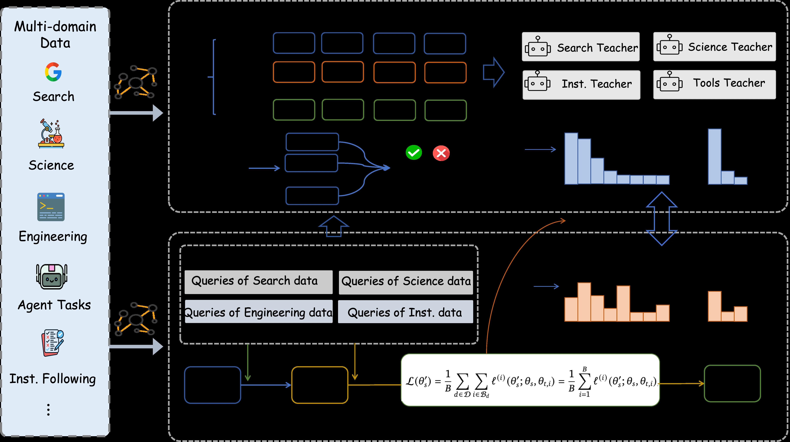
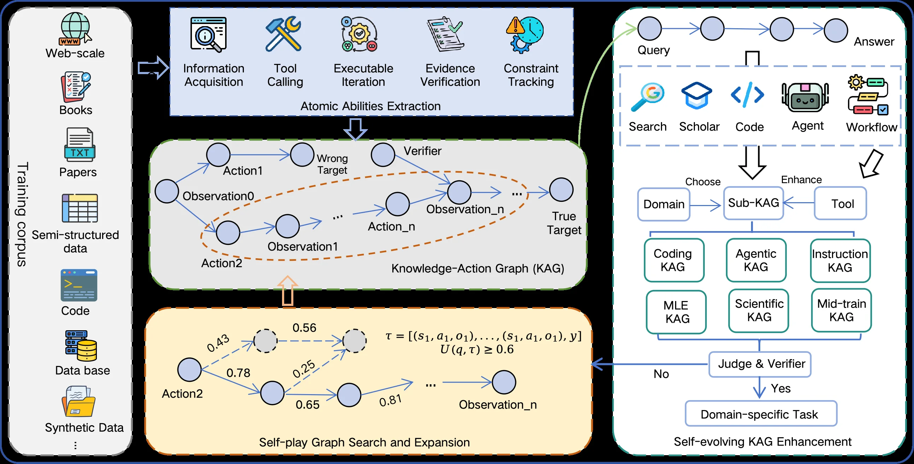
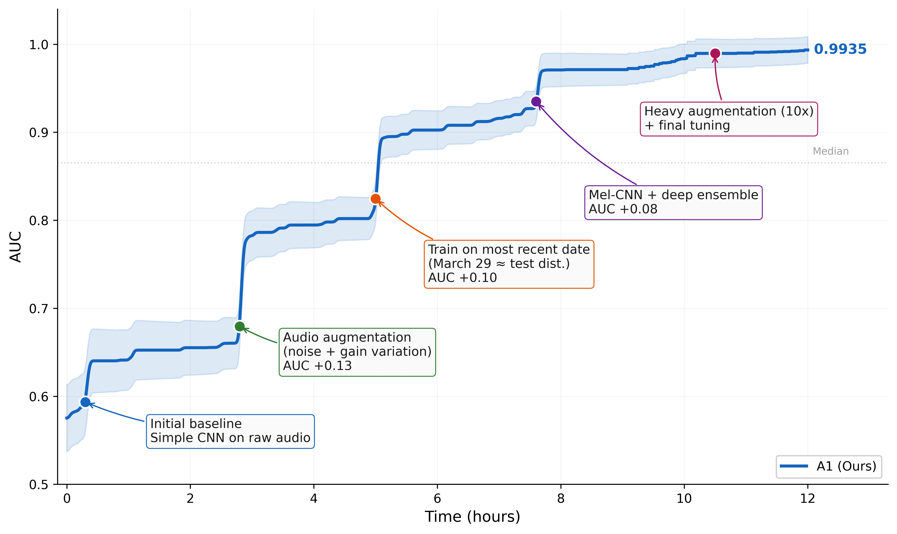

# Scaling the Horizon, Not the Parameters: Reaching Trillion-Parameter Performance with a 35B Agent

[arXiv](https://arxiv.org/abs/2606.30616) · [HuggingFace](https://huggingface.co/papers/2606.30616) · ▲88

## Abstract (verbatim)

> We introduce Agents-A1, a 35B Mixture-of-Experts Agentic Model that reaches trillion-parameter-level performance by scaling the agent horizon. We investigate agent-horizon scaling from two perspectives: scaling long-horizon trajectories and scaling heterogeneous agent abilities. To support this goal, we build a long-horizon knowledge-action infrastructure that connects external knowledge, actions, observations, and verifier outcomes, producing agentic trajectories with an average length of 45K tokens. Based on this, we train Agents-A1 with a three-stage recipe. First, we perform full-domain supervised fine-tuning to align the base model with broad agentic behaviors. Second, we train domain-level teacher models to capture specialized expertise in each domain. Third, we propose a multi-teacher domain-routed on-policy distillation with salient vocabulary alignment to improve knowledge transfer efficiency across different domains, unifying six heterogeneous domains into one deployable student model. Agents-A1 achieves strong and broad performance for long-horizon agent benchmarks. Compared with 1T-parameter model such as Kimi-K2.6 and DeepSeek-V4-pro, Agents-A1 achieves leading results on SEAL-0 (56.4), IFBench (80.6), HiPhO (46.4), FrontierScience-Olympiad (79.0), and MolBench-Bind (56.8), and remains highly competitive on SciCode (44.3), HLE (47.6) and BrowseComp (75.5). We hope this work provides the community with a practical path for scaling the horizon using a 35B agent that can reach or match the performance of 1T models on long-horizon tasks.

## Background

### Background Analysis  

**1. Technical Context and Real-World Needs**  
Recent advances in large language models (LLMs) are shifting AI from passive language processing to autonomous agency, where models must plan, use tools, and adapt strategies in long-horizon tasks. These tasks—common in fields like software engineering, scientific research, and complex decision-making—require AI to operate over extended interactions, such as acquiring information, decomposing tasks, verifying intermediate results, and recovering from errors. The core need is to build systems that can solve problems persistently, not just respond to single queries. For example, a scientist might need an AI to design experiments, analyze data, and correct mistakes, while a developer might require an AI to write, debug, and optimize code iteratively.  

**2. Previous Limitations and Bottlenecks**  
Existing approaches to improve long-horizon agents follow two main paths:  
- **Parameter scaling**: Models like Kimi-K2.6 or DeepSeek-V4 rely on trillions of parameters to internalize diverse reasoning and tool-use patterns. While effective, this requires enormous computational resources and is hard to replicate.  
- **Explicit horizon scaling**: This approach aims to make decision-making processes explicit by training models on planning, tool interaction, and feedback. However, it faces two key challenges:  
  - **Lack of knowledge infrastructure**: Training long-horizon agents requires a unified environment connecting external knowledge, tools, observations, and verification signals. Without this, models struggle to learn from grounded feedback (e.g., verifying results or recovering from failures).  
  - **Integrating heterogeneous abilities**: Different domains (e.g., science vs. programming) demand distinct skills (e.g., information retrieval, constraint tracking), which are difficult to unify without conflicts.  

**3. Proposed Solution**  
The paper introduces **Agents-A1**, a 35B-parameter Mixture-of-Experts (MoE) model that scales agent capabilities by extending task horizons rather than parameters:  
- **Knowledge-Action Infrastructure**: A unified environment connects external knowledge, tools, observations, and verification signals, generating long trajectories (average 45K tokens) for training. This allows models to learn planning, tool calling, and error recovery from real-world interactions.  
- **Three-Stage Training**:  
  1. **Full-domain supervised fine-tuning**: Trains a general-purpose agent with broad long-horizon skills.  
  2. **Domain-specific teacher models**: Specializes models in individual domains (e.g., scientific computing).  
  3. **Domain-routed on-policy distillation**: Unifies skills from six domains into a single model using "salient vocabulary alignment" to avoid conflicts between reasoning patterns.  

**4. Key Differences from Prior Work**  
Unlike parameter-scaling approaches, Agents-A1’s innovations lie in:  
- **Solving infrastructure bottlenecks**: Provides a dynamic environment for learning from feedback, not just text.  
- **Efficient integration of heterogeneous skills**: Uses distillation to unify abilities (e.g., tool use, result verification) across domains, avoiding conflicts.  
- **Competitive performance with fewer parameters**: Achieves trillion-parameter-level performance (e.g., outperforming Kimi-K2.6 and DeepSeek-V4 on SEAL-0 and IFBench) using only 35B parameters.  

This work demonstrates a practical path to scaling long-horizon intelligence by optimizing task boundaries and skill integration, rather than relying solely on parameter growth.

## Method, Figure by Figure

> Figure 2 : Overview of the three-stage training pipeline of Agents-A1. From multi-domain data to domain-specific teachers and multi-teacher on-policy distillation. First, Agents-A1 is trained with full-domain supervised fine-tuning on multi-domain long-horizon data, including search, scientific research, engineering, agentic tasks, and instruction following. Then, domain-specific teacher models are trained on each domain, and their expertise is transferred to the student model through domain-routed on-policy distillation with salient vocabulary alignment.

This diagram provides an overview of the three-stage training pipeline for Agents - A1, focusing on the process from multi-domain data to domain-specific teacher models and multi-teacher online policy distillation.

First, look at the leftmost "Multi-domain Data" section. It contains various types of domain data, such as "Search", "Science", "Engineering", "Agent Tasks", and "Inst. Following". These are the basic data sources for training, representing different types of multi-domain long-horizon data.

Next, the data flows to the middle "full-domain supervised fine-tuning" section. In this stage, the Agents - A1 model uses this multi-domain long-horizon data for full-domain supervised fine-tuning, with the aim of aligning the base model with a wide range of agent behaviors. As can be seen from the diagram, the data enters this fine-tuning module through an arrow, and after processing, the model's capabilities are initially aligned.

Then, it enters the training stage of "domain-specific teacher models". The diagram shows four teacher models: "Search Teacher", "Science Teacher", "Inst. Teacher", and "Tools Teacher", each corresponding to a specific domain. These teacher models are trained on the data of their respective domains to capture the professional expertise of each domain. Data will flow from the fine-tuned model or the original multi-domain data to the training process of these teacher models, and the direction of data flow is indicated by arrows in the diagram, for example, from the previous module to the training area of these teacher models.

After that is the stage of "multi-teacher domain-routed on-policy distillation with salient vocabulary alignment". In this stage, the student model (not explicitly drawn in the diagram, but can be understood as the final Agents - A1 model) will learn from these domain-specific teacher models. The module below the diagram shows the data processing flow, including the processing of some queries (such as "Queries of Search data", "Queries of Science data", etc.), and then optimizes the parameters of the student model through a loss function (the formula \(\mathcal{L}(\theta_s^{(t)})=\frac{1}{B}\sum_{d\in\mathcal{D}}\sum_{i\in\mathcal{B}_d}\ell^{(i)}(\theta_s^{(t)};\theta_s,\theta_{t,i})=\frac{1}{B}\sum_{i = 1}^{B}\ell^{(i)}(\theta_s^{(t)};\theta_s,\theta_{t,i})\) in the diagram). This loss function is used to measure the difference between the output of the student model and the output of the teacher model, thus guiding the learning of the student model. At the same time, there are histograms (blue and orange bar charts) in the diagram, which may represent the distribution or performance indicator changes at different stages, such as the output distribution of the teacher model and the output distribution of the student model, or the loss distribution during the training process.

The order of data or information flow is summarized as follows:
1. Multi-domain data (search, science, engineering, agent tasks, instruction following, etc.) is first used for full-domain supervised fine-tuning to align the base model with a wide range of agent behaviors.
2. The fine-tuned model or related data is used to train various domain-specific teacher models, and each teacher model focuses on the professional knowledge of one domain.
3. The student model (the final Agents - A1) learns from these teacher models through multi-teacher domain-routed online policy distillation, combined with salient vocabulary alignment, optimizes its own parameters, and obtains cross-domain knowledge and capabilities.

The way this method works, as revealed by the diagram, is that through a three-stage training process, first, the model aligns basic behaviors on multi-domain data, then each domain-specific teacher model learns the in-depth knowledge of that domain, and finally, the student model efficiently distills knowledge from these teacher models, so as to achieve trillion-parameter-level performance while not increasing the number of parameters (35B), by expanding the agent's horizon (long trajectories and heterogeneous capabilities). Specifically, full-domain supervised fine-tuning is to give the model a broad behavioral foundation; the training of domain-specific teacher models is to capture the in-depth knowledge of each domain; and multi-teacher online policy distillation is to efficiently transfer this domain knowledge to the student model, achieving unified deployment across domains.

---

> Figure 3 : Overview of the knowledge-action infrastructure of Agents-A1. Heterogeneous corpora are decomposed into atomic abilities and organized into a knowledge-action graph (KAG) that records evidence, actions, observations, and verifier outcomes. A tool-augmented self-play loop expands the KAG into domain-specific sub-KAGs for downstream task construction.

This figure illustrates the overall architecture of the knowledge - action infrastructure of Agents - A1. We can break down each component and module and the flow of data/information as follows:

First, look at the left - most "Training corpus". It contains multiple types of data sources, including Web - scale data, Books, Papers, TXT files, Semi - structured data, Code, Data base, Synthetic Data, etc. These heterogeneous corpora are the input of the whole system. They will be decomposed into atomic abilities, which corresponds to the "Atomic Abilities Extraction" module at the top of the figure. This module includes five sub - functions: Information Acquisition, Tool Calling, Executable Iteration, Evidence Verification, and Constraint Tracking. These functions extract atomic - level abilities from the training corpus.

Next, the extracted atomic abilities are organized into a "Knowledge - Action Graph (KAG)". In the KAG module, we can see nodes (such as Observation0, Action1, Wrong Target, Verifier, Action_n, Observation_n, True Target, etc.) and edges (blue solid lines and orange dashed lines). The blue edges may represent the normal action - observation process. For example, starting from Observation0, after Action1, Action2, etc., Observation1, Observation_n, etc. are generated, and finally it points to the True Target. The orange dashed lines may represent wrong paths or verification - related paths. For example, the connection between Wrong Target and Verifier, and the Verifier will verify actions or observations to determine whether they are moving towards the True Target. The KAG records evidence, actions, observations, and the results of the verifier, which is the core structure of the knowledge - action infrastructure for representing the agent's behavior trajectory and related information.

Then, look at the "Self - play Graph Search and Expansion" module below. The nodes (such as Action2, several intermediate nodes, Observation_n, etc.) in this module have edges with weights (such as 0.43, 0.78, 0.25, 0.65, 0.81, 0.56, etc.), and there is also a formula \(\tau = [(s_1, q_1, o_1), \dots, (s_1, q_1, o_1), y]\) and \(U(q, \tau) \geq 0.6\). The self - play process will expand the KAG. By simulating different action and observation sequences (the edges with weights may represent the probability or score of different action or state transitions), more nodes and edges are generated, thus enriching the structure of the KAG and providing a basis for the subsequent construction of domain - specific sub - KAGs.

Then, look at the "Self - evolving KAG Enhancement" module on the right. First, there is a process starting from "Query", passing through Search, Scholar, Code, Agent, Workflow, etc., and then entering the "Choose" and "Enhance" stages. In the "Choose" stage, the corresponding "Sub - KAG" will be selected according to the "Domain". These sub - KAGs include Coding KAG, Agentic KAG, Instruction KAG, MLE KAG, Scientific KAG, Mid - train KAG, etc. In the "Enhance" stage, the sub - KAG will be enhanced by combining with "Tool". Then there is a "Judge & Verifier" module. If the judgment result is "No", it will return to the previous process to re - select or adjust; if it is "Yes", it will enter the "Domain - specific Task" and complete the task construction.

Overall, the operation mode of this infrastructure is: first, extract atomic abilities from heterogeneous training corpora and construct the initial KAG; then, expand the KAG through self - play to enrich its structure and content; next, select or construct sub - KAGs according to different domains and enhance them by combining with tools; finally, determine whether it can be used for domain - specific tasks through judgment and verification. This process supports the horizon scaling (long - horizon trajectories) and heterogeneous ability scaling of Agents - A1, enabling the model to handle long - horizon agent tasks and integrate knowledge and abilities from multiple heterogeneous domains.

To sum up, the information flow order in the figure is: Training corpus → Atomic Abilities Extraction → KAG Construction → Self - play Graph Expansion → Domain Selection and Sub - KAG Construction → Tool Enhancement → Judgment and Verification → Domain - specific Task. Each module has its specific function, and together they constitute the knowledge - action infrastructure of Agents - A1, enabling the model to achieve trillion - parameter - level performance (through a 35B model) under the scaling of horizon.

---

> Figure 4 : Optimization trajectory of Agents-A1 on the ICML 2013 Whale Challenge [ undefal ] over a 12-hour run. The curve shows the best validation AUC achieved over wall-clock time, with annotated breakthrough moments corresponding to distinct algorithmic improvements. The shaded band indicates run-to-run variance across independent seeds.

This image illustrates the optimization trajectory of the Agents-A1 model during the ICML 2013 Whale Challenge task over a 12-hour training period. Let's first examine the axes: The horizontal axis represents time in hours, ranging from 0 to 12, indicating the duration of training. The vertical axis shows the AUC (Area Under Curve), which measures model performance (values closer to 1 indicate better performance), with a range from 0.5 to 1.0.

Now let's analyze the curve and annotations:

- The blue line (labeled "A1 (Ours)") represents the best validation AUC changes over time. Its trend reflects the model's performance improvement as training progresses. The light blue shaded area around the curve indicates the variance between results from different independent random seeds (experimental repetitions), showing the performance fluctuation range across multiple runs.

- At time 0 (initial phase), we see "Initial baseline Simple CNN on raw audio" with an AUC of approximately 0.6. This represents the model's starting performance before any improvements.

- Around the 3-hour mark, there's a step labeled "Audio augmentation (noise + gain variation) AUC +0.13". This step improved performance by adding noise and adjusting audio gain, increasing the AUC from about 0.6-0.7 to approximately 0.7-0.8.

- At around 5 hours, "Train on most recent date (March 29 ≈ test dist.) AUC +0.10" shows another improvement. By aligning the training data distribution more closely with the test data, the AUC increased from about 0.8 to roughly 0.9.

- Around 7 hours, "Mel-CNN + deep ensemble AUC +0.08" indicates further enhancement. Using a Mel-spectrogram-based CNN with deep ensemble methods (combining multiple models) raised the AUC from about 0.9 to approximately 0.95.

- Finally, at around 10 hours, "Heavy augmentation (10x) + final tuning" achieved an AUC of 0.9935. This step involved extensive data augmentation (10 times more) and final model adjustments, pushing the AUC very close to 1.0.

The entire process demonstrates how the model's performance progressively improved through a series of algorithmic enhancements (data augmentation, training distribution adjustment, model architecture improvements, ensemble methods, and final tuning). Each improvement consistently raised the AUC, with the best validation score reaching 0.9935 after 12 hours of training, proving the effectiveness of these optimization measures.

From a results perspective, the image compares AUC performance at different time points (corresponding to various algorithmic improvements). The key takeaway is that the Agents-A1 model's performance steadily increased through successive optimizations (including data augmentation, training distribution adjustment, and method improvements), ultimately achieving an excellent AUC value of 0.9935. This validates the effectiveness of the implemented improvements for the ICML 2013 Whale Challenge task.
