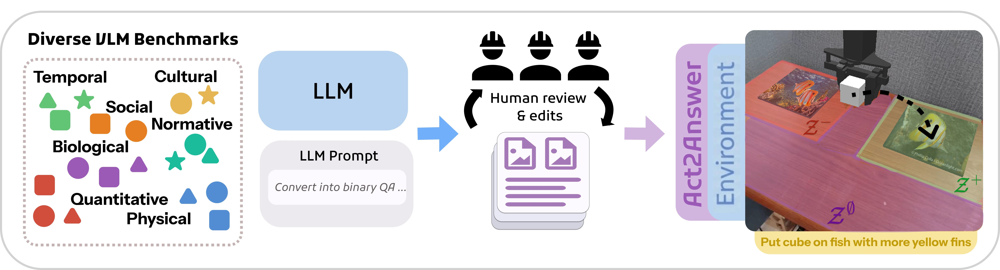
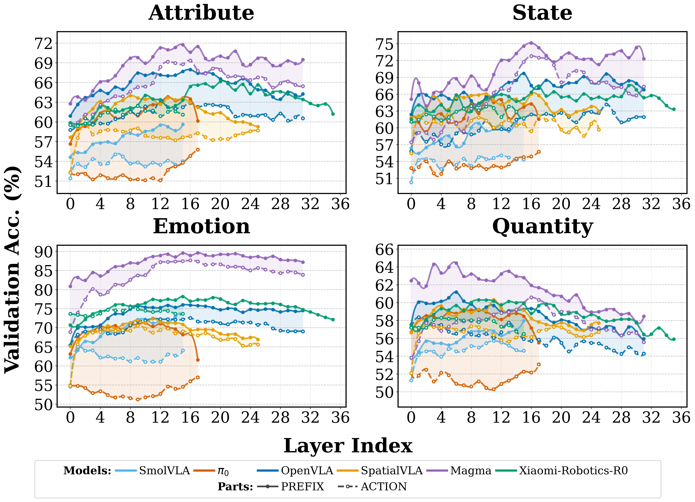

# Does VLA Even Know the Basics? Measuring Commonsense and World Knowledge Retention in Vision-Language-Action Models

[arXiv](https://arxiv.org/abs/2606.19297) · [HuggingFace](https://huggingface.co/papers/2606.19297) · ▲71

## 摘要（原文）

> Embodied Vision-Language-Action (VLA) models are typically obtained by fine-tuning powerful pretrained VLMs on robotics data, yet it is unclear how much commonsense and factual knowledge they retain after adaptation. Failures on knowledge-sensitive tasks are ambiguous, conflating missing knowledge with poor generalization of low-level control. We introduce Act2Answer, a lightweight protocol that adapts VLM knowledge benchmarks to VLA evaluation by requiring agents to answer through action. Each question becomes a short tabletop episode where the agent performs a single object-placement action to select among candidate answers, yielding an action-grounded success rate with reduced control confounds. We curate a test suite of such environments across diverse commonsense and world-knowledge categories and introduce layerwise intent probing to localize answer-relevant information across the VLM backbone and action head. In a large-scale study of 7 VLA models and 9 VLM baselines, we systematically rank models across categories, finding that VLAs show solid performance on simple concepts while exhibiting larger gaps on richer semantic categories relative to their source VLMs, that VQA co-training is associated with better knowledge retention, and that answer-relevant signals peak in middle VLA layers but attenuate in upper layers. Act2Answer is available at https://tttonyalpha.github.io/act2answer/.

## 摘要（中译）

具身视觉-语言-动作（VLA）模型通常是通过在机器人学数据上微调强大的预训练视觉-语言模型（VLM）获得的，然而目前尚不清楚它们在适应后保留了多少常识和事实知识。在知识敏感型任务上的失败情况是模糊的，将知识的缺失与低层次控制的泛化能力差混为一谈。我们引入了Act2Answer，这是一种轻量级协议，它通过要求智能体通过动作来回答问题，将VLM知识基准适配到VLA评估中。每个问题都变成了一个简短的桌面场景，在该场景中，智能体执行单个物体放置动作，从候选答案中进行选择，从而产生一个基于动作的成功率，减少了控制干扰因素。我们整理了一个涵盖多种常识和世界知识类别的此类环境的测试套件，并引入了分层意图探测，以在VLM主干和动作头中定位与答案相关的信息。在对7个VLA模型和9个VLM基线进行的大规模研究中，我们系统地对不同类别的模型进行了排名，发现VLA在简单概念上表现出色，而与它们的源VLM相比，在更丰富的语义类别上存在较大差距；VQA协同训练与更好的知识保留相关；与答案相关的信号在VLA的中间层达到峰值，但在上层减弱。Act2Answer可在https://tttonyalpha.github.io/act2answer/获取。

## 背景剖析

### 背景剖析  

#### 1. 技术背景  
随着人工智能技术的进步，具身智能体（如家庭服务机器人、零售场景中的自动化系统）正被广泛研究以应用于日常生活环境。这些智能体需要理解世界的常识和事实知识（例如物体的用途、行为的合理性），才能在复杂环境中做出合理决策。Vision-Language-Action (VLA) 模型作为这类智能体的核心，旨在将视觉感知、语言理解和动作执行结合，实现开放世界的交互能力。然而，尽管VLA模型在操控任务中表现出色，其是否保留了基础常识和世界知识仍缺乏系统评估。  

#### 2. 之前的问题  
现有研究主要关注VLA模型在特定任务中的成功率（如物体操作或导航），但忽视了一个关键问题：经过机器人学训练后，模型是否仍然能够基于常识区分物体、场景和目标？例如，一个经过微调的VLA模型可能擅长移动杯子，但能否判断“杯子应该用来盛水而不是扔向墙壁”？此外，传统评估方法依赖于任务成功率的量化，难以区分“知识缺失”和“控制能力不足”的问题。同时，VLM（视觉-语言模型）领域已有丰富的知识基准，但这些基准通常以文本问答形式存在，无法直接应用于具身智能体的动作导向场景。  

#### 3. 本文的解法  
为解决这一问题，本文提出了Act2Answer框架，将VLM的知识基准转化为具身智能体的动作导向评估。具体来说，每个知识问题被设计为一个简短的模拟场景，智能体通过执行单一动作（如放置物体）来选择答案。这种方法减少了长时规划和高层次控制的干扰，使评估更聚焦于知识本身。此外，作者引入了分层意图探针，通过分析模型各层表示来定位与答案相关的信息，从而揭示知识在模型内部的分布和传递机制。  

#### 4. 切入角度  
与以往工作相比，Act2Answer的关键创新在于：  
- **动作导向的评估**：将文本问答转化为动作选择，更贴近具身智能体的实际需求；  
- **多样化的知识覆盖**：涵盖常识、世界知识等多个类别，系统评估模型在不同场景下的表现；  
- **分层分析**：通过线性分类器分析模型各层的知识保留情况，揭示知识遗忘的层级特征。  
这一方法弥补了现有研究的不足，为VLA模型的知识评估提供了新的视角。

## 方法图解

> Figure 3: Overview of the data curation pipeline used to construct the Act2Answer task suite from VLM benchmarks, including selection, filtering and normalization, and conversion

这张图（图3）展示了从视觉-语言模型（VLM）基准构建Act2Answer任务套件的**数据策划流程**，清晰地说明了如何将通用的VLM知识评估转化为适用于视觉-语言-动作（VLA）模型的动作导向评估。

流程从左侧的“Diverse VLM Benchmarks”（多样化VLM基准）开始。这个虚线框内包含了不同类别的知识领域，例如“Temporal”（时间）、“Cultural”（文化）、“Social”（社交）、“Normative”（规范）、“Biological”（生物）、“Quantitative”（定量）和“Physical”（物理）。每个类别下用不同颜色和形状的图形（如三角形、星形、圆形、正方形）来表示该类别下的具体问题或知识点，这表明输入数据是多样化的，涵盖了多种常识和世界知识类型。

接下来，这些基准数据被输入到“LLM”（大语言模型）模块中。这个模块代表了原始的、未针对动作任务优化的VLM或大语言模型。同时，有一个“LLM Prompt”（LLM提示）模块，其内容为“Convert into binary QA ...”（转换为二元问答...），这一步的作用是将原始的VLM基准问题转换成适合后续处理的二元问答格式，可能是为了简化问题并使其更易于转换为动作任务。

然后，数据和提示信息通过一个蓝色箭头流向中间的“Human review & edits”（人工审核与编辑）阶段。这个阶段由三个戴安全帽的人形图标表示，说明这是一个人工介入的步骤，用于对转换后的数据进行审核和编辑，确保数据的质量和相关性。在这个阶段，数据以文档的形式（带有图片和文本的图标）进行处理，这可能意味着人工审核会检查问题与相关图像（如果有的话）的匹配度，以及问题的表述是否适合动作执行。

经过人工审核后，数据通过一个紫色箭头流向右侧的“Act2Answer Environment”（Act2Answer环境）。这个环境展示了一个实际的机器人操作场景：一个机械臂正在将一个立方体放置在一个印有鱼的垫子上，目标是“Put cube on fish with more yellow fins”（将立方体放在鱼鳍更黄的鱼上）。这个场景直观地展示了Act2Answer的核心思想：将知识问题转化为一个具体的动作任务，即通过物体放置动作来选择正确的答案。在这个环境中，不同的区域（如Z⁻、Z⁰、Z⁺）可能代表不同的位置或条件，用于评估模型的动作选择是否正确。

整个流程的信息流动顺序是：**多样化的VLM基准数据 → 转换为二元问答格式（通过LLM和提示） → 人工审核与编辑 → 转化为动作导向的Act2Answer环境**。这个流程的目的是将通用的VLM知识评估适配到VLA模型的评估中，通过要求模型通过动作来回答问题，从而减少低层次控制带来的混淆，更准确地测量模型的知识保留情况。

从方法的角度来看，这张图揭示了Act2Answer的具体运作方式：
1. **数据来源**：使用现有的VLM基准，涵盖多种知识类别，确保评估的全面性。
2. **数据转换**：将VLM基准问题转换为二元问答格式，简化问题结构，使其更适合动作任务。
3. **人工审核**：通过人工介入确保数据质量和相关性，减少噪声。
4. **动作化评估**：将问题转化为具体的动作任务（如物体放置），通过模型的动作选择来评估其知识水平，这样可以更直接地测量模型是否具备回答问题所需的知识，而不是仅仅评估其语言生成能力。

这种方法的优势在于，它通过动作执行的成功与否来评估知识保留，从而减少了传统语言评估中可能存在的控制混淆（如低层次控制的泛化能力不足）。通过这种方式，Act2Answer能够更准确地测量VLA模型在常识和世界知识方面的保留情况，并与它们的源VLM进行比较。

---

> Figure 4: Probing results for internal representations of VLA models on four tasks from the Act2Answer task suite. In the legend, Prefix labels indicate representations from the VLM component, whereas Action labels indicate representations from the Action component.

这张图展示了四种不同知识类别的任务（属性、状态、情感、数量）中，视觉-语言-动作（VLA）模型内部表示的探针结果。图中的每个子图对应一个任务类别，横轴是模型的层索引（从0到36），纵轴是验证集准确率（以百分比表示）。图例中，不同的颜色代表不同的VLA模型，包括SmolVLA、π₀、OpenVLA、SpatialVLA、Magma和Xiaomi-Robotics-R0。线条的类型（实线和虚线）分别表示VLM组件（Prefix）和动作组件（Action）的表示。

具体来说，这张图揭示了Act2Answer方法的具体运作方式：
1. **任务设计**：Act2Answer将VLM知识基准适应到VLA评估中，要求智能体通过动作回答问题。每个问题变成一个简短的桌面场景，智能体执行单个物体放置动作来选择候选答案，从而产生一个与动作相关的成功率，减少了控制混淆。
2. **层间意图探针**：通过在VLA的骨干网络和动作头中进行层间意图探针，定位与答案相关的信息。这有助于理解在不同层中，哪些信息对回答特定类型的问题最重要。
3. **结果分析**：图中展示了不同模型在四个任务类别中的表现。可以看到，某些模型在特定层上表现出更高的准确率，这表明这些层包含了更多与任务相关的信息。例如，在“属性”任务中，Magma模型在中间层（大约12到24层）表现出较高的准确率，而在“状态”任务中，Magma和Xiaomi-Robotics-R0模型在中间层也表现出色。

坐标方面，横轴表示模型的层索引，纵轴表示验证集准确率。对比对象是不同的VLA模型及其在VLM组件和动作组件中的表现。结论是，VLA模型在简单概念上表现良好，但在更丰富的语义类别上与源VLM相比存在较大差距。VQA共同训练与更好的知识保留相关，且与答案相关的信号在中间VLA层达到峰值，但在上层减弱。

这张图清晰地展示了不同模型在不同任务类别中的表现，帮助我们理解VLA模型在处理不同类型知识时的内部机制。
