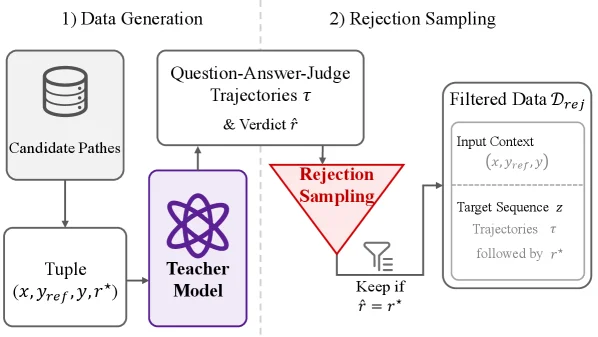
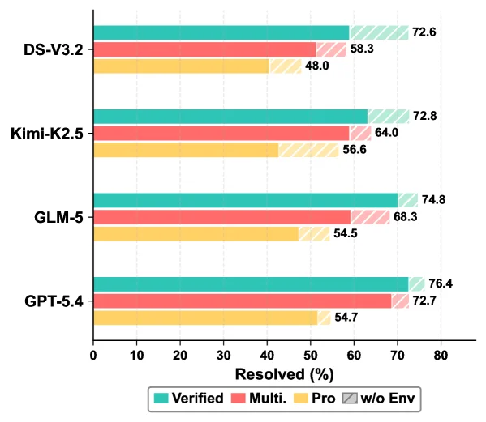

# Dockerless: Environment-Free Program Verifier for Coding Agents

[arXiv](https://arxiv.org/abs/2606.28436) · [HuggingFace](https://huggingface.co/papers/2606.28436) · ▲105

## Abstract (verbatim)

> Program verifiers play a central role in training coding agents, including selecting trajectories for supervised fine-tuning (SFT) and providing rewards for reinforcement learning (RL). Standard execution-based verification requires running unit tests inside per-repository environments such as Docker images, incurring substantial environment setup costs. We propose Dockerless, an environment-free agentic patch verifier that evaluates generated code patches without executing them. Rather than simply matching candidate patches to references, Dockerless judges patch correctness using evidence gathered through agentic repository exploration. On a verifier evaluation benchmark, Dockerless outperforms the strongest open-source verifier by 14.3 AUC points. Using Dockerless as both the SFT trajectory filter and the RL reward enables a fully environment-free post-training pipeline. The resulting model reaches 62.0%, 50.0%, and 35.2% resolve rate on SWE-bench Verified, Multilingual, and Pro, respectively. It surpasses the Qwen3.5-9B baseline by 2.4, 8.7, and 2.9 points, matching environment-based post-training.

## Background

### Background Analysis  

**1. Technical Context and Real-world Needs**  
Program verifiers are essential for training automated coding agents (e.g., AI models solving software engineering problems). Their role is to judge whether a code modification correctly solves a problem, thereby guiding the model’s learning (e.g., filtering high-quality training data or providing rewards for reinforcement learning). Traditionally, verification requires running test cases in isolated environments (e.g., Docker containers per repository) to ensure correctness under specific dependencies and configurations. This need arises because real-world projects—especially enterprise or open-source codebases—demand context-aware validation; otherwise, trained models may fail in practice.  

**2. Previous Limitations and Bottlenecks**  
However, traditional methods face significant challenges. First, environment setup is costly: configuring Docker containers for each repository involves resolving dependency conflicts, writing test scripts, and other engineering work, which is often infeasible for private or legacy systems. Second, existing "environment-free" verifiers (those not relying on Docker) judge correctness based only on surface-level text matching, lacking understanding of codebase context. For example, they cannot determine if a modified function is actually called or integrates correctly with surrounding modules. This leads to unreliable verification, especially for complex tasks (e.g., benchmarks like SWE-bench requiring deep code logic understanding).  

**3. Proposed Solution**  
The paper introduces Dockerless, an environment-free "intelligent verifier." Its core idea is to let the verifier actively explore codebase context instead of relying on simple text matching. Specifically, Dockerless generates key questions (e.g., "Does the modified function solve the target problem?") and dispatches sub-agents to collect evidence (e.g., function call relationships, module dependencies) from the codebase. It then aggregates this information to judge correctness. This approach combines code understanding with logical reasoning to handle complex scenarios.  

**4. Key Differences from Prior Work**  
Compared to Docker-dependent traditional methods, Dockerless eliminates environment setup costs. Unlike shallow environment-free verifiers, it improves accuracy by actively exploring codebase context. Additionally, Dockerless supports a fully environment-free training pipeline: from data collection to model optimization, no per-repository configuration is needed. Experiments show its performance surpasses the strongest open-source verifier and enables models to achieve performance comparable to Docker-dependent methods on multiple benchmarks.  

The key innovation is removing environment dependency from verification while compensating for shallow methods through intelligent exploration, providing a scalable solution for training coding agents at scale.

## Method, Figure by Figure

> Figure 2 : Architecture of Dockerless. The verifier takes the issue x x , reference patch y ref y_{\text{ref}} , and candidate patch y y , and proceeds in two stages. (1) Question generation and exploration: the verifier first generates K K verification questions and dispatches parallel sub-agents to collect evidence-backed answers from the codebase. (2) Judgment: the verifier conditions on the issue, the patches, and the collected ( Q k , A k ) (Q_{k},A_{k}) pairs to produce a binary verdict token, whose logits define the continuous score r ϕ ​ ( x , y ) r_{\phi}(x,y) .

This figure illustrates the core architecture of Dockerless, an environment-free program verifier proposed in the paper "Dockerless: Environment-Free Program Verifier for Coding Agents." It is designed to evaluate the correctness of generated code patches. The overall workflow consists of two main stages: Question Generation & Exploration, and Judgment. The flow of data or information is as follows:

1.  **Input Stage (Input)**:
    *   The leftmost "Input" panel provides the method's input data, which includes:
        *   `Issue (x)`: Represents the software issue or defect that needs to be fixed, typically in the form of a document or text.
        *   `Ref Patch (y_ref)`: The reference patch, which is considered the correct or standard solution.
        *   `Candidate Patch (y)`: The candidate patch to be verified, i.e., the solution generated by a coding agent.

2.  **Question Generation & Exploration Stage (Question Generation & Exploration)**:
    *   This stage is the core of the method, aiming to gather evidence through multi-dimensional question generation and codebase exploration.
    *   **Multi-dimensional Evidence Probing**:
        *   First, the system "Generates Question." This process creates multiple (K) verification questions (`Q₁`, `Q₂`, ..., `Qₖ`) based on the input `Issue`, `Ref Patch`, and `Candidate Patch`. These questions probe the correctness of the patch from different dimensions. For example, `Q₁` (with a location icon) might focus on code location or impact; `Q₂` (with a power icon) might focus on functionality or performance; `Q₃` (with a flask icon) might focus on logic or algorithm; and `Qₖ` represents other types of questions.
    *   **Parallel Sub-agents**:
        *   Each generated question (`Q₁` to `Qₖ`) is dispatched to a "Parallel Sub-agent." The figure shows `Sub-agent 1` to `Sub-agent k`, working in parallel for efficiency.
    *   **Codebase Exploration and Evidence Collection**:
        *   These sub-agents interact with the "Static CodeBase" and may use tools (`Read Tools`, indicated by the wrench icon) to read and analyze the code.
        *   The result of this exploration is an "Evidence-Backed Answer" (`A₁`, `A₂`, ..., `Aₖ`) for each question. These answers are derived from codebase analysis rather than code execution.

3.  **Judgment Stage (Judgment)**:
    *   After collecting all question-answer pairs (`(Q₁, A₁)`, `(Q₂, A₂)`, ..., `(Qₖ, Aₖ)`), the process moves to the judgment stage.
    *   The system combines the original `Issue (x)`, `Ref Patch (y_ref)`, `Candidate Patch (y)`, and the collected question-answer pairs to make a "Judge."
    *   The outcome is a binary verdict token, whose logits define a continuous score `r_φ(x, y)`. This score, `r_φ(x, y) ∈ [0,1]`, represents the probability or rating of the correctness of the candidate patch `y` with respect to the issue `x`.

In summary, Dockerless operates as follows:
*   First, it generates multiple verification questions based on the given issue, reference patch, and candidate patch.
*   Then, it uses parallel sub-agents to explore answers to these questions, gathering evidence-supported answers through static codebase analysis and tool usage.
*   Finally, it makes a judgment on the correctness of the candidate patch by combining all this information with the original inputs and outputs a continuous score.

The key to this method is that it does not require code execution but instead judges patch correctness through code analysis and evidence collection, thus implementing an environment-free program verifier.

---

> Figure 3 : Training pipeline for Dockerless: teacher-generated question-answer-judge trajectories are rejection-sampled by matching the predicted verdict against the ground-truth, and used to fine-tune a base model.

This figure (Figure 3) illustrates the training pipeline of Dockerless, consisting of two main stages: Data Generation and Rejection Sampling.  

### Data Generation (Left of the dashed line):  
- **Candidate Paths**: Represented by a database icon, this module provides initial candidate code paths or patches.  
- **Tuple Generation**: These candidate paths are converted into a tuple `(x, y_ref, y, r*)`, where `x` is the input context, `y_ref` is the reference output, `y` is the generated output, and `r*` is the ground - truth verdict (whether the patch is correct). This tuple is then fed into the **Teacher Model**.  
- **Teacher Model**: It generates “Question - Answer - Judge Trajectories τ & Verdict r̂”. Here, `τ` represents the reasoning trajectory (e.g., the process of evaluating the patch), and `r̂` is the model’s predicted verdict (whether the patch is correct).  

### Rejection Sampling (Right of the dashed line):  
- The trajectories `τ` and predicted verdict `r̂` from the Teacher Model are input into the **Rejection Sampling** module.  
- The sampling logic is “Keep if `r̂ = r*`”: Only samples where the predicted verdict (`r̂`) matches the ground - truth verdict (`r*`) are retained.  
- **Filtered Data \( \mathcal{D}_{\text{rej}} \)**: Retained samples are organized into `Input Context (x, y_ref, y)` (the original input and outputs) and `Target Sequence z` (which includes the trajectory `τ` and the ground - truth verdict `r*`). This filtered data is used to fine - tune a base model.  

### Overall Flow and Method Logic:  
The data flow is: Candidate Paths → Tuple Generation → Teacher Model (generates trajectories and predicted verdict) → Rejection Sampling (retains samples with matching `r̂` and `r*`) → Filtered Data for Fine - Tuning.  

This pipeline reveals how Dockerless trains models without traditional execution - based environments: The Teacher Model generates training data with reasoning trajectories and predicted verdicts. Rejection sampling ensures only accurate samples (where prediction matches ground truth) are used for fine - tuning, leveraging the Teacher Model’s reasoning to create high - quality training data for program verification.

---

> Figure 4 : Env-free post-training pipeline for Dockerless. (A) Environment-free RFT: candidate rollouts are scored by Dockerless, and the top- K K are kept to fine-tune the base model, yielding the SFT model. (B) Environment-free RL: starting from the SFT model, GRPO uses Dockerless as the per-rollout reward source, yielding the RL model.

This figure illustrates the environment - free post - training pipeline of Dockerless, which is divided into two main parts: (A) Environment - free Supervised Fine - Tuning (SFT, possibly a misnomer or specific term in the original as "RFT" is used) and (B) Environment - free Reinforcement Learning (RL).

First, let's look at part (A):
- The left - most "Issues & Agent" module represents programming tasks (or error reports) and the agent that generates code. This module outputs candidate code implementations (Candidate Rollouts), that is, multiple code attempts generated by the agent for a given problem.
- Next is the "Dockerless" module, which is an environment - free program verifier. Its role is to score these candidate code implementations. Instead of executing the code (such as running unit tests in a Docker environment), it judges the correctness of code patches by collecting evidence through the agent's exploration of the code repository.
- Then, there is the "Top - K Filtering" step (in the figure, it shows filtering out those with relatively high r values, such as r = 0.98, 0.85, etc. Here, r may represent a score or a correctness score). This step selects the top K code implementations with the highest scores from all candidates.
- Finally, these selected top - K code implementations are used for "SFT" (Supervised Fine - Tuning) to train an SFT model. This process is environment - free because there is no need to set up a separate execution environment (such as Docker) for each code implementation.

Next, let's look at part (B):
- The left - most "SFT Model" is the supervised fine - tuned model obtained from part (A) and serves as the starting point for reinforcement learning.
- The middle "Group of Rollouts {y₁, y₂, …, y_G}" represents multiple code implementations (rollouts) generated from the SFT model, and each y_i is a code attempt.
- Similarly, the "Dockerless" module scores these generated code implementations and obtains a reward (r₁, r₂, …, r_G) for each implementation. Here, the reward is based on the judgment of code correctness.
- Then, the "GRPO Algorithm" (a reinforcement learning algorithm) uses these rewards to optimize the model. GRPO will adjust the model parameters according to the reward of each rollout to maximize the cumulative reward.
- Finally, the model optimized by GRPO becomes the "RL Model". This model is also trained in an environment - free manner because the calculation of the reward does not depend on the execution environment.

The core of the entire process is that Dockerless, as an environment - free verifier, screens high - quality code implementations in the supervised fine - tuning stage and provides rewards based on correctness in the reinforcement learning stage, thus achieving a completely environment - free post - training process. This method avoids the high setup costs of traditional execution environments (such as Docker), and at the same time, effectively judges the correctness of the code through the agent's exploration of the repository.

From the results (combined with the paper's abstract), the model obtained using Dockerless's environment - free post - training process achieves resolution rates of 62.0%, 50.0%, and 35.2% on the three subtasks (Verified, Multilingual, Pro) of SWE - bench respectively. It exceeds the Qwen3.5 - 9B baseline model and is close to the performance of the environment - based post - training model.

---

> Figure 5 : Verifier AUC vs. number of verification questions K K on SWE-bench Verified verifier evaluation benchmark.

This figure (Figure 5) illustrates the performance of a verifier, measured by its AUC (Area Under the Curve) on the SWE-bench Verified benchmark, as a function of the number of verification questions (# Verification Questions).

First, let's break down the components of the graph:
- **X-axis**: Represents the number of verification questions (# Verification Questions), ranging from 0 to 8. This can be interpreted as the number of queries or checkpoints during the verification process.
- **Y-axis**: Represents the AUC value of the verifier (AUC on SWE-bench Verified), with a range approximately from 75.0 to 85.0. A higher AUC value generally indicates better performance of the verifier, meaning it can more accurately distinguish between correct and incorrect code patches.
- **Data points**: There are several data points corresponding to different numbers of verification questions, such as:
  - When the number of verification questions is 0, the AUC value is 78.2.
  - When the number of verification questions is 1, the AUC value is 80.1.
  - When the number of verification questions is 2, the AUC value is 80.8.
  - When the number of verification questions is 4, the AUC value is 81.0, which is a high point in the graph and is marked as "sweet spot".
  - When the number of verification questions is 6, the AUC value is 79.6.
  - When the number of verification questions is 8, the AUC value is 80.3.
- **Trend line**: A line connects the data points, showing the trend of the AUC value as the number of verification questions changes. It can be seen that as the number of verification questions increases, the AUC value first rises, reaches a peak (when the number of verification questions is 4), then slightly decreases, and then rises again.
- **"Sweet spot" region**: There is a light blue background area between 2 and 4 verification questions, marked as "sweet spot", indicating that this range of verification question numbers might be optimal because the AUC value is high and relatively stable within this range.

This figure reveals how the method (Dockerless) operates:
- The method (Dockerless) evaluates the correctness of code patches by posing different numbers of verification questions. As the number of verification questions increases, the performance of the verifier (AUC value) changes.
- From the graph, it can be observed that as the number of verification questions increases from 0 to 4, the AUC value gradually rises, reaching a peak (81.0), which indicates that in this stage, increasing the number of verification questions helps improve the verifier's performance.
- When the number of verification questions exceeds 4 (e.g., increases to 6), the AUC value starts to decrease. This might be because too many verification questions introduce unnecessary complexity or noise, leading to a decline in the verifier's performance.
- When the number of verification questions further increases to 8, the AUC value rises again but still remains below the peak (81.0). This might be because in some cases, more verification questions can provide more comprehensive information, thus improving the verifier's performance, but this improvement is limited.

Conclusion:
- The figure shows that on the SWE-bench Verified benchmark, the AUC value of the Dockerless verifier changes with the number of verification questions. The optimal number of verification questions (the "sweet spot") is approximately between 2 and 4, at which the AUC value reaches the highest (81.0).
- This indicates that when using Dockerless for code patch verification, choosing an appropriate number of verification questions can optimize the verifier's performance. Too many verification questions do not necessarily lead to better performance and may even cause a decline in performance.
- The results of this graph support the effectiveness of the Dockerless method because it can perform well under different numbers of verification questions, and there is an optimal range of verification question numbers that allows the verifier's performance to reach its best.

---

> Figure 8 : Frontier-model resolve rate (%) on SWE-bench Verified, Multilingual, and Pro under env-based and env-free settings. Solid bars are env-free; hatched extensions show the additional gain from per-repository environments, so the full bar height equals the env-based score.

This figure (Figure 8) displays the problem resolution rates (in percentage) for different models on three tasks of the SWE-bench benchmark: Verified, Multilingual, and Pro. These rates are shown under both environment-based (env-based) and environment-free (env-free) settings. Here's a detailed breakdown:

1.  **Axes and Tasks**:
    *   The **y-axis** lists four different models: DS-V3.2, Kimi-K2.5, GLM-5, and GPT-5.4. These are the coding agent models being evaluated.
    *   The **x-axis** represents "Resolved (%)", which is the percentage of problems solved, ranging from 0% to 80%.
    *   The **legend** explains the meaning of the different colored and patterned bars:
        *   **Solid cyan bar (Verified)**: Represents the resolution rate under the "env-free" setting. This is the result obtained using the Dockerless method (environment-agnostic agent patch verifier) proposed in the paper.
        *   **Solid red bar (Multi.)**: Represents the resolution rate for the "Multilingual" task under the "env-free" setting.
        *   **Solid yellow bar (Pro)**: Represents the resolution rate for the "Pro" task under the "env-free" setting.
        *   **Hatched gray extension (w/o Env)**: These are the hatched portions attached to the end of the solid cyan, red, or yellow bars. They represent the additional resolution gain achieved with an environment-based setup. Therefore, the total height of the bar (solid part + hatched part) equals the resolution rate of that model under the "env-based" setting.

2.  **Understanding the Method**:
    *   The core of this figure is to compare the performance of the "env-free" method (Dockerless) with the "env-based" method in solving programming problems.
    *   For each model, the length of the solid cyan, red, or yellow bar shows the percentage of problems that can be solved without relying on a specific execution environment.
    *   The length of the hatched gray extension indicates how many more problems could be solved if a traditional method requiring a specific execution environment (like Docker images) for each code repository was used.
    *   The paper's method (Dockerless) aims to judge patch correctness by gathering evidence through agent-driven repository exploration, rather than simply executing unit tests. This figure visually demonstrates the effectiveness of Dockerless by comparing "env-free" and "env-based" resolution rates.

3.  **Comparison Objects and Conclusions**:
    *   **Comparison Objects**: The primary comparison is between the performance of the same model under the "env-free" setting (solid cyan, red, or yellow bars) and its potential performance under the "env-based" setting (total bar height, including the hatched part).
    *   **Specific Data Examples**:
        *   For the model **GPT-5.4**:
            *   Under "env-free", its resolution rate for the "Verified" task is 76.4% (cyan bar).
            *   Under "env-free", its resolution rate for the "Multilingual" task is 72.7% (red bar).
            *   Under "env-free", its resolution rate for the "Pro" task is 54.7% (yellow bar).
            *   The hatched gray extension is very short, indicating that the additional gain from an "env-based" setup is minimal, or that Dockerless is already very close to the "env-based" performance.
        *   For the model **DS-V3.2**:
            *   "Env-free" "Verified" resolution rate is 72.6%.
            *   "Env-free" "Multilingual" resolution rate is 58.3%.
            *   "Env-free" "Pro" resolution rate is 48.0%.
            *   The hatched gray extension is relatively longer, indicating a larger potential gain with an "env-based" setup.
    *   **Conclusion**: This figure shows that while "env-based" methods generally achieve higher resolution rates (because they can execute code), the "env-free" method (Dockerless) proposed in the paper achieves very close, or even comparable (e.g., GPT-5.4's Verified task), performance. This demonstrates the feasibility of environment-agnostic program verification and its potential for building a fully environment-free post-training pipeline, as stated in the paper's abstract.

In summary, this figure clearly illustrates the effectiveness and performance of the Dockerless method by comparing problem resolution rates across different models, tasks, and environmental settings. It shows that a high problem resolution rate can still be achieved without relying on specific execution environments, which is significant for reducing the environmental setup costs of training coding agents.
