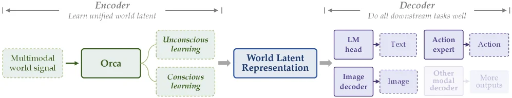
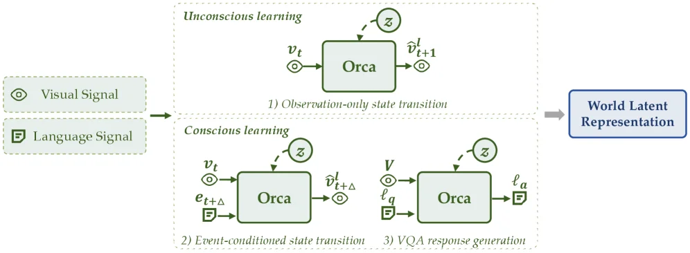
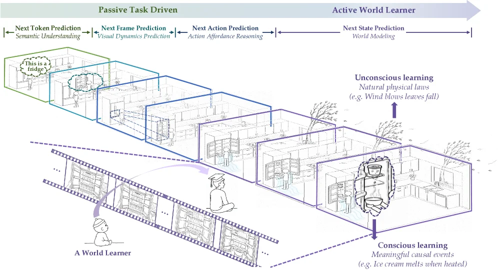
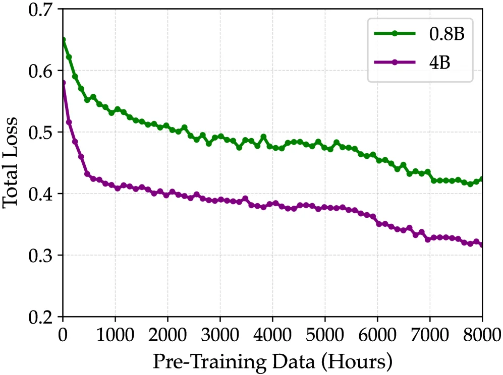

# Orca: The World is in Your Mind

[arXiv](https://arxiv.org/abs/2606.30534) · [HuggingFace](https://huggingface.co/papers/2606.30534) · ▲234

## Abstract (verbatim)

> We introduce Orca, an initial instantiation of a general world foundation model. Orca learns a unified world latent space from multimodal world signals and exposes it through multimodal readout interfaces. Rather than optimizing isolated next-token, next-frame, or next-action prediction, we are centered on Next-State-Prediction modeling, offering a unified state-transition modeling route toward understanding, predicting, and acting upon the world. Orca learns through two complementary paradigms: unconscious learning captures dense natural state transitions from continuous videos, and conscious learning models sparse meaningful state transitions by language-described events and VQA supervision. For pre-training, we construct a large-scale world-learning inventory data, including 125K hours of video data and 160M event annotations. After pre-training, Orca learns a unified world latent space. To examine whether the learned latent supports downstream, we evaluate it by three representative downstream readouts: text generation, image prediction, and embodied action generation. Orca's backbone is frozen, and only the lightweight modality-specific decoders are trainable. Experiments show the scalability of the proposed paradigm and verify that stronger world latent enables stronger downstream readouts. Orca outperforms similar-sized specialized baselines. These results show that Orca, as a general world foundation model, presents a promising approach to understanding, predicting, and acting upon the world. Finally, we discuss the current limitations, aiming to provide useful insights and inspiration for the community.

## Background

### Background Analysis  

#### 1. Technical Context  
A core challenge in artificial general intelligence (AGI) is building a system that learns and understands the world like humans, enabling it to predict and act across diverse scenarios. Real-world needs include robots reasoning about physics (e.g., object motion), humans interacting with AI systems that grasp causal relationships (e.g., "turning on a light brightens a room"), and models generalizing to unseen domains. Such technology aims to create self-evolving agents capable of surpassing human cognitive limits in specific tasks.  

#### 2. Previous Limitations  
Traditional approaches (e.g., next-token prediction, next-frame generation) fail to model the world holistically. They optimize isolated tasks (e.g., text generation or video prediction) without unifying dynamic understanding. For example, language models excel at text but struggle with visual-physical interactions, while video models generate frames but lack semantic context. Additionally, they rely heavily on labeled data, ignoring abundant unlabeled signals (e.g., continuous videos) and sparse but meaningful events (e.g., "a person picks a cup"). This limits their ability to generalize to new or cross-domain tasks.  

#### 3. Proposed Solution  
Orca addresses these issues by learning a unified "world latent space" through two complementary paradigms:  
- **Unsupervised learning**: Captures dense, natural state transitions from continuous videos (e.g., object movements) without labels, mimicking how humans learn from observation.  
- **Conscious learning**: Learns sparse but task-relevant state transitions using language descriptions (e.g., "opening a door") and visual question answering (VQA), aligning with human-like reasoning.  
This approach enables Orca to support downstream tasks (text generation, image prediction, action generation) with a shared latent space. Experiments show its performance scales with model size and data, outperforming specialized baselines.  

#### 4. Key Differences  
Unlike prior work, Orca prioritizes **general world modeling** over task-specific optimization. Its innovations include:  
- **Dual learning**: Balances unsupervised natural dynamics (from videos) and supervised task-oriented learning (from language/events).  
- **Frozen backbone**: Trains only lightweight modality-specific decoders, preserving the generality of the latent space.  
- **Large-scale multimodal data**: Uses 125K hours of video and 160M event annotations to cover diverse real-world scenarios.  
This design positions Orca as a foundational step toward AGI, demonstrating that stronger world modeling enables better downstream capabilities.

## Method, Figure by Figure

> Figure 1 : The Orca’s overall framework. Orca follows an Encoder-Decoder architecture. Given multimodal world signals, the Encoder learns a world latent through two complementary paradigms: unconscious learning and conscious learning . Unconscious learning captures dense natural state transitions, while conscious learning captures sparse meaningful state transitions. To prove that the learned latent is effective, the Encoder is frozen after pre-training, and only the lightweight modality-specific decoders are trainable separately. The Decoder reads out the latent into text, images, actions, and other modalities.

This diagram illustrates the overall framework of Orca, which adopts an **Encoder-Decoder** architecture and clearly presents the workflow from multi-modal world signal input to multi-modal output:  

### Encoder Section:  
- **Input**: The "Multimodal world signal" (multi-modal world signal) on the far left is the starting point of the entire process, representing multi-modal input from the real world (such as videos, text-described events, etc.).  
- **Core Component: Orca**: The green "Orca" module is the core of the encoder, responsible for learning a **unified World Latent Representation**. It achieves this goal through two complementary learning paradigms:  
  - **Unconscious learning**: Marked by a dashed box, its role is to "capture dense natural state transitions"—that is, learning a large number of naturally occurring state changes from continuous data such as videos (e.g., the movement of objects in a video, continuous changes in scenes, etc.).  
  - **Conscious learning**: Another dashed box, its role is to "capture sparse meaningful state transitions"—by learning from language-described events (e.g., "the cat jumps onto the table") and visual question answering (VQA) supervision, it learns those state changes that occur less frequently but are semantically important (such as the triggering of specific events, semantic associations between objects, etc.).  
- **Output to Latent Space**: The output of Orca is the "World Latent Representation", which is a unified latent space obtained after processing by the two learning paradigms. It encodes key state information about the world.  

### Decoder Section:  
- **Freeze the Encoder**: The implicit information in the diagram is that after pre-training, the encoder of Orca (the part that learns the latent space) is **frozen** (no longer trained), and only lightweight, modality-specific decoders are trainable—this ensures the stability of the latent space while allowing downstream tasks to be flexibly adapted.  
- **Objective of the Decoder**: The goal of the "Decoder" section on the right is to "do all downstream tasks well", that is, to read information from the latent space and convert it into different modality outputs:  
  - **Text Generation**: The path is "LM head (language model head)" → "Text (text)", and the information in the latent space is decoded into text (such as answering questions, generating descriptions, etc.) through the language model head.  
  - **Image Prediction**: The path is "Image decoder (image decoder)" → "Image (image)", and the information in the latent space is converted into an image (such as predicting the next frame of a video, generating an image that matches the description, etc.) through the image decoder.  
  - **Action Generation (Embodied Intelligence)**: The path is "Action expert (action expert)" → "Action (action)", and the information in the latent space is converted into actions (such as robot motion control, character actions in games, etc.) through the action expert module.  
  - **Other Modality Outputs**: "Other modal decoder (other modality decoder)" → "More outputs (more outputs)", which means it can also be extended to outputs of other modalities (such as audio, tactile, etc.), reflecting the generality of the method.  

### Data/Information Flow Order:  
1. Multi-modal world signal input enters Orca (encoder).  
2. Orca converts the input into a unified world latent representation through unconscious learning and conscious learning.  
3. The frozen encoder passes the latent representation to the decoder.  
4. Different modules of the decoder (LM head, image decoder, action expert, other modality decoder) decode the latent representation into text, image, action, or other modality outputs, completing downstream tasks.  

### Method Operation Logic:  
The core of Orca is to **learn a unified world latent space**, rather than optimizing isolated "next token/frame/action" predictions. It learns from multi-modal world signals through two complementary learning paradigms (unconscious learning handles dense natural state transitions, and conscious learning handles sparse meaningful state transitions). After pre-training, the encoder is frozen to ensure the stability of the latent space, and downstream tasks are implemented through lightweight modality-specific decoders. This way, it can leverage the unified latent space to understand the world and flexibly adapt to different downstream tasks (text, image, action, etc.). Experiments have shown that a stronger world latent space can lead to better downstream task performance. Orca outperforms specialized baseline models of similar scale, verifying its effectiveness as a general world foundation model.

---

> Figure 2 : Overview of Encoder. Orca learns a world latent representation through two learning paradigms. Unconscious learning uses video data to capture dense and natural state transitions. Conscious learning uses language instructions as explicit semantic conditions to capture sparse and meaningful state transitions.

This figure illustrates the core workflow of Orca for learning a world latent representation, divided into two complementary paradigms: **unconscious learning** and **conscious learning**, with the ultimate goal of generating a unified "World Latent Representation". Here’s a detailed breakdown of each component and information flow:

### Input and Overall Workflow
- **Left Input**: Two signal sources are shown: `Visual Signal` (icon) and `Language Signal` (icon). These are the raw data inputs for Orca’s learning.
- **Core Component: Orca**: There are three Orca modules, each corresponding to a learning/inference task. They share a frozen backbone, with only lightweight modality - specific decoders being trainable. The goal is to learn a unified world latent space.
- **Output**: All learning tasks aim to produce the `World Latent Representation`, which is a unified abstraction of the world and supports downstream tasks (e.g., text generation, image prediction, embodied action generation).

### 1. Unconscious Learning
- **Task Type**: `Observation - only state transition`.
- **Input**: `v_t` (visual signal at time step t, icon), and the latent variable `z` (dashed arrow, possibly prior or context information).
- **Processing and Output**: The Orca module takes `v_t` and `z` as input and outputs `$\hat{v}_{t + 1}^l$` (predicted visual signal at time step t + 1). This process simulates capturing **dense and natural state transitions** from continuous videos (e.g., object motion, scene changes in a video, learned without explicit language guidance, only through the sequence of visual observations).
- **Data Flow**: Visual signal `v_t` → Orca (with `z`) → Predicted next visual state `$\hat{v}_{t + 1}^l$`. This process is repeated to learn the pattern of continuous state transitions.

### 2. Conscious Learning
Conscious learning is further divided into two sub - tasks, using **sparse but semantically explicit state transition conditions** provided by language to learn:

#### Sub - task 2: Event - conditioned State Transition
- **Input**: `v_t` (visual signal at time step t), `e_{t+\Delta}` (event annotation/language description at time step t + Δ, icon), and the latent variable `z`.
- **Processing and Output**: The Orca module takes `v_t`, `e_{t+\Delta}`, and `z` as input and outputs `$\hat{v}_{t+\Delta}^l$` (predicted visual signal at time step t + Δ). This task simulates **predicting future states based on language - described events** (e.g., "the ball is thrown") and captures sparse but semantically meaningful state transitions (since language events are sparse but can clearly define the cause and effect of state changes).
- **Data Flow**: Visual signal `v_t` + event language `e_{t+\Delta}` + `z` → Orca → Predicted future visual state `$\hat{v}_{t+\Delta}^l$`. In this way, the mapping of "language event → state transition" is learned.

#### Sub - task 3: VQA Response Generation
- **Input**: `V` (visual signal, icon), `ℓ_q` (language question, icon), and the latent variable `z`.
- **Processing and Output**: The Orca module takes `V`, `ℓ_q`, and `z` as input and outputs `ℓ_a` (language answer, icon). This task simulates **answering questions based on vision and language**, further verifying the model’s understanding of the world state (e.g., "What color is the ball in the picture?" requires the model to understand the visual state and generate a language response).
- **Data Flow**: Visual signal `V` + language question `ℓ_q` + `z` → Orca → Language answer `ℓ_a`. The model’s understanding of the world state is reinforced through the question - answering task.

### Core Logic of the Method
Orca builds a world latent representation through **two complementary learning paradigms**:
- **Unconscious Learning**: Learns **dense natural state transitions** from continuous videos (e.g., continuous motion of objects), capturing the "continuity" and "naturalness" of the world.
- **Conscious Learning**: Learns **sparse but semantically explicit state transitions** from language - described events (sub - task 2) and VQA (sub - task 3), capturing the "causality" and "semanticity" of the world.

These two paradigms work together to enable Orca to learn a unified `World Latent Representation`, which can support multiple downstream tasks (text generation, image prediction, embodied action generation). The model’s backbone is frozen, and only lightweight modality - specific decoders are trained to ensure learning efficiency and generality.

### Conclusion (Derived from the Figure’s Logic)
This figure shows how Orca constructs a unified world latent representation through the dual - paradigm learning of "unconscious (continuous video) + conscious (language event/VQA)". This design allows the model to capture both the continuous dynamics of the world (unconscious learning) and the semantically explicit events and question - answering (conscious learning). The ultimately generated latent representation can support multiple downstream tasks, reflecting the core idea of a "general world foundation model".

---

> Figure 3 : Overview of pre-training data. Orca’s pre-training data includes video, event, and VQA data. A. Video Data supports 1) Observation-only state transition , A. Video Data and B. Event Data support 2) Event-conditioned state transition , and C. VQA Data supports 3) VQA response generation .

This diagram illustrates the composition of Orca model pre-training data, its pre-training objectives, and learning paradigms, clearly presenting how Orca learns the latent representation of the world from multimodal signals.

First, let's look at the **Pre - Training Data and Annotations** section:
- The **Visual Signal** serves as input and is divided into three types of data:
    - **A. Video Data**: It includes four types, namely "Ego - Centric Interaction", "Exo - Centric Manipulation", "Action - Free Robot Execution", and "Natural Dynamics". These video data will undergo "Event Segmentation" processing and then provide support for subsequent objectives.
    - **B. Event Data**: It consists of "Fine & Coarse Caption" and its input sources are the "Language Signal" and the content related to the video data after event segmentation.
    - **C. VQA Data**: It includes "General VQA", and its input also comes from the "Language Signal".

Next is the **Pre - Training Objectives** section, which has three objectives, each supported by different data:
- Objective 1: "Observation - only state transition" is only supported by **Video Data (A)**.
- Objective 2: "Event - conditioned state transition" is supported by both **Video Data (A)** and **Event Data (B)**.
- Objective 3: "VQA response generation" is supported by **VQA Data (C)**.

Then there is the **Learning Paradigms** section, which is divided into two learning methods, and both ultimately point to the "World Latent Representation":
- **Unconscious learning**: It is associated with Objective 1 (Observation - only state transition) and captures dense natural state transitions from continuous videos.
- **Conscious learning**: It is associated with Objective 2 (Event - conditioned state transition) and Objective 3 (VQA response generation) and models sparse but meaningful state transitions through language - described events and VQA supervision.

The data flow order is as follows: The visual signal first enters the construction of video data, event data (after event segmentation), and VQA data; then these data respectively support different pre - training objectives; finally, through the two paradigms of unconscious learning and conscious learning, the world latent representation is learned.

From the perspective of how the method operates, the pre - training process of Orca is as follows: First, large - scale multimodal data is collected, including 125K hours of video data, 160M event annotations, etc. Then, for different pre - training objectives, learning is carried out using the corresponding video, event, or VQA data. Unconscious learning focuses on learning dense state transitions from continuous videos, while conscious learning learns sparse but meaningful state transitions through language - related events and VQA tasks. Ultimately, these two learning paradigms work together to enable Orca to learn a unified world latent space, which can be used for downstream tasks such as image - text generation, image prediction, and embodied action generation.

---

> Figure A1 : Conceptual illustration of Orca . Existing models are often organized around passive task-driven prediction, including next-token, next-frame, and next-action prediction. Orca shifts the modeling target toward next-state prediction, where multimodal world signals are used to learn a unified world latent. Unconscious learning captures dense natural dynamics from continuous observation, while conscious learning captures meaningful state transitions guided by language, events, and intentions. The learned world latent supports downstream readouts to language, vision, and action.

This diagram is a conceptual illustration from the paper *Orca: The World is in Your Mind* that explains the core ideas of the Orca model. We can analyze the components, information flow, and the core logic of the method step by step from left to right and top to bottom:

---

### Overall Framework and Task Evolution
At the top of the diagram, there’s a gradient arrow from “Passive Task Driven” to “Active World Learner,” representing the shift from a traditional task-driven prediction paradigm to a more proactive world-learning paradigm. In the passive task-driven phase, the model focuses on:  
- **Next Token Prediction** (semantic understanding),  
- **Next Frame Prediction** (visual dynamics prediction),  
- **Next Action Prediction** (action affordance reasoning).  

In the active world-learner phase, the core shifts to **Next State Prediction** (world modeling). Information (or the focus of tasks) evolves along this arrow, moving from local, task-specific predictions to global, unified state-transition predictions.

---

### Left Side: Traditional Passive Task-Driven Models (“A World Learner” Early/Traditional Approach)
- **Initial State of “A World Learner”**: In the bottom-left corner, there’s an image of a baby next to a sequence of filmstrip-like frames (with purple dashed lines). This represents how traditional “world learners” might learn from continuous visual observations (e.g., video frames) but in a fragmented, task-driven way (e.g., focusing only on the next frame or action).  
- **Traditional Task Flow**: From left to right:  
  - A green box labeled “This is a fridge” represents **semantic understanding** (Next Token Prediction), identifying the meaning of objects (e.g., a refrigerator).  
  - A blue box represents **visual dynamics prediction** (Next Frame Prediction), predicting the content of the next visual frame (e.g., movement of people or objects).  
  - Another blue box represents **action affordance reasoning** (Next Action Prediction), predicting actionable behaviors (e.g., picking up an item in a specific location).  

These tasks are “passive” because they revolve around specific goals (tokens, frames, actions) rather than modeling the world’s state comprehensively.

---

### Middle to Right: The Core of Orca—Unified World Latent Variable Learning (“Active World Learner”)
- **Core Goal of “Active World Learner”**: The middle-to-right section highlights Orca’s focus: **Next State Prediction** (world modeling). Here, “state” is multimodal (encompassing visual, linguistic, and action aspects of the world). The model aims to learn a unified “world latent variable space” to represent the world’s state and its transitions.  
- **Two Learning Paradigms**:  
  - **Unconscious Learning**: Indicated by the arrow and text “Natural physical laws (e.g., Wind blows leaves fall).” This corresponds to capturing **dense natural state transitions** from continuous videos (e.g., events driven by physical laws, like wind causing leaves to fall). The trees and falling leaves (or similar natural scenes) on the right visually represent this—models learn naturally occurring state changes from continuous visual observations (e.g., long videos) without explicit linguistic guidance, analogous to how humans unconsciously learn physical laws through observation.  
  - **Conscious Learning**: Indicated by the arrow and text “Meaningful causal events (e.g., Ice cream melts when heated).” This involves modeling **sparse but meaningful state transitions** (e.g., heating causes ice cream to melt) using **language-described events and VQA (Visual Question Answering) supervision**. The circled figure (or specific scene) on the right may represent language or event-driven learning targets—models learn meaningful causal relationships through language instructions or event descriptions (e.g., “heat ice cream”), similar to how humans consciously understand causal relationships through language and intent.

---

### Data Flow and Model Operation
1. **Input Data**: The model receives multimodal world signals, including continuous videos (for unconscious learning) and language-described events or VQA annotations (for conscious learning). The filmstrip (video frame sequence) on the left represents video input, while language-related descriptions (e.g., “heat ice cream,” “wind and leaves”) on the right represent language/event input.  
2. **Learning Process**:  
   - **Unconscious Learning**: Extracts dense state transitions (e.g., changes in object position, appearance, or physical law manifestations) from continuous videos and encodes this information into a unified world latent variable space.  
   - **Conscious Learning**: Extracts sparse but meaningful causal state transitions (e.g., “heating” causes “melting”) from language-described events and encodes this into the same latent space.  
3. **Output (Downstream Readouts)**: The learned latent variable space supports **downstream readouts**, including text generation (language modality), image prediction (visual modality), and embodied action generation (action modality). While downstream tasks aren’t explicitly shown, the paper’s abstract notes these readouts are achieved via lightweight modality-specific decoders (with frozen backbone networks, only decoders trained), validating the effectiveness of the unified latent space.

---

### Summary of Core Logic
Orca’s core is shifting from **passive task-driven prediction** (focused on tokens, frames, actions) to **proactive world-state prediction**. It uses two complementary paradigms—**unconscious learning** (learning natural dynamics from continuous videos) and **conscious learning** (learning causal dynamics from language/events)—to build a **unified multimodal world latent variable space**. This space supports downstream tasks like language generation, image prediction, and action generation, enabling the model to understand, predict, and interact with the world. Unlike traditional fragmented task-driven models, Orca aims to create a “world in your mind” by learning global patterns from multimodal observations, rather than optimizing single-task performance.

The diagram clearly illustrates Orca’s advantage over traditional models: it focuses on unified “next state” prediction, captures both dense and sparse world dynamics through dual learning paradigms, and supports multimodal downstream tasks.

---

> Figure 5 : Loss of model and data scaling.

This figure (Figure 5), titled "Loss of model and data scaling," clearly illustrates the impact of model size and pre-training data volume on the total loss. We can understand this figure in detail through the following components:

### Components of the Figure:
1. **X-axis (Horizontal Axis)**: Labeled "Pre-Training Data (Hours)," it represents the duration of pre-training data in hours. The data ranges from 0 hours to 8000 hours, indicating the model's learning process as the amount of pre-training data increases.
2. **Y-axis (Vertical Axis)**: Labeled "Total Loss," it represents the total loss value of the model during pre-training. A lower loss value generally means better model performance, as it indicates less error in prediction or learning tasks.
3. **Two Curves**:
    - **Green Curve**: Represents the case where the model size is 0.8B (800 million parameters). This curve shows how the total loss of the 0.8B model changes as the pre-training data volume increases.
    - **Purple Curve**: Represents the case where the model size is 4B (4 billion parameters). This curve shows how the total loss of the 4B model changes under the same pre-training data volumes.
4. **Legend**: Located in the top-right corner of the figure, it distinguishes the two curves by different colored dots and lines, representing the model sizes.

### Flow of Data or Information:
- As we move from left to right along the X-axis (increasing pre-training data duration), we observe that the total loss values of both curves gradually decrease. This indicates that both the 0.8B and 4B models improve in performance with more pre-training data, i.e., the loss value decreases.
- Comparing the two curves, we see that at the same pre-training data volume, the total loss value of the 4B model is consistently lower than that of the 0.8B model. This suggests that increasing the model size helps improve performance, as a larger model can achieve a lower loss value even with the same amount of pre-training data.

### How the Method Works:
This figure reveals how the Orca model operates during the pre-training phase. Orca is pre-trained using two complementary learning paradigms:
1. **Unconscious Learning**: Captures dense natural state transitions from continuous videos.
2. **Conscious Learning**: Models sparse meaningful state transitions through language-described events and VQA (Visual Question Answering) supervision.

In this figure, we see that as the pre-training data volume increases, the total loss value of the model gradually decreases, indicating that Orca's pre-training method is effective. Increasing the model size also helps improve performance, as a larger model can handle more complex state transitions and learning tasks.

### Conclusion:
From the figure, we can see that as the pre-training data volume increases, the total loss values of both the 0.8B and 4B models gradually decrease. Additionally, at the same pre-training data volume, the total loss value of the 4B model is consistently lower than that of the 0.8B model. This indicates that increasing both the model size and the pre-training data volume helps improve the performance of the Orca model. These results validate the effectiveness of Orca as a general world foundation model and its potential in understanding and predicting the world.
