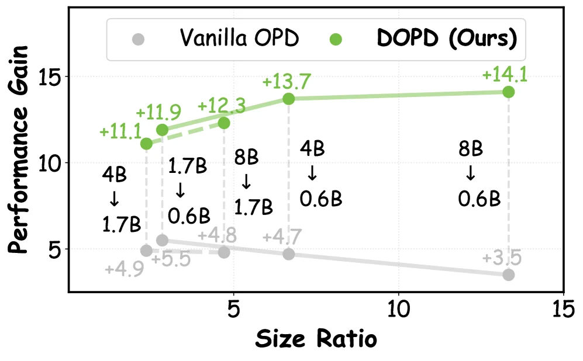
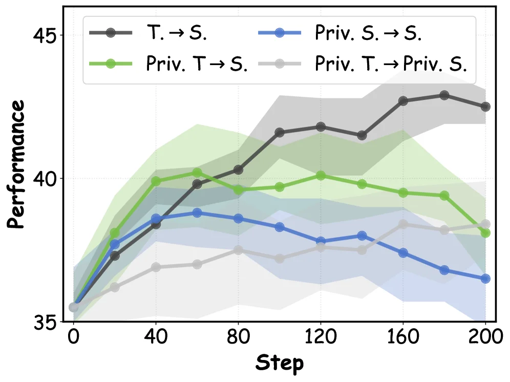
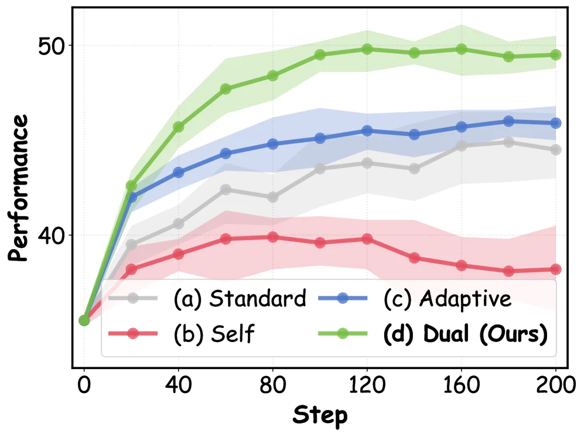

# DOPD: Dual On-policy Distillation

[arXiv](https://arxiv.org/abs/2606.30626) · [HuggingFace](https://huggingface.co/papers/2606.30626) · ▲99

## 摘要（原文）

> On-policy distillation (OPD) offers superior capacity transfer by supervising student-sampled trajectories with dense token-level signals. To furnish high-quality supervision sources and thereby elevate the performance frontier of distillation, an intuitive direction is to infuse privileged information to either teacher or student itself. However, this additional input induces a potential failure mode we dub privilege illusion: a pattern that conflates the transferable capability gap that students are meant to close, and the information asymmetry gap that can only be mimicked but never replicated. This issue is further amplified by the inherent non-uniformity of token-level supervision, where only a small subset of tokens carries pivotal capability-bearing signals. To this end, we propose DOPD, an advantage-aware dual distillation paradigm that dynamically routes token-level supervision between privileged teacher and privileged student policies based on their advantage gap and relative probabilities. Each token receives supervision of different strength, objective, and strategy from either teacher or student itself, which transfers credible capability while simultaneously receiving auxiliary signals, to alleviate privilege illusion. Extensive experiments on both large language model (LLM) and vision-language model (VLM) settings demonstrate that DOPD consistently outperforms Vanilla OPD and other counterparts. Further results on stability, robustness, continual learning, and out-of-distribution tasks validate its superiority.

## 摘要（中译）

On - policy distillation (OPD) 通过使用密集的 token - 级信号监督学生采样的轨迹来提供卓越的能力转移。为了提供高质量的监督源并从而提升蒸馏的性能前沿，一个直观的方向是向教师或学生本身注入特权信息。然而，这种额外的输入会引发一种我们称之为特权幻觉的潜在故障模式：一种混淆学生应该缩小的可转移能力差距和只能模仿而无法复制的信息不对称差距的模式。这个问题进一步被 token - 级监督的固有不均匀性放大，在这种监督中，只有一小部分 token 携带关键的能力承载信号。为此，我们提出了 DOPD，这是一种优势感知的双重蒸馏范式，它根据特权教师和特权学生策略之间的优势差距和相对概率在它们之间动态分配 token - 级监督。每个 token 从教师或学生本身接收不同强度、目标和策略的监督，这既传递了可信的能力，同时又接收辅助信号，以缓解特权幻觉。在大型语言模型（LLM）和视觉 - 语言模型（VLM）设置上的大量实验表明，DOPD 一直优于普通 OPD 和其他对应方法。在稳定性、鲁棒性、持续学习和分布外任务上的进一步结果验证了它的优越性。

## 背景剖析

**背景剖析**

这项研究聚焦于“策略蒸馏”技术，其核心目标是将高性能模型（教师）的能力高效传递给性能较弱的模型（学生）。这类技术在人工智能领域至关重要，例如让大型语言模型（LLM）或视觉-语言模型（VLM）将复杂推理、多模态理解等能力迁移给更小的模型，以实现更低成本的高效部署。真实需求包括提升小模型的决策质量、减少对大规模数据的依赖，同时保持任务适应性。

然而，传统蒸馏方法存在显著局限。早期依赖“离策略”数据的方法会因数据分布与学生实际行为不匹配而降低效果。后续提出的“在策略”蒸馏（OPD）通过让学生自主生成轨迹并用教师提供逐token级监督，缓解了这一问题，但引入了新的瓶颈：当教师或学生获得“特权信息”（如额外推理提示或结构化标注）时，学生可能过度拟合这些信息带来的表面优势（即“特权幻觉”），而非真正学习可迁移的能力。更严重的是，现有方法对所有token采用统一的监督策略，忽略了不同token在能力传递中的价值差异——少数关键token承载核心能力信号，而多数token可能依赖特权信息，导致监督效率低下。

为解决这些问题，本文提出了DOPD（双重在策略蒸馏）框架。其核心思路是动态区分token的监督来源：对于教师具有可信能力优势的token，使用更强的教师监督以传递高价值能力；对于受特权信息主导或低能力的token，则采用更轻量的监督以保持稳定性并鼓励探索。这种方法通过“优势感知”机制，将监督强度、目标和策略动态分配给教师或学生自身，从而减少特权幻觉的影响。

与前人工作相比，DOPD的关键差异在于：1）不再假设所有token对能力传递同等重要，而是基于token的实际价值调整监督策略；2）将特权信息的使用从“全局增强”转向“选择性利用”，避免学生过度依赖不可迁移的信息；3）通过双监督源（教师和学生）的协同优化，平衡了能力转移与探索稳定性。实验表明，这种方法在LLM和VLM任务中均显著优于传统OPD，验证了其有效性和普适性。

## 方法图解

> Figure 5 : Overview of our proposed DOPD.

这张图展示了论文《DOPD: Dual On-policy Distillation》中提出的**优势感知双蒸馏（DOPD）**方法的整体框架和工作流程，旨在解决“特权幻觉”问题并提升蒸馏性能。

### 整体结构与信息流：
图分为上下两部分：
1. **上半部分（策略与蒸馏流程）**：
   - **左侧：Student Policy（学生策略）**：从“Original Input（原始输入）”开始，通过**On - policy Sampling（同策略采样）**生成输出序列 \( y \sim \Pi_S(\cdot|x) \)，即学生策略根据输入 \( x \) 采样得到输出 \( y \)。
   - **中间：Privileged Student Policy（特权学生策略）**和**Privileged Teacher Policy（特权教师策略）**：这两个策略的输入是“Original Input + Privileged Input（原始输入+特权输入）”，它们的输出概率分布分别为 \( q_S = \Pi_S(y_n|x, p, y_{<n}) \)（特权学生策略）和 \( q_T = \Pi_T(y_n|x, p, y_{<n}) \)（特权教师策略）。学生策略的输出会通过箭头传递到这两个特权策略，同时特权策略之间也有信息交互（绿色和黑色箭头）。
2. **下半部分（特权优势差距与条件蒸馏）**：
   - **左侧：Predicted Probability（预测概率）**：展示了学生策略（蓝色）和特权教师策略（绿色）对不同token的预测概率分布（用柱状图表示）。然后计算**Privilege Advantage Gap（特权优势差距）** \( \mathcal{A} = |\ell_S - \ell_T| \)，其中 \( \ell_S = \log \Pi_S(y_n|x, p, y_{<n}) \)（学生策略的对数概率），\( \ell_T = \log \Pi_T(y_n|x, p, y_{<n}) \)（特权教师策略的对数概率）。这个差距衡量了学生和特权教师在token - 级别上的能力差异。
   - **右侧：Condition（条件）与Distillation（蒸馏）**：根据特权优势差距 \( \mathcal{A} \) 的变化（上升或下降）以及学生策略 \( \Pi_S \) 和教师策略 \( \Pi_T \) 的相对强度（Light、Weak、Deep等），来确定不同的蒸馏策略（如 \( q_S \uparrow q_T \uparrow \)、\( q_S \downarrow q_T \downarrow \) 等）。例如，当 \( \mathcal{A} \) 下降且 \( q_S \) 上升、\( q_T \) 上升时，对应“Light \( \Pi_T \)”的情况；当 \( \mathcal{A} \) 上升且 \( q_S \) 上升、\( q_T \) 下降时，对应“Light \( \Pi_S \)”的情况。

### 方法运作方式：
DOPD的核心是**优势感知双蒸馏**，具体如下：
1. **同策略采样**：学生策略基于原始输入进行同策略采样，生成输出序列，这是监督信号的来源。
2. **特权策略引入**：引入特权学生策略和特权教师策略，它们的输入包含特权信息，能够利用额外的信息来生成更准确的输出概率分布。
3. **特权优势差距计算**：通过比较学生策略和特权教师策略对每个token的对数概率，计算出特权优势差距 \( \mathcal{A} \)。这个差距反映了学生和特权教师在token - 级别上的能力差异。
4. **动态蒸馏策略选择**：根据特权优势差距的变化以及学生和教师策略的相对强度，动态地选择蒸馏策略。对于不同的token，根据其对应的 \( \mathcal{A} \) 和策略强度，从特权教师或特权学生（或自身）那里接收不同强度、目标和策略的监督信号。这样可以转移可信的能力，同时接收辅助信号，从而缓解“特权幻觉”问题，即避免混淆学生需要缩小的可转移能力差距和只能模仿而无法复制的信息不对称差距。

### 结果相关（隐含）：
虽然图中没有直接展示实验结果，但结合论文摘要可知，DOPD在大型语言模型（LLM）和视觉 - 语言模型（VLM）设置上的实验中，始终优于Vanilla OPD和其他对比方法，并且在稳定性、鲁棒性、持续学习等方面也有进一步的积极结果。这表明DOPD的方法能够有效提升蒸馏性能，解决特权幻觉问题。

总结来说，DOPD通过优势感知的双蒸馏机制，动态地利用特权学生和教师策略的信息，根据token - 级别的优势和策略强度调整蒸馏策略，从而在转移能力的同时缓解特权幻觉，提升蒸馏效果。

---

> Figure 2 : Comparison of existing (a) standard distillation, (b) self distillation, and (c) adaptive distillation paradigms with our proposed (d) dual distillation paradigm.

这张图（图2）清晰地比较了现有几种知识蒸馏范式与我们提出的双重蒸馏范式（DOPD）。我们来逐一分析每个子图：

*   **(a) 标准蒸馏 (Standard Distillation)**：
    *   **组件与流程**：顶部是“Student Policy”（学生策略），其下方有四个圆圈，代表学生策略生成的输出或状态。底部是“Teacher Policy”（教师策略），同样有四个圆圈。绿色的箭头从教师策略指向学生策略的各个圆圈，表示信息或监督信号从教师流向学生。这代表了传统的知识蒸馏模式，即学生模仿教师的行为或输出。

*   **(b) 自蒸馏 (Self Distillation)**：
    *   **组件与流程**：顶部同样是“Student Policy”。底部是“Privileged Student Policy”（特权学生策略）。蓝色的箭头从特权学生策略指向学生策略的各个圆圈，表示监督信号来自于学生自身的一个“特权”版本。这里的“特权”可能意味着该学生策略拥有更多或更优的信息。

*   **(c) 自适应蒸馏 (Adaptive Distillation)**：
    *   **组件与流程**：顶部是“Student Policy”，底部是“Teacher Policy”。这里的箭头是绿色和浅绿色的混合，从教师策略指向学生策略。这暗示了一种更灵活的监督方式，可能根据某些条件或信号强度动态调整教师对学生的影响。

*   **(d) 双重蒸馏 (Dual Distillation, 我们的方法)**：
    *   **组件与流程**：这是我们提出的方法。顶部是“Student Policy”。底部左侧是“Privileged Student Policy”，右侧是“Privileged Teacher Policy”。这里有两种颜色的箭头：
        *   蓝色箭头从“Privileged Student Policy”指向“Student Policy”的某些圆圈。
        *   绿色箭头从“Privileged Teacher Policy”指向“Student Policy”的其他圆圈。
        *   此外，还有一个双向箭头连接“Privileged Student Policy”和“Privileged Teacher Policy”，表示它们之间存在某种交互或信息交换。
    *   **方法运作机制**：这张图揭示了DOPD方法的核心思想。它不是单一地从教师或学生自身获取监督信号，而是动态地将token级别的监督在“特权教师策略”和“特权学生策略”之间进行分配。具体来说，每个token（或状态）会根据其“优势差距”（advantage gap）和“相对概率”（relative probabilities）从教师或学生那里接收不同强度、不同目标、不同策略的监督。这意味着，对于某些关键的token，学生可能会更多地依赖教师的指导；而对于其他token，学生可能会利用自身特权信息进行学习，或者两者结合。这种动态路由机制旨在缓解“特权幻觉”问题，即避免学生混淆需要学习的真实能力差距和仅仅是模仿的信息不对称差距。

总结来说，这张图通过对比四种不同的蒸馏范式，突出了我们提出的DOPD方法的双重性和动态性。它展示了如何通过同时利用特权的教师和学生策略，并根据具体情况动态调整监督来源，来更有效地进行能力转移，从而提升蒸馏性能。

---

> (a) Performance Gain vs. Teacher-student Size Ratio (b) Gap Reduction vs. Teacher-student Size Ratio Figure 6 : Scalability comparison of proposed DOPD and Vanilla OPD on (a) performance gain and (b) teacher-student gap reduction ratio. Here, the solid and dashed lines represent the 0.6B and 1.7B student policy, respectively.

这张图（图6a）来自论文《DOPD: Dual On-policy Distillation》，展示了所提出的DOPD方法与Vanilla OPD方法在不同“教师-学生模型大小比例”下的“性能增益”对比。

首先，我们来看图的各个组成部分：

1.  **坐标轴**：
    *   **横轴 (X轴)**：标记为“Size Ratio”，表示“教师-学生模型大小比例”。从图中可以看到刻度有4B、5、8B、10、15等，这可能指的是模型的参数规模（例如，4B参数的教师模型与1.7B或0.6B参数的学生模型相比的比例）。这个比例的变化反映了学生模型相对于教师模型的大小。
    *   **纵轴 (Y轴)**：标记为“Performance Gain”，表示“性能增益”。这是一个数值指标，衡量了通过蒸馏（distillation）过程，学生模型相对于其初始状态或某种基准的性能提升程度。数值越高，表示性能提升越显著。

2.  **数据系列与图例**：
    *   **灰色圆点和实线**：代表“Vanilla OPD”（即原始的、未改进的On-policy Distillation方法）。
    *   **绿色圆点和虚线**：代表“DOPD (Ours)”（即论文中提出的新方法）。
    *   图例中的“4B ↓ 1.7B”和“8B ↓ 0.6B”等标注，解释了“Size Ratio”的具体含义。例如，“4B ↓ 1.7B”表示教师模型有4B参数，学生模型有1.7B参数；“8B ↓ 0.6B”表示教师模型有8B参数，学生模型有0.6B参数。这些标注帮助我们理解在不同教师-学生大小组合下，两种方法的性能表现。

3.  **数据点与趋势**：
    *   对于“Vanilla OPD”（灰色系列）：
        *   当教师是4B、学生是1.7B时，性能增益约为+4.9。
        *   当教师是4B、学生是0.6B时，性能增益约为+5.5。
        *   随着教师-学生比例的增加（例如，教师变为8B，学生为0.6B时性能增益为+4.7；教师为8B，学生为0.6B时性能增益为+3.5），Vanilla OPD的性能增益呈现出下降的趋势。这表明，当学生模型相对于教师模型较小时，原始的OPD方法的性能提升效果会变差。

    *   对于“DOPD (Ours)”（绿色系列）：
        *   当教师是4B、学生是1.7B时，性能增益约为+11.1。
        *   当教师是1.7B、学生是0.6B时（这里可能需要根据上下文理解，因为通常教师模型更大），性能增益约为+11.9。
        *   当教师是8B、学生是1.7B时，性能增益约为+12.3。
        *   当教师是4B、学生是0.6B时，性能增益约为+13.7。
        *   当教师是8B、学生是0.6B时，性能增益达到了+14.1。
        *   DOPD的性能增益整体上远高于Vanilla OPD，并且在不同的教师-学生大小比例下，其性能增益相对稳定，甚至略有上升的趋势。这表明DOPD方法能够更有效地利用教师模型的知识，即使在学生模型较小的情况下也能实现显著的性能提升。

4.  **方法运作的揭示**：
    *   这张图揭示了DOPD方法如何在性能上超越Vanilla OPD。通过比较两种方法在不同教师-学生大小比例下的性能增益，我们可以看出DOPD能够更有效地将教师模型的能力转移到学生模型中。
    *   论文中提到，DOPD是一种“优势感知的双向蒸馏范式”（advantage-aware dual distillation paradigm），它会根据教师和学生策略的“优势差距”（advantage gap）和“相对概率”（relative probabilities）动态地在特权教师和特权学生策略之间路由token级别的监督信号。
    *   具体来说，每个token会从教师或学生自身接收到不同强度、目标和策略的监督。这样做的好处是，它既能转移可信的能力，同时又能接收辅助信号，从而缓解“特权幻觉”（privilege illusion）问题。特权幻觉是指学生试图模仿的不仅仅是需要弥补的能力差距，还包括那些只能模仿而无法真正复制的信息不对称差距。
    *   因此，DOPD通过这种动态路由机制，确保了更有效的知识转移，尤其是在学生模型资源受限的情况下，从而实现了更高的性能增益。

5.  **结论**：
    *   从图中可以清楚地看到，在各种教师-学生模型大小比例下，DOPD的性能增益都显著高于Vanilla OPD。
    *   这表明DOPD方法能够更有效地进行模型蒸馏，特别是在学生模型比教师模型小很多的情况下，其优势更加明显。
    *   这张图支持了论文的论点，即DOPD通过其独特的双向蒸馏和动态路由机制，能够克服Vanilla OPD的局限性，从而提升性能前沿。

总结来说，这张图通过对比两种方法在不同教师-学生大小比例下的性能增益，直观地展示了DOPD方法在模型蒸馏任务中的优越性。它清晰地表明，DOPD能够更有效地利用教师模型的知识，即使在学生模型资源有限的情况下也能实现显著的性能提升。

---

> (a) Performance vs. Training Step (b) Entropy vs. Training Step Figure 3 : Comparison of (a) performance and (b) entropy on OPD variants with privileged information. Here, T., S., and Priv. denote teacher policy, student policy and with privileged information, respectively.

这张图（图3a）展示了不同基于策略的蒸馏方法在训练步骤（Step）与性能（Performance）之间的关系，用于比较带有特权信息的OPD变体。首先，我们来看坐标轴：横轴是“Step”（训练步骤），从0到200，表示训练过程的进展；纵轴是“Performance”（性能），数值范围从35到45，衡量模型在某项任务上的表现。

接下来是图中的四条曲线，每条曲线代表一种不同的方法，通过图例来区分：
- 黑色曲线（T. → S.）：表示“教师策略到学生策略”的蒸馏方法，即传统的教师指导学生学习的方式。
- 蓝色曲线（Priv. S. → S.）：表示“带有特权信息的学生策略到学生策略”的方法，即学生在拥有额外特权信息的情况下进行自我学习。
- 绿色曲线（Priv. T → S.）：表示“带有特权信息的教师策略到学生策略”的方法，即教师在拥有特权信息的情况下指导学生。
- 灰色曲线（Priv. T → Priv. S.）：表示“带有特权信息的教师策略到带有特权信息的学生策略”的方法，即教师和学生都拥有特权信息的情况下进行蒸馏。

每条曲线的点表示在特定训练步骤下的性能值，而曲线周围的阴影区域可能表示性能的波动范围或置信区间，展示了不同方法在不同步骤下的稳定性。

从图中可以看出，黑色曲线（T. → S.）在训练过程中性能逐渐上升，并在后期保持较高的水平，说明传统的教师指导学生学习的方法在性能上表现较好。绿色曲线（Priv. T → S.）的性能也随着训练步骤的增加而上升，但在后期略有下降，可能是因为特权信息的引入带来了一些不稳定因素。蓝色曲线（Priv. S → S.）的性能在训练初期有所上升，但在后期逐渐下降，说明仅靠学生自身的特权信息进行学习可能效果不佳。灰色曲线（Priv. T → Priv. S.）的性能在整个训练过程中相对平稳，没有明显的上升或下降趋势，可能是因为教师和学生都拥有特权信息，导致性能提升有限。

这张图揭示了不同方法在训练过程中的性能变化，帮助我们理解带有特权信息的蒸馏方法如何运作以及它们的优缺点。通过比较这些曲线，我们可以得出结论：传统的教师指导学生学习的方法（T. → S.）在性能上表现最好，而带有特权信息的方法需要进一步优化以提高性能和稳定性。

---

> (a) Performance vs. Training Step (b) Entropy vs. Training Step Figure 8 : Training stability comparison of proposed DOPD and representative baselines, reporting the (a) performance and (b) entropy trends over training steps on LiveBench.

这张图（图8a）展示了不同方法在LiveBench基准测试上的**训练稳定性比较**，具体通过**性能随训练步骤的变化趋势**来呈现。

首先，我们来看图的各个组成部分：

1.  **坐标轴**：
    *   **X轴（横轴）**：代表“Step”（训练步骤），范围从0到200。这表示训练过程的进展。
    *   **Y轴（纵轴）**：代表“Performance”（性能），数值范围大约从35到50以上。这衡量了模型在LiveBench任务上的表现。

2.  **曲线与图例**：
    图中有四条主要的曲线，每条曲线代表一种不同的方法，并用不同的颜色和标记区分。图例清晰地标明了每条曲线对应的 方法名称：
    *   **灰色曲线 (a) Standard**：代表“标准”方法或基线。
    *   **红色曲线 (b) Self**：代表“自”方法或基线。
    *   **蓝色曲线 (c) Adaptive**：代表“自适应”方法或基线。
    *   **绿色曲线 (d) Dual (Ours)**：代表本文提出的方法“Dual (我们的方法)”。

3.  **数据点与趋势**：
    每条曲线由一系列数据点连接而成，这些数据点表示在特定训练步骤（如0、40、80、120、160、200步）下测得的平均性能。曲线的整体走向展示了性能随训练步骤增加的变化趋势。每条曲线周围还有一个半透明的阴影区域，这通常表示性能的方差或置信区间，反映了结果的波动性。

4.  **信息流动与解读**：
    这张图的核心信息是展示不同方法在训练过程中的学习曲线。读者可以通过观察曲线的上升速度、最终达到的性能水平以及曲线的稳定性（即阴影区域的宽窄）来比较这些方法。

现在，我们来分析这张图揭示的方法运作方式以及结果：

*   **方法比较的目的**：这张图的目的是比较所提出的“Dual (Ours)”方法与其他三种基线方法（Standard, Self, Adaptive）在训练稳定性方面的优劣。训练稳定性可以通过性能提升的速度、最终性能的高低以及性能波动的大小来判断。

*   **方法如何运作（从结果推断）**：
    虽然图中没有直接展示方法的运作机制，但结合论文摘要和图的结果，我们可以推断：
    *   **Dual (Ours) 方法**（绿色曲线）在所有方法中表现最佳。它的性能在早期训练阶段就迅速提升，并且在后续步骤中持续保持较高的性能水平，最终接近50的性能值。其阴影区域也相对较窄，表明性能波动较小，训练过程稳定。这说明Dual方法能够有效地利用其提出的“优势感知的双蒸馏范式”，动态地在特权教师和特权学生策略之间分配token级别的监督，从而缓解“特权幻觉”问题，并实现更稳定和更高的性能。
    *   **Adaptive 方法**（蓝色曲线）的性能次之，最终性能略低于Dual方法，但也表现出较好的稳定性和较高的最终性能。
    *   **Standard 方法**（灰色曲线）的性能增长较为平缓，最终性能低于Dual和Adaptive方法。
    *   **Self 方法**（红色曲线）的性能表现最差，不仅最终性能最低，而且在训练过程中性能波动较大（阴影区域较宽），表明其训练稳定性较差。

*   **结论**：
    从图中可以清晰地得出结论：在LiveBench基准测试上，所提出的**Dual (Ours) 方法在训练稳定性和最终性能方面均显著优于其他代表性的基线方法（包括Standard, Self, Adaptive）**。其性能曲线更高、更平滑，表明该方法能够更有效地进行训练，并达到更高的性能水平。这与论文摘要中提到的“DOPD consistently outperforms Vanilla OPD and other counterparts”的结论一致，尽管此图具体针对的是LiveBench上的训练稳定性比较。

总而言之，这张图通过展示不同方法在训练步骤上的性能变化，直观地比较了它们的训练稳定性和最终性能，有力地支持了论文中提出的Dual方法的优越性。
