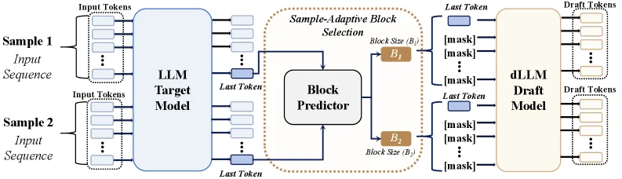
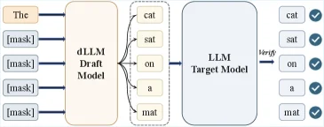

# BlockPilot: Instance-Adaptive Policy Learning for Diffusion-based Speculative Decoding

[arXiv](https://arxiv.org/abs/2606.31315) · [HuggingFace](https://huggingface.co/papers/2606.31315) · ▲74

## 摘要（原文）

> Speculative decoding accelerates inference by using a lightweight draft model to generate candidate tokens in parallel, and are then verified by the target model, enabling lossless acceleration. Recently, diffusion-based speculative decoding further improves parallelism by generating multiple tokens per forward pass via block-level diffusion, achieving state-of-the-art (SOTA) performance. However, existing methods adopt a fixed inference block size and assume a uniform optimal decoding strategy across all inputs. In this paper, we show that this assumption is suboptimal, as the optimal block size varies across samples and plays a critical role in speculative decoding performance. Moreover, these values exhibit a clear local structure, concentrating around the training block size, which reduces the problem to a low-dimensional and structured decision space. Based on these insights, we propose BlockPilot, a sample-adaptive policy that predicts the optimal block size from the prefilling representation. Specifically, we formulate block size selection as a lightweight policy learning problem and propose an instance-adaptive decision mechanism that predicts the optimal block size based on the representation of the prefilling stage. The prediction is performed only once after prefilling, allowing for seamless integration. Extensive experiments demonstrate that our method is plug-and-play, introduces minimal overhead, and consistently improves efficiency, achieving an acceptance length of 5.92 and a 4.20times speedup on Qwen3-4B under temperature T=1.

## 摘要（中译）

推测性解码通过使用轻量级草稿模型并行生成候选token，然后由目标模型进行验证，从而实现无损加速。最近，基于扩散的推测性解码通过在单次前向传播中生成多个token的块级扩散进一步提高了并行性，实现了最先进（SOTA）的性能。然而，现有方法采用固定的推理块大小，并假设所有输入都具有统一的最优解码策略。在本文中，我们表明这种假设是次优的，因为最优块大小在不同样本之间变化，并且在推测性解码性能中起着关键作用。此外，这些值表现出明显的局部结构，集中在训练块大小附近，这将问题简化为低维和结构化的决策空间。基于这些见解，我们提出了BlockPilot，这是一种样本自适应策略，可从预填充表示中预测最优块大小。具体来说，我们将块大小选择表述为一个轻量级的策略学习问题，并提出了一种实例自适应决策机制，该机制根据预填充阶段的表示来预测最优块大小。预测仅在预填充后执行一次，允许无缝集成。大量实验表明，我们的方法是即插即用的，引入的开销最小，并且始终提高效率，在Qwen3-4B上实现了接受长度为5.92和在温度T=1时的4.20倍加速。

## 背景剖析

### 背景剖析  

#### 1. 技术背景与需求  
大型语言模型（LLMs）在推理任务中表现出色，但其逐token的自回归生成方式导致效率低下——每个token必须依赖前一个token的输出，使得长文本生成时延迟高、并行性差。**推测解码（Speculative Decoding）**通过轻量级“草稿模型”并行生成候选token，再用目标模型验证，实现了无损加速。近年来，基于扩散模型的推测解码（diffusion-based speculative decoding）进一步提升了并行性：扩散模型（dLLMs）通过块级扩散一次生成多个token，显著降低了延迟。然而，这类技术仍面临一个核心问题：如何高效平衡并行速度与生成准确性？  

#### 2. 先前方法的局限性  
现有方法假设所有输入的最佳块大小（block size）相同，并直接沿用训练时的固定配置。但实际中，不同输入的语义约束、上下文确定性和预测难度差异很大：例如，结构化任务（如代码生成）可能需要更大的块以提升效率，而开放域生成（如创意写作）则需要更小的块以避免错误累积。固定块大小的策略忽略了这种输入特异性，导致性能次优。此外，尽管扩散模型的生成具有局部结构（最优块大小通常集中在训练配置附近），但先前方法未利用这一特性，导致优化效率低下。  

#### 3. 本文的解决方案  
论文提出**BlockPilot**，一种样本自适应的块大小选择方法。其核心思路是：将块大小视为一个可学习的策略，而非静态参数。具体而言，在目标模型完成“预填充”（prefilling）阶段后，利用最终token的预测分布作为当前解码状态的表示（该分布反映了上下文不确定性和未来生成的稳定性），并训练一个轻量级预测器来推断最佳块大小。这一过程仅需一次计算，且不修改现有扩散推测解码框架，实现了即插即用。  

#### 4. 与前人工作的关键差异  
与先前方法相比，BlockPilot的突破在于：  
- **从工程参数到学习组件**：首次将块大小选择视为一个策略学习问题，而非固定超参数。  
- **利用局部结构**：发现最优块大小的分布具有局部性，将问题转化为低维离散决策空间，简化了优化难度。  
- **轻量级集成**：预测器仅在预填充后运行一次，避免了在线搜索的高开销，同时保持与现有框架的兼容性。  

通过这一设计，BlockPilot在Qwen3-4B模型上实现了4.20倍的速度提升，同时保持输出质量，证明了自适应块大小策略的有效性。

## 方法图解

> Figure 4 : Overview of the BlockPilot inference pipeline. Given an input sequence, the target LLM performs prefilling and produces the predictive distribution of the last token, which serves as a compact representation of the decoding state. This distribution is then fed into a lightweight block size predictor to determine an instance-specific block size. Based on the predicted block size, the diffusion-based draft model generates a block of draft tokens in parallel.

这张图展示了BlockPilot推理流程的概述，它清晰地描绘了从输入序列到生成草稿令牌的整个过程。

首先，我们看到图的左侧有两个输入序列，分别标记为“Sample 1 Input Sequence”和“Sample 2 Input Sequence”。每个输入序列都包含一系列“Input Tokens”，这些令牌被送入一个名为“LLM Target Model”的大型语言模型（LLM）。这个目标模型的作用是对输入序列进行“prefilling”（预填充），并产生最后一个令牌的预测分布。这个预测分布作为解码状态的紧凑表示，随后被用于决定最优的块大小。

接下来，目标模型输出的最后一个令牌的预测分布被送入一个名为“Block Predictor”的轻量级模块。这个模块的任务是根据预填充阶段的表示来预测一个特定于实例的块大小。在图中，我们可以看到“Block Predictor”与一个名为“Sample-Adaptive Block Selection”的部分相连，这个部分负责根据预测的块大小选择合适的块。图中展示了两个不同的块大小，分别标记为“B₁”和“B₂”，这表明该方法可以为不同的输入样本选择不同的块大小。

然后，根据预测的块大小，一个基于扩散的草稿模型（dLLM Draft Model）会并行生成一个块的草稿令牌。在图中，草稿模型的输入包括最后一个令牌和一些被标记为“[mask]”的令牌，这些令牌表示需要生成的草稿令牌。草稿模型的输出是一系列“Draft Tokens”，这些令牌是并行生成的，从而实现了加速。

整个流程的关键在于，BlockPilot通过预测最优的块大小来实现样本自适应的策略学习，从而在扩散基的投机解码中实现更高的效率。这种方法允许根据每个输入样本的特性动态调整块大小，而不是使用固定的块大小，从而提高了整体的解码性能。

总结来说，这张图展示了BlockPilot如何通过结合目标模型的预填充表示和轻量级的块大小预测器，来实现样本自适应的投机解码，从而在保持无损加速的同时提高效率。

---

> Figure 1 : Diffusion-based speculative decoding with a dLLM draft model. The dLLM proposes a block of tokens in parallel, while the target LLM verifies the block and accepts the longest consistent prefix.

这张图直观地展示了基于扩散的投机解码（diffusion - based speculative decoding）的工作流程，核心是**dLLM 草稿模型（draft model）**和**LLM 目标模型（target model）**的协作，结合图中的元素和箭头，我们可以拆解为以下步骤：

### 组件与数据流向
1. **输入层**：最左侧是输入序列，包含已知的 token（如“The”）和多个被掩码（[mask]）的位置。这些 [mask] 位置是需要模型生成 token 的地方，整个输入序列会被送入**dLLM 草稿模型**。
2. **dLLM 草稿模型**：这个模块（橙色矩形）的作用是**并行地生成一组候选 token 块**（图中虚线框内的“cat”“sat”“on”“a”“mat”）。这里的“并行生成”体现了扩散模型的优势——一次前向传播可以生成多个 token，而不是传统方法逐个生成，这大大提高了并行性。
3. **中间传递**：dLLM 生成的 token 块被传递给**LLM 目标模型**（蓝色矩形）。这一步是“提案 - 验证”流程的关键衔接，dLLM 先提出一组可能的 token，然后由更强大的目标模型来验证。
4. **LLM 目标模型**：这个模块的任务是**验证 dLLM 生成的 token 块**，并接受“最长的连续一致前缀”（即从第一个 token 开始，连续被验证为正确的最长序列）。从图中右侧的输出可以看到，“cat”“sat”“on”“a”“mat”都被打勾（√），说明这个块中的所有 token 都被目标模型接受，成为最终的输出序列的一部分。
5. **验证（Verify）箭头**：从 LLM 目标模型指向右侧输出的箭头表示“验证”操作完成，确认了 dLLM 生成的 token 块的有效性，并将这些 token 整合到最终的输出中。

### 方法的具体运作方式
这张图清晰地展示了基于扩散的投机解码的核心逻辑：
- **并行生成**：dLLM 作为“草稿模型”，利用扩散模型的特性，在一次前向传播中并行生成多个 token（形成一个 token 块），而不是逐个生成，这提升了推理的并行性和速度。
- **验证与接受**：生成的 token 块被送到 LLM 目标模型进行验证。目标模型的作用是检查这些 token 是否正确（或符合预期的输出）。这里的关键是“接受最长的连续一致前缀”——即从输入的起始位置开始，尽可能多地保留被目标模型验证为正确的 token。在图中，dLLM 生成的整个块（“cat”“sat”“on”“a”“mat”）都被接受，说明这个块中的所有 token 都通过了验证。
- **效率提升**：通过让 dLLM 并行生成 token 块，再由目标模型批量验证，这种方法避免了传统逐个生成和验证的低效，实现了“无损加速”（因为最终接受的 token 是正确的，没有引入错误）。而基于扩散的版本进一步优化了并行性，因为它能一次生成多个 token（块），而不是单个 token。

### 结论（从图中可推断）
这张图展示了基于扩散的投机解码的基本工作流程：**dLLM 并行生成 token 块 → LLM 目标模型验证并接受最长一致前缀**。这种方法通过并行生成和批量验证，显著提升了推理效率，同时保证了输出的准确性（因为只有被目标模型接受的 token 才会被保留）。图中的示例显示，dLLM 生成的整个 token 块都被目标模型接受，说明在这种场景下，该块中的所有 token 都是正确的，从而实现了高效的解码过程。
