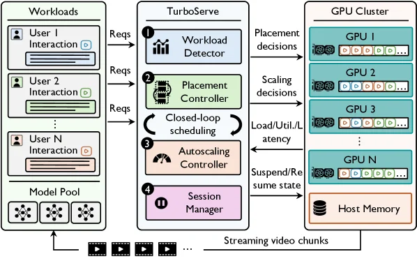
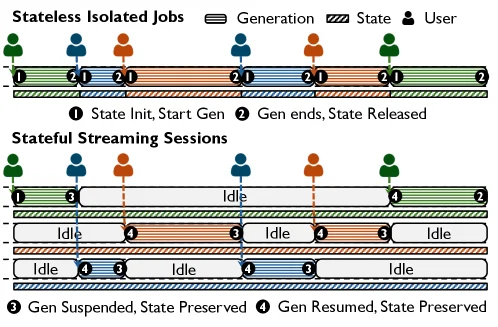
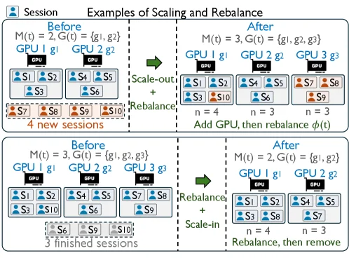
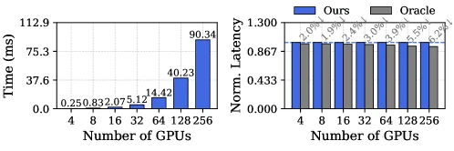
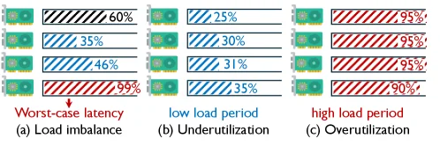

# TurboServe: Serving Streaming Video Generation Efficiently and Economically

[arXiv](https://arxiv.org/abs/2606.19271) · [HuggingFace](https://huggingface.co/papers/2606.19271) · ▲30

## 摘要（原文）

> Streaming video generation is emerging as a new serving workload in which users interact with long-lived sessions that generate video progressively, chunk by chunk. Unlike offline video generation or typical LLM serving, streaming video generation must preserve session state across active and idle periods, repeatedly schedule ongoing sessions, and deliver each chunk under a tight latency target. This creates two key serving challenges in multi-user, multi-GPU environments: session duration heterogeneity, where long-running sessions make placement decisions suboptimal over time, and temporal user-demand heterogeneity, where the number of active sessions fluctuates sharply across bursts and idle periods.
  We present TurboServe, the first serving system designed specifically for streaming video generation workloads. TurboServe formulates serving as an online scheduling problem that jointly coordinates session placement and GPU provisioning. Its closed-loop scheduling algorithm combines a migration-aware placement controller, which rebalances sessions across GPUs to reduce the maximum per-chunk latency, with a load-driven autoscaling controller, which adapts the GPU budget to workload variation for improved cost efficiency. To support these decisions at runtime, TurboServe implements coalesced chunk processing for batching concurrent active sessions on the same GPU, GPU-CPU offloading for session suspension and resumption, and NCCL-based GPU-GPU migration for online rebalancing. We evaluate TurboServe on real-world production traces from Shengshu Technology across multiple model sizes and GPU clusters with up to 64 NVIDIA B300 GPUs. Compared with baseline serving configurations, TurboServe reduces worst-case per-chunk latency by 37.5% and total GPU operating cost by 37.2% on average. Our code is publicly available at https://github.com/shengshu-ai/TurboServe.

## 摘要（中译）

流式视频生成正成为一种新的服务工作负载，在这种工作负载中，用户与长期会话进行交互，这些会话逐步地、逐块地生成视频。与离线视频生成或典型的LLM（大型语言模型）服务不同，流式视频生成必须在活跃和空闲时段保留会话状态，反复调度正在进行的会话，并在严格的延迟目标下交付每个数据块。这在多用户、多GPU环境中带来了两个关键的服务挑战：会话时长异质性，即长时间运行的会话会随着时间的推移使放置决策变得次优；以及时间上的用户需求异质性，即活跃会话的数量在突发和空闲时段之间急剧波动。
我们提出了TurboServe，这是第一个专门为流式视频生成工作负载设计的服务系统。TurboServe将服务表述为一个在线调度问题，该问题同时协调会话放置和GPU资源调配。其闭环调度算法结合了一个迁移感知的放置控制器，该控制器在GPU之间重新平衡会话，以减少每个数据块的最大延迟，以及一个负载驱动的自动缩放控制器，该控制器根据工作负载变化调整GPU预算，以提高成本效率。为了在运行时支持这些决策，TurboServe实现了合并的数据块处理，以便在同一个GPU上批处理并发的活跃会话，实现了会话挂起和恢复的GPU-CPU卸载，以及基于NCCL（NVIDIA集体通信库）的GPU-GPU迁移，用于在线重新平衡。我们在来自盛书科技的真实生产跟踪数据上评估了TurboServe，涉及多种模型大小和最多具有64个NVIDIA B300 GPU的GPU集群。与基线服务配置相比，TurboServe将最坏情况下的每个数据块延迟降低了37.5%，并将总GPU运营成本平均降低了37.2%。我们的代码在https://github.com/shengshu-ai/TurboServe上公开可用。

## 背景剖析

### 背景剖析  

#### 1. 技术背景  
随着视频生成模型（如Sora、Veo等）的发展，流式视频生成成为生成式AI服务的新方向。这类技术允许用户通过自然语言提示逐步生成视频片段（例如逐帧或逐秒输出），并在生成过程中实时调整内容（如修改场景或角色）。其核心需求是**低延迟实时交互**——用户希望看到视频逐步生成的效果，而非等待完整视频输出。典型应用包括影视制作（实时预览特效）、广告生成（动态调整创意）或教育内容创作（即时反馈教学视频）。然而，传统视频生成系统（如Sora）采用“离线一次性生成”模式，无法支持这种长时交互场景，因此需要专门的流式服务平台。  

#### 2. 之前的问题  
现有系统面临两大挑战：  
- **会话时长异构性**：不同用户的会话持续时间差异极大（从几秒到数小时），传统系统将所有会话视为“短期任务”，导致长时会话占用资源过久，新用户无法及时获得服务。  
- **需求波动性**：用户活动呈突发性（如高峰期大量请求涌入，低峰期空闲），静态资源分配要么浪费GPU（低峰期），要么因资源不足导致延迟飙升（高峰期）。  
此前方法未针对“持续会话状态”和“动态负载”优化，导致延迟增加和成本浪费。  

#### 3. 本文的解法  
TurboServe通过**联合调度会话放置与GPU资源分配**解决上述问题：  
- **动态会话迁移**：使用NCCL（GPU间高速通信）实现会话在GPU间的迁移，避免长时会话阻塞资源。  
- **弹性资源分配**：根据实时负载自动扩展或缩减GPU数量，例如高峰期增加GPU以降低延迟，低峰期释放资源以节省成本。  
- **批处理与挂起机制**：将多个活跃会话的计算合并（批处理）以提升GPU利用率，并允许空闲会话暂时转移到CPU内存以释放GPU资源。  

#### 4. 切入角度  
与现有系统不同，TurboServe是**首个专为流式视频生成设计**的系统，其核心创新在于将“会话管理”与“资源调度”视为一个整体问题。传统方法（如vLLM-Omni或TridentServe）仅优化单次请求，而TurboServe通过闭环算法同时平衡延迟和成本，例如：  
- **迁移感知调度**：动态调整会话位置以减少最坏情况下的延迟。  
- **负载驱动扩展**：根据实时需求调整GPU数量，而非依赖静态配置。  
实验表明，该方法在延迟（降低37.5%）和成本（降低37.2%）上均显著优于基线方案。

## 方法图解

> Figure 5 : TurboServe system overview. TurboServe processes streaming requests and session events through a closed-loop scheduler that places and migrates sessions across GPU workers, adjusts GPU provisioning, and offloads suspended states to host memory. Runtime load, utilization, and latency feedback guide these decisions to balance serving latency and GPU cost.

这张图展示了TurboServe系统的整体架构和工作流程，用于高效经济地处理流式视频生成服务。

首先，我们来看左侧的“Workloads”部分。这里代表了多个用户（User 1, User 2, ..., User N）的交互请求，以及一个“Model Pool”（模型池），其中包含了用于视频生成的模型。用户的交互请求（Reqs）会发送到中间的TurboServe系统。

接下来是中间的TurboServe核心部分，它包含四个主要组件，按照编号1到4的顺序排列：

1. **Workload Detector（工作负载检测器）**：这个组件负责接收来自用户的请求（Reqs），并检测当前的工作负载情况。它会分析请求的数量、类型和频率等信息。

2. **Placement Controller（放置控制器）**：根据工作负载检测器的结果，放置控制器决定将视频生成会话（sessions）放置在哪个GPU上进行执行。它的目标是优化会话的放置，以减少每个视频块（chunk）的最大延迟。

3. **Autoscaling Controller（自动缩放控制器）**：这个组件根据负载、利用率（Load/Util/Latency）等反馈信息，动态调整GPU的资源预算（provisioning）。当工作负载增加时，它会增加GPU的数量或资源；当工作负载减少时，它会减少GPU的资源，以提高成本效率。

4. **Session Manager（会话管理器）**：会话管理器负责管理会话的生命周期，包括会话的暂停（Suspend）和恢复（Resume）。它会将会话的状态（state）保存到主机内存（Host Memory）中，以便在需要时恢复会话的执行。

然后，我们来看右侧的“GPU Cluster”部分。这里包含了多个GPU（GPU 1, GPU 2, ..., GPU N）和主机内存（Host Memory）。TurboServe系统会根据放置控制器的决策，将视频生成会话分配到不同的GPU上进行执行。同时，自动缩放控制器会根据负载情况调整GPU的数量或资源。会话管理器会将暂停的会话状态保存到主机内存中，并在需要时恢复会话的执行。

数据或信息的流动顺序如下：

1. 用户的交互请求（Reqs）从左侧的“Workloads”部分发送到TurboServe的“Workload Detector”。
2. “Workload Detector”检测工作负载，并将信息传递给“Placement Controller”。
3. “Placement Controller”根据工作负载情况，做出放置决策（Placement decisions），并将视频生成会话分配到不同的GPU上进行执行。
4. “Autoscaling Controller”根据负载、利用率等反馈信息，做出缩放决策（Scaling decisions），并调整GPU的资源预算。
5. “Session Manager”管理会话的生命周期，包括会话的暂停和恢复，并将会话的状态保存到主机内存中。
6. GPU集群中的每个GPU执行分配给它的视频生成会话，并生成视频块（chunk）。
7. 视频块通过流媒体（Streaming video chunks）的方式传输回用户。

这张图揭示了TurboServe方法的具体运作方式：

- **闭合循环调度（Closed-loop scheduling）**：TurboServe通过一个闭合循环调度算法，协调会话的放置和GPU的资源配置。这个算法结合了一个迁移感知的放置控制器（migration-aware placement controller）和一个负载驱动的自动缩放控制器（load-driven autoscaling controller）。
- **迁移感知的放置控制器**：这个控制器通过在不同的GPU之间重新平衡会话，来减少每个视频块的最大延迟。它会考虑会话的迁移成本，以确保重新平衡的收益大于成本。
- **负载驱动的自动缩放控制器**：这个控制器根据工作负载的变化，动态调整GPU的资源预算。当工作负载增加时，它会增加GPU的数量或资源；当工作负载减少时，它会减少GPU的资源，以提高成本效率。
- **运行时反馈**：TurboServe通过运行时的负载、利用率和延迟反馈（Runtime load, utilization, and latency feedback）来指导这些决策，以平衡服务延迟和GPU成本。

此外，图中还提到了一些技术细节：

- **合并块处理（Coalesced chunk processing）**：用于在同一GPU上批处理并发的活跃会话，以提高效率。
- **GPU-CPU卸载（GPU-CPU offloading）**：用于将会话的状态卸载到主机内存，以支持会话的暂停和恢复。
- **基于NCCL的GPU-GPU迁移（NCCL-based GPU-GPU migration）**：用于在线重新平衡会话，以提高性能。

总之，这张图详细展示了TurboServe系统的架构和工作流程，说明了它如何通过闭合循环调度、迁移感知的放置控制器和负载驱动的自动缩放控制器，来高效经济地处理流式视频生成服务。

---

> Figure 1 : Stateless isolated generation jobs ( top ) compared with stateful streaming generation sessions ( bottom ) in multi-user scenarios. In stateless generation, each user request initializes temporary generation state, starts generation, and releases the state once the generation job completes. In stateful streaming generation, each user corresponds to a persistent session that alternates between active generation and idle periods; generation can be suspended and later resumed while preserving the session state across periods.

这张图（图1）通过对比两种不同的计算任务模型，直观地展示了流式视频生成服务所面临的独特挑战以及其核心设计思想。

首先看图的上半部分，标题为“Stateless Isolated Jobs”（无状态独立作业）。这部分描述了一种传统的、无状态的计算模型。图中有五条平行的时间线，每条线代表一个用户（由不同颜色的人形图标表示：绿色、蓝色、橙色）。时间从左向右流动。

*   **组件与流程**：
    *   每条时间线上的活动分为几个阶段。首先是“① State Init, Start Gen”（状态初始化，开始生成），这表示当一个用户请求到达时，系统会初始化一个新的生成状态，并开始执行生成任务。这个阶段用一条实心的彩色条块（颜色与用户对应）表示。
    *   接着是“② Gen ends, State Released”（生成结束，状态释放），这表示生成任务完成后，系统会释放该任务所占用的状态资源。这个阶段也用一条实心的彩色条块表示，通常颜色可能与前一个阶段相同或略有不同，以示区分。
    *   在这些活动之间，时间线是空白的，表示没有活动的生成任务。
    *   图例中的“Generation”（生成）用实心条块表示，“State”（状态）的概念隐含在任务的开始和结束中，因为无状态模型在任务结束后会释放状态。
    *   箭头或流程顺序：用户请求（人形图标）触发状态的初始化和生成任务的开始，生成任务完成后，状态被释放，然后等待下一个请求（如果有的话）。

这部分揭示了无状态作业的特点：每个请求都是独立的，有自己的临时状态，任务完成后状态即被释放，资源可以被重新利用。

接下来看图的下半部分，标题为“Stateful Streaming Sessions”（有状态流式会话）。这部分描述了流式视频生成的服务模型，与上半部分形成鲜明对比。

*   **组件与流程**：
    *   同样有五条平行的时间线，每条线代表一个用户的持久会话。
    *   每个会话的活动分为“活跃生成”和“空闲”（Idle）两种状态。
    *   “③ Gen Suspended, State Preserved”（生成暂停，状态保留）：当会话处于空闲期时，生成过程被暂停，但会话的状态被保留下来。这在图中用较浅的、可能是条纹或虚线的条块表示，或者仅仅是标注了“Idle”但明确指出状态被保留。
    *   “④ Gen Resumed, State Preserved”（生成恢复，状态保留）：当会话再次变为活跃时，生成过程从之前暂停的地方恢复，且状态保持不变。这同样用条块表示，可能颜色与之前的活跃期相关联。
    *   图例清晰地标明了“③ Gen Suspended, State Preserved”和“④ Gen Resumed, State Preserved”。
    *   箭头或流程顺序：用户与系统建立会话后，会经历多次活跃和空闲的交替。在活跃期，视频块被生成；在空闲期，生成被暂停但状态被保留，以便后续快速恢复。

这部分揭示了有状态流式会话的核心特点：会话是持久的，跨越多个活跃和空闲周期。关键在于，在空闲期间，会话状态被保留，这样当用户再次请求时，可以从上次中断的地方继续生成，而不需要从头开始。这带来了两个主要挑战：会话持续时间的异质性（长会话可能导致资源分配随时间变得次优）和时间上的用户需求异质性（活跃会话数量在突发期和空闲期之间剧烈波动）。

**方法运作的解释**：
这张图通过对比，说明了为什么流式视频生成服务需要特殊的设计。无状态模型不适合，因为它无法处理需要跨多个周期持续进行的任务，并且在任务间释放状态会导致重新开始的开销。

TurboServe 方法正是为了解决这些问题而设计的：
1.  **会话的持久性和状态保留**：如图下半部分所示，系统需要支持会话在活跃和空闲之间切换，同时保留状态。这意味着系统需要有机制来暂停和恢复生成过程，而不会丢失中间结果或上下文。
2.  **在线调度算法**：为了应对会话持续时间的异质性和用户需求的波动，TurboServe 将服务建模为一个在线调度问题，该问题联合协调会话放置（将哪个会话放在哪个GPU上）和GPU资源调配（根据负载增加或减少GPU）。
    *   **迁移感知的放置控制器**：为了减少每个视频块的延迟，系统需要在多个GPU之间重新平衡会话。图中虽然没有直接展示迁移过程，但“NCCL-based GPU-GPU migration for online rebalancing”（基于NCCL的GPU-GPU在线迁移）技术就是为了实现这一点。当某个GPU负载过高或某个会话在当前GPU上运行效率低下时，可以将其迁移到另一个GPU上。
    *   **负载驱动的自动扩展控制器**：为了提高成本效率，系统需要根据工作负载的变化来调整GPU资源。当活跃会话数量增加时，增加GPU预算；当会话数量减少时，减少GPU预算。
3.  **运行时支持技术**：
    *   **合并的块处理**：为了在同一GPU上批处理并发的活跃会话，以提高效率。
    *   **GPU-CPU卸载**：用于会话的暂停和恢复。当会话需要暂停时，其状态可以被卸载到CPU内存，从而释放GPU资源给其他活跃会话。当会话需要恢复时，状态可以从CPU内存加载回GPU。
    *   **基于NCCL的GPU-GPU迁移**：用于在线重新平衡会话，如上所述。

总而言之，这张图通过对比无状态作业和有状态流式会话，清晰地展示了流式视频生成服务的独特性：它需要管理持久化的会话，这些会话在时间和资源使用上具有高度的动态性和异质性。TurboServe 的设计正是为了高效地处理这些特性，通过智能调度、资源管理和特定的运行时技术，以实现低延迟和高成本效益的视频流式生成服务。

---

> Figure 6 : Illustrative examples of closed-loop GPU autoscaling and session rebalancing. The top example shows scale-out followed by session rebalancing, where new GPUs are added and sessions are redistributed to reduce load concentration. The bottom example shows rebalancing followed by scale-in, where sessions are first consolidated onto fewer GPUs before underutilized GPUs are removed.

这张图通过两个具体的例子，直观地展示了论文《TurboServe: Serving Streaming Video Generation Efficiently and Economically》中所提出的“闭环GPU自动扩展与会话重新平衡”机制是如何运作的。我们可以将其分为上下两个部分来理解：

**上半部分：扩展（Scale-out）后重新平衡（Rebalance）**

1.  **“Before”（之前）状态**：
    *   系统当前有 M(t) = 2 个GPU（G(t) = {g₁, g₂}）。
    *   GPU 1 (g₁) 上运行着会话 S₁, S₂, S₃。
    *   GPU 2 (g₂) 上运行着会话 S₄, S₅, S₆。
    *   此时，有 4 个新的会话（S₇, S₈, S₉, S₁₀，用虚线框表示）即将到来，系统需要处理这些新增的负载。
    *   标注 “n = 4” 可能指每个GPU当前的会话数量或某种资源分配单位。

2.  **操作流程（箭头指示）**：
    *   绿色箭头指向右侧，并标注了 “Scale-out + Rebalance”（扩展+重新平衡）。这表示系统首先执行扩展操作，然后进行重新平衡。

3.  **“After”（之后）状态**：
    *   系统增加了 1 个新的GPU，现在总共有 M(t) = 3 个GPU（G(t) = {g₁, g₂, g₃}）。
    *   新的GPU 3 (g₃) 被添加进来。
    *   现在，会话被重新分配：
        *   GPU 1 (g₁) 上运行着 S₁, S₂, S₃, S₁₀。
        *   GPU 2 (g₂) 上运行着 S₄, S₅, S₆。
        *   GPU 3 (g₃) 上运行着 S₇, S₈, S₉。
    *   这样做的目的是 “Add GPU, then rebalance φ(t)”（添加GPU，然后重新平衡φ(t)），通过将新会话和原有会话重新分配到更多的GPU上，可以减少单个GPU的负载集中，从而降低每个视频块（chunk）的延迟。
    *   标注 “n = 4” 和 “n = 3” 分别表示在扩展后的GPU 1和GPU 2上的会话数量，而GPU 3上有3个会话。

**下半部分：重新平衡（Rebalance）后缩减（Scale-in）**

1.  **“Before”（之前）状态**：
    *   系统当前有 M(t) = 3 个GPU（G(t) = {g₁, g₂, g₃}）。
    *   GPU 1 (g₁) 上运行着会话 S₁, S₂, S₃, S₁₀。
    *   GPU 2 (g₂) 上运行着会话 S₄, S₅, S₆。
    *   GPU 3 (g₃) 上运行着 S₇, S₈, S₉。
    *   此时，有 3 个会话（S₆, S₉, S₁₀，用虚线框表示）已经完成，系统需要处理负载减少的情况。
    *   标注 “n = 4” 和 “n = 3” 分别表示在GPU 1和GPU 2上的会话数量，而GPU 3上有3个会话。

2.  **操作流程（箭头指示）**：
    *   绿色箭头指向右侧，并标注了 “Rebalance + Scale-in”（重新平衡+缩减）。这表示系统首先执行重新平衡操作，然后进行缩减。

3.  **“After”（之后）状态**：
    *   系统移除了 1 个GPU，现在总共有 M(t) = 2 个GPU（G(t) = {g₁, g₂}）。
    *   被移除的GPU是 g₃。
    *   在移除GPU之前，会话被重新分配：
        *   GPU 1 (g₁) 上运行着 S₁, S₂, S₃, S₈。
        *   GPU 2 (g₂) 上运行着 S₄, S₅, S₇。
    *   这样做的目的是 “Rebalance, then remove”（重新平衡，然后移除），通过将原本在将要被移除的GPU（g₃）上的会话（S₇, S₈, S₉）迁移到剩下的GPU上，确保在移除GPU时不会丢失任何会话，并且负载仍然保持均衡。
    *   最终，系统在负载减少后，通过缩减GPU数量来提高成本效率。

**方法运作揭示**：

这张图清晰地展示了 TurboServe 的核心思想：
*   **动态扩展与缩减**：系统能够根据负载变化（如新会话的到来或现有会话的完成）动态地增加或减少GPU资源。
*   **会话重新平衡**：在扩展或缩减GPU之前或之后，系统会将会话在GPU之间进行迁移和重新分配，以优化负载均衡，减少单个GPU的负担，从而降低延迟。
*   **闭环调度**：这是一个闭环系统，因为它同时考虑了会话放置（placement）和GPU资源供应（provisioning）。当负载增加时，先扩展再平衡；当负载减少时，先平衡再缩减。这种策略确保了系统在高负载时能有效处理请求，在低负载时能节省成本。

总而言之，这张图通过具体的例子，生动地解释了 TurboServe 如何通过联合协调会话放置和GPU资源管理，来应对流媒体视频生成工作中的动态负载变化，实现高效且经济的视频生成服务。

---

> Figure 9 : Left: Scheduling efficiency of the migration-aware min-max rebalancing. Right: Scheduling effectiveness of the migration-aware min-max rebalancing (vs. oracle).

这张图包含两个子图，分别展示了TurboServe系统中“迁移感知的最小-最大重平衡”机制的调度效率和调度效果。

**左侧子图：调度效率（Scheduling efficiency）**
*   **横轴（X轴）**：表示GPU的数量，从4个到256个不等（4, 8, 16, 32, 64, 128, 256）。这代表了系统可用的计算资源规模。
*   **纵轴（Y轴）**：表示时间（Time），单位是毫秒（ms）。这里的时间具体指的是完成某个调度操作或达到某种平衡状态所需的时间。
*   **数据系列**：图中蓝色的柱状图代表了TurboServe中“迁移感知的最小-最大重平衡”机制在不同GPU数量下的执行时间。
*   **数据解读**：
    *   随着GPU数量的增加，所需的调度时间也随之显著增加。例如，当GPU数量从4增加到256时，时间从0.250 ms增加到90.34 ms。
    *   这表明该重平衡机制的计算复杂度随着GPU数量的增加而上升，但即使在256个GPU的大规模场景下，其耗时（约90ms）仍然在一个可接受的范围内，说明该方法在大规模集群上是可行的。
*   **揭示的方法运作方式**：这个子图展示了“迁移感知的最小-最大重平衡”机制在实际操作中的计算成本。它通过测量不同规模下完成重平衡所需的时间，来评估该机制的效率。时间越短，效率越高。这里的数据显示，尽管随着GPU数量增加，时间会增加，但整体上该方法能够在大规模集群上高效运行。

**右侧子图：调度效果（Scheduling effectiveness）**
*   **横轴（X轴）**：同样表示GPU的数量，从4个到256个不等。
*   **纵轴（Y轴）**：表示归一化延迟（Norm. Latency）。这意味着延迟值已经被标准化，通常是将实际测量的延迟与某个基准（例如“Oracle”方法的延迟）进行比较。图中显示的数值都小于1，表明“Ours”（即TurboServe的方法）的延迟优于或等于基准。
*   **数据系列**：
    *   蓝色柱状图代表TurboServe的方法（标记为“Ours”）。
    *   灰色柱状图代表一个理想的“Oracle”方法（标记为“Oracle”），这个Oracle方法可能假设了完美的先知或最优的资源分配策略。
    *   每个柱状图上方的小百分比数字（例如2.0%, 1.9%等）表示“Ours”相对于“Oracle”的延迟增加百分比。例如，在4个GPU的情况下，“Ours”的延迟比“Oracle”高2.0%。
*   **数据解读**：
    *   在所有测试的GPU数量下，“Ours”（TurboServe）的归一化延迟都非常接近“Oracle”的延迟。
    *   延迟的增加百分比非常小，通常在2%左右或更低（例如，在256个GPU时为2.2%）。
    *   这表明TurboServe的“迁移感知的最小-最大重平衡”机制在调度效果上非常接近理想的最优解（Oracle），证明了该方法的有效性。
*   **揭示的方法运作方式**：这个子图通过比较TurboServe的方法与理想Oracle方法的延迟，来评估其调度效果。结果显示，TurboServe的方法能够在实际应用中达到接近理论最优的性能，说明其调度策略是高效且有效的。它成功地平衡了不同GPU上的负载，从而最小化了整体的延迟。

**总结**：
这张图通过两个子图，从调度效率和调度效果两个方面展示了TurboServe系统中“迁移感知的最小-最大重平衡”机制的性能。左侧图表明，该机制的计算开销随着GPU数量的增加而增加，但在大规模场景下仍然可控。右侧图则表明，该机制在减少延迟方面非常有效，其性能接近理想的Oracle方法。综合来看，这张图有力地证明了TurboServe所采用的调度策略既高效又有效。

---

> Figure 3 : Illustration of the observations. ( a ) Evolving session activity causes load imbalance across GPUs, where the most heavily loaded GPU determines the worst-case per-chunk latency. ( b ) During low-demand periods, a fixed GPU allocation leads to resource underutilization. ( c ) During high-demand periods, the same static allocation becomes overutilized, resulting in high per-chunk latency.

这张图（图3）通过三个子图（a）、（b）、（c）直观地展示了流媒体视频生成服务中观察到的关键问题，这些问题是论文中提出的TurboServe系统要解决的核心挑战。我们逐一来看：

首先看子图（a），标题为“Load imbalance”（负载不平衡）。这个子图展示了在多GPU环境下，由于会话活动的动态变化（即“Evolving session activity”），导致不同GPU之间的负载不均衡。图中有四个GPU（用绿色的显卡图标表示），每个GPU旁边有一个进度条，表示其负载百分比。从上到下，第一个GPU的负载是60%（黑色斜线填充），第二个是35%（蓝色斜线填充），第三个是46%（蓝色斜线填充），第四个是99%（红色斜线填充，并且有一个向下的箭头指向它，标注为“Worst-case latency”）。这里的逻辑是，随着会话的进行（活动会话的演变），不同GPU上的负载会变得不均衡，而最重的那个GPU（这里是第四个，99%负载）决定了每个视频块（chunk）的最坏情况延迟（worst-case per-chunk latency）。也就是说，即使其他GPU负载较低，整个系统的延迟由最忙的那个GPU决定，这会影响服务质量。

然后是子图（b），标题为“Underutilization”（资源未充分利用），对应“low load period”（低需求时期）。这里同样有四个GPU，每个的负载分别是25%、30%、31%和35%（都用蓝色斜线填充）。可以看到，所有GPU的负载都很低，远没有达到满载（比如100%）。这说明在低需求时期，如果使用固定的GPU分配（即不动态调整），会导致资源浪费，因为很多GPU的计算能力没有被充分利用。这体现了“temporal user-demand heterogeneity”中的闲置期问题，此时静态的资源分配效率低下。

接下来是子图（c），标题为“Overutilization”（资源过度利用），对应“high load period”（高需求时期）。四个GPU的负载分别是95%、95%、95%和90%（都用红色斜线填充）。这里的负载都很高，接近或达到满载。这说明在高需求时期，同样的固定GPU分配会导致资源过度利用，每个GPU都忙于处理任务，这会导致每个视频块的延迟升高（“resulting in high per-chunk latency”），因为GPU的处理能力被耗尽，无法快速响应新的任务。

总结这张图的意图：它通过展示三种不同的负载情况（不平衡、低利用、高利用），说明了流媒体视频生成服务中由于会话持续时间和用户需求的动态变化（即两个关键挑战：会话持续时间异构性和时间性用户需求异构性）带来的问题。这些问题是TurboServe系统要解决的：通过在线调度算法，结合迁移感知的放置控制器（重新平衡GPU上的会话以减少最坏情况延迟）和负载驱动的自动缩放控制器（根据工作负载变化调整GPU预算以提高成本效率），来解决负载不平衡、资源未充分利用和过度利用的问题。例如，迁移感知的放置控制器会处理子图（a）中的负载不平衡问题，通过迁移会话来平衡各GPU的负载；而负载驱动的自动缩放控制器会处理子图（b）和（c）中的资源利用问题，在低需求时减少GPU数量（避免未充分利用），在高需求时增加GPU数量（避免过度利用和高延迟）。

图中的数据流动或信息展示顺序是：每个子图展示一种负载情况，通过GPU的负载百分比和颜色（黑色、蓝色、红色分别对应不平衡、低利用、高利用？或者黑色是最坏情况，蓝色是低，红色是高？需要结合caption理解）来直观呈现问题。箭头在子图（a）中指出最坏情况延迟的来源（最重的GPU）。这些子图共同说明，在流媒体视频生成的多用户、多GPU环境中，静态的资源分配（固定GPU数量或固定会话放置）会导致负载不平衡、资源未充分利用或过度利用，从而影响延迟和成本效率。而TurboServe的方法就是针对这些问题，通过动态的会话放置和GPU资源调整来解决。
