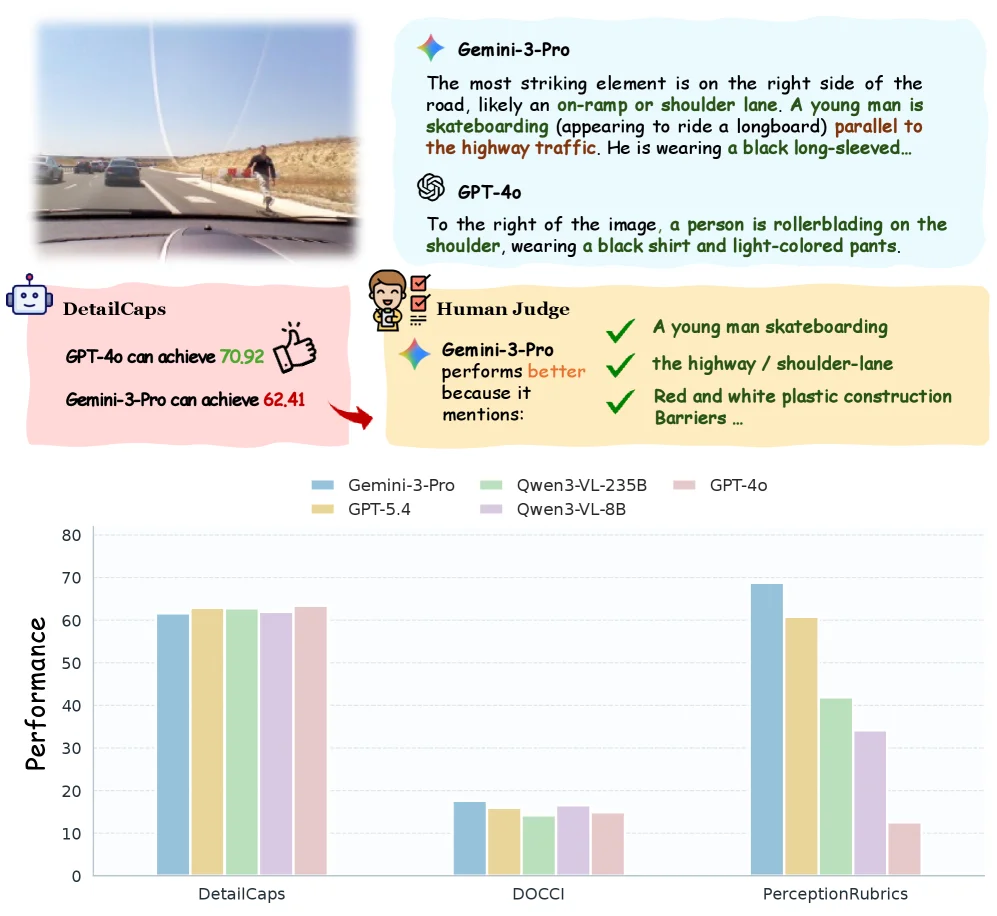
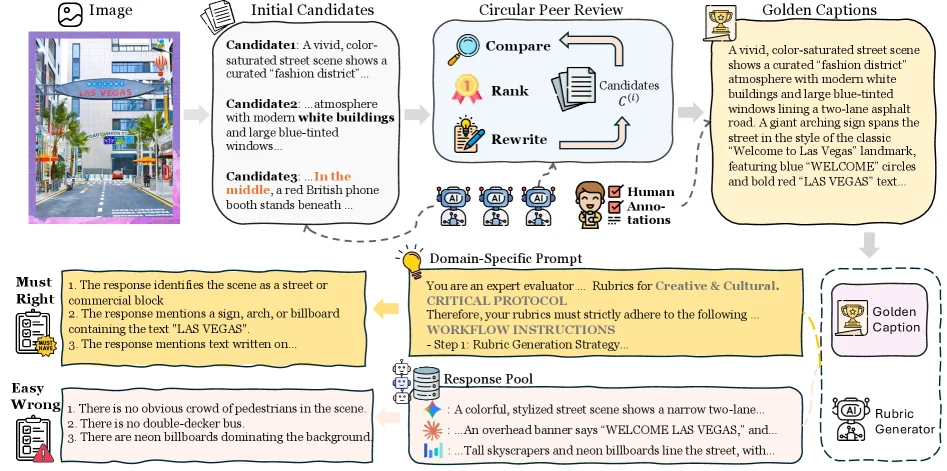
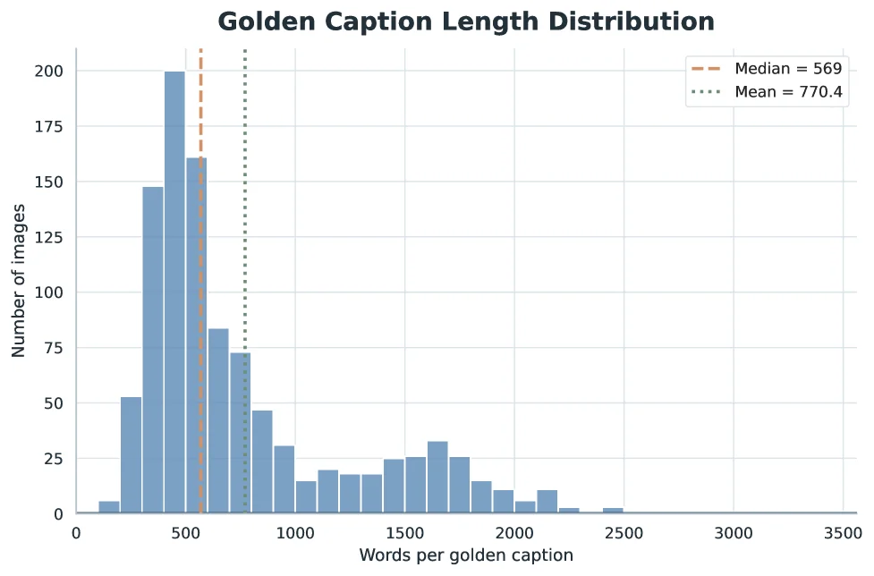
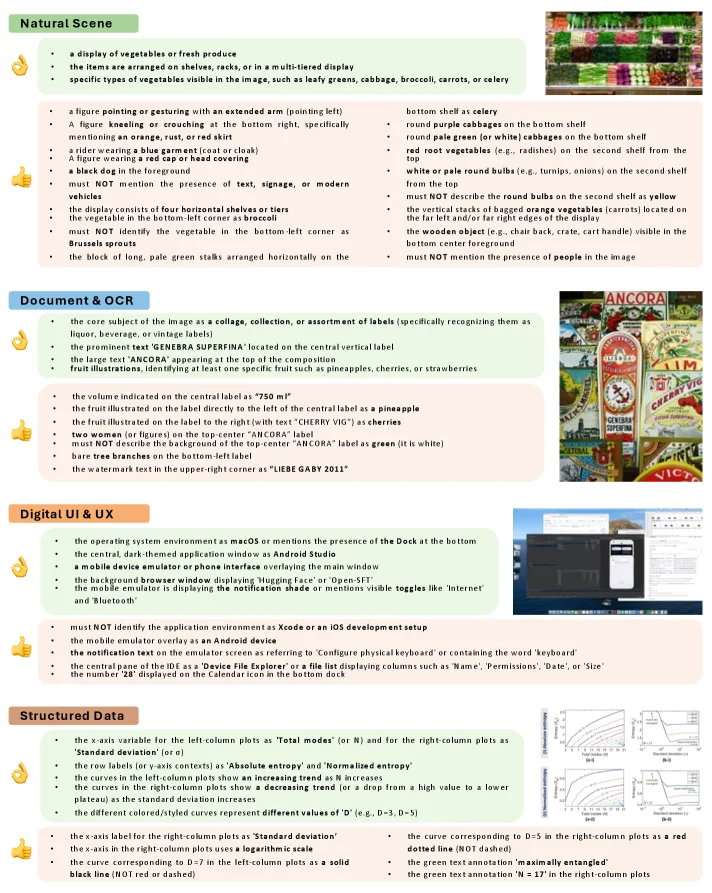
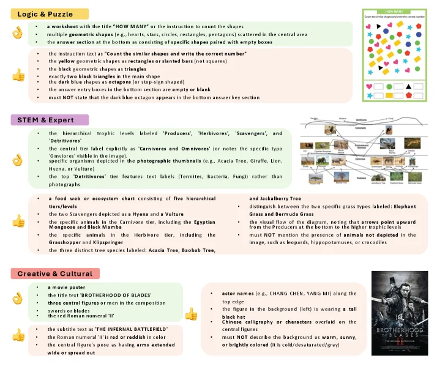

# PerceptionRubrics: Calibrating Multimodal Evaluation to Human Perception

[arXiv](https://arxiv.org/abs/2606.28322) · [HuggingFace](https://huggingface.co/papers/2606.28322) · ▲39

## Abstract (verbatim)

> We introduce PerceptionRubrics, a rubric-based evaluation framework that addresses the gap between saturated benchmark scores and real-world brittleness. Shifting evaluation from holistic semantic matching to rigorous atomic auditing, PerceptionRubrics pairs 1,038 information-dense images with over 12,000 instance-specific rubrics. These criteria are derived from golden captions constructed via a novel Circular Peer-Review consensus pipeline and then distilled into a dual-stream system of Must-Right (essential facts) and Easy-Wrong (fine-grained details) rubrics. Crucially, PerceptionRubrics implements a Gated Scoring mechanism: unlike linear averages, failure on mandatory visual facts triggers sharp binary penalties. Extensive evaluation yields critical insights: (1) The Reliability Gap: models often verify fragmented elements correctly yet fail strict conjunctive constraints, exposing brittleness in dense domains; (2) Open-Closed Stratification: contrary to reasoning trends, we reveal a persistent 8% perception deficit between open-source and proprietary frontiers; and (3) Human-Aligned Rigor: our gated metrics substantially out-align conventional benchmarks, validating that strict perceptual fidelity is the prerequisite for reliable generation.

## Background

### Background Analysis  

**Technical Context**: Multimodal Large Language Models (MLLMs) are increasingly used in applications like image understanding and content generation (e.g., AI assistants analyzing screenshots or verifying reports), where the core demand is "human-level perceptual reliability"—the ability to accurately interpret complex visual information (e.g., chart data or spatial relationships). For instance, medical imaging requires precise lesion localization, but current benchmarks fail to validate such capabilities effectively.  

**Previous Limitations**: Two major flaws plague existing evaluation systems: (1) **Insufficient data coverage**, as most benchmarks use simple or narrowly scoped images (e.g., single-object classification), causing models to rely on linguistic priors rather than true visual understanding; (2) **Distorted scoring mechanisms**, where traditional metrics (e.g., CLIPScore) mask local errors via linear averaging. For example, a model misinterpreting a table number might still score high, even though such errors are "zero-tolerant" in real-world scenarios. This creates a paradox where high leaderboard scores do not translate to reliable real-world performance.  

**Proposed Solution**: The paper introduces PerceptionRubrics, addressing these issues through three steps: (1) Curating a dataset of 1,038 high-information images and generating "golden captions" via a "circular peer-review" process (iterated by state-of-the-art MLLMs and verified by humans); (2) Extracting 12,000+ atomic rubrics categorized into "Must-Right" (critical facts) and "Easy-Wrong" (common hallucinations/omissions); (3) Implementing a "gated scoring" mechanism where violating "Must-Right" rules triggers binary penalties, aligning scores with human sensitivity to severe errors.  

**Key Difference**: Unlike prior work, PerceptionRubrics shifts focus from "holistic semantic matching" to "fine-grained perceptual auditing." By extracting rules from model errors and using non-linear scoring (distinguishing fatal vs. minor errors), it bridges the gap between benchmark performance and real-world reliability. This approach not only reveals gaps in complex domains (e.g., an 8% perceptual deficit between open-source and proprietary models) but also provides interpretable diagnostics for future improvements.

## Method, Figure by Figure

> Figure 1 : Motivation of PerceptionRubrics . Top: An existing benchmark favors GPT-4o despite key omissions, while humans prefer responses that capture more perceptually important details. Bottom: Compared with DetailCaps and DOCCI, PerceptionRubrics more clearly distinguishes model capabilities.

This figure is Figure 1 from the paper "PerceptionRubrics: Calibrating Multimodal Evaluation to Human Perception," and it aims to illustrate the motivation behind the PerceptionRubrics method. We can understand the figure by dividing it into two main parts:

**Upper Part: Limitations of Existing Benchmarks**

1.  **Left Image**: Displays a sample image, which shows a road with a young person skateboarding (or a similar activity) on the right shoulder. This image serves as the visual input for evaluating the model's perception capabilities.
2.  **Model Output Comparison**:
    *   The description from **Gemini-3-Pro** is highlighted. It points out a key element on the right side of the image: "Most notably, on the right side of the road, possibly an on-ramp or shoulder lane. A young person is skateboarding (looks like a longboard), parallel to the highway traffic. He is wearing a black long-sleeve..." This description mentions details like "shoulder lane" and "skateboard."
    *   The description from **GPT-4o** states: "On the right side of the image, a person is rollerblading on the shoulder, wearing a black top and light-colored pants." This description mistakenly identifies the activity as "rollerblading" and fails to mention the important contextual information of the "shoulder lane."
3.  **DetailCaps Score**: This is an existing benchmark. The figure shows that GPT-4o scored 70.92 on DetailCaps (indicated by green text and a checkmark, seemingly suggesting better performance), while Gemini-3-Pro scored 62.41. This indicates that GPT-4o received a higher score on a benchmark like DetailCaps.
4.  **Human Judge**: This part is crucial as it shows the results of human evaluation. The human judge concluded that "Gemini-3-Pro performed better because it mentioned:"
    *   A young person skateboarding
    *   Highway/shoulder lane
    *   Red and white plastic construction barriers (not fully visible in the image but mentioned in the text)
    This indicates that despite GPT-4o's higher score on DetailCaps, humans favored Gemini-3-Pro's description because it captured more important perceptual details. This reveals a gap between existing benchmarks (like DetailCaps) and true human perception—models might be correct in identifying fragmented elements but fail in strict logical constraints (such as correctly identifying both key background and subject simultaneously).

**Lower Part: Validating the Effectiveness of the PerceptionRubrics Method**

1.  **Bar Chart**: This is a chart comparing the performance of different models across three different benchmarks.
    *   **X-axis**: Represents three different benchmarks: `DetailCaps`, `DOCCI`, and `PerceptionRubrics`.
    *   **Y-axis**: Represents "Performance," with values ranging from 0 to 80.
    *   **Legend**: Different colored bars represent different models:
        *   Blue: Gemini-3-Pro
        *   Light Green: Qwen3-VL-235B
        *   Pink: GPT-4o
        *   Yellow: GPT-5.4
        *   Purple: Qwen3-VL-8B
2.  **Data Comparison and Conclusion**:
    *   On the `DetailCaps` benchmark, the performance differences among models are relatively small, with bar heights being quite close. For example, both Gemini-3-Pro and GPT-4o scored above 60, and other models were not far apart.
    *   On the `DOCCI` benchmark, all models' performance is significantly lower than on DetailCaps, and the differences between models are also small, with scores generally below 20.
    *   On the `PerceptionRubrics` benchmark, the performance differences between models become very pronounced. Gemini-3-Pro has the highest score (around 70), followed by GPT-5.4 (around 60), Qwen3-VL-235B (around 40), Qwen3-VL-8B (around 30), and GPT-4o has the lowest score (around 10).
    *   This comparison shows that compared to DetailCaps and DOCCI, PerceptionRubrics can more clearly differentiate the capabilities of different models. Under PerceptionRubrics, the gap between well-performing and poorly performing models widens, indicating that PerceptionRubrics, as an evaluation framework, can more effectively measure model performance in strict perceptual tasks.

**Overall Information Flow and Method Explanation**:

1.  **Problem Statement**: The upper part, through a specific example and human judgment, points out that existing benchmarks (like DetailCaps) may not accurately reflect true human perception because they might reward certain unimportant details while ignoring critical, must-be-correct visual facts.
2.  **Method Introduction**: Although the figure does not directly show the specific implementation steps of PerceptionRubrics (such as the Circular Peer-Review consensus pipeline, Must-Right and Easy-Wrong rubrics, Gated Scoring mechanism), it hints at the method's design goal through the experimental results in the lower part: to create a benchmark that can more strictly and meticulously evaluate model perception capabilities, especially to distinguish models that can accurately capture key visual facts from those that cannot.
3.  **Result Presentation**: The bar chart in the lower part shows that PerceptionRubrics indeed better separates the performance of different models, validating the method's superiority. It achieves more accurate calibration of model capabilities by introducing finer, human-perception-based evaluation criteria (i.e., atomic audits).

In summary, this figure, by comparing the performance of existing benchmarks (DetailCaps and DOCCI) with PerceptionRubrics in model evaluation, reveals the core motivation and effectiveness of the PerceptionRubrics method: it aims to address the gap between saturated benchmark scores and real-world fragility by calibrating multimodal evaluation through stricter atomic-level auditing to make it more aligned with human perception.

---

> Figure 4 : The PerceptionRubrics Construction Pipeline. Adopting a caption-centric approach, we first synthesize golden captions via circular peer-review (Top). These captions then serve as anchors to generate Must-Right and Easy-Wrong rubrics through domain-specific prompting (Bottom).

This figure illustrates the construction pipeline of PerceptionRubrics, which consists of two core stages: **"Golden Captions Generation" (upper flow)** and **"Rubrics Generation" (lower flow)**. Information flows in the following order:  

### 1. Generation of Golden Captions (Upper Flow)  
- **Input**: An information - dense image (the Las Vegas street scene shown on the left).  
- **Initial Candidates**: First, multiple candidate descriptions (e.g., Candidate 1, Candidate 2, Candidate 3) are generated. These descriptions are different preliminary interpretations of the image (e.g., describing the scene style, building features, signs, etc.).  
- **Circular Peer Review**: The candidate descriptions enter the "Circular Peer Review" module, which iteratively optimizes through three steps: **Compare, Rank, and Rewrite**:  
  - Multiple AIs (the "AI" icons in the figure) and human annotations (the "Human Annotations" icon) participate in the review. They compare, rank the candidate descriptions, and then rewrite them based on the feedback to form a new candidate set \( C^{(i)} \).  
  - This process is "circular", meaning that the rewritten descriptions will re - enter the compare - rank - rewrite cycle until a consensus is reached.  
- **Output: Golden Captions**: After multiple rounds of review, a definitive "Golden Caption" is finally obtained, which is an accurate and consensual interpretation of the image (for example, the figure describes the street scene, the "LAS VEGAS" text, signs, etc. in detail).  

### 2. Generation of Rubrics (Lower Flow)  
The Golden Caption serves as an "anchor" to generate two types of rubrics through **Domain - Specific Prompting**:  

- **Must - Right (Essential Facts)**: These rubrics are **core and necessary facts** of the image. The model must accurately identify them to score. For example:  
  - Identify the scene as a street/commercial block;  
  - Mention a sign, arch, or billboard containing "LAS VEGAS";  
  - Mention the position of specific text, etc.  
  (The "Must Right" panel in the figure lists these mandatory requirements. If the model fails, a "binary penalty" will be triggered — no points will be awarded).  

- **Easy - Wrong (Fine - Grained Details)**: These rubrics are **easily confused and fine - grained details** that models are likely to judge incorrectly. For example:  
  - There is no obvious crowd in the scene;  
  - There is no double - decker bus;  
  - The background is not dominated by neon billboards, etc.  
  (The "Easy Wrong" panel in the figure lists these details, which are used to test the model's fine - grained perception ability).  

- **Trigger for Rubric Generation**: Through "Domain - Specific Prompting" (the text under the yellow light - bulb icon in the figure), the Golden Caption is transformed into a "Rubric Generation Strategy" (the text "Step 1: Rubric Generation Strategy..." in the figure). Combined with the examples in the "Response Pool", the rule set corresponding to the "Golden Caption" is finally generated. At the same time, the "Rubric Generator" (AI) participates in the optimization.  

### Core Logic of the Method  
The core of PerceptionRubrics is to **shift from "holistic semantic matching" to "atomic - level auditing"**:  
- First, build an authoritative "Golden Caption" through "circular peer review" (to solve the subjectivity of descriptions);  
- Then, generate "Must - Right" (mandatory facts) and "Easy - Wrong" (fine - grained details) rubrics based on the Golden Caption. The "Gated Scoring" mechanism is used to evaluate the model: if the model does not meet the "Must - Right" facts, points will be directly deducted (binary penalty), rather than just a linear average.  

### Summary of Information Flow in the Pipeline  
Image → Initial candidate descriptions → Circular peer review (iterative optimization with AI + humans) → Golden Caption → Domain - specific prompting → Generate "Must - Right" and "Easy - Wrong" rubrics (combined with Response Pool and Rubric Generator).  

This pipeline ensures that the evaluation criteria (rubrics) are based on human consensus (Golden Caption) and cover both "core facts" and "fine - grained details", thus calibrating the gap between multimodal evaluation and human perception.

---

> Figure 5 : Distribution of golden caption lengths in our benchmark. The histogram shows the word count frequency across the dataset.

This figure, labeled "Figure 5: Distribution of golden caption lengths in our benchmark," presents a histogram illustrating the frequency distribution of word counts for "golden captions" within the dataset. The title "Golden Caption Length Distribution" succinctly describes its content.

Let's break down the components of the graph:

1.  **X-axis (Horizontal Axis)**: Labeled "Words per golden caption," this axis represents the number of words in each "golden caption." The scale starts at 0 and extends to 3500, with major tick marks at 500, 1000, 1500, 2000, 2500, 3000, and 3500. This axis quantifies the length of the descriptions.
2.  **Y-axis (Vertical Axis)**: Labeled "Number of images," this axis indicates the count of images that have golden captions with a specific word count. The scale starts at 0 and goes up to 200, with major tick marks at 25, 50, 75, 100, 125, 150, 175, and 200. This axis represents the frequency of captions within each length category.
3.  **Histogram Bars**: The blue vertical bars constitute the histogram. The height of each bar corresponds to the number of images (Y-axis) that have a golden caption with a word count falling within a specific interval (bin) on the X-axis. For instance, there is a tall bar around the 500-word mark on the X-axis, indicating a large number of images have golden captions of approximately that length. The bars rise to a peak and then gradually decrease, showing that most golden captions cluster around a certain length, while very short or very long captions are less frequent.
4.  **Median Line**: An orange dashed vertical line is labeled "Median = 569." This line indicates the median length of all golden captions. It means that half of the captions have a length less than or equal to 569 words, and the other half are longer. The median is positioned near the peak of the histogram, suggesting this is a central tendency of the data.
5.  **Mean Line**: A green dashed vertical line is labeled "Mean = 770.4." This line represents the average (mean) length of all golden captions. Importantly, this mean (770.4) is significantly higher than the median (569), which typically indicates a right-skewed (positively skewed) distribution. This means there are some longer captions that pull the average up, while most captions are relatively shorter. This is consistent with the shape of the histogram, which shows a tail extending to the right with fewer but longer captions.

This figure reveals the distribution of lengths for the "golden captions," which are constructed via a novel Circular Peer-Review consensus pipeline as described in the paper. These captions serve as a foundation for evaluating the quality of model-generated content. By analyzing their length distribution, we gain insight into the characteristics of the text annotations in the benchmark. For example, a median of approximately 569 words and a mean of 770.4 words suggest that most descriptions are of moderate length, but there are also some longer ones. This distributional information is crucial for the subsequent design of the evaluation framework (PerceptionRubrics), as it influences the formulation of evaluation criteria and the expected performance of models. For instance, if descriptions are long and detailed, assessing whether models can accurately capture these details becomes vital.

In summary, this graph clearly displays the word count distribution of "golden captions" in the benchmark using a histogram, highlighting the central tendency with the median and the overall average with the mean. This is essential for understanding the characteristics of the dataset used in the paper's evaluation methodology.

---

> Figure 12 : Qualitative examples of the fine-grained rubrics across four categories: Natural Scene, Document & OCR, Digital UI & UX, and Structured Data. Each example consists of an image and two tiers of rubrics: Must-Right (top group) focusing on core facts, and Easy-Wrong (bottom group) focusing on challenging details, negative constraints, and logical reasoning.

This figure (Figure 12) from the paper "PerceptionRubrics: Calibrating Multimodal Evaluation to Human Perception" illustrates qualitative examples of fine-grained rubrics across four categories: Natural Scene, Document & OCR, Digital UI & UX, and Structured Data.

The core purpose of this figure is to demonstrate how the evaluation rubrics used in the PerceptionRubrics method are constructed and organized. Each category panel contains an example image and two sets of rubrics. These rubrics are divided into "Must-Right" (typically the top group), which focuses on core facts, and "Easy-Wrong" (typically the bottom group), which focuses on challenging details, negative constraints, and logical reasoning.

The "Must-Right" rubrics target core facts, i.e., the most basic and critical elements in an image that a model must correctly identify to pass the evaluation. For instance, in the "Natural Scene" category, "Must-Right" criteria include: the image displays vegetables or fresh produce, items are arranged on shelves, racks, or multi-tiered displays, specific vegetables (like leafy greens, cabbage, broccoli, carrots, or celery) are recognizable, and certain spatial relationships (e.g., a figure pointing or gesturing towards the right arm) and prohibitive descriptions (e.g., not mentioning text, signage, or modern vehicles) are present.

The "Easy-Wrong" rubrics focus on challenging details, negative constraints, and logical reasoning. These criteria are often more nuanced, requiring the model to capture more complex visual information or understand logical relationships within the image. For example, in the "Natural Scene" category, "Easy-Wrong" criteria include: a bottom shell as celery, round purple cabbages on the bottom shelf, round pale green (or white) cabbages on the bottom shelf, red root vegetables (e.g., radishes) on the second shelf from the top, white or pale round bulbs (e.g., turnips, onions) on the second shelf from the top, and prohibitive descriptions (e.g., not describing the round bulbs on the second shelf as yellow).

The specific operation of this method is as follows: first, "golden captions" (detailed descriptions of images) are constructed through a consensus pipeline called "Circular Peer-Review." Then, these captions are distilled into "Must-Right" and "Easy-Wrong" rubrics. This dual-stream system ensures rigorous evaluation, checking not only whether the model can identify basic facts but also whether it can handle finer details.

Additionally, the "Gated Scoring" mechanism mentioned in the paper plays a crucial role in this evaluation. Unlike linear averaging, failing on "Must-Right" visual facts triggers severe binary penalties (i.e., a score of zero). This mechanism emphasizes the importance of strict compliance with basic facts, which is crucial for achieving reliable generation in dense domains (e.g., image understanding).

Through the examples in these four categories, the figure demonstrates how PerceptionRubrics calibrates multimodal evaluation to align more closely with human perception. This method reveals that models may perform well when verifying fragmented elements but fail under strict conjunctive constraints, thus exposing their brittleness in dense domains.

In summary, this figure clearly illustrates the core idea of the PerceptionRubrics method: by constructing fine-grained "Must-Right" and "Easy-Wrong" rubrics and implementing a gated scoring mechanism, it achieves a stricter, more human-aligned evaluation of multimodal models.

---

> Figure 13 : Qualitative examples of the fine-grained rubrics across three additional categories: Logic & Puzzle, STEM & Expert, and Creative & Cultural. Each example consists of an image and two tiers of rubrics: Must-Right (top group) focusing on core facts, and Easy-Wrong (bottom group) focusing on challenging details, negative constraints, and logical reasoning.

This figure from the paper "PerceptionRubrics: Calibrating Multimodal Evaluation to Human Perception" illustrates qualitative examples of the "fine-grained rubrics" used by the PerceptionRubrics framework across three distinct categories: Logic & Puzzle, STEM & Expert, and Creative & Cultural. Its primary purpose is to demonstrate how PerceptionRubrics evaluates image content using specific, hierarchical criteria.

The structure of the figure is clearly divided into three main sections, each corresponding to a category, and follows a consistent layout pattern:

1.  **Logic & Puzzle**:
    *   **Left Text Area**: This section lists the "Must-Right" and "Easy-Wrong" rubrics for images in this category.
        *   "Must-Right" criteria include: the worksheet title is "HOW MANY!" or contains an instruction to count shapes; various geometric shapes (e.g., hearts, stars, circles, rectangles, pentagons) are scattered in the central area; the bottom answer section consists of specific shape pairs with empty boxes; the instruction text is "Count the similar shapes and write the correct number"; yellow geometric shapes are rectangles or slanted bars (not squares); black geometric shapes are triangles; there are two black triangles in the center; dark blue shapes are octagons (or stop-sign shaped); bottom answer input boxes are empty or blank; and the answer input boxes must NOT state that the dark blue octagon appears in the bottom answer key section.
    *   **Right Image Area**: Displays a sample image conforming to these standards, i.e., a "HOW MANY!" worksheet with various colored shapes and a table for filling in answers.
    *   **Information Flow**: The left-side criteria define the features an image should have, while the right-side image is an example that meets these criteria. The reader can understand the specific scoring requirements by comparing the criteria with the image.

2.  **STEM & Expert**:
    *   **Left Text Area**: Similarly lists "Must-Right" and "Easy-Wrong" criteria.
        *   "Must-Right" criteria include: hierarchical trophic level labels are "Producers," "Herbivores," "Scavengers," and "Detrivores"; the central label explicitly states "Carnivores and Omnivores" (or notes specific omnivores like the Antelope visible in the image); photographic thumbnails depict specific species (e.g., Acacia Tree, Giraffe, Lion, Hippo, or Vulture); the top "Detritivores" tier features text labels (e.g., Termites, Bacteria, Fungi) rather than photos; a food web or ecosystem chart consists of five hierarchical tiers/levels; the two Scavengers are depicted as a Hyena and a Vulture; specific species in the Herbivore tier, including the Grasshopper and Klipspringer; three distinct tree species are labeled: Acacia Tree, Baobab Tree, etc.
    *   **Right Image Area**: Displays an ecosystem food web diagram containing photos of different species and lines connecting them, representing energy flow.
    *   **Information Flow**: The left-side criteria define the accuracy in scientific content and representation that an image should possess, while the right-side image is an example of an ecological diagram that meets these criteria.

3.  **Creative & Cultural**:
    *   **Left Text Area**: Lists "Must-Right" and "Easy-Wrong" criteria for a movie poster.
        *   "Must-Right" criteria include: it is a movie poster; the title text is "BROTHERHOOD OF BLADES"; the composition has three central figures or men; weapons like swords and the number "3"; subtitle text is "INFERNO BATTLEFIELD"; the Roman numeral "III" is red or reddish in color; the central figure's pose has extended arms or is spread out.
        *   "Easy-Wrong" criteria include: actor names (e.g., CHANG CHEN, YANG MI) are along the top edge; the figure in the background (left) is wearing a tall black hat; Chinese calligraphy or characters are overlaid on the central figure; the background must NOT be described as warm, sunny, or brightly colored (it is cold/desaturated/gray).
    *   **Right Image Area**: Displays a movie poster for "Brotherhood of Blades" with actors, title, and visual elements consistent with the description.
    *   **Information Flow**: The left-side criteria define the features a movie poster should have in terms of content and visual representation, especially those subtle, error-prone details. The right-side poster is an example that meets these criteria.

**Explanation of Methodology**:
This figure reveals how the PerceptionRubrics method operates. The core of the method is shifting evaluation from holistic semantic matching to rigorous atomic-level auditing. It achieves this through the following steps:
*   **Creating Golden Captions**: First, detailed image captions are constructed via a novel "Circular Peer-Review" consensus pipeline. These captions capture all key facts and details of the images.
*   **Distilling Rubrics**: These golden captions are then distilled into two types of rubrics: "Must-Right" and "Easy-Wrong."
    *   **"Must-Right" Criteria**: Focus on core facts and are mandatory requirements for evaluation. Failure to meet any of these criteria results in a severe binary penalty (e.g., zero score or significant deduction).
    *   **"Easy-Wrong" Criteria**: Focus on challenging details, negative constraints, and logical reasoning, which are key points for differentiating model performance.
*   **Implementing a Gated Scoring Mechanism**: Unlike linear averaging, the gated scoring mechanism means that failure on any "Must-Right" visual fact triggers a severe penalty, even if other aspects are well-performed. This mechanism emphasizes the importance of strict perceptual fidelity.
*   **Application Examples**: The three categories shown (Logic & Puzzle, STEM & Expert, Creative & Cultural) represent different types of image content and assessment focuses. By providing specific, hierarchical criteria for each type of image, PerceptionRubrics can perform detailed and rigorous evaluations of a model's perceptual capabilities.

This figure demonstrates how PerceptionRubrics works through concrete examples: it defines a set of detailed, hierarchical evaluation criteria ("Must-Right" and "Easy-Wrong") for each image, and then uses these criteria to measure a model's ability to understand and reproduce the image content. This method aims to address the brittleness of traditional benchmark tests in dense domains (like complex image understanding), ensuring that evaluation results better reflect a model's reliability in real-world scenarios.
