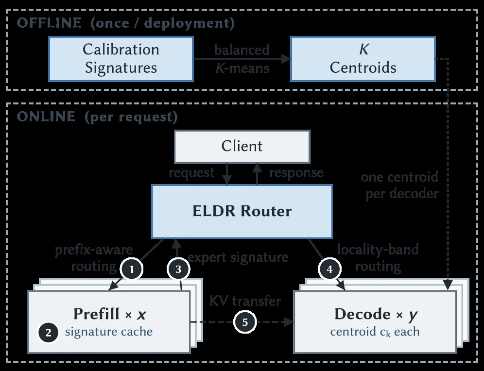
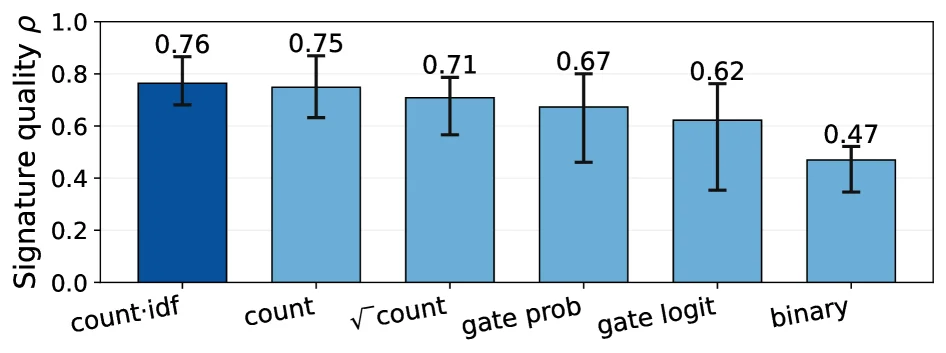
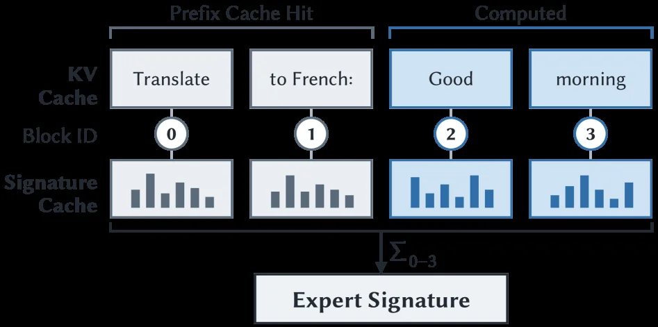
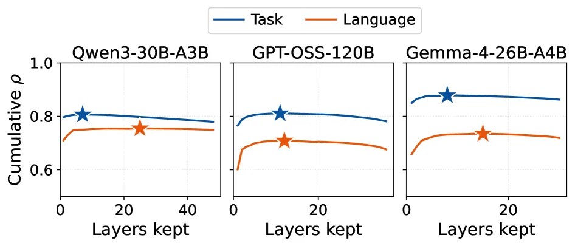
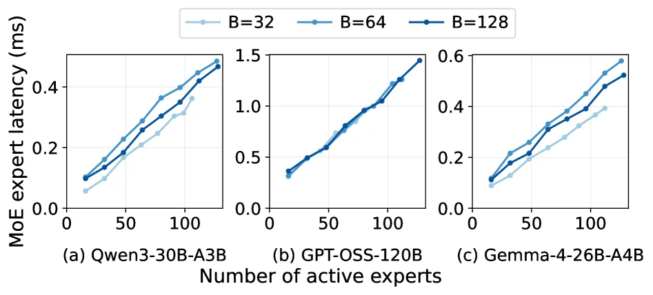

# ELDR: Expert-Locality-Aware Decode Routing for PD-Disaggregated MoE Serving

[arXiv](https://arxiv.org/abs/2607.00466) · [HuggingFace](https://huggingface.co/papers/2607.00466) · ▲24

## Abstract (verbatim)

> In prefill-decode (PD) disaggregated LLM serving, each request is assigned to a decode worker after prefill. Existing decode routers balance only load; for mixture-of-experts (MoE) models this is incomplete: equally loaded workers can differ in latency, since each decode step loads the weights of every distinct expert its batch activates. We present ELDR, an expert-locality-aware decode router for PD-disaggregated MoE serving. From a request's prefill expert activations, ELDR builds an expert signature predicting the experts it will activate during generation. Offline, balanced K-means partitions signature space across decode workers; online, locality-band routing sends each request to the least-loaded worker among those best matching its signature. A signature cache, co-indexed with the KV cache at KV-block granularity, keeps signatures exact under prefix caching. Implemented in vLLM and evaluated on deployments of up to 40 GPUs, ELDR reduces median TPOT by 5.9-13.9% over the strongest of four load-balancing baselines across three MoE models and two workloads, with model outputs unchanged.

## Background

### Background Analysis  

#### 1. Technical Context and Need  
Large Language Model (LLM) deployment is shifting toward **Prefill-Decode (PD) disaggregation**, where prompt processing (prefill) and token generation (decode) run on separate worker pools. This architecture faces a key challenge: prefill is compute-bound and parallel, while decode is latency-sensitive and sequential. Co-locating them causes long prefills to block decode, increasing Time-to-First-Token (TTFT) and Time-per-Output-Token (TPOT). Thus, PD disaggregation requires efficient **routing**—after prefill, requests must be assigned to appropriate decode workers to generate subsequent tokens.  

For **Mixture-of-Experts (MoE) models**, traditional load-balancing methods are insufficient. MoE decode is memory-bandwidth-bound, with latency determined by the **union of activated experts** per batch (not token count). For example, two requests sharing a decode node but activating different experts may have vastly different latencies. However, existing methods only balance load, ignoring **expert locality** (e.g., requests from similar domains activate overlapping experts like code, medicine, or law).  

#### 2. Previous Limitations  
Traditional routing methods suffer from:  
- **Inadequate load balancing**: Balancing compute load ignores that MoE latency depends on expert sets, so nodes with equal load may have very different latencies.  
- **Ignoring expert locality**: Failing to exploit the structural nature of MoE expert activation (e.g., related requests activate similar experts), leading to fragmented expert sets and higher memory access costs.  
- **Incompatibility with prefix caching**: Prefix caching (skipping prefill for repeated prompts) breaks expert signatures, and existing methods cannot maintain routing accuracy under cache hits.  

#### 3. Proposed Solution  
The paper introduces **ELDR (Expert-Locality-Aware Decode Routing)** to address these issues:  
- **Expert signatures and locality-aware routing**: Generate an **expert signature** from prefill activations, use offline balanced K-means to partition signature space into regions (each mapping to a decode worker), and route requests online to the least-loaded worker with the most similar signature.  
- **Prefix cache compatibility**: Maintain a **block-level expert signature cache** aligned with KV cache to recover full signatures under partial or full cache hits, ensuring routing accuracy.  
- **Dual-objective optimization**: Balance expert locality (via signature clustering) and real-time load balancing (via online low-load selection).  

#### 4. Key Differences from Prior Work  
ELDR’s core innovations compared to prior work:  
- **Focus on expert locality**: First uses the structural nature of MoE expert activation (e.g., domain correlations) for routing, rather than only load.  
- **Offline-online separation**: Offline K-means captures expert locality structure, while online routing balances structure with real-time load via a "locality band."  
- **Cache-aware routing**: Resolves prefix caching-routing conflicts with block-level signature caching, a problem overlooked by traditional methods.  

Implemented in vLLM, ELDR modifies only the routing layer (keeping model outputs unchanged) and reduces TPOT by up to 13.9%, working for MoE models from billions to hundreds of billions of parameters.

## Method, Figure by Figure

> Figure 6. ELDR architecture: offline fitting of one centroid per decode worker over expert signatures, then online routing at the prefill?밺ecode handoff by signature similarity, subject to load.

This diagram illustrates the ELDR architecture proposed in the paper "ELDR: Expert-Locality-Aware Decode Routing for PD-Disaggregated MoE Serving." The architecture is primarily divided into two phases: Offline (OFFLINE) and Online (ONLINE), aiming to address the decode routing problem in prefill-decode (PD) disaggregated Mixture of Experts (MoE) model serving.

**Offline Phase (OFFLINE - once / deployment):**
This phase is executed only once during system deployment.
*   **Calibration Signatures:** First, the system collects or generates a set of "calibration signatures." These signatures represent the expert activation patterns that different requests might activate during the prefill or decode stages.
*   **balanced K-means:** Then, the "balanced K-means" algorithm processes these calibration signatures. The goal of this algorithm is to partition the signature space into K clusters (centroids) while ensuring that the load (e.g., number of experts or computational cost) of each cluster is as balanced as possible. The result is K "Centroids," with each decode worker corresponding to one centroid. This means each decode worker is assigned a specific set of experts whose activation patterns are similar in the signature space.

**Online Phase (ONLINE - per request):**
This phase is executed for each service request.
*   **Client:** User requests originate from the client.
*   **ELDR Router:** The client's request first arrives at the ELDR router. The router is responsible for deciding which decode worker to send the request to.
    *   **Request Flow (arrow direction):**
        1.  The client sends a `request` to the ELDR router.
        2.  The ELDR router needs to make a routing decision.
    *   **Prefill × x signature cache:** This is a cache layer that stores expert activation signatures from previous requests' prefill stages. It is co-indexed with the KV cache (Key-Value cache) at the KV block granularity, which helps maintain signature accuracy under the Prefix caching mechanism. Labels 1 and 2 in the diagram point to this cache.
    *   **expert signature:** The ELDR router constructs an "expert signature" based on information from the current request (possibly combined with information from the prefill signature cache). This signature predicts which experts will be activated during the generation (decode) phase for this request. Label 3 in the diagram represents this expert signature.
    *   **locality-band routing:** The router uses a "locality-band routing" strategy. It finds the decode workers whose centroids are most similar to the current request's expert signature (i.e., the workers whose corresponding centroids are closest to the request signature in distance). Then, among these best-matching workers, it selects the one with the lightest current load to handle the request. Label 4 in the diagram represents this routing process, with the text "one centroid per decoder" (one centroid per decoder).
    *   **Decode × y centroid c_k each:** This represents multiple decode workers, each associated with a centroid (centroid c_k). The request is ultimately sent to one of these decode workers. The arrow from label 4 in the diagram points to these decode workers.
    *   **KV transfer:** After the request is routed to a decode worker, KV cache transfer might be involved. Label 5 in the diagram represents this KV transfer process, typically passing KV cache data from the prefill stage or a previous processing step to the decode worker.

**Summary of How the Method Works:**
1.  **Offline Preparation:** The system precomputes and stores K balanced expert signature centroids, with one centroid corresponding to each decode worker.
2.  **Online Routing:**
    *   When a new request arrives, the ELDR router first obtains or constructs the expert signature for that request.
    *   Then, it looks up the centroid(s) most similar to this signature (i.e., the decode workers most likely to handle similar expert activation patterns).
    *   Among these candidate workers, it selects the one with the current lightest load to achieve better load balancing and potentially lower latency.
    *   The request is routed to the selected decode worker for processing.
    *   The presence of the prefill signature cache helps in quickly generating accurate expert signatures, especially in scenarios with prefix caching.

This diagram clearly shows how ELDR achieves more intelligent decode routing by combining the similarity of expert signatures with load balancing, thereby optimizing the service performance of PD-disaggregated MoE models.

**Unclear or uncertain aspects from the diagram:**
*   Specific details on how "balanced K-means" ensures load balancing.
*   The exact method of constructing the "expert signature."
*   The specific content and timing of the "KV transfer."
*   What "x" and "y" in the diagram represent, although they can be inferred to be the number of prefill and decode workers, respectively.

---

> Figure 7. Signature quality ρ \rho (Eq. 1 ) for six candidate transformations T T . Bars are the mean across six cells (3 models × \times 2 workloads); whiskers span the per-cell min/max.

This figure illustrates the performance of six candidate transformations (T) in terms of "signature quality ρ" (Signature quality ρ), a metric proposed in the paper (see Equation 1). This metric measures the effectiveness of a transformation in generating expert signatures.

Each vertical bar in the graph represents a specific transformation, listed from left to right as: `count:idf`, `count`, `√count`, `gate prob`, `gate logit`, and `binary`. These are six different methods for transforming expert activation patterns during the prefill stage, used to construct expert signatures.

The height of each bar indicates the average signature quality ρ for that transformation across all tested scenarios. For instance, the `count:idf` transformation has the highest average signature quality, approximately 0.76, while the `binary` transformation has the lowest, around 0.47. The number above each bar represents this average value, and the error bars (whiskers) at the top of each bar indicate the minimum and maximum values of the metric across six different test cells (3 models × 2 workloads). For example, the error bars for `count:idf` show relatively stable performance across cells, whereas those for `gate prob` are longer, indicating greater performance variability.

This figure reveals how the method works: To implement expert-locality-aware decode routing, an expert signature must be constructed from a request's prefill expert activations to predict which experts it will activate during generation. The graph compares six different transformation methods applied to prefill expert activation data to generate more effective signatures. By comparing their signature quality ρ, we can evaluate which transformation better captures the patterns of expert activations, thus providing more accurate information for subsequent routing decisions. The results show that the `count:idf` transformation performs best in generating high-quality signatures, meaning it can more accurately predict expert activations, potentially helping the ELDR method perform more effective decode routing, reduce latency, and improve system performance.

In summary, this figure compares the signature quality of six different transformation methods, showing which transformation is more effective in constructing expert signatures. The result is that the `count:idf` transformation performs the best across all tested scenarios, while the `binary` transformation performs the worst. This provides empirical evidence for the ELDR method's choice of transformation.

---

> Figure 10. ELDR stores expert signatures at KV cache block granularity: the signature cache is co-indexed with KV cache.

This figure (Figure 10) clearly illustrates how ELDR (Expert-Locality-Aware Decode Routing) stores expert signatures at the KV cache block granularity: the signature cache is co-indexed with the KV cache.

First, let's analyze the components and structure of the image:

1.  **Top Section**: Divided into two parts, "Prefix Cache Hit" and "Computed." This indicates that tokens in a request can originate from two sources: some are previously computed and cached (prefix cache hit), while others are computed on-the-fly.

2.  **KV Cache (Key-Value Cache)**: A common component in LLM inference for storing previously computed keys and values. The image shows four KV cache blocks corresponding to the tokens "Translate" (Block ID 0), "to French:" (Block ID 1), "Good" (Block ID 2), and "morning" (Block ID 3). These blocks represent cached content at different stages of request processing.

3.  **Block ID**: Located below the KV Cache, each KV cache block is assigned a unique identifier (0, 1, 2, 3). This allows the system to index and manage different cache blocks.

4.  **Signature Cache**: Positioned below the KV Cache and "co-indexed" with it. This means that for each KV cache block (e.g., Block IDs 0, 1, 2, 3), there is a corresponding signature cache entry. The bar charts represent these signatures; different colors (gray and blue) might distinguish types or sources of signatures, but the core idea is that each KV block has an associated signature.

5.  **Data Flow and Operational Mechanism**:
    *   **Prefix Cache Hit**: When processing a request, if a token (like "Translate" and "to French:") is already in the KV cache (i.e., a prefix cache hit), its corresponding signature (the gray bar charts under Block IDs 0 and 1) also exists in the signature cache. This means the system can directly retrieve these tokens' expert signatures from the cache without recomputation.
    *   **Computed**: For tokens that need to be calculated in the current step (like "Good" and "morning"), their expert signatures (the blue bar charts under Block IDs 2 and 3) are computed and stored in the signature cache for potential reuse by future requests.
    *   **Aggregation of Expert Signatures**: The "Σ₀₋₃" symbol at the bottom indicates that all relevant expert signatures (from Block IDs 0 to 3) are aggregated (e.g., summed or combined in some way) to generate a final "Expert Signature." This expert signature represents the overall characteristics of the experts involved in the current request or generation step.

6.  **Core Idea of the Method**:
    *   **Predicting Expert Activation**: ELDR starts with the expert activation patterns from the request's prefill phase to build an expert signature that predicts which experts the request will activate during the decode phase.
    *   **Role of Signature Cache**: The signature cache being co-indexed with the KV cache ensures that when data in the KV cache is reused (e.g., due to a prefix cache hit), its corresponding expert signature can also be quickly retrieved, maintaining signature accuracy. This is crucial for prefix-cache-based optimizations, as it allows the system to leverage previous expert activation information without recomputation.
    *   **Routing Decision**: Although the routing process itself is not directly shown in the image, building this expert signature is fundamental to ELDR's routing strategy. Online, the system routes requests to the most suitable decode workers based on this expert signature (or its prediction) and current load conditions to achieve expert-locality-aware load balancing.

In summary, this image demonstrates how ELDR supports its expert-locality-aware decode routing strategy by maintaining expert signature caches at the KV cache block granularity. By co-indexing expert signatures with the KV cache, ELDR can effectively predict and manage expert activations while leveraging prefix caching, thus optimizing MoE model decode performance.

This image is not a traditional result plot but a method diagram illustrating the core mechanism of expert signature storage and management in ELDR. It explains how data (tokens and their corresponding expert signatures) flows and is organized between the KV cache and the signature cache.

---

> Figure 8. Cumulative ρ \rho (Eq. 1 ) versus the number of layers kept under greedy layer selection. One panel per model; task (blue) and language (orange) shown separately. The star marks the peak N ∗ N^{*} chosen by ELDR ’s offline fit.

This figure (Figure 8) illustrates the cumulative ρ value (as defined in Equation 1) as a function of the number of layers kept under a greedy layer selection strategy. It presents results for three different Mixture-of-Experts (MoE) models, with separate panels for "Task" and "Language" workloads or datasets.

Let's break down the components of the graph:

1.  **Subplot Structure**: There are three subplots, each corresponding to a different MoE model: Qwen3-30B-A3B, GPT-OSS-120B, and Gemma-4-26B-A4B. Each subplot shows the results for one model independently.
2.  **Axes**:
    *   **X-axis (Horizontal)**: Labeled "Layers kept," this represents the number of layers retained under the greedy layer selection strategy. The value starts from 0 and increases to the right, representing the range of layers considered when selecting experts.
    *   **Y-axis (Vertical)**: Labeled "Cumulative ρ," this represents the cumulative ρ value (defined according to Equation 1). The ρ value measures some performance metric (e.g., locality or correlation of expert activation), with values ranging approximately from 0.6 to 1.0. Higher values generally indicate better performance.
3.  **Curves and Colors**:
    *   Each subplot contains two curves: one blue and one orange.
    *   **Blue Curve ("Task")**: Represents the "Task" type workload or dataset.
    *   **Orange Curve ("Language")**: Represents the "Language" type workload or dataset.
    *   These curves show how the cumulative ρ value changes with the number of layers kept for both task and language workloads.
4.  **Star Marker**:
    *   A star marker is present on each curve (both blue and orange).
    *   According to the original figure caption, this star marks the peak N* chosen by ELDR's offline fit. This means that among all possible numbers of layers to keep, ELDR determines, through offline analysis, an optimal number of layers N* where the cumulative ρ value reaches or is close to its maximum. This N* is used to guide expert selection for optimization (e.g., to reduce TPOT).
5.  **Data Flow and Information Interpretation**:
    *   The core information of the graph is to show how the cumulative ρ value changes with the number of layers kept.
    *   For each model and each workload type (Task or Language), as the number of layers kept increases, the cumulative ρ value typically rises to a peak (marked by the star) and then may plateau or slightly decrease.
    *   ELDR utilizes this characteristic. During the offline analysis phase, it calculates the cumulative ρ value for different numbers of layers kept using the greedy layer selection strategy. It then identifies the number of layers N* where the cumulative ρ value peaks. This N* is the position marked by the star in the graph. This process aims to determine an optimal number of layers that maximizes a certain performance metric (e.g., locality of expert activation).

This figure reveals how the ELDR method specifically works:

*   **Offline Analysis Phase**: ELDR first analyzes each model and different workload types. It calculates the cumulative ρ value for different numbers of layers kept using the greedy layer selection strategy. It then finds the number of layers N* where the cumulative ρ value peaks. This N* is the number of layers marked by the star in the graph. This process is to determine an optimal number of layers to maximize a performance metric (e.g., locality of expert activation).
*   **Online Routing Phase**: When a new request arrives, ELDR constructs an expert signature based on the expert activations from the prefill stage of the request. It then matches this signature with pre-computed expert signature spaces (obtained through offline K-means clustering) to find the best-matching decode workers. Among these matching workers, it selects the one that is currently least loaded. Finally, the optimal number of layers N* determined offline is used for expert selection on this worker.

Conclusion:

*   The figure shows that for all three models (Qwen3-30B-A3B, GPT-OSS-120B, Gemma-4-26B-A4B) and both workload types (Task and Language), the cumulative ρ value changes with the number of layers kept, and there is a clear peak (marked by the star).
*   This peak corresponds to the optimal number of layers N* chosen by the ELDR method for guiding expert selection.
*   By doing so, ELDR can leverage the locality of expert activations to select an optimal subset of experts, thereby improving decoding efficiency, as mentioned in the paper's abstract (e.g., reducing median TPOT).

---

> Figure 2. MoE layer latency scales with active experts, not batch size (single MoE layer, one MI300X).

The core message of this figure (Figure 2) is to **demonstrate how the latency of Mixture-of-Experts (MoE) layers changes with the "number of active experts" rather than the "batch size"**, and the experiments were conducted on a "single MoE layer, single MI300X GPU". We can break down this figure from the following perspectives:

### 1. Axes and Subplot Structure
- **X-axis**: `Number of active experts`, ranging from 0 to about 100, representing the number of experts activated during the generation phase for each request.
- **Y-axis**: `MoE expert latency (ms)`, indicating the latency required to process these activated experts.
- **Subplots (a), (b), (c)**: Correspond to three different MoE models respectively:
  - (a) `Qwen3-30B-A3B`
  - (b) `GPT-OSS-120B`
  - (c) `Gemma-4-26B-A4B`
  Each subplot shows the change in latency with the number of active experts for the same model under different batch sizes (`B=32`, `B=64`, `B=128`).

### 2. Data Series (Lines and Markers)
- The three colors/markers in the legend represent different **batch sizes**:
  - Light blue (`B=32`): Batch size is 32.
  - Medium blue (`B=64`): Batch size is 64.
  - Dark blue (`B=128`): Batch size is 128.
- Each point on the line represents the MoE latency corresponding to a specific batch size when the number of active experts is fixed. For example, in subplot (a), when the number of active experts is 100, the latency for `B=128` is about 0.45 ms, while the latency for `B=32` is slightly lower (about 0.35 ms? This needs to be combined with specific scales, but the trend is more important).

### 3. Core Trends and Conclusions (Observable from the Figure)
- **Latency increases with the number of active experts**: In all subplots and for all batch sizes, as the number of active experts increases, the MoE latency shows an upward trend. This indicates that **the number of active experts is a key factor affecting MoE latency**.
- **The impact of batch size is relatively small**: Comparing the lines with different batch sizes in the same subplot (such as the lines of `B=32`, `B=64`, `B=128` in subplot (a)), their slopes (the growth rate of latency with the number of experts) and overall trends are similar, with only differences in absolute latency values. This shows that **the impact of batch size on latency is much smaller than that of the number of active experts** — that is, "latency changes with the number of active experts, not with the batch size".

### 4. Association with the Paper's Method (Understanding the Role of this Figure)
This paper proposes `ELDR` (Expert-Locality-Aware Decode Router) for optimizing the decode routing of PD-disaggregated MoE services. The role of this figure is to **verify the hypothesis that "the number of active experts is a key driving factor of MoE latency"** and provide a basis for the design of `ELDR`:
- The core idea of `ELDR` is to predict which experts a request will activate through the "expert signature", so as to route the request to a decode worker with "high expert locality matching and low load".
- The result of this figure (latency changes with the number of active experts) shows that: **When optimizing routing, priority should be given to "the number of active experts" rather than "the batch size"** — because the latter has a smaller impact on latency, while the former is the main factor. This also explains why `ELDR` needs to focus on "expert activation patterns" (through signature prediction) rather than simply balancing the batch size.

### 5. Experimental Setup Details
- Experimental environment: A single MoE layer, a single MI300X GPU ("single MoE layer, one MI300X").
- Comparison objects: Although the figure does not directly compare with other methods, by showing the relationship between "the number of active experts vs. latency", it provides a basis for the subsequent comparison of `ELDR` with other load balancing baselines (the paper abstract mentions that `ELDR` reduces TPOT by 5.9-13.9%).

Summary: This figure clearly shows the pattern that **MoE latency increases with the number of active experts, and the impact of batch size is relatively minor**. This finding is the core premise of the `ELDR` method design — because `ELDR` needs to optimize routing for "expert activation patterns" rather than simply balancing the batch size.
