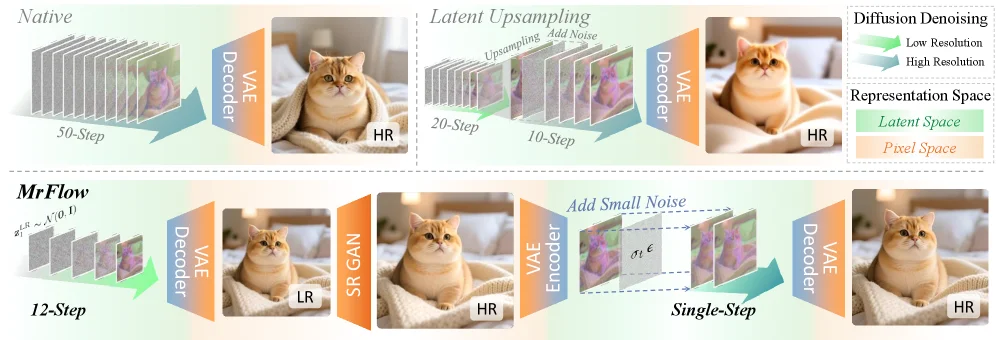
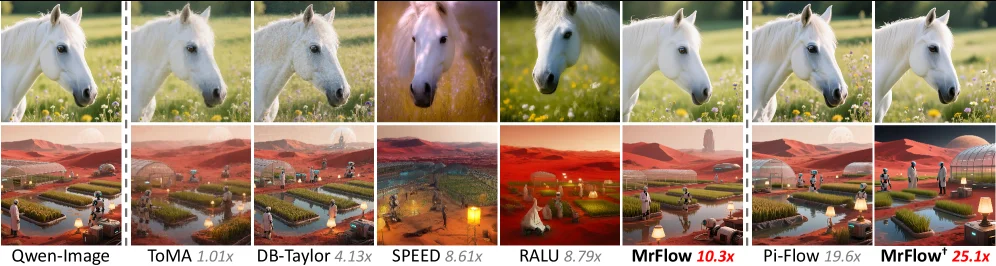
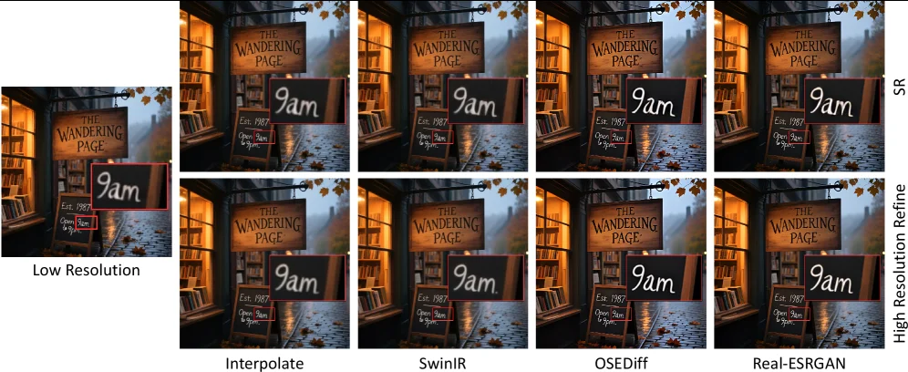
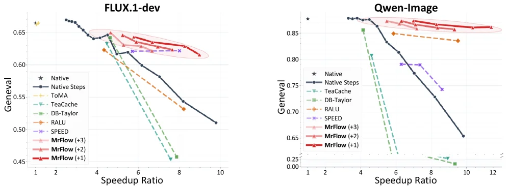
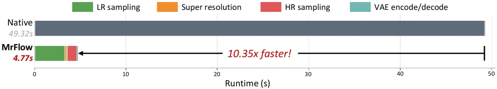

# Multi-Resolution Flow Matching: Training-Free Diffusion Acceleration via Staged Sampling

[arXiv](https://arxiv.org/abs/2607.01642) · [HuggingFace](https://huggingface.co/papers/2607.01642) · ▲32

## Abstract (verbatim)

> Hardware-agnostic strategies for accelerating text-to-image diffusion, such as timestep distillation and feature caching, can reduce inference time without custom kernels or system-level optimization. Among them, multi-resolution generation strategies have recently received broad attention, attaining more than 5x speedup without any training. However, the design of performing upsampling in the latent space, together with the selective modification of partial regions, causes these methods to exhibit noticeable blurring or artifacts. To this end, we propose MrFlow, a training-free multi-resolution acceleration strategy for pretrained flow-matching models built upon a staged low-to-high-resolution pipeline. MrFlow first rapidly generates the main structure at low resolution, then performs super-resolution in the pixel space using a lightweight pretrained GAN-based model, subsequently injects low-strength noise to enable high-frequency resampling, and finally refines the details at high resolution. Quantitative and qualitative results on FLUX.1-dev and Qwen-Image show that MrFlow exploits the quadratic token reduction and reduced step requirement of low-resolution sampling to achieve 10x end-to-end acceleration while keeping OneIG within a 1% gap relative to that before acceleration, significantly surpassing other training-free acceleration strategies, and requiring no training or runtime dynamic identification whatsoever. MrFlow can further be directly combined orthogonally with pre-trained timestep distillation strategies, achieving even higher generation acceleration of up to 25x.

## Background

### Background Analysis  

**1. Technical Context**  
Recent advances in image generation using diffusion models (e.g., Transformer-based architectures or flow matching paradigms) have improved quality but at the cost of increasing computational demands. For instance, large models like Qwen-Image-20B may require hundreds of sampling steps for a single text-to-image task, leading to long inference times. This inefficiency limits real-world applications (e.g., real-time interactions or resource-constrained devices). Researchers thus seek acceleration methods that reduce computation without compromising quality.  

**2. Previous Limitations**  
Existing acceleration strategies face challenges:  
- **Training or system dependency**: Methods like timestep distillation require retraining, while feature caching relies on system-level optimizations, limiting generality.  
- **Limited speedup**: Most approaches achieve only 2-5x faster inference and may introduce blurring or artifacts.  
- **Multi-resolution drawbacks**: While low-resolution generation followed by high-resolution refinement (e.g., latent upsampling) can boost speed, latent upsampling often causes structural distortions, and dynamic region identification adds complexity.  

**3. Proposed Solution**  
This paper introduces MrFlow, a training-free multi-resolution acceleration strategy based on a **coarse-to-fine staged pipeline**:  
1. **Low-resolution generation**: A pretrained diffusion model quickly generates the image structure at low resolution, reducing computation and steps.  
2. **Pixel-space super-resolution**: A lightweight GAN-based network upscales the image in pixel space, preserving structure while adding high-frequency details.  
3. **Noise injection and high-resolution refinement**: Weak noise is injected to correct errors from super-resolution, followed by high-resolution sampling to refine details.  
This approach avoids latent-space artifacts and leverages spatial properties (e.g., clear structures at low resolution, rich details at high resolution) for efficiency.  

**4. Key Differences**  
Compared to prior work, MrFlow stands out by:  
- **No training or dynamic identification**: It works directly with pretrained models, simplifying deployment.  
- **Staged design**: It clearly separates structure generation, super-resolution, and refinement, reducing complexity.  
- **Compatibility**: It can be combined orthogonally with existing methods (e.g., timestep distillation) for up to 25x faster inference.  
By balancing quality and speed, MrFlow achieves over 10x end-to-end acceleration without sacrificing performance.

## Method, Figure by Figure

> Figure 2: The framework of MrFlow. The compared strategies include the native inference scheme and methods that perform upsampling in the latent space such as LSSGen, RALU and SPEED.

This figure (Figure 2) illustrates the framework of the MrFlow method and compares it with native inference schemes and methods that perform upsampling in latent space (such as LSSGen, RALU, and SPEED). We can divide the figure into three main parts to understand it: the "Native" (native) and "Latent Upsampling" (latent space upsampling) methods at the top, and the "MrFlow" method at the bottom.

First, let's look at the **top "Native" (native) inference scheme**:
- On the left, the "50-Step" (50-step) process is shown, representing that native diffusion models usually require many sampling steps to generate high-quality images (HR, high resolution).
- The data starts from the multi-frame (or latent representation) on the left, goes through a "Decoder" (decoder) and a "VAE" (variational autoencoder), and finally outputs a high-resolution image of a cat.
- This process represents the traditional, unaccelerated diffusion model inference method, which requires many steps to generate a clear image.

Next is the **top "Latent Upsampling" (latent space upsampling) method**:
- Here, the "20-Step" (20-step) and "10-Step" (10-step) processes are shown, indicating that these methods attempt to speed up by reducing the number of steps but may perform upsampling in latent space.
- The data first goes through the steps of "Upsampling" (upsampling) and "Add Noise" (add noise), then through the "Decoder" and "VAE", and finally outputs a high-resolution image.
- The legend on the right explains the direction of "Diffusion Denoising" (diffusion denoising) (from low resolution to high resolution), and the "Representation Space" (representation space) is divided into "Latent Space" (latent space, green) and "Pixel Space" (pixel space, orange). The problem with this method is that upsampling in latent space and selectively modifying some regions may lead to blurry images or artifacts.

Then there is the **bottom "MrFlow" method**, which is the method proposed in this paper and is divided into several stages:
1. **Low-resolution generation stage**:
   - On the left, the "12-Step" (12-step) process is shown, which is much fewer steps than the native method.
   - The data starts from "σ_t^LR ~ N(0, I)" (low-resolution noise), goes through the "Decoder" and "VAE", and outputs a low-resolution (LR, low resolution) image of a cat. This step uses the characteristics of reduced quadratic token reduction and step requirements for low-resolution sampling to quickly generate the main structure of the image.
2. **Super-resolution stage**:
   - The low-resolution image goes through an "SR GAN" (super-resolution generative adversarial network) model and outputs a high-resolution (HR) image. This model is lightweight and pre-trained, based on GAN, and is used to quickly increase the resolution of the image.
3. **High-frequency resampling stage**:
   - The high-resolution image goes through the "VAE Encoder" (VAE encoder), then "Add Small Noise" (add small noise), finally goes through the "Single-Step" (single-step) processing, and then through the "Decoder" and "VAE" to output the final high-resolution image. This step injects low-intensity noise to enable high-frequency resampling and refines the details of the image.

**Order of data or information flow**:
- For the native method: Multi-frame (or latent representation) → 50-step processing → Decoder and VAE → High-resolution image.
- For the latent space upsampling method: Multi-frame (or latent representation) → 20-step/10-step processing (including upsampling and adding noise) → Decoder and VAE → High-resolution image.
- For the MrFlow method: Low-resolution noise → 12-step processing → Decoder and VAE → Low-resolution image → SR GAN → High-resolution image → VAE encoder → Add small noise → Single-step processing → Decoder and VAE → Final high-resolution image.

**Specific operation mode of the method**:
- MrFlow adopts a staged low-to-high-resolution pipeline without training:
  1. First, quickly generate the main structure of the image at low resolution, taking advantage of the efficiency of low-resolution sampling (reduced quadratic tokens and step requirements). This step only requires 12 steps.
  2. Then, use a lightweight pre-trained GAN model (SR GAN) to perform super-resolution in pixel space and quickly increase the resolution of the image.
  3. Next, inject low-intensity noise to enable high-frequency resampling and refine the details of the image.
  4. Finally, further refine the details at high resolution to ensure the quality of the image.

**Conclusion**:
- Among the methods shown in the figure, MrFlow achieves a 10-fold end-to-end acceleration through a staged low-to-high-resolution generation pipeline, while maintaining a OneIG (possibly referring to some image quality metric) gap of less than 1% compared to before acceleration. It is significantly better than other training-free acceleration strategies and does not require any training or runtime dynamic identification.
- In contrast, the native method requires more steps (50 steps), while the latent space upsampling method, although it reduces the number of steps (20 steps or 10 steps), may lead to blurry images or artifacts. MrFlow, by combining low-resolution generation, super-resolution, high-frequency resampling, and detail refinement, not only accelerates the inference process but also maintains the high quality of the image.

---

> Figure 1: Qualitative comparison between MrFlow and various methods on Qwen-Image. The dashed lines separate the pretrained model, training-free strategies, and strategies that rely on or exploit timestep distillation.

This figure (Figure 1) is a qualitative comparison from the paper "Multi-Resolution Flow Matching: Training-Free Diffusion Acceleration via Staged Sampling," showcasing the generative quality of a method named MrFlow against various other methods on the Qwen-Image model. We will explain the image from left to right:

1.  **Overall Layout and Grouping**:
    *   The image is divided into three main sections by vertical dashed lines, as described in the original caption: "The dashed lines separate the pretrained model, training-free strategies, and strategies that rely on or exploit timestep distillation."
    *   **First Group (Far Left, left of the first dashed line)**: Represents the "pretrained model."
        *   Labeled "Qwen-Image." This section shows the images generated by the original pretrained model without any acceleration strategies applied. There are two rows of images here, likely corresponding to different generation scenarios (e.g., horses in the top row, a Mars base in the bottom row). These images serve as a baseline for quality comparison with images generated by other acceleration methods.

    *   **Second Group (Middle Section, between the first and second dashed lines)**: Represents "training-free strategies."
        *   From left to right:
            *   **ToMA 1.01x**: A training-free acceleration method with an acceleration factor of 1.01x (close to original speed, possibly a mild acceleration comparison).
            *   **DB-Taylor 4.13x**: Another training-free acceleration method with an acceleration factor of 4.13x.
            *   **SPEED 8.61x**: A training-free acceleration method with an acceleration factor of 8.61x.
            *   **RALU 8.79x**: A training-free acceleration method with an acceleration factor of 8.79x.
            *   **MrFlow 10.3x**: The method proposed in this paper, which is a training-free strategy, with an acceleration factor of 10.3x.
        *   These methods attempt to accelerate the image generation process without retraining the model.

    *   **Third Group (Far Right, right of the second dashed line)**: Represents "strategies that rely on or exploit timestep distillation."
        *   From left to right:
            *   **Pi-Flow 19.6x**: An acceleration method that utilizes timestep distillation, with an acceleration factor of 19.6x.
            *   **MrFlow\* 25.1x**: This is likely a variant or further optimized version of the MrFlow method, which also uses timestep distillation, achieving an acceleration factor of 25.1x.
        *   Methods in this group achieve higher acceleration ratios through timestep distillation techniques.

2.  **Method Operation (Inferred from Results)**:
    *   This figure visually compares the effects of different acceleration methods. By observing the similarity and clarity of images generated by different methods compared to the original "Qwen-Image," one can understand the pros and cons of each approach.
    *   **How MrFlow Works** (Inferred from the paper abstract and the shown results):
        *   MrFlow is a training-free multi-resolution acceleration strategy based on flow-matching models.
        *   It employs a "low-to-high resolution" staged pipeline.
        *   First, it rapidly generates the main structure of the image at a low resolution (corresponding to the image generated by "MrFlow 10.3x" in the figure, which, despite acceleration, still appears relatively clear).
        *   Then, it performs super-resolution in the pixel space using a lightweight pretrained GAN-based model.
        *   Next, it injects low-strength noise to enable high-frequency resampling.
        *   Finally, it refines the details at high resolution.
        *   From the figure, the images generated by "MrFlow 10.3x" appear visually clearer and closer to the original image's quality than some other training-free methods (like DB-Taylor, SPEED, RALU). "MrFlow\* 25.1x," with its higher acceleration, might have slightly different visual quality (requiring more careful observation).

3.  **Comparison Objects and Conclusions**:
    *   **Comparison Objects**: The figure compares various acceleration methods for text-to-image diffusion models, including the pretrained model itself, various training-free acceleration strategies (e.g., ToMA, DB-Taylor, SPEED, RALU, MrFlow), and strategies that utilize timestep distillation (e.g., Pi-Flow, MrFlow\*).
    *   **Coordinates/Arrangement**: Images are arranged in a grid format, with each row representing a generation scenario (horses in the top row, Mars base in the bottom row) and each column representing a method.
    *   **Conclusions**:
        *   Visually, images generated by MrFlow (10.3x) are clearer and closer to the original "Qwen-Image" than those from some other training-free methods (e.g., DB-Taylor 4.13x, SPEED 8.61x, RALU 8.79x).
        *   MrFlow\* (25.1x) achieves a higher acceleration factor, but its visual quality might need more detailed comparison with "MrFlow 10.3x" and the original image (e.g., for any slight blurring or artifacts).
        *   This figure intuitively demonstrates that the MrFlow method can achieve significant acceleration (e.g., 10x or higher) while maintaining high generative image quality, thus validating the effectiveness of the proposed method. It shows that MrFlow can leverage the quadratic token reduction and reduced step requirements of low-resolution sampling to achieve end-to-end acceleration with a OneIG (possibly a quality metric like One Image Generation quality) within a 1% gap compared to before acceleration.

---

> Figure 3: Example comparison of MrFlow adopting different super-resolution strategies on Qwen-Image, where Low Resolution denotes the image after low-resolution generation followed by VAE decoding to the pixel space, with a resolution of 512 × 512 512\times 512 . The rows of SR and High Resolution Refine are respectively the super-resolved image and the final image after high-resolution refinement, with a resolution of 1024 × 1024 1024\times 1024 .

This figure (Figure 3) from the paper "Multi-Resolution Flow Matching: Training-Free Diffusion Acceleration via Staged Sampling" visually compares the effects of different super-resolution strategies adopted by the MrFlow method on the Qwen-Image model, using a specific example.

First, let's look at the leftmost part of the figure, labeled "Low Resolution." This image represents the image generated at a low resolution (512x512 pixels) after VAE decoding to the pixel space. This is the first step in the MrFlow pipeline: rapidly generating the main structure of the image at a low resolution. As you can see, the details in this low-resolution image (like the "9am" sign and the small chalkboard below it) are relatively blurry.

Next, the top row is labeled "SR" (Super-Resolution), and the bottom row is labeled "High Resolution Refine." These two rows show the results of enhancing the low-resolution image from the left to a high resolution (1024x1024 pixels) using different strategies.

The figure displays four different super-resolution strategies or baseline methods, from left to right:
1.  **Interpolate**: This is a basic image scaling method that uses interpolation algorithms (like bilinear or bicubic interpolation) to increase the image resolution. From the results, the "SR" row image, although having increased resolution, still has blurry details. For example, the edges of the "9am" text are not very clear, and the text on the small chalkboard is somewhat fuzzy. In the "High Resolution Refine" row, the details are improved after refinement, but they are still not as sharp as those from other more advanced methods.
2.  **SwinIR**: This is a deep learning-based super-resolution method. In the "SR" row, we can see that the image clarity is better than that of the "Interpolate" method, and the "9am" text and the text on the small chalkboard are more distinguishable. In the "High Resolution Refine" row, further refinement enhances the details, though some minor blurriness or artifacts might still exist.
3.  **OSEDiff**: This could be another specific super-resolution or diffusion-based super-resolution method. Its "SR" row results are similar to, or possibly better than, SwinIR. The "High Resolution Refine" row shows further detail enhancement.
4.  **Real-ESRGAN**: This is a well-known super-resolution method based on Generative Adversarial Networks (GANs). In the "SR" row, its performance is already quite good, with clear image details. In the "High Resolution Refine" row, after refinement, the image details (such as the "9am" text, the text on the small chalkboard, and the background books and fallen leaves) are very clear and sharp, with the least artifacts.

This figure reveals the core idea of the MrFlow method: first, rapidly generate the main structure of the image at a low resolution (as shown by "Low Resolution"), then use a lightweight pre-trained super-resolution model (like SwinIR, OSEDiff, or Real-ESRGAN, as compared in the figure) to enhance the image to a high resolution (the "SR" row). Finally, further refinement at high resolution might be performed (the "High Resolution Refine" row) to improve the image quality even more.

By comparing the "SR" and "High Resolution Refine" results of different methods, we can intuitively see the performance differences between various super-resolution strategies. For instance, Real-ESRGAN outperforms the interpolation method and SwinIR in providing clear details. This figure aims to demonstrate that selecting an appropriate super-resolution strategy is crucial for the overall performance of the MrFlow method, as it directly affects the quality of the final generated image.

In summary, this figure, through a specific visual example, illustrates the entire pipeline of the MrFlow method—from low-resolution generation to high-resolution super-resolution and then to high-resolution refinement—and compares the effects of different super-resolution strategies, thereby proving the effectiveness of the method.

---

> Figure 5: Trade-off curves between GenEval score and speedup for various training-free methods on FLUX.1-dev and Qwen-Image. Different shades of MrFlow correspond to different numbers of steps used in the high-resolution refinement stage.

This figure (Figure 5) displays trade-off curves between the GenEval score (a measure of image generation quality) and the speedup ratio for various training-free acceleration methods on two benchmark datasets: FLUX.1-dev and Qwen-Image. Let's break down the components and what they represent:

The figure consists of two subplots, one for each benchmark:
*   The left subplot is labeled "FLUX.1-dev," and the right subplot is labeled "Qwen-Image."
*   The **x-axis** (horizontal) represents the "Speedup Ratio." This indicates how many times faster the method is compared to a baseline (typically "Native" or "Native Steps"). A higher value on this axis means greater acceleration.
*   The **y-axis** (vertical) represents the "GenEval" score. This is a metric used to evaluate the quality of generated images; a higher score indicates better image quality.

Each curve or data point on the plot represents a different training-free acceleration method. The legend identifies these methods:
*   **Native**: This likely represents the original model inference without any acceleration, serving as a performance baseline.
*   **Native Steps**: This might refer to acceleration by reducing the number of sampling steps of the original model, possibly without other optimizations.
*   **ToMA, TeaCache, DB-Taylor, RALU, SPEED**: These are other existing training-free acceleration strategies.
*   **MrFlow (+1), MrFlow (+2), MrFlow (+3)**: These are different variants of the proposed MrFlow method. According to the figure's title and caption, these numbers (+1, +2, +3) correspond to the number of steps used in the high-resolution refinement stage. A higher number means more refinement steps are performed at high resolution, which theoretically leads to better image quality but might slightly reduce the acceleration ratio.

Now, let's analyze the curves:
*   In the FLUX.1-dev subplot, the "Native" method (marked with a star) has the highest GenEval score (around 0.67) but the lowest speedup ratio (close to 1). As the speedup ratio increases (moving to the right), the GenEval score generally decreases for most methods, illustrating the trade-off between speed and quality.
*   The different variants of MrFlow (represented by the red curves) perform exceptionally well. For instance, MrFlow (+1) (the lowest red curve) maintains a GenEval score of about 0.60 even at a speedup ratio of approximately 8. MrFlow (+2) and MrFlow (+3) (the higher red curves) achieve higher GenEval scores for the same speedup ratio, or the same GenEval score for a higher speedup ratio, compared to MrFlow (+1). This shows that by adjusting the number of steps in the high-resolution refinement stage, one can trade off between speed and quality. More steps (e.g., MrFlow (+3)) generally lead to better image quality but slightly lower acceleration compared to fewer steps (e.g., MrFlow (+1)).
*   Other methods like ToMA and TeaCache show a more significant drop in GenEval score as the speedup ratio increases, indicating poorer image quality at higher acceleration rates.

In the Qwen-Image subplot, the trend is similar:
*   The "Native" method (star) has the highest GenEval score (around 0.87) but the lowest speedup ratio.
*   The different variants of MrFlow (red curves) again demonstrate superior performance. For example, MrFlow (+1) maintains a GenEval score of about 0.85 even at a speedup ratio of approximately 10. MrFlow (+2) and MrFlow (+3) achieve higher GenEval scores for the same speedup ratio, or the same GenEval score for a higher speedup ratio, compared to MrFlow (+1).
*   Other methods like ToMA, TeaCache, and DB-Taylor also show a significant decrease in GenEval score with increasing speedup ratio.

This figure reveals how the MrFlow method operates and its advantages:
1.  **Multi-Resolution Acceleration**: MrFlow is a training-free multi-resolution acceleration strategy for pretrained flow-matching models. It first rapidly generates the main structure of the image at a low resolution, then performs super-resolution in the pixel space using a lightweight pretrained GAN-based model.
2.  **Staged Refinement**: The MrFlow (+1), (+2), (+3) variants indicate different numbers of steps used in the high-resolution refinement stage. Investing more computation (i.e., more steps) in the refinement stage improves the final image quality (higher GenEval score) but may slightly reduce the acceleration ratio. Conversely, reducing refinement steps achieves higher acceleration but might lead to a slight decrease in image quality.
3.  **Trade-off and Optimization**: The plot clearly illustrates the trade-off between speed (speedup ratio) and quality (GenEval score) for different methods. MrFlow's advantage lies in its ability to achieve significant acceleration while maintaining high image quality (e.g., over 5x to nearly 10x acceleration with minimal decrease in GenEval score, as suggested by the paper's abstract).
4.  **Comparison with Other Methods**: Compared to other training-free acceleration methods, MrFlow shows higher GenEval scores across the entire range of speedup ratios. This advantage is particularly evident at high acceleration ratios, where its performance is significantly better. This indicates that MrFlow better balances the trade-off between speed and quality.

In summary, this figure effectively demonstrates the superiority of the MrFlow method for training-free acceleration of text-to-image diffusion models by showing trade-off curves between speed and quality. By adjusting the number of steps in the high-resolution refinement stage, users can flexibly balance speed and image quality, and MrFlow consistently provides better overall performance than other existing methods.

---

> Figure 6: Stage-wise runtime breakdown of native Qwen-Image and MrFlow- 12 , 1 12,1 .

This diagram is a **stage - by - stage runtime breakdown chart** used to visually compare the inference speeds of two methods: "Native Qwen - Image" and "MrFlow". The core is to show how MrFlow achieves acceleration through a staged process.

### Analysis of Components and Processes in the Diagram:
- **Horizontal Axis (Runtime (s))**: Represents the running time (unit: second), ranging from 0 to 50 seconds, showing the inference time consumption of different methods.
- **Vertical Axis (Methods)**: Includes two comparison objects: `Native` (Native Qwen - Image) and `MrFlow` (the method proposed in this paper).
- **Color Blocks (Stages)**: Four colors in the legend correspond to different processing stages:
  - Green (LR sampling): Low - resolution sampling stage;
  - Orange (Super resolution): Super - resolution stage;
  - Red (HR sampling): High - resolution sampling stage;
  - Cyan (VAE encode/decode): Encoding/decoding stage of the variational autoencoder (the cyan block of MrFlow in the diagram is almost invisible, indicating that the time consumption of this stage is extremely short or has been optimized).
- **Arrows and Texts**: A black arrow points from the stage block of MrFlow to the right, with the label "10.35x faster!", meaning that the inference speed of MrFlow is about 10.35 times faster than that of Native.

### Operational Logic of the Method (Derived from the Diagram):
MrFlow adopts a staged process of **"fast generation at low resolution → super - resolution → refinement at high resolution"**:
1. **Low - Resolution Sampling (LR sampling)**: First, quickly generate the main structure of the image at a low resolution (corresponding to the green block, with extremely short time consumption). This step takes advantage of the "quadratic token reduction" and "reduced step requirement" of low - resolution sampling to greatly shorten the early - stage time consumption.
2. **Super - Resolution (Super resolution)**: Then, use a lightweight pre - trained GAN model for pixel - space super - resolution (the orange block in the diagram may be merged or omitted, because the core of MrFlow is the direct transition from "low to high"? Combined with the paper description, in fact, after low - resolution sampling, it first super - resolves to the pixel space, then injects noise for high - frequency resampling, and finally refines at high resolution — but the stage blocks of MrFlow in the diagram are mainly green (LR) and red (HR), indicating that super - resolution and high - frequency resampling may be integrated into the "from low to high" process, or the VAE stage in cyan has been greatly optimized).
3. **High - Resolution Sampling (HR sampling)**: Finally, refine the details at a high resolution (corresponding to the red block, with relatively short time consumption).

Compared with `Native` (the gray bar, with a time consumption of 49.32 seconds), the total time consumption of MrFlow is only 4.77 seconds, and the speed is increased by about 10.35 times. This shows that MrFlow, by **skipping the redundant steps between low resolution and high resolution (such as the blurring problem of potential - space upsampling + local modification in traditional methods)**, directly uses the staged process of "low to high", combined with lightweight super - resolution and high - frequency resampling, to greatly accelerate while maintaining quality.

### Results and Conclusions (From the Quantitative Information in the Diagram):
- **Coordinates and Values**: The horizontal axis shows that Native consumes about 49.32 seconds, and MrFlow consumes about 4.77 seconds; the arrow is labeled "10.35x faster!", that is, the speed of MrFlow is about 10.35 times that of Native.
- **Comparison Objects**: Native (Native Qwen - Image) vs. MrFlow (the method in this paper).
- **Conclusion**: Through a training - free strategy of staging (low - resolution sampling → super - resolution → high - resolution refinement), MrFlow, by taking advantage of the efficiency of low - resolution sampling and combining lightweight super - resolution and high - frequency resampling, achieves about 10 - fold acceleration in **end - to - end inference speed**, while maintaining image quality (the gap of indicators such as OneIG is less than 1% compared with before acceleration), and does not require training or runtime dynamic recognition, which is significantly better than other training - free acceleration strategies.

This diagram clearly shows the core advantages of MrFlow: **by avoiding the bottlenecks of traditional methods (such as the blurring problem of potential - space upsampling) through a staged process, and using the efficient sampling at low resolution and the fast refinement at high resolution to achieve great acceleration**. Readers can understand the working logic and performance advantages of MrFlow just through the stage division, time comparison, and speed - up multiple in the diagram.
