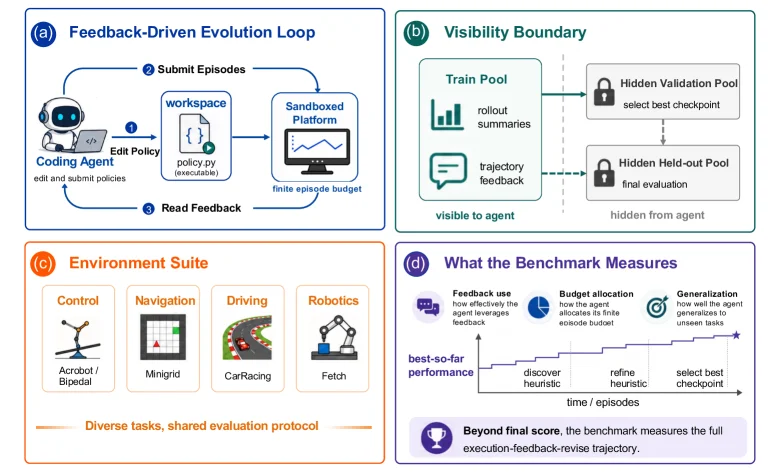
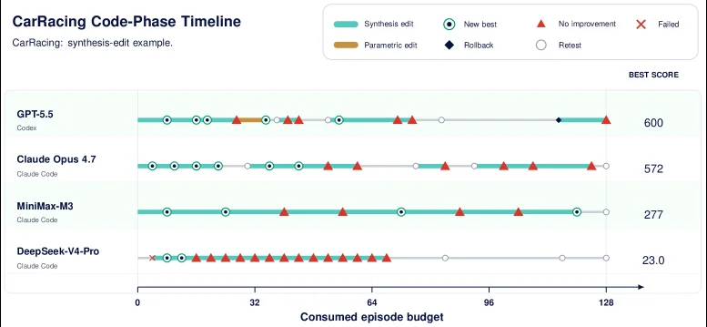
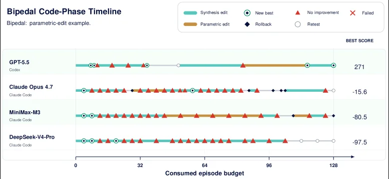
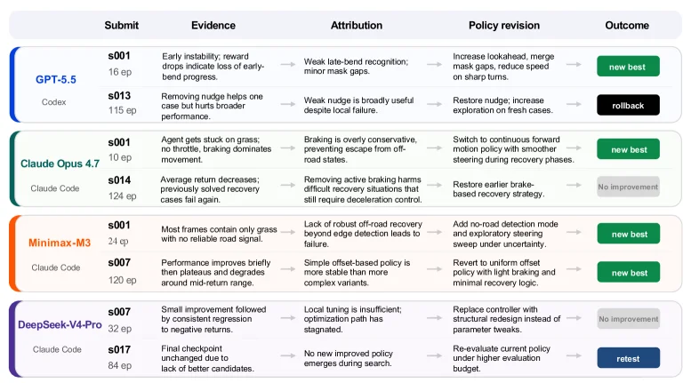
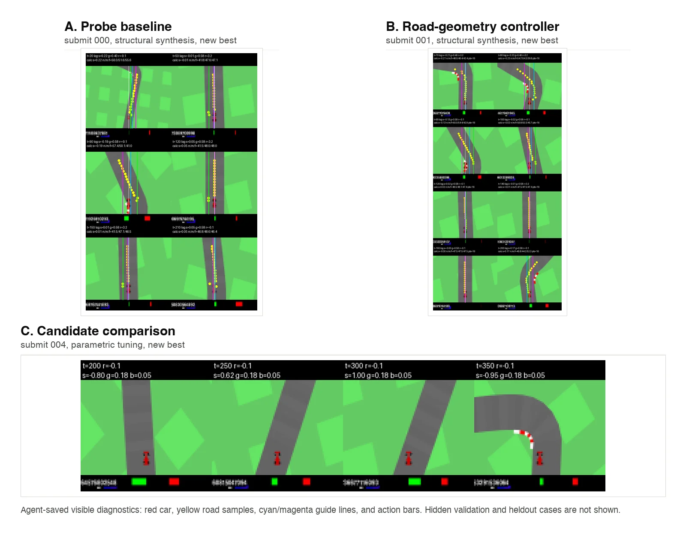

# EvoPolicyGym: Evaluating Autonomous Policy Evolution in Interactive Environments

[arXiv](https://arxiv.org/abs/2607.02440) · [HuggingFace](https://huggingface.co/papers/2607.02440) · ▲43

## Abstract (verbatim)

> Autonomous agents are increasingly expected to improve executable policies through feedback, yet existing evaluations often collapse this process into a final score or confound it with open-ended software-engineering progress. We introduce Autonomous Policy Evolution, a controlled evaluation setting in which a harness-model agent repeatedly edits an executable policy system under a fixed interaction budget. We instantiate this setting in EvoPolicyGym, a benchmark built from compact interactive RL environments that evaluates how agents iteratively improve explored policies. On the EvoPolicyGym suite, GPT-5.5 achieves the strongest aggregate rank score and top-two performance on all 16 environments. Beyond leaderboard results, EvoPolicyGym also provides trajectory-level diagnostics that distinguish how agents allocate budget, convert feedback into parametric tuning. These analyses show that strong autonomous policy evolution depends not only on isolated task wins, but on discovering task-appropriate mechanisms and refining policies under bounded feedback.

## Background

### Background Analysis  

**1. Technical Context and Real-World Needs**  
Autonomous agents (e.g., code generation tools or language models) need to continuously improve their behavior through environmental feedback rather than producing fixed outputs. For instance, programming agents must adjust code based on test failures, while language models refine responses via reflection. The core need is to convert feedback into iterative improvements of executable policies within limited interactions, ensuring stability in new scenarios.  

**2. Limitations of Previous Approaches**  
Existing evaluation methods suffer from two key flaws:  
- **Outcome-focused blind spots**: Final scores ignore critical issues in the improvement process (e.g., blind retries, overfitting to visible feedback, or neglecting validation set generalization).  
- **Confounding open-ended engineering**: In unconstrained tasks (e.g., continuous software projects), evaluations are distorted by irrelevant factors like specification changes or maintenance quality, making it hard to isolate policy optimization capabilities.  

**3. Proposed Solution**  
The paper introduces the **Autonomous Policy Evolution** framework to address these issues:  
- **Controlled benchmarking**: EvoPolicyGym provides a set of compact interactive RL environments (e.g., robotics, driving simulations) where agents repeatedly edit policies under a fixed budget (e.g., 128 interaction rounds) and optimize based on sandbox feedback.  
- **Process-oriented evaluation**: The benchmark focuses on the *policy evolution process* itself, not just task performance. Agents submit policy versions and receive training feedback, but validation/test results are computed server-side to ensure focus on improvement efficiency.  
- **Trajectory-level diagnostics**: Full execution-feedback-revision traces are recorded to analyze how agents allocate budgets, diagnose errors, and balance exploration-exploitation.  

**4. Key Differences from Prior Work**  
- **Process over outcome**: Traditional benchmarks (e.g., OpenAI Gym) evaluate final task performance, while EvoPolicyGym measures generalization via hidden validation sets.  
- **Controlled variables**: Unlike open engineering benchmarks (e.g., software maintenance), EvoPolicyGym restricts environment changes to isolate policy optimization.  
- **Diagnostic insights**: Fine-grained trajectory data (e.g., policy revision logs) reveal how feedback translates into concrete improvements (e.g., parameter tuning or structural changes).  

This framework enables deeper insights into how autonomous agents iteratively optimize policies, moving beyond simple score comparisons.

## Method, Figure by Figure

> Figure 1 : EvoPolicyGym framework. (a) Interaction loop : agents edit policies, submit episodic rollouts under a finite budget, and receive platform-mediated feedback. (b) Visibility boundary : training feedback is visible, while validation-based checkpoint selection and held-out evaluation are hidden. (c) Environment suite : a unified interface spanning control, navigation, driving, and robotics tasks under a shared evaluation protocol. (d) Measured aspects : feedback utilization, budget efficiency, and policy improvement dynamics, captured via the evolution of best-so-far performance over time.

This figure illustrates the EvoPolicyGym framework, designed to evaluate autonomous policy evolution. It can be understood by examining its four main components:

### Feedback-Driven Evolution Loop
This section describes the core interaction process between the agent and the platform:
1. **Coding Agent**: This is an intelligent agent capable of editing and submitting policies (represented by the robot icon). It is responsible for modifying the policy code.
2. **Workspace**: The agent edits the policy here ("policy.py (executable)"), meaning it writes executable policy code.
3. **Submit Episodes**: The agent submits the edited policy to the sandboxed platform.
4. **Sandboxed Platform**: This platform runs the submitted policy under a finite episode budget ("finite episode budget") and generates rollout summaries and trajectory feedback.
5. **Read Feedback**: The agent receives feedback from the platform and then edits the policy again based on this feedback, forming a loop.

### Visibility Boundary
This part explains what information the agent can see and what it cannot see:
- **Train Pool**: The agent can see the rollout summaries and trajectory feedback from this pool. This information is used by the agent to learn and improve its policy.
- **Hidden Validation Pool**: The agent cannot see this pool. The platform selects the best checkpoint from here ("select best checkpoint").
- **Hidden Held-out Pool**: The agent also cannot see this pool. The platform conducts the final evaluation in this pool ("final evaluation").

### Environment Suite
This section showcases the different types of tasks included in EvoPolicyGym:
- **Control**: Tasks like Acrobot/Bipedal.
- **Navigation**: Tasks like Minigrid.
- **Driving**: Tasks like CarRacing.
- **Robotics**: Tasks like Fetch.
These tasks have a unified interface and a shared evaluation protocol, ensuring consistency and comparability in evaluation.

### What the Benchmark Measures
This part explains the key aspects measured by the benchmark:
- **Feedback use**: Measures how effectively the agent uses feedback to improve its policy.
- **Budget allocation**: Measures how the agent allocates resources within the limited episode budget.
- **Generalization**: Measures how well the agent applies knowledge learned from one task to unseen new tasks.
The figure also shows a performance curve over time, illustrating the agent's progression from discovering heuristics ("discover heuristic") to refining them ("refine heuristic"), and finally to selecting the best checkpoint ("select best checkpoint"). Additionally, the benchmark focuses not only on the final score but also on the entire execution-feedback-revision trajectory.

Through this figure, we can clearly see how EvoPolicyGym evaluates autonomous policy evolution through a closed-loop system and how it measures the agent's performance in different aspects.

---

> Figure 5 : CarRacing code-phase timeline. Phase bands are inferred mechanically from the same policy source-bundle rule as Table 4 : synthesis-edit phases denote new AST topologies after numeric constants are stripped, and parametric-edit phases denote changed source bundles under the same topology. Symbols mark validation outcomes and candidate-management events; rollback/retest are event types, not additional edit types.

This figure is Figure 5 from the paper "EvoPolicyGym: Evaluating Autonomous Policy Evolution in Interactive Environments," titled "CarRacing code-phase timeline." It illustrates the code-phase timelines of different agents (GPT-5.5, Claude Opus 4.7, MiniMax-M3, DeepSeek-V4-Pro) in the CarRacing environment.

### Explanation of Components in the Figure:
1. **X-axis (Horizontal Axis)**: Represents the "Consumed episode budget," ranging from 0 to 128, indicating the resources or attempts consumed by the agents during the strategy improvement process.
2. **Y-axis (Vertical Axis)**: Lists four different agents: GPT-5.5, Claude Opus 4.7, MiniMax-M3, and DeepSeek-V4-Pro, each with a corresponding timeline.
3. **Symbols and Colors on the Timeline**:
    - **Cyan (Synthesis edit)**: Indicates the "synthesis edit" phase, where modifications are made to the abstract syntax tree (AST) of the strategy (new topological structure after removing numerical constants). The symbols for these phases are circles (○), representing a new best state (New best) or retesting (Retest).
    - **Orange (Parametric edit)**: Indicates the "parametric edit" phase, where changes are made to the source code bundle under the same topology. The symbols for these phases are triangles (△), representing no improvement (No improvement).
    - **Black Diamond (Rollback)**: Indicates a "rollback" event, where previous edits are undone.
    - **White Circle (Retest)**: Indicates a "retest" event, where the current strategy is re-evaluated.
    - **Red Cross (Failed)**: Indicates a "failure" event, though it does not appear in this figure.
4. **"BEST SCORE" on the Right**: Displays the best scores of each agent in the CarRacing environment, from highest to lowest: GPT-5.5 (600), Claude Opus 4.7 (572), MiniMax-M3 (277), and DeepSeek-V4-Pro (23.0).

### How the Method Works:
This figure demonstrates how agents iteratively improve executable strategies under a fixed interaction budget. Specifically:
1. **Edit Phases**: Agents modify strategies during "synthesis edit" and "parametric edit" phases. Synthesis editing involves changes to the AST's topological structure, while parametric editing adjusts parameters under the same topology.
2. **Validation and Management Events**: Symbols (such as circles, triangles, diamonds, and white circles) mark validation results and candidate management events. For example, circles indicate a new best state or retesting, triangles indicate no improvement, and diamonds indicate a rollback.
3. **Budget Consumption**: The X-axis shows the episode budget consumed by each agent during the improvement process, reflecting the efficiency and resource utilization of strategy improvement.

### Result Analysis:
From the figure, we can observe:
1. **Best Scores**: GPT-5.5 achieved the highest best score (600) in the CarRacing environment, followed by Claude Opus 4.7 (572), while DeepSeek-V4-Pro had the lowest score (23.0).
2. **Distribution of Edit Phases**: GPT-5.5 and Claude Opus 4.7 have a relatively even distribution of "synthesis edit" phases (cyan circles) and more "retesting" (white circles) and "rollback" (black diamonds) operations in the later stages, indicating continuous optimization of their strategies. In contrast, MiniMax-M3 and DeepSeek-V4-Pro have more concentrated edit phases and more "no improvement" events (red triangles), suggesting lower efficiency in strategy improvement.
3. **Budget Utilization**: GPT-5.5 reached its best score after consuming approximately 128 episode budgets, while DeepSeek-V4-Pro stopped improving at a lower budget, possibly due to a bottleneck in strategy improvement.

### Conclusion:
This figure clearly illustrates the strategy improvement process of different agents in the CarRacing environment, including the types of edit phases, validation results, budget consumption, and best scores. By analyzing this information, we can draw the following conclusions:
- Powerful autonomous strategy evolution depends not only on isolated task victories but also on discovering appropriate mechanisms for tasks and optimizing strategies under limited feedback.
- The trajectory-level diagnostics provided by EvoPolicyGym help distinguish how agents allocate budgets and convert feedback into parameter adjustments, thus evaluating the efficiency and effectiveness of their strategy improvements.

---

> Figure 6 : Bipedal code-phase timeline, rendered with the same synthesis-edit and parametric-edit phase rules as Figure 5 . The environment is tuning-dominant, but successful tuning still depends on first reaching a viable gait topology; same-topology source-bundle edits then expose whether an agent can improve that structure by adjusting constants and thresholds.

This diagram illustrates the timeline of strategy iteration optimization for different agents in the "bipedal locomotion" task, helping us understand how they improve executable strategies under a fixed interaction budget. Here's a detailed explanation of each component in the diagram:

### Components of the Diagram and Information Flow
1. **Title and Subtitle**:
   - The title "Bipedal Code-Phase Timeline" indicates that this is a timeline of code phases for the bipedal locomotion task.
   - The subtitle "Bipedal: parametric-edit example" explains that this is an example of parametric editing.

2. **Legend**:
   - Different colored markers and shapes represent different types of operations:
     - Cyan (Synthesis edit): Synthesis editing, which may involve creating or modifying the overall structure of a strategy.
     - Brown (Parametric edit): Parametric editing, adjusting parameters such as constants and thresholds in the strategy.
     - Green circle (New best): New best strategy, indicating that the performance of the current strategy has improved.
     - Red triangle (No improvement): No improvement, meaning the current editing operation did not enhance the strategy's performance.
     - Blue diamond (Rollback): Rollback, undoing a previous editing operation.
     - White circle (Retest): Retest, re-evaluating the current strategy.
     - Red cross (Failed): Failed, indicating that the editing operation was not successful.

3. **Horizontal Axis (Consumed Episode Budget)**:
   - Represents the consumed interaction budget, ranging from 0 to 128, indicating the amount of resources used by the agent during the optimization process.

4. **Vertical Axis (Agents)**:
   - Lists four agents: GPT-5.5, Claude Opus 4.7, MiniMax-M3, and DeepSeek-V4-Pro, with each agent corresponding to a timeline.

5. **BEST SCORE on the Right**:
   - Displays the best score for each agent, used to compare their final performance.

### How the Method Works
This diagram shows how agents optimize strategies through iterative editing in the bipedal locomotion task:
1. **Initial Phase**:
   - Agents first perform synthesis editing (cyan segments), attempting to create or modify the overall structure of the strategy to achieve a feasible gait topology.
2. **Parameter Adjustment Phase**:
   - After achieving a feasible gait topology, agents perform parametric editing (brown segments), adjusting parameters such as constants and thresholds to further optimize strategy performance.
3. **Feedback and Decision**:
   - Agents decide whether to continue with the current strategy, roll back to a previous version, or retest based on feedback (such as markers like "New best," "No improvement," "Rollback," etc.).
   - For example, a red triangle indicates that the current editing operation did not improve performance, and the agent may need to adjust the strategy or roll back to a previous version.

### Results and Conclusions
1. **Coordinates and Comparison Objects**:
   - The horizontal axis is the consumed interaction budget, and the vertical axis is the different agents.
   - The BEST SCORE on the right shows the best score for each agent, used to compare their final performance.
2. **Conclusion**:
   - GPT-5.5 has a best score of 271, significantly higher than the other agents, indicating that it performs the best in the bipedal locomotion task.
   - The best scores for Claude Opus 4.7, MiniMax-M3, and DeepSeek-V4-Pro are -15.6, -80.5, and -97.5, respectively, much lower than that of GPT-5.5.
   - This suggests that powerful autonomous strategy evolution depends not only on isolated task victories but also on discovering mechanisms suitable for the task and optimizing strategies under limited feedback.

Through this diagram, we can clearly see how different agents allocate budgets, convert feedback, and make parameter adjustments in the bipedal locomotion task, thus understanding the differences in their performance during the strategy optimization process.

---

> Figure 7 : CarRacing feedback-utilization traces. Each row links evidence, attribution, policy revision, and outcome across agents. The submit column reports the submission index (s00k denotes the k-th submission) and the cumulative episode budget consumed prior to that submission. Labels are derived from logs, feedback summaries, and checkpoint diffs. The figure provides qualitative evidence of how feedback is translated into policy updates and is not an aggregate metric.

This figure (Figure 7) illustrates the feedback utilization trajectories of different agents in the CarRacing environment, aiming to demonstrate how agents convert feedback into strategy updates. We can understand this figure through the following parts:

### 1. Meaning of Columns and Information Flow
- **Submit**: This column contains two key pieces of information. First is the submission index (e.g., s001, s013, s007, etc.), where `s00k` represents the k - th submission. Second is the cumulative round budget consumed before this submission (for example, GPT - 5.5's s001 submission consumed a budget of 16 rounds). This represents the steps and resource consumption of the agent when iteratively improving the strategy.
- **Evidence**: This column describes the feedback or problems observed by the agent at a specific submission. This feedback usually comes from interaction logs of the environment, feedback summaries, or checkpoint differences. For example, when GPT - 5.5 made the s001 submission, it observed that "early instability, reward decrease indicates loss of early progress".
- **Attribution**: This column analyzes the reasons or problems behind the evidence. It attributes the observed phenomena to certain defects or deficiencies in the strategy. For example, for GPT - 5.5's s001 submission, the attribution is "weak late - stage turn recognition; small mirror gap".
- **Policy revision**: Based on the attribution, this column describes the specific modifications made by the agent to the strategy. For example, in response to the attribution of GPT - 5.5's s001 submission, the strategy revision was "increase foresight, merge mask gaps, reduce speed in sharp turns".
- **Outcome**: This column shows the result after the strategy revision. The result may be "new best", "rollback", "No improvement", or "retest". For example, the revision result of GPT - 5.5's s001 was "new best".

### 2. Order of Data or Information Flow
Each row in the figure represents the feedback utilization process of an agent at a specific submission point. The order of information flow is: **Submit (consume budget) -> Observe evidence (problem/feedback) -> Analyze attribution (problem cause) -> Implement policy revision -> Observe result**. This process is repeated in multiple rows, showing the trajectory of the agent's iterative strategy improvement.

### 3. Specific Operation Mode of the Method
This figure reveals how agents work in the EvoPolicyGym benchmark:
- **Iterative Improvement**: Agents repeatedly submit strategies and make improvements under a fixed interaction budget.
- **Feedback - Driven**: The improvement process is driven by environmental feedback. Agents need to identify problems (evidence) from the feedback, analyze the causes of the problems (attribution), and then adjust the strategy (policy revision).
- **Policy Revision**: Policy revision is carried out based on the understanding of the problem, which may involve parameter adjustments, algorithm modifications, or changes in strategy logic.
- **Result Evaluation**: After each policy revision, its effect is evaluated to determine whether there is an improvement.

### 4. Interpretation of the Result Figure
- **Coordinates/Comparison Objects**: The rows of the figure represent different submissions (made by different agents at different time points), and the columns represent different stages of feedback utilization. The comparison objects are the performances of different agents (such as GPT - 5.5, Claude Opus 4.7, Minimax - M3, DeepSeek - V4 - Pro) at the same or different submission points.
- **Conclusion**: This figure provides qualitative evidence to show how different agents convert feedback into strategy updates. By observing the trajectories of different agents, we can see their differences in identifying problems, analyzing causes, and implementing revisions. For example, some agents can quickly find effective strategy revisions (such as GPT - 5.5's s001 reaching "new best"), while others may encounter difficulties (such as DeepSeek - V4 - Pro's s007 with "No improvement"). This figure emphasizes that strong autonomous strategy evolution depends not only on isolated task victories but also on discovering appropriate task mechanisms and optimizing strategies under limited feedback.

In summary, this figure, by showing the feedback utilization trajectories of agents in the CarRacing environment, details the process of autonomous strategy evolution: from submission, observing feedback, analyzing causes to revising strategies, and finally evaluating results. It provides a clear visualization tool for understanding how agents learn and improve their strategies.

---

> Figure 9 : GPT-5.5 CarRacing visible diagnostics saved by the agent during the run. Panels A–B show how structural-synthesis edits turn pixel observations into road-geometry control signals: yellow points mark sampled road evidence, cyan/magenta lines mark guide estimates, and action bars/log text summarize the agent’s own rollout diagnostics. Panel C shows a later visible candidate comparison after a parametric-tuning edit. These images are qualitative evidence only and do not expose hidden-validation or held-out cases.

This figure (Figure 9) is from the paper "EvoPolicyGym: Evaluating Autonomous Policy Evolution in Interactive Environments" and shows the visible diagnostics saved by the agent (in this case, GPT-5.5) during its run in the CarRacing environment. These diagnostics help us understand how the agent iteratively improves its policy.

The structure of the figure is divided into three main sections: A, B, and C, each showing the agent's behavior and decision-making process at different stages or after different types of editing operations.

**Panel A: Probe baseline**
This panel shows the results of "structural-synthesis" edits, with submission number 000 and marked as "new best." It consists of three subplots, each displaying the agent's trajectory on the track and related diagnostic information.
- **Subplot content**: Each subplot contains a track scene where yellow dots represent the road evidence sampled by the agent. These dots help the agent perceive the geometry of the track. Cyan and magenta lines represent guide estimates, which are the paths or directions the agent infers from the sampled evidence. Additionally, each subplot has black bars at the top and bottom displaying the agent's own rollout diagnostic information, including time step (t), reward (r), score (s), and some parameters (like g and b). These bars may also include action bars summarizing the agent's action decisions.
- **Data flow**: The agent first samples road evidence (yellow dots) by observing pixel-level images (the track scene). Then, it uses this evidence to estimate the track's geometry (cyan/magenta lines). Finally, based on these estimates, the agent executes actions and records relevant information in the rollout diagnostic bars.

**Panel B: Road-geometry controller**
This panel shows the results of another "structural-synthesis" edit, with submission number 001, also marked as "new best." It also consists of multiple subplots, each displaying the agent's trajectory on the track and diagnostic information.
- **Subplot content**: Similar to Panel A, each subplot contains a track scene, yellow sample points, cyan/magenta guide lines, and rollout diagnostic bars. These subplots show the agent's behavior at different time steps or stages.
- **Data flow**: Similar to Panel A, the agent navigates the track by sampling road evidence, estimating the track's geometry, and executing actions. This panel may show the agent's behavioral changes after adjusting its road-geometry controller.

**Panel C: Candidate comparison**
This panel shows the visible candidate comparison after a "parametric-tuning" edit, with submission number 004 and marked as "new best." It is a longer subplot displaying the agent's continuous trajectory on the track and diagnostic information.
- **Subplot content**: This subplot includes four snapshots at different time steps (t=200, t=250, t=300, t=350), each showing the agent's position and direction on the track. The top of each snapshot has black bars displaying the time step (t), reward (r), score (s), and parameters (like g and b). The agent's position is represented by a red car, yellow dots represent sampled road evidence, and cyan/magenta lines represent guide estimates.
- **Data flow**: In this panel, the agent continues to navigate the track after parametric tuning. We can see the agent's position changes at different time steps and how it adjusts its trajectory based on sampled evidence and guide estimates.

**Specific explanation of how the method works**
From this figure, we can see how the agent iteratively improves its policy through editing its strategy system:
1. **Structural-synthesis edits**: The agent perceives the track by sampling road evidence (yellow dots) and estimates the track's geometry (cyan/magenta lines). These estimates help the agent plan its path.
2. **Parametric-tuning edits**: The agent adjusts the parameters of its strategy (like g and b) to optimize its performance. This can be observed by comparing the trajectories and diagnostic information at different time steps.
3. **Feedback loop**: After each edit, the agent executes actions and further adjusts its strategy based on the received feedback (like rewards and scores). This process is iterative until the desired performance is achieved.

**Conclusion**
This figure provides qualitative evidence showing how the agent iteratively improves its policy in the EvoPolicyGym environment. By analyzing the agent's visible diagnostic information, we can understand how it allocates its budget, converts feedback into parameter adjustments, and discovers task-appropriate mechanisms. These analyses show that powerful autonomous policy evolution depends not only on isolated task wins but also on discovering task-appropriate mechanisms and optimizing strategies under limited feedback.
