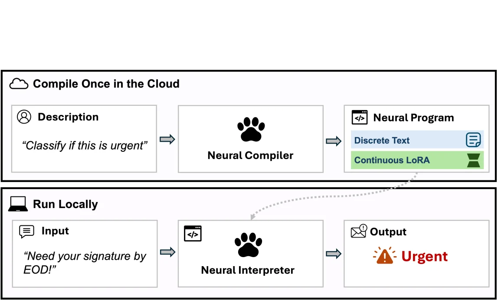
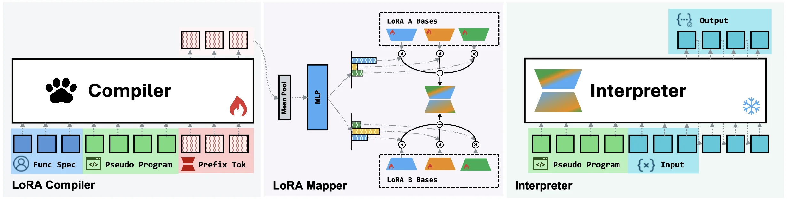
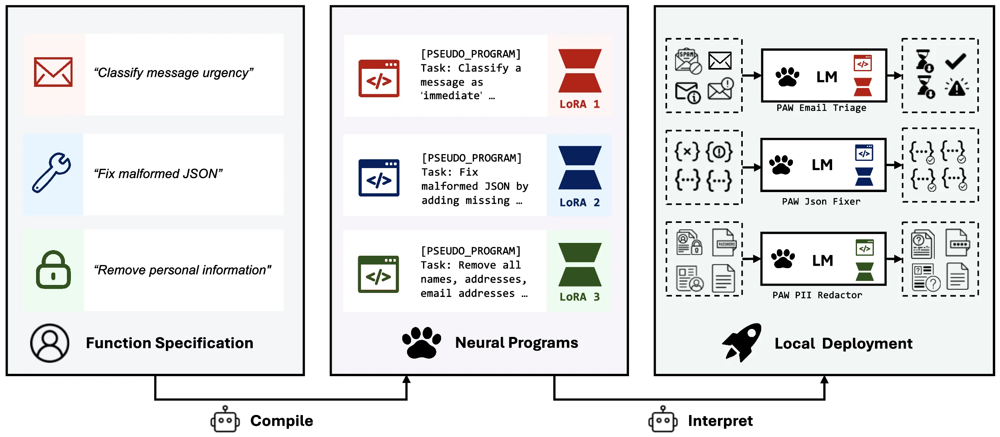

# Program-as-Weights: A Programming Paradigm for Fuzzy Functions

[arXiv](https://arxiv.org/abs/2607.02512) · [HuggingFace](https://huggingface.co/papers/2607.02512) · ▲87

## 摘要（原文）

> Many everyday programming tasks resist clean rule-based implementation, such as alerting on important log lines, repairing malformed JSON, or ranking search results by intent, and are increasingly outsourced to large language model APIs at the cost of locality, reproducibility, and price. We propose fuzzy-function programming: compiling such a function from a natural-language specification into a compact, locally-executable neural artifact. We instantiate this paradigm with Program-as-Weights (PAW), in which a 4B compiler trained on FuzzyBench, a 10M-example dataset we release, emits parameter-efficient adapters for a frozen, lightweight interpreter. A 0.6B Qwen3 interpreter executing PAW programs matches the performance of direct prompting of Qwen3-32B, while using roughly one fiftieth of the inference memory and running at 30 tokens/s on a MacBook M3. PAW reframes the foundation model from a per-input problem solver into a tool builder: invoked once per function definition, it produces a small reusable artifact whose subsequent calls per function application are cheap and offline.

## 摘要（中译）

许多日常编程任务难以通过清晰的基于规则的方法实现，例如对重要日志行进行警报、修复格式错误的JSON或根据意图对搜索结果进行排名，并且越来越多地以牺牲局部性、可重复性和成本为代价外包给大型语言模型API。我们提出了模糊函数编程：将这种函数从自然语言规范编译成紧凑的、可在本地执行的神经工件。我们通过程序作为权重（Program - as - Weights，PAW）实例化了这个范例，在PAW中，一个在FuzzyBench（我们发布的一个包含1000万个示例的数据集）上训练的4B编译器会为一个冻结的、轻量级的解释器发出参数高效的适配器。一个执行PAW程序的0.6B Qwen3解释器的性能与直接提示Qwen3 - 32B的性能相匹配，同时使用的推理内存大约是后者的五十分之一，并且在MacBook M3上以每秒30个令牌的速度运行。PAW将基础模型从一个针对每个输入的问题求解器重新定义为一个工具构建器：它在每个函数定义被调用一次，然后产生一个小的可重用工件，其后续针对每个函数调用的调用成本低廉且可离线进行。

## 背景剖析

### 背景剖析  

**1. 技术背景与真实需求**  
许多日常编程任务无法通过明确的规则或符号逻辑实现，例如从日志中筛选重要信息、修复格式错误的JSON、或根据用户意图对搜索结果排序。这些任务依赖模糊的判断（如“重要性”或“意图”），人类能直观理解但难以用代码精确描述。传统方法要么手动编写易碎的规则（如正则表达式），要么调用大型语言模型（LLM）API（如GPT-3）。然而，后者存在成本高、延迟大、缺乏可复现性等问题，尤其不适合需要本地化执行的场景（如离线设备）。  

**2. 先前方法的局限性**  
现有方案将模糊任务外包给LLM API，但这种方法存在三大缺陷：  
- **成本与效率**：每次调用需支付API费用，且远程执行速度慢；  
- **脆弱性**：模型更新可能破坏功能，且无法离线运行；  
- **不可复现性**：依赖外部服务导致软件无法自包含。  
此外，手动编写规则虽能部分解决问题，但面对噪声输入（如拼写错误或格式变化）时极易失效。  

**3. 本文的解决方案**  
论文提出“程序即权重”（Program-as-Weights, PAW）范式，将模糊任务转化为本地可执行的神经模块。核心思路是：  
- **自然语言到神经程序的编译**：开发者用自然语言描述任务（如“提取日志中的错误行”），编译器将其转换为轻量级的参数高效适配器（如LoRA），嵌入一个冻结的轻量级解释器（如Qwen3-0.6B）；  
- **两阶段编译流程**：先用预训练模型生成伪程序（含示例），再用训练好的LoRA编译器生成适配器；  
- **本地执行**：编译后的程序可在用户设备上离线运行，占用内存仅为直接调用大模型的1/50，速度提升显著。  

**4. 与前人工作的关键差异**  
PAW的核心创新在于将基础模型从“每次输入都需重新计算”转变为“一次编译、多次复用”。不同于传统规则或直接API调用，PAW通过参数高效适配器（PEFT）将模糊任务固化为可复用的神经模块，兼具灵活性（支持自然语言描述）和效率（本地执行）。此外，PAW的编译器基于大规模模糊任务数据集（FuzzyBench）训练，覆盖800+任务类别，而此前工作多依赖单一任务或小规模数据。  

这一范式为“小模型未来”铺路：重型计算仅在编译时发生，日常运行则在本地完成，解决了成本、效率与可复现性的矛盾。

## 方法图解

> Figure 1 : Overview of the Program-as-Weights paradigm. Top: compile once in the cloud. A natural-language description of a fuzzy function (here, “classify if this is urgent”) is fed to a neural compiler, which produces a neural program. Bottom: run locally. A small frozen neural interpreter loads the compiled program and runs the user’s input (“Need your signature by EOD!”) to produce the output (“urgent”). The compiled program is a single file that can be cached, version-controlled, and called offline like any other library function.

这张图清晰地展示了“Program-as-Weights”（程序即权重，简称PAW）范式的核心工作流程，分为两个主要阶段：云端的“一次编译”和本地的“运行”。

首先，我们来看图的上半部分，标题为“Compile Once in the Cloud”（在云端编译一次）。这个阶段描述了如何从一个自然语言描述生成一个可执行的神经程序。
- 最左边的方框是“Description”（描述），里面包含一个自然语言的函数说明，例如图中的例子是：“Classify if this is urgent”（判断这是否紧急）。这个描述定义了一个模糊的功能需求。
- 中间的方框是“Neural Compiler”（神经编译器），它接收上方的描述作为输入。这个编译器是一个经过训练的模型（根据论文摘要，是一个4B参数的编译器，在FuzzyBench数据集上训练），它的作用是将自然语言描述转换成一个“Neural Program”（神经程序）。
- 最右边的方框是“Neural Program”（神经程序），它是编译器的输出。这个神经程序由两部分组成：
    - “Discrete Text”（离散文本）：可能表示程序的某些结构化或符号化的指令部分。
    - “Continuous LoRA”（连续LoRA）：LoRA（Low-Rank Adaptation）是一种参数高效微调技术，这里表示程序的可训练参数部分，这些参数是连续的，并且体积相对较小，使得程序可以本地执行。
信息流动的顺序是：从“Description”通过箭头流向“Neural Compiler”，再从“Neural Compiler”通过箭头流向“Neural Program”。

接下来，我们看图的下半部分，标题为“Run Locally”（本地运行）。这个阶段描述了如何使用在云端编译好的神经程序来处理用户输入并生成输出。
- 最左边的方框是“Input”（输入），里面包含用户的实际输入数据，例如图中的例子是：“Need your signature by EOD!”（请在下班前签名！）。这是需要被处理的原始数据。
- 中间的方框是“Neural Interpreter”（神经解释器），它接收上方的输入数据和从云端编译好的“Neural Program”（通过虚线箭头表示，说明这个程序是预先加载的）。根据论文摘要，这个解释器是一个冻结的、轻量级的模型（例如0.6B参数的Qwen3解释器），它被设计用来执行PAW程序。
- 最右边的方框是“Output”（输出），它显示了处理后的结果，例如图中的例子是：“Urgent”（紧急），并带有一个警告图标。这是神经解释器根据输入和编译好的程序生成的最终结果。
信息流动的顺序是：从“Input”通过箭头流向“Neural Interpreter”，再从“Neural Interpreter”通过箭头流向“Output”。同时，“Neural Program”通过虚线箭头流向“Neural Interpreter”，表示程序是作为解释器的输入之一。

这张图揭示了PAW方法的具体运作方式：
1. **编译阶段**：用户提供一个自然语言描述，定义一个模糊的功能（如“判断是否紧急”）。这个描述被送入一个训练好的神经编译器，编译器将其转换为一个紧凑的神经程序。这个程序由离散文本和连续的LoRA参数组成，体积小且可本地执行。
2. **执行阶段**：当需要处理实际数据时，用户将输入数据（如一条日志或一段文本）送入一个轻量级的神经解释器。解释器加载预先编译好的神经程序，并使用该程序处理输入数据，生成输出结果（如“紧急”）。
这种方法的关键在于，编译器只在定义函数时调用一次，生成的可执行程序可以被缓存、版本控制，并且可以在没有网络连接的情况下离线使用。这使得后续的函数调用变得廉价且快速，解决了直接使用大型语言模型API时的本地性、可重复性和成本问题。

总结来说，这张图展示了PAW范式如何将自然语言描述的模糊功能编译成一个可在本地高效执行的神经程序，从而实现了一种新的编程范式，其中基础模型从每次输入的问题解决者转变为工具构建者。

---

> Figure 2 : Text-to-LoRA instantiation of PAW ( Section ˜ 3.2 ). Left. The trained LoRA compiler reads the function specification, the pseudo-program produced by an off-the-shelf prompted pseudo compiler C p C_{p} (not depicted), and a fixed sequence of learned prefix tokens; it emits prefix-position hidden states H H . Middle. The LoRA mapper mean-pools H H , passes it through an MLP, and projects into mixing coefficients that compose LoRA matrices ( A ex , B ex ) (A^{\text{ex}},B^{\text{ex}}) over shared learnable bases ( eq. ˜ 3 ). Right. The frozen interpreter ingests p discrete p_{\text{discrete}} prepended to the user input x x , with the LoRA hot-attached, and generates the output autoregressively. The same pipeline holds for the prefix-tuning precursor ( Section ˜ 3.3 , with architecture in Figure ˜ 18 ); only the mapping from compiler hidden states to PEFT module changes (LoRA → \to KV-cache mapper).

这张图（图2）展示了论文《Program - as - Weights: A Programming Paradigm for Fuzzy Functions》中“文本到LoRA”（Text - to - LoRA）的PAW（Program - as - Weights）方法的实现流程，分为三个主要部分：左侧的LoRA编译器、中间的LoRA映射器和右侧的解释器，数据或信息的流动顺序以及各组件的功能如下：

### 左侧：LoRA编译器（LoRA Compiler）
- **输入**：包含三个部分，分别是`Func Spec`（函数规范，蓝色方块）、由现成的提示伪编译器\( C_p \)生成的`Pseudo Program`（伪程序，绿色方块）和一个固定的学习到的前缀标记序列`Prefix Tok`（前缀标记，红色带点的方块）。这些输入代表了需要被编译成神经 artifact 的模糊函数的相关信息，比如函数的描述、伪代码形式的结构和固定的前缀信息。
- **处理**：训练好的LoRA编译器读取这些输入，然后输出前缀位置的隐藏状态\( H \)（图中上方的三个带点的红色方块）。这个编译器的作用是将文本形式的函数规范等信息转换为神经网络可以处理的隐藏状态表示，为后续的LoRA映射做准备。

### 中间：LoRA映射器（LoRA Mapper）
- **输入**：从LoRA编译器得到的隐藏状态\( H \)。
- **处理步骤**：
    1. **Mean Pool**：对隐藏状态\( H \)进行均值池化（Mean Pool）操作，这一步可能是为了提取隐藏状态的统计特征，减少数据的维度或突出主要特征。
    2. **MLP**：将均值池化后的结果通过一个多层感知机（MLP）进行处理，MLP的作用是对特征进行进一步的变换和映射，以生成合适的参数。
    3. **LoRA矩阵组合**：MLP的输出被用来计算混合系数，这些混合系数用于组合共享的可学习基（`LoRA A Bases`和`LoRA B Bases`，图中分别用不同颜色的梯形表示，带有火焰标记的可能代表不同的基类型）上的LoRA矩阵（\( A^{ex}, B^{ex} \)）。具体来说，是通过将混合系数与LoRA A Bases和LoRA B Bases中的矩阵进行乘法（图中的叉号）和加法（图中的加号）操作，来得到最终的LoRA参数，这些参数将被应用到解释器中。

### 右侧：解释器（Interpreter）
- **输入**：用户的输入\( x \)（蓝色方块，标记为`{x}`）和预定义的离散令牌\( p_{\text{discrete}} \)（绿色方块，标记为`Pseudo Program`相关的输入？或者可能是伪程序的离散表示？结合caption，应该是`p_{\text{discrete}}`预置在用户输入\( x \)之前），同时解释器中热附加（hot - attached）了从LoRA映射器得到的LoRA参数。
- **处理**：解释器（这里是一个冻结的轻量级解释器，比如Qwen3）自回归地生成输出（上方的蓝色方块，标记为`Output`）。自回归意味着它会逐个token地生成输出，基于之前的生成结果和当前的输入及LoRA参数。

### 方法的整体运作流程总结
1. **编译阶段**：LoRA编译器将函数规范、伪程序和前缀标记转换为隐藏状态\( H \)，这一步是将文本形式的模糊函数定义转换为神经表示。
2. **映射阶段**：LoRA映射器对隐藏状态\( H \)进行处理，生成用于调整解释器的LoRA参数，这些参数是通过均值池化、MLP和LoRA矩阵组合得到的。
3. **执行阶段**：解释器使用这些LoRA参数和用户输入，自回归地生成输出。这种方法的优势在于，只需要为每个函数定义调用一次基础模型（编译器和映射器的作用），之后每次函数应用的调用都很便宜且可以离线进行，同时减少了推理内存的使用并提高了运行速度。

这张图展示的是PAW方法的Text - to - LoRA实例，与prefix - tuning的前驱方法相比，主要的区别在于从编译器隐藏状态到PEFT（参数高效微调）模块的映射从LoRA变为了KV - cache映射，但整体的流程结构类似，只是参数调整的方式不同。通过这种方式，论文中的方法能够将大语言模型从每次输入都解决问题的工具转变为工具构建器，生成的神经artifact可以被重复使用，提高了效率和可重复性。

---

> Figure 5 : Step 1: Compile a program from natural language. The user specifies a fuzzy function in natural language. Image inputs are also supported.

这张图展示了论文《Program-as-Weights: A Programming Paradigm for Fuzzy Functions》中提出的“模糊函数编程”范式的第一步：从自然语言编译程序。

首先，我们看到界面的标题是“Program Specification”（程序规范），这表明当前步骤是定义程序的功能。下方的提示文字“Describe what your program should do. It can accept text or images as input and will produce text output.”（描述你的程序应该做什么。它可以接受文本或图像作为输入，并产生文本输出。）进一步解释了用户需要提供的信息类型。

界面上有两个主要按钮：“New Program”（新建程序）和“Load Existing”（加载现有程序）。当前选中的是“New Program”，表示用户正在创建一个新的程序。

在按钮下方，有一个文本输入框，里面已经填写了一个示例：“Extract all email addresses from text and return them as a JSON list”（从文本中提取所有电子邮件地址并以JSON列表形式返回）。这个输入框是用户输入自然语言描述其所需程序功能的地方。左侧的相机图标表明该界面也支持图像输入，正如图的原始caption所述。

输入框下方是“Input/Output Examples”（输入/输出示例）部分，当前处于折叠状态（由左侧的箭头指示）。这部分是可选的（由右侧的“Optional”字样表明），用户可以在这里提供一些具体的输入和期望的输出示例，以帮助更精确地定义程序的行为。

在界面的底部，有两个主要的操作按钮。左边是一个醒目的蓝色按钮，上面写着“Compile Program”（编译程序），并带有一个星形图标。这个按钮是用户完成程序规范描述后，触发编译过程的关键。右边是一个较小的按钮，标有“Models >”（模型），旁边有一个齿轮图标，这可能允许用户选择用于执行编译后程序的底层模型。

数据的流动顺序是：用户首先通过“New Program”或“Load Existing”按钮开始。然后，在文本输入框中提供程序的自然语言描述，也可以通过相机图标输入图像。可选地，用户可以在“Input/Output Examples”部分提供具体示例。最后，用户点击“Compile Program”按钮，将自然语言描述的模糊函数编译成一个紧凑的、可在本地执行的神经工件（即PAW程序）。

这张图揭示了该方法的具体运作方式：用户通过一个简单的界面，用自然语言描述他们想要实现的模糊函数（例如，从文本中提取电子邮件地址）。这个描述被送入一个训练好的编译器（论文中提到的4B参数的编译器），该编译器将这个自然语言规范转换成一个参数高效的适配器，用于一个冻结的、轻量级的解释器（如Qwen3）。一旦编译完成，这个生成的程序（PAW程序）就可以在本地执行，而不需要每次都调用大型语言模型API。这种方法将基础模型从一个针对每个输入解决问题的工具，转变为一个构建可重用工具的工具，从而提高了效率、降低了成本，并增强了可重复性和本地性。

总结来说，这张图展示了模糊函数编程范式的初始阶段，即如何将自然语言描述的模糊任务转换为一个可编译的程序规范。用户提供功能描述，系统（通过点击“Compile Program”按钮）将其编译成一个高效的本地可执行程序。

---

> Figure 7 : Step 3: Execute the program locally via Python. Once compiled, the program can be loaded and invoked through a simple Python API; subsequent execution requires no internet access.

这张图展示了论文《Program-as-Weights: A Programming Paradigm for Fuzzy Functions》中提出的“程序即权重”（Program-as-Weights, PAW）范式的第三步：如何在本地通过Python执行编译好的神经程序。

首先，图的顶部有一个绿色的勾选标记和标题“Program Ready!”，这表明神经程序已经成功编译完成，现在可以部署使用了。接下来的文字说明“Your neural program is compiled. Add it to your Python code:”引导用户将这个编译好的程序集成到他们的Python代码中。

整个流程分为两个主要步骤：

1.  **安装 ProgramAsWeights 库**：
    *   第一个板块的标题是“1. Install ProgramAsWeights”。这指示用户需要先安装一个名为`programasweights`的Python库。下方提供了一个命令行指令：`pip install programasweights`，用户可以通过这个命令来安装所需的依赖。右侧的“Copy”按钮方便用户复制该命令。

2.  **使用你的程序**：
    *   第二个板块的标题是“2. Use Your Program”，并附有一行小字说明：“Runs 100% locally—no API calls or internet needed (after initial model download)”。这强调了该方法的核心优势：一旦初始模型下载完成，后续的执行完全在本地进行，不需要调用外部API或互联网连接，从而保证了数据的隐私性、可重复性和较低的运行成本。
    *   接下来是一个代码示例框，背景为深色，文字为浅色，清晰地展示了如何在Python中使用编译好的程序。
        *   首先是导入语句：`import programasweights as paw`，将`programasweights`库导入并命名为`paw`以便后续使用。
        *   然后是加载编译好的神经程序的代码：`fn = paw.function("d8837e679e5a")`。这里，`paw.function()`是PAW提供的API，用户需要传入一个唯一的标识符（在这个例子中是字符串"d8837e679e5a"）来加载之前编译好的特定神经程序。这个函数被赋值给变量`fn`，使其可以像普通Python函数一样被调用。
        *   接下来是使用这个加载的函数：`output = fn("Hi team,\n\nPlease contact the following people for assistance:\n- Alice Walker: alic...")`。这里，`fn`被调用，并传入一个具体的输入（看起来像是一段包含联系人信息的文本，部分内容被省略）。调用的结果被存储在变量`output`中。
        *   最后是打印输出：`print(output)`，用于显示函数的执行结果。
        *   代码示例下方还提供了预期输出的注释：`# Expected output: # "[\"alice.w.cur@example.com\",\"bob-sales@shop.co.uk\",\"support@company.org\",\"john.doe+perso..."`，这展示了函数处理输入后应该返回的结果格式（一个包含电子邮件地址的JSON数组）。

数据的流动顺序是：用户首先安装`programasweights`库，然后使用该库提供的API加载一个已编译的神经程序（通过其唯一ID），接着像调用普通Python函数一样传入输入数据，最后获得处理后的输出结果。整个过程强调了本地执行的特性，即一旦程序编译完成并加载，后续的调用都是本地的、高效的，无需再次访问云端API。

这张图揭示了PAW方法的具体运作方式：它将自然语言描述的模糊函数编译成一个紧凑的、可在本地执行的神经工件（neural artifact）。用户通过简单的Python API与这个工件交互，将其视为一个普通的函数。这种方法将基础模型（如Qwen）从一个每次输入都需要解决的问题求解器，转变为一个工具构建器：只需为每个函数定义调用一次基础模型来生成这个小的可重用工件，之后的每次函数应用调用都非常便宜且可以离线进行。图中的示例展示了如何将一个可能涉及信息提取（例如从文本中提取电子邮件地址）的模糊任务，通过PAW编译后在本地高效执行。

---

> Figure 19 : A library of compiled PAW programs. Three example natural-language function specifications (“Classify message urgency”, “Fix malformed JSON”, “Remove personal information”; left) are each compiled into a separate neural program (middle): a discrete pseudo-program in a fixed format plus a continuous per-example LoRA (depicted as red, blue, green adapters). At deployment time (right), all three programs are served by a single device-resident interpreter ( LM ) with the appropriate LoRA hot-attached per call — the “one runtime, many programs” picture that motivates compile-once-run-locally.

这张图（图19）展示了“程序即权重”（Program-as-Weights, PAW）方法的核心工作流程，它将自然语言描述的功能规范编译成可本地执行的神经程序，并通过一个共享的解释器进行部署。

首先，我们看最左边的“功能规范”（Function Specification）板块。这里列出了三个示例性的自然语言任务描述：
1.  “Classify message urgency”（分类消息紧急程度），用一个红色信封图标表示。
2.  “Fix malformed JSON”（修复格式错误的JSON），用一个蓝色扳手图标表示。
3.  “Remove personal information”（移除个人信息），用一个绿色锁形图标表示。
这些是用户提供的、非结构化的功能需求。

接下来，箭头从“功能规范”指向中间的“神经程序”（Neural Programs）板块，箭头下方标注了“Compile”（编译）。这表示编译过程：一个预训练的“编译器”（如图底部机器人图标所示，论文中提到是一个4B参数的编译器）将这些自然语言规范转换成神经程序。中间的“神经程序”板块展示了三个编译后的结果，每个对应一个输入的功能规范：
1.  第一个神经程序包含一个红色的伪代码窗口图标，旁边的文本描述了任务：“[PSEUDO_PROGRAM] Task: Classify a message as 'immediate' ...”（伪程序：任务是将消息分类为“紧急”...）。旁边是一个红色的漏斗状图标，标注为“LoRA 1”，代表一个参数高效的适配器（Low-Rank Adaptation）。
2.  第二个神经程序包含一个蓝色的伪代码窗口图标，任务描述为：“[PSEUDO_PROGRAM] Task: Fix malformed JSON by adding missing ...”（伪程序：任务是通过添加缺失部分来修复格式错误的JSON...）。旁边是一个蓝色的漏斗状图标，标注为“LoRA 2”。
3.  第三个神经程序包含一个绿色的伪代码窗口图标，任务描述为：“[PSEUDO_PROGRAM] Task: Remove all names, addresses, email addresses ...”（伪程序：任务是移除所有姓名、地址、电子邮件地址...）。旁边是一个绿色的漏斗状图标，标注为“LoRA 3”。
这个过程表明，每个自然语言功能规范被编译成一个“离散的伪程序”（固定格式的伪代码）和一个“连续的、针对每个示例的LoRA适配器”（可学习的权重调整）。

然后，箭头从中间的“神经程序”板块指向最右边的“本地部署”（Local Deployment）板块，箭头下方标注了“Interpret”（解释）。这表示部署和执行阶段。最右边的“本地部署”板块展示了一个共享的“LM”（大语言模型）解释器（用黑色爪印图标表示），它作为运行时环境。每个神经程序在调用时，其对应的LoRA适配器会被“热附加”（hot-attached）到这个共享的LM解释器上：
1.  对于“PAW Email Triage”（PAW邮件分诊），输入是各种邮件图标（如垃圾邮件、普通邮件等），经过带有“LoRA 1”的LM处理后，输出是分类结果（如沙漏、对勾、警告三角等图标）。
2.  对于“PAW Json Fixer”（PAW JSON修复器），输入是格式错误的JSON片段（如缺少括号的{}），经过带有“LoRA 2”的LM处理后，输出是修复后的JSON片段。
3.  对于“PAW PII Redactor”（PAW个人信息编辑器），输入是包含个人信息的文档（如带锁的文件、密码等），经过带有“LoRA 3”的LM处理后，输出是去除了个人信息的文档。
这个“一个运行时，多个程序”（one runtime, many programs）的图景，正是“编译一次，本地多次运行”（compile-once-run-locally）理念的体现。共享的LM解释器是固定的，而不同的LoRA适配器则为不同的任务提供了特定的功能。

总结来说，这张图清晰地展示了PAW方法的工作流程：从自然语言功能规范开始，通过编译生成包含伪程序和LoRA适配器的神经程序，然后在部署时，通过一个共享的轻量级解释器，并根据需要加载相应的LoRA适配器来执行这些神经程序。这种方法将基础模型从一个需要为每个输入重新解决的问题解决者，转变为一个工具构建者，只在函数定义时调用一次，生成的神经程序可以重复使用，后续的函数调用成本低廉且可离线执行。
