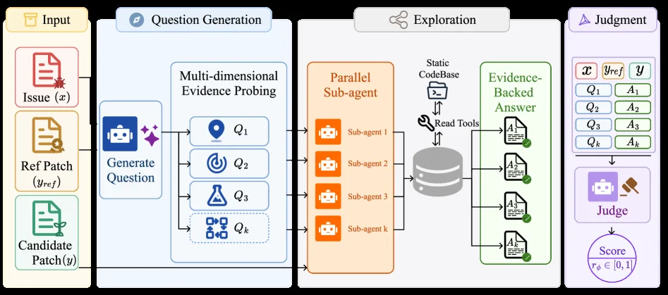
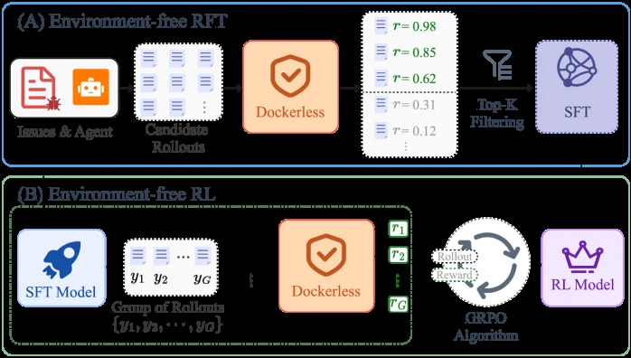
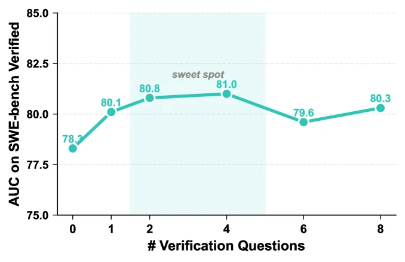

# Dockerless: Environment-Free Program Verifier for Coding Agents

[arXiv](https://arxiv.org/abs/2606.28436) · [HuggingFace](https://huggingface.co/papers/2606.28436) · ▲103

## Abstract (verbatim)

> Program verifiers play a central role in training coding agents, including selecting trajectories for supervised fine-tuning (SFT) and providing rewards for reinforcement learning (RL). Standard execution-based verification requires running unit tests inside per-repository environments such as Docker images, incurring substantial environment setup costs. We propose Dockerless, an environment-free agentic patch verifier that evaluates generated code patches without executing them. Rather than simply matching candidate patches to references, Dockerless judges patch correctness using evidence gathered through agentic repository exploration. On a verifier evaluation benchmark, Dockerless outperforms the strongest open-source verifier by 14.3 AUC points. Using Dockerless as both the SFT trajectory filter and the RL reward enables a fully environment-free post-training pipeline. The resulting model reaches 62.0%, 50.0%, and 35.2% resolve rate on SWE-bench Verified, Multilingual, and Pro, respectively. It surpasses the Qwen3.5-9B baseline by 2.4, 8.7, and 2.9 points, matching environment-based post-training.

## Background

### Background Analysis  

**1. Technical Context and Real-World Needs**  
Program verifiers are critical for training automated coding agents (e.g., AI models solving software engineering problems). Their role is to judge whether a code modification correctly resolves an issue, guiding the model’s learning (e.g., filtering high-quality training data or providing reinforcement learning rewards). Traditionally, verification requires executing test cases in isolated environments (e.g., Docker containers per repository), which is essential for real-world applications—whether open-source or enterprise codebases need to ensure AI-generated fixes work as intended.  

**2. Limitations of Previous Methods**  
Existing execution-based verification methods face significant challenges. First, environment setup is costly: each repository may require customized dependencies and test scripts, while many real-world scenarios (e.g., private or legacy systems) cannot provide reproducible environments. Second, shallow verification approaches (e.g., comparing code text differences) fail to understand deep code logic, leading to incorrect judgments for complex problems. Even advanced shared environment solutions (e.g., unified Docker images) become performance bottlenecks due to lack of targeted analysis. These limitations make training efficient coding agents expensive and difficult.  

**3. Proposed Solution**  
The paper introduces Dockerless, an environment-free program verifier. Its core idea is to let the verifier actively "explore" the codebase: by generating verification questions and dispatching sub-agents to collect contextual evidence (e.g., function call relationships or module dependencies), it ultimately judges the correctness of code modifications. This approach avoids runtime execution, instead leveraging the codebase’s inherent information for reasoning, thus solving environment dependency and shallow analysis issues.  

**4. Key Differences from Prior Work**  
Dockerless innovates by shifting verification from "passively matching text" to "actively exploring context." Unlike traditional Docker-dependent methods, it requires no runtime environment; compared to shallow approaches that only compare code differences, it uses multi-agent collaboration to deeply understand code logic. Experiments show this environment-agnostic verification is not only more efficient but also achieves performance comparable to execution-based methods on real tasks, providing a viable path for scaling coding agent training.

## Method, Figure by Figure

> Figure 2 : Architecture of Dockerless. The verifier takes the issue x x , reference patch y ref y_{\text{ref}} , and candidate patch y y , and proceeds in two stages. (1) Question generation and exploration: the verifier first generates K K verification questions and dispatches parallel sub-agents to collect evidence-backed answers from the codebase. (2) Judgment: the verifier conditions on the issue, the patches, and the collected ( Q k , A k ) (Q_{k},A_{k}) pairs to produce a binary verdict token, whose logits define the continuous score r ϕ ​ ( x , y ) r_{\phi}(x,y) .

This figure illustrates the overall architecture of Dockerless, an environment-free agentic patch verifier designed to assess the correctness of generated code patches without executing them. The process is divided into two main stages: Question Generation and Exploration, followed by Judgment.

Starting from the leftmost section, "Input":
*   There are three key inputs:
    1.  **Issue (x)**: This represents the problem or task description that needs to be solved, typically a programming problem or bug report.
    2.  **Ref Patch (y_ref)**: This is the reference patch, considered the correct solution.
    3.  **Candidate Patch (y)**: This is the patch generated by a coding agent that needs to be verified.

The first main stage is "Question Generation":
*   This stage takes the three inputs (Issue, Ref Patch, Candidate Patch).
*   The "Generate Question" module creates multiple verification questions based on the input patches and the issue. The figure shows example questions Q₁, Q₂, Q₃, ..., Qₖ, each with different icons, possibly representing different types of questions (e.g., Q₁ might be about location, Q₂ about functionality, Q₃ about logic).
*   This process is termed "Multi-dimensional Evidence Probing," meaning questions are asked from multiple angles to gather comprehensive evidence about the patch.

The second main stage is "Exploration":
*   This stage receives the multiple questions (Q₁, Q₂, ..., Qₖ) generated in the previous stage.
*   These questions are dispatched to multiple "Parallel Sub-agents" (Sub-agent 1 to Sub-agent k), which work concurrently for efficiency.
*   Each sub-agent accesses the "Static CodeBase" and uses "Read Tools" to gather information. They retrieve evidence related to the questions from the codebase and generate "Evidence-Backed Answers" (A₁, A₂, ..., Aₖ). Each answer has a green checkmark, indicating these answers are verified or supported by evidence.

The final stage is "Judgment":
*   The inputs to this stage include the original Issue (x), the Candidate Patch (y), and all the (Qₖ, Aₖ) pairs collected from the "Exploration" stage.
*   This information is fed into the "Judge" module. The judge determines whether the candidate patch is correct based on this evidence.
*   The result is a binary verdict token, whose logits define a continuous score r_φ(x,y), typically in the range [0,1], representing the probability or confidence that the candidate patch is correct.

In summary, Dockerless works as follows:
1.  It takes an issue, a reference patch, and a candidate patch as input.
2.  It generates multiple verification questions based on these inputs.
3.  Parallel sub-agents explore a static codebase to collect answers to these questions, which serve as evidence.
4.  A judge then evaluates this evidence, along with the original inputs, to produce a score indicating the correctness of the candidate patch.

The key innovation is that verification is done by gathering evidence through agent-based exploration of the codebase, rather than by executing the code, thus achieving environment-free verification. This allows the pipeline for training coding agents to be environment-free, reducing setup costs.

Arrows in the diagram indicate the flow of data and information, starting from the input, moving through question generation and exploration, and finally arriving at the judgment stage to output a score.

---

> Figure 3 : Training pipeline for Dockerless: teacher-generated question-answer-judge trajectories are rejection-sampled by matching the predicted verdict against the ground-truth, and used to fine-tune a base model.

This figure illustrates the training pipeline of Dockerless, which is divided into two main stages: **Data Generation** and **Rejection Sampling**, clearly presenting the entire process from candidate paths to the final filtered data:

### 1. Data Generation Stage (Left)
- **Candidate Paths**: This is the initial input, representing possible code patches or program execution paths, serving as the raw material for subsequent processing.
- **Tuple \((x, y_{\text{ref}}, y, r^*)\)**: After the candidate paths are processed, a tuple is generated. Among them:
  - \(x\) may be the input context (such as problem description, code repository information, etc.);
  - \(y_{\text{ref}}\) is the reference output (or expected output);
  - \(y\) is the generated output (such as the result of the code patch);
  - \(r^*\) is the true label (i.e., the "ground - truth verdict" of whether the patch is correct).
- **Teacher Model**: This tuple is input into the teacher model. The role of the teacher model is to generate **Question - Answer - Judge Trajectories \(\tau\)** (question - answer - judge trajectories) and **Verdict \(\hat{r}\)** (predicted verdict, that is, the model's judgment on whether the patch is correct). Simply put, the teacher model will simulate the process of "asking questions (about the patch), answering (the model's response to the question), and judging (the judgment on the correctness of the patch)" based on the input tuple, and at the same time output the prediction of the correctness of the patch.

### 2. Rejection Sampling Stage (Middle and Right)
- **Rejection Sampling**: The \(\hat{r}\) (predicted verdict) output by the teacher model will be compared with the real \(r^*\) (true verdict). Only when \(\hat{r}=r^*\) (that is, the prediction is correct) will the corresponding data be retained (the funnel in the figure with "Keep if \(\hat{r}=r^*\)" represents this filtering process).
- **Filtered Data \(\mathcal{D}_{\text{rej}}\)**: The retained data will form the filtered dataset, whose structure includes:
  - **Input Context \((x, y_{\text{ref}}, y)\)**: Input context, including information such as the problem, reference output, and generated output;
  - **Target Sequence \(z\)**: Target sequence (may be a specific sequence used for training);
  - **Trajectories \(\tau\) followed by \(r^*\)**: Question - answer - judge trajectories and the corresponding true verdicts.

### Method Operation Logic
The core of the entire process is **to generate trajectories and filter using the teacher model**: first, generate a tuple containing input, reference, generated result, and true verdict from the candidate paths, input it into the teacher model to obtain trajectories and predicted verdicts; then, through rejection sampling (only data where the predicted verdict is consistent with the true verdict is retained), high - quality filtered data is obtained. These filtered data can be used to fine - tune the base model (such as being used as the trajectory for supervised fine - tuning (SFT) or the reward signal for reinforcement learning (RL)), so as to realize the training of the environment - free code verifier.

### Data Flow Order
Candidate Paths → Generate tuple \((x, y_{\text{ref}}, y, r^*)\) → Input Teacher Model → Generate trajectory \(\tau\) and predicted verdict \(\hat{r}\) → Rejection Sampling (retain if \(\hat{r}=r^*\)) → Filtered Data \(\mathcal{D}_{\text{rej}}\).

This figure clearly shows how Dockerless screens out high - quality data from the original candidate paths by means of "teacher model + rejection sampling" for training the environment - free code verifier, avoiding the environmental setup cost of traditional execution - based verification.

---

> Figure 4 : Env-free post-training pipeline for Dockerless. (A) Environment-free RFT: candidate rollouts are scored by Dockerless, and the top- K K are kept to fine-tune the base model, yielding the SFT model. (B) Environment-free RL: starting from the SFT model, GRPO uses Dockerless as the per-rollout reward source, yielding the RL model.

This figure illustrates the environment - free post - training pipeline of Dockerless, which is divided into two main parts: (A) Environment - free Supervised Fine - Tuning (SFT, possibly a misnomer or specific term in the original as "RFT" is used) and (B) Environment - free Reinforcement Learning (RL).

First, let's look at part (A):
- The left - most module "Issues & Agent" represents programming tasks (or error reports) and the agent that generates code. This module outputs candidate code implementations ("Candidates Rollouts"), that is, multiple code attempts generated by the agent for the problem.
- Next is the "Dockerless" module, which is an environment - free program verifier. Its role is to score these candidate code implementations (different scores like r = 0.98, 0.85 are shown in the figure) without running unit tests or using environments like Docker. The scoring here is based on the evidence of the agent's exploration of the code repository to judge the correctness of the patch.
- Then there is the "Top - K Filtering" (represented by a funnel icon in the figure). It will select the top K candidates with the highest scores according to the scores given by Dockerless (the figure shows the scores after filtering, for example, scores like r = 0.98, 0.85, 0.62 are retained, while lower scores like r = 0.31, 0.12 are filtered out).
- Finally, these filtered candidates are used for "SFT" (Supervised Fine - Tuning) to obtain an SFT model. This process is environment - free because it does not require an actual code - running environment, and only the scoring of Dockerless is needed to select good candidates for fine - tuning.

Then, let's look at part (B):
- The left - most "SFT Model" is the supervised fine - tuned model obtained from part (A), which serves as the starting point for reinforcement learning.
- Next is the "Group of Rollouts {y₁, y₂, …, y_G}", where G is the number of rollouts, that is, a group of code implementations (rollouts) generated from the SFT model, each implementation is marked as y₁ to y_G.
- The middle "Dockerless" module plays a role again, providing rewards (scores r₁ to r_G are shown in the figure, and these rewards are given by Dockerless according to the correctness of the code and other evidence) for each rollout (y₁ to y_G).
- Then there is the "GRPO Algorithm" (a reinforcement learning algorithm, possibly a variant of Proximal Policy Optimization), which uses the rewards provided by Dockerless to optimize the model. The figure shows a loop of "Reward" and "Policy", indicating that the RL algorithm continuously adjusts the strategy (model) to maximize the reward.
- Finally, after training with GRPO, the "RL Model" is obtained. This model is environment - free because it uses Dockerless as the reward source and does not require an actual code - running environment.

The overall process is: first, screen candidate codes for SFT through the environment - free Dockerless to obtain the SFT model; then, use the SFT model as the basis and use the environment - free rewards provided by Dockerless for RL training to obtain the final RL model. This method avoids the high cost of using environments like Docker, and at the same time, evaluates the correctness of the code through the agent's exploration of the repository, thus achieving an environment - free post - training pipeline.

From the results (combined with the paper's abstract), the solution rates of the model trained with this environment - free pipeline on SWE - bench Verified, Multilingual, and Pro reached 62.0%, 50.0%, and 35.2% respectively, exceeding the Qwen3.5 - 9B baseline and matching the performance of environment - based post - training.

---

> Figure 5 : Verifier AUC vs. number of verification questions K K on SWE-bench Verified verifier evaluation benchmark.

This figure (Figure 5) illustrates the verifier's AUC (Area Under the Curve) performance on the SWE - bench Verified verifier evaluation benchmark as the number of verification questions (denoted as # Verification Questions, on the x - axis) varies.

First, look at the x - axis, which represents the number of verification questions K, ranging from 0 to 8. This represents the number of questions or queries posed during the code patch verification process. As K increases, we can observe how the verifier's performance changes.

The y - axis is the AUC value, with a range from 75.0 to 85.0, used to measure the verifier's performance. Generally, a higher AUC value indicates a stronger discrimination ability of the verifier, meaning it can more accurately distinguish between correct and incorrect code patches.

The curve in the figure shows the change in the AUC value as the number of verification questions K increases:
- When K = 0, the AUC value is 78.2.
- As K increases to 1, the AUC value rises to 80.1.
- When K = 2, the AUC value further increases to 80.8.
- When K = 4, the AUC value reaches a relatively high point of 81.0, and this region is marked as "sweet spot", indicating that at this number of verification questions, the verifier's performance is the best.
- As K continues to increase to 6, the AUC value drops to 79.6.
- Finally, when K = 8, the AUC value rebounds to 80.3.

From this figure, we can see that as the number of verification questions increases, the verifier's AUC value first rises, reaches a peak at K = 4, then decreases, and then slightly rebounds. This shows that there is an optimal number of verification questions (around K = 4), at which the verifier can achieve the best AUC performance. This method (Dockerless) optimizes the verifier's performance by adjusting the number of verification questions, thus effectively evaluating the correctness of code patches without relying on environments (such as Docker). In this way, Dockerless can achieve good verification results on the SWE - bench Verified benchmark, and then support subsequent model training (such as supervised fine - tuning SFT and reinforcement learning RL).

---

> Figure 8 : Frontier-model resolve rate (%) on SWE-bench Verified, Multilingual, and Pro under env-based and env-free settings. Solid bars are env-free; hatched extensions show the additional gain from per-repository environments, so the full bar height equals the env-based score.

This figure (Figure 8) displays the problem resolution rates (%) for frontier models on three subtasks of the SWE-bench benchmark (Verified, Multilingual, and Pro) under both environment-based and environment-free settings. We can understand this graph through the following components:

First, the Y-axis lists four different models: DS-V3.2, Kimi-K2.5, GLM-5, and GPT-5.4. The X-axis represents "Resolved (%)", which is the problem resolution rate, ranging from 0% to 80%.

Each horizontal bar in the graph represents a model's performance on a specific task. These bars are divided into several segments, each distinguished by different colors and patterns, corresponding to a category in the legend:
*   **Solid cyan bar (labeled "Verified" in the legend)**: This segment represents the proportion of problems successfully solved by the model under the **environment-free** setting, using the "Dockerless" method proposed in the paper (an environment-agnostic verifier that does not execute code). This is the primary, complete bar segment.
*   **Solid red bar (labeled "Multi." in the legend)**: This segment represents the proportion of problems solved in the "Multilingual" subtask under the **environment-free** setting.
*   **Solid yellow bar (labeled "Pro" in the legend)**: This segment represents the proportion of problems solved in the "Pro" subtask under the **environment-free** setting.
*   **Hatched light-green extension (labeled "w/o Env" in the legend)**: This is the hatched region appended to the end of the cyan "Verified" bar. It shows the additional resolution rate gain achievable with an **environment-based** setup (e.g., using Docker containers). Therefore, the total height of the entire bar (cyan part + hatched part) equals the model's resolution rate under the **environment-based** setting.

The flow and organization of data are as follows: For each model, we read its resolution rate from left to right. The cyan segment is the "Verified" resolution rate under the environment-free setup, while the red and yellow segments show the "Multilingual" and "Pro" subtask resolution rates, respectively, under the same environment-free setup. The hatched part then shows the increase in "Verified" task resolution rate when switching to an environment-based setup.

This figure reveals how the paper's method works and its advantages:
1.  **Environment-Free Verification**: The "Dockerless" method proposed in the paper can verify code patches without relying on traditional execution environments like Docker. The cyan, red, and yellow segments in the graph show the performance of this method on the three different subtasks.
2.  **Gain from Environment**: By comparing the cyan segment (environment-free) with the total height of the bar (environment-free + environment gain), we can see the additional resolution rate achieved with an environment-based setup for the "Verified" task. This indicates that while the "Dockerless" method is promising, traditional environment-based methods can still solve more problems in some cases.
3.  **Model Performance Comparison**: We can directly compare the performance of different models under the same conditions. For example, under the environment-free setup, GPT-5.4 achieves a 76.4% resolution rate on the "Verified" task, while DS-V3.2 achieves 72.6%. Similarly, we can compare their performance on the "Multilingual" and "Pro" subtasks.
4.  **Quantification of Environmental Gain**: The specific values of the hatched parts (e.g., for DS-V3.2, the gain is the length of the hatched part, which is approximately 58.3% - 48.0% = 10.3% for the "Verified" task) quantify the contribution of the environment to the resolution rate of the "Verified" task.

Conclusions that can be drawn from the figure include:
*   Under the environment-free setup, GPT-5.4 performs the best on the "Verified" task, achieving a 76.4% resolution rate.
*   For all models shown, the resolution rate for the "Verified" task increases when switching to an environment-based setup (as indicated by the hatched parts).
*   The figure effectively demonstrates the performance of the "Dockerless" method proposed in the paper and compares it with environment-based verification methods, highlighting the potential of the environment-free method and its gap or advantage compared to traditional methods.

In summary, this graph uses clear visual elements (different colored bars and a legend) to display the problem resolution rates of different models under different tasks and settings, allowing us to intuitively understand the effectiveness of the "Dockerless" method proposed in the paper and the impact of environmental setups on performance.
