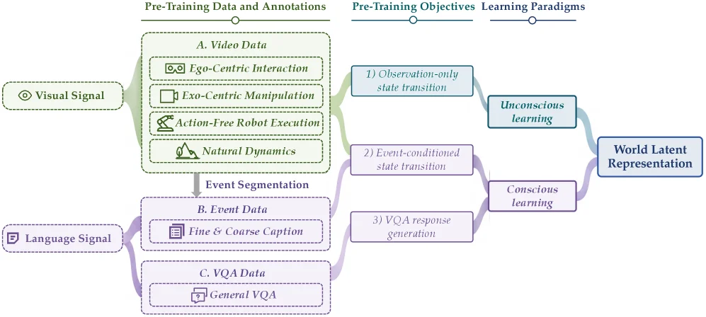

# Orca: The World is in Your Mind

[arXiv](https://arxiv.org/abs/2606.30534) · [HuggingFace](https://huggingface.co/papers/2606.30534) · ▲230

## Abstract (verbatim)

> We introduce Orca, an initial instantiation of a general world foundation model. Orca learns a unified world latent space from multimodal world signals and exposes it through multimodal readout interfaces. Rather than optimizing isolated next-token, next-frame, or next-action prediction, we are centered on Next-State-Prediction modeling, offering a unified state-transition modeling route toward understanding, predicting, and acting upon the world. Orca learns through two complementary paradigms: unconscious learning captures dense natural state transitions from continuous videos, and conscious learning models sparse meaningful state transitions by language-described events and VQA supervision. For pre-training, we construct a large-scale world-learning inventory data, including 125K hours of video data and 160M event annotations. After pre-training, Orca learns a unified world latent space. To examine whether the learned latent supports downstream, we evaluate it by three representative downstream readouts: text generation, image prediction, and embodied action generation. Orca's backbone is frozen, and only the lightweight modality-specific decoders are trainable. Experiments show the scalability of the proposed paradigm and verify that stronger world latent enables stronger downstream readouts. Orca outperforms similar-sized specialized baselines. These results show that Orca, as a general world foundation model, presents a promising approach to understanding, predicting, and acting upon the world. Finally, we discuss the current limitations, aiming to provide useful insights and inspiration for the community.

## Background

### Background Analysis  

#### 1. Technical Context and Real-world Needs  
Current AI applications are evolving from single-task systems (e.g., text generation or image recognition) to complex scenarios requiring interaction with the real world. For instance, robots need to combine visual observations and language instructions to perform actions, autonomous vehicles must integrate sensor data and environmental descriptions for decision-making, and virtual assistants require understanding user behavior and semantics for personalization. The core need here is to enable AI to **understand the world like humans do**—learning from multimodal signals (vision, language, actions, etc.) to predict future states and plan actions. However, existing methods often focus on specific tasks (e.g., next-token or next-frame prediction) without a unified model of the world.  

#### 2. Previous Limitations  
Traditional AI models (e.g., Next-Token-Prediction or Next-Frame-Prediction) suffer from:  
- **Fragmented Learning**: They optimize for single modalities or tasks (e.g., only text or images), failing to capture dependencies between different signals (e.g., how actions in a video relate to language instructions).  
- **Lack of Dynamic Modeling**: Most models rely on static or labeled data, struggling to learn natural state changes from continuous, unlabeled real-world data (e.g., long videos).  
- **Task-Oriented Rather Than World-Oriented**: Their goal is to complete tasks (e.g., generating images) rather than understanding the world itself, limiting their ability to generalize to unseen scenarios.  

These issues restrict performance in complex environments, such as robots failing in unexpected situations or assistants misunderstanding implicit user intent.  

#### 3. Orca’s Solution  
Orca addresses these problems with a **"world latent space"** concept:  
- **Unified Multimodal Learning**: It learns a shared latent representation from multimodal data (video, images, language) that encodes the world’s states (e.g., object positions, action consequences).  
- **Two Complementary Learning Paradigms**:  
  - **Unsupervised Learning**: Learns "natural state transitions" from continuous videos (e.g., predicting the next frame in a sequence of a person opening a door and picking up keys).  
  - **Supervised Learning**: Learns "meaningful state transitions" from language-described sparse events (e.g., "robot picks up a cup"), linking language logic to visual observations.  
- **Downstream Task Validation**: By freezing the main model and training only lightweight decoders (e.g., text generation, image prediction), it验证s the latent space’s generality. Experiments show that a stronger latent space improves downstream performance.  

#### 4. Key Differences from Prior Work  
Orca’s innovations include:  
- **From Task-Oriented to World-Oriented**: Unlike models optimized for single tasks (e.g., GPT-54 for text generation), Orca aims to model the world’s underlying rules, supporting multiple downstream tasks.  
- **Dual Paradigm Integration**: Combines unsupervised natural dynamics learning with supervised language-conditioned learning to capture both real-world continuity and human logic.  
- **Scalability Validation**: Large-scale data (125K hours of video + 160M event annotations) proves performance improves with data/model size, rather than task-specific optimization.  

In summary, Orca represents a step toward general world foundation models, using unified state-transition modeling to truly understand and interact with complex environments.

## Method, Figure by Figure

> Figure 1 : The Orca’s overall framework. Orca follows an Encoder-Decoder architecture. Given multimodal world signals, the Encoder learns a world latent through two complementary paradigms: unconscious learning and conscious learning . Unconscious learning captures dense natural state transitions, while conscious learning captures sparse meaningful state transitions. To prove that the learned latent is effective, the Encoder is frozen after pre-training, and only the lightweight modality-specific decoders are trainable separately. The Decoder reads out the latent into text, images, actions, and other modalities.

Here's a natural English translation while preserving all markdown structure:

# Understanding Orca's Architecture Diagram

This diagram illustrates the overall framework of the Orca model, which follows an **Encoder-Decoder** architecture. It clearly demonstrates the complete pipeline from multimodal world signal input to multimodal output (text, images, actions, etc.):

## Encoder Section:
- **Input**: The "Multimodal world signal" on the far left represents the starting point of the process, referring to various types of real-world data (like videos, language-described events, etc.).
- **Core Component: Orca**: The green "Orca" module is the encoder's centerpiece, responsible for learning a **unified World Latent Representation**. It achieves this through two complementary learning paradigms:
  - **Unconscious Learning** (dashed box): This captures **dense natural state transitions** - for example, learning continuous state changes from videos (like object movements, scene switches, and other naturally occurring dynamics).
  - **Conscious Learning** (dashed box): This focuses on **sparse meaningful state transitions** - such as learning from language-described events (like "the cat jumps on the table") or visual question answering (VQA) supervision to understand states with explicit semantics.
- **Output to Latent Representation**: After processing multimodal signals, Orca outputs the "World Latent Representation" - a unified abstract representation containing the state transition patterns learned from the input.

## Decoder Section:
- **Frozen Encoder**: According to the diagram note, after pretraining, the "Orca" backbone (core structure) is **frozen** (parameters no longer updated), ensuring stability of the learned world latent representation.
- **Lightweight Decoders**: Only the "lightweight modality-specific decoders" are trainable, responsible for "reading out" different modal outputs from the world latent representation:
  - **Text Path**: The "LM head" converts latent representations to text (for answering questions, generating descriptions, etc.); then the "Action expert" can further convert text to actions (if needed, like generating robot actions from text instructions).
  - **Image Path**: The "Image decoder" converts latent representations to images (like generating images corresponding to latent states or predicting next frames).
  - **Other Modalities**: The "Other modal decoder" can extend to more modalities (like audio, tactile, etc.), producing "More outputs" and demonstrating the model's multimodal generalization capability.

## Data Flow Sequence:
1. Multimodal world signals enter Orca (encoder)
2. Orca learns the world latent representation through unconscious and conscious learning
3. After pretraining, the encoder is frozen and the latent representation is passed to decoders
4. Different decoder modules (LM head, image decoder, action expert, etc.) convert the latent representation to various modal outputs (text, images, actions) to complete downstream tasks (like text generation, image prediction, embodied action generation)

## Methodology Logic:
Orca aims to learn a unified "world latent space" that captures real-world state transition patterns. By using **unconscious learning** for continuous, dense natural state transitions (like video dynamics) and **conscious learning** for sparse, semantic state transitions (like language events), Orca develops a comprehensive understanding of how the world works. The design of freezing the encoder after pretraining while only training lightweight decoders ensures both stability of the latent representation and flexibility for different downstream tasks (text, images, actions, etc.). The effectiveness of the learned world latent space is validated by evaluating downstream task performance (like text generation quality, image prediction accuracy, action generation reasonableness) - experiments show that a more powerful world latent space leads to better downstream task performance, with Orca outperforming similar-sized specialized baseline models.

This diagram clearly shows Orca's complete pipeline from "understanding the world (encoder learning latent representations)" to "acting upon the world (decoder generating multimodal outputs)", reflecting its design philosophy as a "general world foundation model": supporting excellent performance across multiple downstream tasks through a unified world latent space.

---

> Figure 2 : Overview of Encoder. Orca learns a world latent representation through two learning paradigms. Unconscious learning uses video data to capture dense and natural state transitions. Conscious learning uses language instructions as explicit semantic conditions to capture sparse and meaningful state transitions.

This figure illustrates the overall architecture of Orca for learning a unified world latent representation, core to its role as a general world foundation model. Here’s a detailed breakdown:

### Input and Overall Flow
- **Left Input**: Two signal sources: `Visual Signal` (eye icon) and `Language Signal` (document icon). These provide visual and linguistic information about the world to Orca.
- **Middle Modules**: Two dashed boxes: `Unconscious learning` and `Conscious learning`, each with subtasks (state transition or response generation). All learning outputs flow to the rightmost `World Latent Representation` (the unified world representation learned by Orca).

### 1. Unconscious Learning
- **Subtask**: `Observation-only state transition` (predicting the next state from current observations).
- **Components & Flow**:
  - Input: `v_t` (visual signal at time \( t \), eye icon) and latent variable \( z \) (dashed arrow, representing prior/hidden state).
  - Model: `Orca` (green box, core model).
  - Output: \( \hat{v}_{t+1}^l \) (predicted visual signal at time \( t+1 \), eye icon).
- **Logic**: Unconscious learning captures **dense, natural state transitions** (e.g., frame-by-frame changes in videos) from continuous video data. It predicts the next visual state (\( \hat{v}_{t+1}^l \)) using the current visual observation (\( v_t \)) and latent \( z \), simulating how humans unconsciously perceive and predict continuous world changes.

### 2. Conscious Learning
Conscious learning has two subtasks, capturing **sparse but meaningful state transitions** (e.g., state changes described by language or answering questions) using linguistic semantics and VQA supervision:

#### Subtask 2: Event-conditioned State Transition
- **Input**:
  - \( v_t \) (visual signal at \( t \), eye icon).
  - \( e_{t+\Delta} \) (event signal at \( t+\Delta \), document icon, e.g., "the ball is thrown").
  - Latent variable \( z \) (dashed arrow).
- **Model**: `Orca` (green box).
- **Output**: \( \hat{v}_{t+\Delta}^l \) (predicted visual signal at \( t+\Delta \), eye icon).
- **Logic**: Uses **language-described events** (\( e_{t+\Delta} \)) as conditions to predict the visual state at a future time \( t+\Delta \), simulating human ability to consciously predict world changes from linguistic instructions (e.g., predicting a ball’s position from "throw the ball").

#### Subtask 3: VQA Response Generation
- **Input**:
  - \( V \) (visual input, eye icon, e.g., an image related to a question).
  - \( \ell_q \) (language question, document icon, e.g., "Where is the ball?").
  - Latent variable \( z \) (dashed arrow).
- **Model**: `Orca` (green box).
- **Output**: \( \ell_a \) (language answer, document icon, e.g., "The ball is on the table").
- **Logic**: Generates language answers to visual questions, simulating human visual-linguistic reasoning (VQA) to understand and output world states.

### Overall Mechanism
Orca learns a **unified world latent space** via two complementary paradigms:
- *Unconscious learning*: Learns **dense, continuous state transitions** from videos (capturing the world’s basic dynamics).
- *Conscious learning*: Learns **sparse, semantic state transitions** from language-described events (event-conditioned state transition) and VQA (response generation).

All tasks focus on **Next-State-Prediction** (predicting the next state, visual or linguistic) rather than isolated token/frame prediction. The learned latent representation supports downstream tasks (e.g., text generation, image prediction, embodied action generation), with the goal of enabling the model to *understand, predict, and act on the world*.

### Method Core
Orca’s innovation lies in learning a unified world latent space from multimodal signals (vision, language) using two complementary paradigms: unconscious (dense, continuous) and conscious (sparse, semantic) learning. This approach avoids optimizing isolated predictions (e.g., next-token, next-frame) and instead uses **Next-State-Prediction** to model the world. Experiments validate that a stronger world latent space improves downstream task performance, making Orca a promising general world foundation model.

---

> Figure 3 : Overview of pre-training data. Orca’s pre-training data includes video, event, and VQA data. A. Video Data supports 1) Observation-only state transition , A. Video Data and B. Event Data support 2) Event-conditioned state transition , and C. VQA Data supports 3) VQA response generation .

This figure is an overview of Orca's pre - training data from the paper "Orca: The World is in Your Mind", showing the composition of Orca's pre - training data, the flow of data, and the relationship between different data types, pre - training objectives, and learning paradigms, which helps to understand the pre - training mechanism of the Orca model:

### Data Sources and Types
- **Visual Signal** is the starting input of the data, and it is divided into two types of data:
    - **Video Data (A. Video Data)**: It contains four types, namely "Ego - Centric Interaction", "Exo - Centric Manipulation", "Action - Free Robot Execution", and "Natural Dynamics". After these video data are processed by "Event Segmentation", they will flow to the subsequent event data and VQA data - related processes. At the same time, they directly support the pre - training objective of "1) Observation - only state transition".
    - **Language Signal** is another type of input. Combined with the results after the video data are segmented by events, two types of data are generated:
        - **Event Data (B. Event Data)**: It contains "Fine & Coarse Caption". Together with the video data, it supports the pre - training objective of "2) Event - conditioned state transition".
        - **VQA Data (C. VQA Data)**: It contains "General VQA" and supports the pre - training objective of "3) VQA response generation".

### Pre - training Objectives
Orca has three pre - training objectives, which correspond to different data and learning paradigms respectively:
- **1) Observation - only state transition**: It is only supported by video data (A. Video Data) and belongs to the "Unconscious learning" paradigm. This learning paradigm captures dense natural state transitions in continuous videos. It does not require language - based supervision and directly learns the changes of states from visual information in videos.
- **2) Event - conditioned state transition**: It is jointly supported by video data (A. Video Data) and event data (B. Event Data) and belongs to the "Conscious learning" paradigm. The state transition here is carried out under the condition of an event (described by language). Comb with the visual event segmentation results and language event descriptions, it learns conditional state changes.
- **3) VQA response generation**: It is supported by VQA data (C. VQA Data) and also belongs to the "Conscious learning" paradigm. Through the supervision of visual question answering, it learns how to generate responses according to visual and language information, and further models state - related knowledge.

### Learning Paradigms and World Latent Representation
- **Unconscious learning**: Based on the pre - training objective of "Observation - only state transition", it learns dense natural state transitions from video data. This is a learning method without language supervision, mainly capturing the basic dynamics of the world.
- **Conscious learning**: Based on the pre - training objectives of "Event - conditioned state transition" and "VQA response generation", it combines event data (events described by language) and VQA data to learn meaningful state transitions and response generation guided by language. This method uses language to enrich the understanding of the world.
- These two learning paradigms ultimately converge to the "World Latent Representation". That is, Orca learns a unified world latent space through these two complementary learning paradigms, and this latent space can support downstream tasks (such as text generation, image prediction, embodied action generation, etc.).

### Data Flow Order
1. The visual signal is input into the video data (A. Video Data). After the video data are segmented by events, part of them is used to support "Observation - only state transition" (unconscious learning), and the other part is combined with the language signal to generate event data (B. Event Data) and VQA data (C. VQA Data).
2. Event data (B. Event Data) and video data (A. Video Data) jointly support "Event - conditioned state transition" (conscious learning); VQA data (C. VQA Data) supports "VQA response generation" (conscious learning).
3. The learning results of the two paradigms of unconscious learning and conscious learning ultimately converge to the world latent representation, providing support for downstream tasks.

This figure clearly shows how the Orca model builds a world latent representation through multi - modal data (video, event, VQA data), different pre - training objectives, and two complementary learning paradigms (unconscious and conscious learning), so as to realize the basic ability to understand, predict, and act on the world.

---

> Figure A1 : Conceptual illustration of Orca . Existing models are often organized around passive task-driven prediction, including next-token, next-frame, and next-action prediction. Orca shifts the modeling target toward next-state prediction, where multimodal world signals are used to learn a unified world latent. Unconscious learning captures dense natural dynamics from continuous observation, while conscious learning captures meaningful state transitions guided by language, events, and intentions. The learned world latent supports downstream readouts to language, vision, and action.

This figure is a conceptual illustration from the paper "Orca: The World is in Your Mind," designed to visually explain the core ideas and operational mechanism of the Orca model. We can break down the various components step-by-step from left to right and top to bottom:

First, the horizontal axis at the top of the image illustrates a paradigm shift from "Passive Task Driven" on the left to "Active World Learner" on the right. This axis represents the evolution of the model's learning approach.

In the "Passive Task Driven" section, several traditional prediction tasks are listed from left to right:
1.  **Next Token Prediction (Semantic Understanding)**: This is a fundamental predictive task, often associated with language processing, such as predicting the next word or token in a sequence, representing semantic understanding.
2.  **Next Frame Prediction (Visual Dynamics Prediction)**: This is a task in computer vision, predicting the next frame in a sequence of images, focusing on visual dynamics.
3.  **Next Action Prediction (Action Affordance Reasoning)**: This is a task in decision-making or robotics, predicting the next action to be taken, involving reasoning about action possibilities.
These tasks are "passive" because they are typically aimed at specific, isolated prediction targets.

An arrow then points to "Next State Prediction (World Modeling)," which represents the core innovation of the Orca model. Instead of being limited to single-type predictions, it focuses on predicting the "next state," which involves unified modeling of the entire world (World Modeling). This shift is from a series of isolated task predictions to a more unified and comprehensive understanding of the world's state.

The lower part of the image shows Orca's learning process through two main pathways:
1.  **Unconscious learning**: This pathway is labeled by the text "Unconscious learning" at the top and the example "Natural physical laws (e.g. Wind blows leaves fall)" (natural physical laws, such as wind blowing leaves to fall). It corresponds to capturing dense natural dynamics from continuous video data. In the image, this is represented by a series of consecutive, gradually changing room scenes, starting from a baby (labeled "A World Learner"). The baby learns the world's natural laws by observing a sequence of video frames (represented by a filmstrip). These video frames show continuous changes in the scene, and the baby learns from observing these changes.
2.  **Conscious learning**: This pathway is labeled by the text "Conscious learning" at the bottom and the example "Meaningful causal events (e.g. Ice cream melts when heated)" (meaningful causal events, such as ice cream melting when heated). It models sparse but meaningful state transitions guided by language-described events and Visual Question Answering (VQA) supervision. In the image, this is represented by a highlighted figure (possibly representing a thinker or learner) and a specific scene (e.g., a person in a room, possibly with some event occurring). This pathway focuses on purposeful and causally related learning guided by language and intention.

These two learning pathways jointly act on "A World Learner," ultimately aiming to learn a "unified world latent space." This latent space is the internal representation of the world within the Orca model.

On the left side of the image, the traditional model organization, centered around passive task-driven prediction, is shown. Orca, however, shifts the modeling target towards "next-state prediction," utilizing multimodal world signals to learn this unified latent space.

In summary, this figure reveals how the Orca method operates:
*   **Paradigm Shift**: From isolated passive task prediction (e.g., next word, next frame, next action) to unified active world state prediction.
*   **Dual-track Learning**:
    *   **Unconscious Learning**: Learning natural, dense dynamics from continuous videos.
    *   **Conscious Learning**: Learning meaningful, sparse causal relationships from language-described events and VQA.
*   **Unified Representation**: Through these two learning methods, Orca constructs a unified world latent space that supports downstream tasks such as language generation, image prediction, and action generation.

The flow of information in the image is: starting from traditional passive task-driven prediction, gradually evolving to Orca's core—next-state prediction, then building a unified world latent space through the two complementary paradigms of unconscious and conscious learning, ultimately supporting various downstream applications.
