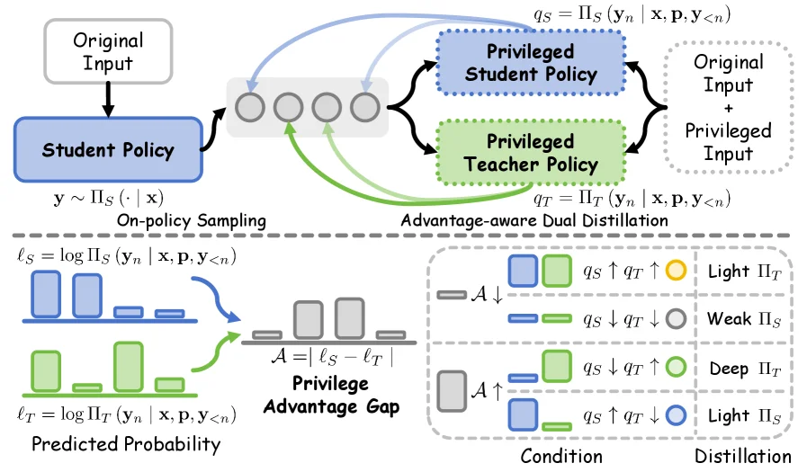
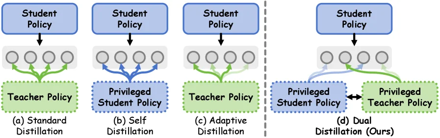
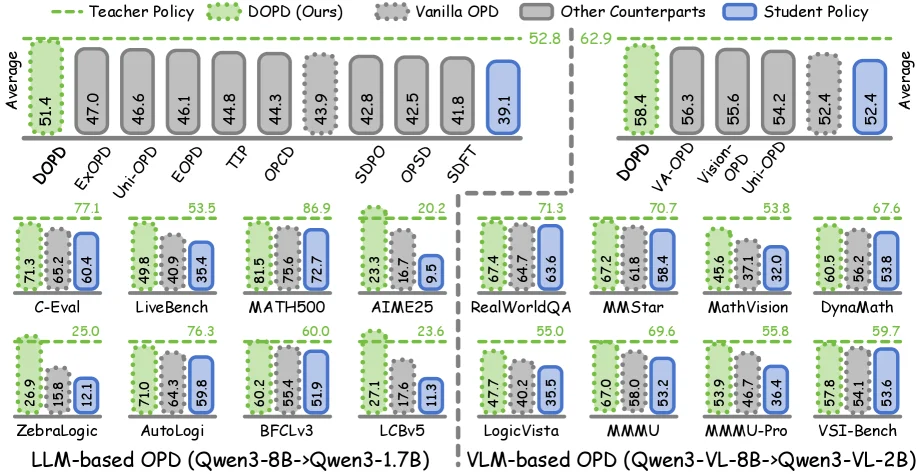

# DOPD: Dual On-policy Distillation

[arXiv](https://arxiv.org/abs/2606.30626) · [HuggingFace](https://huggingface.co/papers/2606.30626) · ▲93

## 摘要（原文）

> On-policy distillation (OPD) offers superior capacity transfer by supervising student-sampled trajectories with dense token-level signals. To furnish high-quality supervision sources and thereby elevate the performance frontier of distillation, an intuitive direction is to infuse privileged information to either teacher or student itself. However, this additional input induces a potential failure mode we dub privilege illusion: a pattern that conflates the transferable capability gap that students are meant to close, and the information asymmetry gap that can only be mimicked but never replicated. This issue is further amplified by the inherent non-uniformity of token-level supervision, where only a small subset of tokens carries pivotal capability-bearing signals. To this end, we propose DOPD, an advantage-aware dual distillation paradigm that dynamically routes token-level supervision between privileged teacher and privileged student policies based on their advantage gap and relative probabilities. Each token receives supervision of different strength, objective, and strategy from either teacher or student itself, which transfers credible capability while simultaneously receiving auxiliary signals, to alleviate privilege illusion. Extensive experiments on both large language model (LLM) and vision-language model (VLM) settings demonstrate that DOPD consistently outperforms Vanilla OPD and other counterparts. Further results on stability, robustness, continual learning, and out-of-distribution tasks validate its superiority.

## 摘要（中译）

On - policy distillation (OPD) 通过使用密集的 token - 级信号监督学生采样的轨迹来提供卓越的能力转移。为了提供高质量的监督源并从而提升蒸馏的性能前沿，一个直观的方向是向教师或学生本身注入特权信息。然而，这种额外的输入会引发一种我们称之为特权幻觉的潜在故障模式：一种混淆学生应该缩小的可转移能力差距和只能模仿而无法复制的信息不对称差距的模式。这个问题进一步被 token - 级监督的固有不均匀性放大，在这种监督中，只有一小部分 token 携带关键的能力承载信号。为此，我们提出了 DOPD，一种基于它们的优势差距和相对概率在特权教师和特权学生策略之间动态路由 token - 级监督的优势感知双蒸馏范式。每个 token 从教师或学生本身接收不同强度、目标和策略的监督，这既传递了可信的能力，同时又接收辅助信号，以缓解特权幻觉。在大型语言模型 (LLM) 和视觉 - 语言模型 (VLM) 设置上的大量实验表明，DOPD 始终优于 Vanilla OPD 和其他对应方法。在稳定性、鲁棒性、持续学习和分布外任务上的进一步结果验证了它的优越性。

## 背景剖析

要理解这项研究，首先需要明确**技术背景**：模型蒸馏（distillation）是让“学生模型”学习“教师模型”能力的核心技术，广泛用于大模型（LLM）和视觉-语言模型（VLM）的优化。传统方法依赖“离线轨迹”（off-policy），但学生模型的行为分布可能与教师模型脱节。因此，近年兴起的“在线策略蒸馏”（OPD）通过让学生模型自己生成轨迹，并用教师的逐词监督信号指导学习，既解决了分布不匹配问题，又提升了效率。然而，OPD的性能上限受限于监督信号的质量——当引入“特权信息”（如LLM的推理提示或VLM的结构化注释）时，虽然能暂时提高教师模型的表现，但这些信息可能包含“不可学习的优势”（即“特权幻觉”），导致学生模型模仿的是信息不对称带来的表面优势，而非真正可迁移的能力。

**先前的问题**在于：现有OPD方法对所有token采用统一的监督策略，忽略了token间的价值差异。例如，某些token可能承载关键能力信号（如逻辑推理步骤），而其他token可能只是噪声。当特权信息被混入时，这种均匀监督会让学生模型偏向学习容易拟合的“特权快捷方式”，而非真正的核心能力。这会导致性能波动、探索能力下降，甚至训练不稳定。

**本文的解法**是提出“双在线策略蒸馏”（DOPD）。其核心思路是**动态区分token的监督来源**：对于教师模型确实在能力上有优势的token，使用更强的教师监督来传递高价值信号；而对于那些可能受特权信息主导或与核心能力无关的token，则采用更轻量的监督（甚至学生自监督）以避免过拟合。DOPD通过“优势差距”（教师与学生的能力差）和“预测概率”动态调整每个token的监督强度、目标和策略，从而减少“特权幻觉”。

**关键差异**在于：与Vanilla OPD不同，DOPD不再假设所有token对能力转移的贡献相同，而是**针对性地分配监督资源**。它结合了教师监督（传递特权信息中的可迁移能力）和学生自监督（保持稳定性与探索性），通过动态路由机制平衡两者。这种方法不仅提升了性能（在LLM和VLM任务中显著超过Vanilla OPD），还增强了模型的鲁棒性、持续学习能力和分布外泛化能力。其创新点在于将“特权信息”的利用从“盲目模仿”转向“选择性吸收”，从而解决了传统OPD的核心缺陷。

## 方法图解

> Figure 5 : Overview of our proposed DOPD.

这张图展示了DOPD（Dual On - policy Distillation）方法的整体架构，我们可以将其分为几个关键部分来理解：

### 输入与策略采样阶段
- **Original Input（原始输入）**：首先，原始输入被送入`Student Policy（学生策略）`模块。学生策略会根据原始输入生成输出序列\( y \sim \Pi_S(\cdot | x) \)，这里的\( \Pi_S \)表示学生策略的概率分布，这个过程是**On - policy Sampling（在策略采样）**，即采样是基于当前学生策略本身进行的。

### 特权策略与蒸馏阶段（Advantage - aware Dual Distillation）
- **Privileged Student Policy（特权学生策略）**和**Privileged Teacher Policy（特权教师策略）**：这两个策略的输入是“Original Input + Privileged Input（原始输入+特权输入）”。它们分别计算自己的条件概率\( q_S = \Pi_S(y_n | x, p, y_{<n}) \)和\( q_T = \Pi_T(y_n | x, p, y_{<n}) \)，其中\( y_n \)是第\( n \)个token，\( x \)是输入，\( p \)可能是特权信息，\( y_{<n} \)是之前的token序列。
- **信息流动**：从学生策略输出的\( y \)会反馈到特权学生策略和学生策略内部的循环（图中的灰色圆圈部分，可能表示策略的更新或状态保持），同时特权学生策略和特权教师策略之间也有信息交互（黑色箭头），而学生策略的输出也会流向这两个特权策略（蓝色和绿色箭头）。这个阶段的核心是**Advantage - aware Dual Distillation（基于优势感知的双蒸馏）**，即同时利用学生和教师的特权策略进行蒸馏，并且考虑它们的“优势”（advantage）。

### 优势差距与预测概率（Privilege Advantage Gap & Predicted Probability）
- **Predicted Probability（预测概率）**：图中下方的两个直方图分别表示学生策略（蓝色）和教师策略（绿色）的预测概率\( \ell_S = \log \Pi_S(y_n | x, p, y_{<n}) \)和\( \ell_T = \log \Pi_T(y_n | x, p, y_{<n}) \)。这里的对数概率可以理解为对每个token的预测置信度。
- **Privilege Advantage Gap（特权优势差距）**：用\( \mathcal{A} = |\ell_S - \ell_T| \)来计算优势和差距，即学生和教师的预测概率的对数差值的绝对值。这个差距\( \mathcal{A} \)会被用来动态决定蒸馏的方式。

### 蒸馏条件与策略（Condition & Distillation）
- **条件分类**：根据\( \mathcal{A} \)的变化（上升或下降）以及\( q_S \)和\( q_T \)的变化（上升或下降），将情况分为四类：
    - 当\( \mathcal{A} \)下降，且\( q_S \)上升、\( q_T \)上升时（标记为“Light \( \Pi_T \)”），采用对应的蒸馏策略（黄色圆圈）。
    - 当\( \mathcal{A} \)下降，且\( q_S \)下降、\( q_T \)下降时（标记为“Weak \( \Pi_S \)”），采用灰色圆圈的策略。
    - 当\( \mathcal{A} \)上升，且\( q_S \)下降、\( q_T \)上升时（标记为“Deep \( \Pi_T \)”），采用绿色圆圈的策略。
    - 当\( \mathcal{A} \)上升，且\( q_S \)上升、\( q_T \)下降时（标记为“Light \( \Pi_S \)”），采用蓝色圆圈的策略。
- **动态路由蒸馏**：每一個token会根据其与教师和学生策略的优势差距以及相对概率，接收不同强度、目标和策略的监督。这样做的目的是转移可信的能力，同时接收辅助信号，以缓解“privilege illusion（特权幻觉）”问题，即避免混淆学生需要缩小的可转移能力差距和只能模仿但无法复制的信息不对称差距。

### 方法运作流程总结
1. 原始输入进入学生策略，学生策略在策略采样下生成输出序列。
2. 该输出序列反馈到学生策略内部，并作为输入（加上特权输入）送入特权学生策略和特权教师策略。
3. 特权学生策略和特权教师策略分别计算自己的条件概率，并基于这些概率计算预测概率和优势差距。
4. 根据优势差距和概率的变化情况，将token分类到不同的蒸馏条件中，然后采用对应的蒸馏策略，动态地从特权教师或特权学生策略（或自身）获取监督信号，以实现能力的转移并缓解特权幻觉问题。

通过这种方式，DOPD能够在不同的token上应用不同强度和策略的监督，从而更有效地进行蒸馏，提升模型性能。

---

> Figure 2 : Comparison of existing (a) standard distillation, (b) self distillation, and (c) adaptive distillation paradigms with our proposed (d) dual distillation paradigm.

这张图（图2）清晰地比较了现有的几种知识蒸馏范式与我们提出的双蒸馏范式（Dual On-policy Distillation, DOPD）。让我们逐一分析每个子图：

(a) 标准蒸馏 (Standard Distillation)：
这个子图展示了最基础的蒸馏范式。顶部的“Student Policy”（学生策略）模块代表了正在学习的学生模型。从学生策略向下指向一排四个圆圈，这通常表示学生模型生成的一系列输出或状态（例如，在强化学习中可能是动作或观察，在语言模型中可能是token序列）。然后，从这四个圆圈出发，有绿色的箭头指向下方的“Teacher Policy”（教师策略）模块。这表明在标准蒸馏中，监督信号主要来自教师策略，学生策略的输出被用来与教师策略的输出进行比较，从而学习模仿教师的行为。信息流动方向主要是从学生到教师，或者说学生试图匹配教师的输出。

(b) 自蒸馏 (Self Distillation)：
这个子图展示了自蒸馏的范式。“Student Policy”模块仍然存在，但其下方的四个圆圈现在接收来自一个名为“Privileged Student Policy”（特权学生策略）模块的蓝色箭头。这意味着在自蒸馏中，学生模型的一部分（特权学生策略）充当了监督者的角色，为学生模型的另一部分提供监督信号。这里的“特权”可能意味着该部分拥有更多的信息或更强的能力。信息流动方向主要是从特权学生策略到普通学生策略，学生模型内部进行知识的传递和学习。

(c) 自适应蒸馏 (Adaptive Distillation)：
这个子图结合了前两种范式的特点。“Student Policy”模块的输出（四个圆圈）同时接收来自“Teacher Policy”的绿色箭头和“Privileged Student Policy”的浅绿色箭头。这表明在自适应蒸馏中，学生策略的监督信号来源是动态的，可能根据某种准则在教师策略和特权学生策略之间进行选择或加权。绿色箭头可能代表主要的监督信号，而浅绿色箭头可能代表辅助或补充的信号。信息流动是混合的，既有来自教师的，也有来自特权学生策略的。

(d) 双蒸馏 (Dual Distillation, 我们的方法)：
这个子图展示了我们提出的DOPD范式，这是图的核心。顶部的“Student Policy”模块的输出（四个圆圈）现在同时与两个模块交互：左边的“Privileged Student Policy”和右边的“Privileged Teacher Policy”。关键的区别在于箭头的双向性和颜色。
*   从“Student Policy”的输出到“Privileged Student Policy”有蓝色的箭头，表示学生策略向特权学生策略提供信息或接受其监督。
*   从“Privileged Teacher Policy”到“Student Policy”的输出有绿色的箭头，表示特权教师策略向学生策略提供监督信号。
*   最重要的是，存在一个从“Privileged Student Policy”到“Privileged Teacher Policy”的双向箭头（或交互连接），这表明这两个“特权”模块之间存在信息交换或相互影响。这种设计允许模型根据它们的“优势差距”（advantage gap）和“相对概率”（relative probabilities）动态地路由监督信号。
这种方法的核心思想是，不同的token（或状态）可能需要不同类型或强度的监督。通过动态地将监督任务分配给特权学生策略或特权教师策略，DOPD旨在更有效地转移可信的能力，同时避免“特权幻觉”（privilege illusion）问题，即学生试图模仿教师独有的、但无法真正学习的特权信息。

总结来说，这张图揭示了DOPD方法的具体运作方式：
1.  **多源监督**：学生策略的监督信号可以来自教师策略、特权学生策略，或者两者结合。
2.  **动态路由**：监督信号的来源不是固定的，而是根据某种准则（如优势差距和相对概率）动态选择的。
3.  **特权模块交互**：在DOPD中，特权学生策略和特权教师策略之间存在交互，这使得监督策略更加灵活和适应性更强。
4.  **差异化处理**：每个token（或状态）可以接收到不同强度、目标和策略的监督，从而更有效地学习所需的能力。

通过这种设计，DOPD旨在解决现有方法中可能存在的特权幻觉问题，并提高蒸馏性能。

---

> (a) Performance Gain vs. Teacher-student Size Ratio (b) Gap Reduction vs. Teacher-student Size Ratio Figure 6 : Scalability comparison of proposed DOPD and Vanilla OPD on (a) performance gain and (b) teacher-student gap reduction ratio. Here, the solid and dashed lines represent the 0.6B and 1.7B student policy, respectively.

这张图（图6a）展示了所提出的DOPD方法与Vanilla OPD方法在不同“教师-学生模型大小比率”下的“性能增益”对比。

首先，我们来理解图的各个组成部分：
- **横轴（X轴）**：标记为“Size Ratio”，表示教师模型与学生模型的大小比例。从图中可以看到，这个比例从左到右逐渐增加，大致可以观察到几个关键点，比如4B教师对1.7B学生（比率约为2.35），1.7B教师对0.6B学生（比率约为2.83），8B教师对1.7B学生（比率约为4.71），4B教师对0.6B学生（比率约为6.67），以及8B教师对0.6B学生（比率约为13.33）。这些具体的数值通过图中的箭头和标签（如“4B ↓ 1.7B”、“8B ↓ 0.6B”等）来指示。
- **纵轴（Y轴）**：标记为“Performance Gain”，表示模型通过蒸馏过程获得的性能提升。数值从下往上递增，范围大约从0到15以上。
- **数据系列**：图中有两条主要的数据系列，分别用不同颜色和标记表示：
    - 灰色圆点和虚线代表“Vanilla OPD”（即原始的On-policy Distillation方法）。
    - 绿色圆点和实线代表“DOPD (Ours)”（即论文中提出的方法）。
- **数据点和标注**：每个数据点都有一个数值标注，表示在该特定“Size Ratio”下的性能增益值。例如，在“4B ↓ 1.7B”的情况下，Vanilla OPD的性能增益约为+4.9，而DOPD的性能增益约为+11.1。随着“Size Ratio”的增加，我们可以看到不同方法在不同教师-学生大小组合下的性能表现。

接下来，我们分析这张图揭示的方法运作方式和结果：
- **方法运作方式**：DOPD是一种“优势感知的双蒸馏范式”，它根据教师和学生策略的“优势差距”以及“相对概率”，动态地在“有特权的教师策略”和“有特权的学生策略”之间分配“token级别的监督”。这意味着，对于每个token，它会从教师或学生本身接收不同强度、目标和策略的监督，从而在转移可信能力的同时接收辅助信号，以缓解所谓的“特权幻觉”问题（即混淆学生需要弥补的可转移能力差距和只能模仿但无法复制的信息不对称差距）。
- **结果分析**：
    - **性能增益对比**：从图中可以明显看出，DOPD在所有展示的“Size Ratio”下都显著优于Vanilla OPD。例如，在“4B ↓ 1.7B”的情况下，DOPD的性能增益（+11.1）远高于Vanilla OPD（+4.9）；在“8B ↓ 0.6B”的情况下，DOPD的性能增益（+14.1）也远高于Vanilla OPD（+3.5）。
    - **趋势分析**：随着“Size Ratio”的增加，DOPD的性能增益呈现出上升的趋势（从+11.1增加到+14.1），而Vanilla OPD的性能增益则呈现出下降的趋势（从+4.9下降到+3.5）。这表明DOPD在处理不同大小的教师和学生模型时，能够更好地利用蒸馏过程来提升性能，尤其是在教师模型较大而学生模型较小的情况下，DOPD的优势更加明显。
    - **对比对象**：图中的对比对象是Vanilla OPD和DOPD两种方法。通过对比它们在不同“Size Ratio”下的性能增益，我们可以清楚地看到DOPD在性能提升方面的优势。

总结来说，这张图通过展示不同“教师-学生模型大小比率”下的“性能增益”，清楚地表明了所提出的DOPD方法在性能提升方面显著优于Vanilla OPD方法。DOPD通过动态分配token级别的监督，有效地缓解了特权幻觉问题，从而在不同大小的教师和学生模型组合下都能获得更高的性能增益。

---

> Figure 1 : Performance comparison of our DOPD with competing approaches across eight benchmarks in terms of average across all benchmarks (upper bigger bars) and individual values of each benchmark (lower small bars).

这张图来自论文《DOPD: Dual On-policy Distillation》，展示了作者提出的DOPD方法与现有竞争方法在不同基准测试上的性能比较。我们可以从以下几个方面来理解这张图：

首先，图的**整体结构**分为上下两部分。上半部分是“平均性能”（Average），显示了各个方法在所有基准测试上的平均得分，用较大的绿色条形表示。下半部分是“各个基准的个体值”（individual values of each benchmark），用较小的条形表示，这些基准被分为两大类：基于大型语言模型（LLM-based OPD）和基于视觉-语言模型（VLM-based OPD）。

**坐标轴和数据标签**：
- 纵轴（Y轴）列出了不同的方法名称（如DOPD, EX-OPD, Uni-OPD等）和具体的基准测试名称（如C-Eval, LiveBench, MATH500等）。
- 横轴（X轴）代表性能得分，数值标注在每个条形的末端或上方。
- 不同颜色的条形代表不同的实体：
    * **绿色虚线条形**：代表“教师策略”（Teacher Policy）的性能。
    * **浅绿色实心条形**：代表作者提出的“DOPD (Ours)”方法的性能。
    * **灰色点状条形**：代表“Vanilla OPD”（即标准在线策略蒸馏）的性能。
    * **灰色实心条形**：代表“其他对比方法”（Other Counterparts）的性能。
    * **蓝色实心条形**：代表“学生策略”（Student Policy）的性能。

**信息流动和解读**：
1.  **上半部分 - 平均性能**：
    *   左侧显示了LLM-based OPD场景下各方法的平均性能。DOPD（浅绿色）的平均得分为52.8，高于Vanilla OPD（灰色点状，41.8）和其他对比方法（灰色实心，39.1），也接近教师策略（绿色虚线，51.4）并显著高于学生策略（蓝色，39.1）。
    *   右侧显示了VLM-based OPD场景下各方法的平均性能。DOPD（浅绿色）的平均得分为67.6，同样高于Vanilla OPD（灰色点状，55.6）、其他对比方法（灰色实心，52.4）和学生策略（蓝色，52.4），并且优于教师策略（绿色虚线，58.4）。

2.  **下半部分 - 个体基准测试**：
    *   这部分详细展示了在特定基准测试上，不同方法的性能。每个基准测试都有一组条形，分别对应教师策略、DOPD、Vanilla OPD、其他对比方法和学生策略。
    *   例如，在“C-Eval”基准测试中（LLM-based）：
        *   教师策略得分为77.1。
        *   DOPD得分为65.2。
        *   Vanilla OPD得分为62.5。
        *   其他对比方法得分为60.4。
        *   学生策略得分为60.4。
        *   可以看到DOPD在多个基准上都表现优异。
    *   再比如，在“MATH500”基准测试中（LLM-based）：
        *   教师策略得分为86.9。
        *   DOPD得分为75.6。
        *   Vanilla OPD得分为72.7。
        *   其他对比方法得分为35.4。
        *   学生策略得分为35.4。
    *   在“LogicVista”基准测试中（VLM-based）：
        *   教师策略得分为55.0。
        *   DOPD得分为47.7。
        *   Vanilla OPD得分为40.2。
        *   其他对比方法得分为35.5。
        *   学生策略得分为35.5。

**方法运作的揭示**：
虽然这张图主要是展示结果，但结合论文摘要，我们可以理解DOPD方法是如何运作的：
*   **目标**：DOPD旨在解决“特权幻觉”问题，即学生模型试图模仿教师模型拥有的额外信息（特权信息），而这些信息是无法被学生完全复制的。
*   **方法**：DOPD是一种“优势感知的双重蒸馏范式”。它根据教师策略和学生策略之间的“优势差距”（advantage gap）以及它们的“相对概率”（relative probabilities），动态地在特权教师策略和特权学生策略之间分配token级的监督信号。
*   **效果**：这意味着每个token会从教师或学生自身接收到不同强度、目标和策略的监督。这样做既能传递可靠的能力，又能接收辅助信号，从而缓解特权幻觉。从图中可以看出，DOPD在大多数基准测试中的性能优于Vanilla OPD和其他对比方法，这表明其动态路由监督信号的策略是有效的。

**结论**：
这张图清晰地展示了DOPD方法在LLM和VLM的在线策略蒸馏任务中，相较于Vanilla OPD和其他对比方法具有优越的性能。无论是平均性能还是在各个具体的基准测试上，DOPD都表现出色，验证了论文中提出的双重蒸馏范式的有效性。图中看不到具体的实验设置细节（如数据集划分、训练轮次等），但这些结果足以说明DOPD的优势。

---

> (a) Performance vs. Training Step (b) Entropy vs. Training Step Figure 8 : Training stability comparison of proposed DOPD and representative baselines, reporting the (a) performance and (b) entropy trends over training steps on LiveBench.

这张图（图8a）展示了不同方法在训练过程中的性能随训练步骤（Step）的变化趋势，用于比较所提出的Dual On-policy Distillation（DOPD，即图中的(d) Dual (Ours)）与几种代表性基线方法的训练稳定性。我们先来看图的结构：

- **横轴（X轴）**：代表训练步骤（Step），范围从0到200，表示训练的进度。
- **纵轴（Y轴）**：代表性能（Performance），数值范围大约从35到50，数值越高表示模型表现越好。
- **曲线与阴影**：每条曲线代表一种方法，曲线的点表示该方法在对应训练步骤的性能均值，而曲线周围的阴影区域（如绿色、蓝色、灰色、红色阴影）通常表示性能的标准差或置信区间，展示了性能的波动情况，阴影越窄说明训练越稳定。
- **图例**：图中有四条曲线，分别对应四种方法：
  - (a) Standard：灰色曲线，代表标准训练方法。
  - (b) Self：红色曲线，代表自监督或自训练方法。
  - (c) Adaptive：蓝色曲线，代表自适应训练方法。
  - (d) Dual (Ours)：绿色曲线，代表所提出的DOPD方法。

接下来分析每种方法的性能趋势：

1. **初始阶段（Step≈0）**：所有方法的性能都较低，且较为接近，说明训练刚开始时，模型的初始表现相似。
2. **快速提升阶段（Step≈0到40）**：所有方法的性能都有显著提升，其中绿色曲线（DOPD）的提升速度最快，很快超过了其他方法。蓝色曲线（Adaptive）次之，灰色曲线（Standard）和红色曲线（Self）的提升相对较慢。
3. **稳定阶段（Step≈40到200）**：
   - 绿色曲线（DOPD）在达到较高性能后，保持相对稳定，波动较小（阴影较窄），说明训练过程稳定，性能提升后不易下降。
   - 蓝色曲线（Adaptive）在提升到一定程度后，性能趋于平稳，波动也比DOPD稍大。
   - 灰色曲线（Standard）的性能在提升后有一定的波动，尤其是在Step≈120到160之间有一个小的上升后又略有下降。
   - 红色曲线（Self）的性能在提升到约40后，逐渐下降，说明该方法在训练后期性能退化，训练稳定性较差。

然后，我们来看这张图揭示的方法运作方式（结合论文摘要）：

论文提出的DOPD是一种优势感知的双蒸馏范式，它根据教师策略和学生策略的优势差距和相对概率，在特权教师和学生自身之间动态分配token级的监督。每个token从教师或学生自身接收不同强度、目标和策略的监督，这样既传递了可信的能力，又接收了辅助信号，从而缓解了“特权幻觉”问题。

从图中可以看出，DOPD（绿色曲线）在训练过程中表现最优，且稳定性最好。这说明DOPD通过动态路由token级监督，有效地提升了模型的性能，并且在训练过程中保持了稳定的表现，验证了论文中提出的方法能够缓解特权幻觉，提升训练稳定性和性能。

最后，对比对象和结论：

- 对比对象：Standard（标准训练）、Adaptive（自适应训练）、Self（自训练）和Dual (Ours)（DOPD）。
- 结论：DOPD在训练过程中（从Step=0到Step=200）的性能始终高于其他三种方法，并且训练稳定性更好（阴影更窄）。这表明所提出的DOPD方法在LiveBench基准测试上的训练稳定性和性能都优于现有的基线方法，验证了其有效性。

总结来说，这张图通过展示不同方法在训练步骤中的性能变化，清晰地表明了DOPD在训练稳定性和性能提升方面的优势，支持了论文中提出的方法能够有效缓解特权幻觉并提升模型表现的结论。
