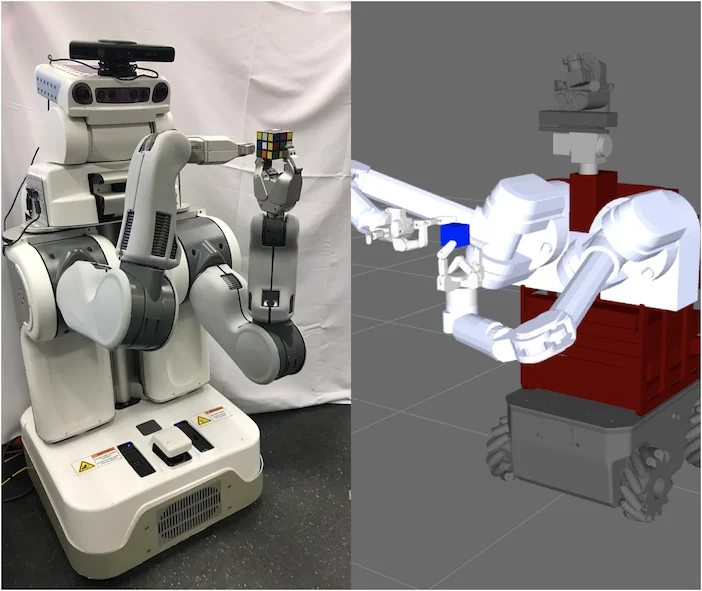
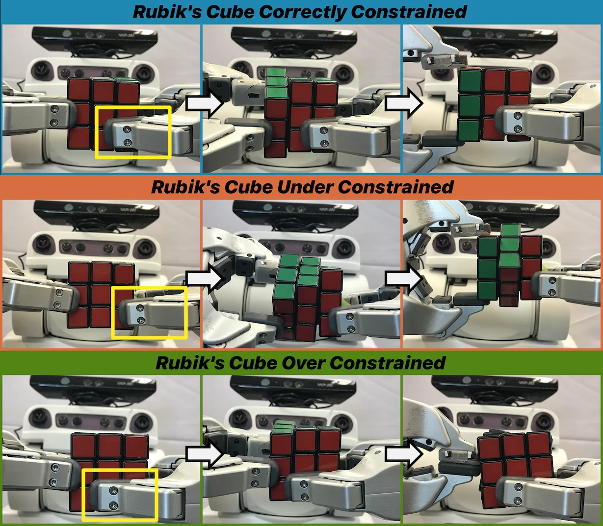
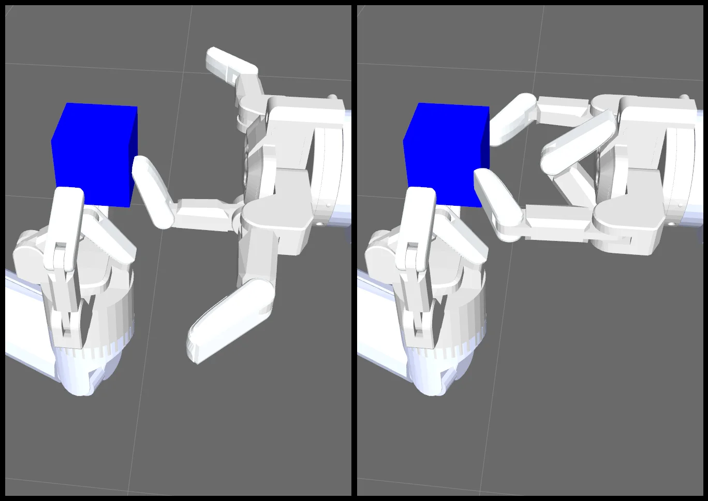

# Benchmarking Robot Manipulation with the Rubik's Cube

[arXiv](https://arxiv.org/abs/2202.07074)

## 摘要（原文）

> Benchmarks for robot manipulation are crucial to measuring progress in the field, yet there are few benchmarks that demonstrate critical manipulation skills, possess standardized metrics, and can be attempted by a wide array of robot platforms. To address a lack of such benchmarks, we propose Rubik's cube manipulation as a benchmark to measure simultaneous performance of precise manipulation and sequential manipulation. The sub-structure of the Rubik's cube demands precise positioning of the robot's end effectors, while its highly reconfigurable nature enables tasks that require the robot to manage pose uncertainty throughout long sequences of actions. We present a protocol for quantitatively measuring both the accuracy and speed of Rubik's cube manipulation. This protocol can be attempted by any general-purpose manipulator, and only requires a standard 3x3 Rubik's cube and a flat surface upon which the Rubik's cube initially rests (e.g. a table). We demonstrate this protocol for two distinct baseline approaches on a PR2 robot. The first baseline provides a fundamental approach for pose-based Rubik's cube manipulation. The second baseline demonstrates the benchmark's ability to quantify improved performance by the system, particularly that resulting from the integration of pre-touch sensing. To demonstrate the benchmark's applicability to other robot platforms and algorithmic approaches, we present the functional blocks required to enable the HERB robot to manipulate the Rubik's cube via push-grasping.

## 摘要（中译）

机器人操作基准测试对于衡量该领域的进展至关重要，然而很少有基准测试能够展示关键的操纵技能、拥有标准化指标，并且可以被广泛的机器人平台尝试。为了解决此类基准测试缺乏的问题，我们提出将魔方操作作为一个基准，用以衡量精确操作和顺序操作的同步性能。魔方的子结构要求机器人的末端执行器精确定位，而其高度可重构的特性使得任务需要机器人在一系列长时间动作中管理姿态不确定性。我们提出了一个协议，用于定量测量魔方操作的准确性和速度。任何通用操纵器都可以尝试这个协议，且只需要一个标准的 3x3 魔方和魔方最初放置的平面（例如桌子）。我们在一个 PR2 机器人上展示了针对两种不同基线方法的这个协议。第一个基线提供了一种基于姿态的魔方操作的基本方法。第二个基线展示了该基准测试量化系统性能改进的能力，特别是由触摸前感应集成所带来的改进。为了展示该基准测试对其他机器人平台和算法方法的适用性，我们介绍了使 HERB 机器人能够通过推抓来操作魔方所需的功能模块。

## 背景剖析

机器人操作技术广泛应用于工业自动化、家庭服务、医疗辅助等领域，核心需求是让机械臂精准完成复杂任务（如组装、分拣或物体操作）。然而，当前领域缺乏一个能同时测试“高精度单步操作”和“长序列任务稳定性”的通用基准——这正是本文要解决的问题。

此前的机器人操作基准（如YCB数据集的Box and Blocks测试）存在两个关键缺陷：要么仅要求机械臂执行简单抓取（无法体现复杂任务能力），要么依赖短步骤任务（无法暴露误差累积问题）。例如，魔方操作需要每步旋转精确到毫米级，同时还要在多次操作中动态调整姿态以应对不确定性——现有基准无法同时满足这两个要求。更棘手的是，机械臂的高自由度导致的校准误差、执行器精度限制，以及环境感知噪声，都会让长序列操作中的微小偏差不断放大，最终导致任务失败。

本文提出的解决方案是：将魔方操作设计为一个综合性基准测试。其核心思路是利用魔方的结构特性（每个面由3×3小方块组成，需协调多个轴的旋转），同时测试机械臂的两种关键能力：1）单步操作的亚毫米级精度（确保每个方块旋转到位）；2）长序列任务中的误差补偿能力（通过传感器反馈或算法优化修正姿态偏差）。研究团队为此设计了量化评估协议，只需标准魔方和平面工作台即可测试，且开源了基准实现代码。

该方法与前人工作的关键差异在于：它首次将“静态精度”和“动态鲁棒性”结合为一个可扩展的测试框架。不同于传统基准仅关注单一任务（如抓取或装配），魔方操作要求机械臂在持续交互中自主修正误差——这更接近真实世界中复杂任务的挑战。此外，该基准的简易设置（仅需一个魔方）使其能跨平台测试（从实验室的PR2机器人到商用HERB机器人），而无需定制化硬件。

## 方法图解

> Figure 1 : Rubik’s cube manipulation can be used to benchmark robot manipulation across a wide array of algorithmic approaches and robot platforms, such as the PR2 and HERB.

这张图的核心目的是直观展示本文提出的“魔方操作”作为机器人操作基准测试的适用性和通用性。它通过并列展示两种不同机器人平台执行魔方操作任务的场景，来说明该方法可以跨平台和算法进行应用。

图的左侧展示了一个实际的PR2机器人正在执行魔方操作。这个机器人具有双臂结构，其右侧机械臂（从观察者角度看）的末端执行器（夹持器）正稳稳地抓着一个标准的3x3魔方。机器人的视觉传感器（可能位于头部）用于感知魔方的状态和位置。整个场景是一个真实的实验环境，背景简洁，突出了机器人和任务本身。这代表了基准测试在实际硬件上的应用情况。

图的右侧则是一个模拟场景，展示了另一个机器人平台（根据caption提示是HERB机器人）在执行相同的魔方操作任务。这个模拟环境通常用于算法的快速迭代、测试和验证，因为它可以提供可控的环境和较低的成本。图中，HERB机器人的手臂也正与魔方进行交互，尽管细节上可能与左侧的PR2有所不同，但核心任务是一致的。模拟环境中的网格背景有助于定位和测量。

这两个并排的图像共同揭示了方法的具体运作方式：
1.  **任务定义**：核心任务是操作魔方，这包括精确地抓取、移动和放置魔方的各个面，以完成特定的目标（如解魔方或执行特定模式）。
2.  **平台无关性**：该方法不依赖于特定的机器人平台。图中展示了PR2和HERB两种不同的机器人，它们具有不同的机械结构和感知能力，但都能执行这个基准测试。
3.  **算法通用性**：基准测试旨在评估各种算法方法的性能。无论是基于视觉的规划、预触碰感知还是其他策略，都可以在这个统一的任务框架下进行比较。
4.  **数据/信息流动**：对于每个机器人平台，信息的流动大致如下：
    *   **感知**：机器人通过其传感器（如摄像头、激光雷达等）感知魔方的初始状态和位置。
    *   **规划**：根据感知到的信息，规划一系列的动作序列，以实现对魔方的精确操作。
    *   **执行**：机器人执行规划好的动作，通过其末端执行器与魔方进行物理交互。
    *   **评估**：根据魔方的最终状态和完成任务的时间等指标来评估算法的性能。
5.  **基准测试的实施**：如图所示，实施这个基准测试只需要一个标准的3x3魔方和一个平坦的表面（如桌子）。这使得不同研究团队可以轻松地复现和比较结果。

这张图并不是一个传统意义上的结果图，没有坐标、具体的对比数值或统计结论。相反，它是一个概念性的示意图，旨在说明“魔方操作”这一基准测试如何被应用于不同的机器人平台。它清楚地表明，该方法提供了一种标准化的任务，可以用来衡量和比较不同算法和机器人在精确操作和顺序操作方面的能力。通过展示PR2和HERB这两个具有代表性的机器人平台，图有效地传达了该基准测试的广泛适用性。

---

> Figure 2 : The robot must precisely position its grippers to rotate the left column of the Rubik’s cube while constraining the middle and right columns in place. Top Row: The robot correctly positions its grippers: it is constraining the two right columns of the cube. The yellow box highlights the position of the constraining gripper. Middle Row: The robot only touches one column of the Rubik’s cube and therefore fails to constrain its middle column. Bottom Row: The right gripper is touching all three columns of the cube; this prevents the left gripper from rotating the left column of the cube.

这张图（图2）来自论文《Benchmarking Robot Manipulation with the Rubik's Cube》，它清晰地展示了在操纵魔方时，机器人夹持器（grippers）如何正确、不足或过度约束魔方的不同列，以实现特定动作（如图中所示的旋转左列）。图的结构分为三个水平部分，每部分包含三个连续的图像，展示了一个操作序列的进展。箭头指示了操作的顺序，从左到右。

1.  **顶部行（蓝色背景标题：“Rubik's Cube Correctly Constrained”）**：
    *   **第一列（左图）**：显示机器人正确地定位其夹持器。黄色框突出了用于约束的夹持器（通常是右侧夹持器）。此时，机器人的两个夹持器分别接触并约束了魔方的中间列和右列。目标是旋转左列，而中间和右列必须保持固定。
    *   **第二列（中图）**：显示了操作过程中的一个中间状态。左侧夹持器正在尝试旋转左列（可以看到左列的颜色块发生了变化，例如绿色块的出现），而中间和右列由于被正确约束而保持不动。
    *   **第三列（右图）**：显示了操作完成后的状态。左列已经被成功旋转，而中间和右列仍然保持原位，因为它们被正确约束了。这表明机器人成功地执行了旋转左列的动作，同时没有影响到其他列。

2.  **中间行（橙色背景标题：“Rubik's Cube Under Constrained”）**：
    *   **第一列（左图）**：显示机器人夹持器的位置不正确，导致约束不足。黄色框再次突出了用于约束的夹持器。在这种情况下，夹持器似乎只接触了魔方的一个列（可能是中间列或右列），而不是两个列。
    *   **第二列（中图）**：显示了尝试旋转左列的过程。由于约束不足，当左侧夹持器旋转左列时，中间列也随之移动（可以看到中间列的颜色块发生了变化）。这表明机器人未能有效地固定魔方的中间列。
    *   **第三列（右图）**：显示了操作后的状态。左列被旋转了，但中间列也发生了不期望的移动。这说明由于约束不足，机器人无法精确地执行只旋转左列的任务。

3.  **底部行（绿色背景标题：“Rubik's Cube Over Constrained”）**：
    *   **第一列（左图）**：显示机器人夹持器的位置导致过度约束。黄色框突出了用于约束的夹持器。在这种情况下，右侧夹持器似乎接触了魔方的所有三个列（左、中、右）。
    *   **第二列（中图）**：显示了尝试旋转左列的过程。由于右侧夹持器过度约束了所有列，左侧夹持器无法自由旋转左列，或者旋转动作受到了严重阻碍。可以看到左列的颜色块几乎没有变化，或者变化不符合预期。
    *   **第三列（右图）**：显示了操作后的状态。左列几乎没有被旋转，或者旋转角度不正确。这表明过度约束阻止了机器人执行所需的精确动作。

**方法运作的解释**：
这张图揭示了机器人操纵魔方时，精确约束的重要性。方法是这样的：为了旋转魔方的某一列（例如左列），机器人需要用一个夹持器来施加旋转力（主动夹持器），同时用另一个夹持器来固定魔方的其他列（约束夹持器）。
*   **正确约束**（顶部行）：约束夹持器稳定地固定住不需要移动的列（中间和右列），使得主动夹持器可以成功地旋转目标列（左列）而不影响其他部分。
*   **约束不足**（中间行）：约束夹持器没有固定住所有需要固定的列，导致在旋转目标列时，其他列也跟着移动，从而无法实现精确的操作。
*   **过度约束**（底部行）：约束夹持器固定了过多的列，甚至包括了需要旋转的目标列，这会阻碍主动夹持器的动作，使其无法有效地旋转目标列。

通过比较这三种情况，图清晰地展示了正确的约束是实现精确魔方操纵的关键。箭头表示了操作的顺序：从初始夹持位置，到执行旋转动作，再到观察结果。

**结论**：
这张图通过对比正确、不足和过度约束三种情况，直观地说明了在机器人操纵魔方时，精确控制夹持器以约束魔方的非目标部分对于成功执行特定动作（如旋转某一列）至关重要。正确约束允许目标列的旋转，而约束不足或过度约束都会导致操作失败或精度下降。

---

> Figure 3 : HERB’s simulated Barrett hands manipulate the Rubik’s cube in blue. Left: The right gripper uses a push-grasp to make contact with the Rubik’s cube. Upon making contact, the right gripper reaches the desired pre-grasp. Right: The right gripper closes its outer fingers to transition from pre-grasp to grasp.

这张图（图3）来自论文《Benchmarking Robot Manipulation with the Rubik's Cube》，展示了HERB机器人的模拟Barrett手在操作蓝色魔方时的两个关键步骤。这张图的核心目的是直观地解释一种特定的抓取策略，即“推-抓取”（push-grasp）方法。

首先，我们来看左边的图像：
- **主体**：图中显示的是HERB机器人的一个模拟机械臂，末端装有一个Barrett手（一种多指机械手）。这个机械手正在与一个蓝色的魔方进行交互。
- **动作描述**：根据图注，左边图像展示的是“右机械手使用推-抓取动作与魔方接触”。具体来说，我们可以看到机械手的一个或多个手指（可能是外侧的手指）正在向魔方的一个面施加推力。这个推力的目的是将魔方推向某个方向，或者调整其位置，以便为后续的抓取做准备。
- **状态**：在接触魔方之后，右机械手达到了“期望的预抓取状态”（desired pre-grasp）。这意味着机械手的手指已经调整到合适的位置和姿态，准备抓住魔方，但尚未完全闭合。

接下来，我们看右边的图像：
- **主体**：仍然是同一个机械臂和Barrett手，以及同一个蓝色魔方。
- **动作描述**：右边图像展示的是“右机械手闭合其外侧手指，从预抓取状态过渡到抓取状态”。我们可以清楚地看到，机械手的外侧手指已经闭合，紧紧地抓住了魔方的一个面。这个动作标志着从准备抓取到实际抓取的转变。
- **状态**：此时，机械手已经成功抓住了魔方，完成了抓取动作。

这张图揭示了该方法的具体运作方式：
1. **推-抓取策略**：这种方法首先通过推动魔方来调整其位置或姿态，使其更适合抓取。推送的动作可以帮助机器人更好地控制魔方的运动，尤其是在需要精确对准的情况下。
2. **预抓取状态**：在推送之后，机械手会调整其手指的位置和姿态，达到一个预抓取状态。这个状态是抓取动作的前奏，确保机械手能够在最佳位置和姿态下抓住物体。
3. **抓取动作**：最后，机械手闭合其手指，完成抓取动作。这个过程需要精确的控制和协调，以确保物体被稳定地抓住，而不会滑落或损坏。

通过这两个图像的对比，我们可以清楚地看到推-抓取策略的实施过程。左边图像展示了推送和预抓取的步骤，而右边图像展示了抓取的最终状态。这种方法在机器人操作中非常重要，因为它可以在不直接接触物体的情况下调整物体的位置，从而提高抓取的准确性和稳定性。

总结来说，这张图通过展示HERB机器人的模拟Barrett手在操作蓝色魔方时的两个关键步骤，直观地解释了推-抓取策略的具体运作方式。这种方法通过推送和预抓取的步骤，最终实现了对魔方的稳定抓取，展示了机器人在精确操作方面的能力。
