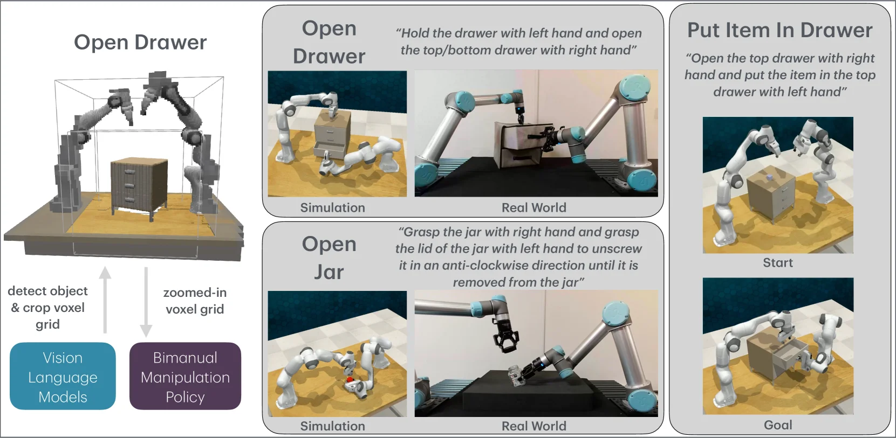
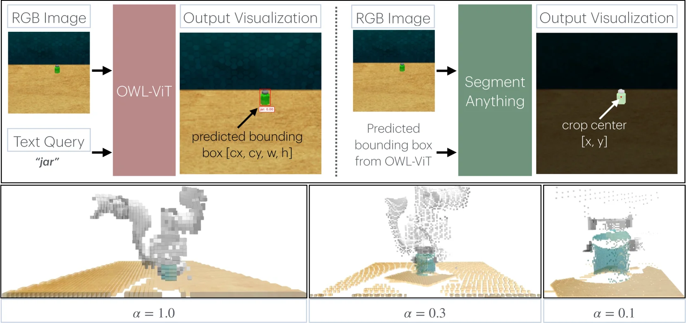
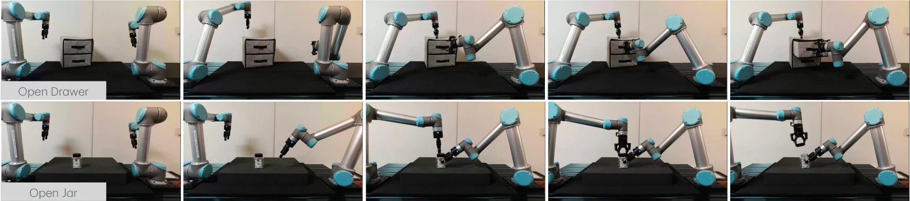

# VoxAct-B: Voxel-Based Acting and Stabilizing Policy for Bimanual Manipulation

[arXiv](https://arxiv.org/abs/2407.04152)

## 摘要（原文）

> Bimanual manipulation is critical to many robotics applications. In contrast to single-arm manipulation, bimanual manipulation tasks are challenging due to higher-dimensional action spaces. Prior works leverage large amounts of data and primitive actions to address this problem, but may suffer from sample inefficiency and limited generalization across various tasks. To this end, we propose VoxAct-B, a language-conditioned, voxel-based method that leverages Vision Language Models (VLMs) to prioritize key regions within the scene and reconstruct a voxel grid. We provide this voxel grid to our bimanual manipulation policy to learn acting and stabilizing actions. This approach enables more efficient policy learning from voxels and is generalizable to different tasks. In simulation, we show that VoxAct-B outperforms strong baselines on fine-grained bimanual manipulation tasks. Furthermore, we demonstrate VoxAct-B on real-world $\texttt{Open Drawer}$ and $\texttt{Open Jar}$ tasks using two UR5s. Code, data, and videos are available at https://voxact-b.github.io.

## 摘要（中译）

双臂操作对许多机器人应用至关重要。与单臂操作相比，由于动作空间维度更高，双臂操作任务具有挑战性。先前的工作利用大量数据和基本动作来解决这个问题，但可能会遇到样本效率低和跨各种任务泛化能力有限的问题。为此，我们提出了VoxAct-B，这是一种基于语言条件、基于体素的方法，它利用视觉语言模型（Vision Language Models，VLMs）来优先处理场景中的关键区域并重建体素网格。我们将这个体素网格提供给我们的双臂操作策略，以学习动作和稳定动作。这种方法能够从体素中进行更高效的策略学习，并且可以推广到不同的任务。在模拟中，我们表明VoxAct-B在精细的双臂操作任务上优于强大的基线方法。此外，我们使用两个UR5机器人在真实的$\texttt{Open Drawer}$（打开抽屉）和$\texttt{Open Jar}$（打开罐子）任务上演示了VoxAct-B。代码、数据和视频可在https://voxact-b.github.io获取。

## 背景剖析

**背景剖析**

双臂操作技术在机器人领域具有广泛的应用场景，例如当物体过大或过重时，单个机械臂无法有效控制，或者需要一个手臂稳定物体以便另一个手臂进行精细操作。这类技术在家庭服务（如烹饪、清洁）和工业生产（如装配、包装）中尤为重要，能够提高效率和精度。

然而，现有的双臂操作方法存在一些局限性。传统方法通常依赖大规模数据集训练策略或使用原始动作分解，这不仅样本效率低下，而且难以在不同任务间进行泛化。此外，双臂操作任务通常需要高度协调和精细控制，这对当前的机器人系统提出了挑战。

为了解决这些问题，本文提出了一种名为VoxAct-B的新型方法。该方法结合了体素表示和视觉语言模型（VLMs），通过聚焦场景中的关键区域来减少计算负担，同时提高样本效率和泛化能力。具体来说，VoxAct-B利用VLMs识别和裁剪出与任务相关的区域，从而构建一个高分辨率的体素网格，而不增加计算成本。此外，该方法还利用语言指令来确定每个手臂的角色（稳定或操作），以实现更高效的协作。

与前人工作相比，VoxAct-B的关键创新在于其结合了体素表示和VLMs，以解决双臂操作中的计算效率和泛化问题。此外，该方法还扩展了现有的基准测试，引入了不对称双臂操作的任务，并在实际环境中进行了验证。通过这些改进，VoxAct-B在模拟和实际应用中均表现出色，为双臂操作技术的发展提供了新的思路。

## 方法图解

> Figure 1: VoxAct-B uses voxel representations and language to perform bimanual manipulation with 6-DoF manipulation from both arms. We test three language-conditioned bimanual tasks in simulation and two ( Open Drawer and Open Jar ) on a real-world setup with two UR5s. The prompt for Open Drawer assumes the left arm is stabilizing and the right arm is acting, while the reverse is true for the Open Jar prompt.

这张图（图1）直观地展示了论文《VoxAct-B: Voxel-Based Acting and Stabilizing Policy for Bimanual Manipulation》中提出的VoxAct-B方法的核心思想、组成部分及其应用场景。

首先，我们来看图的左侧部分，这是一个流程示意图，展示了VoxAct-B方法的基本工作流程：
1.  **Vision Language Models (视觉语言模型)**：这个模块负责处理输入的图像或场景信息。它的功能是“detect object & crop voxel grid”（检测物体并裁剪体素网格）。这意味着它会识别场景中的相关物体，并将这些物体所在的区域表示为体素（voxel）网格的形式。体素是一种三维像素，可以用来表示物体的空间结构和位置。
2.  **Bimanual Manipulation Policy (双手操作策略)**：这个模块接收来自视觉语言模型的“zoomed-in voxel grid”（放大后的体素网格）。它基于这个体素网格来学习并执行“acting and stabilizing actions”（操作和稳定动作）。这里的“acting”通常指执行任务的主要动作（如打开抽屉的手），“stabilizing”则指辅助保持稳定的动作（如扶住抽屉的手）。

接下来，图的右侧部分展示了三个具体的任务示例，这些任务都使用了VoxAct-B方法，并且在模拟环境和真实世界中进行了测试：

1.  **Open Drawer (打开抽屉)**：
    *   **任务描述**：“Hold the drawer with left hand and open the top/bottom drawer with right hand”（左手扶住抽屉，右手打开顶部或底部的抽屉）。这里明确了双手的分工：左手负责稳定，右手负责执行操作。
    *   **模拟与真实世界**：这个任务在“Simulation”（模拟）环境和“Real World”（真实世界）中都有展示。模拟环境中显示了一个双臂机器人正在操作一个抽屉柜。真实世界环境中则显示了两个UR5机器人在执行同样的任务。这表明该方法不仅能在模拟中有效，也能迁移到真实的机器人平台上。

2.  **Open Jar (打开罐子)**：
    *   **任务描述**：“Grasp the jar with right hand and grasp the lid of the jar with left hand to unscrew it in an anti-clockwise direction until it is removed from the jar”（右手抓住罐子，左手抓住罐子的盖子，逆时针旋转直到盖子从罐子上取下）。这里双手的分工与打开抽屉任务相反：右手负责操作（拧开盖子），左手负责稳定（抓住罐子）。
    *   **模拟与真实世界**：同样，这个任务也在模拟和真实世界中进行了演示。模拟环境中，机器人正在尝试打开一个罐子。真实世界环境中，UR5机器人正在执行这个任务。这说明VoxAct-B方法具有泛化到不同类型双手操作任务的能力。

3.  **Put Item In Drawer (将物品放入抽屉)**：
    *   **任务描述**：“Open the top drawer with right hand and put the item in the top drawer with left hand”（用右手打开顶部抽屉，并用左手将物品放入顶部抽屉）。
    *   **Start 和 Goal**：这个任务通过“Start”（开始状态）和“Goal”（目标状态）的图像对比来展示。在“Start”状态下，物品（一个小方块）在抽屉柜旁边，抽屉是关闭的。在“Goal”状态下，抽屉是打开的，物品已经被放入抽屉中。虽然图中没有明确标出这是模拟还是真实世界，但结合上下文，这应该是该方法能够处理的任务类型之一。

**数据或信息的流动顺序**：
*   首先，视觉语言模型处理场景图像，检测出关键物体（如抽屉、罐子、物品），并生成一个初始的体素网格表示。
*   然后，这个体素网格可能经过进一步处理（如图中提到的“zoomed-in”，即放大），以突出关键区域。
*   接着，这个处理后的体素网格被输入到双手操作策略中。
*   双手操作策略根据体素网格信息，规划并执行具体的动作，例如控制哪个手臂进行操作，哪个手臂进行稳定，以及如何精确地移动以达到任务目标。

**方法的具体运作方式**：
这张图揭示了VoxAct-B方法的核心运作机制：
*   **语言条件**：每个任务都有一个自然语言描述（prompt），这个描述指导机器人如何执行任务，包括双手的分工。
*   **体素表示**：方法使用体素网格来表示场景中的物体和空间。这种表示方式能够捕捉物体的三维几何信息和空间关系。
*   **视觉语言模型**：该模型负责将原始的视觉信息（图像）转换为结构化的体素表示，突出了与任务相关的关键区域。这使得后续的策略学习更加高效，因为它关注的是任务相关的部分，而不是整个图像。
*   **双手操作策略**：这个策略学习如何根据体素表示和语言指令来控制两个机械臂（6自由度）执行精细的操作和稳定动作。通过这种方式，策略可以学习到如何协调两个手臂的动作以完成任务。
*   **泛化能力**：通过在不同的任务（打开抽屉、打开罐子、放物品进抽屉）以及不同的环境（模拟和真实世界）中进行测试，图表明VoxAct-B方法具有一定的泛化能力，能够适应不同的场景和任务要求。

总结来说，这张图清晰地展示了VoxAct-B方法如何利用视觉语言模型处理场景信息，生成体素表示，并将其用于训练一个能够执行复杂双手操作任务的策略。该方法在模拟和真实世界中都取得了成功，证明了其有效性和实用性。

---

> Figure 2: Overview of VoxAct-B. Given RGB-D images and a language goal, we input an RGB image from the front camera and a text query extracted from the language goal into the Vision Language Models (VLMs). The VLMs output the pose of the object of interest with respect to the front camera. This information determines the language goal and the roles of each arm (i.e., acting or stabilizing ). Additionally, we use the object’s position with the RGB-D images to reconstruct a voxel grid that spans α ⁢ x 3 𝛼 superscript 𝑥 3 \alpha x^{3} italic_α italic_x start_POSTSUPERSCRIPT 3 end_POSTSUPERSCRIPT meters of the workspace using V 3 superscript 𝑉 3 V^{3} italic_V start_POSTSUPERSCRIPT 3 end_POSTSUPERSCRIPT voxels. The zoomed-in voxel grid, the language goal, proprioception data of both robot arms, and an arm ID are provided to an acting policy π a subscript 𝜋 𝑎 \pi_{a} italic_π start_POSTSUBSCRIPT italic_a end_POSTSUBSCRIPT and a stabilizing policy π s subscript 𝜋 𝑠 \pi_{s} italic_π start_POSTSUBSCRIPT italic_s end_POSTSUBSCRIPT . The policies predict the discretized pose of the next best voxel, gripper open action, collision avoidance flag, and arm ID for fine-grained bimanual manipulation.

这张图展示了VoxAct - B方法的概述，我们可以将其流程拆解为几个关键步骤来理解：

### 输入部分
首先，方法的输入包括**RGB - D图像**和**语言目标**。具体来说，从正面摄像头获取一张RGB图像，同时从语言目标中提取出一个文本查询，这两个信息会被输入到**视觉语言模型（VLMs）**中。

### VLMs的作用
VLMs处理这些输入后，会输出**感兴趣物体相对于正面相机的位姿**。这个位姿信息有两个用途：
- 它会确定**语言目标**以及每个机械臂的**角色**（即哪个臂负责“操作（acting）”，哪个臂负责“稳定（stabilizing）”）。
- 结合RGB - D图像中物体的位置，它会用于重建一个**体素网格（voxel grid）**。这个体素网格覆盖的工作空间范围是\(\alpha\times\alpha\times\alpha\)米（这里\(\alpha\)是一个参数），并且使用\(V^3\)个体素来构建。

### 策略的输入与输出
接下来，**放大后的体素网格**、**语言目标**、**两个机械臂的本体感觉数据**（proprioception data，比如关节角度、位置等信息）以及**一个机械臂ID**会被提供给两个策略：
- **操作策略\(\pi_a\)**（acting policy）：它的作用是预测下一个最佳体素的离散化位姿、夹爪打开动作、避碰标志以及机械臂ID，以实现精细的双臂操作。
- **稳定策略\(\pi_s\)**（stabilizing policy）：虽然图中没有详细说明其输出，但结合方法描述，它应该也是为了辅助双臂操作的稳定性，可能预测与稳定相关的动作或参数。

### 信息流动顺序
整体的信息流动顺序是：输入（RGB - D图像、语言目标）→ VLMs处理（得到物体位姿）→ 确定语言目标和臂的角色、重建体素网格 → 体素网格、语言目标、本体感觉数据、臂ID输入到操作和稳定策略 → 策略输出操作相关的指令（位姿、夹爪动作、避碰标志、臂ID等）。

### 方法的核心逻辑
VoxAct - B的核心在于利用VLMs从视觉和语言信息中提取关键区域（物体位姿），然后通过体素网格来表示工作空间，再将这些信息与机器人自身的感知数据结合，输入到专门的操作和稳定策略中，让策略学习如何进行精细的双臂操作和稳定动作。这种方法的优势在于能够更高效地从体素中学习策略，并且具有任务间的泛化能力，比如在模拟环境中优于强基线，在真实的“打开抽屉”和“打开罐子”任务中也能成功执行。

简单来说，这个方法就是通过VLMs理解任务（语言目标）和场景（RGB - D图像中的物体），用体素网格表示工作空间，再用两个策略分别处理操作和稳定任务，从而实现高效的双臂操作学习。

---

> Figure 3: Top : VLMs usage as part of VoxAct-B, visualizing the Open Jar task in simulation, showing the role of OWL-ViT and Segment Anything. The RGB images from the front camera shown above are examples of actual (uncropped) images provided as input to the models. Bottom : visualization of different α 𝛼 \alpha italic_α values resulting in coarser grids ( α = 1.0 𝛼 1.0 \alpha=1.0 italic_α = 1.0 ) to finer grids ( α = 0.1 𝛼 0.1 \alpha=0.1 italic_α = 0.1 ). We use α = 0.3 𝛼 0.3 \alpha=0.3 italic_α = 0.3 for Open Jar .

这张图（图3）展示了论文《VoxAct-B: Voxel-Based Acting and Stabilizing Policy for Bimanual Manipulation》中提出的VoxAct-B方法的核心流程，特别是针对“打开罐子”（Open Jar）任务在模拟环境中的实现，以及不同参数设置下的体素网格可视化效果。

我们先看**图的上半部分（Top）**，这部分展示了VLMs（视觉语言模型）在VoxAct-B方法中的应用流程，具体是“打开罐子”任务的模拟示例，重点说明了OWL-ViT和Segment Anything两个模型的角色以及数据的流动顺序：

1.  **输入部分**：
    *   左侧第一个模块是“RGB Image”，显示了一张从机器人前端摄像头获取的实际（未裁剪）图像，图中是一个罐子放在桌面上。
    *   下方是“Text Query”，内容为“jar”，这是一个文本查询，用于指示模型关注场景中的“罐子”。

2.  **OWL-ViT模块**：
    *   箭头从“RGB Image”和“Text Query”指向一个粉红色的模块，标有“OWL-ViT”。这表示OWL-ViT模型同时接收图像和文本查询作为输入。
    *   OWL-ViT的作用是处理这些输入，并输出一个“predicted bounding box [cx, cy, w, h]”，即预测的边界框，其中cx和cy是边界框的中心坐标，w和h是宽度和高度。
    *   右侧的“Output Visualization”模块展示了OWL-ViT的输出结果：原始图像上叠加了一个红色的边界框，准确地框住了罐子，并标注了“jar: 0.00”（可能是一个置信度分数或相关度量）。这个边界框标识了场景中与文本查询“jar”相关的关键区域。

3.  **Segment Anything模块**：
    *   箭头从OWL-ViT的“predicted bounding box”指向一个绿色的模块，标有“Segment Anything”。这表示Segment Anything模型接收OWL-ViT预测的边界框作为输入。
    *   “Output Visualization”模块展示了Segment Anything的输出结果：原始图像上叠加了一个箭头，指向罐子的中心，并标注了“crop center [x, y]”。这表明Segment Anything模型可能用于更精确地确定目标物体（罐子）的中心位置，或者用于从该区域进行裁剪，为后续的体素重建或策略学习提供更精确的信息。

数据的整体流动顺序是：RGB图像和文本查询 -> OWL-ViT（预测边界框）-> Segment Anything（利用边界框进行进一步处理，如确定裁剪中心）。

接下来看**图的下半部分（Bottom）**，这部分展示了不同α (alpha) 值对体素网格可视化的影响：

1.  **三个子图**：
    *   左边的子图对应α = 1.0，中间的子图对应α = 0.3，右边的子图对应α = 0.1。
    *   每个子图都显示了一个三维体素网格的可视化，代表了对场景（可能是桌子上的罐子和周围环境）的某种表示或重建。

2.  **α值的影响**：
    *   图的下方文字说明指出，不同的α值会导致体素网格从“coarser grids”（较粗糙的网格，α = 1.0）到“finer grids”（较精细的网格，α = 0.1）。
    *   观察图像可以发现，当α = 1.0时，体素网格较为稀疏和粗糙，物体的细节表示较少。
    *   当α = 0.3时，体素网格比α = 1.0时更密集，物体的细节表示更清晰一些。
    *   当α = 0.1时，体素网格最为密集和精细，物体的细节表示最清晰。
    *   论文摘要中提到，他们在“打开罐子”任务中使用了α = 0.3。

这张图揭示了VoxAct-B方法的具体运作方式：
*   首先，利用视觉语言模型（如OWL-ViT）结合文本查询来识别和定位场景中的关键物体（如罐子），得到其边界框。
*   然后，可能使用另一个模型（如Segment Anything）基于这个边界框进行更精确的处理，例如确定裁剪中心或进行更细致的区域分割。
*   最后，将这些信息用于重建一个体素网格，该网格的精细程度可以通过参数α进行调整。这个体素网格被提供给双臂操作策略，用于学习操作和稳定动作。

图的下半部分通过可视化不同α值的体素网格，展示了参数α如何影响体素表示的精细程度。较粗的网格（高α值）可能计算效率更高但细节较少，而较细的网格（低α值）能捕捉更多细节但计算成本可能更高。论文选择了α = 0.3用于“打开罐子”任务，这可能是在细节和计算效率之间的一个权衡。

总结来说，这张图清晰地展示了VoxAct-B方法如何利用VLMs处理图像和文本信息，定位关键物体，并生成不同精细程度的体素网格，以支持双臂操作策略的学习。

---

> Figure 4: Example successful rollouts (one per row) of VoxAct-B on a real-world bimanual setup with UR5s.

这张图（图4）展示了VoxAct - B方法在真实世界中使用UR5双臂机器人完成双手操作任务的**成功执行过程**，分为上下两行，每行对应一个任务（“Open Drawer”开抽屉和“Open Jar”开罐子），每行有5个连续的步骤（帧），展示任务从初始状态到完成的动态流程。

### 任务1：Open Drawer（第一行）
- **初始状态（最左侧）**：两个UR5机器人手臂处于初始位置，右侧有一个带抽屉的小柜子，场景清晰呈现任务环境。
- **步骤1（左数第二列）**：其中一个机器人手臂（通常是执行操作的手臂）开始向抽屉移动，调整姿态以准备接触抽屉，另一个手臂保持辅助或初始姿态。
- **步骤2（左数第三列）**：操作手臂的手部（末端执行器）接触到抽屉的把手或边缘，开始施加力以拉动抽屉，另一个手臂可能调整位置以稳定或配合。
- **步骤3（左数第四列）**：抽屉被部分拉开，操作手臂继续施力，另一个手臂的姿态进一步调整以适应抽屉的运动或保持场景稳定。
- **步骤4（最右侧）**：抽屉被完全打开，操作手臂完成拉动动作，两个手臂的姿态显示任务成功完成，抽屉处于打开状态。

### 任务2：Open Jar（第二行）
- **初始状态（最左侧）**：两个UR5机器人手臂处于初始位置，桌面上有一个带盖的罐子，场景为开罐子任务的初始环境。
- **步骤1（左数第二列）**：其中一个机器人手臂向罐子移动，末端执行器（可能是夹持器）对准罐子的盖子，准备抓取或操作。
- **步骤2（左数第三列）**：末端执行器接触到罐子盖子，开始施加力以旋转或移动盖子，另一个手臂调整位置以稳定罐子或配合操作。
- **步骤3（左数第四列）**：盖子被部分拧开或移动，末端执行器继续操作，另一个手臂的姿态进一步调整以适应盖子的运动。
- **步骤4（最右侧）**：盖子被完全打开（或移除），末端执行器完成操作，两个手臂的姿态显示任务成功完成，罐子处于打开状态。

### 方法运作的揭示（从图中理解VoxAct - B的工作方式）
- **任务分解与步骤执行**：图中每个任务的5个步骤展示了VoxAct - B如何将复杂的双手操作任务分解为一系列连续的动作步骤。通过视觉语言模型（VLMs）识别场景中的关键区域（如抽屉、罐子及其部件），并重建体素网格（voxel grid），策略学习在这些体素网格上执行“操作（acting）”和“稳定（stabilizing）”动作。
- **双臂协作**：每个任务中两个机器人的协作展示了VoxAct - B如何处理双手操作的维度（如协调两个手臂的运动、力的施加和姿态调整）。例如，在开抽屉时，一个手臂拉抽屉，另一个可能稳定柜子；在开罐子时，一个操作盖子，另一个稳定罐子。
- **成功执行的可视化**：图中展示的成功rollouts（滚动执行）说明VoxAct - B能够在真实世界中学习并执行双手操作任务，从初始状态到任务完成的每个步骤都清晰呈现，验证了方法的可行性和有效性。

### 结果图的结论（结合论文背景）
- **任务类型**：两个真实世界的双手操作任务（开抽屉、开罐子），使用UR5双臂机器人。
- **对比对象**：虽然图中没有直接对比，但论文提到VoxAct - B在模拟中优于强基线，图中展示的是真实世界的成功执行，说明方法可泛化到真实场景。
- **结论**：VoxAct - B能够学习并执行复杂的双手操作任务，在真实世界中实现成功的任务完成（如打开抽屉和罐子），验证了其作为语言条件、体素基的双手操作策略的有效性，支持了论文中“高效策略学习”和“任务泛化”的主张。
