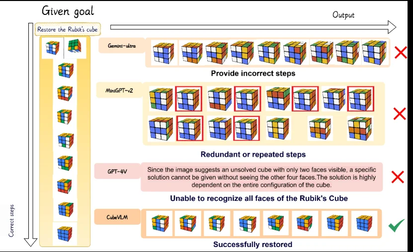
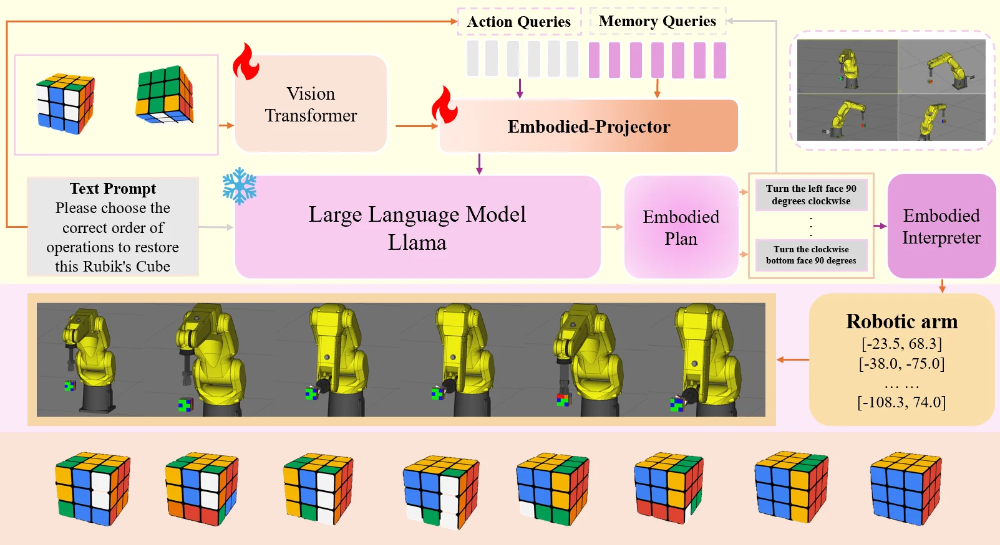
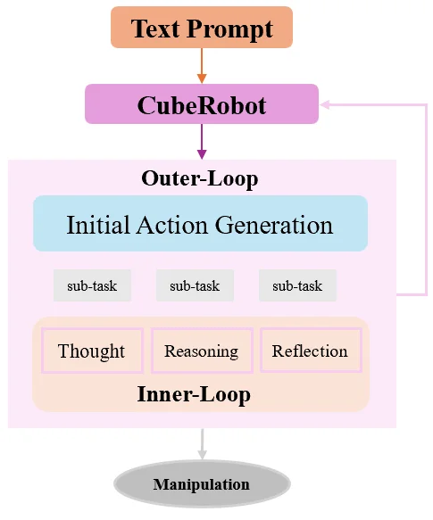
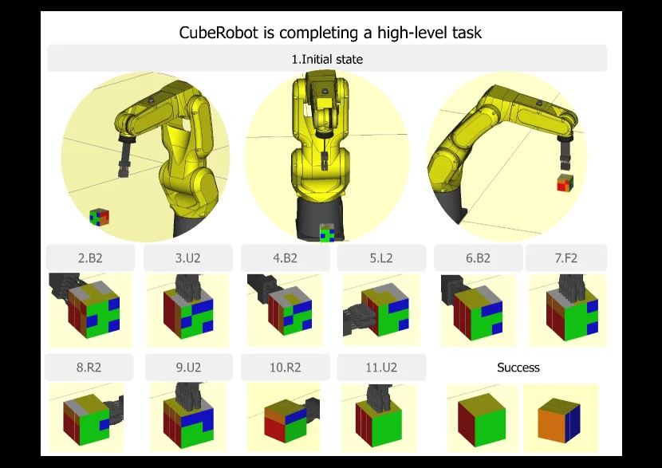

# CubeRobot: Grounding Language in Rubik's Cube Manipulation via Vision-Language Model

[arXiv](https://arxiv.org/abs/2503.19281)

## 摘要（原文）

> Proving Rubik's Cube theorems at the high level represents a notable milestone in human-level spatial imagination and logic thinking and reasoning. Traditional Rubik's Cube robots, relying on complex vision systems and fixed algorithms, often struggle to adapt to complex and dynamic scenarios. To overcome this limitation, we introduce CubeRobot, a novel vision-language model (VLM) tailored for solving 3x3 Rubik's Cubes, empowering embodied agents with multimodal understanding and execution capabilities. We used the CubeCoT image dataset, which contains multiple-level tasks (43 subtasks in total) that humans are unable to handle, encompassing various cube states. We incorporate a dual-loop VisionCoT architecture and Memory Stream, a paradigm for extracting task-related features from VLM-generated planning queries, thus enabling CubeRobot to independent planning, decision-making, reflection and separate management of high- and low-level Rubik's Cube tasks. Furthermore, in low-level Rubik's Cube restoration tasks, CubeRobot achieved a high accuracy rate of 100%, similar to 100% in medium-level tasks, and achieved an accuracy rate of 80% in high-level tasks.

## 摘要（中译）

在高水平上证明魔方定理代表了人类水平空间想象力和逻辑思维推理的一个重要里程碑。传统的魔方机器人依赖复杂的视觉系统和固定算法，通常难以适应复杂和动态的场景。为了克服这一限制，我们引入了CubeRobot，这是一种专门为解决3x3魔方而设计的新型视觉 - 语言模型（Vision - Language Model，VLM），它赋予具身智能体多模态理解和执行能力。我们使用了CubeCoT图像数据集，该数据集包含人类无法处理的多个级别的任务（总共43个子任务），涵盖了各种魔方状态。我们引入了双循环VisionCoT架构和Memory Stream（一种从VLM生成的计划查询中提取任务相关特征的范式），从而使CubeRobot能够独立规划、决策、反思，并对高水平和低水平的魔方任务进行分开管理。此外，在低水平的魔方还原任务中，CubeRobot达到了100%的高准确率，在中等水平任务中也达到了类似的100%，在高水平任务中达到了80%的准确率。

## 背景剖析

### 背景剖析  

近年来，视觉-语言模型（VLM）在自然语言处理领域展现出强大能力，例如文本理解、图像描述生成等。然而，将这类技术应用于更复杂的现实场景——如魔方求解——仍面临挑战。魔方作为一种三维空间谜题，不仅考验算法的空间推理能力，还需要处理动态变化的环境信息。传统机器人依赖固定的算法和复杂的视觉系统，难以适应复杂或突发的魔方状态（例如部分打乱的魔方）。因此，如何让机器像人类一样灵活地理解和解决这类问题，成为研究的关键目标。  

先前的方法存在两方面局限：一方面，现有多模态模型（如LLaVA、Flamingo）虽能处理语言和图像，但在深度感知、物体关系建模等三维任务中表现不足；另一方面，即使具备长链推理能力，这些模型仍无法独立完成高难度的魔方恢复任务。例如，人类可以通过逻辑推理逐步解决魔方，但机器往往需要预先编程的算法，缺乏灵活性。  

针对这些问题，本文提出了CubeRobot，一种专为3×3魔方设计的视觉-语言模型。其核心思路是结合VLM的多模态理解能力与专门的数据集（CubeCoT），该数据集包含人类难以处理的复杂任务（如43个子任务）。此外，CubeRobot采用“双循环架构”和“记忆流”机制：前者通过内外循环分层处理高低难度任务，后者记录任务相关的自然语言描述和时间戳，优化决策效率。  

与前人工作相比，本文的关键差异在于：1）聚焦于魔方这一特定但具有代表性的三维任务，而非通用多模态问题；2）通过定制化数据集和分层架构，提升模型在动态场景中的适应性；3）引入记忆流机制，使模型能够自主反思和调整策略。这种方法不仅提高了魔方求解的准确性（例如低/中难度任务准确率达100%），还为复杂空间问题的解决提供了新范式。

## 方法图解

> Figure 1. Comparison of Rubik’s Cube Solving Performance.

这张图（图1：魔方求解性能比较）清晰地展示了不同模型在解决魔方任务时的表现对比，从而突出了论文中提出的CubeRobot方法的优越性。

首先，我们来看图的整体结构和信息流向：
- **左侧**是“给定目标”（Given goal）区域。最上方是任务描述：“还原魔方”（Restore the Rubik's cube）。下方是一个垂直排列的魔方状态序列，从上到下展示了从一个打乱的魔方（顶部第二个魔方）逐步被还原到完全有序状态（底部第一个魔方）的过程。这个序列代表了“正确步骤”（Correct steps），即解决魔方问题的期望路径。一个向下的箭头标注了“正确步骤”，指示了这个还原过程的顺序。

- **右侧**是“输出”（Output）区域，展示了不同模型尝试解决该魔方任务的结果。这些模型包括Gemini-ultra、MiniGPT-4v、GPT-4V和CubeVLM。每个模型的结果都以一行或多行魔方图像的形式呈现，并附有简短的文字说明其表现。

接下来，我们逐一分析每个模型的表现：

1.  **Gemini-ultra**：
    - 其输出是一行魔方图像，从左到右展示了模型的解题步骤。
    - 文字说明是“提供错误步骤”（Provide incorrect steps）。
    - 结论是一个红色的“X”，表示该模型未能成功还原魔方，因为它在解题过程中采取了错误的步骤。

2.  **MiniGPT-4v**：
    - 其输出是两行魔方图像。
    - 文字说明是“冗余或重复步骤”（Redundant or repeated steps）。
    - 一些魔方图像被红色方框标出，可能表示这些步骤是无效的、重复的或不必要的。
    - 结论也是一个红色的“X”，表示该模型也未能成功还原魔方，因为它陷入了冗余或重复的操作。

3.  **GPT-4V**：
    - 其输出不是魔方图像，而是一段文字说明。
    - 文字内容是：“由于图像显示的是一个只有两个面可见的未解魔方，因此在看不到其他四个面的情况下无法给出具体的解决方案。解决方案高度依赖于魔方的整体配置。”
    - 结论是一个红色的“X”，并归类为“无法识别魔方的所有面”（Unable to recognize all faces of the Rubik's Cube）。这表明该模型在处理仅部分可见的魔方时存在困难，无法进行有效的规划和求解。

4.  **CubeVLM**（论文中提出的方法）：
    - 其输出是一行魔方图像，从左到右展示了模型的解题步骤。
    - 文字说明是“成功还原”（Successfully restored）。
    - 结论是一个绿色的对勾（✓），表示该模型成功地按照正确的步骤序列将魔方从打乱状态还原到了有序状态。

**总结这张图揭示的方法运作方式：**
这张图通过对比展示了CubeRobot（即CubeVLM）方法的有效性。它表明，与传统的语言模型（如Gemini-ultra、MiniGPT-4v、GPT-4V）相比，CubeVLM能够：
- 理解魔方的整体配置，即使只看到部分面。
- 规划并执行正确的、非冗余的步骤序列。
- 最终成功完成魔方还原任务。

图中的信息流动是从左侧的“给定目标”（一个需要解决的魔方问题）开始，经过不同模型的“输出”（它们的解题尝试），最终展示出哪些模型成功（CubeVLM）哪些失败（其他模型）。这张图作为一个结果图，通过视觉对比（正确的魔方序列 vs. 错误的步骤或无法解决的声明）和明确的标签（如“成功还原”、“提供错误步骤”等），清晰地传达了CubeRobot在低级魔方还原任务中取得的高准确率（如图中所示为100%成功）。

图中的坐标或具体数值（如准确率百分比）在图中没有明确标出，但根据图的上下文和论文摘要的描述，可以推断CubeVLM在该任务上表现优异。对比对象是四种不同的模型或方法，结论是CubeVLM在魔方还原任务上优于其他对比模型。

---

> Figure 2. Framework of CubeRobot. The orange arrow shows the vision-language planning process, while the gray arrow represents that we leverage the queried language plans for better policy learning in Rubik’s Cube Manipulation tasks.

这张图展示了CubeRobot的框架，它是一个用于解决3x3魔方的视觉-语言模型，旨在赋予具身智能体多模态理解和执行能力。

首先，我们来看顶部的**视觉处理部分**。左侧输入是两个不同状态的魔方图像，它们被送入一个标有“Vision Transformer”的模块。这个模块负责处理图像数据，提取特征。从“Vision Transformer”输出的箭头指向一个名为“Embodied-Projector”的模块，同时还有两种查询输入：“Action Queries”（动作查询，灰色条形）和“Memory Queries”（记忆查询，紫色条形）。这些查询与视觉特征一起在“Embodied-Projector”中进行处理，这个过程由橙色箭头表示，对应于图注中的“vision-language planning process”（视觉-语言规划过程）。

接下来，我们看中间偏左的**语言处理部分**。有一个“Text Prompt”（文本提示）框，内容是“Please choose the correct order of operations to restore this Rubik's Cube”（请选择恢复此魔方的正确操作顺序）。这个文本提示被送入一个名为“Large Language Model Llama”的模块。这个大型语言模型负责根据文本提示和视觉信息生成计划。

“Large Language Model Llama”的输出是一个“Embodied Plan”（具身计划），这个计划以一系列具体操作指令的形式呈现，例如“Turn the left face 90 degrees clockwise”（将左面顺时针旋转90度）等。这些指令随后被送入“Embodied Interpreter”（具身解释器）。

“Embodied Interpreter”的输出是控制机器人手臂的具体参数，如“Robotic arm”框中所示的坐标值（例如[-23.5, 68.3], [-38.0, -75.0]等）。这些参数直接控制底部显示的黄色机器人手臂的运动。

机器人手臂执行这些指令后，会导致魔方状态的变化，如图底部一排从左到右逐渐变化的魔方图像所示。这些图像展示了魔方从初始混乱状态逐步被还原到整齐状态的过程。

图中还包含一些反馈循环。例如，从“Robotic arm”部分有一个箭头返回到“Memory Queries”输入，这表明机器人的执行结果可能被用于更新或优化记忆查询，从而改进未来的规划。此外，图注中提到灰色箭头代表“we leverage the queried language plans for better policy learning in Rubik’s Cube Manipulation tasks”（我们利用查询到的语言计划来更好地学习魔方操作任务中的策略），这暗示了整个系统通过实际操作来学习和优化其规划能力。

总结来说，CubeRobot的工作流程是：首先通过视觉Transformer处理魔方图像，同时结合文本提示和语言模型生成恢复魔方的计划。然后，这个计划被解释为具体的机器人控制指令，由机器人手臂执行，从而改变魔方的状态。系统还包含反馈机制，利用执行结果来优化未来的规划和学习。

---

> Figure 3. Dual-loop CoT. The outer-loop manages high-level tasks, including initial action planning and iterative refinements, while tracking task progress. The inner-loop executes specific sub-tasks assigned by the outer-loop, employing thought, reasoning, and reflection.

这张图展示了CubeRobot方法中的**双重循环思维链（Dual - loop CoT）**架构，清晰地呈现了从文本提示到魔方操作（Manipulation）的完整流程，以及高低层级任务的协作方式：

### 1. 输入与初始触发
- **Text Prompt（文本提示）**：这是整个流程的起始点，以橙色矩形表示。它提供了关于魔方操作的任务描述或目标（例如“还原魔方”“执行特定魔方变换”等），信息流向紫色的**CubeRobot**模块，触发后续的处理流程。

### 2. CubeRobot模块的角色
紫色的**CubeRobot**模块是整个系统的核心协调者。它接收文本提示后，一方面向下驱动**Outer - Loop（外循环）**的处理，另一方面存在一个反馈箭头（粉色），这表明外循环或后续流程的结果可能会反馈给CubeRobot，用于调整或优化后续的决策（例如根据内循环的反思结果重新规划任务）。

### 3. 外循环（Outer - Loop）：高层级任务管理
- **Initial Action Generation（初始行动生成）**：外循环的核心部分，以浅蓝色矩形表示。它的作用是根据文本提示和任务目标，生成解决魔方问题的**高层级计划**，并将大任务分解为多个**sub - task（子任务）**（图中显示三个子任务框，实际对应论文中提到的43个不同层级的子任务）。这些子任务是外循环分配给内循环的具体工作单元。
- **任务跟踪与管理**：外循环不仅负责初始行动规划，还会**跟踪任务进度**，并通过迭代优化（结合内循环的反馈）来调整计划，确保高层级任务（如魔方的整体还原策略）朝着目标推进。

### 4. 内循环（Inner - Loop）：低层级子任务执行
- **Thought（思考）、Reasoning（推理）、Reflection（反思）**：这三个模块以浅橙色矩形表示，共同构成内循环的核心。内循环接收外循环分配的**特定子任务**后，依次执行：
  - **Thought**：对当前子任务进行初步的思考，理解任务的要求和当前的魔方状态（例如分析魔方的当前色块分布，确定需要执行的操作类型）。
  - **Reasoning**：基于思考的结果，进行逻辑推理，规划具体的操作步骤（例如确定需要转动魔方的哪一面、转动多少度，以达到子任务的目标）。
  - **Reflection**：在执行操作后，反思操作的效果（例如检查魔方状态是否符合预期，分析操作中的错误或可以优化的地方），并将反思的结果反馈给外循环，用于调整后续的子任务分配或高层级计划。
- **子任务执行循环**：内循环会针对每个子任务重复“思考 - 推理 - 反思”的过程，直到子任务完成，然后将完成的结果反馈给外循环，外循环再根据整体任务进度分配下一个子任务（或调整计划）。

### 5. 输出：Manipulation（操作执行）
经过外循环的规划和内循环的子任务执行后，最终的信息流向灰色的**Manipulation（操作执行）**模块。这个模块负责将内循环规划出的具体操作（例如转动魔方的某个面）在实际的魔方（或模拟环境中的魔方）上执行，完成从任务规划到实际操作的闭环。

### 方法运作逻辑总结
- **分层协作**：外循环处理**高层级任务**（如整体还原策略、任务分解），内循环处理**低层级子任务**（如具体的魔方转动操作），通过双重循环实现“规划 - 执行 - 反思 - 优化”的闭环。
- **反馈机制**：内循环的反思结果反馈给外循环，外循环根据反馈调整计划，确保系统能够适应复杂的魔方状态和动态变化的场景（例如当魔方状态与预期不符时，通过反思调整后续操作）。
- **多模态理解与执行**：结合视觉 - 语言模型（VLM）的能力，CubeRobot能够理解文本提示（语言）和魔方图像（视觉），并在实体或模拟环境中执行操作，实现对魔方的多模态理解和执行。

这张图清晰地展示了CubeRobot如何通过双重循环的思维链架构，将高层级的任务规划与低层级的操作执行结合起来，解决了传统魔方机器人难以适应复杂动态场景的问题，实现了从文本提示到实际魔方操作的全流程自动化（或半自动化）处理。

---

> Figure 4. Visualization results of CubeRobot. We accurately emulated the movements of the CubeRobot equipped with LR Mate 200iD robotic arm.

这张图（图4）直观地展示了CubeRobot系统在完成一个高级任务时的工作流程和结果。该图旨在说明CubeRobot如何通过其视觉-语言模型（VLM）能力，规划和执行一系列动作来解决魔方问题。

首先，图的顶部标题“CubeRobot is completing a high-level task”明确了这是一个高级任务的演示。下方分为几个主要部分：

1.  **初始状态 (Initial state)**：这一行包含三个圆形区域，从左到右依次展示了任务的初始条件：
    *   第一个圆形区域显示了一个黄色的机械臂（LR Mate 200iD）和一个未被操作的魔方，魔方位于机械臂的左侧。这代表了任务的起始场景。
    *   第二个圆形区域是机械臂的正面视图，可能用于展示机械臂的当前姿态或准备状态。
    *   第三个圆形区域显示机械臂已经抓取了魔方，或者魔方已经被移动到机械臂的操作范围内，准备开始执行任务。

2.  **动作序列与中间状态**：在初始状态下方，有一系列编号的方框（从2.B2到11.U2），每个方框内包含一个魔方的图像。这些方框代表了CubeRobot执行的步骤序列：
    *   每个方框上方的数字（如2, 3, 4...11）表示步骤的顺序。
    *   数字后的字母和数字组合（如B2, U2, L2, R2, F2）通常代表魔方的转动指令。例如，B2可能表示将魔方的后面（Back face）旋转180度，U2表示将上面（Up face）旋转180度，以此类推。这些指令是由CubeRobot的规划模块生成的。
    *   每个方框内的魔方图像展示了执行相应步骤后魔方的状态变化。通过观察这些图像，可以看到魔方表面的颜色块是如何随着每一步操作而改变的。这可视化了CubeRobot的决策和执行过程。

3.  **成功状态 (Success)**：在这一行的最右侧，有两个魔方的图像，分别标有“Success”。这两个图像展示了任务完成后的最终状态：
    *   左边的“Success”图像显示了一个已经复原的魔方（例如，一面全是绿色，另一面可能是红色和绿色的组合，具体取决于魔方的初始状态和任务目标）。
    *   右边的“Success”图像可能展示了另一个视角或另一个已完成的方面，或者是一个理想化的最终状态（如橙色和蓝色的面）。这表明CubeRobot成功地完成了给定的高级任务，将魔方恢复到了期望的状态。

**方法运作的揭示**：
这张图揭示了CubeRobot的工作流程如下：
*   **感知与理解**：系统首先感知初始的魔方状态（如第一个圆形区域所示）。
*   **规划**：基于视觉输入和任务目标，CubeRobot的VLM（视觉-语言模型）进行独立规划，生成一系列的动作指令（如B2, U2等）。这些指令对应于魔方的转动。
*   **执行**：机械臂根据规划出的指令序列执行相应的动作，逐步改变魔方的状态（如中间一行的各个方框所示）。
*   **反思与管理**：系统可能在执行过程中进行反思和调整（虽然图中未直接显示此过程，但论文提到了这一点），以确保任务朝着正确的方向进行。
*   **完成任务**：最终，通过执行规划好的动作序列，魔方被成功复原（如“Success”部分所示）。

这张图通过一个具体的例子，展示了CubeRobot如何将高层的任务目标分解为低层的可执行动作，并通过其视觉-语言模型和执行能力来完成复杂的魔方操作任务。它强调了CubeRobot在处理人类难以应对的高级任务时的能力。

**结果图的解读**：
这张图本身就是一个结果展示，它证明了CubeRobot能够成功地完成一个高级魔方任务。通过展示从初始状态到最终成功状态的完整过程，图中的数据（即魔方状态的变化）清晰地表明了该方法的有效性。结论是，CubeRobot能够通过其规划的步骤序列，有效地操纵魔方并达到预期的目标状态。
