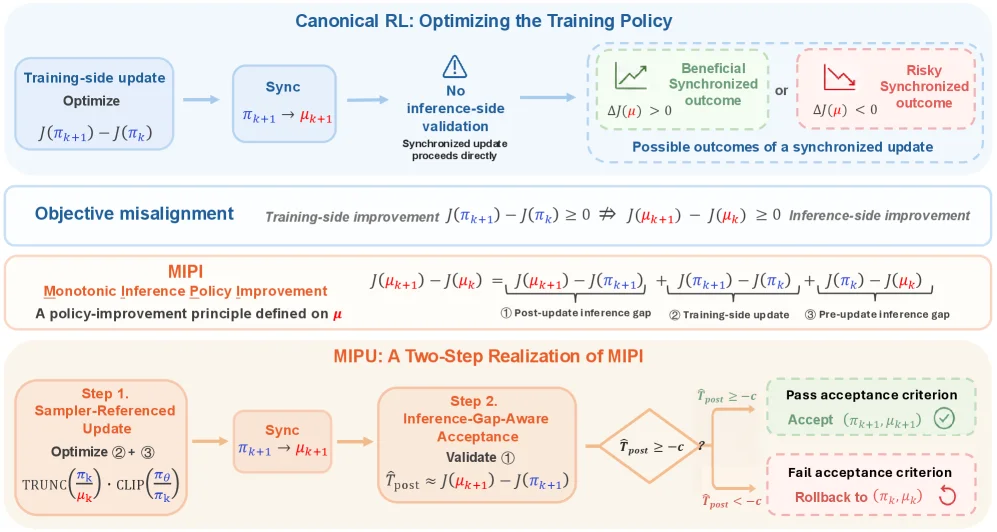
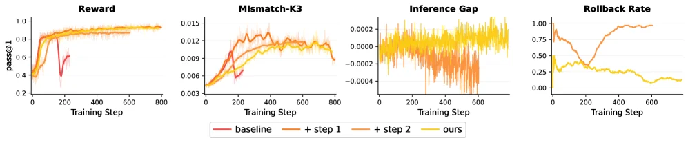
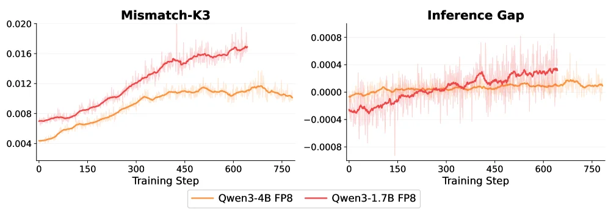
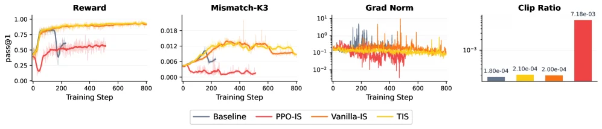
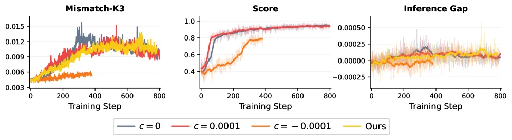

# The Mirage of Optimizing Training Policies: Monotonic Inference Policies as the Real Objective for LLM Reinforcement Learning

[arXiv](https://arxiv.org/abs/2606.29526) · [HuggingFace](https://huggingface.co/papers/2606.29526) · ▲6

## Abstract (verbatim)

> Reinforcement learning (RL) has gained growing attention in large language model (LLM) post-training, yet RL training remains fragile and can suffer from instability or collapse. One vital cause is training-inference mismatch: LLM adopts separate inference and training engines for generation efficiency and training precision, which in practice exhibits inconsistent probabilities for the same trajectories on training and inference sides, even with synchronized model parameters. This naturally induces a special type of off-policyness ever existing and poisoning the training. Prior works have made various efforts in addressing the off-policyness to stabilize the training policies under the mismatch. In this paper, we point out the objective misalignment neglected by existing works that an effective update to the policy in the training engine not necessarily ensures the improvement of the inference policy, i.e., the one used in deployment. To this end, we propose a new policy optimization objective for LLM RL, named Monotonic Inference Policy Improvement (MIPI). Following this principle, we introduce Monotonic Inference Policy Update (MIPU), a two-step LLM RL framework that constructs sampler-referenced candidate updates and selectively accepts synchronized candidates using an inference-side gap proxy. Experiments conducted on two model scales under high mismatch show that MIPU improves average reasoning performance and training stability.

## Background

With the rise of reasoning-focused models like DeepSeek-R1, reinforcement learning (RL) has become a critical paradigm for post-training large language models (LLMs), aiming to enhance capabilities such as instruction following, alignment, and reasoning. Due to the massive scale of LLMs, modern RL pipelines typically separate rollout generation (handled by inference engines like vLLM or SGLang) from gradient computation (performed by training engines like FSDP or Megatron). This separation causes a "training-inference mismatch," where the training and inference policies may assign different probabilities to the same trajectories—even with synchronized parameters—due to differences in precision, decoding, or serving backends.  

Previous approaches attempted to mitigate this issue by correcting sampler-side ratios, filtering unstable samples, or reducing system-level discrepancies. However, these methods failed to address a fundamental problem: improvements to the training policy do not necessarily translate to better performance for the inference policy used in deployment. For example, a training policy optimized under standard objectives might still degrade inference performance due to quantization or decoding differences.  

This paper proposes a new principle called "Monotonic Inference Policy Improvement (MIPI)," which shifts the optimization focus directly to the inference policy's performance. Based on this principle, the authors introduce "Monotonic Inference Policy Update (MIPU)," a two-step framework:  
1. **Sampler-referenced update (Step 1):** The training engine generates a candidate model that ensures partial monotonicity in policy improvement.  
2. **Inference-gap-aware acceptance (Step 2):** The candidate update is selectively accepted based on an inference-side gap proxy, ensuring the remaining monotonicity.  

Experiments under high-mismatch settings (e.g., FP8-quantized inference) show that MIPU outperforms previous methods in both reasoning performance and training stability.  

Key differences from prior work include:  
1. **Objective redefinition:** Shifting from optimizing the training policy to directly improving the inference policy.  
2. **Two-stage framework:** Explicitly separating candidate generation and acceptance steps to handle mismatch robustly.  
3. **Inference-side gap proxy:** Using a deployment-aware criterion for selective updates, rather than just reducing mismatch.  

This approach better aligns with real-world deployment needs and provides a more reliable path for RL in LLMs.

## Method, Figure by Figure

> Figure 1: Monotonic Inference Policy Update (MIPU) resolves the Objective Misalignment issue of LLM RL. Canonical LLM RL accepts synchronized updates by a training-side objective, which does not necessarily imply improvement of the inference policy. Here, π {\color[rgb]{0,0,1}\definecolor[named]{pgfstrokecolor}{rgb}{0,0,1}\pi} and μ {\color[rgb]{1,0,0}\definecolor[named]{pgfstrokecolor}{rgb}{1,0,0}\mu} denote the training policy and inference policy respectively, c c is a tolerance parameter accounting for proxy noise. To address this mismatch, we propose a new principle as monotonic improvement on the inference-policy trajectory (the MIPI principle). MIPU realizes this principle with two steps: Step 1 optimizes Terms ②+③, while Step 2 estimates and validates Term ①, jointly covering all three terms in the MIPI decomposition.

This diagram illustrates how the **Monotonic Inference Policy Update (MIPU)** addresses the **objective misalignment** issue in Large Language Model Reinforcement Learning (LLM RL). We can break down its logic and process into sections:  

### 1. Problems with Traditional RL (Top "Canonical RL" Section)  
- **Process Order**: First, there is a "Training-side update", aiming to optimize the performance improvement of the training policy (i.e., \( J(\pi_{k + 1}) - J(\pi_k) \), where \( J \) is the performance metric and \( \pi \) is the training policy); then a "Sync" is performed to synchronize the training policy \( \pi_{k + 1} \) as the inference policy \( \mu_{k + 1} \).  
- **Key Issue**: This synchronous update **lacks inference-side validation** ("No inference-side validation") and is directly performed. There are two possible outcomes after synchronization:  
  - Green box "Beneficial Synchronized outcome": The performance of the inference policy improves (\( \Delta J(\mu) > 0 \), i.e., \( J(\mu_{k + 1}) - J(\mu_k) > 0 \));  
  - Red box "Risky Synchronized outcome": The performance of the inference policy decreases (\( \Delta J(\mu) < 0 \), i.e., \( J(\mu_{k + 1}) - J(\mu_k) < 0 \)).  
- **Core Contradiction (Objective misalignment)**: The performance improvement on the training side (\( J(\pi_{k + 1}) - J(\pi_k) \geq 0 \)) **does not necessarily** lead to the performance improvement on the inference side (\( J(\mu_{k + 1}) - J(\mu_k) \geq 0 \)) — this is "objective misalignment" and an important reason why traditional LLM RL is fragile and prone to instability or collapse.  

### 2. Solution Idea: Monotonic Inference Policy Improvement (MIPI)  
- **Definition**: MIPI is the "monotonic improvement principle based on the inference policy". It decomposes the performance change of the inference policy \( J(\mu_{k + 1}) - J(\mu_k) \) into three parts (corresponding to the three terms in the diagram):  
  1. \( J(\mu_{k + 1}) - J(\pi_{k + 1}) \): **Post-update inference gap** (the gap between inference and training sides after update);  
  2. \( J(\pi_{k + 1}) - J(\pi_k) \): **Training-side update** (performance improvement on the training side);  
  3. \( J(\pi_k) - J(\mu_k) \): **Pre-update inference gap** (the gap between inference and training sides before update).  
- **Function**: MIPI requires that the combined change of these three parts is "monotonically improved", that is, to ensure that the performance of the inference policy monotonically improves with the update, solving the problem that "optimization on the training side does not mean optimization on the inference side".  

### 3. Specific Implementation: Two-Step Process of MIPU  
MIPU is a "two-step implementation" of MIPI, and the process is as follows:  

#### Step 1: Sampler-Referenced Update  
- **Operation**: Optimize "Term ② + ③" in the MIPI decomposition (i.e., \( J(\pi_{k + 1}) - J(\pi_k) + J(\pi_k) - J(\mu_k) \)). The specific implementation uses "TRUNC(\( \frac{\pi_k}{\mu_k} \))·CLIP(\( \frac{\pi_\theta}{\pi_k} \))" (this is a technical detail, and the core is to optimize the gap between the training side and the inference side).  
- **Output**: Obtain the updated training policy \( \pi_{k + 1} \), and then perform "Sync" to synchronize \( \pi_{k + 1} \) as \( \mu_{k + 1} \) (this step is similar to the synchronization in traditional RL, but there is validation afterwards).  

#### Step 2: Inference-Gap-Aware Acceptance  
- **Verification Link**: Estimate and verify "Term ①" (i.e., \( J(\mu_{k + 1}) - J(\pi_{k + 1}) \), the gap between the inference side and the training side after update). Here, \( \hat{T}_{\text{post}} \approx J(\mu_{k + 1}) - J(\pi_{k + 1}) \) is used to approximate this gap (\( \hat{T}_{\text{post}} \) is the "proxy for the post-inference gap").  
- **Accept/Rollback Decision**:  
  - If \( \hat{T}_{\text{post}} \geq -c \) (\( c \) is a tolerance parameter used to handle proxy noise): Pass the "acceptance criterion" and **accept** this synchronization (i.e., use \( (\pi_{k + 1}, \mu_{k + 1}) \) as the new policy pair);  
  - If \( \hat{T}_{\text{post}} < -c \): **Roll back** to the previous policy pair \( (\pi_k, \mu_k) \) and do not perform this update.  

### Overall Logic Summary  
Traditional LLM RL directly synchronizes the training-side update to the inference side, ignoring the problem of "training-side optimization ≠ inference-side optimization" in objective misalignment. MIPU solves this through **two steps**: The first step optimizes the "historical gap + training-side improvement" between the training side and the inference side; the second step verifies whether the "gap between the inference side and the training side after update" meets the tolerance condition, thus ensuring the monotonic improvement of the inference policy's performance and solving the training instability caused by training-inference mismatch. Experiments (in the paper) show that MIPU can improve the average inference performance and training stability in high-mismatch scenarios.

---

> Figure 3: Training curves for ablation studies under FP8-quantized rollout. We show the training score, the inference-training K3-KL, T ^ post \widehat{T}_{\mathrm{post}} (i.e., inference gap) and the rollback rate computed over a 100-step moving window. Step 1 improves the candidate update direction, while Step 2 introduces inference-gap-aware acceptance to filter unreliable synchronized candidates. The full method obtains stronger performance with a more controlled inference-policy trajectory.

This figure shows the ablation study training curves under the FP8 quantization rollback setting, used to verify the effectiveness of the method proposed in the paper. We can understand the entire experiment design and how the method works through four subplots:

First, the leftmost subplot is "Reward", which shows the reward changes of different methods during training. The x-axis is "Training Step", and the y-axis is "pass@1" (which can be understood as the one - pass rate or the proportion of successfully solving problems). There are four curves in the figure, representing different methods: red is "baseline" (baseline method), orange is "+ step 1" (baseline method plus the first - step improvement), light orange is "+ step 2" (baseline method plus the second - step improvement), and yellow is "ours" (our complete method). From the figure, we can see that as the number of training steps increases, the reward gradually rises and tends to stabilize. Among them, the "ours" method has the highest and most stable reward, indicating that our method is more effective in improving training performance.

Next is the second subplot "Mismatch - K3", which shows the mismatch between training and inference, specifically the K3 - KL divergence. The x - axis is also "Training Step", and the y - axis is the value of "Mismatch - K3". The larger this value is, the more serious the mismatch between training and inference is. From the figure, we can see that the curve trends of different methods are different. The curve of the "baseline" method fluctuates greatly and is relatively high overall, while the curves of the "+ step 1", "+ step 2" and "ours" methods are relatively smoother and have lower values, especially the "ours" method, indicating that our method can effectively reduce the mismatch between training and inference.

The third subplot is "Inference Gap", which shows the gap proxy at the inference end. The x - axis is "Training Step", and the y - axis is the value of "Inference Gap". This value reflects the uncertainty or error at the inference end. From the figure, we can see that the curve fluctuations of different methods are different. The curve of the "baseline" method fluctuates greatly, while the curves of the "+ step 1", "+ step 2" and "ours" methods are relatively smoother, especially the "ours" method, indicating that our method can better control the inference gap.

Finally, the fourth subplot is "Rollback Rate", which shows the rollback rate calculated within a 100 - step moving window. The x - axis is "Training Step", and the y - axis is the value of "Rollback Rate". The higher the rollback rate, the more times rollback is needed, and the training stability may be worse. From the figure, we can see that the "baseline" method has a higher rollback rate and greater fluctuations, while the rollback rates of the "+ step 1", "+ step 2" and "ours" methods are relatively low and more stable, especially the "ours" method, indicating that our method can improve training stability.

Now let's understand how the method in the paper works. The paper proposes a new strategy optimization objective called Monotonic Inference Policy Improvement (MIPI) and a two - step LLM RL framework called Monotonic Inference Policy Update (MIPU). The first step of MIPU is to improve the direction of candidate updates, and the second step is to introduce an inference gap - aware acceptance mechanism to filter out unreliable synchronous candidates. From the curves in the figure, we can see that after the first - step improvement, the "+ step 1" method has improved performance, and the mismatch and rollback rate have decreased. Then, after the second - step improvement, the "+ step 2" method further improves performance, and the mismatch and rollback rate are further reduced. The final "ours" method (the complete method) performs the best in terms of reward, mismatch, inference gap and rollback rate, indicating that our method can effectively improve training performance and stability.

To sum up, this figure shows the changes of reward, training - inference mismatch, inference gap and rollback rate of different methods during training through four subplots. The results show that our method (ours) is superior to the baseline method and the methods that only use the first - step or second - step improvement in all indicators, indicating that our method can effectively solve the problem of training - inference mismatch and improve training stability and performance.

---

> (a) Inference-training K3-KL and inference gap. (b) Step 2 vs. random rollback. Figure 4: (a) Inference-training K3-KL and T ^ post \widehat{T}_{\mathrm{post}} (i.e., inference gap) under FP8-quantized rollout. Qwen3-1.7B exhibits larger mismatch and a more volatile T ^ post \widehat{T}_{\mathrm{post}} than Qwen3-4B. (b) Comparison between inference-gap-aware Step 2 acceptance and a random rollback control. Random rollback rejects more updates, applying fewer effective policy changes, but still collapses.

This figure (Figure 4a) illustrates the "training-inference mismatch" phenomenon and the resulting "inference gap" during the training process for two different scales of the Qwen model (Qwen3-4B and Qwen3-1.7B) under FP8 quantized rollback settings.

The left subplot is titled "Mismatch-K3". The x-axis is "Training Step," ranging from 0 to 750. The y-axis represents a mismatch metric related to K3, possibly a KL divergence, with values ranging from 0 to 0.020. There are two curves:
*   The orange curve represents the "Qwen3-4B FP8" model.
*   The red curve represents the "Qwen3-1.7B FP8" model.
These curves show how the mismatch between the model's output on the training engine and the inference engine changes as the training progresses. We can see that both curves show an upward trend, indicating that this mismatch increases as training proceeds. Additionally, the red curve (Qwen3-1.7B) has a higher overall mismatch than the orange curve (Qwen3-4B), suggesting that the smaller model (Qwen3-1.7B) exhibits a greater training-inference mismatch.

The right subplot is titled "Inference Gap". The x-axis is also "Training Step," ranging from 0 to 750. The y-axis represents the "inference gap" (T^post or \widehat{T}_{\mathrm{post}}), with values ranging from -0.0008 to 0.0008. Here too, there are two curves:
*   The orange curve represents the "Qwen3-4B FP8" model.
*   The red curve represents the "Qwen3-1.7B FP8" model.
This curve shows the change in the gap proxy calculated on the inference side during the training process. We can observe that the red curve (Qwen3-1.7B) is more volatile and its average value seems to deviate more from zero, indicating that the smaller model (Qwen3-1.7B) not only has a higher mismatch but also a more unstable and significant inference gap.

This figure reveals a target misalignment overlooked by existing methods: an effective update to the policy in the training engine does not necessarily guarantee an improvement in the inference engine's (deployment-used) policy. The figure clearly demonstrates that even with synchronized model parameters, the probability assessments for the same trajectories by the training and inference engines are inconsistent, and this inconsistency grows with training. This inconsistency is more severe for smaller models. This provides motivation for the "Monotonic Inference Policy Improvement" (MIPI) objective and the "Monotonic Inference Policy Update" (MIPU) framework proposed in the paper: a new optimization objective and method are needed to address this mismatch to improve training stability and inference performance.

In summary, this figure, by comparing the training-inference mismatch and inference gap for two different model scales during training, intuitively demonstrates the existence and severity of the training-inference mismatch problem, especially for smaller models. This supports the core argument of the paper that a new optimization objective and method are needed to handle this mismatch and enhance training stability and inference performance.

---

> Figure 5: Step 1 implementation analysis under the Qwen3-4B FP8-quantized rollout. Comparison of PPO-IS, Vanilla-IS, and TIS in terms of performance, gradient norm, inference-training K3-KL, and clip ratio.

This figure (Figure 5) is from the paper "The Mirage of Optimizing Training Policies: Monotonic Inference Policies as the Real Objective for LLM Reinforcement Learning" and illustrates a **first-step implementation analysis** of three methods—PPO-IS, Vanilla-IS, and TIS—under the Qwen3-4B FP8 quantized rollout environment. Through four subplots, it compares the performance, gradient norms, inference-training K3-KL divergence, and clip ratios of these methods across different dimensions, aiming to reveal their specific mechanisms and effects.  

Let’s analyze each subplot one by one:  

1. **First Subplot (Left): Reward (Performance)**  
   * **X-axis**: `Training Step`, representing the number of iterations during training, ranging from 0 to approximately 800.  
   * **Y-axis**: `pass@1`, a performance metric typically indicating the probability of successfully solving a problem in one attempt (e.g., the likelihood that a model’s generated answer is judged correct). Values closer to 1.0 signify better performance.  
   * **Curves & Legend**:  
     * Blue curve: `Baseline`.  
     * Red curve: `PPO-IS` (Proximal Policy Optimization with Importance Sampling).  
     * Orange curve: `Vanilla-IS` (Vanilla Importance Sampling).  
     * Yellow curve: `TIS` (a method proposed in the paper, possibly Targeted Importance Sampling or a similar concept).  
   * **Interpretation**: This subplot shows how the performance of different methods changes with increasing training steps. `TIS` (yellow) achieves the highest and most stable performance, approaching 1.0. `Vanilla-IS` (orange) follows, while `PPO-IS` (red) exhibits lower and more volatile performance. The `Baseline` (blue) shows fluctuations early on but ultimately performs between `PPO-IS` and `Vanilla-IS`. This indicates that `TIS` is more effective in enhancing inference performance.  

2. **Second Subplot (Second from Left): Mismatch-K3 (Inference-Training Mismatch)**  
   * **X-axis**: `Training Step`, same as the first subplot.  
   * **Y-axis**: `Mismatch-K3`, typically measuring the difference in probability distributions between the inference and training engines when generating the same trajectory, using K3-KL divergence. Lower values indicate less mismatch.  
   * **Curves & Legend**: Same as the first subplot.  
   * **Interpretation**: This subplot illustrates the degree of inference-training mismatch during training. `TIS` (yellow) and `Vanilla-IS` (orange) exhibit low and relatively stable mismatch levels. `PPO-IS` (red) has a higher mismatch early on, which decreases but remains above the other two. The `Baseline` (blue) also shows a high mismatch early on. This suggests that `TIS` and `Vanilla-IS` better reduce the discrepancy between training and inference.  

3. **Third Subplot (Second from Right): Grad Norm (Gradient Norm)**  
   * **X-axis**: `Training Step`, same as the first subplot.  
   * **Y-axis**: `Grad Norm`, typically representing the magnitude of policy update gradients, displayed on a logarithmic scale (10^-2 to 10^1). Excessively large gradient norms can lead to unstable training.  
   * **Curves & Legend**: Same as the first subplot.  
   * **Interpretation**: This subplot shows how the gradient norms change during training. `TIS` (yellow) and `Vanilla-IS` (orange) have relatively small and stable gradient norms. `PPO-IS` (red) shows very large gradient norms at certain steps (high peaks), indicating potentially unstable training. The `Baseline` (blue) also exhibits significant fluctuations. This suggests that `TIS` and `Vanilla-IS` have more stable training processes.  

4. **Fourth Subplot (Right): Clip Ratio**  
   * **X-axis**: No explicit scale, but four bar charts correspond to the four methods (from left to right: Baseline, PPO-IS, Vanilla-IS, TIS).  
   * **Y-axis**: `Clip Ratio`, a key parameter in the PPO algorithm representing the proportion of gradients clipped during policy updates. A higher clip ratio may mean greater restrictions on update magnitude to prevent instability.  
   * **Bar Charts & Legend**: The height of each bar represents the average clip ratio for the corresponding method.  
     * `Baseline` (blue): ~1.80e-04.  
     * `PPO-IS` (yellow): ~2.10e-04.  
     * `Vanilla-IS` (orange): ~2.00e-04.  
     * `TIS` (red): ~7.18e-03 (significantly higher than the others).  
   * **Interpretation**: This subplot displays the average clip ratios of different methods. `TIS` has a much higher clip ratio than the other three methods, which might mean TIS allows for larger changes (or more aggressive updates) during policy updates. However,结合前几个子图来看, this higher clip ratio does not lead to performance degradation or increased mismatch; instead, it may contribute to better performance and stability. This also reflects TIS’s different strategy in handling inference-training mismatch.  

**Method Mechanism Revealed**:  
This figure reveals how the proposed TIS method operates through comparative experiments:  
* **Goal Alignment**: TIS seems to better align strategy updates for the training engine with the actual needs of the inference engine, thereby reducing inference-training mismatch (lower Mismatch-K3).  
* **Performance Improvement**: TIS achieves significant improvements in inference performance (Reward), indicating that optimizing the training engine indeed enhances the performance of the inference engine.  
* **Training Stability**: TIS’s gradient norms (Grad Norm) are relatively stable. Although its clip ratio is higher, it does not lead to training instability; instead, it may achieve better performance through more effective updates.  
* **Comparison with Existing Methods**: Compared to PPO-IS and Vanilla-IS, TIS outperforms them in terms of performance, mismatch level, and training stability. This supports the paper’s core argument: traditional methods of optimizing training policies may overlook the misalignment between training and inference goals, and TIS addresses this issue by focusing on monotonic improvement of inference policies (Monotonic Inference Policy Improvement, MIPI).  

**Conclusion**:  
From the figure, it is clear that in the Qwen3-4B FP8 quantized rollout environment, the TIS method outperforms PPO-IS, Vanilla-IS, and the baseline method in terms of performance, inference-training mismatch level, and training stability. This indicates that TIS can more effectively handle the training-inference mismatch problem in LLM reinforcement learning and achieve more stable and optimal inference performance.

---

> Figure 6: Sensitivity to the acceptance tolerance c c under the Qwen3-4B FP8-quantized rollout in terms of inference-training K3-KL, training score, and T ^ post \widehat{T}_{\mathrm{post}} .

This figure (Figure 6) is from the paper *The Mirage of Optimizing Training Policies: Monotonic Inference Policies as the Real Objective for LLM Reinforcement Learning*. It illustrates the performance of the Qwen3-4B model in FP8 quantized rollout under different acceptance tolerance parameters `c`, evaluated across three dimensions: Inference-Training K3-KL Divergence (Mismatch-K3), Training Score, and Posterior Inference Gap.  

### Components and Information Flow of the Figure:  

1. **Three Subplots**:  
   - **Left Subplot (Mismatch-K3)**: The x-axis represents Training Step (ranging from 0 to 800), and the y-axis represents the K3-KL divergence value (ranging approximately from 0.003 to 0.015). This plot shows how the K3-KL divergence between inference and training changes with training steps for different `c` values. The K3-KL divergence measures the difference in probability distributions of generated trajectories between the inference and training engines; a smaller difference indicates higher matching accuracy.  
   - **Middle Subplot (Score)**: The x-axis is also Training Step (0 to 800), and the y-axis represents the Score (ranging from 0.4 to 1.0). This plot shows how the training score changes with training steps for different `c` values. The score likely reflects the model’s performance on training tasks, with a higher score indicating better performance.  
   - **Right Subplot (Inference Gap)**: The x-axis is Training Step (0 to 800), and the y-axis represents the Posterior Inference Gap ($\widehat{T}_{\mathrm{post}}$), ranging approximately from -0.00025 to 0.00050. This plot shows how the posterior inference gap changes with training steps for different `c` values. The posterior inference gap may measure the difference in posterior probabilities between inference and training, with a smaller gap indicating better consistency.  

2. **Legend**:  
   - Different colors represent different `c` values:  
     - Blue (`c=0`): Baseline case with an acceptance tolerance of 0.  
     - Red (`c=0.0001`): Positive small acceptance tolerance.  
     - Orange (`c=-0.0001`): Negative small acceptance tolerance.  
     - Yellow (`Ours`): `c` setting corresponding to the method proposed in the paper (Monotonic Inference Policy Update, MIPU).  

### How the Method Works (From the Figure):  

The paper points out that existing reinforcement learning (RL) training in large language models (LLMs) suffers from a train-inference mismatch problem, where the training and inference engines produce inconsistent probability estimates for the same trajectories, leading to unstable training. To address this, the paper proposes the **Monotonic Inference Policy Improvement (MIPI)** objective and the **Monotonic Inference Policy Update (MIPU)** framework. The core of MIPU is:  
1. **Sample Candidate Updates**: First, sample some candidate policy updates from the training process.  
2. **Selectively Accept Synchronized Candidates**: Then, use a proxy for the inference-side gap (i.e., the "Inference Gap" in the figure) to selectively accept candidate updates that perform well on the inference side, ensuring that training updates truly improve the inference-time strategy.  

From the figure, different `c` values (acceptance tolerances) affect the changes in these three metrics:  
- For **Mismatch-K3** (left subplot), the yellow "Ours" (MIPU method) has a relatively low and stable K3-KL divergence during training, indicating that MIPU effectively reduces the train-inference mismatch.  
- For **Score** (middle subplot), the yellow "Ours" has a faster increase and ultimately higher score during training, indicating that MIPU improves the model’s training performance.  
- For **Inference Gap** (right subplot), the yellow "Ours" has a relatively small and stable posterior inference gap during training, indicating that MIPU reduces the inference-side gap and improves consistency.  

### Result Analysis (Coordinates, Comparison Objects, and Conclusions):  

- **Coordinates**:  
  - X-axis: Training Step (0 to 800), representing training progress.  
  - Y-axis:  
    - Left subplot: K3-KL divergence (0.003 to 0.015), measuring the difference in probability distributions between training and inference.  
    - Middle subplot: Score (0.4 to 1.0), measuring the model’s training performance.  
    - Right subplot: Posterior Inference Gap (-0.00025 to 0.00050), measuring the gap on the inference side.  

- **Comparison Objects**:  
  - Performance comparison of different `c` values (`c=0`, `c=0.0001`, `c=-0.0001`, and `Ours`) across the three metrics.  

- **Conclusions**:  
  - The MIPU method proposed in the paper (yellow curve) performs better across all three metrics:  
    - In Mismatch-K3 (left subplot), the K3-KL divergence is lower and more stable, indicating a smaller train-inference mismatch.  
    - In Score (middle subplot), the score is higher and increases faster, indicating better training performance.  
    - In Inference Gap (right subplot), the posterior inference gap is smaller and more stable, indicating better consistency on the inference side.  
  - This shows that the MIPU method effectively solves the train-inference mismatch problem, improving training stability and the model’s inference performance.
