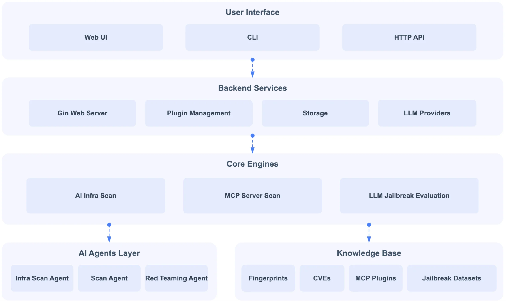
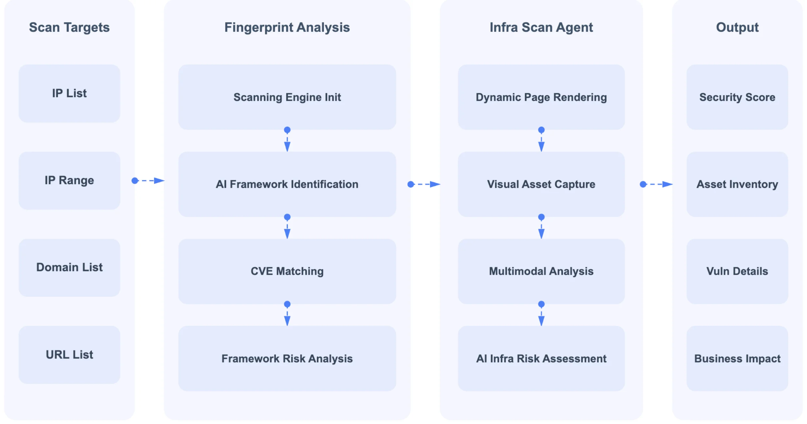
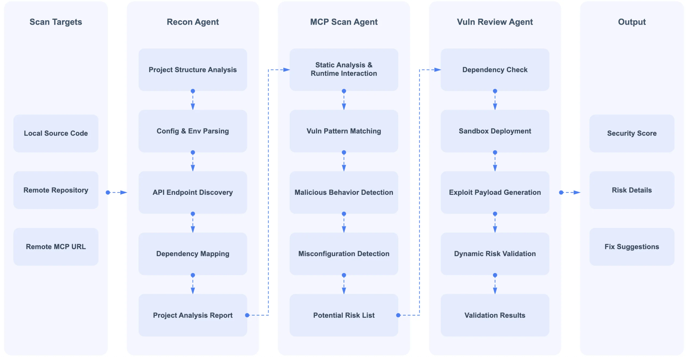
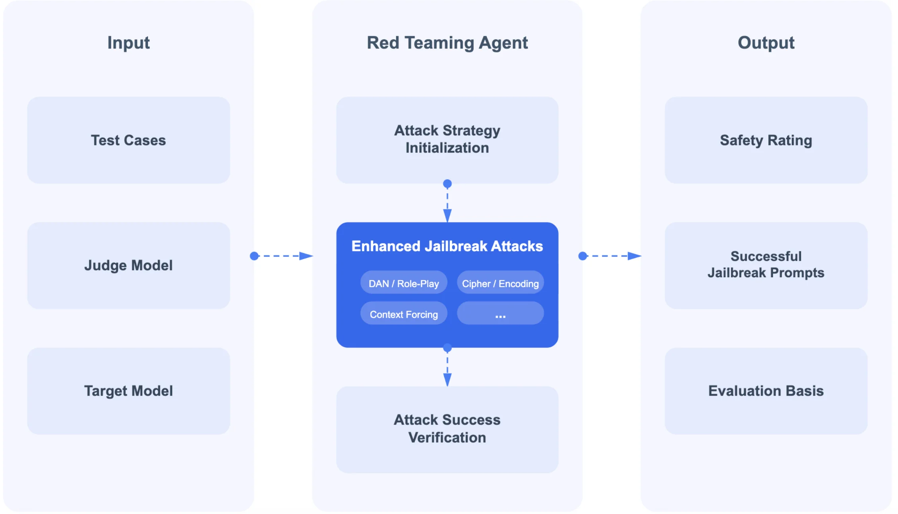

# Securing the AI Agent: A Unified Framework for Multi-Layer Agent Red Teaming

[arXiv](https://arxiv.org/abs/2606.31227) · [HuggingFace](https://huggingface.co/papers/2606.31227) · ▲2

## Abstract (verbatim)

> The fast growth of open-source AI infrastructure, from model serving engines and agent platforms to the Model Context Protocol (MCP) ecosystem and the language models themselves, has outpaced the security tooling available to defend it. We present AI-Infra-Guard, an open-source framework that organizes AI red teaming around a single observation: the attack surface of an AI agent is stratified across layers (infrastructure, protocol/tool, agent behavior, and model), and no single detection paradigm fits all of them. The framework therefore matches a paradigm to each layer, from deterministic rule matching over 75+ AI components and 1{,}400+ vulnerability rules, through LLM-driven agentic auditing of MCP servers and agent-skill packages and multi-turn black-box agent red teaming, to a jailbreak harness with 26+ attack operators over sixteen datasets. To our knowledge it is the only open-source framework to span all of these, including supply-chain auditing of the agent skills that increasingly extend AI agents. We release AI-Infra-Guard as open source so that layer-paradigm matching can serve as a practical foundation for agent security and a shared base for the community to build on.

## Background

### Background Analysis  

**1. Technical Context**  
Recent years have seen rapid growth in open-source AI infrastructure (e.g., model servers, agent platforms, Model Context Protocol ecosystems), creating a new class of network-exposed software. These systems are deployed by individuals or small teams on untrusted networks to build conversational agents, automation workflows, and tool-calling capabilities. However, their security needs differ drastically from traditional software: they must defend against unauthorized access to expensive compute, API credential leaks, prompt injection attacks that hijack agent goals, tool abuse leading to "confused deputy" vulnerabilities, and misalignment of models under adversarial prompting.  

**2. Previous Limitations**  
Traditional security tools fail to address these challenges due to three core issues: (1) AI components are too new for existing vulnerability databases (e.g., CVE) to catalog; (2) AI software uses irregular versioning (e.g., rolling updates, development tags), breaking semantic version comparison logic; (3) Most critically, AI’s threat model has shifted—high-risk vulnerabilities are no longer just injection or scripting flaws but require layered detection methods (e.g., infrastructure exposure, protocol bugs, behavioral logic weaknesses, model alignment failures), which single techniques cannot cover.  

**3. Proposed Solution**  
The paper introduces "AI-Infra-Guard," a framework based on the principle of **layered detection paradigms**: different attack surfaces (infrastructure, protocol/tool, agent behavior, model) require tailored detection methods. For example, infrastructure uses rule-based matching and version normalization; protocols employ LLM-driven dynamic auditing; behavior is tested via dialog-based red teaming; and models are evaluated with multi-turn jailbreak harnesses. This ensures each layer gets the most appropriate detection method instead of forcing a one-size-fits-all approach.  

**4. Key Differentiation**  
Unlike prior work, AI-Infra-Guard treats AI security as a **unified cross-layer problem**, implemented through an open-source framework. It covers the full stack from infrastructure to model alignment and introduces innovations like "Prompt-as-Rule," allowing community-driven expansion of rule libraries and attack operators. This design not only solves current tool limitations but also provides a scalable foundation for future AI security research.

## Method, Figure by Figure

> Figure 5: The distributed server-agent architecture. A user interface (Web UI, CLI, or HTTP API) drives backend services (Gin web server, plugin management, storage, and LLM providers), which in turn invoke the core engines (AI infra scan, MCP server scan, and LLM jailbreak evaluation). The engines draw on an AI-agents layer and a shared knowledge base of fingerprints, CVEs, MCP plugins, and jailbreak datasets.

This figure illustrates the distributed server-agent architecture of the "AI-Infra-Guard" framework, designed for multi-layered AI agent red teaming. Here's a detailed explanation of the components, sections, arrows, and the flow of information/data to understand how the method operates:

Starting from the top, we have the "User Interface" layer. This is the entry point for users to interact with the system, offering three options:
1.  **Web UI (Web User Interface)**: Users can interact with the system through a graphical interface.
2.  **CLI (Command Line Interface)**: Users can interact via commands, suitable for those familiar with command-line operations or for automation scripts.
3.  **HTTP API (HTTP Application Programming Interface)**: Allows other software systems to interact with the framework programmatically.
Inputs from these user interfaces flow to the next layer, the "Backend Services."

Next is the "Backend Services" layer. This layer handles requests from the user interface and coordinates the core functionalities of the framework. It includes several key components:
1.  **Gin Web Server**: A web server, likely responsible for handling requests from the Web UI or HTTP API.
2.  **Plugin Management**: Manages and loads various plugins, which can extend the framework's capabilities, such as supporting new scanners or evaluation tools.
3.  **Storage**: Stores data required by the system, such as configuration information, scan results, and knowledge base content.
4.  **LLM Providers**: Interacts with large language models, potentially for generating reports, providing natural language explanations, or supporting certain types of evaluations.
After processing requests, the backend services layer invokes the "Core Engines" layer to perform specific tasks.

Then comes the "Core Engines" layer. This is the core of the framework, containing engines for scanning and evaluating different attack surfaces:
1.  **AI Infra Scan**: This engine scans the security of AI infrastructure, such as model serving engines and agent platforms. It utilizes the "AI Agents Layer" below to perform specific scanning tasks.
2.  **MCP Server Scan**: This engine specifically scans MCP (Model Context Protocol) servers to assess their security. MCP is a protocol for connecting AI agents and tools.
3.  **LLM Jailbreak Evaluation**: This engine evaluates the security of large language models, particularly their resilience against jailbreak attacks. It uses the "Knowledge Base" below to obtain attack methods and datasets.
When these core engines execute tasks, they receive support from two key sections below:

On the left is the "AI Agents Layer." This layer provides a set of agents to perform specific scanning and red teaming tasks:
1.  **Infra Scan Agent**: Specifically performs scans of AI infrastructure, working with the "AI Infra Scan" engine.
2.  **Scan Agent**: A general-purpose scanning agent, potentially used for various types of scanning tasks.
3.  **Red Teaming Agent**: Specifically performs red team attack simulations to test system security.
These agents provide the execution capability for the "AI Infra Scan" engine.

On the right is the "Knowledge Base." This layer stores various knowledge and data required for the framework to operate:
1.  **Fingerprints**: Likely contains fingerprints of various AI components, vulnerabilities, or attacks for identification and matching.
2.  **CVEs (Common Vulnerabilities and Exposures)**: Stores information about known common vulnerabilities for detection and risk assessment.
3.  **MCP Plugins**: Stores information about MCP protocol-related plugins, potentially for extending MCP server functionality or for security evaluation.
4.  **Jailbreak Datasets**: Stores datasets used to evaluate large language model jailbreak attacks, containing various attack methods and examples.
The "Knowledge Base" provides the necessary attack methods and data for the "LLM Jailbreak Evaluation" engine.

The flow of information is summarized as follows:
1.  Users initiate requests or actions through the "User Interface."
2.  Requests are passed to "Backend Services" for processing and coordination.
3.  "Backend Services" invokes "Core Engines" to perform specific scanning or evaluation tasks.
4.  The "AI Infra Scan" engine uses agents from the "AI Agents Layer" to perform AI infrastructure scans.
5.  The "LLM Jailbreak Evaluation" engine uses data and datasets from the "Knowledge Base" to assess the risk of large language model jailbreaks.
6.  Throughout the process, components like "Plugin Management," "Storage," and "LLM Providers" provide necessary support and resources.

This figure clearly demonstrates the layered architecture of the AI-Infra-Guard framework and the collaboration between its components. It reveals the core idea of the method: stratifying the attack surface of AI agents and matching an appropriate detection paradigm to each layer. For instance, rule-based matching (possibly leveraging "Fingerprints" and "CVEs") is used for the AI infrastructure layer; LLM-driven agent auditing is used for MCP servers and agent skill packages; and multi-turn black-box red teaming and jailbreak testing are used for the large language model itself. This layered approach allows the framework to comprehensively assess AI system security and employ the most effective detection methods for different attack surfaces.

---

> Figure 2: The infrastructure-scanning pipeline (M1). Targets (IP lists, ranges, domains, or URLs) flow through fingerprint analysis (scanning-engine initialization, AI-framework identification, CVE matching, and framework risk analysis) and an infrastructure-scan agent (dynamic page rendering, visual asset capture, and multimodal risk assessment), producing a security score, an asset inventory, vulnerability details, and a business-impact summary.

This figure (Figure 2) illustrates the infrastructure-scanning pipeline (M1) within the AI-Infra-Guard framework, detailing the entire process from identifying scan targets to generating a final security report.

First, we look at the leftmost section, "Scan Targets." This module lists four possible input types, which are the starting point of the scanning process:
*   **IP List**: Users can provide a list of specific IP addresses as scan targets.
*   **IP Range**: Users can also specify an IP address range, e.g., 192.168.1.0/24.
*   **Domain List**: Users can provide a list of domains, e.g., ["example.com", "test.org"].
*   **URL List**: Users can also provide a list of URLs, e.g., ["https://example.com/api", "https://test.org/service"].
These target data flow into the "Fingerprint Analysis" module via dashed arrows, indicating data input.

Next is the "Fingerprint Analysis" module. This module is responsible for preliminary analysis and identification of the input targets, containing four sequentially executed steps:
1.  **Scanning Engine Init**: This is the first step in fingerprint analysis, responsible for initializing the scanning tool or engine in preparation for subsequent analysis.
2.  **AI Framework Identification**: After engine initialization, the system attempts to identify the AI frameworks used in the target. This step is crucial as it determines the focus of subsequent analysis.
3.  **CVE Matching**: Once the AI framework is identified, the system matches it against a known CVE (Common Vulnerabilities and Exposures) database to find existing security vulnerabilities.
4.  **Framework Risk Analysis**: Based on CVE matching results and other potential risk factors, the system assesses the risk of the identified AI framework.
These four steps are connected by solid arrows, indicating the flow of data or control from one step to the next. Upon completing fingerprint analysis, the results flow to the "Infra Scan Agent" module via a dashed arrow.

Then comes the "Infra Scan Agent" module. This module performs more in-depth dynamic analysis and risk assessment, containing four steps:
1.  **Dynamic Page Rendering**: This step may involve simulating user interactions to render dynamic content of the target website for a more comprehensive analysis.
2.  **Visual Asset Capture**: The system captures visual elements from the target website, such as icons, images, etc. This information may be used for further analysis or as part of the asset inventory.
3.  **Multimodal Analysis**: This step likely combines multiple data sources (e.g., text, images, structured data) for analysis to provide a more comprehensive risk assessment.
4.  **AI Infra Risk Assessment**: This is the final step of the infrastructure scan agent, which synthesizes the results of previous analyses to assess the overall risk of the AI infrastructure.
These four steps are also connected by solid arrows, indicating data flow. Upon completing the infrastructure scan, the results flow to the rightmost "Output" module via a dashed arrow.

Finally, the "Output" module displays the final results of the scanning process, including:
*   **Security Score**: A composite score indicating the overall security posture of the target AI infrastructure.
*   **Asset Inventory**: A list of all assets discovered during the scan, including IPs, domains, services, etc.
*   **Vuln Details**: Specific information about discovered vulnerabilities, including CVE numbers, descriptions, severity levels, etc.
*   **Business Impact**: An assessment of the potential impact of these vulnerabilities on business operations.
These output results provide a comprehensive view of the security status of the target AI infrastructure, serving as the final product of the entire scanning pipeline.

In summary, this figure reveals the workflow of the infrastructure scanning pipeline in the AI-Infra-Guard framework: first, scan targets are identified, then these targets undergo fingerprint analysis and vulnerability identification, followed by more in-depth dynamic scanning and risk assessment, and finally, a detailed security report is generated. This process is hierarchical and progressively deep, aiming to comprehensively assess the security risks of AI infrastructure.

---

> Figure 3: The MCP-auditing pipeline (M2). From a target (local source, a remote repository, or a live MCP URL), a recon agent builds project understanding, an MCP-scan agent performs static analysis and runtime interaction to find vulnerabilities and malicious behavior, and a vulnerability-review agent validates findings through dependency checks, sandboxed deployment, and dynamic risk validation, yielding a security score, risk details, and fix suggestions.

This figure illustrates the MCP-auditing pipeline (M2), which depicts a multi-stage security auditing process designed to assess the security of AI agents or their related components. The entire workflow begins with the "Scan Targets" on the left, progresses through three main agent modules, and ultimately produces "Output" on the right.

First, we examine the "Scan Targets" section. It lists three possible audit targets: Local Source Code, Remote Repository, or Remote MCP URL. These are the starting points for the audit, from which the system will gather information about the project to be analyzed.

Next is the first main module: the "Recon Agent." This module is responsible for initial information gathering and understanding of the target project. Its processing flow is sequential:
1.  **Project Structure Analysis**: Analyzes the project's directory structure, file organization, etc.
2.  **Config & Env Parsing**: Parses the project's configuration files and environment variables to understand its runtime settings.
3.  **API Endpoint Discovery**: Identifies APIs exposed by the project.
4.  **Dependency Mapping**: Maps out the libraries, frameworks, or other components the project depends on.
After these steps, the "Recon Agent" generates a "Project Analysis Report." This report serves as the foundation for subsequent analysis, containing comprehensive information about the target project.

The information then flows to the second main module: the "MCP Scan Agent." This module receives the "Project Analysis Report" generated by the "Recon Agent" and performs more in-depth security checks. Its processing flow includes:
1.  **Static Analysis & Runtime Interaction**: Combines static code analysis with dynamic runtime behavior observation to inspect the project.
2.  **Vuln Pattern Matching**: Compares code or behavior in the project against known vulnerability patterns.
3.  **Malicious Behavior Detection**: Identifies potentially malicious code or behavior.
4.  **Misconfiguration Detection**: Checks for security-related misconfigurations in the project.
After these checks, the "MCP Scan Agent" generates a "Potential Risk List," which contains all identified potential security issues.

Subsequently, the information flows to the third main module: the "Vuln Review Agent." This module is responsible for validating and further analyzing the entries in the "Potential Risk List." Its processing flow is:
1.  **Dependency Check**: Checks if the project's dependencies have known vulnerabilities.
2.  **Sandbox Deployment**: Deploys or simulates the project in an isolated sandbox environment for safer testing.
3.  **Exploit Payload Generation**: Attempts to generate attack payloads targeting identified vulnerabilities to verify their effectiveness.
4.  **Dynamic Risk Validation**: Dynamically validates the authenticity and severity of risks at runtime.
This module ultimately produces "Validation Results," which are crucial for determining whether risks are real and their severity.

Finally, in the "Output" section on the far right, the results of the entire audit process are summarized, including:
*   **Security Score**: A composite score reflecting the overall security posture of the target project.
*   **Risk Details**: Detailed descriptions of identified risks, including type, location, and impact.
*   **Fix Suggestions**: Specific repair suggestions or mitigations for identified risks.

The order of data or information flow is: a target is selected from "Scan Targets," then the "Recon Agent" analyzes it and generates a report, which is passed to the "MCP Scan Agent" for vulnerability detection and generation of a potential risk list. This list is then passed to the "Vuln Review Agent" for validation and generation of validation results. Finally, all this information is consolidated in the "Output" section, providing the final security assessment. This flow reveals how the method operates: it handles different security audit tasks through layered, multi-stage agents, progressing from initial information gathering to in-depth vulnerability detection, and finally to validation and reporting, forming a complete audit pipeline.

---

> Figure 4: The jailbreak-evaluation harness (M4). Given test cases, a target model, and a judge model, a red-teaming agent initializes an attack strategy and applies a library of enhanced jailbreak attacks (role-play/DAN, cipher and encoding, context forcing, and more), verifying attack success through the judge. The output is a safety rating together with the successful jailbreak prompts and their evaluation basis.

This figure (Figure 4) illustrates the "jailbreak-evaluation harness (M4)" proposed in the paper, which is a system framework for testing the security of a target model. It can be divided into three main sections: Input, Red Teaming Agent, and Output, with information flowing from left to right.

First, in the leftmost "Input" section, there are three key elements:
1.  **Test Cases**: These are specific questions or instruction sets used to evaluate the target model. They form the basis for the red-teaming agent's attacks.
2.  **Judge Model**: This model is responsible for evaluating whether the target model's response to the test cases successfully "jailsbreaks," meaning it bypasses its intended security restrictions or behavioral guidelines.
3.  **Target Model**: This is the entity being tested, i.e., the AI model whose security we want to assess.

Next is the central "Red Teaming Agent" section, which is the core executor of the process. It includes several key steps:
1.  **Attack Strategy Initialization**: The red-teaming agent first develops an initial attack strategy based on the input test cases and other information. This strategy guides the subsequent attack behavior.
2.  **Enhanced Jailbreak Attacks**: This is the core offensive mechanism employed by the red-teaming agent. The figure lists several specific attack methods, including:
    *   **DAN / Role-Play**: Attempting to bypass restrictions by having the model assume a specific role or identity.
    *   **Cipher / Encoding**: Using encryption or encoding techniques to hide malicious instructions or requests.
    *   **Context Forcing**: Inducing the model to produce non-compliant behavior by constructing a specific contextual environment.
    *   **...**: Indicates other attack operators not listed.
    These attack methods constitute an attack library from which the red-teaming agent selects and applies appropriate attacks to challenge the target model.
3.  **Attack Success Verification**: After the red-teaming agent applies the attacks, the "Judge Model" (from the input) is used to verify if the attack was successful. The judge model assesses whether the target model's response meets the criteria for a "jailbreak."

Finally, in the rightmost "Output" section, the results of the evaluation are presented:
1.  **Safety Rating**: Based on the attack test results, a safety rating is given to the target model, indicating its ability to withstand jailbreak attacks.
2.  **Successful Jailbreak Prompts**: These are the specific input prompts or instructions that successfully caused the target model to "jailbreak."
3.  **Evaluation Basis**: This provides the criteria and rationale for judging whether an attack was successful, typically provided by the judge model.

The flow of data is as follows: The input test cases, judge model, and target model are provided to the red-teaming agent. The agent first initializes an attack strategy, then applies enhanced jailbreak attacks to challenge the target model. The results of the attack are then sent back to the judge model for attack success verification. Finally, the verification results (including the safety rating, successful jailbreak prompts, and evaluation basis) are presented as output. This flow clearly demonstrates how to systematically assess the security of an AI model, particularly its ability to resist jailbreak attacks.
