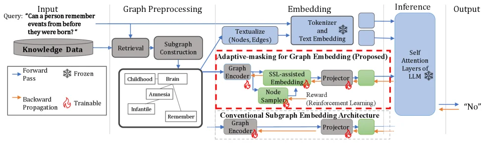
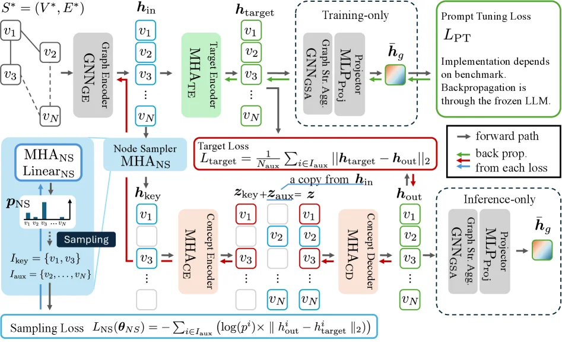
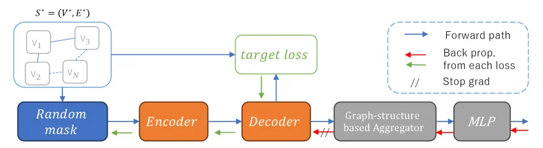
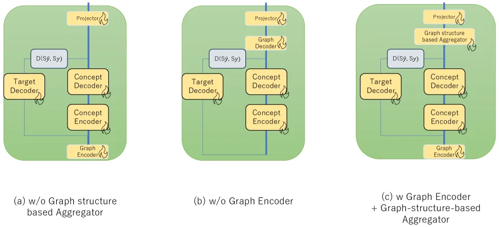
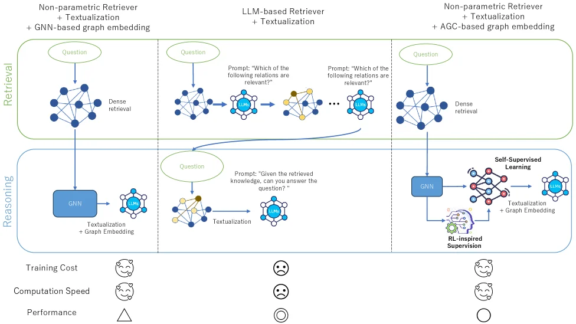

# AGE: Adaptive-masking for Graph Embedding in Graph Retrieval-Augmented Generation

[arXiv](https://arxiv.org/abs/2607.00052) · [HuggingFace](https://huggingface.co/papers/2607.00052) · ▲2

## 摘要（原文）

> GraphRAG is an extension of retrieval-augmented generation (RAG) that supports large language models (LLMs) by referring to graph-structured data as external knowledge. While this technique ideally captures intricate relationships, it often struggles with graph representations for LLMs, particularly for frozen LLMs, due to the misalignment between graph-based and text-based latent features. We tackle this issue by introducing the {\it Adaptive-masking for Graph Embedding (AGE)}. AGE employs a Transformer in a mask-based self-supervised learning (SSL) approach. We designed the architecture similar to text embedding encoders, addressing the latent feature misalignment. In contrast to natural language texts, graphs are concise representations, and there exist {\it key nodes} that hold dominant contextual information, which are challenging to predict from their surroundings. Masking such key nodes leads to inefficiency in the SSL process. Therefore, AGE focuses on predicting nodes apart from key nodes, utilizing a learnable node sampler. Our experimental results indicate that AGE significantly improves approaches using non-parametric search component in GraphQA tasks, achieving superior accuracy across four benchmark datasets with distinct characteristics.

## 摘要（中译）

GraphRAG 是检索增强生成（retrieval - augmented generation，RAG）的一种扩展，它通过将图结构化数据作为外部知识来支持大语言模型（large language models，LLMs）。虽然从理论上来说，这种技术能够捕捉复杂的关系，但由于基于图的潜在特征和基于文本的潜在特征之间的不匹配，它在为 LLMs（尤其是冻结的 LLMs）处理图表示时常常会遇到困难。我们通过引入{\it 图嵌入的自适应掩码（Adaptive - masking for Graph Embedding，AGE）}来解决这个问题。AGE 采用基于掩码的自监督学习（self - supervised learning，SSL）方法的 Transformer。我们将该架构设计得类似于文本嵌入编码器，以解决潜在特征的不匹配问题。与自然语言文本不同，图是简洁的表示，并且存在{\it 关键节点}，这些节点包含主导的上下文信息，很难从其周围环境中预测这些信息。对这样的关键节点进行掩码会导致 SSL 过程效率低下。因此，AGE 利用一个可学习的节点采样器，专注于预测除关键节点之外的节点。我们的实验结果表明，AGE 显著改进了在 GraphQA 任务中使用非参数搜索组件的方法，在具有不同特征的四个基准数据集上实现了卓越的准确性。

## 背景剖析

### 背景剖析  

**1. 技术背景**  
大型语言模型（LLMs）如GPT、Claude等已显著提升自然语言处理能力，但它们依赖预训练数据，难以直接处理特定领域的结构化知识（如图谱中的实体关系）。为解决这一问题，检索增强生成（RAG）技术通过引入外部知识增强LLMs，但传统RAG在处理复杂关系时效率有限。图增强生成（GraphRAG）应运而生，它利用图结构数据（节点和边）来捕捉实体间的关联，从而提升搜索精度和推理能力。例如，在医疗或法律领域，图谱可直观表示疾病与症状、法规与案例的关系，帮助LLMs更准确地生成决策建议。然而，如何让LLMs有效理解图谱的结构性信息仍是挑战。  

**2. 之前的问题**  
现有方法分为两类：一类通过微调LLMs提升性能，但成本高昂；另一类依赖非参数检索器（如基于LLM或图神经网络的检索器），虽然高效，但可能遗漏关键节点或包含冗余信息。此外，图谱嵌入（将图结构转换为LLMs可理解的文本表示）存在“特征不对齐”问题——图谱的结构性特征与文本的语义特征难以匹配，导致检索到的信息无法被LLMs有效利用。例如，随机掩盖图谱节点的传统方法会破坏关键节点（如核心实体），降低表示质量。  

**3. 本文的解法**  
本文提出自适应掩盖图谱嵌入（AGE），通过以下思路解决问题：  
- **模仿文本嵌入机制**：借鉴LLMs中基于掩盖的自监督学习（SSL），设计类似文本编码器的架构，对齐图谱与文本的潜在特征空间。  
- **选择性掩盖节点**：引入强化学习（RL）训练的节点采样器，区分“关键节点”（如核心实体）和“辅助节点”（如次要关系），仅掩盖辅助节点以避免破坏图谱完整性。  
- **结合JEPA框架**：通过联合嵌入预测架构（JEPA）优化表示，减少冗余信息，提升检索效率。  

**4. 切入角度**  
与以往工作不同，AGE的关键创新在于：  
- **针对冻结LLMs的优化**：无需微调LLMs，通过改进图谱嵌入模块实现对结构化知识的更好理解。  
- **自适应掩盖策略**：相比随机掩盖，RL引导的掩盖更智能，能识别并保留关键节点，提升表示质量。  
- **非参数检索的高效性**：在保持低计算成本的同时，通过图谱嵌入增强检索准确性，达到或超越现有SOTA方法。  

这一方法为GraphRAG在复杂任务（如图谱问答）中的应用提供了更高效、更精准的解决方案。

## 方法图解

> Figure 1 : Overview of GraphRAG with the proposed Adaptive-masking for Graph Embedding (AGE) embedding. 1) Retrieval: Find graph elements relevant to the query using a non-parametric process. 2) Subgraph Construction: Extend retrieved graph elements with their adjacencies [ G-Retriever ] . 3) Embedding: Use tokenizer and text embedder for textualized graph and query. Apply AGE for structured relationships of the graph. 4) Inference: Input embeddings into LLM to generate an answer.

这张图展示了论文《AGE: Adaptive-masking for Graph Embedding in Graph Retrieval-Augmented Generation》中提出的GraphRAG框架，特别是其核心创新点——自适应掩码图嵌入（Adaptive-masking for Graph Embedding, AGE）的整体工作流程。

首先，我们从图的左侧开始。输入部分是一个“Query”（查询），例如图中的例子：“Can a person remember events from before they were born?”（一个人能记住出生前的事情吗？）。这个查询指向一个名为“Knowledge Data”（知识数据）的数据库。数据流动的起点是“Retrieval”（检索）模块，它使用非参数化过程从知识数据中找到与查询相关的图元素。这对应了caption中提到的第一步：检索相关图元素。

接下来是“Subgraph Construction”（子图构建）模块。它的作用是根据检索到的图元素及其邻接关系来扩展这些元素，形成一个更完整的子图。这在caption中被描述为第二步：使用G-Retriever扩展检索到的图元素及其邻接关系。图中用一个包含“Childhood”（童年）、“Brain”（大脑）、“Amnesia”（失忆症）、“Infantile”（婴儿期的）和“Remember”（记住）等节点的图结构来表示这个子图。

然后，数据和信息流向“Embedding”（嵌入）阶段。这个阶段分为两个主要路径：
1.  **文本路径**：子图和查询首先经过“Textualize (Nodes, Edges)”（文本化节点和边）处理，将图结构转换为文本形式。然后，这些文本通过“Tokenizer and Text Embedding”（分词器和文本嵌入）模块，将其转换为向量表示。这部分处理与传统的RAG方法类似。
2.  **图结构路径（核心创新AGE）**：这是图中用红色虚线框标出的“Adaptive-masking for Graph Embedding (Proposed)”（提出的自适应掩码图嵌入）部分。这个路径旨在解决图结构数据与文本数据潜在特征不对齐的问题，特别是针对冻结的语言模型（LLMs）。
    *   首先，子图进入“Graph Encoder”（图编码器）。
    *   然后，它利用一个“Learnable Node Sampler”（可学习的节点采样器）来选择需要处理的节点。根据论文，AGE专注于预测非关键节点，因为关键节点包含主导上下文信息，难以从其周围环境中预测，直接掩码关键节点会导致SSL过程效率低下。
    *   接下来，使用“SSL-assisted Embedding”（自监督学习辅助嵌入）模块。这里的SSL（Self-Supervised Learning，自监督学习）方法类似于文本嵌入编码器，旨在解决图和文本潜在特征的不对齐问题。
    *   嵌入结果通过“Projector”（投影器）进行处理，以匹配后续模块的输入要求。
    *   图中还显示了一个“Reward (Reinforcement Learning)”（奖励/强化学习）的反馈循环，这表明该过程可能涉及强化学习来优化节点采样或嵌入策略。

在“Embedding”阶段的下方，还有一个对比部分，标注为“Conventional Subgraph Embedding Architecture”（传统的子图嵌入架构）。它也包含“Graph Encoder”和“Projector”，但没有AGE的创新组件（如可学习的节点采样器和SSL辅助嵌入），这突出了AGE改进的地方。

最后，所有处理后的嵌入（包括来自文本路径和AGE图路径的嵌入）被输入到“Inference”（推理）阶段的“Self Attention Layers of LLM”（LLM的自注意力层）。这个LLM的参数是“Frozen”（冻结的），意味着在推理过程中其权重不会更新。LLM结合这些嵌入信息生成最终的“Output”（输出），在图中示例的输出是“No”（否）。

整个流程中的箭头表示数据或信息的流动方向。图例解释了不同类型的箭头：蓝色箭头表示“Forward Pass”（前向传播），橙色箭头表示“Backward Propagation”（反向传播），雪花图标表示“Frozen”（冻结的，即参数不更新），火焰图标表示“Trainable”（可训练的，即参数会更新）。

总结来说，这张图清晰地展示了GraphRAG框架如何通过检索相关图数据、构建子图、然后将这些图数据通过传统的文本嵌入路径和创新的自适应掩码图嵌入（AGE）路径进行处理，最终将所有嵌入信息输入到冻结的LLM中进行推理，以生成答案。AGE的核心在于通过SSL和可学习的节点采样来更好地对齐图结构和文本的潜在特征，从而提高冻结LLM在基于图的知识增强任务中的性能。

---

> Figure 2 : Architecture for Adaptive-masking for Graph Embedding: During training, 𝒉 target {\bm{h}}_{\text{target}} is connected to the downstream for the target encoder training, while 𝒉 out {\bm{h}}_{\text{out}} is used during inference. The node sampler explores the optimal distribution for mask-based SSL for graphs. The loss functions train distinct sets of modules without overlap.

这张图展示了论文《AGE: Adaptive-masking for Graph Embedding in Graph Retrieval-Augmented Generation》中提出的“自适应掩码图嵌入（Adaptive-masking for Graph Embedding, AGE）”方法的架构。该方法旨在解决图检索增强生成（GraphRAG）中图表示与语言模型（特别是冻结的语言模型）潜在特征不匹配的问题。

**数据流动与组件解析：**

1.  **输入与初始编码（左上角）：**
    *   图结构 `S* = (V*, E*)` 作为输入，其中 `V*` 是节点集合（如 `v1, v2, ..., vN`），`E*` 是边集合。
    *   这些图数据首先通过一个 **Graph Encoder (GNNE)**（图神经网络编码器），生成初始的节点表示 `h_in`。`h_in` 是一个向量序列，每个元素对应一个节点（`v1` 到 `vN`）的表示。

2.  **目标编码器与训练路径（中上部）：**
    *   `h_in` 的一部分（或全部，取决于掩码策略）被送入 **Target Encoder (MHATE)**（目标编码器，这里MHATE可能指Multi-Head Attention Target Encoder）。这个编码器处理后得到 `h_target`，即目标节点表示。
    *   在训练阶段，`h_target` 会流向一个“Training-only”（仅训练）的模块，该模块包含 **GNN Str Agg**（图神经网络结构聚合）、**MLP Proj**（多层感知机投影）和 **Projector**（投影器），最终输出 `ĝ`。这个 `ĝ` 用于计算 **Prompt Tuning Loss (L_PT)**，该损失的实现依赖于基准测试，并且反向传播是通过冻结的LLM进行的。

3.  **节点采样器（左中部）：**
    *   **Node Sampler (MHA_NS, Linear_NS)**（节点采样器）是AGE的核心组件之一。它根据 `h_in` 生成一个采样分布 `p_NS`。
    *   采样过程确定了两个节点集合：`I_key`（关键节点集，如图中示例 `I_key = {v1, v3}`）和 `I_aux`（辅助节点集，如图中示例 `I_aux = {v2, ..., vN}`）。关键节点被认为是包含主导上下文信息且难以从其周围预测的节点，而辅助节点则是用于预测的。

4.  **掩码自监督学习（中部）：**
    *   基于采样得到的 `I_aux`，`h_in` 中对应于 `I_aux` 的节点表示（如图中 `v2, ..., vN` 的 `h_in`）被送入 **Concept Encoder (MHACE)**（概念编码器）。同时，`h_in` 中对应于 `I_key` 的节点表示（`v1, v3` 的 `h_in`）被作为 `z_key`。
    *   **Concept Decoder (MHACD)**（概念解码器）接收来自 `MHACE` 的输出（结合了 `z_key` 和 `z_aux` 形成的 `z`）以及 `h_in` 中 `I_key` 节点的表示（作为条件或参考），并尝试重建 `h_out`，即辅助节点的预测表示。
    *   **Target Loss (L_target)**：计算 `h_target`（来自目标编码器）与 `h_out`（来自概念解码器）之间的差异。这个损失用于训练目标编码器和概念编码器/解码器相关的模块。
    *   **Sampling Loss (L_NS(θ_NS))**：这个损失与节点采样器相关。它基于采样概率 `p_NS` 和 `h_out` 与 `h_target` 之间的差异来优化采样器的参数 `θ_NS`，以找到最优的掩码策略。

5.  **推理路径（右下角）：**
    *   在推理阶段，使用 `h_out`（来自概念解码器）而不是 `h_target`。`h_out` 同样会流向“Training-only”模块中的相同下游组件（GNN Str Agg, MLP Proj, Projector），最终输出 `ĝ` 用于下游任务（如图检索或问答）。

**方法运作机制：**

*   **核心思想：** AGE通过一种掩码自监督学习方法来训练图嵌入，以解决图表示与LLM潜在特征的不匹配问题。它不是随机掩码节点，而是专注于预测非关键节点（辅助节点），因为关键节点信息丰富且难以预测。
*   **节点采样：** 节点采样器学习一个分布，以确定哪些节点是关键的（不应被掩码或用于预测），哪些是辅助的（应用于掩码预测）。这通过采样损失进行优化。
*   **双编码器结构：** 目标编码器处理原始图信息以生成目标表示 `h_target`，而概念编码器和解码器则处理被掩码的辅助节点信息并尝试重建 `h_out`。
*   **损失函数：** 目标损失确保 `h_out` 尽可能接近 `h_target`，从而学习到有效的图表示。采样损失则优化节点采样策略，以提高SSL过程的效率。
*   **下游应用：** 训练好的图表示（`h_out` 或通过Projector得到的 `ĝ`）可以作为外部知识输入到LLM中，用于图检索增强生成任务。

**总结：**
这张图详细展示了AGE方法的架构，包括从图输入到最终表示生成的整个流程。它强调了通过自适应节点采样和掩码自监督学习来解决图表示与LLM不匹配问题的核心思想。通过分离关键节点和辅助节点，并专注于预测后者，AGE旨在学习更有效的图嵌入，以提高GraphRAG在各种任务上的性能。

---

> Figure H.7 : Adaptive-masking for Graph Embedding in Generation Architecture: The node embedding module is trained on both prompt tuning loss and target loss.

这张图展示了论文《AGE: Adaptive-masking for Graph Embedding in Graph Retrieval-Augmented Generation》中提出的“自适应掩码图嵌入生成架构”（Adaptive-masking for Graph Embedding in Generation Architecture）。该架构的核心是一个节点嵌入模块，它通过提示调优损失（prompt tuning loss）和目标损失（target loss）进行训练。

让我们详细解析图中的各个组件及其数据流：

1.  **输入图结构 (S* = (V, E))**:
    *   图的左上角显示了一个图结构 S*，其中 V 代表节点集合（如图中的 v1, v2, v3, ..., vN），E 代表边集合。这是方法的输入数据，即需要处理的图结构化知识。

2.  **随机掩码 (Random mask)**:
    *   输入图首先经过一个“随机掩码”模块。这个模块的作用是根据某种策略（在论文中是“可学习的节点采样器”）选择一部分节点进行掩码。根据论文描述，AGE 方法不是随机掩码所有节点，而是专注于掩码那些“非关键节点”，因为关键节点的信息难以从其周围环境预测，直接掩码它们会导致自监督学习过程效率低下。因此，这个模块负责选择要预测的目标节点。

3.  **编码器 (Encoder)**:
    *   被掩码后的图（或节点特征）被送入“编码器”。编码器的结构类似于文本嵌入编码器，其目的是将图中的节点转换为低维向量表示（嵌入）。这个过程是模型学习图节点特征的关键步骤。

4.  **解码器 (Decoder)**:
    *   编码器输出的节点嵌入被传递给“解码器”。解码器的任务是根据编码器提供的上下文信息（即未被掩码的节点信息和掩码节点的上下文）来预测被掩码节点的特征或标签。这是一个典型的自监督学习任务。

5.  **目标损失 (target loss)**:
    *   解码器的预测结果与真实的节点信息（或目标）进行比较，计算出“目标损失”。这个损失函数衡量了解码器预测的准确性，并用于指导模型的学习。箭头显示目标损失会反向传播回解码器和编码器，以更新它们的参数。

6.  **图结构聚合器 (Graph-structure based Aggregator)**:
    *   在解码器之后，有一个“图结构聚合器”。这个组件的作用是将解码器处理后的节点嵌入与原始图的结构信息（如邻接关系）进行聚合或融合。这一步骤是为了更好地利用图的结构特性来增强节点表示。

7.  **多层感知机 (MLP)**:
    *   图结构聚合器的输出被送入一个“多层感知机”（MLP）。MLP 通常用于对聚合后的特征进行进一步的非线性变换和映射，可能用于生成最终的输出表示或用于提示调优任务。

8.  **提示调优损失 (prompt tuning loss)**:
    *   虽然图中没有明确标出“提示调优损失”的计算位置，但根据图的标题和描述，MLP 的输出或其某个中间结果会用于计算“提示调优损失”。这个损失函数与提示调优任务相关，旨在使模型生成的嵌入更适合特定的下游任务。

9.  **数据流和梯度流**:
    *   **前向传播 (Forward path)**: 蓝色箭头表示数据的流动方向。从输入图 -> 随机掩码 -> 编码器 -> 解码器 -> 图结构聚合器 -> MLP。这是模型处理输入并生成输出的过程。
    *   **反向传播 (Back prop.)**: 红色箭头表示梯度的流动方向。从目标损失反向传播到解码器和编码器，以及从提示调优损失（隐含地）反向传播到 MLP 和可能的图结构聚合器。这是模型参数更新的依据。
    *   **来自每个损失的梯度 (from each loss)**: 绿色箭头表示目标损失对编码器的反向传播路径。
    *   **停止梯度 (Stop grad)**: 双斜杠 (//) 表示在某个点停止梯度的传播。在图中，这个符号位于解码器到图结构聚合器的连接上。这意味着在计算图结构聚合器或后续 MLP 的梯度时，不会考虑解码器的梯度。这可能是为了隔离不同部分的训练目标，或者防止某些信息干扰。

**方法运作机制总结**:
AGE 方法通过以下步骤运作：
*   首先，接收一个图结构作为输入。
*   然后，使用一个可学习的策略（随机掩码模块）选择一部分“非关键”节点进行掩码。
*   接着，将这些被部分掩码的图输入到一个类似于文本嵌入编码器的编码器中，以获取节点的嵌入表示。
*   解码器尝试根据这些嵌入表示重建被掩码的节点信息，产生的误差通过目标损失来衡量，并用于更新编码器和解码器。
*   同时，解码器的输出会经过图结构聚合器，将节点嵌入与图的结构信息融合。
*   融合后的特征会输入到 MLP 中，MLP 的输出用于计算提示调优损失，以进一步优化模型，使其生成的嵌入更适合特定的下游任务（如图检索增强生成）。
*   整个过程是一个自监督学习过程，通过最小化目标损失和提示调优损失来训练模型的节点嵌入模块。

这张图清晰地展示了 AGE 方法如何将图结构数据转换为适合大型语言模型（LLMs）使用的嵌入表示，通过解决图基特征与文本基特征之间的不对齐问题，并专注于预测非关键节点来提高自监督学习的效率。

---

> Figure H.6 : Investigation of core component arrangement: We tested our JEPA [ LeCun2022APT ] architecture with three different GNN arrangements, including (a) graph encoder only, (b) graph-structure-based aggregator only, and (c) both of them.

这张图（图H.6）展示了作者对其JEPA架构（参考LeCun2022APT的工作）进行的三种不同图神经网络（GNN）组件排列的实验性研究，旨在探究核心组件的配置对模型性能的影响。

首先，我们来理解图中各个组件的含义以及数据的流动方向：

1.  **Graph Encoder（图编码器）**：位于每个子图的最底部，通常用一个浅黄色矩形表示，并带有火焰图标（可能表示计算或训练）。它的作用是将输入的图结构数据（节点和边）转换为低维的向量表示（即图嵌入）。在图(a)中，它存在但后续没有连接到聚合器；在图(b)中，它被移除了；在图(c)中，它存在并连接到聚合器。

2.  **Concept Encoder（概念编码器）**：位于Graph Encoder的上方（如果Graph Encoder存在的话），同样用浅黄色矩形表示，带有火焰图标。它可能负责进一步处理由Graph Encoder生成的图嵌入，或者直接处理与概念相关的信息。它在所有三个子图中都存在。

3.  **Concept Decoder（概念解码器）**：位于Concept Encoder的上方，浅黄色矩形，带有火焰图标。它的作用是从Concept Encoder的输出中解码出有意义的信息，可能是为了重建输入或预测某些缺失部分。

4.  **Target Decoder（目标解码器）**：位于Concept Decoder的左侧，浅黄色矩形，带有火焰图标。它可能负责解码特定的目标信息，与Concept Decoder协同工作。

5.  **D(Sy, Sy)**：这是一个蓝色的矩形模块，连接Target Decoder和Concept Decoder。它可能代表某种距离度量或比较函数，用于评估Target Decoder和Concept Decoder输出之间的相似性或差异。

6.  **Projector（投影器）**：位于每个子图的最顶部，浅黄色矩形，带有火焰图标。它的作用是将解码器或其他组件的输出投影到一个特定的空间，以便进行比较或进一步处理。

7.  **Graph-structure based Aggregator（基于图结构的聚合器）**：在图(a)中不存在，在图(b)中位于Projector和Concept Decoder之间，在图(c)中位于Projector下方、Concept Decoder上方。它负责根据图的结构信息对输入进行聚合或处理。

现在我们详细分析每个子图（a, b, c）所代表的架构配置及其信息流动：

*   **图(a)：w/o Graph structure based Aggregator（没有基于图结构的聚合器）**
    *   数据流动顺序：输入数据首先通过`Graph Encoder`进行处理。然后，`Graph Encoder`的输出传递给`Concept Encoder`。`Concept Encoder`的输出再传递给`Concept Decoder`和`Target Decoder`。`Target Decoder`和`Concept Decoder`的输出被送入`D(Sy, Sy)`进行比较。最后，`Concept Decoder`的输出（或经过D比较后的结果）被送入顶部的`Projector`。
    *   这个配置的特点是只有`Graph Encoder`，而没有专门的`Graph-structure based Aggregator`。这意味着图结构信息的处理可能仅限于`Graph Encoder`阶段，或者在后续阶段以不同的方式处理。

*   **图(b)：w/o Graph Encoder（没有图编码器）**
    *   数据流动顺序：在这个配置中，`Graph Encoder`被移除了。输入数据直接（或缺少图结构编码的步骤）进入`Concept Encoder`。之后的流程与图(a)类似：`Concept Encoder`的输出传递给`Concept Decoder`和`Target Decoder`，然后经过`D(Sy, Sy)`比较，最后由`Projector`处理。此外，在`Projector`和`Concept Decoder`之间增加了一个`Graph-structure based Aggregator`。
    *   这个配置的特点是只有`Graph-structure based Aggregator`，而没有`Graph Encoder`。这意味着模型尝试在不进行显式图编码的情况下，利用聚合器来处理图结构信息。

*   **图(c)：w Graph Encoder + Graph-structure based Aggregator（有图编码器和基于图结构的聚合器）**
    *   数据流动顺序：输入数据首先通过`Graph Encoder`进行处理。然后，`Graph Encoder`的输出传递给`Concept Encoder`。`Concept Encoder`的输出传递给`Concept Decoder`和`Target Decoder`。`Target Decoder`和`Concept Decoder`的输出被送入`D(Sy, Sy)`进行比较。同时，`Concept Decoder`的输出（或经过D比较后的结果）以及可能的`Graph Encoder`的输出会被送入`Graph-structure based Aggregator`。最后，`Graph-structure based Aggregator`的输出被送入顶部的`Projector`。
    *   这个配置结合了`Graph Encoder`和`Graph-structure based Aggregator`，旨在充分利用两者来处理图结构数据。

这张图揭示了该方法的具体运作方式是通过比较三种不同的GNN组件排列来评估它们对模型性能的影响。作者通过实验测试了JEPA架构在以下三种情况下的表现：
1.  仅使用图编码器（图a）。
2.  仅使用基于图结构的聚合器（图b）。
3.  同时使用图编码器和基于图结构的聚合器（图c）。

通过这种对比实验，作者可以分析不同组件组合如何影响模型对图结构数据的理解和处理能力，从而验证其提出的AGE方法中各个组件的重要性。虽然图中没有直接显示结果，但结合论文摘要，我们可以推断这些实验是为了优化模型，使其更好地将图结构数据作为外部知识融入到生成过程中，解决冻结LLMs中图表示与文本特征不对齐的问题。实验结果表明，AGE方法显著提高了使用非参数搜索组件的GraphQA任务的准确性。

---

> Figure H.13 : The landscape of existing KGQA methods. GNN-based methods reason on dense subgraphs as they can handle complex and graph information. LLM-based methods employ the same LLM for both retrieval and reasoning due to its ability to understand natural language.

这张图展示了三种不同的知识图谱问答（KGQA）方法的架构和工作流程，旨在比较它们在检索（Retrieval）和推理（Reasoning）阶段的处理方式，以及它们在训练成本、计算速度和性能方面的表现。

图的结构分为上下两部分：上半部分是“检索”阶段，下半部分是“推理”阶段。图中有三个主要的列，分别代表三种不同的方法：

1. **第一列（左）：非参数检索器 + 文本化 + 基于GNN的图嵌入**
   - **检索阶段**：问题（Question）输入到一个密集检索（Dense retrieval）模块，该模块处理一个图结构（由蓝色节点和边组成）。检索结果传递给一个GNN模块，进行文本化和图嵌入处理，然后输入到LLM进行推理。
   - **推理阶段**：GNN模块对检索到的子图进行处理，提取关键信息，然后传递给LLM进行最终答案生成。
   - **性能指标**：训练成本低（笑脸图标），计算速度快（笑脸图标），但性能一般（三角形图标）。

2. **第二列（中）：基于LLM的检索器 + 文本化**
   - **检索阶段**：问题输入到一个LLM模块，LLM通过提示（Prompt）“Which of the following relations are relevant?”来检索相关的图结构（由黄色和蓝色节点组成）。这个过程可能会迭代多次（由省略号表示），每次迭代都使用LLM来细化检索结果。
   - **推理阶段**：检索到的图结构再次通过提示“Given the retrieved knowledge, can you answer the question?”输入到LLM，LLM结合检索到的知识生成最终答案。
   - **性能指标**：训练成本高（哭脸图标），计算速度慢（哭脸图标），但性能较好（圆形图标）。

3. **第三列（右）：非参数检索器 + 文本化 + 基于AGC的图嵌入**
   - **检索阶段**：问题输入到一个密集检索模块，处理图结构。检索结果传递给一个GNN模块，进行文本化和图嵌入处理。这里引入了自监督学习（Self-Supervised Learning）和强化学习启发的监督（RL-inspired Supervision），以优化图嵌入过程。
   - **推理阶段**：GNN模块处理检索到的子图，结合自监督学习和强化学习启发的监督，提取关键信息，然后传递给LLM进行最终答案生成。
   - **性能指标**：训练成本低（笑脸图标），计算速度快（笑脸图标），性能最好（圆形图标）。

图中还展示了数据或信息的流动顺序：
- 在检索阶段，问题首先输入到相应的检索模块（密集检索或LLM检索），然后检索到的图结构传递给GNN模块进行处理。
- 在推理阶段，GNN模块处理后的信息传递给LLM，LLM结合检索到的知识和提示生成最终答案。

这张图揭示了三种方法的具体运作方式：
- 第一种方法使用非参数检索器和GNN进行图嵌入，适用于处理复杂图信息，但性能一般。
- 第二种方法使用基于LLM的检索器，能够理解自然语言，但训练成本和计算速度较高。
- 第三种方法结合了非参数检索器、文本化和基于AGC的图嵌入，通过自监督学习和强化学习启发的监督优化图嵌入过程，实现了低训练成本、高计算速度和高性能。

通过这张图，读者可以清楚地看到每种方法的优缺点，并理解它们在KGQA任务中的表现差异。
