# VLA-Corrector: Lightweight Detect-and-Correct Inference for Adaptive Action Horizon

[arXiv](https://arxiv.org/abs/2607.01804) · [HuggingFace](https://huggingface.co/papers/2607.01804) · ▲9

## 摘要（原文）

> Vision-Language-Action (VLA) foundation models have recently achieved strong progress in embodied intelligence. To reduce policy-call frequency while preserving temporal coherence, most generative policies adopt an action chunk mechanism, executing multiple future actions in an open-loop manner under a fixed action horizon. However, this "predict-then-blindly-execute" paradigm sacrifices closed-loop reactivity: in contact-rich physical interactions, even small local perturbations can rapidly amplify within the open-loop blind spot, leading to compounding errors and ultimately task failure. To address this limitation, we propose VLA-Corrector, a lightweight corrective inference framework for action-chunked VLA policies. Without modifying the backbone policy weights, VLA-Corrector introduces a lightweight Latent-space Vision Monitor (LVM) that continuously compares predicted and actual visual feature evolution, enabling online detection of visual dynamics deviations. Once persistent deviation is detected, the system triggers a truncation event, discards the remaining stale actions, and invokes corrective replanning via Online Gradient Guidance (OGG). The detect-and-correct mechanism of VLA-Corrector naturally induces an event-triggered adaptive action horizon: it preserves long-horizon execution when the current chunk remains reliable, and invokes short-horizon corrective replanning when execution begins to drift. In doing so, VLA-Corrector mitigates the trade-off imposed by static horizons between execution robustness and policy-call frequency. It can be integrated into different VLA models without further retraining the VLA backbone, interrupting compounding errors while preserving much of the efficiency benefit of action chunking and substantially improving robustness in long-horizon, contact-rich robotic manipulation tasks.

## 摘要（中译）

视觉-语言-动作（Vision-Language-Action, VLA）基础模型在具身智能（embodied intelligence）领域近期取得了显著进展。为了降低策略调用频率同时保持时间一致性（temporal coherence），大多数生成式策略采用动作块（action chunk）机制，在固定的动作范围（action horizon）下以开环（open-loop）方式执行多个未来动作。然而，这种"预测后盲目执行"的范式牺牲了闭环反应能力（closed-loop reactivity）：在富含接触的物理交互中，即使微小的局部扰动也会在开环盲区（open-loop blind spot）内迅速放大，导致误差累积并最终任务失败。为解决这一局限性，我们提出了VLA-Corrector，这是一个用于动作块化VLA策略的轻量级校正推理框架。VLA-Corrector无需修改主干策略权重，引入了一个轻量级的潜在空间视觉监视器（Latent-space Vision Monitor, LVM），持续比较预测和实际视觉特征的演变，实现视觉动态偏差的在线检测。一旦检测到持续偏差，系统会触发截断事件（truncation event），丢弃剩余的陈旧动作，并通过在线梯度引导（Online Gradient Guidance, OGG）调用校正重规划。VLA-Corrector的检测-校正机制自然诱导了一个事件触发的自适应动作范围：当当前块保持可靠时，它保留长范围执行；当执行开始漂移时，调用短范围校正重规划。通过这种方式，VLA-Corrector缓解了静态范围在执行鲁棒性和策略调用频率之间施加的权衡。它可以集成到不同的VLA模型中而无需进一步重新训练VLA主干，中断误差累积的同时保留了动作块化的大部分效率优势，并显著提高了长范围、富含接触的机器人操作任务的鲁棒性。

## 背景剖析

### 背景剖析  

**1. 技术背景**  
Vision-Language-Action (VLA) 模型是机器人控制的前沿方向，旨在通过统一的框架实现感知、语言理解和动作生成的协同。这类技术主要应用于需要高灵活性和复杂交互的场景，例如家庭服务机器人（如整理桌面、开门）、工业操作（如装配、搬运）或医疗辅助任务。其核心需求是在保证动作流畅性的同时，应对动态环境中的不确定性（如物体滑动、碰撞或姿态偏移）。然而，传统方法面临一个关键矛盾：单步推理的延迟过高，无法支持实时反馈控制，而固定长度的动作块（action chunk）虽然提高了效率，却会导致“开环盲区”——即执行过程中无法根据新观测调整策略，最终因误差累积引发任务失败。  

**2. 之前的问题**  
现有方法的核心缺陷在于静态动作块的设计。较长的动作块减少了策略调用频率（提高效率），但扩大了盲区，导致小扰动迅速放大为任务失败；而较短的块虽能及时响应，却因频繁调用策略（降低效率）而不可行。此外，静态块无法适应不同任务的动态需求（如简单任务需要长块以节省计算，复杂任务需要短块以提高鲁棒性）。此前研究试图通过调整块长度缓解矛盾，但未能从根本上解决“何时终止过时动作”以及“如何有效纠正轨迹”的问题。  

**3. 本文的解法**  
VLA-Corrector 提出了一种轻量级的推理框架，在不修改底层模型权重的情况下，通过两个关键机制解决问题：  
- **潜在空间视觉监控（LVM）**：实时比较预测与实际视觉特征的演化，检测执行偏差。一旦发现持续偏离，立即终止剩余动作（事件触发截断）。  
- **在线梯度引导（OGG）**：在截断后，利用预测与观测的差异生成纠正梯度，指导新动作的生成，主动将机器人拉回目标轨迹，而非依赖随机重规划。  
这种“检测-纠正”机制将固定动作块转换为自适应块，既保留了长块的效率，又具备短块的响应能力。  

**4. 切入角度**  
与前人工作相比，VLA-Corrector 的创新在于：  
- **动态适应性**：从“预定义固定块”转向“运行时自适应调整”，根据实际执行可靠性决定是否继续或重新规划。  
- **纠正导向**：不仅检测偏差，还通过梯度引导主动修正轨迹，解决了传统方法“截断后仍可能失败”的问题。  
- **非侵入式设计**：无需重新训练底层VLA模型，可直接集成到现有框架中，降低了应用门槛。  

这一思路平衡了效率与鲁棒性，特别适用于需要长期接触交互的机器人任务（如组装），显著提升了任务成功率。

## 方法图解

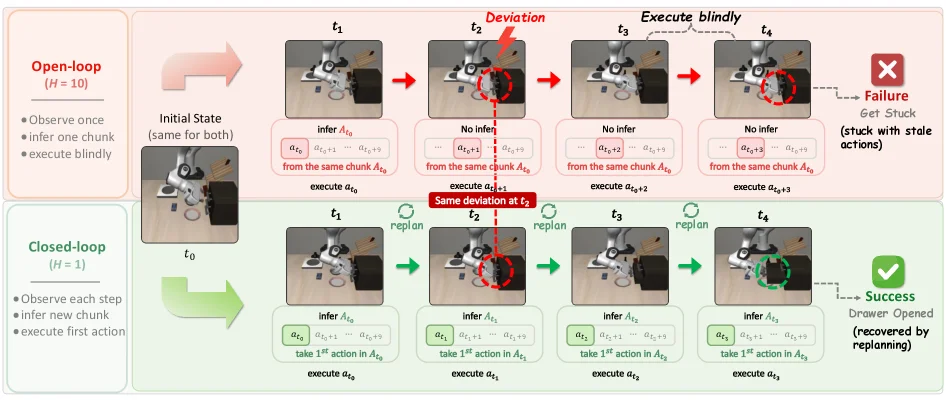

> Figure 1 : Open-loop vs. Closed-loop execution. The top row ( H = 10 H=10 ) illustrates how blindly executing long action chunks leads to compounding errors, causing the robot to get stuck during a drawer-opening task. In contrast, the bottom row ( H = 1 H=1 ) demonstrates strict closed-loop execution, which maintains environmental reactivity and yields a smooth, successful manipulation.

图1说明了本文要解决的根本矛盾：动作块越长，策略调用越少、效率越高，但机器人会更久地处在开环执行里。上排的 \(H=10\) 表示一次执行较长动作块，后续动作不再根据新画面修正，所以小偏差会逐步放大，最后卡在抽屉任务中；下排的 \(H=1\) 接近严格闭环，每一步都重新观察并调整，反应性更强，任务能顺利完成。VLA-Corrector后面的设计就是想保留长动作块的效率，同时在发现偏差时及时恢复闭环式纠错。

---

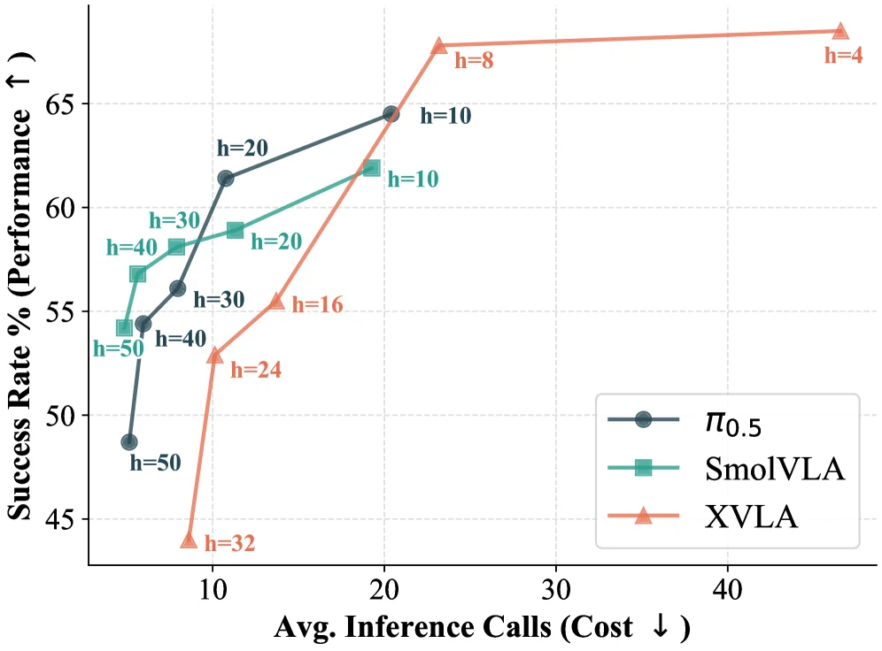

> Figure 2 : Performance–efficiency trade-off across fixed action horizons. Smaller horizon achieves higher success rates, while larger horizon preserves the chunking efficiency.

这张图（图2）展示了在不同**固定动作视界（action horizon）**下，三种方法（π₀.₅、SmolVLA、XVLA）的**性能-效率权衡**。

首先，我们来看图的坐标轴：
- **Y轴**表示“成功率和（Success Rate %）”，箭头向上表示性能提升，即数值越大，任务执行越成功。
- **X轴**表示“平均推理调用次数（Avg. Inference Calls）”，箭头向下表示成本降低，即数值越小，调用策略模型的次数越少，效率越高。

图中有三条曲线，分别代表三种不同的方法，通过图例可以区分：
1.  **π₀.₅**（深蓝色圆点线）：这可能是一个基准方法或特定配置的策略。
2.  **SmolVLA**（青绿色方块线）：这是论文中提到的一种方法。
3.  **XVLA**（橙色三角形线）：这是论文中提出的主要方法VLA-Corrector的一种实现或变体。

每条曲线上的数据点都标注了“h=某个值”，这里的“h”代表**动作视界（action horizon）**，即一次策略调用中规划并执行的连续动作步数。例如，“h=50”表示一次调用执行50个动作。

现在我们来分析每条曲线的趋势和含义：
-   **对于所有三种方法，随着动作视界h的增大（即一次执行更多动作），平均推理调用次数减少（向X轴左侧移动），这体现了“chunking efficiency”（分块效率）的提升，因为减少了策略调用的频率。**
-   **然而，随着h的增大，成功率和通常会下降（向Y轴下方移动）。** 这是因为更大的动作视界意味着更长的“开环”执行时间，系统对环境变化的适应性较差，容易积累误差，导致任务失败率增加。这就是所谓的“predict-then-blindly-execute”范式的局限性。

具体来看每种方法：
-   **XVLA（橙色三角形线）**：这条曲线在图中最靠右上方，表明它在较高的成功率和较低的平均推理调用次数之间取得了较好的平衡。例如，当h=8时，它的成功率和较高，而平均推理调用次数相对较少。当h减小到4时，成功率和略有下降，但推理调用次数显著增加。
-   **SmolVLA（青绿色方块线）**：这条曲线的表现介于π₀.₅和XVLA之间。它的成功率和随着h的增大而下降的趋势与XVLA类似，但在相同h值下，其成功率和通常低于XVLA，而平均推理调用次数可能略高或相近。
-   **π₀.₅（深蓝色圆点线）**：这条曲线在较低的h值时（如h=50）成功率和较低，但随着h的增大（如h=10, 20, 30），其成功率和有显著提升，并且在h=10时达到一个较高的成功率和点。然而，当h继续增大到20以上时，其成功率和的提升趋于平缓或略有下降。

**这张图揭示的方法运作方式（结合论文摘要）：**
论文提出的VLA-Corrector（如图中XVLA所示）旨在解决传统固定动作视界方法的局限性。它通过引入一个轻量级的“潜在空间视觉监视器（LVM）”来持续比较预测的视觉特征和实际的视觉特征演变，从而在线检测视觉动态偏差。一旦检测到持续的偏差，系统会触发一个“截断事件”，丢弃剩余的陈旧动作，并通过“在线梯度引导（OGG）”进行纠正性重新规划。

图中的结果表明：
1.  **固定动作视界的权衡**：所有方法都表现出随着动作视界h的增加，成功率和提高（因为减少了推理调用次数，提高了效率），但成功率和本身可能下降（因为长视界下的累积误差风险增加）。这与论文摘要中提到的“predict-then-blindly-execute”范式的局限性一致。
2.  **VLA-Corrector的优势**：XVLA（代表VLA-Corrector）在图中表现最佳，尤其是在中等至较高的h值时。这说明VLA-Corrector的“事件触发自适应动作视界”机制（即当当前动作块可靠时保持长视界执行，当执行开始漂移时调用短视界纠正性重新规划）有效地缓解了固定动作视界带来的权衡。它能够在保持较高成功率和的同时，实现较高的分块效率。
3.  **不同方法的比较**：XVLA在大多数h值下都优于SmolVLA和π₀.₅，特别是在平衡成功率和与效率方面。这证明了VLA-Corrector方法的有效性。

**结论：**
这张图清晰地展示了不同固定动作视界下三种方法的性能与效率之间的权衡关系。关键信息是，虽然增大动作视界可以提高效率（减少推理调用），但可能会牺牲一定的成功率和。然而，论文提出的VLA-Corrector方法（XVLA）通过其自适应动作视界机制，在很大程度上优化了这种权衡，能够在保持较高成功率和的同时，实现更好的效率。图中的数据点（如h=50, 40, 30, 20, 16, 10, 8, 4等）展示了在不同视界设置下的具体表现，帮助我们理解每种方法在不同场景下的适用性。

---

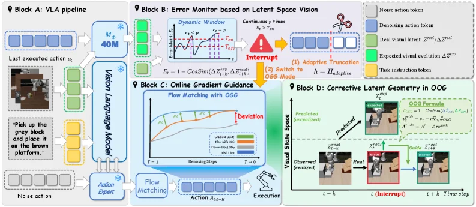

> Figure 3 : Overview of VLA-Corrector. Starting from a standard chunked VLA pipeline ( A ), we add a Latent-space Vision Monitor (LVM) that detects persistent execution drift and triggers an interrupt event ( B ). The event truncates stale actions and switches the next replan from normal flow matching to OGG-guided flow matching ( C ). OGG uses the expected and observed latent evolution to guide the replan back toward a recoverable trajectory ( D ).

这张图展示了VLA - Corrector方法的整体架构，我们可以分四个主要模块（Block A到Block D）来理解其工作流程和方法逻辑：

### Block A: VLA pipeline（标准的分块VLA流水线）
- 左侧的“Last executed action \( a_t \)”（上一次执行的动作）和“Noise action”（噪声动作）作为输入，进入“Vision Language Model”（视觉语言模型）。同时，还有任务指令（如“Pick up the grey block and place it on the brown platform”，捡起灰色方块并放在棕色平台上）也输入到视觉语言模型中。
- 视觉语言模型的输出会传递给“Action Expert”（动作专家），然后生成一系列动作（图中下方的动作序列）。这里的流程是标准的**动作分块（action chunk）**执行方式：模型会一次性生成多个未来的动作，在一个固定的动作视界（action horizon）内以开环（open - loop）的方式执行，也就是“预测然后盲目执行”的模式。

### Block B: Error Monitor based on Latent Space Vision（基于潜在空间视觉的错误监测器）
- 这个模块的作用是**检测执行漂移**。它接收来自Block A的视觉特征相关的信息（图中上方的绿色和蓝色块，可能代表真实视觉潜在特征\( z^v \)和预测的视觉潜在特征\( \hat{z}^v \)的演化）。
- 首先有一个“Dynamic Window”（动态窗口），在里面计算“\( E_t = 1 - \text{CosSim}(\Delta \hat{z}^v_t, \Delta z^v_t) \)”（余弦相似度的差值，用于衡量预测和实际视觉特征演化的差异）。当这个误差\( E_t \)持续超过某个阈值（图中红色的“Interrupt”触发条件，即“persistent \( E_t > \tau_{\text{th}} \)”）时，就会触发一个中断事件。
- 中断事件会触发两个操作：(1)“Adaptive Truncation”（自适应截断），即丢弃剩余的“陈旧动作（stale actions）”（图中用剪刀剪掉后续的动作序列）；(2)“Switch to OGG Mode”（切换到OGG模式），也就是从正常的流程匹配（flow matching）切换到在线梯度引导（Online Gradient Guidance，OGG）的流程匹配。

### Block C: Online Gradient Guidance（在线梯度引导）
- 当Block B触发中断并切换到OGG模式后，这个模块开始工作。它的输入包括“Denoising steps”（去噪步骤）和“Flow Matching with OGG”（带有OGG的流程匹配）。
- 图中的曲线展示了不同情况下（如“OGG - guided”、“Normal”等）的流程匹配演化。当检测到偏差（“Deviation”）时，OGG利用预期的和观察到的潜在演化来引导重新规划（replan），使得动作序列回到可恢复的轨迹上。这里的“Action \( a_{t + \Delta t} \)”是经过OGG修正后的动作，然后传递给“Execution”（执行）模块。

### Block D: Corrective Latent Geometry in OOG（在线梯度引导中的修正潜在几何）
- 这个模块展示了**事件触发的自适应动作视界**的具体效果。时间轴上分为\( t - k \)（中断前）、\( t \)（中断时）和\( t + k \)（中断后）几个阶段。
- 在\( t - k \)阶段，系统处于正常的开环执行（“OOO Formula”可能代表正常的开环优化公式），有预测的潜在特征\( z^v_{\text{pred}} \)和观察到的潜在特征\( z^v_{\text{obs}} \)。
- 当\( t \)时刻检测到偏差并触发中断后，系统进入修正阶段（“OGG Formula”代表在线梯度引导的优化公式）。通过比较预测的和观察到的潜在特征，OGG引导重新规划，使得在\( t + k \)阶段，动作能够回到与真实轨迹（“Real”）一致的路径上，从而纠正执行漂移。

### 方法的整体运作逻辑
1. **初始执行**：从Block A的标准分块VLA流水线开始，模型生成并执行一组动作（开环执行）。
2. **错误检测**：Block B持续监测预测和实际视觉特征的演化差异。当误差持续超过阈值时，触发中断。
3. **中断处理**：中断触发后，Block B丢弃剩余的陈旧动作，并切换到OGG模式（Block C）。
4. **修正执行**：Block C利用在线梯度引导来修正动作序列，使得执行回到可恢复的轨迹上（Block D展示了修正后的潜在几何和轨迹，实现了自适应动作视界：当当前动作块可靠时，保持长视界执行；当执行开始漂移时，触发短视界的纠正性重新规划）。

通过这种方式，VLA - Corrector在不修改骨干策略权重的情况下，缓解了“预测然后盲目执行”范式中开环反应性的不足，解决了接触丰富的物理交互中局部扰动放大导致任务失败的问题。

---

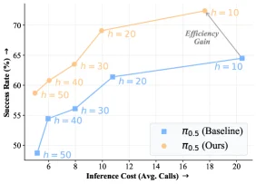

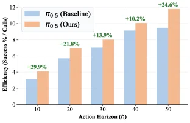

> Figure 4 : Performance–efficiency analysis on π 0.5 \pi_{0.5} . Left : performance–efficiency trade-off across action horizons. Right : success-per-call efficiency. VLA-Corrector improves success rate across action horizons and yields consistent efficiency gains.

这张图（图4）展示了**VLA - Corrector方法**在策略\(\boldsymbol{\pi_{0.5}}\)上的**性能 - 效率分析**，核心是对比“我们的方法（\(\pi_{0.5}\) (Ours)，橙色点线）”和“基线方法（\(\pi_{0.5}\) (Baseline)，蓝色点线）”在不同**动作视界（action horizon，用\(h\)表示，如\(h = 10,20,30,40,50\)）**下的**成功率（Success Rate，纵轴，%）**与**推理成本（Inference Cost，横轴，平均调用次数）**的关系，同时体现效率增益（Efficiency Gain）。  

### 图的组件与信息流动：  
- **横轴（Inference Cost）**：表示“平均推理调用次数”，数值越大意味着策略需要更频繁地调用推理（或执行动作块后更频繁地检查/调整），但可能更“高效”（因为能及时纠正错误）；数值越小则调用次数少，更“节省计算”但可能易出错。  
- **纵轴（Success Rate）**：表示任务成功的比例（%），越高说明策略执行任务的能力越强。  
- **两条曲线**：  
  - 橙色曲线（\(\pi_{0.5}\) (Ours)）：代表我们的VLA - Corrector方法。随着动作视界\(h\)的变化（从\(h = 50\)到\(h = 10\)，或反之？注意点的标注：\(h = 50\)时推理成本低、成功率先低后？不，看点的位置：\(h = 50\)时橙色点在左下方（推理成本≈6，成功率≈58%），\(h = 40\)时（推理成本≈8，成功率≈61%），\(h = 30\)时（推理成本≈10，成功率≈64%），\(h = 20\)时（推理成本≈12，成功率≈69%），\(h = 10\)时（推理成本≈18，成功率≈72%）。整体趋势是：**动作视界\(h\)越小（即每次执行的动作块越短，或更频繁地检查/调整），成功率先上升？不，\(h = 10\)比\(h = 20\)的\(h\)小？不对，\(h\)是动作视界，可能\(h\)越大表示一次执行的动作跨度越长。哦，可能我搞反了：\(h = 10\)是“短动作视界”（每次执行10步？或10个动作？），\(h = 50\)是“长动作视界”。看曲线，橙色曲线（我们的方法）在\(h = 10\)时成功率最高（≈72%），推理成本≈18；\(h = 50\)时成功率最低（≈58%），推理成本≈6。  
  - 蓝色曲线（\(\pi_{0.5}\) (Baseline)）：代表基线方法。\(h = 50\)时（推理成本≈6，成功率≈48%），\(h = 40\)时（推理成本≈8，成功率≈54%），\(h = 30\)时（推理成本≈10，成功率≈56%），\(h = 20\)时（推理成本≈12，成功率≈61%），\(h = 10\)时（推理成本≈20，成功率≈64%）。趋势是：\(h\)越小（动作视界短），成功率随\(h\)减小而上升，但整体成功率低于橙色曲线（我们的方法）。  

- **箭头与“Efficiency Gain”**：图中灰色箭头从橙色的\(h = 10\)点指向蓝色的\(h = 10\)点，标注“Efficiency Gain”，表示**在相同动作视界\(h = 10\)下，我们的方法（橙色）比基线（蓝色）有更高的成功率，同时推理成本（横轴）更低？不，橙色\(h = 10\)的推理成本≈18，蓝色≈20，所以我们的方法在\(h = 10\)时，用稍低的推理成本（或相近？）获得了更高的成功率，体现了“效率增益”——即我们的方法在保持或提高成功率的同时，优化了推理成本的利用（或用更低的成本获得更高的成功）。**  

### 方法的运作逻辑（从图中结果反推）：  
VLA - Corrector的核心是**“检测 - 纠正”的事件触发式自适应动作视界**：  
- 当动作块（由动作视界\(h\)定义）的执行“可靠”（即视觉动态偏差小）时，方法会**保留长动作视界**（如\(h = 20,30\)）的执行，以减少推理调用次数（提高效率）；  
- 当执行开始“漂移”（视觉动态偏差持续存在）时，方法会**触发截断事件**：丢弃剩余的“陈旧”动作，通过“在线梯度引导（OGG）”进行纠正性重新规划，此时会**调用短动作视界**（如\(h = 10\)）的执行，以提高成功率。  

从图中结果看：  
- 我们的方法（橙色）在**所有动作视界\(h\)下**的成功率都高于基线（蓝色），说明VLA - Corrector的“检测 - 纠正”机制有效减少了“开放循环盲区”的错误积累，提升了任务成功率。  
- 在**相同动作视界（如\(h = 10\)）**下，我们的方法成功率更高且推理成本（或效率）更优（箭头标注的“Efficiency Gain”），说明方法在“成功率 - 效率”的权衡中取得了更好的平衡：既通过长视界减少计算，又通过短视界纠正错误，最终在各种视界下都提升了性能，且在特定视界（如\(h = 10\)）下效率更高。  

### 结论（从图中得出）：  
VLA - Corrector方法通过**事件触发的自适应动作视界**（长视界保效率，短视界纠错误），在\(\pi_{0.5}\)策略上实现了：  
1. **成功率提升**：在所有动作视界（\(h = 10,20,30,40,50\)）下，成功率均高于基线方法；  
2. **效率增益**：在相同动作视界下（如\(h = 10\)），成功率的提升伴随推理成本的优化（或用更低的成本获得更高的成功），缓解了“预测 - 盲执行”范式的“成功率 - 效率”权衡。  

简言之，图中清晰展示：**VLA - Corrector能在不同动作视界下提高策略的成功率，并且在效率（成功率与推理成本的平衡）上优于基线方法**。

---

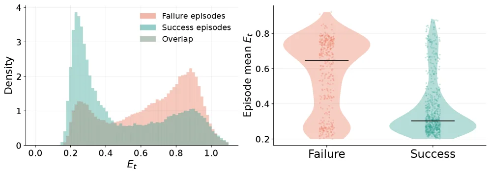

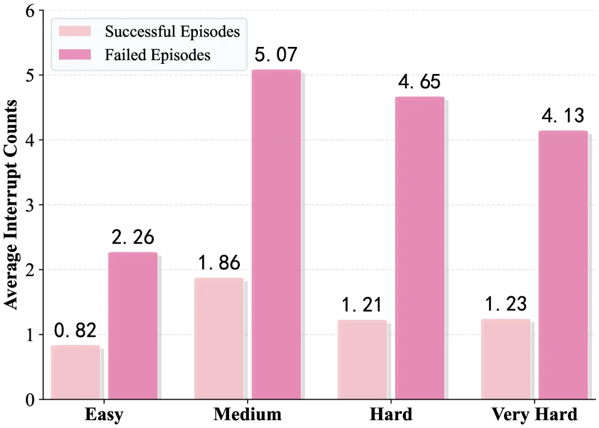

> Figure 5 : LVM detection analysis. Left : distribution of the inconsistency score E t E_{t} , where successful episodes concentrate at low values and failed episodes show a heavier high-score tail. Right : interrupt frequency, where failed episodes trigger more interrupt events than successful ones.

图5验证潜在空间视觉监视器（LVM）是否真的能发现执行异常。左侧看不一致分数 \(E_t\) 的分布：成功轨迹更多集中在低分区域，失败轨迹则有更明显的高分尾部，说明预测视觉变化和真实视觉变化不一致时，任务更可能出问题。右侧看中断频率：失败 episode 触发中断更多，说明 LVM 的报警并不是随机噪声，而是和实际执行失败有相关性。

---

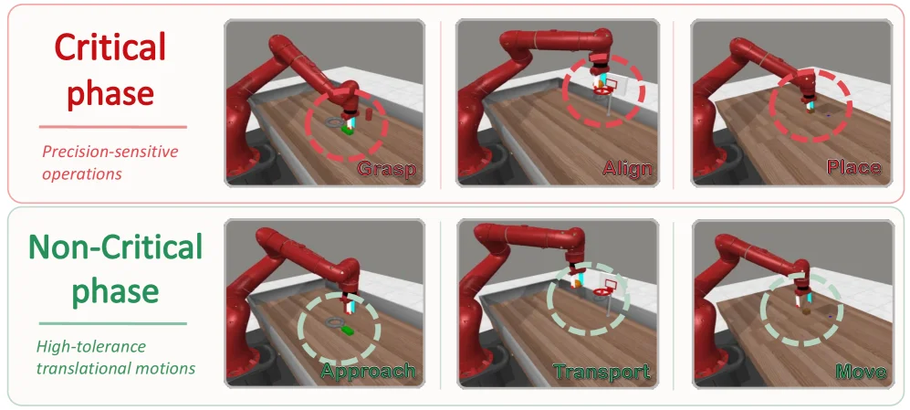

> Figure 6 : Task-phase analysis of LVM-triggered truncation. We manually divide MetaWorld trajectories into critical and non-critical phases. Left : representative trajectories show that truncation is triggered much more frequently during critical phases. Right : 83.7% of truncations occur in critical phases, while only 16.3% occur in non-critical phases.

图6进一步分析 LVM 触发截断的时机。作者把轨迹人工分成关键阶段和非关键阶段：关键阶段通常是接触、抓取、插入、放置这类一旦偏掉就会失败的时刻。左侧示例显示截断更多出现在这些关键片段；右侧统计显示 83.7% 的截断发生在关键阶段，只有 16.3% 在非关键阶段。这说明监视器更倾向于在真正需要纠错的任务阶段触发，而不是频繁打断普通运动。

---

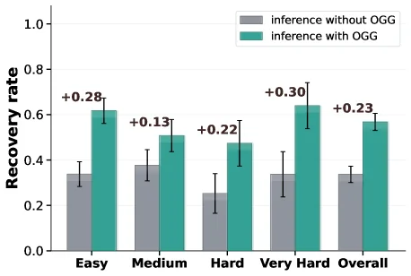

> Figure 7 : Post-interrupt recovery. OGG-guided inference consistently outperforms standard inference.

图7比较了中断发生之后，两种重新推理方式的恢复能力。标准推理只是重新从当前状态生成动作，缺少针对刚才偏差的纠偏方向；OGG 引导推理则把预测视觉演化和实际视觉演化之间的偏差转化为引导信号，用来推动新动作回到可恢复轨迹。图中的结果表明，在 post-interrupt 恢复阶段，OGG-guided inference 持续优于 standard inference。

---

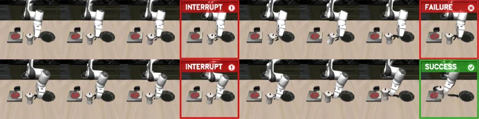

> Figure 8 : Controlled recovery case. Given the same initial state and detected grasping error, the monitored baseline continues the original chunk and fails ( top ), while VLA-Corrector truncates stale actions, replans with OGG, and completes the task ( bottom ).

这张图（图8）是一个“受控恢复案例”的可视化对比，旨在清晰展示论文中提出的VLA-Corrector方法与传统基线方法在处理执行过程中出现的错误时的不同表现。

首先，我们来分析图的结构。整个图像被分为上下两行，每行代表一种不同的执行情况或方法。每一行又由多个连续的场景快照组成，这些快照按时间顺序从左到右排列，展示了任务执行的过程。

**上行（红色框标注的部分）代表“监控的基线”方法：**
1.  **初始阶段（最左侧几个快照）：** 这部分显示了任务的初始状态，机器人的手臂和目标物体（如一个红色的圆盘和一个灰色的圆柱体）都处于初始位置。这些快照与下行对应位置的快照看起来是相同的，表明两种方法的初始条件和前几步执行是一致的。
2.  **错误检测与失败（中间红色框标注“INTERRUPT”和最右侧红色框标注“FAILURE”）：**
    *   在某个时间点（被红色框标注为“INTERRUPT”的快照），系统检测到了一个错误。从图像上看，这可能是指机器人未能正确抓取物体，或者物体的位置与预期不符。
    *   尽管检测到了错误，但“监控的基线”方法继续执行预先规划好的动作序列（即“chunk”中的剩余动作）。我们可以看到，机器人手臂的动作并没有进行修正，而是继续按照原计划执行。
    *   最终，在最右侧的快照（标注为“FAILURE”），任务以失败告终。从图像上看，可能是物体没有被正确放置到目标位置，或者机器人手臂处于一个无效的状态。

**下行（绿色框标注的部分）代表“VLA-Corrector”方法：**
1.  **初始阶段（最左侧几个快照）：** 与上行相同，这部分显示了任务的初始状态和前几步的执行，两者一致。
2.  **错误检测与恢复（中间红色框标注“INTERRUPT”和最右侧绿色框标注“SUCCESS”）：**
    *   同样，在某个时间点（被红色框标注为“INTERRUPT”的快照），系统检测到了一个错误，这个错误与基线方法检测到的错误相似（例如，抓取错误）。
    *   然而，VLA-Corrector方法采取了不同的行动。它没有继续执行剩余的预规划动作，而是“截断”了当前不可靠的动作序列（即丢弃了“chunk”中剩余的陈旧动作）。
    *   接下来，VLA-Corrector通过“在线梯度引导”（OGG）进行重新规划。从图像上看，机器人手臂的动作发生了改变，它开始执行一个新的、修正后的动作序列。
    *   最终，在最右侧的快照（标注为“SUCCESS”），任务成功完成。从图像上看，物体被正确地放置到了目标位置，或者机器人手臂达到了预期的成功状态。

**图中揭示的方法运作机制：**
这张图直观地展示了VLA-Corrector的核心思想：
*   **检测（Detect）：** 系统能够在线监测视觉动态的偏差（如图中“INTERRUPT”标记所示），识别出执行过程中的错误或漂移。
*   **截断（Truncate）：** 一旦检测到持续的偏差，系统会截断当前正在执行的、可能已经过时的动作序列（即丢弃“chunk”中剩余的动作）。
*   **修正（Correct）：** 系统调用“在线梯度引导”（OGG）进行重新规划，生成新的、更合适的动作序列。
*   **自适应执行范围（Adaptive Action Horizon）：** VLA-Corrector根据执行情况动态调整动作的执行范围。当当前的动作序列可靠时，它会保持较长的执行范围；当检测到执行开始偏离预期时，它会调用较短范围的修正性重新规划。

**对比对象和结论：**
*   **对比对象：** 图中直接对比了两种方法：上方的“监控的基线”方法和下方的“VLA-Corrector”方法。
*   **坐标/顺序：** 时间从左向右流动，每个快照代表一个时间步。
*   **结论：** 该图清晰地表明，在面对相同的初始状态和检测到的抓取错误时，“监控的基线”方法由于继续执行错误的动作序列而导致任务失败；而VLA-Corrector方法通过截断陈旧动作并进行重新规划，成功地恢复了执行并完成了任务。这证明了VLA-Corrector方法在提高具身智能体在接触丰富的物理交互任务中的鲁棒性和适应性方面的有效性。

总而言之，这张图通过一个具体的案例，生动地展示了VLA-Corrector方法如何通过其“检测-截断-修正”的机制，在遇到执行错误时实现任务的恢复，从而克服了传统基线方法的局限性。

---

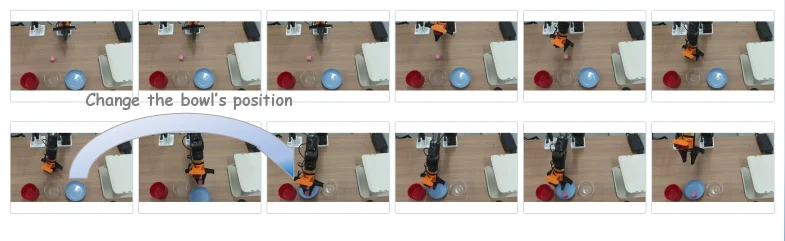

> Figure 9 : Real-world disturbance recovery demo. A human shifts the blue bowl during execution, requiring the robot to recover from an outdated action chunk.

这张图展示了一个真实世界中的扰动恢复演示，核心是一个机器人（橙色机械臂）在执行任务过程中，当环境发生意外变化（人类移动了蓝色碗）时，如何通过提出的VLA-Corrector方法进行恢复。

我们可以将图分为上下两行来理解：

**上行图像序列（从左到右）：**
*   这部分展示了任务的初始规划和执行阶段。
*   最初，机器人根据其规划（可能是预定义的动作块），准备与桌面上的物体（红色碗、蓝色碗、透明小碗和一个粉色小球）进行交互。
*   图像显示机器人依次执行动作，例如移动到蓝色碗上方，似乎意图操作它（比如抓取或移动它）。
*   关键点在于，这些动作是基于一个“过时的动作块”执行的，也就是说，机器人在开始执行这一系列动作时，环境是这样的，但在执行过程中，环境发生了变化。

**关键扰动（文字和箭头）：**
*   在上行图像下方，有一行文字“Change the bowl's position”，并配有一个从左向右的蓝色大箭头。
*   这个箭头和文字明确指出，在机器人执行上述动作的过程中（大约在上行图像的中间到后期），一个外部干扰发生了：人类将蓝色的碗从原来的位置移动了。
*   这个扰动使得机器人原本规划的动作变得不再适用，因为它基于的是旧的环境状态。

**下行图像序列（从左到右）：**
*   这部分展示了VLA-Corrector方法如何检测到扰动并进行恢复。
*   当机器人执行完上行序列中的动作块后（或者在执行过程中），VLA-Corrector的“潜在空间视觉监视器（LVM）”会持续比较预测的视觉特征演变和实际的视觉特征演变。
*   一旦检测到持续的偏差（即实际环境与预测环境不符，例如蓝色碗的位置变了），系统就会触发一个“截断事件”。
*   截断事件会丢弃剩余的、可能已经过时的动作，并通过“在线梯度引导（OGG）”调用纠正性重新规划。
*   下行图像序列展示了机器人如何根据新的环境状态（蓝色碗已被移动）重新规划并执行动作。我们可以看到机器人调整了其动作，以适应新的碗的位置，继续完成任务（例如，可能仍然是操作那个粉色小球，但现在需要考虑蓝色碗的新位置）。

**方法运作的具体说明：**
1.  **初始规划与执行：** 机器人根据一个预定义的动作块执行一系列动作（如上行所示）。
2.  **环境扰动：** 在执行过程中，环境发生变化（如人类移动蓝色碗）。
3.  **偏差检测：** VLA-Corrector的LVM检测到预测的视觉状态与实际视觉状态之间存在持续偏差。
4.  **截断与重新规划：** 检测到偏差后，系统触发截断事件，丢弃剩余的旧动作，并使用OGG进行纠正性重新规划。
5.  **适应新环境：** 机器人根据新的规划（如下行所示）执行动作，以适应变化后的环境并完成任务。

**结论：**
这张图清晰地展示了VLA-Corrector方法的核心思想：当环境发生扰动导致原有的动作块过时后，该方法能够在线检测到这种偏差，并及时进行纠正性重新规划，从而使机器人能够从扰动中恢复并继续成功执行任务。它揭示了VLA-Corrector如何通过事件触发的自适应动作范围来解决传统动作块机制在开放循环执行中缺乏闭环反应性的问题。

这张图不是一个传统的坐标图或对比图，而是一个流程演示图，展示了方法在实际场景中的应用过程和效果。

---

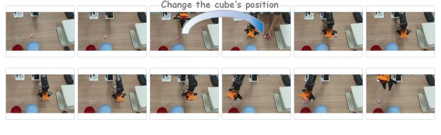

> Figure 10 : Demo: Moving-object grasp. The robot picks up the cube and places it into the white bowl, while a human manually changes the cube’s position during the process.

图10是一个真实演示：机器人需要把方块放进白色碗里，但人在执行过程中移动了方块。这个变化会让原先动作块里的后续动作过时。VLA-Corrector的作用是在视觉演化和预期不一致时触发截断，丢弃旧动作，并按方块的新位置重新规划，从而继续完成抓取和放置。

---

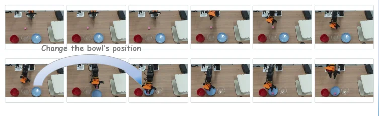

> Figure 11 : Demo: Moving-placement target. The robot picks up the cube and places it into the blue bowl, while a human manually changes the bowl’s position during the process.

图11展示另一个真实扰动：目标容器蓝色碗在执行过程中被人移动。对固定动作块策略来说，后续放置动作仍可能朝旧目标位置执行；VLA-Corrector则需要检测到目标位置变化，截断过时动作，并基于当前视觉重新生成能把方块放到新蓝碗位置的动作。

---

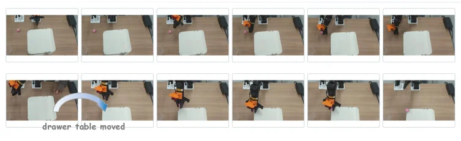

> Figure 12 : Demo: Moving-insertion target. The robot picks up the cube and places it at the upper-left corner of the drawer top, while a human manually changes the drawer’s position during the process.

图12展示移动插入目标的场景：机器人要把方块放到抽屉顶部左上角，但人在过程中改变了抽屉位置。这类接触/放置任务对目标位姿很敏感，旧动作块很容易失效。该演示强调 VLA-Corrector面对真实环境扰动时，可以通过检测、截断和OGG纠正重新规划，让机器人适应新的抽屉位置。
