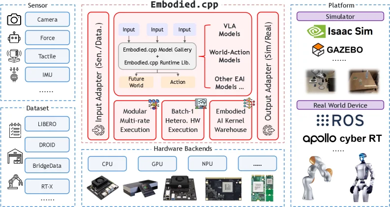
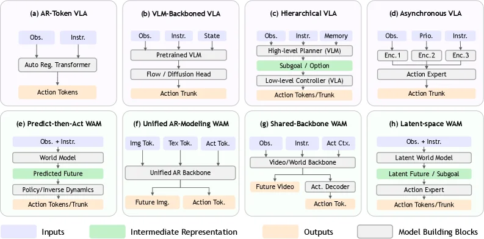

# Embodied.cpp: A Portable Inference Runtime of Embodied AI Models on Heterogeneous Robots

[arXiv](https://arxiv.org/abs/2607.02501) · [HuggingFace](https://huggingface.co/papers/2607.02501) · ▲3

## 摘要（原文）

> Embodied AI models now span vision-language-action (VLA) models and world-action models (WAMs), but practical deployment remains fragmented across model-specific Python stacks, backend assumptions, and robot-side glue code, especially on heterogeneous edge devices. Existing inference runtimes are designed mainly for request-response serving and therefore do not satisfy the runtime contract of embodied deployment: multi-rate execution inside closed-loop control, latency-first batch-1 inference on heterogeneous hardware, and extensible embodied interfaces beyond fixed token I/O. We present Embodied.cpp, a portable C++ inference runtime for embodied models. Based on an architectural analysis of representative VLA models and WAMs, Embodied.cpp captures a shared execution path and organizes it into five layers: input adapters, sequence builders, backbone execution, head plugins, and deployment adapters. The runtime provides modular multi-rate execution, latency-first fused inference, and extensible operator and I/O support, enabling deployment across heterogeneous devices, robots, and simulators through one backend abstraction. We evaluate Embodied.cpp on two VLA models, HY-VLA and pi0.5, and on a preliminary WAM benchmark using a LingBot-VA Transformer block. The VLA deployments achieve successful closed-loop execution with 100.0% and 91.0% task success rates, respectively. The WAM benchmark reduces block memory from 312.2 MiB to 88.1 MiB. These results show that Embodied.cpp improves deployment efficiency while preserving high accuracy across diverse embodied model architectures.

## 摘要（中译）

具身人工智能（Artificial Intelligence, AI）模型现在涵盖了视觉 - 语言 - 动作（Vision - Language - Action, VLA）模型和世界 - 动作模型（World - Action Models, WAMs），但实际部署仍然分散在特定于模型的Python栈、后端假设和机器人端粘合代码中，尤其是在异构边缘设备上。现有的推理运行时主要是为请求 - 响应服务而设计的，因此不满足具身部署的运行时契约：闭环控制内的多速率执行、异构硬件上的延迟优先的单批（batch - 1）推理以及超出固定令牌输入/输出（I/O）的可扩展具身接口。我们提出了Embodied.cpp，这是一个用于具身模型的可移植C++推理运行时。基于对代表性VLA模型和WAMs的架构分析，Embodied.cpp捕获了一个共享的执行路径，并将其组织为五个层：输入适配器、序列构建器、主干执行、头插件和部署适配器。该运行时提供模块化多速率执行、延迟优先的融合推理以及可扩展的操作符和I/O支持，通过一个后端抽象实现跨异构设备、机器人和模拟器的部署。我们在两个VLA模型HY - VLA和pi0.5上，以及使用LingBot - VA Transformer块的初步WAM基准测试中对Embodied.cpp进行了评估。VLA部署分别以100.0%和91.0%的任务成功率实现了成功的闭环执行。WAM基准测试将块内存从312.2 MiB减少到88.1 MiB。这些结果表明，Embodied.cpp在保持不同具身模型架构的高准确性的同时，提高了部署效率。

## 背景剖析

**背景剖析**

随着人工智能技术的飞速发展，具身智能（Embodied AI）已成为研究和应用的热点领域。这类技术主要应用于机器人和模拟环境中，使机器能够通过感知、决策和执行来与物理世界互动。然而，尽管学术界和工业界已经开发出大量具身模型，如视觉-语言-动作（VLA）模型和世界-动作模型（WAMs），但在实际部署中仍面临诸多挑战。

首先，具身模型的部署需要满足实时性和稳定性的要求，这要求推理系统能够在闭环控制中以不同的速率执行感知编码器、变换器主干和预测分支等组件。其次，由于硬件资源的限制，推理系统需要在异构边缘设备上实现低延迟、低抖动和小批量执行。最后，具身模型的接口需要更加灵活，以适应多模态输入和多样化输出。

然而，先前的推理运行时主要针对请求-响应服务进行设计，无法满足具身部署的需求。这些系统通常具有相对统一的令牌接口和以吞吐量为导向的优化，而具身推理则需要处理机器人和模拟器侧的依赖关系，以及自定义操作符和异构输出等问题。因此，即使是一个强大的模型也需要与Python研究代码、后端特定的推理路径、手写传感器包装器和平台特定的控制逻辑进行缝合，才能在机器人上发挥作用。

为了解决这些问题，本文提出了Embodied.cpp，一个用于具身模型的便携式C++推理运行时。该运行时通过分析代表性的VLA模型和WAMs，揭示了一个共享的执行路径，并将其组织成五个层次：输入适配器、序列构建器、主干执行、头部插件和部署适配器。这种设计使得Embodied.cpp能够在异构设备、机器人和模拟器上实现高效的部署，同时保持高准确性。

总之，Embodied.cpp的关键差异在于其针对具身部署的特定需求进行了优化，提供了一个模块化的多速率执行环境、以延迟为先的融合推理和可扩展的操作符及I/O支持。这使得具身模型能够在各种异构环境中高效部署，同时保持高准确性。

## 方法图解

> Figure 2: Project overview of Embodied.cpp . Diverse sensors and datasets enter through input adapters, model execution is unified around one embodied-model runtime that covers VLA models, WAMs, and future variants, and outputs are bridged to simulators and real robots through deployment adapters. Beneath this shared path, three runtime capabilities directly address the core challenges: modular multi-rate execution, latency-first batch-1 execution on heterogeneous hardware, and an embodied AI kernel warehouse for reusable operators and model-specific kernels.

这张图展示了 Embodied.cpp 项目的整体架构，它旨在提供一个可移植的具身智能（embodied AI）模型推理运行时，以解决当前部署碎片化的问题。

首先，我们来看数据的输入部分。左侧的“Sensor”（传感器）模块列出了多种传感器类型，如相机（Camera）、力传感器（Force）、触觉传感器（Tactile）和惯性测量单元（IMU）等，这些传感器的数据通过“Input Adapter (Sen./Data.)”（输入适配器）进入系统。下方的“Dataset”（数据集）模块则列出了如 LIBERO、DROID 等数据集，它们也可能作为输入数据源。输入适配器的作用是将这些多样化的传感器数据和数据集转换为系统可以处理的统一格式。

接下来是核心的模型执行部分，被标记为“Embodied.cpp”的红色虚线框内。这里包含了几个关键组件：
1. **Embodied.cpp Model Gallery**（模型库）和 **Embodied.cpp Runtime Lib.**（运行时库）：这是整个系统的核心，负责加载和执行各种具身智能模型，包括视觉-语言-动作（VLA）模型、世界-动作模型（WAMs）以及其他类型的具身智能模型（Other EAI Models）。模型执行的流程是从多个“Input”（输入）开始，经过模型库和运行时库的处理，生成“Future World”（未来世界状态）和“Action”（动作）。
2. **三个关键的运行时能力**：
   - **Modular Multi-rate Execution**（模块化多速率执行）：支持在闭环控制中进行多速率的执行，以满足不同任务对时间步长的不同要求。
   - **Batch-1 Hetero. HW Execution**（批处理大小为1的异构硬件执行）：强调在异构硬件（如CPU、GPU、NPU等）上进行低延迟的推理，特别是针对批处理大小为1的情况，这在实时系统中非常重要。
   - **Embodied AI Kernel Warehouse**（具身智能内核仓库）：提供可重用的操作符和模型特定的内核，以支持不同模型的执行。
3. **Hardware Backends**（硬件后端）：包括CPU、GPU、NPU等，提供了不同的硬件加速选项，以适应不同的计算需求和设备能力。

然后是数据的输出部分，通过“Output Adapter (Sim/Real)”（输出适配器）将模型的输出（如动作）发送到不同的目标：
- **Platform**（平台）模块包括模拟器（如Isaac Sim、GAZEBO）和真实世界设备（如ROS、apollo cyber RT），输出适配器将处理后的数据转换为这些平台可以理解的格式，从而实现对机器人或模拟环境的控制。

这张图揭示了 Embodied.cpp 的工作流程：首先，多样化的传感器和数据集通过输入适配器进入系统；然后，核心的模型执行部分（Embodied.cpp 运行时）对这些输入进行处理，利用其三个关键的运行时能力（多速率执行、异构硬件上的低延迟推理、内核仓库）来执行各种具身智能模型；最后，处理后的输出通过输出适配器发送到模拟器或真实世界的机器人设备，实现对环境的感知、决策和行动。

总结来说，Embodied.cpp 通过提供一个统一的推理运行时，解决了具身智能模型部署中的碎片化问题，支持在异构设备和平台上进行高效的模型执行和闭环控制。

---

> Figure 1: Architectural taxonomy of embodied models. We first separate VLA models (a-d) from WAMs (e-h), and then organize each family by internal inference structure.

这张图（图1）展示了具身智能模型的架构分类，我们将视觉-语言-动作（VLA）模型（子图a - d）与世界-动作模型（WAMs）（子图e - h）分开，然后根据内部推理结构对每个类别进行组织，以清晰呈现不同具身模型的设计逻辑和数据流向：

### 视觉-语言-动作（VLA）模型部分（a - d）
- **(a) AR - Token VLA**：输入（Inputs，浅蓝色框）包括观测（Obs.）和指令（Instr.），这些输入被送入“Auto Reg. Transformer”（模型构建模块，灰色框），该模块处理后输出动作令牌（Action Tokens，橙色框，输出）。数据流向是：Obs. + Instr. → Auto Reg. Transformer → Action Tokens。
- **(b) VLM - Backboned VLA**：输入有观测（Obs.）、指令（Instr.）和状态（State），首先输入到“Pretrained VLM”（预训练视觉语言模型，模型构建模块），然后经过“Flow / Diffusion Head”（可能是流或扩散头，模型构建模块），最后到“Action Trunk”（动作主干，输出）。数据流向：Obs. + Instr. + State → Pretrained VLM → Flow / Diffusion Head → Action Trunk。
- **(c) Hierarchical VLA**：输入包含观测（Obs.）、指令（Instr.）和记忆（Memory），先由“High - level Planner (VLM)”（高层次规划器，使用VLM，模型构建模块）处理，生成“Subgoal / Option”（子目标/选项，中间表示，绿色框），然后传递给“Low - level Controller (VLA)”（低层次控制器，VLA，模型构建模块），最终输出动作令牌或主干（Action Tokens/Trunk，输出）。数据流向：Obs. + Instr. + Memory → High - level Planner (VLM) → Subgoal / Option → Low - level Controller (VLA) → Action Tokens/Trunk。
- **(d) Asynchronous VLA**：输入有观测（Obs.）、优先级（Prio.）和指令（Instr.），分别通过“Enc.1”、“Enc.2”、“Enc.3”（三个编码器，模型构建模块）处理后，送入“Action Expert”（动作专家，模型构建模块），最后到“Action Trunk”（输出）。数据流向：Obs. + Prio. + Instr. → Enc.1/Enc.2/Enc.3 → Action Expert → Action Trunk。

### 世界-动作模型（WAMs）部分（e - h）
- **(e) Predict - then - Act WAM**：输入是观测加指令（Obs. + Instr.），送入“World Model”（世界模型，模型构建模块），生成“Predicted Future”（预测的未来，中间表示，绿色框），然后经过“Policy/Inverse Dynamics”（策略/逆动力学，模型构建模块），输出动作令牌或主干（Action Tokens/Trunk，输出）。数据流向：Obs. + Instr. → World Model → Predicted Future → Policy/Inverse Dynamics → Action Tokens/Trunk。
- **(f) Unified AR - Modeling WAM**：输入包括图像令牌（Img. Tok.）、文本令牌（Tex. Tok.）和动作令牌（Act. Tok.），送入“Unified AR Backbone”（统一的自回归主干，模型构建模块），输出未来图像（Future Img.）和动作令牌（Action Tok.，输出）。数据流向：Img. Tok. + Tex. Tok. + Act. Tok. → Unified AR Backbone → Future Img. + Action Tok.
- **(g) Shared - Backbone WAM**：输入有观测（Obs.）、指令（Instr.）和动作上下文（Act. Ctx.），送入“Video/World Backbone”（视频/世界主干，模型构建模块），生成“Future Video”（未来视频，中间表示）和通过“Act. Decoder”（动作解码器，模型构建模块）得到动作令牌（Action Tok.，输出）。数据流向：Obs. + Instr. + Act. Ctx. → Video/World Backbone → Future Video + Act. Decoder → Action Tok.
- **(h) Latent - space WAM**：输入是观测加指令（Obs. + Instr.），送入“Latent World Model”（潜在世界模型，模型构建模块），生成“Latent Future / Subgoal”（潜在未来/子目标，中间表示，绿色框），然后经过“Action Expert”（动作专家，模型构建模块），输出动作令牌或主干（Action Tokens/Trunk，输出）。数据流向：Obs. + Instr. → Latent World Model → Latent Future / Subgoal → Action Expert → Action Tokens/Trunk。

### 整体架构逻辑与方法运作方式
这张图揭示了具身模型的两种主要家族（VLA和WAM）的内部结构差异：
- **VLA模型**：通常结合视觉、语言和动作的处理，有的使用自回归Transformer（如a），有的基于预训练VLM（如b），有的是分层结构（如c）或异步处理（如d），核心是将多模态输入（观测、指令等）转换为动作输出，中间可能涉及规划、控制或编码解码过程。
- **WAM模型**：更侧重于世界模型（预测未来状态）和动作的结合，有的是“预测然后行动”（如e），有的是统一的自回归建模（如f），有的共享主干（如g）或在潜在空间处理（如h），核心是通过世界模型预测未来，再结合动作策略生成动作，或直接建模动作相关的序列。

数据流向的共性是：输入（观测、指令等）→ 模型构建模块（处理输入，可能生成中间表示）→ 输出（动作令牌、主干或未来预测等）。不同模型的区别在于模型构建模块的类型（如Transformer、VLM、世界模型等）、中间表示的处理（如子目标、潜在未来等）以及输入输出的类型（如是否包含状态、优先级、多模态令牌等）。

通过这种分类，我们可以看到具身模型的多样性，而论文中的Embodied.cpp运行时正是基于对这些架构的分析，提取共享执行路径，组织成输入适配器、序列构建器、主干执行、头插件和部署适配器五层，以实现跨异构设备的部署，满足具身部署的运行时契约（如闭环控制内的多速率执行、异构硬件上的延迟优先批处理1推理、可扩展的具身接口等）。
