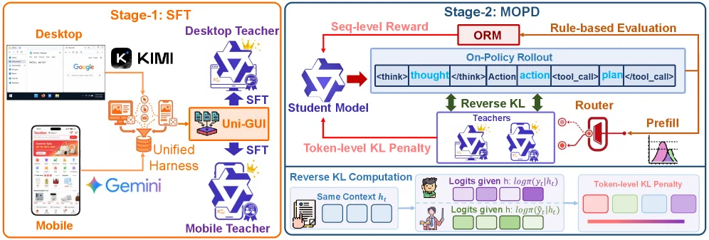
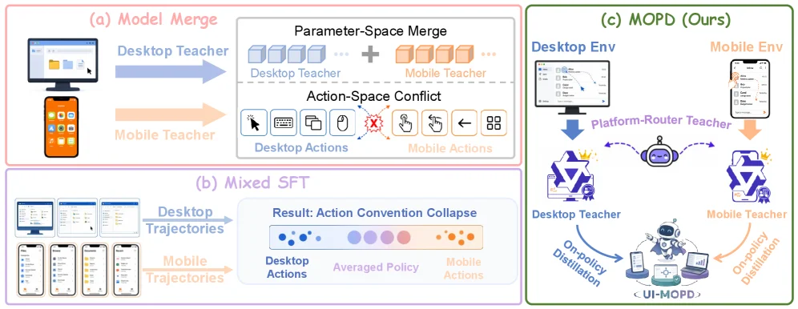
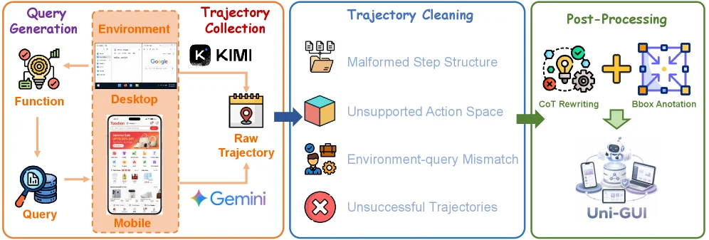
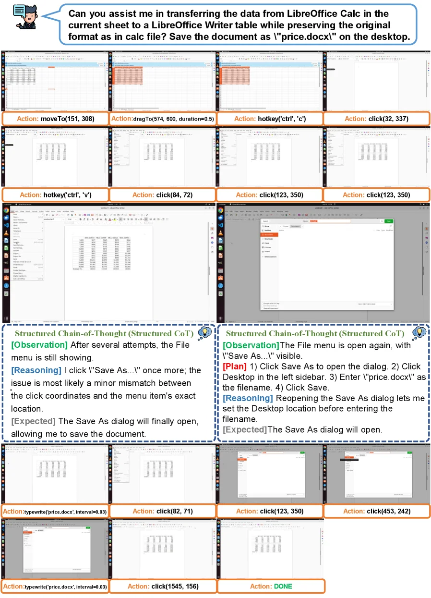
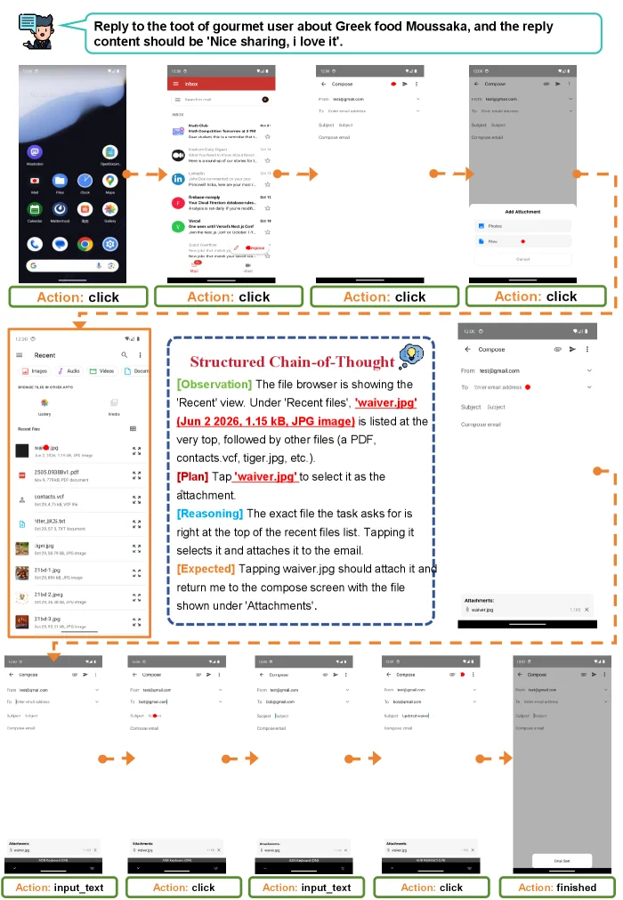

# UI-MOPD: Multi-Platform On-Policy Distillation for Continual GUI Agent Learning

[arXiv](https://arxiv.org/abs/2607.04425) · [HuggingFace](https://huggingface.co/papers/2607.04425) · ▲68

## 摘要（原文）

> Recent advances in multimodal foundation models and agent systems have driven GUI agents from single-platform task execution toward cross-platform interaction. However, building multi-platform GUI agents remains challenging. On one hand, high-quality and executable cross-platform interaction trajectories are still scarce, and existing data often suffer from limited platform coverage. On the other hand, different platforms exhibit distinct interaction conventions, making joint or continual training prone to behavioral pattern mixing, platform-specific capability degradation, and catastrophic forgetting. To address these challenges, we construct Uni-GUI, a high-quality cross-platform GUI interaction dataset, and propose UI-MOPD, the first method that incorporates multi-teacher on-policy distillation into continual learning for GUI agents. UI-MOPD dynamically selects a platform-specific teacher according to the current environment and transfers platform-specific behavioral priors to a shared policy through platform-conditioned distillation, enabling adaptation to new platforms while preserving capabilities on existing ones. Experiments on OSWorld and MobileWorld show that UI-MOPD achieves task success rates of 38.2% and 12.0%, respectively, demonstrating its effectiveness in balancing cross-platform capability retention and new-platform adaptation.
  Project page: https://elispectre.github.io/UI-MOPD/.

## 摘要（中译）

多模态基础模型和智能体系统的最新进展已推动图形用户界面（GUI）智能体从单平台任务执行向跨平台交互发展。然而，构建多平台GUI智能体仍然具有挑战性。一方面，高质量且可执行的跨平台交互轨迹仍然稀缺，现有数据通常存在平台覆盖范围有限的问题。另一方面，不同平台表现出不同的交互惯例，使得联合或持续训练容易出现行为模式混合、平台特定能力退化和灾难性遗忘。为应对这些挑战，我们构建了Uni - GUI，这是一个高质量的跨平台GUI交互数据集，并提出了UI - MOPD，这是首个将多教师在策略蒸馏纳入GUI智能体持续学习的方法。UI - MOPD根据当前环境动态选择一个平台特定的教师，并通过平台条件蒸馏将平台特定的行为先验转移到共享策略中，从而在适应新平台的同时保留现有平台的能力。在OSWorld和MobileWorld上的实验表明，UI - MOPD分别实现了38.2%和12.0%的任务成功率，这证明了其在平衡跨平台能力保留和新平台适应方面的有效性。
项目页面：https://elispectre.github.io/UI - MOPD/。

## 背景剖析

### 背景剖析  

**1. 技术背景与真实需求**  
随着多模态基础模型（如Qwen-VL、Claude）和智能体系统的进步，GUI（图形用户界面）代理逐渐成为连接人工智能与现实数字环境的关键工具。这类代理需要理解屏幕内容、规划操作步骤，并通过点击、输入等界面动作完成用户任务（例如自动化办公、跨平台应用操作）。然而，现实工作流常涉及计算机、手机和网页等多异构环境，要求代理在适应新平台的同时保留原有平台的交互习惯（比如电脑上关闭窗口和手机上返回上一页的操作逻辑不同）。因此，如何让一个通用的GUI代理持续适应不同平台，同时不丢失特定平台的行为模式，成为核心挑战。  

**2. 之前的问题与瓶颈**  
早期研究主要依赖单平台数据或简单混合多平台信号，但存在两大局限：  
- **数据质量不足**：现有数据集（如OpenCUA）多为单平台场景，且包含无效动作或状态-动作对齐错误，难以支持跨平台训练。  
- **行为模式混淆**：直接合并不同平台的行为信号（如电脑和手机的导航逻辑）会导致策略“平均化”，在持续学习中遗忘已学到的平台特定行为（例如手机滑动与电脑滚动的差异被忽略）。  
这些瓶颈使得传统方法无法平衡“适应新平台”与“保留旧能力”的需求。  

**3. 本文的解决方案**  
论文提出**UI-MOPD**方法，核心思路是引入**多教师在线策略蒸馏**（Multi-Teacher On-Policy Distillation）：  
- **动态教师选择**：根据当前环境（如电脑或手机）选择对应的“平台专家”（教师模型），将特定平台的行为模式蒸馏到一个共享策略中。  
- **行为锚点机制**：每个教师模型作为稳定锚点，确保共享策略在学习新平台时不会混淆不同平台的交互习惯（例如保留电脑的窗口管理逻辑，同时适应手机的触摸手势）。  
此外，团队构建了**Uni-GUI**数据集，通过统一的数据收集框架从电脑和手机环境中获取高质量跨平台轨迹，解决了数据稀缺问题。  

**4. 与前人工作的关键差异**  
与以往方法（如混合监督微调或模型合并）不同，UI-MOPD的关键创新在于：  
- **环境感知的蒸馏**：不是简单聚合数据，而是动态匹配教师模型与环境，避免行为模式混合。  
- **持续学习优化**：通过保留平台特定行为的“锚点”，缓解灾难性遗忘问题，实现新旧平台能力的平衡提升。  
实验表明，UI-MOPD在OSWorld（电脑）和MobileWorld（手机）任务中分别达到38.2%和12.0%的成功率，显著优于基线模型，验证了其在跨平台适应与能力保留上的有效性。

## 方法图解

> Figure 2 : Overview of UI-MOPD training pipeline. In Stage 1, platform-specific desktop and mobile teachers are obtained by supervised fine-tuning on Uni-GUI trajectories collected from a unified cross-platform harness. In Stage 2, a shared student policy is trained with multi-teacher on-policy distillation, where platform-conditioned routing selects the corresponding teacher to provide reverse-KL guidance together with rule-based rollout rewards.

这张图展示了UI-MOPD方法的训练流程，分为两个主要阶段，清晰地呈现了从数据收集到模型训练的完整过程。

首先看**Stage-1: SFT（监督微调阶段）**。在这个阶段，目标是获取针对不同平台的特定教师模型。左侧展示了数据来源：桌面端（Desktop）有Google等界面，移动端（Mobile）有手机应用界面，这些跨平台的GUI交互数据通过“Unified Harness（统一 harness）”进行收集和整合，形成“Uni-GUI”数据集。然后，这个统一的数据集被用于训练两个平台特定的教师模型：一个是“Desktop Teacher（桌面教师）”，另一个是“Mobile Teacher（移动教师）”，训练方法是“SFT（监督微调）”。这里的箭头表示数据和训练流程的方向：从跨平台的GUI交互数据（通过Unified Harness处理）流向两个教师模型的SFT训练过程，最终得到针对桌面和移动平台的特定教师模型。

接下来是**Stage-2: MOPD（多平台在线策略蒸馏阶段）**。这个阶段的核心是训练一个共享的学生模型（Student Model），并通过多教师在线策略蒸馏来传递平台特定的行为先验。首先，学生模型的训练涉及到几个关键组件：

1. **On-Policy Rollout（在线策略滚动）**：学生模型在这里进行策略滚动，生成一系列的动作和思考（如<think>、<action>、<tool_call>等），这个过程会得到“Seq-level Reward（序列级奖励）”，由“ORM（可能是奖励模型）”通过“Rule-based Evaluation（基于规则的评估）”来提供。同时，这个滚动过程的结果会用于后续的蒸馏过程。

2. **Teachers（教师模型）**：包括桌面教师和移动教师，它们在蒸馏过程中提供指导。这里的关键是“Router（路由）”组件，它会根据当前的环境（平台）动态选择对应的教师模型（平台条件路由）。然后，通过“Reverse KL（反向KL散度）”计算来传递知识：学生模型的输出和教师模型在相同上下文（Same Context \( h_t \)）下的输出的KL散度被用来计算“Token-level KL Penalty（标记级KL惩罚）”，这个惩罚会反馈给学生模型，以调整其策略，使其更接近教师模型的行为先验。

3. **Reverse KL Computation（反向KL散度计算）**：这个部分详细展示了如何计算反向KL散度。对于相同的上下文\( h_t \)，学生模型给出的logits（\( \log(\pi(y_t|h_t)) \)）和教师模型给出的logits（\( \log(\hat{\pi}(y_t|h_t)) \)）被用来计算KL散度，进而得到标记级的KL惩罚，这个惩罚会影响学生模型的训练，确保它在学习新平台的同时保留现有平台的能力。

数据或信息的流动顺序是：在Stage-1中，跨平台的GUI交互数据通过Unified Harness处理后，分别训练桌面和移动教师模型；在Stage-2中，学生模型通过在线策略滚动生成行为，同时路由组件根据平台选择对应的教师模型，通过反向KL散度计算将教师模型的行为先验传递给学生模型，结合序列级奖励来优化学生模型的策略，使其既能适应新平台，又能保留现有平台的能力。

这张图揭示了UI-MOPD方法的具体运作方式：首先通过统一Harness收集跨平台数据并训练平台特定的教师模型（SFT阶段），然后在MOPD阶段，使用在线策略蒸馏，通过动态路由选择平台特定的教师模型，利用反向KL散度和规则奖励来训练共享的学生模型，从而实现跨平台GUI代理的持续学习，平衡新平台适应和现有平台能力保留。

---

> Figure 1 : Motivation of UI-MOPD. Naively combining desktop and mobile signals, as in model merging or mixed SFT, can mix platform-specific behavioral conventions and produce an averaged policy. UI-MOPD uses platform-conditioned routing and multi-teacher on-policy distillation to integrate platform-specific expertise into a shared GUI agent.

这张图（图1）展示了UI-MOPD方法的动机，通过对比三种不同的策略来说明其必要性和优势。

首先看(a)部分的“Model Merge”（模型合并）。这里展示了将桌面端教师（Desktop Teacher）和移动端教师（Mobile Teacher）的参数空间直接合并的过程。桌面端教师和移动端教师分别提供各自的参数（用不同颜色的立方体表示），但这种直接合并会导致“Action-Space Conflict”（动作空间冲突）。具体来说，桌面端的动作（如鼠标点击、键盘输入等）和移动端的动作（如触摸、手势等）在动作空间上不兼容，直接合并会产生冲突（图中用红色叉号表示），无法有效结合两者的优势。

接下来是(b)部分的“Mixed SFT”（混合监督微调）。这里将桌面端的轨迹（Desktop Trajectories）和移动端的轨迹（Mobile Trajectories）混合在一起进行训练。结果是“Action Convention Collapse”（动作约定崩溃），即原本桌面端和移动端各自的动作模式被平均化，形成一个“ Averaged Policy”（平均策略）。从图中可以看到，桌面端的动作（蓝色点）和移动端的动作（橙色点）在平均后变得模糊，失去了各自平台的特异性，这会导致模型在不同平台上的性能下降，无法很好地适应特定平台的交互习惯。

然后是(c)部分的“MOPD (Ours)”（我们的方法，即UI-MOPD）。这里展示了一种更有效的策略。首先，有一个“Platform-Router Teacher”（平台路由教师），它根据当前的环境（Desktop Env或Mobile Env）选择合适的教师（Desktop Teacher或Mobile Teacher）。然后，通过“On-policy Distillation”（在策略蒸馏）将平台特定的行为先验知识传递给共享的GUI代理（UI-MOPD）。具体来说，桌面端教师通过“On-policy Distillation”将桌面端的交互知识传递给代理，移动端教师也通过“On-policy Distillation”将移动端的交互知识传递给代理。这种方法避免了直接合并参数或混合轨迹带来的问题，能够动态地选择适合当前平台的教师，从而将平台特定的专业知识整合到共享的GUI代理中，既保留了现有平台的能力，又能适应新平台的交互需求。

总结来说，这张图通过对比模型合并、混合监督微调和我们提出的UI-MOPD方法，展示了UI-MOPD如何通过平台条件路由和多教师在策略蒸馏来整合平台特定的专业知识，解决了跨平台GUI代理学习中的行为模式混合和能力退化问题。

---

> Figure 4 : Overview of Unified Cross-Platform Data Collection Harness.

这张图展示了构建跨平台GUI交互数据集的统一流程，分为**查询生成**、**轨迹收集**、**轨迹清洗**和**后处理**四个核心阶段，数据/信息按从左到右的顺序流动，最终用于训练多平台GUI智能体（如Uni - GUI）。  

### 1. 查询生成（Query Generation）  
该阶段的目标是生成驱动GUI交互的查询和功能。左侧的“Function”（功能）模块（带靶心图标）和“Query”（查询）模块（带放大镜+数据库图标）通过箭头交互：功能模块可能定义任务类型，查询模块则生成具体的交互指令（如“打开应用X”“点击按钮Y”）。这些查询将作为后续轨迹收集的输入，指导智能体在环境中执行操作。  

### 2. 轨迹收集（Trajectory Collection）  
此阶段的核心是**多平台环境**下的交互轨迹采集：  
- **环境（Environment）**：包含“Desktop”（桌面端，如浏览器界面）和“Mobile”（移动端，如手机应用界面），覆盖不同平台的GUI场景。  
- **数据来源**：通过“KIMI”和“Gemini”等工具（或模型）与环境交互，生成“Raw Trajectory”（原始轨迹）。这里的箭头表示：查询驱动智能体在桌面/移动端环境中执行操作，工具记录操作序列（如点击、输入、导航等），形成原始轨迹数据。  

### 3. 轨迹清洗（Trajectory Cleaning）  
原始轨迹存在质量问题，需要过滤和修正：  
- 清洗的目标是解决四类问题（每个问题对应一个图标和描述）：  
  - *Malformed Step Structure*（步骤结构畸形）：轨迹中的操作步骤格式错误（如缺少必要参数、步骤顺序混乱）。  
  - *Unsupported Action Space*（不支持的动作空间）：操作超出了目标平台的能力范围（如移动端执行桌面端专属操作）。  
  - *Environment - query Mismatch*（环境 - 查询不匹配）：查询的任务与当前环境不兼容（如在购物应用中执行系统设置操作）。  
  - *Unsuccessful Trajectories*（失败轨迹）：轨迹执行后未完成任务（如点击按钮无响应、操作中断）。  
- 清洗过程通过筛选（蓝色箭头）保留“高质量、可执行”的轨迹，为后续训练提供可靠数据。  

### 4. 后处理（Post - Processing）  
清洗后的轨迹需要进一步处理，以适配多平台GUI智能体的训练：  
- **CoT Rewriting**（思维链重写）：通过“灯泡+齿轮”图标表示，对轨迹的操作逻辑进行重构，增强步骤的可解释性和泛化性（如将“点击按钮A”重写为“为了完成任务X，需要点击按钮A以触发Y操作”）。  
- **Bbox Annotation**（边界框标注）：通过“十字+方框”图标表示，对GUI元素（如按钮、文本框）的位置进行标注，帮助智能体学习视觉定位。  
- 最终，处理后的数据用于训练“Uni - GUI”（多平台GUI智能体），绿色箭头表示数据流向智能体，使其能够学习跨平台的交互策略。  

### 方法运作逻辑（从图中理解）  
整个流程是一个**“数据驱动的多平台GUI智能体训练 pipeline”**：  
1. 先通过“查询生成”创建任务指令，驱动多平台环境下的交互；  
2. 收集原始轨迹后，通过“轨迹清洗”过滤低质量数据，确保训练数据的可靠性；  
3. 再通过“后处理”（思维链重写、边界框标注）增强数据的表达能力；  
4. 最终将处理后的数据用于训练Uni - GUI，使其能在不同平台（如桌面、移动）上持续学习，既保留已有平台的能力，又能适应新平台的交互规则。  

这一流程解决了“跨平台GUI智能体训练中数据稀缺、行为模式混淆”的问题：通过多平台环境采集数据，清洗后增强数据质量，再通过后处理优化数据表达，最终支持多教师（平台特定）到单策略（共享）的持续蒸馏学习（如论文中的UI - MOPD方法）。

---

> Figure 5 : Desktop task execution example of UI-MOPD.

这张图（图5）展示了UI-MOPD方法在桌面环境下执行一个具体任务的示例，即“将LibreOffice Calc当前工作表中的数据传输到LibreOffice Writer表格中，同时保留Calc文件中的原始格式，并将文档保存为桌面的'price.docx'”。

我们可以将图中的内容分解为几个关键部分来理解UI-MOPD方法的运作流程：

1.  **任务目标与初始操作**：
    *   图的顶部有一个对话框，明确提出了任务：“Can you assist me in transferring the data from LibreOffice Calc in the current sheet to a LibreOffice Writer table while preserving the original format as in calc file? Save the document as \"price.docx\" on the desktop”。这设定了整个操作的目标。
    *   接下来的几行图像（第一、二行）展示了在LibreOffice Calc中的操作。这些操作包括：
        *   `moveTo(151, 308)`：将鼠标移动到特定坐标，可能是选择数据区域的开始。
        *   `dragTo(574, 600, duration=0.5)`：拖动鼠标选择一个数据区域。
        *   `hotkey('ctrl', 'c')`：使用快捷键复制选中的数据。
        *   `click(32, 337)`：点击某个位置，可能是切换到LibreOffice Writer或准备粘贴。
        *   `hotkey('ctrl', 'v')`：使用快捷键粘贴数据。
    *   这些步骤清晰地展示了数据从Calc复制并粘贴到Writer的过程。

2.  **保存文档的流程与决策**：
    *   图的中间部分展示了保存文档的操作，这部分通过两个“Structured Chain-of-Thought (Structured CoT)”框进行了详细解释，揭示了UI-MOPD如何处理交互中的决策和问题解决。
    *   **第一个CoT框（左中）**：
        *   `[Observation]`：指出“File menu is still showing”（文件菜单仍然显示），并且经过几次尝试，“the issue is most likely a minor mismatch between the click coordinates and the menu item's exact location”（问题很可能是点击坐标与菜单项确切位置之间的微小不匹配）。这说明UI-MOPD在尝试执行操作时可能会遇到由于坐标不精确导致的问题。
        *   `[Reasoning]`：决定“click \"Save As...\" once more”（再次点击“另存为...”）。
        *   `[Expected]`：期望“the Save As dialog will finally open, allowing me to save the document”（“另存为”对话框最终会打开，允许保存文档）。
    *   **第二个CoT框（右中）**：
        *   `[Observation]`：确认“File menu is open again, with \"Save As...\" visible”（文件菜单再次打开，“另存为...”可见）。
        *   `[Plan]`：列出了具体的保存步骤：1) 点击“Save As...”打开对话框；2) 在左侧边栏点击“Desktop”；3) 输入文件名“price.docx”；4) 点击“Save”。
        *   `[Reasoning]`：解释了重新打开“另存为”对话框的原因是为了“set the Desktop location before entering the filename”（在输入文件名之前设置桌面位置）。
        *   `[Expected]`：期望“the Save As dialog will open”（“另存为”对话框会打开）。

3.  **执行保存操作**：
    *   基于上述CoT的决策，图中展示了具体的保存操作步骤：
        *   `typewrite('price.docx', interval=0.03)`：键入文件名“price.docx”。
        *   `click(82, 71)`：点击某个位置，根据CoT计划，这可能是点击“Desktop”选项。
        *   `click(123, 350)`：点击“Save”按钮（可能出现了两次，或者表示确认）。
        *   `click(453, 242)`：可能是另一个确认点击或相关操作。
    *   最后一行显示 `Action: typewrite('price.docx', interval=0.03)` 再次出现，然后是 `Action: click(1545, 156)` 和 `Action: DONE`。这表明文件名输入和最终的保存点击操作已完成，任务成功结束。

**方法运作的具体说明**：
这张图揭示了UI-MOPD方法的核心运作方式：
*   **任务分解**：将复杂任务（如数据传输和保存）分解为一系列具体的、可执行的GUI操作步骤。
*   **观察与推理（Chain-of-Thought）**：在执行过程中，系统会观察当前界面状态（Observation），分析遇到的问题或情况，进行推理（Reasoning）以决定下一步行动，并制定计划（Plan）。
*   **动态适应与决策**：当遇到问题（如坐标不匹配导致的操作失败）时，系统能够动态调整策略（如重新点击菜单项），并根据计划执行正确的操作序列。
*   **平台特定行为**：虽然图中没有明确展示多平台切换，但这个例子展示了在一个特定平台（桌面GUI，如LibreOffice）上，UI-MOPD如何模仿人类操作来完成复杂任务，包括处理意外的界面反馈。

**结论**：
这张图通过一个具体的桌面任务执行示例，详细展示了UI-MOPD方法如何通过观察、推理、计划和动态调整来执行复杂的跨平台GUI任务。它清晰地呈现了从数据复制粘贴到文件保存的整个流程，并通过Structured CoT框揭示了代理在遇到问题时如何进行决策和解决问题的思考过程，从而有效地完成了指定任务。

---

> Figure 3 : Mobile task execution example of UI-MOPD.

这张图（图3）展示了UI-MOPD方法在移动设备上执行任务的示例流程，清晰地说明了该方法如何运作。

首先，我们从左上角的手机主屏幕开始。这个界面显示了多个应用程序图标，代表用户当前的起始环境。一个橙色箭头从这个界面指向右侧的第二个界面，标注为“Action: click”，表示用户执行的第一个操作是点击某个应用（根据上下文，这应该是邮件应用）。

接下来，我们看到一个邮件应用的界面，其中包含一个邮件列表。另一个橙色箭头从这里指向右侧的第三个界面，同样标注为“Action: click”，表示用户点击了新建邮件或回复邮件的按钮，进入了邮件编辑界面。

然后，流程进入了一个关键的决策和操作阶段，这在图中被一个蓝色虚线框突出显示，并附有“Structured Chain-of-Thought”（结构化思维链）的标题。这个部分详细描述了代理的思考过程：
- **[Observation]（观察）**：文件浏览器显示的是“最近”视图。在“最近文件”下，“waiver.jpg”（2024年6月2日，1.15 KB，JPG图像）列在最顶部，后面跟着其他文件（如PDF、contacts.vcf、tiger.jpg等）。
- **[Plan]（计划）**：点击“waiver.jpg”以将其选为附件。
- **[Reasoning]（推理）**：任务要求的确切文件位于最近文件列表的顶部。点击它可以选中它并将其附加到电子邮件中。
- **[Expected]（预期）**：点击waiver.jpg应该会将其附加，并返回到带有文件显示在“附件”下的撰写屏幕。
这个思维链展示了代理如何分析当前界面状态，制定行动计划，并推理出预期结果。

紧接着思维链的下方，我们看到文件浏览器界面，其中“waiver.jpg”被高亮显示。一个橙色箭头从这个界面指向右侧的下一个界面，标注为“Action: input_text”，表示用户可能在此处输入了一些文本（例如邮件主题或正文）。随后，另一个橙色箭头指向“Action: click”，表示用户点击了发送按钮或其他相关控件。

最后，流程以一个标注为“Action: finished”的界面结束，表示任务已成功完成。

整个流程通过一系列的“Action: click”和“Action: input_text”操作，以及中间的结构化思维链，展示了UI-MOPD方法如何在移动平台上执行一个具体的任务（例如回复关于希腊食物Moussaka的推文并附加一张图片）。每个步骤都清晰地展示了用户（或代理）的操作、界面的变化以及代理的思考过程，从而揭示了方法的具体运作机制。
