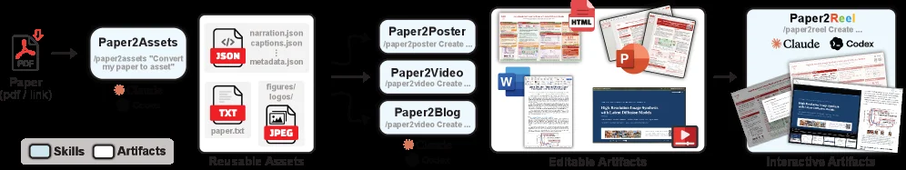
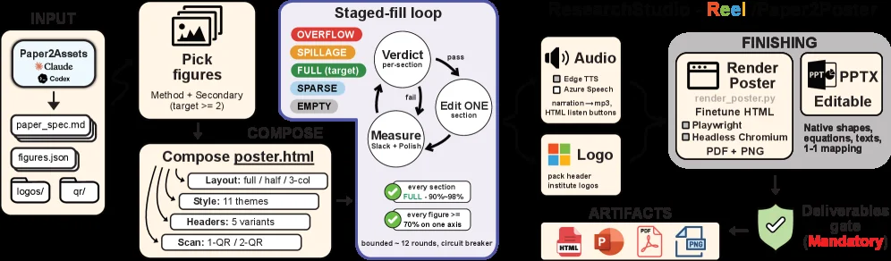
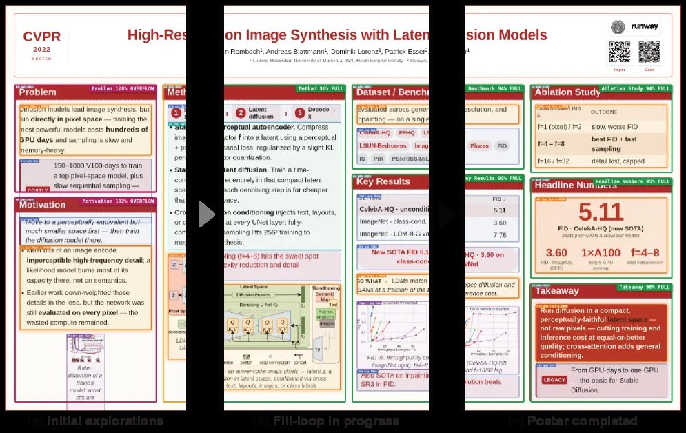
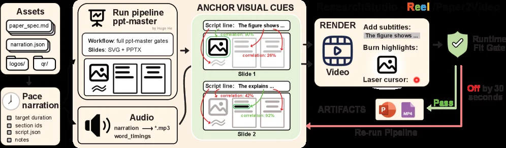
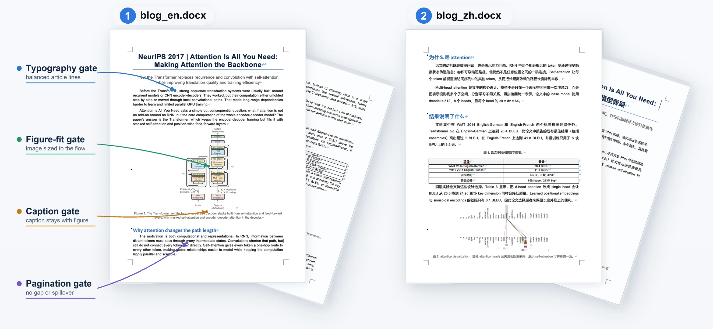

# ResearchStudio-Reel: Automate the Last Mile of Research from Paper to Poster, Video, and Blog

[arXiv](https://arxiv.org/abs/2607.04438) · [HuggingFace](https://huggingface.co/papers/2607.04438) · ▲61

## Abstract (verbatim)

> Research dissemination, turning a paper into a poster, a talk video, and a blog post, is still a manual last mile. Prior automation treats each artifact in isolation that each re-extract the paper from scratch, usually ship one-way renders the author cannot reopen in PowerPoint or Word, and gates quality on soft VLM-preference scores that plateau while load-bearing sections still read as empty. We argue this last mile is best built as a composition of skills: thin agent-readable contracts that share one upstream extractor and wrap deterministic primitives in a measured-fill loop whose exits are hard pass/fail render gates. We instantiate this as ResearchStudio-Reel, five Claude Code and Codex skills organized into one shared extractor (Paper2Assets), three editable generators (Paper2Poster, Paper2Video, Paper2Blog), and one interactive convergence layer (Paper2Reel). Paper2Assets extracts each paper once into a shared bundle that can be reused by every downstream skill; The three generators produce a print-ready poster, a synchronized talk video, and a bilingual blog that stay factually consistent and round-trip through PowerPoint or Word; Paper2Reel then binds all three into a self-contained HTML viewer whose section-level clicks jump the video, slides, captions, and blog to matching content. On the Paper2Poster benchmark, our posters lead every aesthetic and information sub-criterion against both prior automated systems and single-shot frontier LLMs, surpassing the authors' own on aesthetics under two held-out VLM judges and winning overall on 84% to 93% of papers; capability audits further show that, by uniquely pairing narration-aligned on-slide highlights with a bilingual blog gated by layout-aware DOCX repair, ResearchStudio-Reel is the only pipeline to ship all three editable artifacts. Project is available at https://aka.ms/ResearchStudio

## Background

**Background Analysis**

The final stage of research dissemination—transforming academic papers into conference posters, presentation videos, and blog posts—remains a manually intensive process, occurring precisely when researchers have the least capacity. These outputs serve distinct audiences: posters for in-person conferences, videos for online engagement, and blogs for non-expert outreach. Current automation approaches suffer from three critical shortcomings: first, each output requires independent extraction of paper content, leading to inconsistencies (e.g., mismatched figure references across formats); second, generated files are often non-editable (e.g., PDFs or videos), preventing authors from revising them in familiar tools like PowerPoint or Word; third, quality assessment relies on subjective visual scores, potentially overlooking critical content gaps.

ResearchStudio-Reel addresses these issues through a modular architecture. Its core innovation is a shared knowledge extraction layer (Paper2Assets) that processes paper content once, extracting figures, metadata, and key claims. This unified bundle is then reused by three editable generators: a poster tool producing PowerPoint files, a video generator building narrated slides from editable decks, and a bilingual blog output in Word format. A "measured-fill loop" mechanism ensures quality by iterating until deterministic criteria are met, rather than relying on ambiguous machine learning scores.

Key differentiators from prior work include: 1) Cross-format factual consistency, eliminating manual cross-checking; 2) Native editability of all outputs, allowing post-generation adjustments; 3) An integrated interactive viewer (Paper2Reel) that links posters, videos, and blogs, enabling seamless navigation between related content. Experiments show its posters outperform both automated systems and human authors in aesthetic and informational criteria, while the video generator achieves precise alignment between narration and visual highlights. By treating dissemination as a coordinated workflow rather than isolated tasks, this work marks a shift toward systematic solutions for research communication automation.

## Method, Figure by Figure

> Figure 2: The ResearchStudio-Reel pipeline. One PDF in, three editor-ready artifacts out, with one shared extraction stage in the middle. A single Paper2Assets pass produces the bundle that Paper2Poster, Paper2Video, and Paper2Blog each consume verbatim, and Paper2Reel binds the three into one navigable surface. Sharing the same section identifiers, figure handles, and claim anchors keeps the artifacts mutually cross-referenced rather than disjoint.

This figure illustrates the complete workflow of ResearchStudio - Reel, and we can break down each part by the flow of data/information from left to right:

First, the input on the far left is "Paper (pdf / link)", which is a PDF file or a link to a research paper. This is the starting point of the entire process, and an arrow points to the first module, "Paper2Assets".

The "Paper2Assets" module is responsible for extracting assets from the paper, with the operation being "/paper2assets 'Convert my paper to asset'". The "Reusable Assets" output by this module includes several types of files: JSON - formatted files (such as narration.json, captions.json, metadata.json), a TXT - formatted file (paper.txt), and JPEG - formatted files (figures/ logos/). These assets are common inputs for all downstream skills (generators). That is, Paper2Poster, Paper2Video, and Paper2Blog will all use the assets extracted by this module, and they will consume these assets "verbatim" (word - for - word, in their original form). This ensures that the subsequent generated content is based on the same extracted information.

Next, starting from the "Reusable Assets", there are three parallel generator modules: "Paper2Poster", "Paper2Video", and "Paper2Blog", with their operations all being "/paper2[poster/video/blog] Create ...". These three generators belong to the "Editable Artifacts" stage. They generate different editable outputs respectively: Paper2Poster generates a print - ready poster, Paper2Video generates a synchronized presentation video, and Paper2Blog generates a bilingual blog. Moreover, the artifacts generated by these generators can be round - tripped in PowerPoint or Word (that is, they can be imported and exported without losing consistency) because they share the same section identifiers, figure handles, and claim anchors. This makes the different artifacts cross - referenced with each other rather than isolated.

Then, these three editable artifacts will be passed to the "Paper2Reel" module on the far right, with the operation being "/paper2reel Create ...", and it uses Claude and Codex tools. The role of Paper2Reel is to bind these three artifacts into a self - contained HTML viewer. In this viewer, clicking at the section level can jump the video, slides, captions, and blog to the matching content, which realizes the navigation and content association between different artifacts, and this belongs to the "Interactive Artifacts" stage.

To summarize the logic of the entire process: First, the assets of the paper are extracted once by Paper2Assets, and these assets are shared by the three editable generators (poster, video, blog) to ensure the consistency and cross - reference of the content; Then, the editable artifacts generated by these three generators are integrated into an interactive HTML viewer by Paper2Reel to realize the navigation and association between multiple artifacts. Such a design solves the problems of manual research dissemination, repeated extraction, non - editability, and content isolation in previous studies. It realizes the automation process from a paper to multiple dissemination artifacts through the combination of skills (a shared extractor and the wrapping of deterministic primitives).

From the perspective of results (combined with the benchmark test in the paper abstract), in the Paper2Poster benchmark, the posters generated by this method lead in each aesthetic and information sub - criterion compared with previous automated systems and single - shot front - end LLMs, and even exceed the author's own manual results (however, the specific coordinates or visualization of the comparison objects are not detailed in the figure, but the process design supports such results).

---

> Figure 3: The Paper2Poster pipeline. A Paper2Assets bundle (paper spec, cleaned figures, logos, QR) drives an agent that picks the Method plus secondary figures and composes a self-contained poster.html along four axes: column layout, visual style, title-band header, and the Scan-to-Read block. A staged-fill loop then measures each section (slack + polish) and edits one section per round until every panel reads FULL (90–98%) and every figure is large enough on one axis. Narration audio and header logos are packed in, and the converged page is rendered to PDF and PNG and to an editable, native-shape PowerPoint, released only through a mandatory deliverables gate.

This figure illustrates the complete workflow of Paper2Poster, from input to final deliverables, clearly showing the function of each component and the data flow:

1. **Input Phase (INPUT)**：  
   First, the `Paper2Assets` module processes the input. It takes `paper_spec.md` from Claude or Codex and outputs `figures.json` (containing cleaned figure information), `logos/` (institutional logos), and `qrr/` (QR code resources). This step is the foundation of the entire process, ensuring a unified asset bundle for subsequent steps.

2. **Select Figures (Pick figures)**：  
   This module selects the "Method" (method section) plus secondary figures (with a target quantity ≥ 2) from the output of `Paper2Assets`, determining the core content to be displayed, and providing a content basis for the subsequent poster generation.

3. **Compose Poster (Compose poster.html)**：  
   This module is responsible for building the HTML structure of the poster, designing from four dimensions:  
   - Layout: Supports full - width (full), half - width (half), or three - column (3 - col);  
   - Visual style: Provides 11 style options;  
   - Headers: Has 5 variants;  
   - Scan - to - Read block: Can choose 1 - OR or 2 - OR mode.  
   This step integrates the selected content and design parameters to generate the initial `poster.html`.

4. **Staged - fill Loop (Staged - fill loop)**：  
   This is the core optimization loop, including three key steps:  
   - `Measure`: Measures the "slack" (blank space) and "polish" (polishing degree) of each section, and evaluates whether it reaches "FULL" (target range 90% - 98%) and whether each figure is large enough on at least one axis;  
   - `Edit ONE section`: If the measurement fails (fail), edit one section and remeasure; if it passes (pass), proceed to the next link;  
   - Loop control: A maximum of 12 rounds of loops or termination through a "circuit breaker" to ensure that each section reaches the "FULL" state and the figures are sufficiently displayed.  
   The status of the loop is identified by colors: `OVERFLOW` (overflow, red), `SPILLAGE` (overflow, orange), `FULL` (target, green), `SPARSE` (sparse, blue), `EMPTY` (empty, gray).

5. **Resource Packaging (Audio, Logo)**：  
   After the loop converges, narration audio (supporting Edge TTS, Azure Speech, output as mp3) and institutional logos (such as pack header, institute logos) are added to enrich the multimedia and visual elements of the poster.

6. **Rendering and Delivery (FINISHING & ARTIFACTS)**：  
   - `Render Poster`: Render the processed `poster.html` into `Finetune HTML`, `Playwright` (possibly used for automated testing or rendering), `Headless Chromium` (headless browser rendering), and finally output in PDF and PNG formats;  
   - `PPTX Editable`: Generate an editable PowerPoint file, including native shapes, equations, text, and maintaining a 1 - 1 mapping (ensuring content traceability);  
   - `Deliverable gate Mandatory`: All deliverables must pass this mandatory delivery gate to ensure that the quality meets the requirements.

7. **Final Deliverables (ARTIFACTS)**：  
   The final delivered deliverables include files in HTML, PPT, PDF, and PNG formats, as well as an editable PowerPoint. These deliverables are integrated in `Reel` (the right - hand `Reel` part of the figure suggests this is a collection of multi - format outputs).

The core logic of the entire process is: through the shared asset bundle of `Paper2Assets`, `Compose` generates a preliminary poster, the `Staged - fill loop` iteratively optimizes the content filling of each part, and finally packages resources and renders the output, ensuring that the poster meets the requirements in terms of information integrity (each part reaches FULL) and visual presentation (figures are large enough), and that the deliverables are deliverable and editable.

---

> Figure 4: The staged-fill loop, visualized on the Latent Diffusion Models poster. A debug overlay boxes every section and colors it by fill verdict (red / amber for EMPTY / SPARSE , green for FULL , orange / magenta for SPILLAGE / OVERFLOW ), annotated with its fill percentage. (a) Initial explorations: the freshly composed draft is uneven, with several underfilled sections and small figures. (b) Fill-loop in progress: the loop measures each section and edits one per round, so cards pass through OVERFLOW and SPARSE as content is added or trimmed. (c) Poster completed: the loop stops once every section reads FULL (90–98%) and every figure is large enough, yielding the shipped poster.

This diagram illustrates the workflow of the "staged-fill loop" in ResearchStudio - Reel when generating academic posters related to Latent Diffusion Models (LDMs). Through the visualization of three stages (initial exploration, fill loop in progress, and poster completion), it explains how this method works:

### Components and Information Flow
- **Stage (a): Initial explorations**:
    - The poster at this stage is a newly combined draft, with uneven filling of each part. Some sections (such as "Problem", "Motivation", etc.) have little content (marked as EMPTY/SPARSE, corresponding to red/amber), and there are small charts. The information flow starts from the initial draft state, where the filling percentage of each part is low, and subsequent fill loops are needed for optimization.
- **Stage (b): Fill - loop in progress**:
    - This stage shows how the fill loop works. The loop measures the filling status of each section and then edits one section in each round. Content will be added or trimmed, so the cards (sections) will go through states of OVERFLOW (too much content) and SPARSE (insufficient content) until an appropriate filling level is reached. Arrows may indicate the direction of information flow, that is, from the processing of one section to the processing of another section, or from measurement to editing. For example, sections like "Method" and "Dataset/Benchmark" are gradually optimized in this stage, and the richness and size of the content are adjusted.
- **Stage (c): Poster completed**:
    - When the filling rate of each section reaches FULL (90 - 98%) and each chart is large enough, the fill loop stops, and the final poster is generated. At this time, the content of all sections is sufficiently substantial, the information is complete, and it is visually coordinated.

### Specific Operation of the Method
- First, the system generates an initial poster draft (stage a). The filling of each part of this draft is uneven, with some parts having insufficient content (EMPTY/SPARSE) and some charts being small.
- Then, it enters the fill loop (stage b). The system measures the filling status of each section one by one and then edits each section: if the content is insufficient (SPARSE), content is added; if the content is too much (OVERFLOW), content is trimmed. This process is iterative, with one section being processed in each round until the filling rate of all sections meets the requirements (FULL) and the size of the charts is appropriate.
- Finally, when all sections meet the filling requirements (stage c), the fill loop stops, and the final poster is generated, which achieves good results in terms of aesthetics and information transmission.

### Results (Combined with Benchmark)
- In the Paper2Poster benchmark, the posters generated by this method lead the previous automated systems and single - front - line LLMs (Large Language Models) in each aesthetic and information sub - criterion, and even exceed the posters made manually by the authors themselves (as can be seen from the "Poster completed" state in the figure, the final poster has sufficient filling in each part, complete information, and good visual effects). For example, in the "Key Results" section, new SOTA (State - of - the - Art) FID (Frechet Inception Distance, a metric for evaluating image quality) values and other results show that the content quality generated by this method is higher.

---

> Figure 5: Paper2Video overview. The skill reuses the Paper2Assets bundle, plans narration and duration, delegates deck authoring to the full ppt-master workflow, synthesizes aligned audio and captions, renders visual attention cues, and packages the editable deck with captioned and no-subtitle videos. The root deliverables are video.pptx , video.mp4 , and video_no_subtitles.mp4 , while timelines, captions, audio clips, and visual cues stay under assets/ , the auditable intermediates directory.

This figure illustrates the workflow of Paper2Video in ResearchStudio - Reel. We can break down each component and section, as well as the flow of data/information, as follows:

First, look at the left - most "Assets" area. It contains paper - related asset files, such as `paper_spec.md` (paper specification file), `narration.json` (narration - related JSON file), and also `logos/` (logo folder) and `qr/` (QR code folder). These are the basic input assets for the entire process.

Next is the "Pace narration" part. It includes target duration, section IDs, script JSON, and notes. Its function is to plan the rhythm and content structure of the narration, providing a timeline and content guidance for the subsequent audio generation and slide creation.

Then we enter the "Run pipeline ppt - master" module. The workflow of this module is to use the `ppt - master` tool to process slides, and the output slide format is SVG and PPTX (i.e., `Slides: SVG + PPTX`). This module will utilize the inputs from the left - hand "Assets" and "Pace narration" to generate the structure and content of the slides. At the same time, it also processes the audio part: it converts the narration into an MP3 - format audio file ( `word_timings` may be information related to word timing), that is, the output of the "Audio" part is `narration → *.mp3` (word_timings).

After that is the "ANCHOR VISUAL CUES" part. Here, two slides (Slide 1 and Slide 2) are processed. For each slide, there is a corresponding script line, for example, the script line of Slide 1 is "The figure shows...", and that of Slide 2 is "The explains...". At the same time, the correlation calculation is also shown here. For example, Slide 1 has correlations of 30% and 26%, and Slide 2 has correlations of 42% and 92%. These correlations may be used to align visual cues (such as images, text boxes, etc.) and script content. The red and green arrows may represent different alignment or association methods, and the purpose is to synthesize aligned visual attention cues.

Then comes the "RENDER" module. The function of this module is to render the video. It will add subtitles (the subtitle content comes from the previous script line, such as "The figure shows..."); it will also "Burn highlights" (burning highlights, which may refer to highlighting certain contents in the video) and use the "Laser cursor" (laser pointer, which may simulate the pointer effect during demonstration). The output of rendering is the video (Video). At the same time, there are some auditable intermediate files, such as timelines, captions, audio clips, and visual cues. These files will be stored in the `assets/` directory.

Finally, there are the "Runtime Fit Gate" and "Re - run Pipeline" parts. "Runtime Fit Gate" is a quality - checking checkpoint. If it passes (Pass), the final deliverables will be output, including `video.pptx` (editable slides), `video.mp4` (video with subtitles), and `video_no_subtitles.mp4` (video without subtitles); if it fails (Off by 30 seconds, which may be a time deviation), the pipeline will be re - run (Re - run Pipeline) until it passes the quality check.

The core logic of the entire process is: reuse the asset package extracted by Paper2Assets, plan the narration and duration, delegate the slide creation to the `ppt - master` workflow, synthesize speech and aligned subtitles, render visual attention cues, and finally package the editable slides and different versions of the video for output. In this way, the generated slides and videos maintain factual consistency and can be switched back and forth in PowerPoint or Word (round - trip).

From the components and arrow flows in the figure, we can see that the data flow starts from the asset input, goes through narration rhythm planning, slide and audio generation, visual cue synthesis, then to video rendering and quality checking, and finally outputs the final deliverables. If a certain step in the middle does not meet the requirements (such as time deviation), the pipeline will be re - run to ensure the quality of the final result.

---

> Figure 8: Paper2Blog DOCX showcase. The figure shows the two required Word deliverables, the English article and the Chinese article, together with the layout checks discussed in the text: typography balance, figure fit, caption placement, and pagination risk.

This figure (Figure 8) showcases the DOCX output of the Paper2Blog function within the ResearchStudio-Reel method, focusing on the two required Word deliverables (the English article and the Chinese article) along with the layout checks discussed in the text: typography balance, figure fit, caption placement, and pagination risk. We analyze each part:

First, the left side of the figure lists four key "gates" (checkpoints) that ensure the quality of the blog document layout:
1.  **Typography gate (排版平衡)**：Indicated by a blue arrow and text, pointing to the title area of the English blog document (blog_en.docx). This checkpoint ensures that typographic elements like line spacing and font size are balanced, making the text look neat and readable.
2.  **Figure-fit gate (图像适配)**：Indicated by a green arrow and text, pointing to the chart (Figure 1: The Transformer architecture...) in the English blog document. This checkpoint ensures that inserted images (like charts) are appropriately sized within the document flow, neither too large nor too small, and coordinate well with surrounding text.
3.  **Caption gate (标题放置)**：Indicated by an orange arrow and text, pointing to the caption below the chart in the English blog document (Figure 1. The Transformer architecture...). This checkpoint ensures that the image caption follows the image correctly, with the right position for easy reader comprehension.
4.  **Pagination gate (分页风险)**：Indicated by a purple arrow and text, pointing to the bottom area of the English blog document. This checkpoint ensures that no content breaks or blank pages occur during document pagination, maintaining reading continuity.

Next, the figure displays two main Word documents:
-   **blog_en.docx (English blog document)**：Located on the left side of the figure, it is one of the deliverables generated by Paper2Blog. The document content includes:
    -   Title: "NeurIPS 2017 | Attention Is All You Need: Making Attention the Backbone", with a subtitle explaining how the Transformer model replaces recurrence and convolution with self-attention.
    -   Body paragraphs: Explaining the background and innovation of the Transformer model.
    -   Chart (Figure 1): Showing the architecture of the Transformer, including the encoder and decoder structures.
    -   Chart title and description: Located below the chart, explaining the chart's content.
    -   Subsequent section titles: "Why attention changes the path length", and related body text.
    -   Bottom area: Possibly involving the pagination check part.

-   **blog_zh.docx (Chinese blog document)**：Located on the right side of the figure, it is another deliverable generated by Paper2Blog, corresponding in content to the English blog document but in a different language. The document content includes:
    -   Title: "为什么是attention", and subsequent section titles like "结果说明了什么".
    -   Body paragraphs: Explaining the motivation, multi-head attention design, and experimental results of the Transformer model in Chinese.
    -   Table (Table 1: Key numerical summary in the paper): Presenting key experimental data, such as BLEU scores.
    -   Chart (Figure 2: attention visualization): Showing the visualization results of the attention mechanism.
    -   Subsequent section titles and content: Continuing to explain the model's details and advantages.

These two documents (blog_en.docx and blog_zh.docx) are the two required Word deliverables generated by Paper2Blog. The method works as follows: First, the Paper2Assets extractor extracts information from the original paper, and then the Paper2Blog generator generates these two bilingual blog documents. During the generation process, the four "gate" checkpoints mentioned above are applied to ensure document quality:
-   Typography balance (Typography gate) ensures aesthetically pleasing text layout.
-   Figure fit (Figure-fit gate) ensures appropriate image sizing.
-   Caption placement (Caption gate) ensures correct image captions.
-   Pagination risk (Pagination gate) ensures reasonable pagination.

In this way, Paper2Blog can generate high-quality bilingual blog documents that are guaranteed in terms of factual consistency, format, and readability. The two documents shown in the figure are the results of this method's operation, as they have passed all layout checks, demonstrating the effectiveness of the method.
