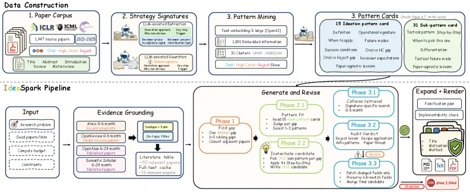
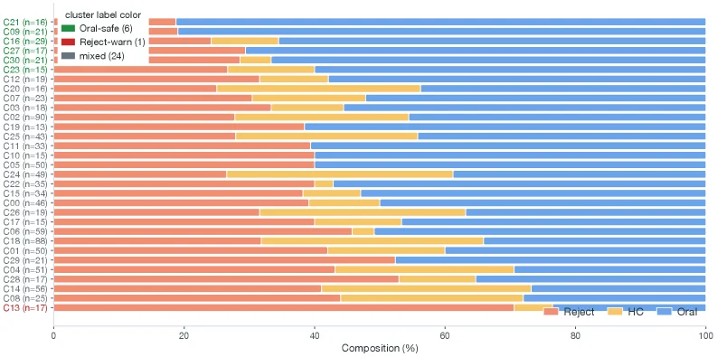
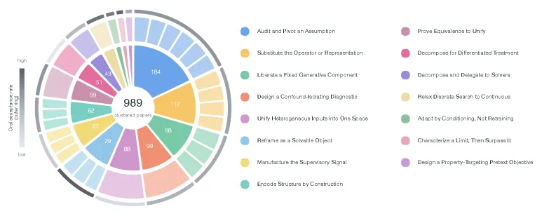
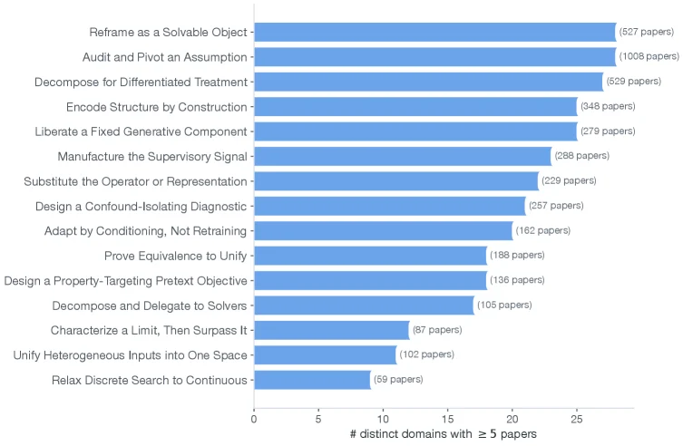
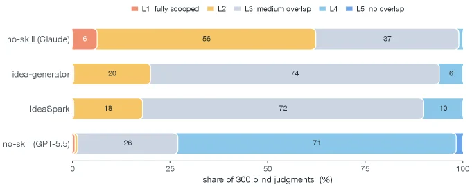

# ResearchStudio-Idea: An Evidence-Grounded Research-Ideation Skill Suite from ML Conference Outcomes

[arXiv](https://arxiv.org/abs/2607.04439) · [HuggingFace](https://huggingface.co/papers/2607.04439) · ▲53

## 摘要（原文）

> Large language models have made research ideation increasingly accessible, yet effective idea development requires more than generating candidate directions. Researchers must ground a problem in current literature, identify meaningful bottlenecks, differentiate from existing solutions, and evaluate risks before committing to implementation. We present ResearchStudio-Idea as a reusable skill suite for this first mile of research ideation. The suite includes Paper-Search, a standalone multi-source literature search skill; Scoop-Check, a standalone prior-art collision checker for novelty claims; and IdeaSpark, the end-to-end skill that composes evidence grounding, pattern-guided generation, collision retrieval, audit, and idea-card rendering into one workflow. IdeaSpark is constructed from a corpus of 1,947 machine learning conference papers collected from ICLR, ICML, and NeurIPS between 2021 and 2025, including Oral papers, a separately tracked high-citation subset, and rejected submissions. Analysis of these outcomes reveals 31 recurring ideation sub-patterns, consolidated into 15 reusable ideation patterns. Each pattern is operationalized as a structured card containing research contexts, bottleneck types, differentiation strategies, supporting precedents, and common failure modes. Given a research problem and an evidence bundle, IdeaSpark evaluates evidence readiness, reconstructs the surrounding research context, identifies unresolved bottlenecks, selects relevant patterns, instantiates one candidate direction, retrieves potentially conflicting prior work, and performs outcome-informed auditing. This workflow transforms reusable ideation patterns into traceable research proposals. Blind automated-judge evaluations show that IdeaSpark consistently produces stronger research proposals than no-skill and generic-skill baselines while maintaining competitive novelty.

## 摘要（中译）

大型语言模型使研究构思变得越来越容易实现，但有效的想法开发不仅仅是生成候选方向。研究人员必须将一个问题置于当前文献中，识别有意义的瓶颈，与现有解决方案区分开来，并在投入实施之前评估风险。我们推出了ResearchStudio - Idea，作为研究构思初始阶段的可复用技能套件。该套件包括Paper - Search，一个独立的多源文献搜索技能；Scoop - Check，一个用于新颖性声明的独立现有技术冲突检查器；以及IdeaSpark，这是一个端到端的技能，将证据支撑、模式引导生成、冲突检索、审计和想法卡渲染整合到一个工作流程中。IdeaSpark是从2021年至2025年从ICLR、ICML和NeurIPS收集的1947篇机器学习会议论文语料库构建而成的，其中包括口头报告论文（一个单独跟踪的高引用子集）和被拒稿件。对这些结果的分析揭示了31种重复出现的构思子模式，这些子模式被整合为15种可复用的构思模式。每种模式都被实现为一个结构化卡片，其中包含研究背景、瓶颈类型、差异化策略、支持先例和常见失败模式。给定一个研究问题和一组证据，IdeaSpark会评估证据的准备情况，重建周围的研究背景，识别未解决的瓶颈，选择相关模式，实例化一个候选方向，检索可能冲突的先前工作，并进行基于结果的审计。这个工作流程将可复用的构思模式转化为可追溯的研究提案。盲法自动评审评估表明，IdeaSpark始终能生成比无技能和通用技能基线更强的研究提案，同时保持有竞争力的新颖性。

## 背景剖析

**背景剖析**

**1. 技术背景**  
随着大语言模型（LLM）的发展，科研人员越来越依赖自动化工具辅助研究构思，例如文献检索、假设生成和实验规划等。然而，从“生成初步想法”到“发展出可落地的科研方向”之间存在关键缺口：研究者需要将问题扎根于现有文献，识别核心瓶颈，区分于已有方案，并评估风险。例如，一个关于“改进机器学习模型效率”的想法，必须回答“现有方法的哪些缺陷是真正未被解决的？”“我的方法如何避免与同类研究重复？”等问题。这类需求在AI领域尤为突出，因为技术迭代快、竞争激烈，研究者需要高效筛选有价值的方向。

**2. 之前的问题**  
现有工具链存在明显局限：  
- **碎片化**：文献搜索、新颖性检查、生成候选方向等功能分散在不同工具中，缺乏统一工作流。  
- **浅层分析**：许多系统仅能生成表面新颖的想法，但无法验证其可行性或区分“表面创新”与“实质贡献”。例如，有研究显示LLM生成的想法可能比专家更“新颖”，但实际执行难度更高。  
- **缺乏实证指导**：现有方法多依赖规则或通用模型，未充分利用公开会议论文中的失败案例、评审反馈等实证数据来规避常见陷阱。  

**3. 本文的解法**  
ResearchStudio-Idea通过三个核心技能解决上述问题：  
- **Paper-Search**：整合多平台文献检索，提供可复用的证据基础。  
- **Scoop-Check**：检查新颖性声明是否与现有工作冲突。  
- **IdeaSpark**：整合工作流，从问题输入到生成结构化研究方向。其核心是**“构思模式卡片”**——从1,947篇ML会议论文（包括录用、高引用和被拒稿）中提炼出15种可复用的研究策略模式。这些卡片记录了成功案例的结构、瓶颈类型、差异化策略及常见失败模式，帮助LLM生成经过验证的研究方向。  

**4. 切入角度**  
与前人工作的关键差异在于：  
- **实证驱动**：基于真实会议论文的成败案例，而非仅依赖接受论文或通用语料。  
- **可审计性**：生成的想法附带明确的证据链和失败模式分析，便于后续验证。  
- **组合性**：支持多模式组合，而非单一策略，更贴近真实研究的复杂性。  

通过这种方式，ResearchStudio-Idea将“从文献到想法”的过程转化为可操作的技能，而非另一个黑箱生成工具。

## 方法图解

> Figure 2 : IdeaSpark data-to-skill workflow. The upper band constructs reusable ideation assets from the 1,947-paper ICLR / ICML / NeurIPS corpus: papers are outcome-labeled, normalized into strategy signatures, mined into 31 sub-patterns, and induced into 15 operational pattern cards. The lower band shows how the skill uses those cards at inference time: evidence grounding and full-text retrieval feed a staged reasoning loop for bottleneck diagnosis, pattern-guided candidate generation, and collision/audit verdicts, followed by expansion, validation, and idea-card deliverables.

这张图展示了IdeaSpark的“数据到技能”工作流程，分为**上半部分的“数据构建（Data Construction）”**和**下半部分的“IdeaSpark Pipeline（推理时工作流）”**，清晰呈现从文献数据到研究创意生成的完整逻辑：  

### 一、上半部分：数据构建（从文献到可复用创意资产）  
这部分的核心是**从1947篇机器学习会议论文（ICLR、ICML、NeurIPS 2021-2025）中提取可复用的创意模式**，流程按箭头顺序依次为：  

1. **Paper Corpus（论文语料库）**：  
   输入是1947篇来自ICLR、ICML、NeurIPS的论文（2021-2025年），包含Oral论文、高被引子集和被拒投稿。这一步是数据的“原材料”，提供研究背景的基础文献。  

2. **Strategy Signatures（策略签名）**：  
   对论文进行**“结果标注”**（如成功/失败、方法类型等）和**“标准化”**（将论文的方法、问题等转化为统一的“策略签名”格式）。这一步是对文献进行结构化解析，提取关键策略信息，为后续模式挖掘做准备。  

3. **Pattern Mining（模式挖掘）**：  
   基于策略签名，通过**文本嵌入（Text-embedding，如Large Language Model）、LDA主题建模、聚类（Clusters）**等方法，从文献中挖掘出**31个“子模式（sub-patterns）”**。这一步是从大量文献中识别重复出现的研究思路或问题解决模式。  

4. **Pattern Cards（模式卡片）**：  
   将31个子模式**整合为15个“可操作的创意模式（operational pattern cards）”**。每个模式卡片包含：  
   - 定义（Definition）、操作签名（Operational signature）、成功条件（Success conditions）、失败条件（Failure conditions）；  
   - 技术趋势（Technical trend）、差异化策略（Differentiation）、战术性失败模式（Tactical failure mode）等。  
   这些卡片是“可复用的创意资产”，为后续推理提供结构化的模式指导。  

### 二、下半部分：IdeaSpark Pipeline（推理时的创意生成工作流）  
这部分展示**给定研究问题和证据包时，IdeaSpark如何利用上述模式卡片生成创意**，流程按箭头顺序依次为：  

1. **Input（输入）**：  
   输入包括**研究问题（Research problem）、候选方向（Candidate directions）、时间预算（Timeline budget）、约束条件（Constraints）**。这是创意生成的“起点”，明确用户的需求和限制。  

2. **Evidence Grounding（证据锚定）**：  
   对输入进行**“范围界定”**（如0-6个月、6-12个月的研究范围）和**“全文本检索”**（从文献库中获取相关文献），生成**“文献表格（Literature table）”**（包含50+相关论文、全文缓存等）。这一步是为后续分析提供“证据基础”，确保创意基于现有文献。  

3. **Staged Reasoning Loop（分阶段推理循环）**：  
   这是核心推理环节，分为多个阶段：  
   - **Phase 1（阶段1）**：  
     - **Find gap（找缺口）**：识别现有研究的“未解决瓶颈（unresolved bottlenecks）”；  
     - **One/two hop（1/2跳）**：从相关文献中扩展1-2层的关联研究；  
     - **Closest adjacent papers（最相邻论文）**：找到与问题最相关的邻近论文。  
   - **Phase 2（阶段2）**：  
     - **Pattern fit（模式匹配）**：将问题与15个模式卡片匹配，筛选相关模式；  
     - **Instantiate candidate（实例化候选）**：基于匹配的模式，生成初始创意候选（如“Write 3-5 candidates”）。  
   - **Phase 2.1 & 2.2（子阶段）**：  
     - **Phase 2.1（模式拟合与搜索）**：进一步优化模式匹配，进行“模式拟合”和“符号/语义搜索”；  
     - **Phase 2.2（实例化与验证）**：对候选创意进行“实例化”（如“Instantiate 3-5 candidates”）和“验证”（如“Verify 3-5 candidates”）。  
   - **Phase 3（阶段3）**：  
     - **Phase 3.1（碰撞检索）**：检查创意的“新颖性”，避免与现有研究“碰撞”（如“Collision retrieval”“Significance-specific search”）；  
     - **Phase 3.2（审计）**：对创意进行“审计”（如“Audit via: ...”“Anti-patterns”），识别潜在风险；  
     - **Phase 3.3（补丁与调整）**：根据审计结果，调整创意（如“Patch changed fields”“Merge with other candidates”）。  

4. **Expand + Render（扩展与渲染）**：  
   对通过审计的创意进行**“扩展”**（如“Fabrication plan”“Implementation check”）和**“渲染”**（生成最终的“创意卡片（Idea card）”），包含方法（Methods）、技术细节（Tech）、验证（Valid.）等信息。  

### 方法运作的核心逻辑  
IdeaSpark的工作流程是**“数据驱动+推理循环”**：  
- 先从大量文献中提取可复用的“模式卡片”（数据构建阶段），为创意提供结构化指导；  
- 再在推理时，通过“证据锚定”获取背景知识，通过“分阶段推理循环”（找缺口→匹配模式→实例化→验证→调整）生成并优化创意，最终输出可落地的创意卡片。  

这种方法确保创意不仅基于现有文献，还能**识别研究瓶颈、区分于现有方案、评估风险**，解决了“仅生成候选方向而缺乏深度验证”的问题。  

（注：图中箭头表示数据/信息的流动方向，每个模块的输出是下一个模块的输入，形成从“文献数据”到“创意输出”的端到端流程。）

---

> Figure 3 : Acceptance composition of the 31 clusters, sorted by Oral rate among O + R O{+}R . Six clusters clear the 65% Oral threshold; one clears the 65% Reject threshold. The remaining 24 are mixed. Cluster labels are colored by risk flag (green = Oral-safe, red = Reject-warn, gray = mixed; deliberately off the bar palette); the threshold uses p O p_{O} among O + R O{+}R , so it is shown via label color rather than an x x -axis line, because the bars are O / H ​ C / R O/HC/R shares that include HC.

这张图（图3）展示了31个聚类的“接受情况构成”，这些聚类是根据“Oral（口头报告）率在Oral（O）和Reject（拒绝，R）之和（O+R）中的占比”进行排序的。

首先，我们来看图的结构：
*   **Y轴**：列出了31个聚类，每个聚类都有一个标签（如C21, C19等）和该聚类中的样本数量（例如C21 (n=16) 表示聚类C21有16篇论文）。这些聚类标签被赋予了不同的颜色，代表不同的“风险标志”：
    *   **绿色**：表示“Oral-safe”（口头报告安全），意味着这个聚类中的论文有较高的概率被接受为口头报告。
    *   **红色**：表示“Reject-warn”（拒绝警告），意味着这个聚类中的论文有较高的概率被拒绝。
    *   **灰色**：表示“mixed”（混合），意味着这个聚类中的论文在接受和拒绝之间的分布较为平均，或者没有明显的倾向。
*   **X轴**：表示“Composition (%)”（构成百分比），范围从0%到100%。每个聚类对应一个水平条形图，条形图被分为三个颜色部分，分别代表：
    *   **橙色**：代表“Reject”（拒绝）的论文比例。
    *   **黄色**：代表“HC”（可能是指High-Citation，高引用，或者是其他特定类别，但根据caption，它与O和R一起构成总和）的论文比例。
    *   **蓝色**：代表“Oral”（口头报告）的论文比例。
    这三个部分加起来是100%，表示该聚类中所有论文的最终结果分布。

数据的流动和信息的解读顺序如下：
1.  首先，我们关注Y轴上的每个聚类。每个聚类都有一个名称（如C21）和一个样本量（如n=16）。
2.  然后，我们观察该聚类对应的水平条形图。条形图的长度代表了该聚类中所有论文的总数（以百分比形式表示，但实际上每个条形的总长度都是100%，代表该聚类的全部样本）。
3.  条形图的颜色分布（橙色、黄色、蓝色）显示了该聚类中论文被归类为“拒绝”、“HC”和“口头报告”的比例。
4.  聚类标签的颜色（绿色、红色或灰色）提供了一个高层次的“风险标志”或分类，这是基于“Oral率在O+R中的占比”是否超过某个阈值（具体来说是65%）。
    *   如果一个聚类的“Oral”（蓝色）部分占比很高，并且其“Oral率”（即蓝色部分占橙色+蓝色部分的比例）超过了65%，那么它的标签会是绿色（“Oral-safe”）。
    *   如果一个聚类的“Reject”（橙色）部分占比很高，并且其“Reject率”（即橙色部分占橙色+蓝色部分的比例）超过了65%，那么它的标签会是红色（“Reject-warn”）。
    *   其他情况（即既没有达到65%的“Oral率”，也没有达到65%的“Reject率”）的聚类，其标签会是灰色（“mixed”）。

这张图揭示的方法运作方式如下：
*   **聚类分析**：论文首先被分成31个不同的聚类。这些聚类可能是基于论文的主题、方法、结果或其他特征。
*   **结果分类**：对于每个聚类中的每篇论文，根据其最终结果（是否被接受为口头报告、被拒绝，或者属于其他类别如HC）进行分类。
*   **比例计算**：计算每个聚类中不同结果类别的论文所占的比例。
*   **阈值设定与标记**：设定一个阈值（这里是65%的“Oral率”在O+R中），根据这个阈值来判断每个聚类的整体趋势。如果一个聚类的“Oral率”超过65%，则标记为“Oral-safe”；如果“Reject率”超过65%，则标记为“Reject-warn”；否则标记为“mixed”。
*   **可视化**：通过水平条形图直观地展示每个聚类中不同结果类别的比例，并通过标签颜色来突出显示聚类的整体风险或趋势。

结论：
*   图中显示了31个聚类的接受情况构成。
*   其中，有6个聚类通过了“65% Oral率”的阈值（即它们的“Oral”（蓝色）部分在“Oral+Reject”（O+R）中占比超过65%），这些聚类的标签是绿色的（“Oral-safe”）。
*   有1个聚类通过了“65% Reject率”的阈值（即它们的“Reject”（橙色）部分在“Oral+Reject”（O+R）中占比超过65%），这个聚类的标签是红色的（“Reject-warn”）。
*   剩下的24个聚类被标记为“mixed”（混合），它们的标签是灰色的，意味着它们在“Oral”和“Reject”之间的分布没有达到上述任何一个阈值。
*   条形图中的颜色（橙色、黄色、蓝色）分别代表了“Reject”、“HC”和“Oral”的论文比例。需要注意的是，这里的“HC”类别在caption中没有详细解释，但它与“Oral”和“Reject”一起构成了论文结果的完整分布。
*   聚类是按照“Oral率在O+R中的占比”进行排序的，这意味着图中从上到下的聚类，其“Oral率”可能是逐渐降低的，或者至少是按照某种与“Oral”相关的指标排序的。

---

> Figure 5 : Ideation-pattern hierarchy across 989 clustered papers. Three concentric rings share one angular layout, ordered by size clockwise from 12 o’clock; categorical colors identify the 15 patterns and are reused across all rings, with white gaps separating segments. Inner ring : the 15 induced Level-1 ideation patterns, each wedge sized by its clustered-paper count (the count is printed inside the larger wedges; full pattern names are in the right-hand legend). Middle ring : each pattern’s arc is subdivided into its constituent sub-clusters (31 in total), shaded as a lighter tint of the parent pattern; the number of segments within a wedge shows how finely that pattern fragments, while the segment angle is the equal share within the pattern, not the per-sub-cluster paper count. Outer ring : a thin heat band encoding each pattern’s Oral acceptance rate p O = n O / ( n O + n H ​ C + n R ) p_{O}=n_{O}/(n_{O}+n_{HC}+n_{R}) on the light-to-dark gray scale shown at left (light = low, dark = high), so reviewer outcome can be read against methodology at a glance. Totals: 15 patterns, 31 sub-clusters, 989 clustered papers (of 1,891 embedded).

这张图（图5）展示了**989篇聚类论文**上的“构思模式层级”结构，通过**三个同心环**的布局（角度顺序一致，顺时针从12点方向开始排序），结合颜色、大小、分段和热力带，直观呈现15个构思模式的分布、子簇划分及评审接受率。以下分环解析：  

### 1. 内层环（Level-1构思模式）  
- **内容**：展示15个“诱导出的Level-1构思模式”，每个扇形（wedge）的大小由其**聚类论文数量**决定（大扇形内标注了具体数量，如184、117等；完整模式名称见右侧图例）。  
- **颜色与对应关系**：15种分类颜色（如蓝色代表“Audit and Pivot an Assumption”、橙色代表“Substitute the Operator or Representation”等）唯一标识每个模式，且颜色在所有环中重复使用，便于跨环关联。  
- **作用**：呈现最高层级的构思模式及其对应的论文数量规模，帮助快速识别哪些模式在聚类论文中更普遍。  

### 2. 中间环（子簇划分）  
- **内容**：每个Level-1模式的扇形被**细分为其组成子簇**（共31个子簇）。子簇的颜色是父模式的“浅色调”（保持颜色关联，便于识别归属），扇形内的**分段数量**显示该模式“细分的精细程度”（即有多少个子簇）；而每个子簇的**角度**是“模式内的等份额”（非子簇的论文数量占比）。  
- **作用**：展示每个Level-1模式内部的子结构，揭示模式的细分逻辑（如某些模式可能包含更多子簇，说明其内部多样性更高）。  

### 3. 外层环（评审接受率热力带）  
- **内容**：一个薄的热力带，编码每个模式的**Oral接受率** \( p_O = \frac{n_O}{n_O + n_{HC} + n_R} \)（其中\( n_O \)为Oral录取数，\( n_{HC} \)为高引用候选数，\( n_R \)为拒绝数）。热力带的颜色从**浅灰（低接受率）到深灰（高接受率）**渐变（左侧颜色条标注“low”到“high”）。  
- **作用**：将“方法论（构思模式）”与“评审结果（接受率）”关联，读者可快速对比不同模式的评审表现（如深灰色模式可能在评审中更受认可）。  

### 数据流动与整体逻辑  
图中数据的组织逻辑是：从**宏观（15个Level-1模式的数量分布）**到**中观（每个模式的子簇细分）**，再到**微观（每个模式的评审接受率）**，通过“环”的嵌套结构和颜色、大小、热力的视觉编码，清晰传递三层信息：  
- 哪些构思模式在聚类论文中更常见（内层环的大小）；  
- 每个模式的内部结构如何（中间环的分段）；  
- 不同模式的评审接受率差异（外层环的热力）。  

### 方法运作的直观体现（结合论文背景）  
论文提出“ResearchStudio-Idea”技能套件，用于研究构思的“第一英里”（从问题到初步构思）。这张图是该套件的**分析结果**：基于1,947篇ML会议论文（ICLR、ICML、NeurIPS 2021-2025）的聚类分析，识别出31个重复的构思子模式，合并为15个可复用的构思模式。图中通过三层环结构，展示了这些模式的**分布（数量）、结构（子簇）和效果（接受率）**，帮助研究者理解：哪些模式更普遍、内部如何细分、以及在评审中表现如何——这为“IdeaSpark”等工具的模式选择和优化提供了数据支持（例如，高接受率的模式可能更值得优先使用）。  

### 结论式解读  
这张图通过三个同心环的视觉编码，清晰展示了989篇聚类论文中15个构思模式的**数量分布**（内层环）、**子簇细分**（中间环）和**评审接受率**（外层环）。读者可通过颜色关联模式、大小判断普遍性、分段理解结构、热力对比效果，从而快速把握不同构思模式的特点与表现。例如，蓝色模式（Audit and Pivot an Assumption）论文数量最多（184），且接受率较高（深灰色）；而某些小数量的模式（如51、50等）可能接受率较低（浅灰色）。这种可视化帮助研究者高效识别有价值、高接受率的构思模式，支撑研究构思的优化与选择。

---

> Figure 11 : Ideation-pattern breadth: number of distinct domains each ideation pattern has ≥ 5 \geq 5 papers in (out of 28). The annotation gives each pattern’s multi-label paper count: a paper is counted under every pattern it carries, so these counts overlap across patterns and sum to more than the 1 , 891 1{,}891 -paper corpus. Most patterns touch ≥ 18 \geq 18 domains, supporting the skill’s domain-agnostic positioning.

这张图（图11）展示了**“每个构思模式覆盖的领域数量”**（即有多少个不同的研究领域中，该模式的论文数≥5篇），核心是验证方法（ResearchStudio - Idea）的**领域无关性**（domain - agnostic）。以下是详细解读：

### 图的组件与信息流动
- **横轴（X轴）**：标注为“# distinct domains with ≥5 papers”，表示“包含至少5篇该模式论文的不同领域的数量”。数值从0到25，展示每个模式覆盖的领域规模。
- **纵轴（Y轴）**：列出了15个**构思模式**（如“Reframe as a Solvable Object”“Audit and Pivot an Assumption”等），这些模式是从1,891篇机器学习会议论文（ICLR、ICML、NeurIPS 2021 - 2025）中分析出的15个可复用的构思模式。
- **蓝色条形图**：每个条形的长度对应该模式覆盖的“≥5篇论文的领域数量”。例如，“Audit and Pivot an Assumption”的条形最长，标注有“1008 papers”？不，不对——仔细看：条形末端的数字是**该模式的总论文数**（因为注释说“a paper is counted under every pattern it carries，so these counts overlap”，即一篇论文可能属于多个模式，所以总论文数（1,891）是各模式论文数的重叠和）。而横轴的数值是“领域数量”，比如“Reframe as a Solvable Object”的条形末端对应横轴约25的位置？不，看横轴刻度：最右侧是25，而“Reframe as a Solvable Object”的条形长度到约25？不对，看具体数值：“Reframe as a Solvable Object”的括号内是“(827 papers)”，但横轴的刻度是“领域数量”。哦，正确的逻辑是：**每个条形的高度（纵轴）是模式名称，条形的长度（横轴方向）是“该模式覆盖的领域数量（≥5篇论文的领域数）”，而括号内的数字是该模式的“总论文数”（因为一篇论文可能属于多个模式，所以总论文数是重叠计数的）**。

### 方法的运作逻辑（从图中看方法如何支持领域无关性）
ResearchStudio - Idea的目标是提供**领域无关的构思支持**（即方法不依赖特定研究领域，能在多领域生效）。这张图通过分析15个构思模式的“领域覆盖数”来验证这一点：
1. **模式提取**：从1,891篇论文中分析出31个重复的构思子模式，合并为15个可复用的模式。
2. **领域覆盖统计**：对每个模式，统计“有多少个不同的研究领域中，该模式的论文数≥5篇”（即横轴的“# distinct domains with ≥5 papers”）。
3. **结果解读**：图中显示，**大多数模式覆盖的领域数≥18**（从横轴看，多数条形的长度接近或超过15，甚至到25）。例如：
   - “Audit and Pivot an Assumption”的条形最长，覆盖约25个领域（横轴最大值），总论文数1008篇（括号内）。
   - “Reframe as a Solvable Object”覆盖约25个领域，总论文数827篇。
   - 即使是覆盖较少的模式（如“Relax Discrete Search to Continuous”），也覆盖了约10个领域（横轴约10的位置），总论文数59篇。

### 结论（从图中得出的方法有效性）
这张图支持了ResearchStudio - Idea的**“领域无关定位”**：
- 大多数构思模式能覆盖≥18个不同的研究领域（从横轴刻度看，多数条形的长度在15以上，甚至接近25）。
- 这意味着，无论研究问题属于哪个领域，ResearchStudio - Idea提供的构思模式都有广泛的应用场景，因为它们已经在多个领域中被验证（通过≥5篇论文的支持）。
- 论文中提到“sum to more than the 1,891 - paper corpus”是因为**论文可以被多个模式分类**（即一篇论文可能同时属于多个构思模式，所以各模式的总论文数之和超过实际论文总数），这也说明模式之间有重叠，但每个模式的领域覆盖数仍能反映其跨领域的适用性。

简言之，这张图通过统计每个构思模式的“跨领域覆盖数”，证明了ResearchStudio - Idea的方法（构思模式）具有**领域无关性**——能在多个研究领域中有效支持研究构思。

---

> Figure 16 : Distribution of novelty levels per system (L1 = fully scooped → \rightarrow L5 = no overlap). The skill generators concentrate at L3 (medium overlap: shared framing/domain, distinct mechanism); the bare GPT-5.5 baseline piles up at L4, where its vagueness evades collision.

这张图（图16）展示了不同系统在研究创意新颖性水平上的分布情况。横轴表示300次盲评的百分比，纵轴列出了四个不同的系统：no-skill (Claude)、idea-generator、IdeaSpark和no-skill (GPT-5.5)。每个系统对应一条横向的条形图，条形图被不同颜色的区块分割，代表不同的新颖性级别。

图例解释了颜色与新颖性级别的对应关系：
- 红色（L1）：完全被覆盖（fully scooped），意味着创意与现有研究高度重叠。
- 橙色（L2）：未明确说明，但可能代表较低程度的重叠。
- 黄色（L3）：中等重叠（medium overlap），即共享框架或领域，但机制不同。
- 浅蓝色（L4）：无重叠（no overlap），但可能因模糊而避免冲突。
- 深蓝色（L5）：无重叠（no overlap），可能代表完全新颖的创意。

从图中可以看出：
- no-skill (Claude) 的创意主要分布在L2（56%）和L3（37%），表明其创意在某些方面与现有研究有重叠，但也有部分具有中等新颖性。
- idea-generator 的创意主要集中在L3（74%），说明其生成的创意大多具有中等新颖性，即共享框架但机制不同。
- IdeaSpark 的创意分布与idea-generator类似，主要集中在L3（72%），表明其生成的创意也具有中等新颖性。
- no-skill (GPT-5.5) 的创意主要分布在L4（71%），说明其生成的创意大多因模糊而避免冲突，新颖性较低。

这张图揭示了不同系统在研究创意新颖性上的表现。IdeaSpark作为一个端到端的技能套件，能够生成具有中等新颖性的创意，而GPT-5.5基线则主要生成模糊且新颖性较低的创意。这表明IdeaSpark在研究创意生成方面具有优势，能够更好地平衡新颖性和实用性。
