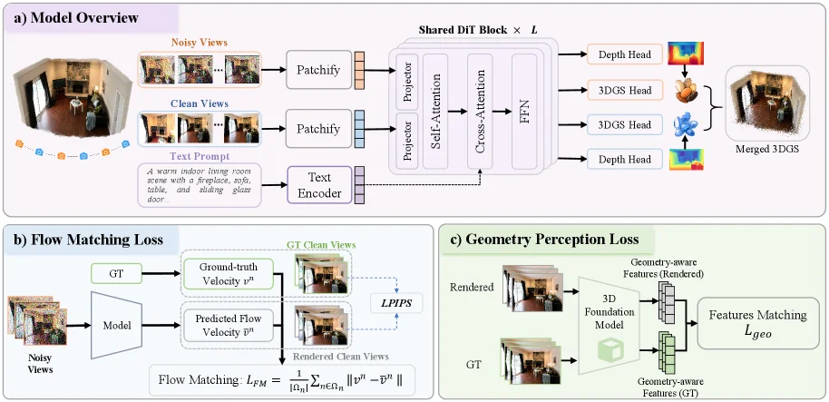
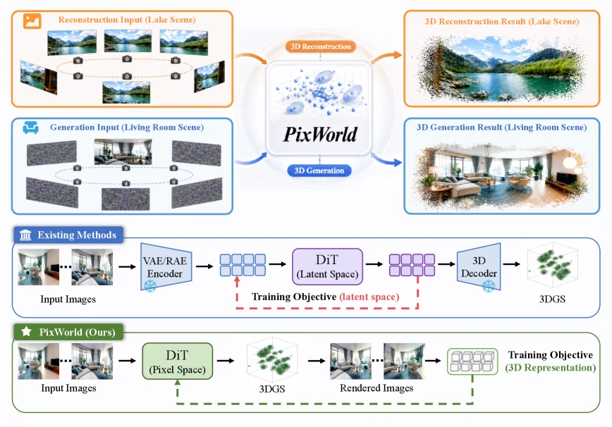
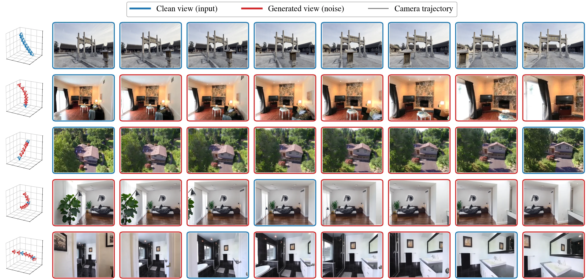

# PixWorld: Unifying 3D Scene Generation and Reconstruction in Pixel Space

[arXiv](https://arxiv.org/abs/2607.05373) · [HuggingFace](https://huggingface.co/papers/2607.05373) · ▲61

## 摘要（原文）

> 3D reconstruction and generation are commonly tackled by separate paradigms: pixel-based regression for reconstruction, and latent diffusion for generation. Recent works attempt to unify them in latent space, but with notable drawbacks: the diffusion objective is defined on latent features rather than the underlying 3D representation, and both branches suffer from information loss introduced by latent encoding, while requiring a pretrained Variational Autoencoder (VAE) or Representation Autoencoder (RAE). In this paper, we reformulate these two tasks under a unified pixel-space diffusion paradigm and introduce PixWorld, a single model that jointly addresses 3D reconstruction and generation. By supervising diffusion directly on rendered images, PixWorld removes the above limitations and aligns optimization with 3D scene fidelity. Beyond photometric and perceptual supervision that operates at the 2D image level and lacks 3D geometric awareness, we further introduce a geometry perception loss that aligns rendered views with their ground truth in the geometry-aware feature space of a pretrained 3D foundation model, providing 3D structural supervision. PixWorld consistently outperforms prior latent-space generation methods and matches state-of-the-art reconstruction methods, demonstrating the superiority of a unified pixel-space approach.

## 摘要（中译）

3D重建和生成通常由不同的范式处理：基于像素的回归用于重建，潜在扩散用于生成。最近的工作试图在潜在空间中统一它们，但存在明显的缺点：扩散目标定义在潜在特征上，而不是潜在的3D表示，并且两个分支都受到潜在编码引入的信息损失的影响，同时需要预训练的变分自动编码器（Variational Autoencoder，VAE）或表示自动编码器（Representation Autoencoder，RAE）。在本文中，我们在统一的像素空间扩散范式下重新阐述了这两个任务，并引入了PixWorld，这是一个单一模型，同时解决了3D重建和生成问题。通过直接在渲染图像上进行扩散监督，PixWorld消除了上述限制，并使优化与3D场景保真度保持一致。除了在2D图像级别操作并缺乏3D几何意识的光度和感知监督之外，我们还进一步引入了几何感知损失，该损失将渲染视图与其在预训练的3D基础模型的几何感知特征空间中的真实值对齐，提供3D结构监督。PixWorld始终优于先前的潜在空间生成方法，并与最先进的重建方法相匹配，证明了统一的像素空间方法的优势。

## 背景剖析

### 背景剖析  

**1. 技术背景**  
3D场景构建是计算机视觉的核心目标之一，广泛应用于游戏开发、机器人导航、虚拟现实（VR/AR）等领域。例如，在元宇宙中，需要生成逼真的虚拟环境；在自动驾驶中，需从传感器数据重建真实场景。当前研究分为两类：**3D重建**（从真实图像恢复场景结构）和**3D生成**（根据条件合成新场景）。前者依赖多视图图像回归3D模型，后者则通过扩散模型等生成合理场景。两者共同支撑未来数字世界的构建，但长期作为独立方向发展。  

**2. 之前的问题**  
传统方法存在明显局限：  
- **信息损失与依赖预训练**：现有生成方法多在潜在空间（如VAE/RAE编码的特征空间）操作，导致3D输出与真实场景的信息丢失，且需要额外训练预训练模型（如VAE），增加计算成本。  
- **优化目标不匹配**：生成任务的扩散目标基于潜在特征而非直接优化3D结构，而重建任务受限于像素级监督（如光度损失），无法保证几何结构的准确性。  
- **缺乏统一框架**：尽管Gen3R等尝试统一两者，但仍依赖潜在空间，无法直接对齐3D场景的真实保真度。  

**3. 本文的解法**  
PixWorld提出了一种**像素空间扩散范式**，直接通过可微分渲染监督3D高斯表示，避免潜在空间的信息损失。具体来说：  
- **统一框架**：将重建和生成整合到单一模型中，通过划分多视图输入为“干净”（用于重建）和“噪声”（用于生成）子集，共同优化像素对齐的3D高斯表示。  
- **几何感知损失**：引入预训练3D基础模型的几何特征空间损失，确保渲染视图与真实场景在几何结构上对齐，弥补像素级监督的不足。  

**4. 切入角度**  
与前人工作相比，PixWorld的关键差异在于：  
- **直接像素空间监督**：绕过潜在空间，直接优化3D表示，消除信息损失和预训练依赖。  
- **几何结构对齐**：通过几何感知损失提供3D结构监督，而非仅依赖2D外观损失。  
- **端到端统一**：无需切换任务或模型，单次前向传播即可同时处理生成和重建，显著提升效率和性能。  

这一设计使PixWorld在生成和重建任务上均达到当前最优，证明了像素空间扩散作为统一范式的优势。

## 方法图解

> Figure 2: Overview of PixWorld. (a) PixWorld adopts a unified DiT-based framework that takes noisy and clean multi-view inputs, with optional text conditioning, and jointly predicts depth and 3DGS through shared transformer blocks. (b) A pixel-space flow matching loss is imposed on rendered multi-view images to directly optimize the underlying 3D representation. (c) A geometry perception loss further enforces structural consistency by aligning rendered views with ground-truth observations through a 3D foundation model.

这张图是论文《PixWorld: Unifying 3D Scene Generation and Reconstruction in Pixel Space》中的Figure 2，它详细展示了PixWorld模型的架构和工作流程。我们可以将其分为三个主要部分来理解：模型概述（a）、流匹配损失（b）和几何感知损失（c）。

首先看**图(a) 模型概述 (Model Overview)**：
这部分展示了PixWorld的核心框架。它是一个基于DiT（Diffusion Transformer）的统一模型。
1.  **输入部分**：
    *   **Noisy Views (噪声视图)**：这些是输入的多视角图像，但带有噪声。它们被送入“Patchify”模块，这个模块的作用是将图像分割成小块（patches），这是Transformer类模型常用的输入处理方式。
    *   **Clean Views (清晰视图)**：这些是目标的多视角图像，没有噪声。它们同样经过“Patchify”模块处理。
    *   **Text Prompt (文本提示)**：这是一个可选的条件输入，用于文本引导的生成。文本提示首先被送入“Text Encoder”进行编码。
2.  **共享特征处理部分**：
    *   噪声视图和清晰视图的patch数据分别经过各自的“Projector”（投影器）处理，将patch转换为适合Transformer处理的特征向量。
    *   这些特征向量随后进入一系列的“Shared DIT Block × L”（共享DiT块，L表示层数）。每个DiT块内部包含“Self-Attention”（自注意力）和“Cross-Attention”（交叉注意力）机制，用于捕捉特征之间的依赖关系。最后还有一个“FFN”（前馈网络）。
    *   文本编码器的输出通过虚线箭头连接到这些DiT块，表明文本条件被注入到特征处理过程中。
3.  **输出预测部分**：
    *   经过共享DiT块处理后，模型输出多个预测结果：
        *   **Depth Head (深度头)**：预测场景的深度图。图中有两个深度头，可能分别对应不同的输入或阶段。
        *   **3DGS Head (3D高斯溅射头)**：预测3D高斯溅射模型的参数。图中有两个3DGS头，它们的输出（可能代表不同的几何或外观属性）被“Merged 3DGS”（合并的3D高斯溅射模型）结合起来，形成最终的3D场景表示。
    *   数据流顺序：输入（噪声/清晰视图、文本）→ Patchify → Projector → 共享DiT块 → 各个预测头（深度、3DGS）→ 最终3D场景。

接下来是**图(b) 流匹配损失 (Flow Matching Loss)**：
这部分解释了模型如何通过像素空间的流匹配损失来优化其学习的3D表示。
1.  **输入**：“Noisy Views”（噪声视图）被送入“Model”（即图(a)中的PixWorld模型）。
2.  **模型输出**：模型预测出“Predicted Flow Velocity v^p”（预测的光流速度）。
3.  **真实值**：“GT”（Ground Truth，真实值）提供了“Ground-truth Clean Views”（真实的清晰视图），并从中计算出“Ground-truth Velocity v^n”（真实的光流速度）。
4.  **渲染过程**：“Rendered Clean Views”（渲染的清晰视图）可能是指使用模型预测的3D表示（如3DGS）渲染出的视图。
5.  **损失计算**：
    *   “LPIPS”（Learned Perceptual Image Patch Similarity，学习到的感知图像块相似度）是一种感知损失，用于比较渲染的清晰视图和真实的清晰视图之间的差异。
    *   “Flow Matching L_FFM”（流匹配损失）的计算公式是 L_FFM = (1/|η_T|) Σ_{n∈η_T} ||v^n - v^p||，其中v^n是真实光流速度，v^p是预测光流速度。这个损失直接优化与底层3D表示相关的光流，确保模型学习到的3D结构能够产生正确的运动或视图变化。

最后是**图(c) 几何感知损失 (Geometry Perception Loss)**：
这部分说明了模型如何通过几何感知损失来增强其预测的3D结构的几何一致性。
1.  **输入与渲染**：
    *   “Rendered”（渲染的）视图是使用模型预测的3D场景（如3DGS）渲染得到的。
    *   “GT”（真实的）视图是原始的清晰视图。
2.  **3D基础模型**：渲染的视图和真实视图都被输入到一个“3D Foundation Model”（3D基础模型，例如预训练的NeRF或点云模型）中。
3.  **特征提取**：3D基础模型为渲染的视图和真实视图分别提取“Geometry-aware Features (Rendered)”（几何感知特征（渲染的））和“Geometry-aware Features (GT)”（几何感知特征（真实的））。
4.  **损失计算**：“Features Matching L_geo”（特征匹配损失）旨在对齐这些从渲染视图和真实视图提取的几何感知特征，从而确保渲染的视图在几何结构上与真实视图一致。这是一种更高层次的结构性监督，补充了像素级的损失。

**总结这张图揭示的方法运作方式**：
PixWorld模型通过以下步骤工作：
1.  **统一输入处理**：同时接受带噪声的多视角图像、清晰的参考多视角图像（可选）以及文本提示作为输入。
2.  **共享特征学习**：所有输入都经过patch化处理，然后通过共享的DiT块进行特征提取和融合，这些块利用自注意力和交叉注意力机制来学习多视角图像和文本之间的联合表示。
3.  **多任务预测**：模型联合预测场景的深度图和3D高斯溅射参数，这些参数共同定义了一个3D场景表示。
4.  **像素空间优化**：通过流匹配损失直接优化与3D表示相关的光流，确保模型学习到的3D结构能够产生逼真的视图变化。
5.  **几何结构监督**：通过几何感知损失，利用预训练的3D基础模型提取的特征来对齐渲染视图和真实视图的几何结构，从而增强3D场景的几何一致性。
这种方法将3D重建和生成统一在一个像素空间的扩散范式中，直接在渲染图像上进行监督，避免了潜在空间方法的局限性，并通过额外的几何感知损失提高了3D结构的准确性。

---

> Figure 1: PixWorld unifies 3D scene reconstruction and generation within a single model. Unlike prior approaches that compute losses in the latent space of a VAE (Kingma and Welling, 2013 ) or RAE (Zheng et al. , 2025 ) , PixWorld applies a flow matching objective directly in pixel space over multi-view renderings, enabling end-to-end optimization of the underlying 3D representation. This design avoids the information loss inherent to latent representations and eliminates the cost of pretraining a VAE or RAE.

这张图清晰地展示了论文《PixWorld: Unifying 3D Scene Generation and Reconstruction in Pixel Space》的核心思想和方法流程。我们可以将图分为三个主要部分来理解：顶部的应用示例、中间的现有方法对比，以及底部的PixWorld（我们的方法）流程。

首先，我们看**顶部的应用示例**：
*   **左上角**是“Reconstruction Input (Lake Scene)”（重建输入，湖景）。这里展示了几张从不同角度拍摄的同一湖景的照片，这些照片作为输入数据。箭头指向中间的“3D Reconstruction”（3D重建）模块，表示这些输入图像将被用于3D重建任务。
*   **右上角**是“3D Reconstruction Result (Lake Scene)”（3D重建结果，湖景）。这显示了经过处理后得到的该湖景的三维模型，看起来像一个点云或体素表示的场景。
*   **左中侧**是“Generation Input (Living Room Scene)”（生成输入，客厅场景）。这里展示了一些初始的、可能是噪声或低质量的图像，以及一些相机位置的示意，这些作为生成新场景的输入。箭头指向中间的“3D Generation”（3D生成）模块。
*   **右中侧**是“3D Generation Result (Living Room Scene)”（3D生成结果，客厅场景）。这显示了经过处理后生成的该客厅场景的三维模型，同样以点云或体素形式呈现。
*   中间的核心模块是“PixWorld”，它包含两个主要功能：“3D Reconstruction”（3D重建）和“3D Generation”（3D生成）。这表明PixWorld是一个能够同时处理3D场景重建和生成的统一模型。

接下来，我们看**中间的“Existing Methods”（现有方法）**部分，这部分展示了传统方法的流程，以便与PixWorld进行对比：
*   流程从“Input Images”（输入图像）开始，例如几张不同视角的室内场景图片。
*   这些输入图像首先被送入“VAE/RAE Encoder”（变分自编码器/表示自编码器编码器）。这一步是将图像编码到一个潜在空间（latent space）中，这个过程可能会导致信息损失。
*   编码后的潜在特征被送入“DiT (Latent Space)”（扩散模型，在潜在空间中）。这里的DiT（Diffusion Transformer）是在潜在空间中进行训练的。
*   有一个红色的虚线箭头标注为“Training Objective (latent space)”（训练目标，在潜在空间中），表明训练过程是在潜在空间中进行的，而不是直接针对3D表示。
*   经过DiT处理后，特征被送入“3D Decoder”（3D解码器），最终生成“3DGS”（可能是指某种3D表示，如3D Gaussian Splatting）。
*   这个流程的问题在于，扩散目标是定义在潜在特征上，而不是底层的3D表示，并且编码过程会引入信息损失，同时还需要预训练的VAE或RAE。

最后，我们看**底部的“PixWorld (Ours)”（我们的方法，PixWorld）**部分，这部分详细说明了PixWorld的工作流程：
*   流程同样从“Input Images”（输入图像）开始，例如几张不同视角的室内场景图片。
*   与现有方法不同，PixWorld直接将这些输入图像送入“DiT (Pixel Space)”（扩散模型，在像素空间中）。这意味着扩散模型的训练和操作是在像素空间中进行的，而不是在潜在空间中。
*   DiT的输出直接是“3DGS”（3D高斯溅射或其他3D表示）。这表明PixWorld能够直接从像素空间的扩散过程中生成3D表示。
*   然后，这个生成的“3DGS”会被渲染成“Rendered Images”（渲染图像），即从不同视角观察该3D表示所得到的2D图像。
*   关键的训练目标是“Training Objective (3D Representation)”（训练目标，在3D表示上）。图中有一个绿色的虚线箭头从“Rendered Images”指向这个训练目标，表明训练是基于渲染出的图像与真实图像（或目标图像）之间的比较，但优化的是底层的3D表示。
*   此外，图中还提到“Beyond photometric and perceptual supervision... we further introduce a geometry perception loss...”（超越光度和感知监督……我们进一步引入几何感知损失……），这意味着除了在像素空间对渲染图像进行监督外，还引入了考虑3D几何结构的损失函数，以提高生成或重建的质量。

总结来说，这张图揭示了PixWorld方法的核心思想：通过直接在像素空间中对多视图渲染图像应用流匹配目标（flow matching objective），PixWorld能够将3D场景重建和生成统一到一个单一模型中。这种方法避免了潜在空间方法中的信息损失和预训练VAE/RAE的需求，并且通过直接优化3D表示，使得优化目标与3D场景的保真度更加一致。与现有方法相比，PixWorld在保持或提升生成质量的同时，也能够匹配最先进的重建方法。

---

> Table 2: Quantitative comparison on single-image 3D scene generation, averaged. Results on RealEstate10K (Zhou et al. , 2018 ) and DL3DV-10K (Ling et al. , 2024 ) under the 1-view setting, averaged over First Frame and Bidirectional configurations. Best in bold ; second best underlined . Table 3: Quantitative comparison on two-view 3D scene generation, averaged. Results on RealEstate10K (Zhou et al. , 2018 ) and DL3DV-10K (Ling et al. , 2024 ) under the 2-view setting, averaged over Interpolation and Extrapolation configurations. Best in bold ; second best underlined . Table 4: Quantitative comparison on the WorldScore benchmark (Duan et al. , 2025 ) . We report all seven official metrics together with their average. Bold and underline indicate the best and the second-best results, respectively. Figure 3: Visualization of PixWorld under different settings. PixWorld flexibly handles both 3D reconstruction and generation: when all input views are clean, it performs reconstruction; when clean and noisy views are arbitrarily mixed, it performs generation. We visualize the camera trajectory, where blue and red frustums denote clean input views and generated views, respectively. Table 5: Ablation study on geometry perception loss. We report results on RealEstate10K (Zhou et al. , 2018 ) under the 1-view setting. Figure 4: Visualization of comparisons with baselines. The large view on top denotes the input view, while the two smaller views below show novel views generated by each method. Table 6: Architecture of the two-stream DiT denoiser f θ f_{\theta} . Each block follows an MMDiT-style design: the clean and noise streams maintain independent pre-LayerNorm, QKV / output projections, SwiGLU MLP, and adaLN-Zero weights, while a single full attention is computed jointly over the concatenated [ Ω c ; Ω n ] [\,\Omega_{\mathrm{c}};\,\Omega_{\mathrm{n}}\,] tokens with shared q , k q,k -RMSNorm. The cross-attention to text and the timestep embedder are also shared across streams, and output heads are duplicated per stream so that both clean and noisy tokens are decoded into depth and 3D-Gaussian attributes at every patch. Table 7: Quantitative comparison on single-image 3D scene generation, per configuration. We evaluate on RealEstate10K (Zhou et al. , 2018 ) and DL3DV-10K (Ling et al. , 2024 ) under 1-view First Frame and 1-view Bidirectional. Best in bold ; second best underlined . Table 8: Quantitative comparison on two-view 3D scene generation, per configuration. We evaluate on RealEstate10K (Zhou et al. , 2018 ) and DL3DV-10K (Ling et al. , 2024 ) under 2-view Interpolation and 2-view Extrapolation. Best in bold ; second best underlined . Figure 5: Ablation study on the Geometry Perception loss in PixWorld. Given a single input image, our model generates the subsequent 7 frames (8 frames in total); we visualize 4 representative frames here for clarity. Pose accuracy is quantitatively evaluated by comparing the estimated camera poses against the ground-truth poses. Compared to the variant without Geometry Perception ( w/o Geom. ), the full model achieves more precise camera pose control and substantially mitigates the blurriness in later-view predictions, demonstrating that the global 3D perception loss is essential for maintaining both geometric consistency and visual fidelity over long generation horizons. Table 9: Inference speed comparison on a single NVIDIA A100-SXM4-80G GPU. We report the wall-clock time to generate one scene, the number of key frames per scene, and the number of function evaluations (NFE). Figure 6: More visualizations of reconstruction and generation under varying view selections, including camera trajectories with input and generated views marked, and the corresponding depth maps predicted by PixWorld. Figure 7: More visualizations of generated scenes. The first view is the input, and we show both RGB renderings and predicted depth maps.

这张图（图3）展示了PixWorld模型在不同设置下的可视化效果，核心是展示模型如何同时处理**3D重建**和**3D生成**任务，以及相机轨迹、输入视图（干净/带噪声）和生成视图之间的关系。我们可以从以下几个部分拆解理解：

### 1. 图的结构与组件含义
- **左侧的3D视锥（Camera frustum）**：每个视锥代表一个相机的视角，蓝色视锥（标注为“Clean view (input)”）表示**干净的输入视图**（即用于重建或作为生成基础的已知视图）；红色视锥（标注为“Generated view (noise)”）表示**生成的视图**（当输入包含噪声或需要生成新视角时，模型输出的内容）。视锥的位置和方向对应相机的位置和朝向，展示了相机轨迹的空间分布。
- **上方的图例**：明确颜色含义：蓝色=干净输入视图，红色=生成的（带噪声的）视图，灰色=相机轨迹（不过图中相机轨迹通过视锥的排列隐含展示，灰色可能是指视锥的连线，但图中主要用颜色区分输入和生成）。
- **图像网格**：每一行代表一个不同的场景或任务设置，每一列是**时间步（或视角序列）**。例如：
  - 第一行（最上方）：所有视锥都是蓝色（干净输入），图像内容是同一建筑的不同视角，说明当所有输入都是干净视图时，模型执行**3D重建**（从不同角度重建同一场景）。
  - 第二行：第一个视锥是蓝色（干净输入），后续是红色（生成），图像是室内场景的视角变化，说明当输入包含一个干净视图和后续生成的视图时，模型执行**3D生成**（从已知视角生成新的视角）。
  - 其他行类似：有的行混合了蓝色（输入）和红色（生成）视锥，展示模型在“任意混合干净和带噪声视图”时的生成能力（即重建+生成的统一处理）。

### 2. 方法的运作逻辑（如何工作）
PixWorld的核心是**统一的像素空间扩散范式**，结合3D重建和生成：
- **重建模式**：当所有输入视图都是“干净”的（蓝色视锥），模型从这些输入视图重建整个3D场景，并渲染出不同视角的图像（如第一行，所有视图都是输入驱动的重建，展示场景的多视角一致性）。
- **生成模式**：当输入包含“干净”和“带噪声”的视图（蓝色+红色视锥），模型基于已知的干净视图，生成新的视角（红色视锥对应的图像）。例如第二行，第一个是输入（干净），后续是生成的视角，展示模型如何从单一看点扩展出连续的视角序列。
- **相机轨迹与视图序列**：相机轨迹通过视锥的排列展示（同一行的视锥位置变化），说明模型生成的是**连续的视角序列**（如时间步或视角旋转/移动的序列）。例如第三行的户外场景，视锥从左到右移动，图像展示场景从不同距离/角度的渲染，验证模型对3D空间的一致性建模。

### 3. 结果的解读（结论）
从图中可以直观看到：
- **重建的一致性**：当所有输入都是干净视图时（如第一行），生成的（重建的）视图在场景内容、光照、物体位置上高度一致，说明模型能准确重建3D场景的多视角。
- **生成的连贯性**：当输入包含干净和生成视图时（如第二、四、五行），生成的视图（红色）与输入视图（蓝色）在场景结构、物体外观上保持连贯，没有明显的断裂或不匹配，说明模型能生成**几何一致且视觉逼真**的新视角。
- **混合输入的处理能力**：图中多行混合了蓝色（输入）和红色（生成）视锥，展示模型能灵活处理“任意混合干净和带噪声视图”的情况，即同时进行重建（利用干净输入）和生成（补充新视角），这体现了方法的**统一性**（无需分开处理重建和生成，而是用同一模型、同一范式处理）。

总结：这张图通过可视化的相机轨迹、输入/生成视图的混合，清晰展示了PixWorld如何**统一3D重建和生成**：干净视图作为输入（重建），带噪声/缺失的视图由模型生成，最终输出连续、一致的3D场景视角序列。图中的每个行对应一个任务设置（纯重建、纯生成、混合输入），列对应视角的时间/空间序列，颜色区分输入和生成，直观验证了模型的重建一致性和生成连贯性。
