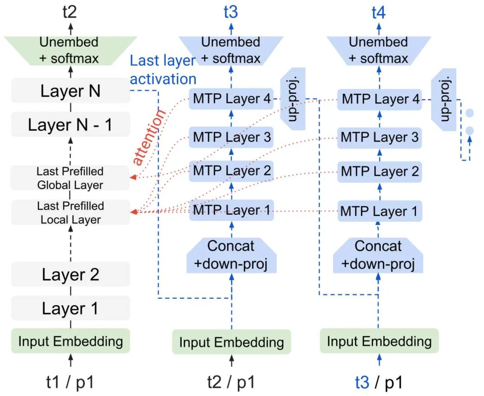
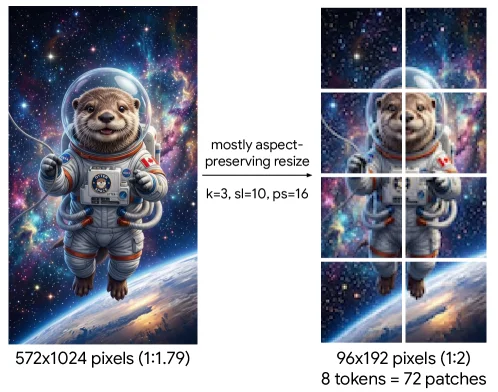

# Gemma 4 Technical Report

[arXiv](https://arxiv.org/abs/2607.02770) · [HuggingFace](https://huggingface.co/papers/2607.02770) · ▲60

## 摘要（原文）

> We introduce Gemma 4, a new generation of open-weight, natively multimodal language models in the Gemma model family. Designed to advance compute efficiency and reasoning, the Gemma 4 model suite features dense and Mixture-of-Experts architectures, ranging from 2.3B to 31B parameters. Alongside improved vision and audio encoders for all model sizes, we propose a unified, encoder-free architecture for our 12B model, which ingests raw audio and image patches. Furthermore, we integrate a thinking mode, enabling Gemma models to generate reasoning traces prior to responding. We improve inference speed, memory, and compute efficiency, as well as long-context abilities through critical design choices. Gemma 4 establishes a leap in performance across STEM, multimodal, and long-context benchmarks, and rivals larger, frontier open models in human-rated tasks.

## 摘要（中译）

我们推出了Gemma 4，这是Gemma模型家族中新一代的开放权重、原生多模态语言模型。为了提高计算效率和推理能力，Gemma 4模型套件采用了密集型和混合专家（Mixture-of-Experts）架构，参数范围从2.3B到31B。除了为所有模型大小改进视觉和音频编码器外，我们还为我们的12B模型提出了一种统一的、无编码器的架构，该架构可以直接处理原始音频和图像块。此外，我们集成了一个思考模式，使Gemma模型能够在响应之前生成推理轨迹。我们通过关键的设计选择提高了推理速度、内存和计算效率，以及长上下文能力。Gemma 4在STEM、多模态和长上下文基准测试中取得了性能上的飞跃，并在人工评分任务中与更大、前沿的开放模型相抗衡。

## 背景剖析

### 背景剖析  

**技术背景**：随着大语言模型（LLM）的快速发展，市场对开放权重、多模态理解能力强且计算效率高的模型需求日益增长。这类技术主要应用于需要处理文本、图像、音频等多模态数据的场景，例如智能助手、教育、医疗诊断、内容创作等。用户希望模型不仅能理解复杂信息，还能进行高效推理（如数学计算、编程）和处理长文本（如文档分析）。然而，传统模型往往在多模态融合、长上下文处理和计算效率上存在瓶颈。  

**之前的问题**：早期的多模态模型通常依赖独立的编码器（如视觉、音频编码器），导致内存碎片化和计算开销大。此外，长上下文任务（如文档理解）会引发KV缓存爆炸，降低推理速度。传统推理方法在复杂数学或编程任务中表现不足，而计算效率的限制使得模型难以部署在资源受限的设备上。同时，现有模型的多模态能力与文本能力之间存在差距，难以实现真正的“原生多模态”体验。  

**本文的解法**：Gemma 4 通过多项创新解决了这些问题：  
1. **统一编码器架构**：12B 模型直接处理原始音频和图像数据，避免了对独立编码器的依赖，减少内存碎片化。  
2. **长上下文优化**：采用滑动窗口注意力、RoPE 位置编码和 KV 缓存共享等技术，显著降低内存占用。  
3. **推理增强**：引入“思考模式”，让模型在回答前生成推理过程，提升复杂数学和编程任务的性能。  
4. **计算效率**：通过多token预测草稿头和量化感知训练，提高推理速度并降低内存需求。  

**切入角度**：与以往工作相比，Gemma 4 的关键差异在于：  
- **原生多模态支持**：所有模型尺寸均支持文本、图像和音频，而非仅依赖后期融合。  
- **高效长上下文处理**：通过创新性注意力机制优化，平衡了性能与内存开销。  
- **开放性与实用性**：提供量化版本和开源许可证，使研究者和开发者能更灵活地部署和定制模型。  

这些设计使 Gemma 4 在多模态基准测试和人类评估中达到前沿水平，同时保持了计算效率，适用于更广泛的硬件环境。

## 方法图解

> Figure 1: The autoregressive MTP drafter (blue blocks on the right) is fed activations and KV cache from the main model (gray blocks).

这张图展示了Gemma 4模型中一个关键的架构设计——自回归MTP起草器（MTP drafter）如何与主模型交互以提升效率或推理能力。我们可以将图分为左右两个主要部分来理解：

**左侧部分（灰色块 - 主模型）：**
这部分代表了模型的“主流程”或“基础模型”。数据从底部的“Input Embedding”（输入嵌入）开始，经过“Layer 1”（第一层）、“Layer 2”（第二层），然后到达“Last Prefilled Local Layer”（最后一个预填充的局部层）和“Last Prefilled Global Layer”（最后一个预填充的全局层）。这些“预填充层”可能处理了之前的一些上下文信息。之后，数据继续向上流经“Layer N-1”（第N-1层）和“Layer N”（第N层），最终通过“Unembed + softmax”（解嵌入+softmax）层输出结果，对应时间步t2。

**右侧部分（蓝色块 - 自回归MTP起草器）：**
这部分是一个并行的、可能是更高效的“起草器”或“推理引擎”。
1.  它同样从“Input Embedding”开始，但其输入时间步标记为“t2 / p1”、“t3 / p1”等，这可能意味着它在处理特定位置（p1）的输入时，参考了主模型在不同时间步（t2, t3）的信息。
2.  数据流经一系列“MTP Layer”（MTP层），从“MTP Layer 1”到“MTP Layer 4”。这些层是起草器的核心计算单元。
3.  在MTP层的序列前后，有“Concat + down-proj”（拼接+下投影）和“up-proj”（上投影）操作。这些操作可能用于调整特征维度或整合信息。
4.  起草器的最终输出也是通过“Unembed + softmax”层。

**信息流动与交互（关键部分）：**
这张图的核心在于展示主模型和MTP起草器之间的信息交互：
*   **从主模型到MTP起草器：** 图中的红色虚线箭头（标注为“attention”和“Last layer activation”）清晰地表明，MTP起草器接收来自主模型的信息。具体来说，“Last Prefilled Local Layer”和“Last Prefilled Global Layer”的输出被用作MTP层的输入（通过“Concat + down-proj”）。此外，主模型的“Last layer activation”（最后一层激活）也被馈送到MTP层的各个层级（如MTP Layer 1, 2, 3, 4）。这表明MTP起草器利用了主模型已经计算出的中间结果或上下文信息，而不是从头开始计算所有内容。
*   **从MTP起草器到主模型（或后续处理）：** 图中的蓝色虚线箭头（例如从“up-proj”指向主模型的某个点）可能表示MTP起草器的输出或中间结果被反馈回主模型，或者用于生成最终的输出。例如，MTP Layer 4的输出通过“up-proj”后，可能与主模型的流程相结合。

**方法运作机制：**
这张图揭示的方法是：Gemma 4模型使用一个自回归的MTP起草器来加速推理过程或增强推理能力。这个起草器不是独立工作，而是与主模型紧密协作。它通过接收主模型的“注意力”信息、最后一层的激活值以及预填充层的输出，来生成或细化其预测。这种设计允许起草器利用主模型已经完成的计算，从而提高效率（例如减少重复计算）或提升性能（例如利用更丰富的上下文信息进行推理）。图中的“thinking mode”（思考模式）概念可能与此相关，即起草器先生成推理轨迹，然后再给出最终答案。通过这种方式，模型可以在保持或提升性能的同时，优化计算效率和推理能力。

总结来说，这张图展示了一个混合架构，其中主模型提供上下文和中间结果，而自回归MTP起草器利用这些信息进行更高效或更智能的处理，两者通过特定的信息流（如激活值、KV缓存、注意力）进行交互。

---

> Figure 2: Image resizing. Here we use patch_size=16 , pooling_kernel_size=3 , max_soft_tokens=10 . The image is thus first resized to 2 × \times 4 pooled patches (each of size 48 ​ px 2 48\text{px}^{2} ), which is the closest match that results in a sequence length below the targeted 10. The 72 patches (each of size 16 ​ px 2 16\text{px}^{2} ) are then processed by the vision encoder, the vision encoder representations are pooled 3 × 3 3\times 3 , and the resulting 8 soft tokens are processed by the LLM backbone.

这张图展示了图像预处理（resize与分块）的流程，用于视觉编码器的输入准备，核心是**“保持长宽比的resize + 分块 + 池化”**以适配模型的token长度限制，以下是详细拆解：

### 组件与数据流向
- **左侧：原始图像**  
  尺寸为`572×1024像素`，长宽比为`1:1.79`（高度/宽度≈1.79）。这是待处理的输入图像，包含宇航服水獭、星空、地球等视觉内容。

- **中间：处理流程（箭头与参数）**  
  箭头表示“图像变换的方向”，标注的`mostly aspect-preserving resize`（尽量保持长宽比的resize）、`k=3`（池化核大小，对应caption的`pooling_kernel_size=3`）、`sl=10`（最大软token数，对应`max_soft_tokens=10`）、`ps=16`（patch大小，对应`patch_size=16`）是关键参数：  
  - 首先，图像通过**保持长宽比的resize**，调整尺寸以匹配“token长度≤10”的目标（后续分块后token数为8，接近10）。  
  - 然后，结合`k=3`的池化和`ps=16`的分块，将图像转换为视觉编码器可处理的patch序列。

- **右侧：处理后图像**  
  尺寸为`96×192像素`，长宽比为`1:2`（高度/宽度=2）。图像被划分为`8个patch`（3行×3列？不，实际是3行×3列？不对，图中右侧是3行×3列？不，看标注：“8 tokens = 72 patches”？哦，caption说明“72 patches（每个16px²）”，所以右侧图像的分块是：`96÷16=6`（宽度方向patch数），`192÷16=12`？不对，重新看：原始图像resize后，再分块。正确的计算是：`patch_size=16`，所以宽度方向`96÷16=6`，高度方向`192÷16=12`？但caption说“72 patches”，`6×12=72`，对。然后“8 soft tokens”是池化后的结果（`k=3`的池化，可能是对patch序列的池化，将72个patch的表示池化为8个token，供LLM处理）。

### 方法运作逻辑（从左到右的流程）
1. **原始图像输入**：尺寸`572×1024`，长宽比`1:1.79`，包含复杂视觉内容（如宇航服水獭、宇宙背景）。  
2. **保持长宽比的resize**：调整图像尺寸，目标是让后续分块+池化后的token数≤10（caption中是“closest match below 10”，最终得到8个token）。resize后的尺寸为`96×192`（长宽比`1:2`），这一步确保图像的主要内容（如水獭、宇宙场景）在缩放后仍保留关键视觉特征，同时适配模型的输入长度限制。  
3. **分块（patching）**：使用`patch_size=16`（即每个patch是16×16像素的正方形），将resize后的图像划分为`72个patch`（计算：`96÷16=6`（宽度方向patch数），`192÷16=12`（高度方向patch数），`6×12=72`）。每个patch包含局部视觉信息，作为视觉编码器的输入单元。  
4. **池化（pooling）**：使用`kernel_size=3`（即3×3的池化窗口）对72个patch的视觉表示进行池化，得到`8个soft token`。池化的作用是减少序列长度（从72到8），同时保留关键特征，使输出能被LLM的backbone处理（LLM通常处理较短的token序列）。  

### 结论（方法的核心设计）
这张图展示了Gemma 4模型中**视觉输入的预处理流程**：通过“保持长宽比的resize”适配token长度限制，通过“分块+池化”将高分辨率图像转换为低维、短序列的视觉token，既保留了图像的关键视觉信息，又满足了LLM对输入长度的要求。这种设计平衡了视觉信息的完整性和模型的计算效率，使得视觉编码器能高效处理图像，同时LLM能处理较短的token序列进行推理。

（注：图中“8 tokens = 72 patches”的标注说明：72个patch的视觉表示被池化为8个token，这8个token随后被送入LLM backbone进行进一步处理。）
