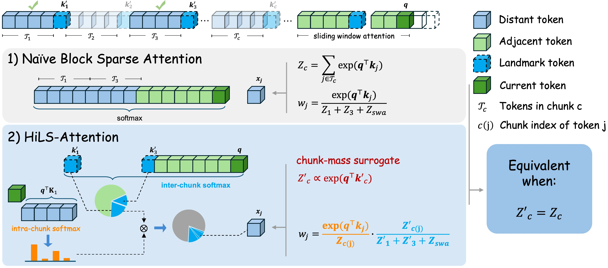
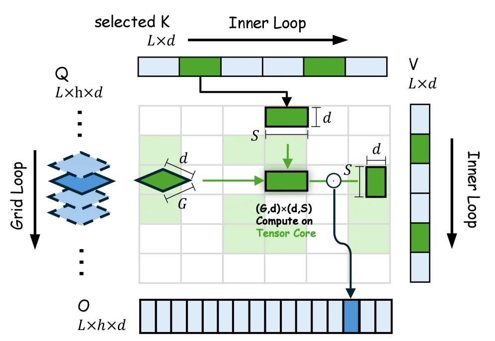
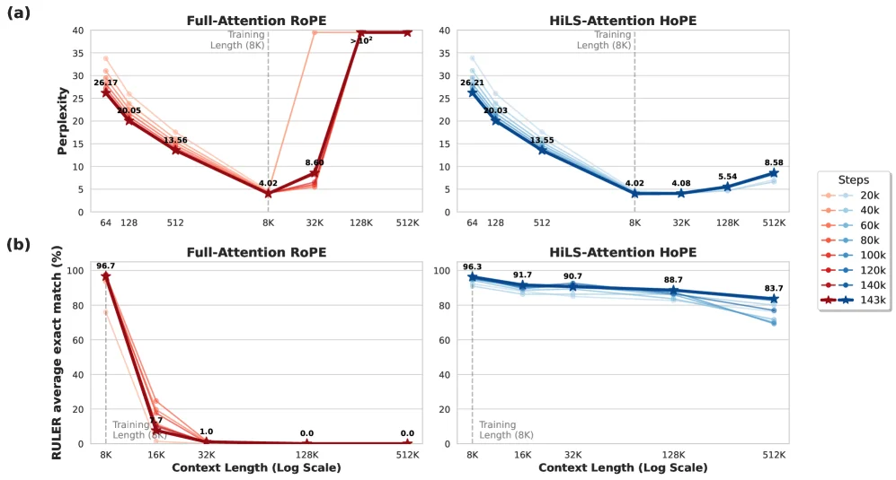
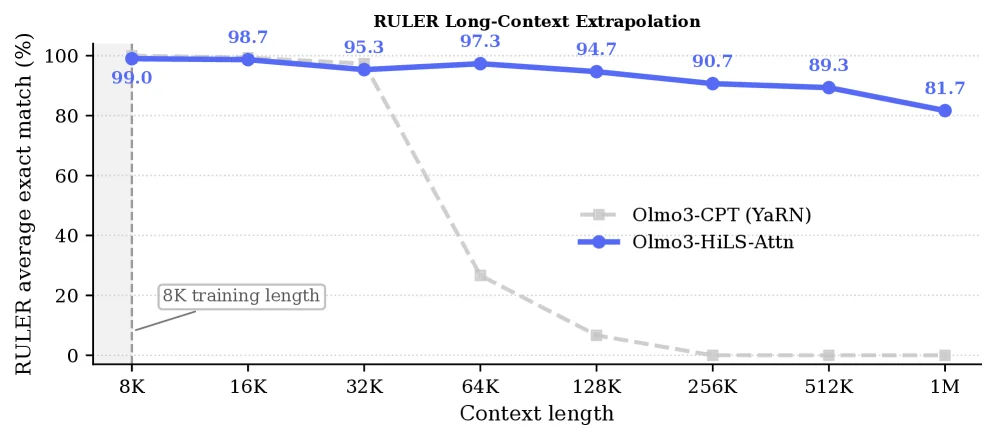
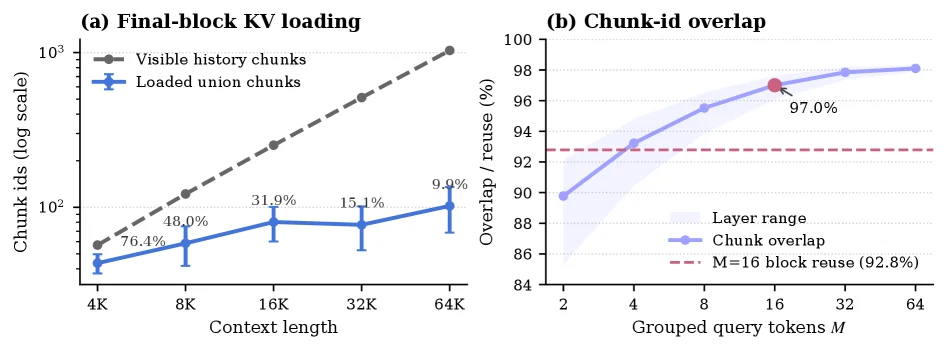

# Hierarchical Sparse Attention Done Right: Toward Infinite Context Modeling

[arXiv](https://arxiv.org/abs/2607.02980) · [HuggingFace](https://huggingface.co/papers/2607.02980) · ▲68

## Abstract (verbatim)

> Scaling modern large language models (LLMs) to long contexts is limited by the quadratic computation cost, and poor length extrapolation of dense attention. Chunk-wise sparse attention offers a promising alternative, but all existing methods fall short of full attention because of their inaccurate chunk selection. We propose Hierarchical Landmark Sparse (HiLS) Attention, a chunk-wise sparse attention mechanism that learns chunk selection end-to-end under the language-modeling (LM) loss. HiLS factorizes attention hierarchically: each query performs attention independently with each retrieved chunk to extract chunk-specific information, and the resulting outputs are fused according to chunk retrieval scores. By incorporating retrieval scores into the forward attention computation, HiLS optimizes them directly with the LM loss, enabling end-to-end retrieval learning and native sparse training. Experimental results show that HiLS-Attention achieves performance comparable to, and in some cases better than, full attention at in-domain context lengths. Meanwhile, HiLS-Attention extrapolates more than 64times the training context length with 90% retrieval accuracy, far beyond full attention. Moreover, existing full-attention models can be converted to HiLS-Attention with lightweight continued pretraining, preserving in-domain performance while acquiring ultra-long-context extrapolation. Together with its sparse KV access and computation, HiLS-Attention breaks the usual efficiency-performance trade-off, enabling long-context LLMs that are both more efficient and more effective on general long-context tasks than their full-attention counterparts.

## Background

### Background Analysis  

**1. Technical Context**  
Modern large language models (LLMs) need to handle increasingly long text contexts, such as long-document understanding, multi-turn dialogue, or complex reasoning. However, traditional "full attention" mechanisms suffer from quadratic computational costs, making long-text processing inefficient and struggling with accurate length extrapolation (predicting beyond training lengths). "Chunk-wise sparse attention" has been proposed to reduce costs by selectively attending to relevant text chunks, but existing methods still cannot match full attention in performance.  

**2. Previous Limitations**  
The core issue with existing methods is inaccurate chunk selection. For example, simple non-parametric approaches like mean pooling fail to adequately represent chunk importance, while parametric methods, though more flexible, do not optimize their selected chunks directly with the language modeling (LM) loss. This leads to poor discrimination between relevant and irrelevant content. Additionally, these methods often require extra computational steps (e.g., hard thresholding), making them less efficient than full attention.  

**3. Proposed Solution**  
This paper introduces "Hierarchical Landmark Sparse (HiLS) Attention," which addresses these problems in two steps: first, it adds a "landmark token" to each chunk to generate more expressive chunk summaries; second, it directly links the chunk selection process to the LM’s training objective (e.g., predicting the next token), allowing the model to learn which chunks are important automatically. This approach avoids the high computational costs of full attention while improving selection accuracy through end-to-end optimization.  

**4. Key Difference**  
Unlike previous methods, HiLS-Attention’s innovation lies in treating chunk selection as learnable attention weights and using full attention’s mathematical properties (e.g., Taylor expansion approximations) to guide chunk summary design. Experiments show that this method not only performs well on standard lengths but also extends context lengths over 64 times beyond training data, far surpassing existing approaches.

## Method, Figure by Figure

> Figure 3 : An overview of HiLS-Attention. We omit the scaling factor 1 d \frac{1}{\sqrt{d}} for simplicity. Naive block sparse attention selects the top- K K chunks by their exact mass Z c Z_{c} , e.g., chunks 1 and 3 when K = 2 K=2 , but computing all Z c Z_{c} requires a full QK computation. HiLS-Attention instead uses compressed chunk keys k c ′ k^{\prime}_{c} to efficiently estimate a chunk-mass surrogate Z c ′ ∝ exp ⁡ ( q ⊤ ​ k c ′ ) Z^{\prime}_{c}\propto\exp(q^{\top}k^{\prime}_{c}) . It factorizes attention into two stages: an inter-chunk softmax , which specifies the total attention mass assigned to each chunk, and an intra-chunk softmax , which distributes each chunk’s attention mass among its tokens. Since Z c ′ Z^{\prime}_{c} parameterizes the forward attention weights, gradients from the next-token prediction loss can be directly backpropagated to the compressed key k c ′ k^{\prime}_{c} , enabling end-to-end learning.

This figure (Figure 3) provides an overview of **HiLS-Attention** (Hierarchical Landmark Sparse Attention), comparing it with "Naïve Block Sparse Attention" to illustrate its core mechanism and workflow. We analyze the various components from top to bottom, left to right:

First, the top of the image shows an abstract representation of a sequence divided into multiple "chunks" (e.g., T₁, T₂, T₃, ..., T_c). Each chunk contains several "tokens." The legend explains the meaning of different colored and styled blocks:
*   **Light blue block**: Distant token
*   **Light green block**: Adjacent token
*   **Dark blue dashed block**: Landmark token
*   **Dark green block**: Current token
*   **T_c**: Represents the tokens in chunk c.
*   **c(j)**: Represents the chunk index of token j.

1.  **Naïve Block Sparse Attention**:
    *   This section demonstrates how traditional methods select chunks. It chooses the top-K chunks based on their exact "mass" (Z_c), e.g., chunks 1 and 3 when K=2 (marked with a check). This "mass" Z_c is computed by summing exp(q^⊤ k'_j) for all landmark tokens k'_j in chunk c. Attention weights w_j are then normalized based on these Z_c values.
    *   Data flow: The query `q` interacts with landmark tokens `k'_j` from each chunk to compute the total mass `Z_c` for each chunk. For a current token `x_j` (shown as a light blue block), its attention weight `w_j` is normalized based on its chunk's mass `Z_c(j)` and the total mass of all selected chunks (e.g., Z₁ + Z₃ + Z_swa).
    *   The drawback of this method is that computing all `Z_c` requires a full QK (query-key) computation, which can be computationally expensive.

2.  **HiLS-Attention**:
    *   This section illustrates the core idea of HiLS-Attention, which decomposes attention into two softmax stages:
        *   **Inter-chunk softmax**: This step determines the total attention "mass" assigned to each chunk. It uses compressed chunk keys `k'_c` to efficiently estimate a chunk-mass surrogate `Z'_c`, where `Z'_c ∝ exp(q^⊤ k'_c)`. This means `Z_c` doesn't need to be computed fully; instead, a more efficient estimate `Z'_c` is used. The image shows the query `q` interacting with landmark tokens `k'_c` from each chunk (e.g., `K₁` from chunk 1 and `k'_3` from chunk 3) and calculating the relative importance of each chunk (as shown by the pie charts).
        *   **Intra-chunk softmax**: For each selected chunk, this step distributes the assigned attention mass among its internal tokens. The image shows the query `q` interacting with all tokens in a chunk (via `q^⊤ K₁` for chunk 1) and then using a softmax (represented by the orange bar chart) to compute attention weights for tokens within the chunk.
    *   Data flow: First, the query `q` interacts with landmark tokens `k'_c` from each chunk to estimate the attention mass proxy `Z'_c` for each chunk. Then, based on these `Z'_c` values, an inter-chunk softmax is performed to determine the attention share for each chunk. Next, for each chunk, the query `q` interacts with all tokens within the chunk, and an intra-chunk softmax distributes attention within the chunk. The final attention weight `w_j` is the product of the inter-chunk attention share (`Z'_{c(j)} / (Z'₁ + Z'₃ + Z_swa)`) and the intra-chunk attention weight (`exp(q^⊤ k_j) / Z_{c(j)}`).
    *   Key innovation: `Z'_c` parameterizes the forward attention weights, so gradients from the next-token prediction loss can be directly backpropagated to the compressed key `k'_c`, enabling end-to-end learning.

3.  **Equivalent when:**:
    *   The right side of the image states that HiLS-Attention is equivalent to Naïve Block Sparse Attention when `Z'_c = Z_c`. This means HiLS-Attention can theoretically revert to traditional methods, but its advantage lies in `Z'_c` being an efficient estimate that avoids the high cost of full QK computation.

In summary, this figure shows how HiLS-Attention achieves sparse attention through a hierarchical approach (allocating attention between chunks first, then within chunks). It uses compressed chunk keys to efficiently estimate chunk quality, avoiding the high cost of traditional methods that compute full QK, and enables end-to-end optimization. This method allows HiLS-Attention to handle longer contexts while maintaining performance.

This figure reveals how HiLS-Attention specifically works:
*   It first divides the input sequence into multiple chunks.
*   For each chunk, it uses one or more landmark tokens to generate a compressed key `k'_c`.
*   The query `q` interacts with these compressed keys `k'_c` to estimate the attention mass proxy `Z'_c` for each chunk.
*   Through inter-chunk softmax, it determines the attention share for each chunk based on these `Z'_c` values.
*   For each chunk, the query `q` interacts with all tokens within the chunk, and intra-chunk softmax distributes attention within the chunk.
*   The final attention weights are the product of inter-chunk and intra-chunk attentions.
*   Since `Z'_c` is directly involved in the attention weight calculation, these compressed keys `k'_c` can be learned end-to-end.

---

> (a) NSA kernel (b) HiLS-Attention kernel Figure 4 : Kernel design of NSA and HiLS-Attention. Kernel design of NSA and HiLS-Attention. (a) NSA handles one query token per tile and computes attention over its selected chunks. Each Tensor Core operation has shape ( G , d ) × ( d , S ) (G,d)\times(d,S) , where G G is the GQA group size and S S is the chunk size. (b) HiLS-Attention packs M M adjacent query tokens, attends to the union of their selected chunks, and enlarges the Tensor Core operation to ( M × G , d ) × ( d , S ) (M\times G,d)\times(d,S) . This packing reuses overlapping K/V chunks across adjacent tokens.

This diagram illustrates the core design of HiLS-Attention, which we break down by data flow and component functionality:

### Components and Data Flow
1. **Input Section**:
    - On the left, \( Q \) (with shape \( L \times h \times d \)) is the Query tensor. Here, different query groups are processed via "Grid Loop" (the blue multi-layer structure in the diagram may represent different query blocks or groups). \( L \) is the sequence length, \( h \) is the number of attention heads, and \( d \) is the feature dimension.
    - At the top, "selected K" (the selected Key tensor with shape \( L \times d \)) is the Key tensor after selection. The "Inner Loop" handles the selection logic of these keys, and the green blocks represent the selected key parts.
    - On the right, \( V \) (with shape \( L \times d \)) is the Value tensor. The "Inner Loop" also handles the selection of values, and the green blocks represent the selected value parts.
2. **Computational Core (Tensor Core Operation)**:
    - The green diamond in the diagram (with shape \( G \times d \), where \( G \) is the GQA group size) represents the grouped processing of queries and will be sent to the Tensor Core for computation. The operation shape of the Tensor Core is \( (G, d) \times (d, S) \), where \( S \) is the chunk size. The matrix multiplication (represented by \( \odot \) or the matrix multiplication symbol) here is the core of the attention calculation: the query group (\( G \times d \)) is multiplied by the selected part of the key (\( d \times S \)), and then a weighted sum (weighted by attention mechanism scores) is performed with the selected part of the value (\( d \times S \)).
    - Arrows show the data flow: the query group enters the Tensor Core after being processed from \( Q \), the selected parts of the key and value enter the Tensor Core after being selected from their respective tensors, and the calculation result (blue block) is finally output to \( O \) (the output tensor with shape \( L \times h \times d \)).
3. **Output Section**:
    - At the bottom, \( O \) is the output tensor that receives the calculation result from the Tensor Core, completing the output of the attention mechanism, and then continues to process the next query group (via "Grid Loop").

### How the Method Works
The core of HiLS-Attention is **block-sparse attention**, which combines query grouping and block selection:
- First, the queries (\( Q \)) are grouped (groups of size \( G \) in the diagram), and each query group is processed independently.
- Then, specific blocks are selected from the keys (\( K \)) and values (\( V \)) (the green blocks in "selected K" and "selected V"). These blocks are selected according to a learned strategy (the paper mentions end-to-end learning of block selection).
- Next, matrix multiplication operations are performed on the Tensor Core: the query group (\( G \times d \)) is multiplied by the selected block of the key (\( d \times S \)) to obtain an intermediate result related to the attention score, and then multiplied by the selected block of the value (\( d \times S \)) to obtain the output of each query group.
- Finally, these outputs are fused (according to the retrieval score; the paper mentions incorporating the retrieval score into the forward attention calculation) to obtain the final output tensor \( O \).

The advantages of this method are:
- It reduces computational complexity by leveraging block sparsity (avoiding the quadratic complexity of full attention).
- End-to-end learning of block selection allows the retrieval score (the result of block selection) to be directly optimized through the language model loss (LM loss), thus achieving more accurate block selection and better long-context modeling capabilities.

### Results (Combined with the Paper)
Although this diagram mainly shows the core design (method principle), the experimental results in the paper show:
- HiLS-Attention performs comparably to full attention on in-domain context lengths and even better in some cases.
- It can extrapolate to situations 64 times longer than the training context length, with a retrieval accuracy of 90%, far exceeding that of full attention.
- Existing full-attention models can be converted to HiLS-Attention through lightweight continued pretraining, retaining in-domain performance while gaining ultra-long context extrapolation capabilities.

In summary, this diagram clearly shows how HiLS-Attention achieves efficient sparse attention through blocking, query grouping, and Tensor Core optimization, solving the efficiency and length extrapolation problems of long-context modeling.

---

> Figure 5 : Perplexity (a) and RULER accuracy (b) of the 1.4B model at different training steps. Left: Full-Attention with RoPE; right: HiLS-Attention with HoPE. The annotated values on the curves correspond to the final checkpoint (143k steps), which is highlighted with star markers and thicker lines. The detailed per-step results are deferred to Appendix H (Tab. 15 & Tab. 16 ).

This figure (Figure 5) is from the paper "Hierarchical Sparse Attention Done Right: Toward Infinite Context Modeling" and uses two subfigures (a and b) to compare the performance of two attention mechanisms—Full-Attention with RoPE and HiLS-Attention with HoPE—on a 1.4B-parameter model. The metrics compared are perplexity and RULER average exact match percentage, evaluated at different training steps.

### Subfigure (a): Perplexity vs. Context Length  
The left subfigure (a) plots **perplexity** against **context length** (on a logarithmic scale, measured in thousands, e.g., 64, 8K, 512K). Different curves represent various **training steps** (e.g., 20k, 40k, ..., 143k steps), with the final checkpoint (143k steps) marked by a thicker line with star symbols.  

- **Left panel (Full-Attention RoPE)**: This traditional full attention mechanism uses RoPE (Rotary Position Embedding). Perplexity decreases as context length increases up to the training length (8K) but rises sharply beyond that (e.g., at 32K or 128K, perplexity is significantly higher than for HiLS-Attention).  
- **Right panel (HiLS-Attention HoPE)**: This hierarchical sparse attention shows much smaller perplexity increases beyond the training length. For example, at 512K context length, HiLS-Attention maintains lower perplexity than Full-Attention RoPE.  

### Subfigure (b): RULER Accuracy vs. Context Length  
The right subfigure (b) plots **RULER average exact match percentage** (a measure of precise matching) against **context length** (from 8K to 512K, logarithmic scale).  

- **Left panel (Full-Attention RoPE)**: Accuracy drops drastically beyond the training length (8K), approaching 0% at 32K or 512K.  
- **Right panel (HiLS-Attention HoPE)**: Accuracy declines gradually but remains high (e.g., ~83.7% at 512K), demonstrating better long-context generalization.  

### Key Takeaways  
- **Perplexity**: HiLS-Attention maintains low perplexity even at long context lengths, whereas Full-Attention RoPE suffers from increasing perplexity beyond the training length.  
- **RULER Accuracy**: HiLS-Attention retains high accuracy (>80%) at 512K context length, while Full-Attention RoPE fails to generalize beyond 8K.  

The figure validates that HiLS-Attention (a hierarchical sparse attention mechanism) outperforms traditional full attention in long-context modeling by reducing perplexity and preserving accuracy. Detailed step-by-step results are provided in Appendix H (Tables 15–16).

---

> (a) (b) (c) (d) Figure 1 : After only 50B continued-training tokens, HiLS-Attention inherits the capability of full attention while bringing two key advantages: strong ultra-long context extrapolation beyond the YaRN-extended 4 × \times length (Fig. 1(a) ) and faster inference (Fig. 1(b) ) . Meanwhile, it preserves comparable performance for short- and medium-context tasks, within both the original training length and the YaRN-extrapolated range (Fig. 1(c) & 1(d) ).

This figure (Figure 1(a)) displays the RULER average exact match percentage for two models across different context lengths, comparing their performance in long-context extrapolation tasks.

Let's break down the components of the graph:

1.  **X-axis (Horizontal Axis)**: Represents "Context length" in tokens. It ranges from 8K (8 thousand tokens) on the left to 1M (1 million tokens) on the right, indicating the length of the input sequence the model needs to process.
2.  **Y-axis (Vertical Axis)**: Represents "RULER average exact match (%)." This metric measures the proportion of samples where the model's output perfectly matches the reference answer, with higher values indicating better performance. It ranges from 0% at the bottom to 100% at the top.
3.  **Two Curves**:
    *   **Blue Solid Line (with circular markers)**: Represents the "Olmo3-HiLS-Attn" model, which is the model applying the paper's proposed Hierarchical Landmark Sparse (HiLS) Attention method.
    *   **Gray Dashed Line (with square markers)**: Represents the "Olmo3-CPT (YaRN)" model, likely a baseline model, perhaps using the YaRN method for long-context extension.
4.  **Data Points and Values**: Specific numerical values are labeled on each curve, indicating the exact match rate at particular context lengths. For example, at the 8K training length, Olmo3-HiLS-Attn has a match rate of 99.0%, and Olmo3-CPT (YaRN) is also around 99.0% (or very close, as the gray dashed line starts here).
5.  **Shaded Area and Label**: A gray vertical shaded area is present at the 8K position on the X-axis, labeled "8K training length." This indicates that the model was likely trained primarily on sequences of this length.
6.  **Legend**: Located on the right side of the graph, it explains what each curve represents.

Now, let's analyze the information and the method's performance revealed by this figure:

*   **Performance within Training Length**: Within the context lengths of 8K to 32K (the training length or near it), both models perform very well, with exact match rates above 95%. HiLS-Attn is even close to 100%. This shows that the HiLS-Attn model can inherit the performance of a full-attention model within the trained context lengths.
*   **Long-Context Extrapolation Capability**: When the context length exceeds 32K, especially far beyond the training length (e.g., 64K, 128K, 256K, 512K up to 1M), the performance of the two models diverges significantly.
    *   **Olmo3-HiLS-Attn (Blue Curve)**: Although the exact match rate gradually decreases as the context length increases (from 95.3% at 32K to 81.7% at 1M), the decline is relatively gradual. Even at an extremely long context length of 1M, its exact match rate remains at 81.7%, indicating strong long-context extrapolation capability.
    *   **Olmo3-CPT (YaRN) (Gray Dashed Line)**: Its performance drops sharply after 32K. At 64K, the match rate is already around 25%, and it approaches 0% for even longer context lengths. This indicates that the baseline model performs poorly in long-context extrapolation.
*   **How the Method Works (Inferred from Results)**:
    *   HiLS-Attention addresses the quadratic computational cost of traditional dense attention and its poor extrapolation ability in long contexts through hierarchical sparse attention.
    *   The results in the graph demonstrate that HiLS-Attn can maintain performance comparable to full-attention models for short/medium-length tasks while achieving far superior long-context extrapolation beyond the training length. Specifically, it can extrapolate to over 64 times the training length (8K x 64 = 512K, and the figure even reaches 1M) and still maintain an 81.7% match rate at 1M, which is far better than the baseline model.
    *   This validates the design principles of HiLS-Attn: by learning chunk selection end-to-end (using retrieval scores) and performing attention hierarchically (queries independently attend to each retrieved chunk, and outputs are fused based on retrieval scores), it optimizes the performance of sparse attention.

**Conclusion**:
This figure clearly demonstrates the advantages of HiLS-Attention in long-context modeling. It shows that with a small amount of continued training (e.g., 50B tokens as mentioned in the caption), HiLS-Attention not only inherits the performance of full-attention models but also achieves significantly better results in ultra-long context extrapolation compared to the baseline model. Specifically, within the range of 8K to 32K (training length to near training length), both models perform comparably; however, for longer contexts (e.g., 64K and above), HiLS-Attn's exact match rate is much higher than that of the YaRN baseline, proving its strong long-context extrapolation capability. For instance, at a context length of 1M, HiLS-Attn achieves an 81.7% match rate, while the baseline model struggles to perform. This indicates that HiLS-Attention effectively solves the challenges of long-context modeling, achieving efficient ultra-long context understanding.

---

> Figure 7 : Chunk-id overlap among adjacent query tokens. Left: loaded union size for the final M = 16 M=16 queries versus the visible historical chunks; percentages denote loaded fractions. Right: normalized overlap as group size M M increases, with the dashed line showing inter-block reuse at M = 16 M=16 . Error bars show standard deviation across HiLS layers and heads, and shaded regions show the layer-wise min–max range.

This figure contains two subplots that illustrate the chunk-id overlap in HiLS-Attention from different perspectives, helping us understand its working principle and performance.

First, let's look at the left subplot (a), titled "Final-block KV loading". The x-axis of this subplot is "Context length" (ranging from 4K to 64K), representing the length of the input sequence. The y-axis is "Chunk ids (log scale)", indicating the number of loaded chunks. There are two curves in the plot:
- The gray dashed line represents "Visible history chunks", which grows linearly with the increase in context length. This indicates that as the input sequence gets longer, the number of historical chunks the model can "see" also increases.
- The blue solid line represents "Loaded union chunks", which grows much slower than the gray dashed line. The plot also labels the "loaded fractions" (the proportion of loaded chunks to visible historical chunks) at different context lengths. For example, it's 48.0% at 8K, 31.9% at 16K, 15.1% at 32K, and 9.9% at 64K. This shows that as the context length increases, the proportion of actually loaded chunks to visible historical chunks decreases. In other words, the model doesn't load all visible historical chunks but selects a part of them, which reflects the characteristic of sparse attention, i.e., focusing only on some relevant chunks.

Next, let's look at the right subplot (b), titled "Chunk-id overlap". The x-axis of this subplot is "Grouped query tokens M" (ranging from 2 to 64), representing the group size of the query tokens. The y-axis is "Overlap / reuse (%)", indicating the proportion of chunk-id overlap. There are two curves in the plot:
- The blue solid line represents "Chunk overlap", which increases as M increases, rising from about 90% when M=2 to nearly 98% when M=64. The plot also labels the overlap proportion as 97.0% when M=16.
- The red dashed line represents "M=16 block reuse (92.8%)", which is the block reuse proportion when M=16, serving as a comparison. Additionally, the plot has error bars and shaded areas. The error bars represent the standard deviation between HiLS layers and heads, and the shaded areas represent the minimum-maximum range at the layer level. This indicates that there is some variation in the overlap proportion between different layers and heads, but the overall trend is to increase as M increases.

From these two subplots, we can see how HiLS-Attention works:
- In plot (a), as the context length increases, the number of chunks loaded by the model is much smaller than the number of visible historical chunks. This shows that HiLS-Attention performs sparse attention calculations by selecting some relevant chunks, thus reducing the computational cost.
- In plot (b), as the number of grouped query tokens M increases, the proportion of chunk-id overlap also increases. This indicates that when query tokens are divided into larger groups, the chunks they focus on have more overlaps, which helps improve the efficiency and effectiveness of attention.

In summary, this figure demonstrates the performance of HiLS-Attention in terms of chunk selection and overlap, showing that it can reduce the computational cost by sparsely selecting chunks while maintaining a high proportion of chunk overlap, thus achieving efficient long-term context modeling.
