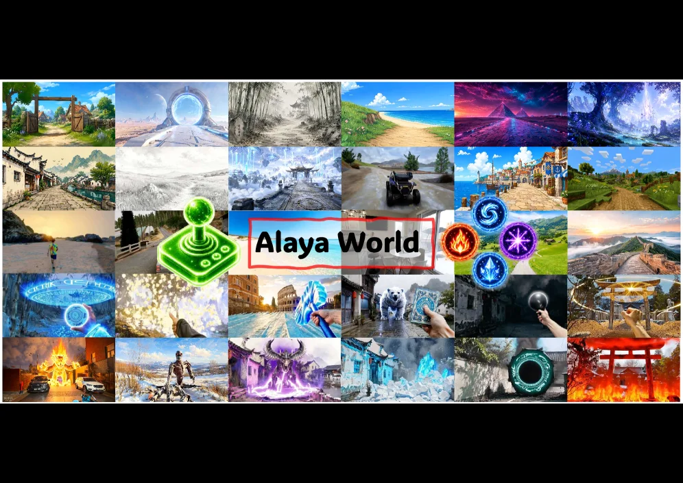

# AlayaWorld: Long-Horizon and Playable Video World Generation

[arXiv](https://arxiv.org/abs/2607.06291) · [HuggingFace](https://huggingface.co/papers/2607.06291) · ▲85

## Abstract (verbatim)

> Game worlds have traditionally been built through labor-intensive production pipelines, making them costly to develop, difficult to customization, and expensive to modify after deployment. Recent advances in video world models offer a fundamentally different paradigm. Rather than explicitly authoring every component of a virtual environment, these models autoregressively synthesize future observations conditioned on the current world state and user interactions, enabling playable worlds to be generated online. Trained on both gameplay recordings and real-world videos, they can capture diverse visual appearances and physical dynamics, opening new opportunities for interactive applications beyond gaming, including embodied intelligence. In this paper, we present AlayaWorld, a full-stack open-source framework for building interactive generative worlds. AlayaWorld enables open-ended real-time interaction, allowing users to freely navigate and perform diverse actions such as combat, spell casting, and monster summoning. The framework unifies the complete development-from data preparation model architecture, model training, inference acceleration, and deployment-within a modular and extensible architecture. Alongside the framework, we release reproducible pipelines, reference implementations, evaluation tools, and comprehensive documentation, establishing a practical foundation for future research and real-time applications of generative world models.

## Background

### Background Analysis  

**1. Technical Context and Real-World Needs**  
Virtual worlds (e.g., game environments or simulations) rely on **interactivity**—users act upon the environment, which responds coherently. This technology is critical not only for entertainment (e.g., 3D games) but also for fields like robotics and embodied AI, where environments must be both realistic and dynamically responsive. Traditional methods require manual, labor-intensive design of scenes, rules, and physics, making them expensive to develop and modify. For example, creating an open-world game can take years and hundreds of people, and post-launch changes often demand rebuilding the system. Video generation models offer an alternative: by learning patterns from real or game videos, they can synthesize dynamic worlds "on-demand," reducing manual effort.  

**2. Limitations of Previous Methods**  
While video generation models (e.g., Genie, Matrix) excel at synthesizing visuals, applying them to interactive worlds faces four key challenges:  
- **Limited controllability**: Can users act freely (e.g., explore infinitely or break physical rules)?  
- **Inconsistency**: Do environmental changes (e.g., collisions, lighting) follow natural logic?  
- **Long-horizon instability**: Does the world "drift" over time (e.g., objects deform or scenes break)?  
- **Real-time performance**: Can it render low-latency frames for smooth interaction?  
Existing methods either restrict freedom (e.g., predefine rules) or fail under long-term use, failing to balance interactivity and realism.  

**3. Proposed Solution**  
AlayaWorld addresses these challenges with a **modular architecture**:  
- **Autoregressive generation**: Predicts next frames based on user input (e.g., movement, attacks), eliminating manual rule-writing.  
- **Collaborative modules**: For example, an AdaLN-style camera-control module ensures smooth视角切换; a history-compression module reduces redundancy; an Error Bank fixes long-term drift.  
- **Full-stack optimization**: End-to-end design from data preparation to deployment supports real-time interaction.  
The core idea is to let the model autonomously learn physical and visual patterns without predefined constraints.  

**4. Key Differences from Prior Work**  
AlayaWorld stands out by:  
- **Open-endedness**: Users can perform unrestricted actions (e.g., free combat or monster summoning).  
- **Long-term stability**: History compression and error correction prevent visual drift during extended use.  
- **Full-stack openness**: Provides end-to-end tools (training to deployment), not just model weights.  
This shifts world creation from "manual engineering" to "data-driven generation," enabling flexible foundations for emerging fields like embodied AI.

## Method, Figure by Figure

> Figure 1 : Interactive world simulation across diverse scenes. AlayaWorld synthesizes explorable worlds that span first- and third-person viewpoints, real-world, game, and synthetic domains, and both indoor and outdoor environments. Moreover, it accommodates open-ended actions such as spell-casting, weapon combat, and monster summoning.

This image (Figure 1) is the core result display from the paper *"AlayaWorld: Long-Horizon and Playable Video World Generation"*, visually demonstrating the diversity and capabilities of the interactive world simulations generated by the AlayaWorld framework.  

### Structural Analysis  
The image is a grid of smaller scenes, each representing a distinct environment or interaction moment. These collectively showcase the types of interactive worlds AlayaWorld can generate. A prominent red border in the center displays the text *"Alaya World"*, clearly identifying the theme. To the left of this text, a green game controller icon symbolizes user interaction through inputs like button presses or joystick movements.  

### Breakdown of Scenes  

#### 1. **Diversity of Environments**  
- **Top Row**: From left to right, the scenes include a rural path with a wooden door, a sci-fi setting with glowing portals, a forest trail, a beach, a fantasy landscape with pyramids and stars, and a giant glowing tree overlooking a city. These demonstrate AlayaWorld’s ability to create worlds with varied styles (realistic, fantasy, sci-fi) and environments (outdoor, natural, urban).  
- **Second Row**: Features a Chinese-style street, snowy landscapes (one with a pavilion), a vehicle on a dirt road, a coastal town, and a blocky *"Minecraft"-like world*. This highlights cultural diversity (Chinese architecture), weather conditions (snow), transportation, and stylistic variety (block-based graphics).  
- **Third Row**: Shows a runner at sunset, a magical circle with blue aura, a blurred light effect (possibly fast movement or energy), a scene with blue flames, a character holding a card (likely a summoning card), and a Japanese torii gate. These suggest dynamic elements, magic systems, and non-player characters (e.g., pandas).  
- **Bottom Row**: Includes combat scenarios (robot battles, a minotaur casting spells), an ice-covered village, a scene with green portals, and a fiery explosion (possibly from attacks or destruction). These directly align with the paper’s mention of *"open-ended actions such as spell-casting, weapon combat, and monster summoning"*.  

#### 2. **Interactivity Demonstrated**  
Many scenes show characters in action—running, holding cards, driving vehicles, or confronting monsters. This indicates users can perform movements, exploration, combat, and skill usage. Visual elements like magical circles, flames, and light effects represent special abilities or interactions (e.g., spellcasting or environmental triggers).  

#### 3. **Insights into Methodology**  
While the image does not show the method’s workflow, its results imply:  
- **Data-Driven**: Likely trained on extensive gameplay and real-world videos to capture diverse visuals and physics.  
- **Real-Time Interaction**: User inputs (e.g., controller actions) influence the world, as seen in dynamic actions and events.  
- **Open-World Exploration**: Worlds are explorable with multiple environments and interaction possibilities, supporting open-ended gameplay.  
- **Generative Capability**: Worlds are synthesized in real time rather than pre-designed, enabling high diversity and scalability.  

#### 4. **Conclusion**  
Figure 1 serves as a visual summary, proving AlayaWorld’s ability to generate immersive, interactive, and diverse virtual worlds. It supports actions like exploration, combat, spellcasting, and summoning across perspectives (first/third-person), domains (realistic/game/synthetic), and environments (indoor/outdoor). Each small scene exemplifies the framework’s breadth and depth in creating playable video worlds.  

In short, Figure 1 is a compelling visual summary of AlayaWorld’s capabilities, showcasing its strength in generating interactive, diverse, and engaging virtual worlds through a collection of vivid examples.
