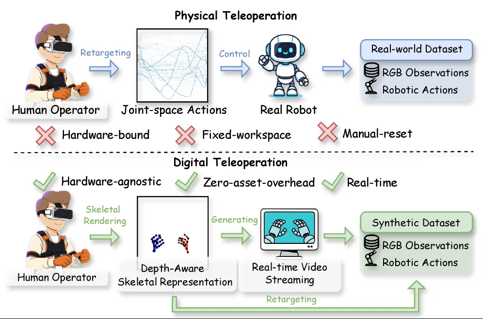
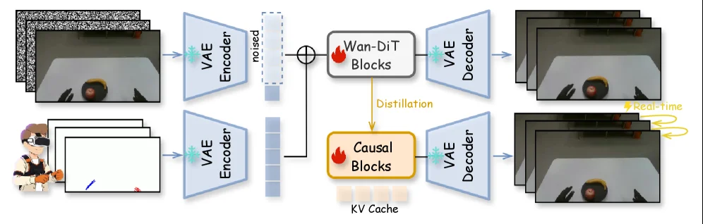
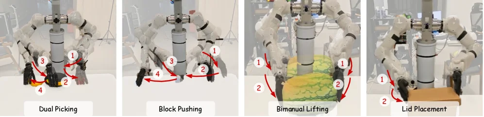
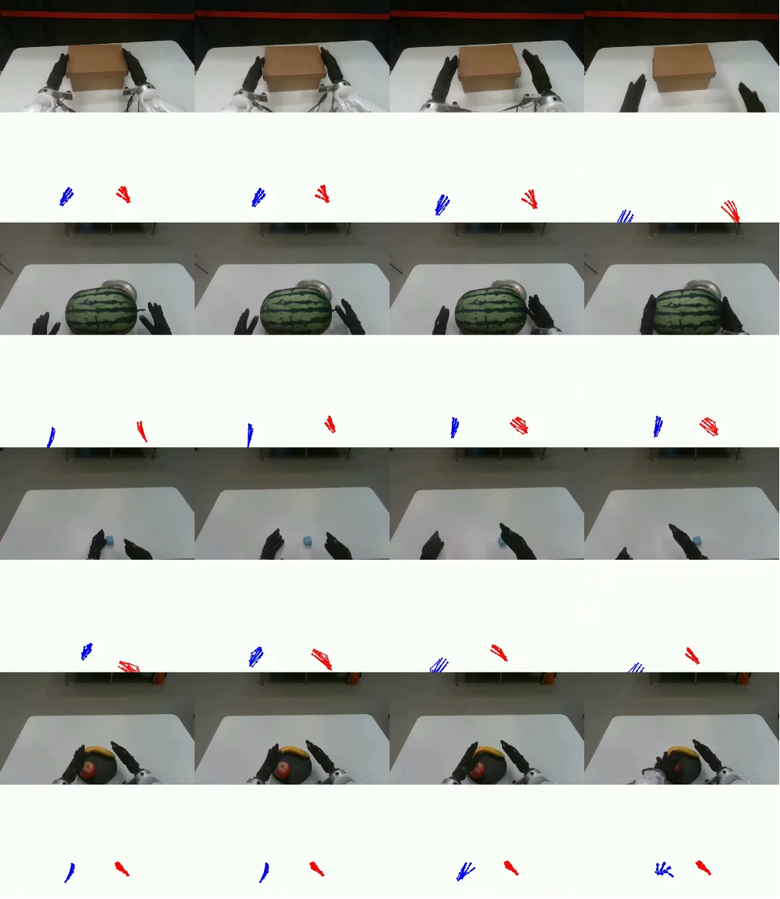
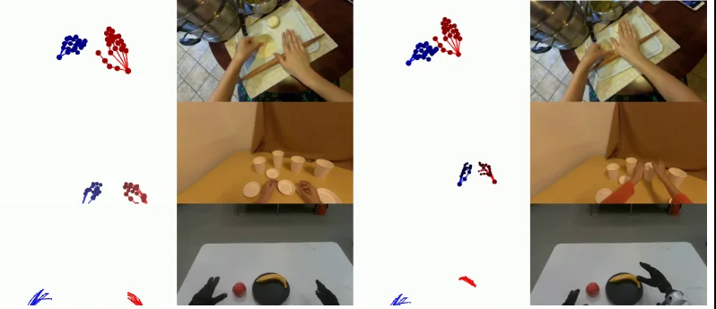

# RynnWorld-Teleop: An Action-Conditioned World Model for Digital Teleoperation

[arXiv](https://arxiv.org/abs/2607.06558) · [HuggingFace](https://huggingface.co/papers/2607.06558) · ▲76

## Abstract (verbatim)

> Scaling robot learning requires massive, diverse trajectory data, yet collection is currently bottlenecked by physical teleoperation, where every demonstration binds operator time to specific hardware and workspaces. We introduce digital teleoperation, a paradigm that decouples data collection from physical constraints by replacing the real robot with a generative world model. In this framework, an operator's hand-pose stream drives a robot-centric generative world model to synthesize high-fidelity egocentric videos from a single reference image. The recorded pose stream serves as an embodiment-agnostic action label transferable to any target robot via standard retargeting, yielding complete state-action trajectories for imitation learning independent of physical hardware. We instantiate this paradigm in RynnWorld-Teleop, a system that integrates depth-aware skeletal conditioning, progressive human-to-robot training on a video Diffusion Transformer, and streaming autoregressive distillation. This pipeline compresses the generative process into a single-pass inference, enabling 40+ FPS, real-time interactive generation on a single H100 GPU. Policies trained exclusively on RynnWorld-Teleop-generated data achieve effective zero-shot Sim2Real transfer across dexterous and diverse bimanual tasks. Moreover, augmenting real-world datasets with our digitally teleoperated data consistently improves success rates, demonstrating that RynnWorld-Teleop serves as a high-fidelity, scalable data engine for the next generation of robotic agents.

## Background

### Background Analysis  

**1. Technical Context and Need**  
Robot learning requires massive diverse data, but physical data collection is inefficient—traditional teleoperation (e.g., controlling real robots via VR or mechanical arms) is limited by hardware costs, environment reset times, and object diversity. For example, training a robot to manipulate daily objects requires manual scene setup and trajectory recording, which is time-consuming and hard to scale. Digital teleoperation aims to replace real robots with generative models, allowing operators to control robots virtually via gestures, thus bypassing physical constraints to generate large-scale training data.  

**2. Limitations of Prior Work**  
Existing approaches face three core issues:  
- **Passive observation vs. active control**: Early methods (e.g., converting human videos to robot views) generate images but fail to record actionable sequences (e.g., joint movements), making the data unsuitable for imitation learning.  
- **Human-centric vs. robot-centric perspective**: Some models generate videos from a human viewpoint, leading to mismatches between appearance and robot behavior.  
- **Non-real-time generation**: Complex models (e.g., Diffusion Transformers) cannot respond in real time to operators’ actions, breaking interactivity.  

**3. Proposed Solution**  
RynnWorld-Teleop addresses these issues with three innovations:  
- **Robot-centric action capture**: Operator gestures are mapped to robot joint spaces, and depth-aware rendering generates high-fidelity videos, ensuring alignment between actions and visual observations.  
- **Progressive cross-domain training**: The model first learns general manipulation priors from human videos, then adapts to robot perspectives via paired human-robot data, eliminating the "appearance-behavior" gap.  
- **Real-time streaming generation**: Causal reasoning and rollout consistency enable long-horizon task generation in a single pass, supporting 40 FPS real-time interaction.  

**4. Key Differences from Prior Work**  
Unlike existing methods, RynnWorld-Teleop is the first to satisfy three critical criteria:  
- **Action interpretability**: Generated videos directly correspond to actionable joint-level labels, not just images.  
- **Robot-centric perspective**: All content is rendered from the robot’s viewpoint, ensuring data is directly usable for training.  
- **Real-time interactivity**: Operators see immediate feedback and can adjust strategies, supporting continuous execution of complex tasks.  

This framework transforms data collection from "hardware-dependent" to "imagination-driven," providing a scalable, high-fidelity data engine for robot learning.

## Method, Figure by Figure

> Figure 1 : Physical vs. Digital Teleoperation. (Top) Physical teleoperation binds every demonstration to a real robot and a fixed workspace, capping throughput at operator-hours × \times hardware availability. (Bottom) Digital teleoperation replaces the real robot with RynnWorld-Teleop, a real-time action-conditioned world model that synthesizes the egocentric video the robot would have produced from a single reference image, and retargets the same gesture stream into embodiment-specific robot actions. Both pipelines emit synchronized (RGB observations, robotic actions) pairs, so digital teleoperation is drop-in compatible with downstream imitation learning, without ever moving a real robot.

This figure clearly contrasts **Physical Teleoperation** and **Digital Teleoperation**, helping us understand the core logic and advantages of the digital teleoperation method proposed in the paper.

### Physical Teleoperation (Upper Part)
- **Human Operator**: The operator inputs actions through a VR device.
- **Retargeting**: The operator's actions are converted into **Joint-space Actions**, a robot-specific action representation.
- **Control**: These joint-space actions are sent to the **Real Robot** to control its movement.
- **Real-world Dataset**: While executing actions, the robot generates **RGB Observations** and records **Robotic Actions**, which are collected into the real-world dataset.
- **Issues**: Physical teleoperation has three main limitations:
  - **Hardware-bound**: Data collection depends on specific hardware devices.
  - **Fixed-workspace**: The operating range is limited by the robot's physical workspace.
  - **Manual-reset**: The environment and robot need to be manually reset after each demonstration.

### Digital Teleoperation (Lower Part)
- **Human Operator**: Similarly, the operator inputs actions through a VR device, but the process is different from physical teleoperation.
- **Skeletal Rendering**: The operator's hand movements are rendered as a **Depth-Aware Skeletal Representation**, a more abstract action representation.
- **Generating**: This skeletal representation is input into the **Real-time Video Streaming** module, which uses RynnWorld-Teleop (an action-conditioned world model) to synthesize high-fidelity first-person videos from a single reference image, simulating the visual observations when the robot executes the actions.
- **Synthetic Dataset**: The generated RGB observations and retargeted **Robotic Actions** are collected into the synthetic dataset.
- **Advantages**: Digital teleoperation has three significant advantages:
  - **Hardware-agnostic**: Data collection does not depend on specific hardware devices.
  - **Zero-asset-overhead**: No actual robot hardware is required, reducing costs.
  - **Real-time**: It can generate and collect data in real time, improving efficiency.
- **Retargeting**: The action labels in the synthetic dataset can be converted into robot-specific actions through standard retargeting methods, enabling transfer learning across different robots.

### Method Workflow
1. **Physical Teleoperation**: The operator's actions are converted into joint-space actions through retargeting, controlling the real robot, and collecting real-world data. However, this method is limited by hardware, workspace, and manual reset.
2. **Digital Teleoperation**: The operator's hand movements are rendered as a depth-aware skeletal representation, input into the real-time video stream module, which synthesizes robot-view videos. The generated RGB observations and retargeted actions are collected as synthetic data. This method decouples data collection from physical hardware, offering advantages such as hardware agnosticism, zero asset overhead, and real-time capability.

### Conclusion
This figure demonstrates how digital teleoperation, by replacing real robots with generative models, solves the bottlenecks of physical teleoperation, making large-scale robot learning data collection more efficient and flexible. The synthetic data generated by digital teleoperation can be used to train robot policies and achieve zero-shot Sim2Real transfer.

---

> Figure 3 : Overview of RynnWorld-Teleop. (a) Actions are rendered as depth-aware skeletal videos and encoded into the latent space via a VAE. (b) We expand a pretrained video DiT to incorporate hand-pose conditioning using a distribution-aligned patch embedding branch. (c) The model is distilled into a causal student for interactive, autoregressive generation using a streaming rollout schedule.

This figure illustrates the overall architecture and workflow of the RynnWorld-Teleop system, which is an action-conditioned world model for digital teleoperation. We can understand this system through the following components and their interactions:

First, on the left side of the figure, there are two main input sources. The upper input is a sequence of reference images (appearing as robot-centric egocentric images), and the lower input is a stream of operator hand poses (represented by an icon of a person wearing a VR headset and hand movements). These two inputs represent the "environment" and "action" aspects of digital teleoperation, respectively.

Next, both inputs are processed by their respective VAE (Variational Autoencoder) encoders. The role of the VAE Encoder is to encode the input images or pose information into a latent space. For the upper reference images, they are encoded into a latent representation, possibly with added noise (labeled as "noised" in the figure), which is typically done for training stability in generative models. For the lower hand poses, they are also encoded into a latent representation that contains action information.

Then, these two latent representations are combined and fed into a series of processing modules. The upper path shows that the noisy latent representation and the action latent representation are input into "Wan-DiT Blocks" (likely referring to a type of improved video Diffusion Transformer block). This module is responsible for generating new latent representations based on the action conditions. At the same time, this module transfers its knowledge to the lower "Causal Blocks" through an arrow labeled "Distillation." The purpose of distillation is to transfer the knowledge from the teacher model (Wan-DiT Blocks) to the student model (Causal Blocks) for more efficient inference.

The lower path shows that the action latent representation is input into the "Causal Blocks." These causal blocks utilize KV Cache (Key-Value Cache) to store intermediate results, enabling streaming, autoregressive generation. KV Cache allows the model to reuse previous information during the generation process, improving efficiency and supporting real-time interaction.

Finally, the processed latent representations are fed into the VAE Decoder. The role of the VAE Decoder is to decode the latent space representations back into the image space, generating high-fidelity first-person perspective videos. The figure shows that the images generated by the upper path are in batches (multiple frames), while the images generated by the lower path are real-time (single-frame streaming output), labeled "Real-time," indicating that this path supports real-time interaction.

The entire workflow reveals how the RynnWorld-Teleop method operates: the operator's hand poses drive a robot-centric generative world model, which synthesizes high-fidelity first-person videos from a single reference image. By combining action information (hand poses) with visual information (reference images) and utilizing distillation and causal autoregressive generation, the system achieves real-time, interactive video generation. This approach decouples teleoperation data collection from physical hardware constraints, enabling the large-scale generation of diverse datasets for robot imitation learning.

In summary, this figure shows a complete pipeline from input (reference images and hand poses) to output (generated videos), including key steps such as encoding, conditional processing, distillation, autoregressive generation, and decoding. This system integrates action information into the generation process to enable digital teleoperation, providing a new paradigm for robot learning.

---

> Figure 4 : Task illustration . We design four manipulation tasks for real-world evaluation.

This figure (Figure 4) is from the paper "RynnWorld - Teleop: An Action - Conditioned World Model for Digital Teleoperation", with the title "Task illustration". It is used to show four manipulation tasks designed for real - world evaluation, so as to illustrate the application scenario of the proposed method (RynnWorld - Teleop) and how the method works.

From left to right, the four task panels are "Dual Picking", "Block Pushing", "Bimanual Lifting" and "Lid Placement". Each task panel contains a schematic diagram of a robot performing a task, as well as action flows marked with numbers (1, 2, 3, 4, etc.) and red arrows. These arrows and numbers represent the order or steps of the robot's actions when performing the task:

1. **Dual Picking**:
    - The schematic shows a dual - arm robot (or a similar multi - joint robot) in a workspace, with objects (such as black and yellow objects) around.
    - The red arrows and numbers (1, 2, 3, 4) represent the action sequence of the robot when performing the picking task. For example, number 1 may represent the initial movement of the robot's arm, and numbers 2, 3, 4 represent subsequent actions such as grasping, moving or placing in turn. The order of these actions shows how the robot coordinates two arms (or joints) to complete the dual - picking task, that is, grasping objects from different positions and performing operations.
    - The purpose of this task is to show the robot's ability to handle scenarios that require simultaneous or sequential grasping of multiple objects. The method (RynnWorld - Teleop) drives the generative model to synthesize high - fidelity first - person perspective videos by using the operator's actions (such as hand - pose streams) in the way of digital teleoperation. Thus, these action sequences are recorded as action labels for training the robot policy.

2. **Block Pushing**:
    - The robot in the schematic is pushing a black block (or a similar object).
    - The red arrows and numbers (1, 2, 3, 4) represent the action sequence of pushing the block. For example, number 1 may be the initial position adjustment of the robot's arm, and numbers 2, 3, 4 represent different stages of pushing the block, such as approaching the block, applying thrust, and completing the push.
    - This task shows the robot's ability to handle scenarios that require pushing objects. Similarly, through the method of digital teleoperation, the operator's actions are converted into the robot's action sequences for training the policy, so that the policy can learn to push the block effectively.

3. **Bimanual Lifting**:
    - The robot in the schematic uses two arms (or joints) to lift a green and yellow object (such as a block - like object).
    - The red arrows and numbers (1, 2) represent the action sequence of lifting the object. Number 1 may be the initial positioning of the arm, and number 2 represents the lifting action (such as moving up, stabilizing the object, etc.).
    - This task shows the robot's ability to handle scenarios that require collaborative lifting of objects with both hands. The method of digital teleoperation makes the operator's actions recorded and converted into the robot's actions for training the policy, so as to achieve effective bimanual lifting.

4. **Lid Placement**:
    - The robot in the schematic is placing a lid (or a similar object) on a brown object (such as a box).
    - The red arrows and numbers (1, 2) represent the action sequence of placing the lid. Number 1 may be the initial position adjustment of the robot's arm, and number 2 represents the placing action (such as approaching the target, putting down the lid, adjusting the position, etc.).
    - This task shows the robot's ability to handle scenarios that require precise placement of objects. Through the method of digital teleoperation, the operator's actions are converted into the robot's action sequences for training the policy, so as to achieve accurate lid placement.

From the perspective of the method, this figure reveals how RynnWorld - Teleop works: First, the operator drives a robot - centric generative world model through the hand - pose stream. This generative model synthesizes high - fidelity first - person perspective videos from a reference image. In this process, the recorded operator's hand - pose stream is used as an embodiment - agnostic action label, which can be transferred to any target robot through standard retargeting methods, so as to obtain complete state - action trajectories for imitation learning without relying on physical hardware.

Specifically, the RynnWorld - Teleop system integrates depth - aware skeletal conditioning, progressive human - to - robot training on a video Diffusion Transformer, and streaming autoregressive distillation. This process compresses the generative process into a single - pass inference, enabling real - time interactive generation at more than 40 FPS on a single H100 GPU.

Then, the policies trained only on the data generated by RynnWorld - Teleop can achieve effective zero - shot Sim2Real (simulation - to - reality) transfer in various dexterous and bimanual tasks. In addition, augmenting real - world datasets with our digitally teleoperated data can continuously improve the success rate, which shows that RynnWorld - Teleop, as a high - fidelity and scalable system, can provide a large amount of diverse trajectory data for robot learning, solving the bottleneck problem of data collection in physical teleoperation (that is, each demonstration binds the operator's time to specific hardware and workspaces).

In summary, this figure, by showing four different manipulation tasks, illustrates how the RynnWorld - Teleop method can record the operator's actions and convert them into the robot's action sequences for training the robot policy through the way of digital teleoperation, so as to achieve various complex manipulation tasks and can effectively transfer between simulation and the real world, while improving the success rate of real - world tasks.

---

> Figure 13 : Qualitative results of RynnWorld-Teleop on robotic manipulation tasks. Starting from a single reference image and a sequence of human hand-pose streams, RynnWorld-Teleop synthesizes high-fidelity, temporally coherent robotic execution videos. The results demonstrate the model’s ability to render complex dexterous interactions, such as bimanual coordination and high-precision object handling, while maintaining strict adherence to the input action signal.

This figure (Figure 13) is a result visualization from the paper "RynnWorld-Teleop: An Action-Conditioned World Model for Digital Teleoperation," designed to intuitively demonstrate how the proposed digital teleoperation method generates high-fidelity, temporally coherent robotic execution videos based on a human hand-pose stream and a single reference image.

We can decompose this figure into multiple horizontally arranged rows, with each row representing an independent robotic manipulation task example. Within each row, multiple vertically arranged sub-images are shown, depicting the progression of the operation over time, typically from left to right, showing the transition from an initial state to the completion of a specific action (like grasping, moving, or placing an object).

Specifically, the structure of each row is as follows:

1.  **Input Component (Implicit)**: Although not explicitly shown, according to the paper, each task example starts with "a single reference image" and "a sequence of human hand-pose streams." The reference image might correspond to the leftmost sub-image in each row or a more abstract initial state representation. The human hand-pose stream is the sequence of commands driving the model to generate subsequent actions.

2.  **Temporal Sequence of Sub-Images**: The sub-images in each row, from left to right, show the temporal evolution of the operation. For instance, in the top row, we see a brown box on a table with robotic hands (or glove-like representations) on either side. As we move from left to right, the robotic hands gradually interact with the box, eventually appearing to complete an action (like picking it up or placing it down). The second row shows a watermelon, with robotic hands gradually approaching and possibly rotating or moving it. The third row shows a small blue ball, with robotic hands reaching towards it from both sides, eventually possibly grasping or moving it. The fourth row shows a black object with a yellow top (possibly a tool or toy) being interacted with by robotic hands.

3.  **Hand Pose Visualization (Below)**: Below each row of sub-images, there is a row of colored hand icons (blue and red). These icons represent the input human hand-pose stream. Blue and red likely represent the left and right hand poses, respectively. The change in shape and direction of these icons reflects the gestures made by a human operator at different time points. Importantly, these gesture sequences are the direct input driving the model to generate the robotic operation video above. The goal of the model is to ensure that the generated robotic actions strictly correspond to these input hand-signal sequences.

4.  **Information Flow**: The data flow can be understood as: Human hand-pose stream (the hand icons below) + Single reference image (or initial state) → RynnWorld-Teleop model → Synthesized robotic execution video (the sequence of sub-images above). This process is temporally coherent, meaning the model needs to ensure that each generated frame is consistent with the previous frame and the input hand-pose sequence.

This figure reveals how the method specifically works:

*   **Action-Conditioned Generation**: The core of the model is to generate robotic behavior based on the input action signals (i.e., the human hand-pose stream). This means the output (robot actions) is directly determined by the input action commands.
*   **Digital Teleoperation**: By using a generative world model, the method achieves digital teleoperation. The operator does not need to physically control a real robot but instead controls a virtual robot through gestures in a digital environment.
*   **High Fidelity and Temporal Coherence**: The results shown in the figure indicate that the model can generate high-fidelity videos that are temporally coherent. This means the generated robot actions look natural and adhere to physical laws.
*   **Complex Interactions**: The examples in the figure demonstrate the model's ability to handle complex operations, such as bimanual coordination (e.g., both hands operating an object simultaneously) and high-precision object handling (e.g., grasping a small ball or rotating a watermelon).
*   **Strict Adherence to Input Action Signals**: A key feature of the model is its ability to strictly follow the input action signals. This means the generated robot actions are highly consistent with the intent of the human operator's gestures.

Conclusion:

This figure, through multiple task examples (like box manipulation, watermelon manipulation, small ball manipulation, and tool manipulation), demonstrates the effectiveness of the RynnWorld-Teleop method. It clearly shows that the method can synthesize high-fidelity, temporally coherent, and action-compliant robotic execution videos based on a human hand-pose stream and a single reference image. These results indicate that RynnWorld-Teleop can render complex dexterous interactions, such as bimanual coordination and high-precision object handling, while strictly adhering to the input action signals. This provides an effective solution to the bottleneck problem of collecting large-scale trajectory data for robot learning.

---

> Figure 2 : Depth-Aware Representation. We bridge the gap between 2D projections and 3D dynamics by rendering hand skeletons with depth-modulated color and size.

This figure (Figure 2) is titled "Depth-Aware Representation" and its core purpose is to illustrate the method proposed in the paper for bridging the gap between 2D projections (like images) and 3D dynamics. Specifically, the method achieves this by rendering hand skeletons with depth-modulated color and size.

We can understand the workflow and information presentation by dividing the figure into two main parts:

**Left Part: Visualization of Depth-Aware Representation**
This part shows how depth information is encoded into the visual representation of hand skeletons. There are two sets of hand skeleton diagrams here, each containing blue and red skeletons.
*   **Blue Skeletons**: These represent a hand or parts of a hand that are farther from the observer (or camera). Visually, these skeletons might appear darker in color or relatively smaller, suggesting their position in 3D space is further away.
*   **Red Skeletons**: These represent a hand or parts of a hand that are closer to the observer. These skeletons might appear brighter in color or relatively larger, suggesting their position in 3D space is nearer.
This difference in color and size is the manifestation of "depth modulation," which converts depth information from 3D space into visual features in a 2D image, allowing the observer to intuitively understand the relative position and pose of the hand in 3D space.

**Right Part: Examples of Image Generation Using Depth-Aware Representation**
This part demonstrates the application of the method in actual image generation. It consists of three rows, each with two side-by-side images: the left image is an input or reference image, and the right image is a generated image.
*   **Top Row**: Shows a scene of kneading dough. The left image shows hands manipulating dough and a rolling pin. The right image is generated, maintaining similar scene content to the left image, but the representation of hand skeletons (if overlaid or implicit in the generation process) reflects depth information. For example, the hand closer to the camera might appear larger or have a different color.
*   **Middle Row**: Shows a scene of manipulating multiple cups. The left image shows a hand moving a cup. The right image is generated, similarly maintaining scene content, and the depth information of the hand skeletons is encoded into the visual representation.
*   **Bottom Row**: Shows a scene of manipulating a ball and a bowl. The left image shows two gloved hands interacting with the ball and bowl. The right image is generated, with depth information of the hand skeletons also encoded.

**Information Flow and Method Mechanism**
1.  **Input**: The system receives a reference image (like the left image in each row of the figure), which contains a 2D projection of a scene and hands.
2.  **Depth Perception Processing**: The system analyzes the hands in the image to estimate their 3D pose and depth information. This is achieved through some depth perception technique, possibly using monocular image depth estimation methods or other sensor data (though the paper mentions digital teleoperation, which might primarily rely on visual input).
3.  **Skeleton Rendering**: Based on the estimated depth information, the system renders the skeletal structure of the hands. During this rendering process, the color and size of the skeletons are depth-modulated: hand skeletons that are farther away appear darker or smaller (like the blue skeletons on the left), while those that are closer appear brighter or larger (like the red skeletons on the left).
4.  **Image Generation**: The system uses the rendered depth-aware hand skeletons along with other information from the original scene to generate new images (like the right image in each row of the figure). These generated images not only retain the content of the original scene but also provide richer 3D dynamic information through the depth-aware representation of the hand skeletons.

**Conclusion**
This figure clearly demonstrates the working principle of the "depth-aware representation" method: by encoding depth information into the color and size of hand skeletons, it creates a bridge between 2D projections and 3D dynamics. This method allows the generated images to more accurately reflect the position and pose of hands in 3D space, which is crucial for robot learning tasks that require precise motion capture and imitation. The examples in the figure show that the method can be effectively applied to different hand manipulation scenarios and generate images with depth-aware information.

In summary, this figure, through visual comparison and examples, intuitively explains how the depth-aware representation method works, i.e., how depth information is incorporated into the visual representation of hand skeletons to bridge the gap between 2D projections and 3D dynamics.
