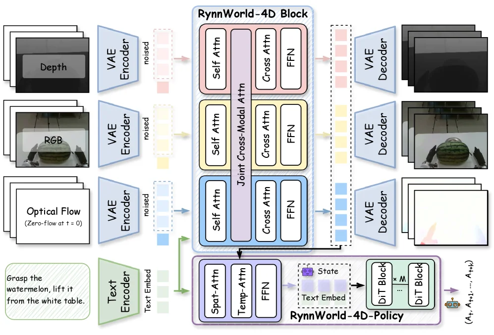
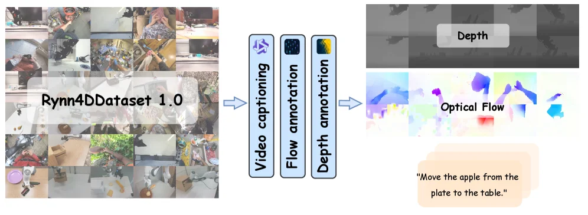
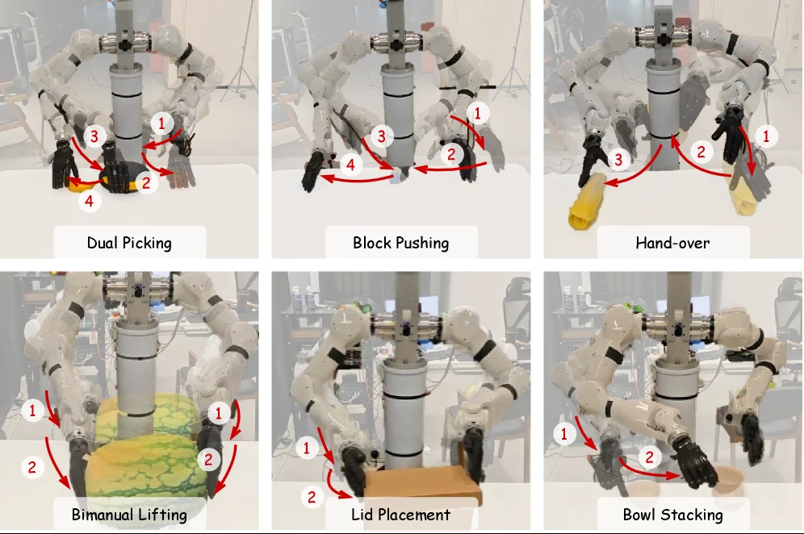
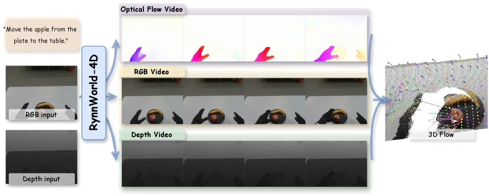
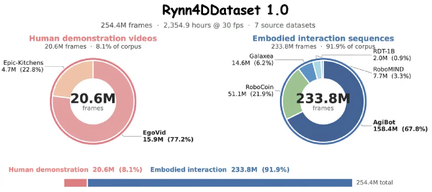

# RynnWorld-4D: 4D Embodied World Models for Robotic Manipulation

[arXiv](https://arxiv.org/abs/2607.06559) · [HuggingFace](https://huggingface.co/papers/2607.06559) · ▲89

## 摘要（原文）

> Robotic manipulation in the open world requires not only recognizing what a scene looks like, but also anticipating how its 3D structure moves under interaction. We argue that synchronized RGB, depth, and optical flow, namely RGB-DF, provide a physically grounded representation that captures the underlying 4D dynamics of a scene. Compared to 2D pixel videos, this multi-modal synergy aligns visual appearance with geometric structure and temporal motion, creating a representation space significantly closer to the low-level end-effector actions demanded by robotic systems, thereby narrowing the gap between world prediction and policy learning. Building on this insight, we introduce RynnWorld-4D, a generative model that co-produces future RGB frames, depth maps, and optical flow from a single RGB-D image and a language instruction within one unified diffusion process. This 4D world model features a tri-branch architecture that integrates cross-modal attention with frame-wise 3D RoPE, ensuring that appearance, geometry, and motion evolve consistently. To supply training data at scale, we curate Rynn4DDataset 1.0, a massive dataset of over 254.4 million frames across egocentric human and robotic manipulation videos with high-quality pseudo-labels for depth and optical flow. We further propose RynnWorld-4D-Policy, an inverse dynamics head that consumes the internal 4D representations of RynnWorld-4D in a single forward pass, bypassing expensive multi-step denoising, to output robot actions in a closed-loop manner. Experiments show that RynnWorld-4D produces temporally and spatially coherent 4D predictions, and that RynnWorld-4D-Policy achieves state-of-the-art performance on real-world dexterous bimanual manipulation tasks, particularly excelling in tasks demanding spatial precision and temporal coordination.

## 摘要（中译）

在开放世界中进行机器人操作不仅需要识别场景的外观，还需要预测其3D结构在交互作用下的运动方式。我们认为，同步的RGB（红绿蓝）、深度（depth）和光流（optical flow），即RGB - DF，提供了一种具有物理基础的表示方式，能够捕捉场景的潜在4D（四维）动态。与2D像素视频相比，这种多模态协同作用将视觉外观与几何结构和时间运动相结合，创建了一个表示空间，该空间显著更接近机器人系统所需的低级末端执行器动作，从而缩小了世界预测和策略学习之间的差距。基于这一见解，我们引入了RynnWorld - 4D，这是一个生成模型，在一个统一的扩散过程中，从单个RGB - D（红绿蓝 - 深度）图像和语言指令中共同生成未来的RGB帧、深度图和光流。这个4D世界模型具有三分支架构，将跨模态注意力与逐帧3D RoPE（旋转位置编码，Rotation - Position Encoding）相结合，确保外观、几何和运动一致发展。为了大规模提供训练数据，我们整理了Rynn4DDataset 1.0，这是一个包含超过2.544亿帧的大型数据集，涵盖了以自我为中心的人类和机器人操作视频，并为深度和光流提供了高质量的伪标签。我们进一步提出了RynnWorld - 4D - Policy，这是一个逆动力学头，在单次前向传播中消耗RynnWorld - 4D的内部4D表示，绕过昂贵的多步去噪过程，以闭环方式输出机器人动作。实验表明，RynnWorld - 4D能够生成时间和空间上一致的4D预测，而RynnWorld - 4D - Policy在现实世界的灵巧双手操作任务中取得了最先进的性能，特别是在需要空间精度和时间协调的任务中表现尤为出色。

## 背景剖析

### 背景剖析  

**1. 技术背景与真实需求**  
在开放世界中，机器人需要具备理解环境并预测交互后果的能力。例如，当机器人抓取或移动物体时，它不仅需要识别当前场景的视觉外观，还需要预判物体在受力后的3D运动轨迹（如掉落、滑动或碰撞）。这种能力对现实任务（如家务协作、工业装配或医疗辅助）至关重要，因为机器人必须在动态环境中做出快速、安全的决策。传统方法依赖2D图像或单一模态（如深度图），但无法同时处理空间结构和时间动态，导致预测不准确或动作不协调。  

**2. 先前方法的局限性**  
现有研究主要面临两个核心问题：  
- **2D表示的不足**：基于像素的生成模型（如视频扩散模型）虽然能生成逼真的视觉效果，但缺乏几何和运动信息，导致无法精确估计物体的6自由度（6-DoF）位置或深度，进而影响机器人的交互精度。  
- **3D/4D方法的缺陷**：基于神经辐射场（NeRF）或结构从运动（SfM）的方法要么计算成本高昂（如场景特定优化），要么缺乏生成未来状态的能力（如仅能重建静态点云）。此外，这些方法通常需要多视图输入或难以扩展到复杂场景。  

**3. 本文的解决方案**  
论文提出了一种名为RynnWorld-4D的4D世界模型，通过同步生成RGB图像、深度图和光流（RGB-DF）来捕捉场景的4D动态。其核心思路是：  
- **多模态协同表示**：将深度和光流作为中间表示，将2D像素与3D几何及运动关联起来，既保留了视频扩散模型的生成能力，又显式编码了几何信息。  
- **统一生成框架**：使用一个三分支变压器模型，在共享的去噪过程中同步生成三种模态，并通过交叉注意力机制确保它们的一致性。  
- **高效训练数据**：构建了Rynn4DDataset 1.0，包含超过2.5亿帧的具身操作视频（人类和机器人），并自动标注深度和光流，解决了大规模4D数据稀缺的问题。  
- **实时策略学习**：通过RynnWorld-4D-Policy直接从4D表示中提取机器人动作，避免了传统方法中耗时的迭代去噪过程，实现高频闭环控制。  

**4. 与前人工作的关键差异**  
- **表示方式的创新**：不同于纯2D或纯3D方法，RynnWorld-4D使用RGB-DF作为中间表示，平衡了生成能力与几何物理一致性。  
- **模型设计的简洁性**：通过共享的扩散模型架构和交叉模态注意力，避免了多阶段推理或场景特定优化。  
- **数据利用的高效性**：利用伪标签自动生成大规模4D数据，而非依赖昂贵的人工标注或有限的多视图输入。  

这一工作为具身智能提供了一个更接近机器人实际动作空间的表示框架，并在实时操作任务中展示了优越性能。

## 方法图解

> Figure 4 : Overview of RynnWorld-4D. Our pipeline leverages the large-scale Rynn4DDataset 1.0 dataset to train a generative model capable of predicting future 4D sequences. Given a single RGB-D observation and a language instruction, RynnWorld-4D co-generates future RGB frames, depth maps, and optical flow. These predictive 4D representations are then aggregated by RynnWorld-4D-Policy to derive the final robot actions.

这张图展示了RynnWorld-4D方法的整体架构和工作流程，它是一个用于机器人操作的4D世界模型，能够根据单帧RGB-D图像和语言指令预测未来的4D序列（RGB、深度和光流），并基于这些预测生成机器人动作。

首先，我们来看输入部分：
*   **左侧的输入数据**：包括三组传感器数据和一组文本指令。
    *   **Depth（深度图）**：表示场景的几何信息。
    *   **RGB（彩色图像）**：表示场景的外观信息。
    *   **Optical Flow（光流）**：表示场景中物体的运动信息，图中注明“t=0时为零流”，意味着这是初始帧的运动信息。
    *   **Text Embed（文本嵌入）**：来自“Grasp the watermelon, lift it from the white table.”这样的自然语言指令，经过“Text Encoder”编码得到。

接下来是核心的**RynnWorld-4D Block（RynnWorld-4D模块）**：
*   这个模块采用三分支架构，分别处理RGB、深度和光流数据，但它们之间通过“Joint Cross-Modal Attn（联合跨模态注意力）”机制进行信息交互。
*   **每个分支的结构类似**：
    *   输入首先是经过“VAE Encoder（变分自动编码器编码器）”处理的“noised（带噪声的）”特征。这表明该模型可能采用了扩散模型的范式，从噪声中逐步生成清晰的预测。
    *   然后，每个分支包含“Self Attn（自注意力）”层，用于捕捉单一模态内部的时空依赖关系。
    *   接着是“Cross Attn（交叉注意力）”层和“FFN（前馈网络）”，这些层与“Joint Cross-Modal Attn”相连，实现不同模态间的信息融合。
*   **三分支并行处理**：RGB、深度和光流各自通过其分支进行处理，同时通过中间的联合跨模态注意力机制确保外观、几何和运动信息的一致性演化。

然后是**RynnWorld-4D-Policy（RynnWorld-4D策略）**模块：
*   这个模块接收来自RynnWorld-4D Block的内部4D表示。
*   它首先通过“Spat-Attn（空间注意力）”和“Temp-Attn（时间注意力）”层处理这些表示，可能用于聚焦于关键的空间位置和时间步。
*   然后通过“FFN”层。
*   接下来，这些处理后的特征与“Text Embed（文本嵌入）”结合，形成“State（状态）”表示。
*   最后，这个状态表示被输入到由“M个DIT Block（DIT块）”组成的序列中，这些块可能是某种决策变换器（Decision Transformer）或类似的策略网络，最终输出一系列机器人动作 `(A₁, A₂, ..., Aₖ)`。图中特别指出，这个策略头可以“在单次前向传递中消耗RynnWorld-4D的内部4D表示，绕过昂贵的多步去噪过程”，这强调了其高效性。

数据流动的顺序是：
1.  原始的RGB、深度、光流图像和文本指令作为输入。
2.  RGB、深度、光流图像分别通过各自的VAE编码器，并添加噪声。
3.  这些带噪声的特征输入到RynnWorld-4D Block的三个分支中，进行自注意力、交叉注意力和联合跨模态注意力处理。
4.  RynnWorld-4D Block输出预测的未来RGB、深度和光流特征（图中右侧的VAE解码器部分显示了这些预测可以被解码回图像，但这可能主要用于训练或可视化，而不是策略的直接输入）。
5.  RynnWorld-4D Block的内部表示被传递给RynnWorld-4D-Policy模块。
6.  RynnWorld-4D-Policy模块处理这些表示并结合文本指令，最终输出机器人动作序列。

这张图揭示了该方法的具体运作方式：
*   **多模态输入与融合**：该方法利用RGB、深度和光流三种模态的信息，并通过跨模态注意力机制将它们融合在一起，以捕捉场景的4D动态。
*   **生成模型**：RynnWorld-4D作为一个生成模型，能够根据当前观测和语言指令预测未来的4D序列。它可能基于扩散模型，因为使用了VAE编码器和噪声输入。
*   **高效的策略学习**：RynnWorld-4D-Policy直接利用生成模型的内部表示来预测动作，避免了传统方法中可能需要昂贵的多步推理或规划。
*   **端到端训练**：整个系统似乎是一个端到端的训练框架，从感知（预测未来4D）到行动（生成机器人动作）。

总结来说，RynnWorld-4D通过一个统一的框架，将多模态感知（RGB-DF）与语言指令相结合，预测未来的4D场景动态，并基于这些预测高效地生成机器人操作动作。这种方法旨在缩小世界预测与策略学习之间的差距，使机器人能够更好地理解场景并进行交互。

---

> Figure 3 : Data Curation Pipeline. The video data is collected from diverse sources and partitioned into short clips during data preprocessing. Each clip undergoes a multi-modal annotation process: (1) Video Captioning : Qwen3-VL ( bai2025qwen3 ) generates detailed natural language descriptions of the video content; (2) Optical Flow Estimation : DPFlow ( morimitsu2025dpflow ) computes dense per-frame motion fields, which are visualized and saved as flow videos; (3) Depth Estimation : Depth Anything 3 ( lin2025depth ) produces monocular depth predictions, which are upsampled to the original resolution and saved as depth videos with a global depth range of [ 0.0 , 5.0 ] [0.0,5.0] meters.

这张图展示了**Rynn4DDataset 1.0的数据处理与标注流程**，清晰呈现了从原始视频数据到多模态标注结果的完整链路，帮助理解该数据集的构建逻辑：  

### 数据流动与组件解析  
1. **输入：原始视频数据**  
   左侧的“Rynn4DDataset 1.0”区域展示了数据集的原始视频来源——这些视频来自多样化的场景（如人类第一视角、机器人操作等），经过预处理后被分割为短片段（preprocessing阶段隐含在“收集并分割”的逻辑中）。  

2. **多模态标注流程（箭头方向：从左到右）**  
   原始视频片段依次经过三个核心标注步骤，每个步骤由特定的工具/模型完成，且输出对应类型的多模态数据：  
   - **Video captioning（视频描述）**：使用`Qwen3-VL`模型（论文中引用为bai2025qwen3）生成视频内容的**自然语言描述**（例如右下角的“Move the apple from the plate to the table.”就是典型的描述示例）。这一步为视频赋予语义级的解释，帮助关联视觉内容与任务意图。  
   - **Flow annotation（光流标注）**：使用`DPFlow`模型（论文中引用为morimitsu2025dpflow）计算**每帧的密集运动场**（即光流）。光流被可视化并保存为“光流视频”，用于捕捉场景中物体的运动趋势（图中“Optical Flow”区域的彩色图就是光流的可视化结果，不同颜色代表不同的运动方向/速度）。  
   - **Depth annotation（深度标注）**：使用`Depth Anything 3`模型（论文中引用为lin2025depth）生成**单目深度预测**。深度图被上采样到原始分辨率，并以“[0.0, 5.0]米”的全局深度范围保存为“深度视频”（图中“Depth”区域的灰度图就是深度图的可视化，灰度值对应距离远近，通常越亮/越暗代表距离越近/越远）。  

### 方法运作的直观理解  
这张图揭示了**Rynn4DDataset 1.0的构建逻辑**：通过“多模态标注”将原始视频转化为**同步的RGB（隐含在视频片段中）、深度、光流（即RGB-DF）**数据。这种多模态协同的设计，让视觉外观（RGB）、几何结构（深度）和时序运动（光流）在表示空间中对齐，更贴近机器人末端执行器所需的低级动作逻辑，从而缩小“世界预测”与“策略学习”的差距（这也呼应了论文摘要中“多模态协同对机器人操作的重要性”的核心观点）。  

简单来说，流程是：**原始视频 → 多模态标注（描述、光流、深度） → 多模态数据集（Rynn4DDataset 1.0）**。每个标注步骤都针对特定的模态（语义、运动、几何），最终产出的多模态数据为后续的“RynnWorld-4D”生成模型提供了训练基础（模型需要从单张RGB-D图像+语言指令中预测未来的RGB、深度、光流）。  

### 关键细节补充  
- 光流的可视化：图中“Optical Flow”的彩色图使用了光流的常见可视化方式（如HSV色彩空间，色调代表方向，饱和度代表速度），帮助直观理解物体的运动。  
- 深度的可视化：“Depth”的灰度图通过亮度映射距离，让深度信息更易解读。  
- 语言描述的作用：视频描述（如“移动苹果”）为数据集赋予了任务导向的语义，这对后续的“逆动力学头（RynnWorld-4D-Policy）”从4D表示中输出机器人动作至关重要。  

这张图通过清晰的流程和可视化结果，展示了如何从原始视频构建一个包含语义、运动、几何信息的多模态数据集，为机器人操作的研究提供了数据基础。

---

> Figure 5 : Real-world Manipulation Benchmark. We establish a comprehensive evaluation suite comprising six diverse tasks to assess the model’s performance in open-world manipulation, providing a rigorous testbed for our 4D world model.

这张图展示了论文中提出的**真实世界操作基准（Real - world Manipulation Benchmark）**，它由六个不同的任务组成，用于评估模型在开放世界操作中的性能，为4D世界模型提供了一个严格的测试平台。

### 各任务板块解析（从左到右、从上到下）
1. **Dual Picking（双重拾取）**：
    - 图中有两个机械臂（或一个机械臂的两个“手”），红色箭头和数字（1、2、3、4）表示动作的顺序或流程。数字1、2可能代表机械臂的不同操作阶段，比如抓取不同物体的步骤；数字3、4可能是辅助的动作或物体的位置变化。这里的动作流程是：按照箭头和数字的顺序，机械臂依次执行拾取相关物体的操作，展示模型在同时或依次拾取物体时的能力。
    - 数据或信息流动：从初始的物体摆放状态（图中被操作的物体，如黑色、黄色、棕色的物体），按照箭头指示的动作顺序（1→2→3→4或其他顺序），机械臂执行拾取动作，完成双重拾取的任务，这体现了模型对多物体拾取操作的理解和执行能力。
2. **Block Pushing（方块推动）**：
    - 同样有机械臂，红色箭头和数字（1、2、3、4）表示推动方块的动作顺序。数字1、2可能代表推动方块的不同阶段或方向，数字3、4可能是方块的位置变化或辅助动作。动作流程是：机械臂按照箭头和数字的顺序推动方块，改变方块的位置，展示模型在推动物体（方块）时的操作能力。
    - 数据或信息流动：从初始的方块位置（图中方块的位置），按照箭头指示的推动顺序（1→2→3→4或其他顺序），机械臂推动方块，使方块移动到目标位置，这体现了模型对物体推动操作的理解和执行能力。
3. **Hand - over（交接）**：
    - 机械臂的手（或工具）之间进行物体交接，红色箭头和数字（1、2、3）表示交接的动作顺序。数字1、2可能代表物体从一个“手”到另一个“手”的传递阶段，数字3可能是物体的位置变化或辅助动作。动作流程是：物体从一个机械臂的“手”（或工具）按照箭头和数字的顺序传递到另一个“手”，展示模型在物体交接操作时的能力。
    - 数据或信息流动：从初始的物体位置（图中黄色物体在某个“手”上），按照箭头指示的交接顺序（1→2→3或其他顺序），物体被传递到另一个“手”，这体现了模型对物体交接操作的理解和执行能力。
4. **Bimanual Lifting（双手提升）**：
    - 两个机械臂（或一个机械臂的两个部分）共同提升一个物体（如西瓜状的物体），红色箭头和数字（1、2）表示提升的动作顺序。数字1、2可能代表两个“手”或机械臂部分的提升阶段或协作方式。动作流程是：两个机械臂按照箭头和数字的顺序共同提升物体，展示模型在双手协作提升物体时的能力。
    - 数据或信息流动：从初始的物体位置（图中物体在下方），按照箭头指示的提升顺序（1→2或其他顺序），两个机械臂协作将物体提升，这体现了模型对双手协作提升操作的理解和执行能力。
5. **Lid Placement（盖子放置）**：
    - 机械臂将盖子（或类似物体）放置到目标位置（如桌子上），红色箭头和数字（1、2）表示放置的动作顺序。数字1可能代表机械臂抓取盖子的阶段，数字2代表放置盖子的阶段。动作流程是：机械臂先抓取盖子（按照箭头1的方向），然后将盖子放置到目标位置（按照箭头2的方向），展示模型在放置物体（盖子）时的操作能力。
    - 数据或信息流动：从初始的盖子位置（图中盖子在机械臂附近），按照箭头指示的放置顺序（1→2），机械臂抓取并放置盖子，这体现了模型对物体放置操作的理解和执行能力。
6. **Bowl Stacking（碗堆叠）**：
    - 机械臂将碗堆叠起来，红色箭头和数字（1、2）表示堆叠的动作顺序。数字1可能代表机械臂抓取碗的阶段，数字2代表放置碗（堆叠）的阶段。动作流程是：机械臂先抓取碗（按照箭头1的方向），然后将碗放置到另一个碗上（按照箭头2的方向），完成碗的堆叠，展示模型在堆叠物体（碗）时的能力。
    - 数据或信息流动：从初始的碗位置（图中碗在下方），按照箭头指示的堆叠顺序（1→2），机械臂抓取并堆叠碗，这体现了模型对物体堆叠操作的理解和执行能力。

### 方法运作的体现（从图中理解方法的运作）
这张图通过展示六个不同的真实世界操作任务，来评估模型（RynnWorld - 4D）的性能。每个任务都有明确的动作流程（通过箭头和数字表示），模型需要能够理解场景的3D结构（通过RGB - DF表示，即同步的RGB、深度和光流），并预测如何与场景交互（即执行这些操作）。例如，在“Dual Picking”任务中，模型需要识别物体的位置和结构，然后预测机械臂如何依次拾取物体；在“Block Pushing”任务中，模型需要识别方块的位置和结构，然后预测机械臂如何推动方块。这体现了方法的核心思想：利用RGB - DF的多模态协同表示，捕捉场景的4D动态（外观、几何结构和时间运动），从而使模型能够学习到低层次的末端执行器动作（如抓取、推动、交接等），缩小世界预测和策略学习之间的差距。

### 结果相关（如果是结果图的话，这里图中主要是任务展示，可推测结论方向）
从这张图的任务设置来看，这些任务涵盖了不同的操作类型（拾取、推动、交接、提升、放置、堆叠），旨在全面评估模型在开放世界操作中的能力。如果模型能够成功完成这些任务（在实际测试中），则说明RynnWorld - 4D模型能够有效地理解和预测场景的4D动态，从而在真实世界的机器人操作任务中表现出色。这些任务为模型的性能评估提供了一个严格的测试平台，通过在这些任务上的表现，可以验证模型是否能够将世界预测与策略学习有效结合，实现高效的机器人操作。

---

> Figure 1 : Given an input RGB-D image and description, RynnWorld-4D generates RGB, depth, and optical flow videos synchronously, which can be further lifted into 3D scene flow (right).

这张图展示了RynnWorld-4D模型的核心工作流程，它是一个用于机器人操作的4D世界模型。我们从头开始解析：

1.  **输入部分**：
    *   左侧是模型的输入。最上方是一个自然语言指令，例如图中的“Move the apple from the plate to the table.”（将苹果从盘子移到桌子上）。这个指令告诉模型需要进行什么样的操作。
    *   指令下方是两个视觉输入：
        *   “RGB input”：一张彩色的RGB图像，显示了初始场景，例如一个人正在操作一个物体（看起来像苹果）。
        *   “Depth input”：一张深度图，与RGB图像对应，显示了场景中物体的距离信息（通常较暗表示较远，较亮表示较近）。这为模型提供了场景的几何结构信息。

2.  **模型处理与生成部分**：
    *   中间的蓝色矩形框标有“RynnWorld-4D”，这是核心模型。箭头从输入指向这个模型，表示模型接收这些输入。
    *   模型的输出是三个同步生成的“视频”序列，它们并排显示在模型的右侧：
        *   “RGB Video”：模型生成的未来RGB图像序列。这些图像展示了在执行指令后，场景在视觉上如何变化。例如，可以看到手和苹果的位置发生了改变。
        *   “Depth Video”：模型生成的对应深度图序列。这些深度图展示了场景几何结构随时间的变化，与RGB视频中的运动一致。
        *   “Optical Flow Video”：模型生成的光流图序列。光流图可视化了两帧图像之间像素的运动方向和幅度，通常用颜色编码（例如，红色可能表示向右运动，蓝色表示向左运动）。这直接反映了物体在2D图像平面上的运动。

3.  **从2D到3D的转换**：
    *   最右侧的部分标有“3D Flow”。箭头从“RGB Video”、“Depth Video”和“Optical Flow Video”指向这个部分。这表示模型生成的这些多模态信息（RGB、深度、光流）可以被进一步处理，以推断出场景的3D运动流（3D Flow）。3D Flow提供了物体在三维空间中的运动信息，这对于理解机器人操作中的物体运动至关重要。图中展示了一个点云形式的3D场景，其中包含了表示运动的向量，直观地展示了3D Flow的效果。

4.  **信息流动总结**：
    *   数据流顺序是：**输入（RGB-D图像 + 语言指令） -> RynnWorld-4D模型 -> 生成多模态输出（RGB视频、深度视频、光流视频） -> （可选）进一步处理得到3D Flow**。
    *   这个过程揭示了RynnWorld-4D方法的核心：它能够根据给定的当前场景（RGB-D图像）和操作指令（语言），同步预测未来的视觉外观（RGB）、几何结构（深度）和运动情况（光流）。这种多模态的预测能力使得模型能够更好地理解场景的4D动态（3D空间+时间），并为机器人操作提供更准确的预测和规划依据。通过同时生成这些相关的模态，模型确保了外观、几何和运动的一致性演化。

简而言之，这张图清晰地展示了RynnWorld-4D模型如何从一个静态的RGB-D图像和一个语言指令出发，生成未来场景的RGB、深度和光流视频，从而捕捉和预测场景的4D动态，并最终可以推断出3D空间中的运动。

---

> Figure 2 : Composition of the Rynn4DDataset 1.0 dataset. We provide a large-scale hybrid collection of 254.4M frames, balancing human egocentric videos with diverse robotic manipulation data. This diversity ensures that the world model learns both general object interaction priors and robot-specific execution traces.

这张图展示了Rynn4DDataset 1.0的数据集构成，它是一个大规模的混合数据集，包含2.544亿帧图像，平衡了人类视角视频和多样化的机器人操作数据。这种多样性确保世界模型能够学习到一般的物体交互先验和特定于机器人的执行轨迹。

首先，我们看到整个数据集的总帧数是254.4M帧，总时长为2,354.9小时（以30帧每秒计算），并且来自7个源数据集。数据集被分为两个主要部分：

1. **人类演示视频 (Human demonstration videos)**：
   - 总共有20.6M帧，占整个数据集的8.1%。
   - 这部分数据进一步细分为两个来源：
     - **EgoVid**：15.9M帧，占人类演示部分的77.2%。
     - **Epic-Kitchens**：4.7M帧，占人类演示部分的22.8%。

2. **具身交互序列 (Embodied interaction sequences)**：
   - 总共有233.8M帧，占整个数据集的91.9%。
   - 这部分数据来自多个机器人操作数据集，具体包括：
     - **AgiBot**：158.4M帧，占具身交互部分的67.8%。
     - **RoboCoin**：51.1M帧，占具身交互部分的21.9%。
     - **Galaxea**：14.6M帧，占具身交互部分的6.2%。
     - **RDT-1B**：2.0M帧，占具身交互部分的0.9%。
     - **RoboMIND**：7.7M帧，占具身交互部分的3.3%。

从图中可以看出，数据集的构建是为了平衡人类视角的视频数据和机器人操作的具身交互数据。人类演示视频提供了对日常场景的一般理解，而具身交互序列则提供了特定于机器人的操作经验和执行轨迹。这种平衡的数据集设计有助于训练一个能够学习一般物体交互先验和特定于机器人的执行轨迹的世界模型。

通过这种方式，Rynn4DDataset 1.0为RynnWorld-4D模型的训练提供了丰富的数据支持，使得模型能够在统一的扩散过程中从单个RGB-D图像和语言指令生成未来的RGB帧、深度图和光流图。这种多模态数据的结合确保了视觉外观与几何结构和时间运动的协同，从而缩小了世界预测和策略学习之间的差距。
