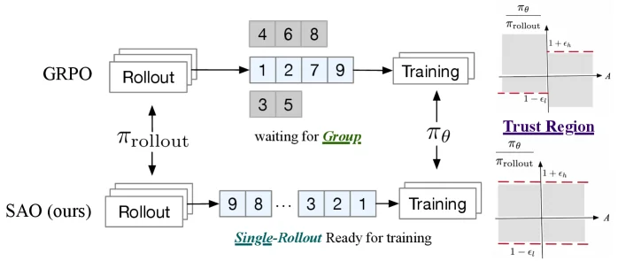
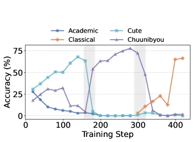
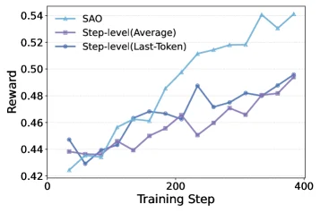

# Single-Rollout Asynchronous Optimization for Agentic Reinforcement Learning

[arXiv](https://arxiv.org/abs/2607.07508) · [HuggingFace](https://huggingface.co/papers/2607.07508) · ▲15

## 摘要（原文）

> Reinforcement learning (RL) is becoming increasingly important for post-training large language models (LLMs). Previous RL pipelines for LLMs were mostly synchronous and batch-interleaved, which is inefficient for long-horizon agentic tasks. Recently, asynchronous RL has emerged as a more efficient alternative by updating the model as rollouts arrive. However, existing asynchronous RL systems often emphasize throughput, while leaving training stability and task effectiveness largely underexplored. For example, a key challenge is that group-wise sampling in the widely-used GRPO framework does not naturally fit asynchronous agentic training. In this paper, we present Single-rollout Asynchronous Optimization (SAO) to address the stability and off-policy challenges in asynchronous RL. To reduce off-policy effects and improve generalization, we replace group-wise sampling with single-rollout sampling, that is, using one rollout per prompt. We further improve this single-rollout strategy with practical value-model training designs. To improve optimization stability, we introduce a strict double-side token-level clipping strategy. SAO is able to train stably for one thousand steps and consistently outperform GRPO and its variants on agentic coding and reasoning benchmarks, such as SWE-Bench Verified, BeyondAIME, and IMOAnswerBench. We also demonstrate that single-rollout RL is particularly effective in a simulated online learning setting, where the model must adapt to changing evolving environments. To this end, SAO is successfully deployed in the agentic RL pipeline for training the open GLM-5.2 model (750B-A40B).

## 摘要（中译）

强化学习（Reinforcement Learning, RL）对于训练后的大型语言模型（Large Language Models, LLMs）变得越来越重要。以前针对LLMs的RL流程大多是同步和批量交错的，这对于长视野的代理任务来说效率低下。最近，异步RL作为一种更高效的替代方案出现，通过在滚动到达时更新模型。然而，现有的异步RL系统通常强调吞吐量，而在训练稳定性和任务有效性方面基本上没有深入探讨。例如，一个关键挑战是广泛使用的GRPO框架中的分组采样并不自然适应异步代理训练。在本文中，我们提出了单滚动异步优化（Single-rollout Asynchronous Optimization, SAO）来解决异步RL中的稳定性和非策略挑战。为了减少非策略效应并提高泛化能力，我们用单滚动采样替换了分组采样，即每个提示使用一个滚动。我们进一步改进了这个单滚动策略，采用了实用的价值模型训练设计。为了提高优化稳定性，我们引入了一种严格的双方令牌级剪切策略。SAO能够稳定地训练一千步，并且在代理编码和推理基准测试中始终优于GRPO及其变体，如SWE-Bench Verified、BeyondAIME和IMOAnswerBench。我们还证明了单滚动RL在模拟在线学习设置中特别有效，其中模型必须适应不断变化的环境。为此，SAO已成功部署在用于训练开放式GLM-5.2模型（750B-A40B）的代理RL流程中。

## 背景剖析

### 背景剖析  

**1. 技术背景**  
近年来，大型语言模型（LLMs）的发展从监督式预训练转向了强化学习（RL）后训练。这种转变的核心需求是提升模型的“智能性”——例如让模型能够自主解决复杂任务（如编程、数学推理）。然而，传统的RL流程存在效率瓶颈：大多数方案采用**同步批处理**方式，即策略生成一批轨迹后再统一优化。这种方式在处理“长 horizon”任务（如多步骤编码或推理）时效率极低，因为不同轨迹的完成时间差异大，导致GPU资源大量闲置。  

**2. 之前的问题**  
现有异步RL方法虽然解决了资源利用率问题，但引入了两个关键缺陷：  
- **训练稳定性不足**：异步环境中，轨迹可能由不同版本的旧策略生成，导致“离策略”（off-policy）问题加剧，训练波动大。  
- **采样策略不匹配**：传统方法（如GRPO）依赖“分组采样”，即每个提示生成一组响应后取平均，但这与异步环境冲突——分组必须等待最慢的轨迹完成，反而浪费资源。此外，分组采样无法适应在线场景（如动态环境反馈）。  

**3. 本文的解法**  
论文提出**单轨迹异步优化（SAO）**，通过三个核心设计解决问题：  
- **单轨迹采样**：每个提示仅用一条轨迹更新模型，避免分组延迟，同时减少离策略效应。  
- **严格的双向token级裁剪**：直接使用轨迹生成时的概率分布，通过更精细的裁剪策略稳定训练。  
- **改进的价值模型训练**：更频繁更新价值函数，并冻结注意力层以减少噪声。  

**4. 切入角度**  
与先前工作相比，SAO的关键差异在于：  
- **从“效率优先”到“效率与稳定性并重”**：此前异步RL主要优化吞吐量，而SAO通过单轨迹采样和裁剪策略同时保证效率与训练稳定性。  
- **适配在线场景**：SAO的采样和优势估计（GAE）设计特别适合动态环境，而传统方法（如GRPO）更适用于静态批量任务。  

这一方案在编码和数学基准测试中显著优于GRPO及其变体，并成功部署于GLM-5.2（750B参数）的训练中。

## 方法图解

> Figure 2: Overview of SAO with single rollout design. The numbers denote the generation order of trajectories. For SAO, each trajectory becomes available for training immediately upon completion. In contrast, GRPO must wait until all trajectories in a group are generated before training can begin.

这张图展示了两种强化学习（RL）方法的流程对比：GRPO（上方的传统方法）和SAO（下方的本文提出的方法），核心差异在于轨迹生成与训练的时机及方式。

### GRPO部分（上方流程）：
1. **Rollout模块**：多个“Rollout”（轨迹生成）模块并行工作，生成不同的轨迹。这里的数字（如4、6、8；1、2、7、9；3、5）表示轨迹的**生成顺序**——不同组的轨迹需要按组生成完成后，才会进入下一步。
2. **等待分组（waiting for Group）**：GRPO采用**组采样（group - wise sampling）**策略，即必须等待一个组内的所有轨迹（如图中第一组的4、6、8；第二组的1、2、7、9；第三组的3、5？或更准确地说，一组内的多个轨迹）都生成完毕后，才会将这些轨迹集合起来，传递给“Training”模块。这意味着轨迹不能单独用于训练，必须等组内全部生成。
3. **Training模块**：接收一组完整的轨迹后，使用策略\(\pi_{\theta}\)进行训练。
4. **右侧的Trust Region（信任域）图**：展示了策略更新的约束。纵轴是策略的概率比\(\frac{\pi_{\theta}}{\pi_{\text{rollout}}}\)（或类似的形式），横轴是动作\(A\)。图中有两个虚线（\(1 + \epsilon_l\)和\(1 - \epsilon_l\)？或\(1 + \epsilon_h\)和\(1 - \epsilon_l\)？需结合上下文，但核心是限制策略更新的范围，以保证稳定性。不过GRPO的组采样导致训练时机晚，而SAO改变了这一点。

### SAO部分（下方流程，本文方法）：
1. **Rollout模块**：同样有“Rollout”模块生成轨迹，但这里的数字（如9、8、…、3、2、1）表示**单个轨迹生成后立即可用**（“Single - Rollout Ready for training”）。即每个轨迹（对应一个prompt）生成完成后，不需要等待其他轨迹，直接进入“Training”模块。
2. **Training模块**：接收单个轨迹（而非一组）后，使用策略\(\pi_{\theta}\)进行训练。这种方式减少了“off - policy（非策略）”效应，因为轨迹一旦生成就立即用于训练，更接近在线学习的场景。
3. **改进的训练设计**：SAO通过“single - rollout sampling（单轨迹采样）”（每个prompt对应一个轨迹）来减少非策略效应并提高泛化能力，同时结合实用的价值模型训练设计（图中未详细展示，但提到“practical value - model training designs”）。
4. **优化稳定性**：SAO引入了**严格的双边token - level clipping（裁剪）策略**（图中未直接展示，但属于方法的一部分），以提高优化稳定性。

### 方法的核心运作方式（从图中推导）：
- **GRPO的问题**：组采样导致轨迹必须等组内全部生成后才能训练，这降低了效率，且可能增加非策略效应（因为轨迹生成时间不同，训练时的策略可能已变化）。
- **SAO的解决方式**：
  - 用**单轨迹采样**替代组采样：每个轨迹（对应一个prompt）生成完成后，立即用于训练（“Single - Rollout Ready for training”）。这样轨迹的生成和训练几乎同步，减少了等待时间，也降低了非策略效应（因为训练时的策略更接近生成轨迹时的策略）。
  - 结合实用的训练设计（如价值模型训练）和严格的裁剪策略，提高训练稳定性和任务效果。

### 对比与结论（从图中及摘要推导）：
- **效率与稳定性**：SAO的单轨迹策略使得训练可以更及时地进行，而GRPO的组策略需要等待组内轨迹全部生成。SAO在训练稳定性（如能稳定训练一千步）和任务效果（在agentic coding和reasoning基准测试中优于GRPO及其变体）上表现更好。
- **适用场景**：SAO在模拟在线学习场景中特别有效，因为模型需要适应变化的环境（或任务），而单轨迹的即时训练更符合在线学习的需求。

总结来说，这张图通过对比GRPO的“组等待 - 批量训练”和SAO的“单轨迹 - 即时训练”，清晰地展示了SAO如何通过改变轨迹生成与训练的时机和方式，解决了异步RL中的稳定性和非策略效应问题，从而在效率和效果上超越了传统方法。

---

> (a) We report the accuracy transition of three writing styles—cute, chuunibyou, and classical—on a held-out evaluation set throughout the online training process. Shaded regions indicate phase transitions where the reward preference is switched to favor a different stylistic archetype. SAO rapidly suppresses the previously dominant style and realigns its policy to the new target based on environmental feedback. (b) We compare the evolution of training rewards between SAO and a Running Mean Advantage Estimation baseline under single-rollout online learning. Shaded regions denote stylistic reward shifts. While both methods eventually recover after distribution changes, the Running Mean baseline exhibits a pronounced adaptation lag and lower stable performance. Figure 5: Online learning simulation under changing writing-style preferences.

这张图（图5a）展示了在**在线训练过程中**，针对三种不同写作风格（可爱风“Cute”、中二风“Chuunibyou”、古典风“Classical”）的模型准确率变化情况，用于验证论文提出的Single - rollout Asynchronous Optimization（SAO）方法在风格偏好动态变化时的在线学习能力。

### 图的组件与信息流动
- **横轴（Training Step）**：代表训练步骤，从0到400，展示了训练过程的时间推进。
- **纵轴（Accuracy (%)）**：代表模型在held - out评估集上的准确率，衡量模型生成符合对应风格内容的能力。
- **四条曲线**：分别对应四种类别？不，是三种风格（Cute、Chuunibyou、Classical）和“Academic”？不对，根据caption，是三种写作风格：Cute（青色）、Chuunibyou（紫色）、Classical（橙色），还有“Academic”（蓝色）？可能“Academic”是基准或其他类别，但主要关注三种目标风格。
- **阴影区域（Shaded regions）**：表示**风格偏好切换的阶段**，即奖励偏好从一种风格切换到另一种风格的时期。例如，在大约150 - 200步、300 - 350步左右的阴影区域，是风格切换的关键时期。

### 方法的运作方式（从图中揭示）
SAO方法的核心是**基于环境反馈快速调整策略**以适应新的风格偏好：
1. **初始阶段**：在风格切换前（非阴影区域），模型对某一风格（如Cute在前期、Chuunibyou在中间阶段）的准确率较高，说明模型当前的策略更倾向于生成该风格的内容。
2. **风格切换时（阴影区域）**：当奖励偏好切换（阴影区域开始），模型需要快速调整以适应新的目标风格。例如，在第一个阴影区域（约150步后），之前占主导的Cute风格的准确率迅速下降（青色曲线从约60%降到0附近），而Chuunibyou风格的准确率（紫色曲线）迅速上升（从0附近升到约75%），这表明SAO能够**快速抑制之前占主导的风格**，并根据环境反馈（新的奖励偏好）**重新调整策略以对齐新的目标风格**。
3. **后续风格切换**：在第二个阴影区域（约300步后），Chuunibyou风格的准确率迅速下降（紫色曲线从约75%降到0附近），而Classical风格的准确率（橙色曲线）迅速上升（从0附近升到约60%），再次验证了SAO的快速适应能力。

### 结果的解读（坐标、对比与结论）
- **坐标与数据点**：横轴的训练步骤从0到400，纵轴准确率从0到75%。例如，在训练步骤约100步时，Cute风格的准确率达到约60%，是当时的主导风格；在约200步的阴影区域后，Chuunibyou风格的准确率达到约75%，成为新的主导风格；在约350步的阴影区域后，Classical风格的准确率达到约60%。
- **对比对象**：主要是三种目标风格（Cute、Chuunibyou、Classical）的准确率变化曲线，以及“Academic”曲线的变化（但“Academic”可能是对照，不是主要关注对象）。
- **结论**：SAO能够在风格偏好动态变化时（通过阴影区域的奖励切换），**快速抑制之前的主导风格**，并**快速对齐新的目标风格**，展示了其在在线学习（风格偏好变化的学习场景）中的有效性和稳定性。与论文中提到的Running Mean Advantage Estimation基线相比（图5b的描述），SAO的适应速度更快，稳定性能更高（虽然图5a主要展示SAO自身的适应过程，但结合caption可知其优势）。

简单来说，这张图通过展示不同训练步骤下三种写作风格的准确率变化，以及风格偏好切换时的快速适应过程，证明了SAO方法在在线学习（风格偏好动态变化）场景下能够快速调整策略，适应新的奖励偏好，从而在风格生成任务中表现出色。

---

> Figure 6: Training reward for token-level SAO training and step-level variants, where token-level shows better training rewards.

这张图展示了在强化学习训练过程中，不同方法的训练奖励随训练步骤的变化情况，帮助我们理解Single - rollout Asynchronous Optimization（SAO）方法相对于step - level变体的优势。

首先看坐标轴：横轴是“Training Step”（训练步骤），范围从0到400，代表训练的进程；纵轴是“Reward”（奖励），范围从0.42到0.54，奖励越高通常表示模型在训练中的表现越好。

然后看三条曲线，分别代表不同的方法：
- 蓝色带三角形标记的曲线是“SAO”方法。从图中可以看到，随着训练步骤的增加，SAO的奖励整体呈上升趋势，并且在训练后期（比如接近400步时），奖励值明显高于另外两种方法，最高接近0.54。
- 紫色带菱形标记的曲线是“Step - level(Average)”方法。它的奖励也随着训练步骤增加而上升，但上升的速度和最终的奖励值都低于SAO。在训练过程中，它的奖励波动相对较大，比如在200步左右有一个明显的峰值，之后又有所下降，然后继续上升，但整体低于SAO。
- 蓝色带圆形标记的曲线是“Step - level(Last - Token)”方法。这条曲线的奖励同样随训练步骤增加而上升，但和“Step - level(Average)”类似，其奖励值和上升趋势都不如SAO，在训练后期的奖励值明显低于SAO。

从这张图的结果来看，我们可以得出以下结论：在token - level的SAO训练中，其训练奖励比step - level的两种变体（平均和最后一个token的step - level方法）更高。这说明SAO方法在训练过程中能够获得更好的训练奖励，也就意味着SAO在强化学习的训练中可能具有更好的性能，这也验证了论文中提到的SAO能够稳定训练并在相关基准测试中表现出色的结论。

从方法运作的角度来看，SAO采用了单rollout采样（每个prompt使用一个rollout）来减少off - policy效应并提高泛化能力，同时引入了严格的双边token级裁剪策略来提高优化稳定性。从这张训练奖励的图中，我们可以看到SAO在训练过程中奖励的增长趋势更好，这说明这些设计使得SAO在训练中能够更有效地学习，从而获得更高的奖励。
