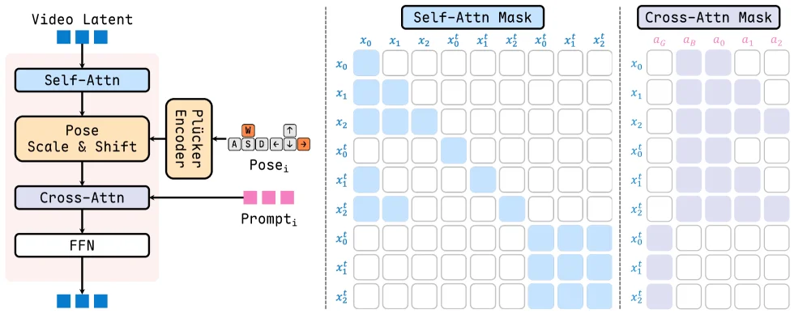
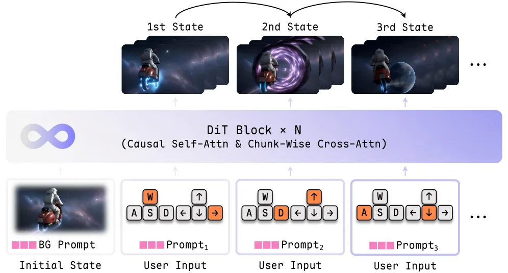
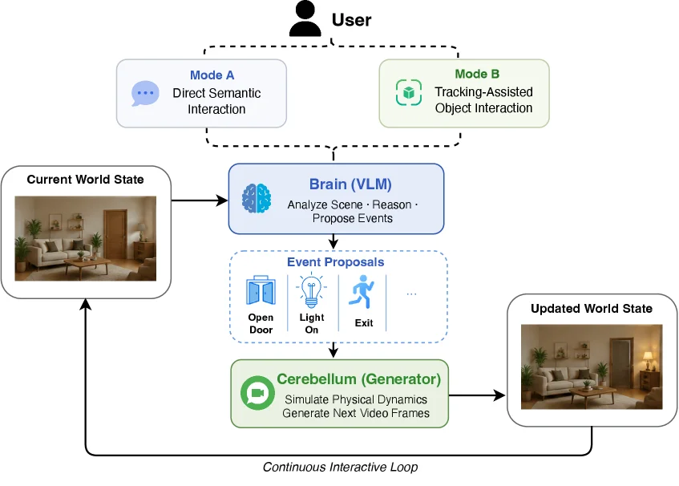
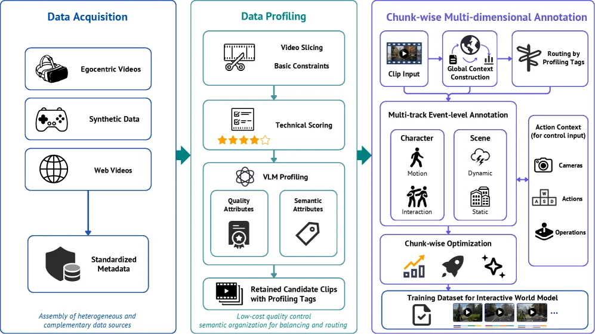
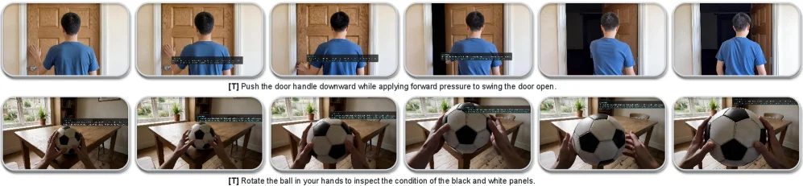

# Infinite Worlds with Versatile Interactions

[arXiv](https://arxiv.org/abs/2607.07534) · [HuggingFace](https://huggingface.co/papers/2607.07534) · ▲32

## 摘要（原文）

> We present LingBot-World 2.0 (also known as LingBot-World-Infinity), an advanced iteration of LingBot-World featuring four distinct upgrades. (1) Our model achieves an unbounded interaction horizon while maintaining consistent output quality, benefiting from a carefully crafted causal pretraining paradigm. (2) Through distilling a real-time variant from the base model, our system guarantees rapid response time, sufficient to drive 720p video streams at 60 fps. (3) Compared to the previous version, this update introduces highly diverse interactive elements, comprising a broader spectrum of actions (e.g., attacking, archery, spell-casting, and shooting) alongside a richer variety of text-driven events. (4) We pioneer the integration of an agentic harness within the domain of world modeling, wherein a pilot agent is tasked with planning and executing character behaviors, while a director agent is responsible for synthesizing novel environmental elements as the scene progresses. Additionally, to facilitate a shared experience, we develop an interface that permits multiple players to simultaneously immerse themselves in this vivid world simulator. We pair our primary 14B model with a lightweight 1.3B counterpart, which supports effortless deployment on a single GPU.

## 摘要（中译）

我们推出了LingBot-World 2.0（也称为LingBot-World-Infinity），这是LingBot-World的一个高级迭代版本，具有四个不同的升级。(1) 我们的模型在保持一致输出质量的同时实现了无界交互范围，这得益于精心设计的因果预训练范式。(2) 通过从基础模型中提炼实时变体，我们的系统保证了快速响应时间，足以驱动每秒60帧的720p视频流。(3) 与前一个版本相比，这次更新引入了高度多样化的交互元素，包括更广泛的行为（例如攻击、射箭、施法和射击）以及更丰富的文本驱动事件。(4) 我们在世界建模领域率先集成了一个代理控制装置，其中一个飞行员代理负责规划和执行角色行为，而导演代理负责在场景进展时合成新的环境元素。此外，为了促进共享体验，我们开发了一个接口，允许多个玩家同时沉浸在这个生动的世界模拟器中。我们将主要的14B模型与轻量级的1.3B对应模型配对，后者支持在单个GPU上轻松部署。

## 背景剖析

### 背景剖析  

**技术背景**  
交互式世界模型是一种能根据用户或智能体动作实时生成环境画面的技术，主要用于游戏开发、虚拟仿真等场景。例如，它可以创建一个玩家能自由探索、与环境互动的虚拟世界，或模拟现实中的物理规则（如重力、碰撞）来训练机器人。这类技术的核心需求是让虚拟世界“活起来”——既要有真实的视觉表现，又能对用户操作做出即时反馈，从而提供沉浸式体验。  

**之前的问题**  
尽管这类技术潜力巨大，但过去的方法存在两个关键缺陷：  
1. **长期稳定性不足**：由于每一帧画面都依赖前一轮的输出，错误会逐渐累积，导致画面失真（如纹理模糊、物体变形），通常只能维持几秒到几分钟的稳定，无法构建一个持久的世界。  
2. **高保真交互性差**：实时渲染细节丰富的画面并响应用户输入需要大量计算资源，因此早期系统往往牺牲分辨率或流畅度，导致交互体验粗糙（如仅支持缓慢的镜头移动）。  

**本文的解法**  
针对这些问题，本文提出了四项创新：  
1. **稳定的因果生成模型**：通过改进训练方法，让模型在长时间生成中保持画面质量，避免错误累积。  
2. **实时蒸馏技术**：将大模型压缩为轻量版本，以720p分辨率和60帧/秒的速度渲染动态场景，同时保证响应速度。  
3. **丰富的交互动作**：扩展了用户可执行的操作（如攻击、施法、射击），并支持动态环境变化（如天气调整）。  
4. **智能体协作框架**：引入“领航员”和“导演”两个智能体，前者控制角色行为，后者生成新内容，使世界能自主演化，而非预先脚本化。  

**切入角度**  
与以往工作不同，本文的关键突破在于将“稳定性”和“交互性”结合：通过因果生成模型解决长期漂移问题，再通过蒸馏技术实现实时性能。此外，智能体框架的引入让世界具备自主性，而非依赖人工设计剧情，这是其与前人研究的核心差异。

## 方法图解

> Figure 4 : Overview of LingBot-World-Infinity DiT Block and MoBA Attention Mask. The action comprises camera poses and chunk-wise prompts, injected into the DiT block to enable user interaction. For self-attention, a bidirectional block is appended to teacher forcing mask, enabling autoregressive generation while preserving visual fidelity. For cross-attention, the autoregressive component attends to a background prompt and chunk-wise prompts of lower-triangular pattern to prevent access to future information, while the bidirectional component attends to a global prompt.

这张图展示了LingBot-World-Infinity模型中的DiT（Diffusion Transformer）块以及MoBA（可能是指某种注意力机制）注意力掩码的概述。我们先来看左侧的DiT块部分：

首先，最上方是“Video Latent”（视频潜在表示），它作为输入进入DiT块。接下来是“Self-Attn”（自注意力）模块，这里使用了双向块并附加了教师强制掩码，这样可以在自回归生成的同时保持视觉保真度。然后是“Pose Scale & Shift”（姿态缩放和平移）模块，它处理动作相关的信息，这里的动作包括相机姿态和分块的提示（prompt）。之后是“Plucker Encoder”（普吕克编码器），它将姿态信息编码为适合后续处理的格式，输出为“Pose_i”（第i个姿态）。

接下来是“Cross-Attn”（交叉注意力）模块，这里的自回归组件会关注背景提示和分块提示的低三角模式，以防止访问未来信息，而双向组件则会关注全局提示。同时，“Prompt_i”（第i个提示）被注入到交叉注意力模块中，以启用用户交互。最后是“FFN”（前馈神经网络），它对经过注意力处理的信息进行进一步处理，然后输出处理后的“Video Latent”。

再看右侧的两个注意力掩码部分：

第一个是“Self-Attn Mask”（自注意力掩码），它展示了不同元素（如x₀、x₁、x₂、x₀^f、x₁^f、x₂^f等）之间的注意力关系。蓝色填充的单元格表示允许的注意力连接，这样可以确保自回归生成的同时保留视觉保真度。例如，x₀可以关注x₀、x₁、x₂，而x₀^f可以关注x₀^f、x₁^f、x₂^f等，这种模式有助于在生成过程中利用历史信息。

第二个是“Cross-Attn Mask”（交叉注意力掩码），它展示了不同元素（如a_G、a_B、a₀、a₁、a₂等）之间的注意力关系。紫色填充的单元格表示允许的注意力连接，这里的自回归组件关注背景提示和分块提示的低三角模式，以防止访问未来信息，而双向组件关注全局提示。例如，a₀可以关注a_G、a_B、a₀、a₁，而a₁^f可以关注a_G、a_B、a₀、a₁、a₂^f等，这种模式有助于在交叉注意力中正确地利用提示信息。

总体来说，这个DiT块通过自注意力和交叉注意力机制，结合姿态编码和提示注入，实现了用户交互和自回归生成，同时通过注意力掩码确保了信息的正确流动和未来信息的防止访问，从而实现了无界交互地平线和高输出质量。

---

> Figure 3 : Overview of LingBot-World-Infinity Pipeline. An interactive world simulator is implemented as a causal video model. Our Infinity World is initialized from an initial image and its background description. The future world states are then autoregressively generated, conditioned on the historical context and user inputs (camera poses and prompts).

这张图展示了LingBot-World-Infinity的管道概述，它实现了一个交互式世界模拟器，作为一个因果视频模型。以下是对图中各个组件和信息流动的详细解释：

1. **初始状态（Initial State）**：
   - 左下角的图像显示了一个初始场景，包含一个角色（骑着摩托车的人物）和背景。
   - 下方的“BG Prompt”（背景提示）表示用于描述背景的文本输入，这为模型的生成提供了初始的背景信息。

2. **用户输入（User Input）**：
   - 图中有多个“User Input”模块，每个模块包含一个键盘布局和一个“Prompt”（提示）。
   - 键盘布局中的按键（如W、A、S、D、箭头等）表示用户的操作，例如移动、攻击、转向等。
   - 每个“Prompt”（如Prompt₁、Prompt₂、Prompt₃）是用户提供的文本输入，用于描述期望的事件或动作，例如“攻击敌人”、“施放魔法”等。

3. **DiT Block × N（因果自注意力和块交叉注意力）**：
   - 中间的紫色区域表示模型的核心部分，即多个DiT（Diffusion Transformer）块的堆叠。
   - 这些块使用因果自注意力（Causal Self-Attn）和块交叉注意力（Chunk-Wise Cross-Attn）来处理历史上下文和用户输入，以生成未来的世界状态。
   - 因果自注意力确保生成的过程是自回归的，即未来的状态依赖于过去的事件。

4. **未来世界状态（1st State, 2nd State, 3rd State, ...）**：
   - 图的上半部分显示了多个未来世界状态的图像，每个状态对应于不同的时间步。
   - 这些状态是根据初始状态、用户输入和模型的处理结果自回归生成的。
   - 箭头表示信息的流动方向，从初始状态和用户输入经过DiT块处理后生成未来的世界状态。

5. **无限循环（∞符号）**：
   - 左侧的∞符号表示这个过程是无限的，即模型可以持续生成未来的世界状态，而不需要重新开始。

总体来说，这张图展示了LingBot-World-Infinity的工作流程：从初始图像和背景描述开始，通过用户输入（操作和文本提示）驱动，利用因果视频模型（DiT块）自回归生成未来的世界状态，从而实现一个无限交互的世界模拟器。这个过程确保了输出质量的一致性，并且可以实时响应用户输入，支持720p视频流以60帧每秒的速度运行。

---

> Figure 5 : Overview of the Agentic Interaction Harness. Users can either interact with the existing world through semantic or object-centric actions, or intervene by introducing high-level textual events. The VLM (Director) performs causal reasoning and proposes coherent event updates, while the Video Generator (Pilot) grounds these semantic decisions into physically consistent video rollouts, enabling continuous interactive world simulation.

这张图展示了“代理交互框架（Agentic Interaction Harness）”的整体架构，它清晰地描绘了一个交互式世界模拟系统的工作流程。我们可以从左到右、从上到下逐步解析图中的各个组件及其信息流动：

首先，在图的最上方是“用户（User）”，用户通过两种模式与系统交互：
1.  **模式A（Mode A: Direct Semantic Interaction）**：这是一种直接的语义交互方式，用户可以通过文本输入等方式直接表达意图或发出指令。
2.  **模式B（Mode B: Tracking-Assisted Object Interaction）**：这是一种基于跟踪的物体交互方式，用户可能通过选择场景中的特定物体，然后对其执行操作（如移动、旋转等）。

这两种交互模式的输出都会流向中心的“大脑（Brain (VLM)）”模块。这个“大脑”模块被标注为VLM（视觉语言模型），其主要功能是“分析场景（Analyze Scene）、推理（Reason）、提出事件（Propose Events）”。这意味着它会接收当前的“世界状态（Current World State）”信息（如图左侧所示，是一个客厅的图像），并结合用户的交互指令，进行理解和推理，从而生成一系列可能的“事件提案（Event Proposals）”。

接下来，“事件提案（Event Proposals）”部分展示了一些具体的例子，如“开门（Open Door）”、“开灯（Light On）”、“退出（Exit）”等。这些提案代表了系统根据用户输入和当前场景分析后，认为可能发生的合理行为或事件。

然后，这些“事件提案”会传递给下方的“小脑（Cerebellum (Generator)）”模块。这个“小脑”模块被标注为“生成器（Generator）”，其任务是“模拟物理动态（Simulate Physical Dynamics）、生成下一视频帧（Generate Next Video Frames）”。它负责将抽象的事件提案转化为具体的、符合物理规律的视觉表现。例如，如果事件提案是“开门”，那么这个模块会生成一个门被打开的动画帧。

最终，由“小脑”生成的新的视觉内容会形成“更新后的世界状态（Updated World State）”（如图右侧所示，可能是门被打开后的客厅图像）。这个“更新后的世界状态”又会反馈回系统的输入端，成为下一次交互循环的“当前世界状态”，从而形成一个“连续交互循环（Continuous Interactive Loop）”。

总结来说，这个系统的工作流程是：用户通过语义或物体交互模式输入指令 -> VLM（大脑）分析当前世界状态并结合用户指令进行推理，提出可能的事件 -> 生成器（小脑）根据这些事件提案，模拟物理动态并生成新的视频帧，更新世界状态 -> 更新后的世界状态再次作为输入，开始下一轮交互。这个框架使得用户能够持续地与一个虚拟世界进行互动，并且每次互动都能得到视觉上的反馈。

图中还暗示了两个核心角色：VLM作为“导演（Director）”，负责因果推理和提出连贯的事件更新；而视频生成器作为“飞行员（Pilot）”，负责将这些语义决策落地为物理上一致的视屏滚动（即视频帧序列）。这种分工协作使得系统能够实现连贯的交互式世界模拟。

---

> Figure 2 : Overview of the proposed data engine. Heterogeneous raw videos are temporally segmented, filtered, and routed to category-specific annotation pipelines, producing optimized chunk-wise captions.

这张图展示了论文中提出的**数据引擎（Data Engine）**的整体架构，它描述了从原始数据收集到最终生成训练数据集的完整流程。我们可以将其分为三个主要阶段：数据获取（Data Acquisition）、数据剖析（Data Profiling）和分块式多维标注（Chunk-wise Multi-dimensional Annotation）。

首先，在最左侧的**数据获取（Data Acquisition）**阶段，系统收集了三种不同类型的异构视频数据源：
1.  **Egocentric Videos（第一人称视角视频）**：通常指从佩戴者视角拍摄的视频，如VR设备拍摄的内容。
2.  **Synthetic Data（合成数据）**：通过计算机生成的虚拟数据，例如游戏引擎生成的视频。
3.  **Web Videos（网络视频）**：从互联网上获取的公开视频。
这些不同来源的数据被整合到一个名为**Standardized Metadata（标准化元数据）**的模块中，这一步骤的目的是对异构且互补的数据源进行统一和预处理，为后续处理做准备。

接下来，数据流向中间的**数据剖析（Data Profiling）**阶段。这个阶段的目标是对视频数据进行评估、筛选和组织：
1.  **Video Slicing（视频切片）**：首先，原始视频会根据一些**Basic Constraints（基本约束条件）**进行时间上的分割，形成较短的片段（clips）。这一步是为了将长视频分解成更易处理和分析的单元。
2.  **Technical Scoring（技术评分）**：对切片后的视频片段进行技术质量评估，图中用星级（例如四星半）来表示评分结果。这有助于筛选出质量较高的片段。
3.  **VLM Profiling（视觉语言模型剖析）**：这一步对视频片段进行更深入的分析，提取其**Quality Attributes（质量属性）**和**Semantic Attributes（语义属性）**。质量属性可能涉及分辨率、清晰度等，而语义属性则关注视频内容的语义信息，如场景、动作等。
经过上述剖析后，系统会得到**Retained Candidate Clips with Profiling Tags（保留的带剖析标签的候选片段）**。这些片段是根据剖析结果筛选出来的，并附带有描述其特性的标签，为后续的标注工作做好准备。这一阶段的整体目标是实现“低成本质量控制”和“用于平衡和路由的语义组织”。

最后，数据进入最右侧的**分块式多维标注（Chunk-wise Multi-dimensional Annotation）**阶段，这是生成最终训练数据的关键步骤：
1.  **Clip Input（片段输入）**：从上一个阶段获得的候选视频片段作为输入。
2.  **Global Context Construction（全局上下文构建）**：系统会利用**Profiling Tags（剖析标签）**来构建每个视频片段的全局上下文信息，这有助于理解片段在更大范围内的意义。
3.  **Routing by Profiling Tags（基于剖析标签的路由）**：根据全局上下文和剖析标签，将视频片段路由到合适的标注管道。
4.  **Multi-track Event-level Annotation（多轨事件级标注）**：这是核心的标注环节，包含多个并行的标注轨道：
    *   **Character（角色）**：标注与角色相关的信息，如**Motion（动作）**（例如行走、攻击、施法等）和**Interaction（交互）**（例如与其他角色的互动）。
    *   **Scene（场景）**：标注与场景相关的信息，如**Dynamic（动态元素）**（例如移动的物体）和**Static（静态元素）**（例如建筑物、环境）。
    *   标注过程中可能会参考**Action Context (for control input)（动作上下文，用于控制输入）**，例如来自**Cameras（摄像机）**的视角信息、**Actions（动作）**指令（如WASD键）和**Operations（操作）**。
5.  **Chunk-wise Optimization（分块式优化）**：对标注后的片段进行优化，以提高数据质量和一致性。图中用图表、火箭和星星等图标表示优化过程可能涉及性能提升、效率改进等。
经过这些步骤后，最终生成**Training Dataset for Interactive World Model（交互世界模型的训练数据集）**。这个数据集包含了经过精心处理的视频片段及其详细的多维标注，可以用于训练能够进行复杂交互的AI模型（如论文中提到的LingBot-World 2.0）。

总结来说，这张图揭示了该方法的具体运作方式：它首先从多种来源收集原始视频数据，然后对这些数据进行自动化的剖析和筛选，最后通过多轨、多维度的精细标注生成高质量的训练数据集。整个流程旨在处理异构数据，确保数据质量，并为复杂的交互式世界模型提供有效的训练素材。数据按照从左到右的顺序流动，每个阶段都对数据进行特定的处理，以逐步提升其质量和可用性，最终服务于训练目标。

---

> Figure 6 : In the tracking-mode interface, the Vision-Language Model (VLM) comprehends interactive objects within the scene, while the tracking model continuously tracks these targets to display dynamic interactive floating windows (event cards) in real-time. Powered by the "Director-Pilot" co-simulation framework, the model demonstrates robust interactive capabilities by performing causal reasoning based on user actions (e.g., pushing a door open or rotating a soccer ball) and rendering physically logical, highly coherent spatio-temporal dynamics.

这张图（图6）来自论文《Infinite Worlds with Versatile Interactions》，旨在展示其提出的LingBot-World 2.0（或LingBot-World-Infinity）系统中的“跟踪模式界面”（tracking-mode interface）及其核心功能。

我们可以将图分为上下两个主要部分，每部分都展示了一个具体的交互示例，以说明系统的运作方式：

**上半部分：开门交互示例**
这部分由一系列连续的图像帧组成，展示了一个用户与门的交互过程。
1.  **场景与对象**：图像显示一个人站在一扇木门前。门是主要的交互对象。
2.  **交互动作**：从左到右的图像序列展示了用户执行“向下推门把手并向前施力以打开门”的动作。
    *   第一张图：用户的手接近门把手。
    *   后续几张图：用户的动作逐渐清晰，手握住门把手并施加力量。
3.  **浮动窗口（事件卡）**：在某些图像帧中（特别是中间几帧），可以看到一个黑色的浮动窗口（事件卡）出现在门把手附近。这个窗口是系统的关键输出，它由视觉-语言模型（VLM）理解场景中的交互对象后生成，并由跟踪模型持续跟踪目标对象以实时显示。
4.  **文本描述**：在这一部分的下方，有一行文本：“[T] Push the door handle downward while applying forward pressure to swing the door open.” 这行文本描述了正在执行的动作，也可能是系统对用户意图的理解或对交互事件的总结。
5.  **信息流动与推理**：用户执行动作 -> VLM识别门和门把手 -> 跟踪模型跟踪这些目标 -> 系统生成并显示与该交互相关的浮动窗口（事件卡） -> 系统基于用户动作进行因果推理，并渲染出物理上合理、高度连贯的时空动态（即门被打开）。

**下半部分：旋转足球交互示例**
这部分同样由一系列连续的图像帧组成，展示了一个用户与足球的交互过程。
1.  **场景与对象**：图像显示一双手正在操作一个足球，背景是一个室内环境（如桌子）。
2.  **交互动作**：从左到右的图像序列展示了用户执行“在手中旋转球以检查黑白面板状况”的动作。
    *   第一张图：手开始接触足球。
    *   后续几张图：手部动作显示足球正在被旋转。
3.  **浮动窗口（事件卡）**：与上半部分类似，在某些图像帧中可以看到一个黑色的浮动窗口（事件卡）出现在足球附近。这个窗口同样是系统输出的，用于显示与当前交互相关的信息。
4.  **文本描述**：在这一部分的下方，有一行文本：“[T] Rotate the ball in your hands to inspect the condition of the black and white panels.” 这行文本描述了正在执行的动作，也可能是系统对用户意图的理解或对交互事件的总结。
5.  **信息流动与推理**：用户执行动作 -> VLM识别足球 -> 跟踪模型跟踪足球 -> 系统生成并显示与该交互相关的浮动窗口（事件卡） -> 系统基于用户动作进行因果推理，并渲染出物理上合理、高度连贯的时空动态（即足球被旋转，用户检查其状况）。

**方法运作的具体揭示**：
这张图清晰地展示了LingBot-World 2.0系统如何通过“Director-Pilot”协同仿真框架实现强大的交互能力：
*   **视觉-语言模型（VLM）的角色**：VLM负责理解场景中的交互对象（如门、门把手、足球）。这是系统能够生成相关交互信息和进行后续推理的基础。
*   **跟踪模型的角色**：跟踪模型负责持续跟踪这些交互对象。这使得系统能够实时更新并显示与目标对象相关的动态交互浮动窗口（事件卡）。
*   **因果推理与动态渲染**：系统能够根据用户的动作（如推门、转球）进行因果推理。这意味着系统理解用户动作的目的和后果，并据此渲染出符合物理逻辑且高度连贯的时空动态。例如，当用户推门时，门会打开；当用户转球时，球的视角会改变，显示出不同的面板。
*   **“Director-Pilot”协同仿真框架**：虽然图中没有直接显示两个代理，但文字说明指出，该系统得益于这个框架。可以理解为，“Pilot”代理负责规划和执行角色行为（如图中的用户动作），而“Director”代理负责合成新的环境元素（尽管在这个具体示例中，环境元素相对静态，但系统具备这种能力）。
*   **实时性与连贯性**：图中的连续帧展示了交互的动态过程，表明系统能够实时处理和响应用户动作，渲染出连贯的视觉效果。

**结论**：
这张图通过两个具体的交互示例（开门和旋转足球），直观地展示了LingBot-World 2.0系统中跟踪模式界面的工作原理。它揭示了系统如何利用VLM理解交互对象，通过跟踪模型实时跟踪这些对象，并基于用户动作进行因果推理，从而渲染出物理上合理、高度连贯的动态交互。这种方法使得系统能够实现无界的交互地平线，并保持一致的输出质量。
