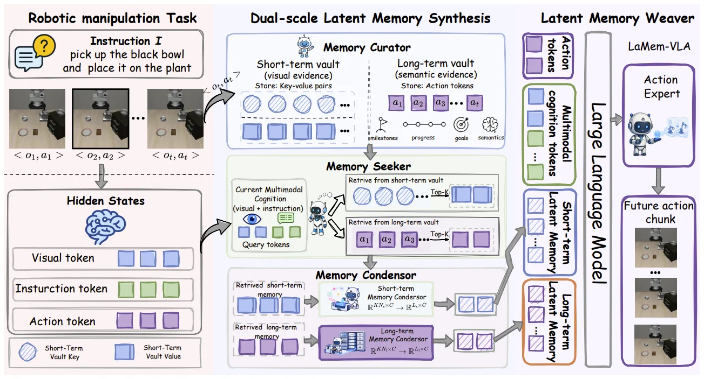
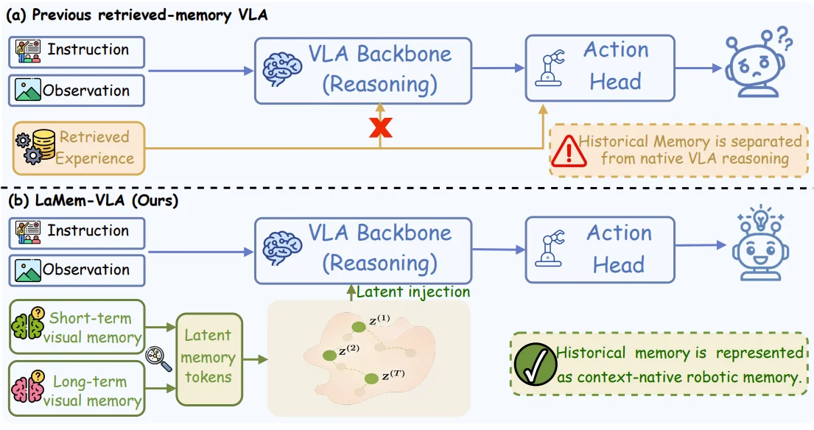

# Dual Latent Memory in Vision-Language-Action Models for Robotic Manipulation

[arXiv](https://arxiv.org/abs/2607.07608) · [HuggingFace](https://huggingface.co/papers/2607.07608) · ▲51

## Abstract (verbatim)

> Mainstream Vision-Language-Action (VLA) models predict actions primarily from the current observation under a Markovian assumption, thus struggling with long-horizon, temporally dependent tasks. Existing memory-augmented VLAs either expand the observation window or retrieve history from the memory bank as auxiliary policy-side context. However, they leave memory outside the native latent embedding space of VLA reasoning, preventing historical experience from being fluidly interleaved with multimodal reasoning and action formation. To this end, we introduce LaMem-VLA, a latent-memory-native framework that reconstructs historical experience into latent memory tokens and directly interweaves them with VLA reasoning. At its core, LaMem-VLA introduces four coordinated components: (i) a curator that organizes historical experience into two complementary short-term and long-term memory vaults; (ii) a seeker that queries both vaults using the multimodal cognition to retrieve context-relevant evidence; (iii) a condenser that reconstructs the retrieved evidence into compact short-term and long-term latent memory tokens; and (iv) a weaver that injects these memory tokens with the current observation and instruction into one continuous embedding sequence. By representing, retrieving, and consuming historical experience entirely in the same continuous latent space, LaMem-VLA enables memory to directly participate in VLA reasoning and guide action generation under a bounded context. Extensive experiments on SimplerEnv and LIBERO demonstrate the superiority of our LaMem-VLA.

## Background

### Background Analysis  

**1. Technical Context and Real-World Needs**  
Vision-Language-Action (VLA) models are a core technology in robotic manipulation, enabling robots to perform complex tasks (e.g., assembly, object rearrangement) by understanding visual scenes and language instructions. A key challenge is **long-horizon task capability**—for example, a robot needs to remember completed steps (e.g., "picking an apple") and plan subsequent actions (e.g., "opening the fridge") in a multi-step task like "putting an apple in the fridge." However, most existing VLA models assume current observations alone suffice to predict actions (Markovian assumption), struggling with tasks requiring **history-dependent reasoning**.  

**2. Limitations of Previous Approaches**  
Prior improvements introduced memory mechanisms in two ways:  
- **Short-term window extension**: Concatenating historical frames or extending input sequences, but computational costs grow with window size, and long dependencies beyond the window are ignored.  
- **External memory banks**: Retrieving historical trajectories or tokens from external storage, but these remain decoupled from the model’s internal reasoning, preventing seamless interaction between history and current perception/language understanding.  
The core issue is the **disconnect between memory and reasoning**: Historical experience is not integrated into the model’s native embedding space, limiting its ability to participate in visual-language-action reasoning.  

**3. Proposed Solution**  
LaMem-VLA introduces a **native latent memory framework** to embed historical experience directly into the model’s reasoning process. Key components include:  
- **Dual-scale memory vaults**: Short-term memory stores visual details (e.g., object positions), while long-term memory preserves semantic context (e.g., task progress).  
- **Unified embedding space**: Retrieved history is compressed into tokens compatible with the model’s native embedding, allowing joint reasoning with current observations and instructions.  
- **Dynamic retrieval and weaving**: The model queries relevant history based on the current state and "weaves" memory tokens into the reasoning sequence, directly influencing action generation.  

**4. Key Differences from Prior Work**  
Unlike previous methods, LaMem-VLA’s innovation lies in **memory’s endogenous nature**:  
- Historical memory is no longer an external auxiliary context but integrated into the same embedding space as visual-language reasoning, enabling end-to-end fusion of perception, understanding, memory, and action.  
- Dual-scale memory supports both visually grounded short-term details and semantically rich long-term context, addressing limitations of single-memory mechanisms.  
This design allows robots to "recall relevant experience" to guide complex tasks, rather than reacting solely to current observations.

## Method, Figure by Figure

> Figure 2: The Framework of LaMem-VLA . Given an instruction and the current observation, the vision–language encoder first encodes the inputs into a multimodal representation. The memory curator (§ 3.3 ) organizes historical experience into dual memory vaults, and the memory seeker (§ 3.4 ) then retrieves task-relevant evidence from dual memory vaults based on this multimodal representation. This retrieved evidence is compressed into fixed-length latent memory tokens by the memory condenser (§ 3.4 ). Finally, the memory weaver (§ 3.5 ) injects these latent memory tokens into the reasoning sequence, producing memory-grounded action tokens that guide the action expert to generate future action chunks.

This figure illustrates the framework of LaMem - VLA (a Vision - Language - Action model for robotic manipulation). We can understand the role of each component and the method's operation by following the data flow from left to right:

First, look at the "Robotic manipulation Task" section on the far left: There is an instruction \( I \) (e.g., "pick up the black bowl and place it on the plant") and a series of observation - action pairs \( <o_1,a_1>, <o_2,a_2>, \dots, <o_t,a_t> \), which constitute the historical experience and current task input of the robot manipulation task. Then, these inputs will be processed into three types of tokens in the "Hidden States": visual tokens (blue squares), instruction tokens (green squares), and action tokens (purple squares). Among them, the visual tokens correspond to the keys of the short - term memory vault (Short - Term Vault Key, blue squares with slashes), and action tokens and others correspond to the values of the short - term memory vault (Short - Term Vault Value, solid blue squares).

Next is the "Dual - scale Latent Memory Synthesis" section in the middle, which contains three sub - components:
1. **Memory Curator**: Its role is to organize historical experience into two complementary memory vaults. One is the "Short - term vault (visual evidence)" (short - term vault, visual evidence), which stores key - value pairs (Key - value pairs). The key is a blue square with slashes (corresponding to the visual token), and the value is a solid blue square; the other is the "Long - term vault (semantic evidence)" (long - term vault, semantic evidence), which stores action tokens (\( a_1, a_2, \dots, a_t \)), and there are also auxiliary symbols such as milestones, progress, goals, and semantics to represent the semantic information of long - term memory.
2. **Memory Seeker**: It retrieves relevant evidence from the two vaults based on the current "Multimodal Cognition (visual + instruction)" (multimodal cognition, i.e., the combination of vision and instruction). First, it generates "Query tokens" (query tokens, composed of eyes, green squares, etc., representing the current visual and instruction information), and then uses this query token to retrieve from the short - term vault and the long - term vault respectively. When retrieving from the short - term vault, it will get the "Top - k" relevant key - value pairs (blue squares with slashes and solid blue squares); when retrieving from the long - term vault, it will get the "Top - k" relevant action tokens (part of \( a_1, a_2, \dots, a_t \)).
3. **Memory Condensor**: It compresses the retrieved evidence into fixed - length latent memory tokens. For the retrieved short - term memory, it is compressed through the "Short - term Memory Condensor" (short - term memory compressor, with the function \( \mathbb{R}^{KN\times C} \to \mathbb{R}^{L\times C} \)); for the retrieved long - term memory, it is compressed through the "Long - term Memory Condensor" (long - term memory compressor, with the same function), and the compressed short - term and long - term latent memory tokens (squared with slashes and solid squares) are obtained.

Then, look at the "Latent Memory Weaver" section on the far right: The "Large Language Model" here will receive the latent memory tokens (short - term and long - term, represented by orange and purple boxes respectively) from the memory compressor, the current multimodal tokens (including visual, instruction, cognition, etc., represented by squares of different colors), and action tokens (purple squares), and then interweave these tokens into a continuous embedding sequence. This sequence will be processed by the "Action Expert", and finally, the "Future action chunk" (future action block, i.e., a series of observation - action pairs, such as \( <o_1,a_1>, \dots > \)) will be generated.

The operation process of the entire method is as follows: First, the instruction and historical observation - action pairs of the robot manipulation task are encoded into a multimodal representation (visual, instruction, action tokens); then, the memory manager organizes these historical experiences into the short - term (visual evidence) and long - term (semantic evidence) memory vaults; next, the memory seeker retrieves relevant evidence from these two vaults according to the current multimodal cognition; after that, the memory compressor compresses the retrieved evidence into fixed - length latent memory tokens; finally, the memory weaver interweaves these latent memory tokens with the current multimodal tokens and action tokens, and inputs them into the action expert to generate future action blocks. In this way, historical experience is fully integrated into the continuous latent space of VLA reasoning, enabling memory to directly participate in reasoning and guide action generation, solving the deficiencies of existing models in long - horizon and time - dependent tasks.

In summary, LaMem - VLA, through four coordinated components (manager, seeker, compressor, weaver), reconstructs historical experience into latent memory tokens and directly interweaves them with VLA reasoning, so as to achieve memory - based action generation under limited context.

---

> Figure 1: Paradigm comparison of memory-augmented VLA Models. (a) Unlike previous VLA models that store historical experience in an auxiliary memory bank and consume retrieved memory as external policy-side context, (b) LaMem-VLA treats historical experience as context-native latent memory, which is stored, retrieved, and consumed in the model embedding space.

This figure (Figure 1) compares two paradigms of Memory-Augmented Vision-Language-Action (VLA) models: (a) a previous retrieved-memory VLA model, and (b) the proposed LaMem-VLA model. It clearly illustrates the fundamental differences in how historical experience (memory) is handled in relation to current task reasoning and action generation between the two approaches.

First, let's examine part (a), titled "Previous retrieved-memory VLA":
- The data flow is from left to right. On the far left are two input sources: "Instruction" (as depicted by an icon, possibly a text or task description) and "Observation" (as depicted by an icon, possibly an image or sensor data). These two inputs jointly feed into the "VLA Backbone (Reasoning)" module (the VLA backbone network responsible for reasoning).
- Additionally, there is a separate "Retrieved Experience" module, which connects via an orange arrow to the "Action Head" (action generation module). This orange arrow has a red "X" mark, and there is a warning sign with the text "Historical Memory is separated from native VLA reasoning." This means that in this approach, historical experience is not directly integrated into the VLA's core reasoning process but is instead used as external auxiliary information, provided to the action generation module after or in parallel with the reasoning.
- The output of the "VLA Backbone (Reasoning)" flows to the "Action Head," ultimately producing an action (represented by the confused-looking robot icon on the right, suggesting this method might be less effective or have issues).
- In summary, this method stores historical experience in an external memory bank and retrieves it as external policy-side context, which is separate from the VLA's core reasoning process.

Now, let's look at part (b), titled "LaMem-VLA (Ours)":
- The data flow is also from left to right. The input sources on the far left are also "Instruction" and "Observation," which feed into the "VLA Backbone (Reasoning)" module.
- The key difference lies in how historical experience is handled. Here, there are two new modules: "Short-term visual memory" (as depicted by an icon, possibly representing recent perceptions) and "Long-term visual memory" (as depicted by an icon, possibly representing past experiences). The outputs of these two memory modules flow to a "Latent memory tokens" module.
- The output of the "Latent memory tokens" module, through a green arrow labeled "Latent injection," is directly injected into the "VLA Backbone (Reasoning)" module. The figure also shows an example where several latent tokens (z^(1), z^(2), ..., z^(n)) are injected into a continuous embedding sequence (represented by the light brown area with green dots).
- The output of the "VLA Backbone (Reasoning)" flows to the "Action Head," ultimately producing an action (represented by the happy-looking robot icon with a lightbulb on the right, suggesting this method is more effective or intelligent).
- The text on the right states: "Historical memory is represented as context-native robotic memory." This means that in LaMem-VLA, historical experience is reconstructed into latent memory tokens and directly interwoven into the VLA's reasoning process, sharing the same continuous latent space.
- In summary, LaMem-VLA's approach is: historical experience is organized into short-term and long-term visual memories, then these memories are reconstructed into compact latent memory tokens, and these tokens, along with the current observation and instruction, are injected into the VLA backbone for reasoning.

This figure reveals how the LaMem-VLA method works:
1.  **Memory Organization**: A "curator" organizes historical experience into complementary short-term and long-term visual memory banks.
2.  **Memory Retrieval**: A "seeker" queries these two memory banks using multimodal cognition (current instruction and observation) to retrieve context-relevant evidence.
3.  **Memory Condensation**: A "condenser" reconstructs the retrieved evidence into compact short-term and long-term latent memory tokens.
4.  **Memory Injection**: A "weaver" injects these latent memory tokens, along with the current observation and instruction, into a continuous embedding sequence for the VLA backbone to reason on.
In this way, LaMem-VLA enables historical experience to be represented, retrieved, and consumed within the same continuous latent space, allowing memory to directly participate in VLA reasoning and guide action generation within a bounded context.

The arrows in the figure indicate the direction of data and information flow. For example, in (a), the instruction and observation flow to the VLA backbone, while the retrieved experience independently flows to the action head. In (b), the instruction and observation flow to the VLA backbone, and simultaneously, latent memory tokens generated from short-term and long-term visual memories are also injected into the VLA backbone.
