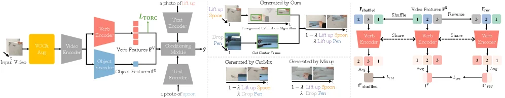
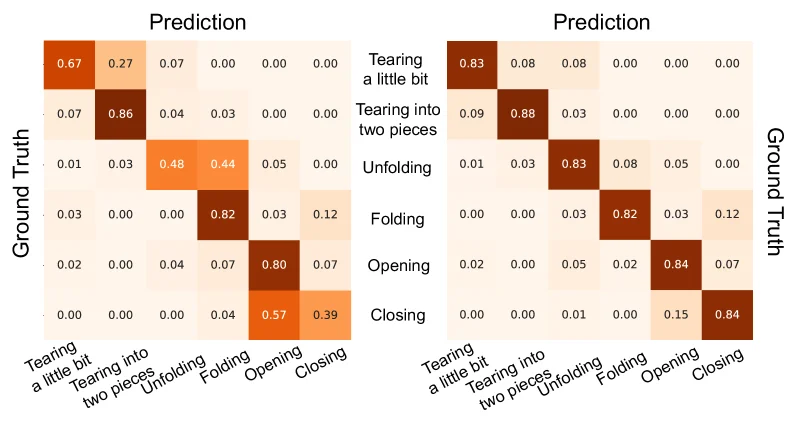
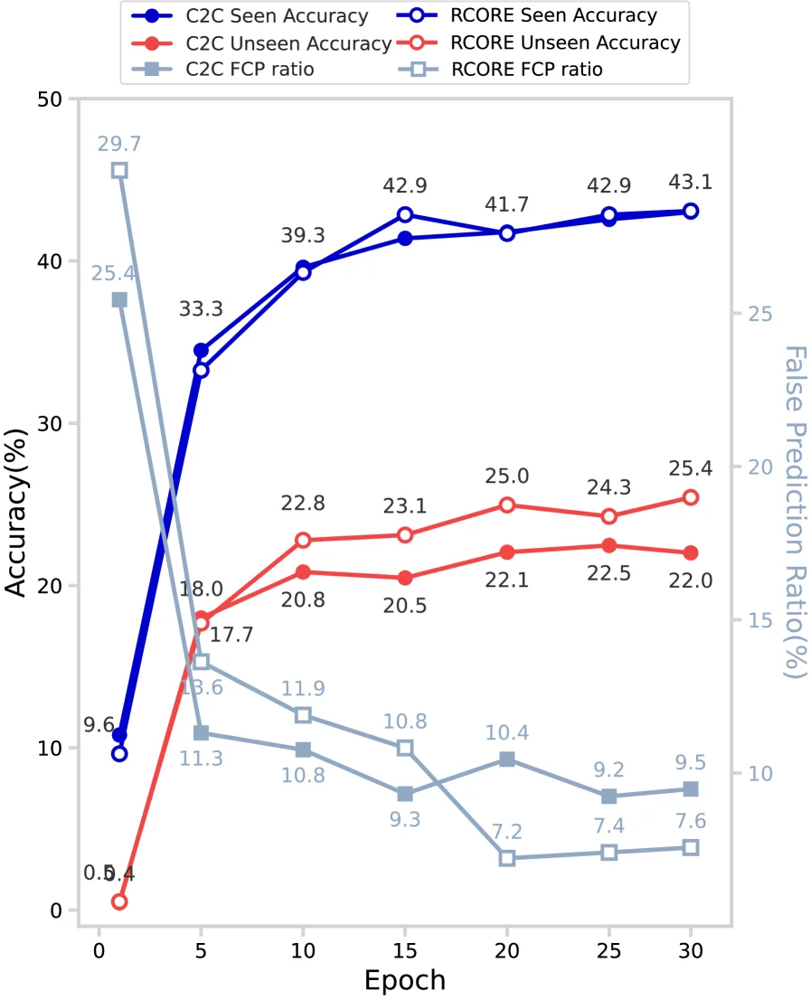
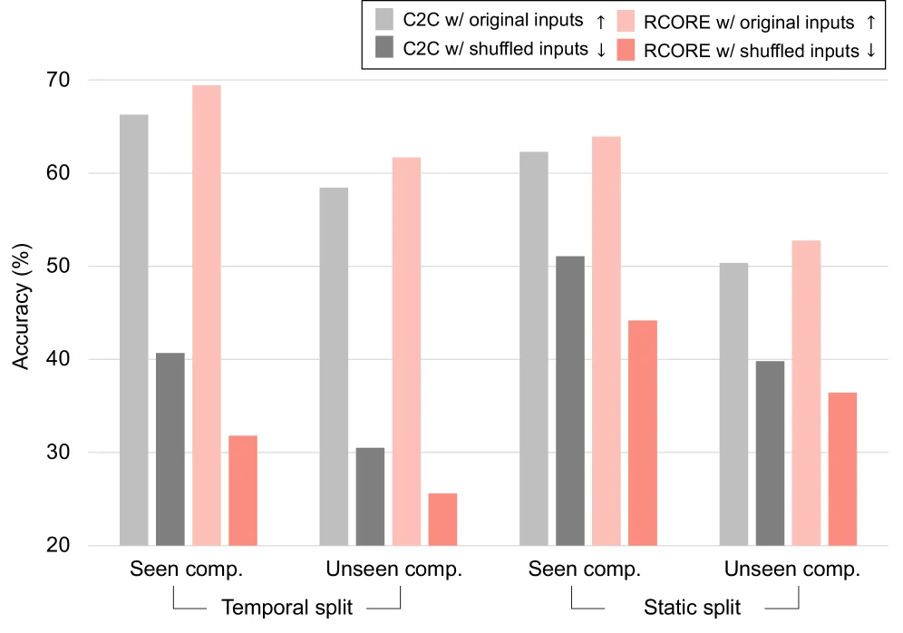

# Why Can't I Open My Drawer? Mitigating Object-Driven Shortcuts in Zero-Shot Compositional Action Recognition

[arXiv](https://arxiv.org/abs/2601.16211) · [HuggingFace](https://huggingface.co/papers/2601.16211) · ▲48

## 摘要（原文）

> Zero-Shot Compositional Action Recognition (ZS-CAR) requires recognizing novel verb-object combinations composed of previously observed primitives. In this work, we tackle a key failure mode: models predict verbs via object-driven shortcuts (i.e., relying on the labeled object class) rather than temporal evidence. We argue that sparse compositional supervision and verb-object learning asymmetry can promote object-driven shortcut learning. Our analysis with proposed diagnostic metrics shows that existing methods overfit to training co-occurrence patterns and underuse temporal verb cues, resulting in weak generalization to unseen compositions. To address object-driven shortcuts, we propose Robust COmpositional REpresentations (RCORE) with two components. Co-occurrence Prior Regularization (CPR) adds explicit supervision for unseen compositions and regularizes the model against frequent co-occurrence priors by treating them as hard negatives. Temporal Order Regularization for Composition (TORC) enforces temporal-order sensitivity to learn temporally grounded verb representations. Across Sth-com and EK100-com, RCORE reduces shortcut diagnostics and consequently improves compositional generalization.

## 摘要（中译）

零样本组合动作识别（Zero - Shot Compositional Action Recognition，ZS - CAR）要求识别由先前观察到的基本元素组成的新的动宾组合。在这项工作中，我们解决了一个关键的失败模式：模型通过对象驱动的快捷方式（即依赖于标记的对象类别）而不是时间证据来预测动词。我们认为，稀疏的组合监督和动宾学习不对称性会促进对象驱动的快捷方式学习。我们使用提出的诊断指标进行的分析表明，现有方法过度拟合训练共现模式，并且对时间动词线索利用不足，导致对未见过的组合的泛化能力较弱。为了解决对象驱动的快捷方式问题，我们提出了具有两个组件的鲁棒组合表示（Robust COmpositional REpresentations，RCORE）。共现先验正则化（Co - occurrence Prior Regularization，CPR）为未见过的组合添加显式监督，并通过对它们进行硬负样本处理来规范模型，使其不受频繁共现先验的影响。组合的时间顺序正则化（Temporal Order Regularization for Composition，TORC）强制对时间顺序敏感，以学习基于时间的动词表示。在Sth - com和EK100 - com上，RCORE减少了快捷方式诊断，从而提高了组合泛化能力。

## 背景剖析

### 背景剖析  

**1. 技术背景**  
视频理解技术需要识别人类动作的两个核心要素：**动词**（如“打开”）和**物体**（如“抽屉”），并通过组合这些要素理解复杂行为（例如“打开抽屉”）。这类技术在智能助手、机器人交互等领域有实际需求——比如让AI系统根据视频指令执行“拿起杯子喝水”这样的组合动作。然而，现有方法在面对**未见过的动词-物体组合**（如训练中见过“打开门”但未见过“打开抽屉”）时表现不佳，这限制了技术的泛化能力。  

**2. 之前的问题**  
先前方法的缺陷源于两个关键问题：  
- **数据稀疏性**：训练数据中动词-物体组合的覆盖范围极低（例如某些数据集仅标注了1%的可能组合），导致模型过度依赖“物体出现频率”来预测动词（例如看到“抽屉”就默认是“打开”，而忽略动作的时间线索）。  
- **学习不对称性**：物体可通过单帧图像识别（静态信息），而动词需要多帧时序推理（动态信息）。这种不平衡使模型倾向于走“捷径”——直接通过物体标签预测动词，而非学习动作的时间逻辑。  

**3. 本文的解法**  
论文提出**RCORE框架**，通过两种机制解决上述问题：  
- **组合感知增强**：生成未见过的合理动词-物体组合（如“关闭抽屉”），同时保留视频的时序结构，迫使模型学习新组合的逻辑。  
- **时序正则化**：通过对比原始视频和打乱时序的视频，惩罚模型对静态物体线索的依赖，强化对动词时序特征的学习。  

**4. 切入角度**  
与以往工作不同，本文的关键创新在于：  
- **明确诊断问题**：首次系统性地指出模型依赖“物体捷径”是ZS-CAR的核心缺陷，并通过量化指标（如“组合差距”）衡量模型是否真正学习了组合推理。  
- **针对性设计**：不是简单增加数据或调整模型，而是直接针对数据稀疏性和学习不对称性，通过数据增强和时序约束从根源上缓解捷径依赖。  

这种方法证明了当前技术的瓶颈并非模型容量不足，而是行为模式错误——模型因“偷懒”而依赖捷径。RCORE通过强制模型关注时序信息，显著提升了对未见组合的泛化能力。

## 方法图解

> Figure 4 : Overview of RCORE . (a) Overview of our proposed RCORE framework. (b) VOCAMix synthesizes plausible yet unseen verb–object compositions while preserving the temporal structure of the primary video. (c) TORC penalizes alignment between original and temporally perturbed feature vectors, enforcing explicit temporal order modeling and reducing object-driven shortcuts.

这张图（图4）详细展示了论文中提出的**RCORE（Robust COmpositional REpresentations）**框架，旨在解决零样本组合动作识别（ZS-CAR）中的“对象驱动捷径”问题。我们可以将图分为三个主要部分来理解其工作原理：

### 第一部分：RCORE框架概述（图a）
这部分展示了整个RCORE系统的流程，从输入视频到最终输出。

1.  **输入与初始处理**：
    *   最左侧是“Input Video”（输入视频）。这个视频首先经过一个黄色的模块“VOCAM Avg.”（可能是对视频中的对象和动作进行某种平均或编码），然后进入灰色的“Video Encoder”（视频编码器）。视频编码器的作用是提取视频的视觉特征。

2.  **特征分离与编码**：
    *   视频编码器的输出被分为两个路径：
        *   **动词编码路径**：特征被送入红色的“Verb Encoder”（动词编码器），生成“Verb Features Fᵛ”（动词特征Fᵛ）。
        *   **对象编码路径**：特征被送入蓝色的“Object Encoder”（对象编码器），生成“Object Features Fᵒ”（对象特征Fᵒ）。

3.  **条件模块与文本编码**：
    *   “Verb Features Fᵛ”和“Object Features Fᵒ”被输入到一个灰色的“Conditioning Module”（条件模块），该模块结合这些特征并输出一个条件向量“y”。
    *   同时，有两个“Text Encoder”（文本编码器）：
        *   一个接收文本描述“a photo of lift up spoon”（举起勺子的照片），并受到“L_TORC”（时间顺序正则化损失）的约束。
        *   另一个接收文本描述“a photo of spoon”（勺子的照片）。

4.  **数据合成与增强（图b部分）**：
    *   这部分展示了“VOCAMix”技术，用于合成新的、未见过的动词-对象组合，同时保留原始视频的时间结构。
    *   示例1：“Generated by Ours”（由我们的方法生成）展示了一个“Lift up Spoon”（举起勺子）的动作，并通过“Foreground Estimation Algorithm”（前景估计算法）和“Get Center Frame”（获取中心帧）处理。
    *   示例2：“Drop Pen”（放下笔）的动作被展示。
    *   示例3：“Generated by CutMix”（由CutMix生成）展示了“1 - λ Lift up Spoon λ Drop Pen”（1-λ概率举起勺子，λ概率放下笔）的混合动作。
    *   示例4：“Generated by Mixup”（由Mixup生成）展示了类似的混合动作“1 - λ Lift up Spoon λ Drop Pen”。
    *   这些合成数据用于增强训练集，帮助模型学习更泛化的组合。

### 第二部分：时间顺序正则化（TORC）（图c部分）
这部分展示了“Temporal Order Regularization for Composition (TORC)”的工作原理，它强制模型对时间顺序敏感，从而减少对象驱动的捷径。

1.  **特征扰动与比较**：
    *   假设我们有一个原始的视频特征序列“Fᵛ”（例如，特征顺序为[2, 3, 1]）。
    *   **Shuffle（打乱）**：对这个序列进行随机打乱，得到“Fᵛ_shuffled”（例如，[1, 2, 3]）。
    *   **Reverse（反转）**：对这个序列进行反转，得到“Fᵛ_rev”（例如，[3, 2, 1]）。

2.  **编码与损失计算**：
    *   原始特征“Fᵛ”、打乱的特征“Fᵛ_shuffled”和反转的特征“Fᵛ_rev”分别被送入各自的“Verb Encoder”（动词编码器）。
    *   编码后的特征分别表示为“Fᵛ_encoded”（或“Fᵛ^shuffled”、“Fᵛ^rev”）。
    *   然后对这些编码后的特征进行平均（Avg）操作，得到“Fᵛ^shuffled_avg”、“Fᵛ^rev_avg”等。
    *   计算损失：
        *   “L_ent”（可能是熵损失）用于衡量打乱特征后的不确定性。
        *   “L_cos”（余弦相似度损失）用于衡量原始特征与打乱/反转特征之间的差异。
        *   “L_rev”（反转损失）可能用于衡量原始特征与反转特征之间的关系。
    *   通过这些损失，模型被训练以区分原始时间顺序和扰动后的时间顺序，从而学习到对时间敏感的动词表示，减少仅依赖对象信息进行预测的倾向。

### 方法总结
RCORE通过以下两个主要组件来缓解对象驱动的捷径问题：
1.  **Co-occurrence Prior Regularization (CPR)**：虽然图中没有明确标出CPR，但根据摘要，它通过为未见过的组合提供显式监督，并将这些频繁共现的先验作为负例进行正则化，从而防止模型过度拟合训练数据中的共现模式。
2.  **Temporal Order Regularization for Composition (TORC)**：如图c所示，TORC通过对原始视频特征进行时间上的扰动（如打乱和反转），并强制模型区分这些扰动后的特征与原始特征，从而学习到时间上敏感的动词表示。这使得模型不仅仅依赖于对象信息（即对象驱动的捷径）来进行动作识别，而是更多地利用动作的时序信息。

总的来说，RCORE框架通过合成新的组合数据（VOCAMix）和引入时间顺序正则化（TORC），旨在让模型学习到更鲁棒、更具泛化能力的组合动作表示，从而提高在零样本场景下的组合动作识别性能。

---

> Figure 6 : RCORE mitigates object-driven shortcuts in verb learning. We visualize confusion matrices for six representative verbs to compare the ability of RCORE and C2C to distinguish opposite temporal semantics on unseen compositions of the Sth-com [ 16 ] test set. All values in the confusion matrices are normalized frequencies across the entire verb classes in the dataset.

这张图（图6）来自论文《Why Can't I Open My Drawer? Mitigating Object-Driven Shortcuts in Zero-Shot Compositional Action Recognition》，旨在展示所提出的RCORE方法如何减轻动词学习中的“物体驱动捷径”问题。

首先，我们来理解图的结构和内容：

1.  **整体布局**：图包含两个并排的混淆矩阵（confusion matrix）。左边的矩阵代表一种基线方法（根据caption是C2C），右边的矩阵代表作者提出的RCORE方法。这种并排对比的方式是为了直观地展示两种方法在区分具有相似时间语义的动词时的表现差异。

2.  **坐标轴与标签**：
    *   **Y轴（纵轴）**：标记为“Ground Truth”（真实标签），表示动作的真实类别。从上到下依次列出了六个代表性的动词：“Tearing a little bit”（轻微撕裂）、“Tearing into two pieces”（撕成两半）、“Unfolding”（展开）、“Folding”（折叠）、“Opening”（打开）和“Closing”（关闭）。这些动词代表了模型需要识别的动作。
    *   **X轴（横轴）**：标记为“Prediction”（预测），表示模型预测的动作类别。从左到右的标签与Y轴相同，也是这六个动词。这意味着混淆矩阵的行代表真实类别，列代表预测类别。

3.  **矩阵单元格**：
    *   每个单元格中的数值是一个归一化的频率，表示在测试集中，当真实动作是某一类别时，模型预测为另一类别的比例。所有值都是针对整个数据集中的动词类别进行归一化的。
    *   颜色深浅通常代表数值的大小，颜色越深（如深棕色）表示该单元格的数值越大，即模型更容易将真实类别预测为该类别；颜色越浅（如浅橙色或米白色）表示数值越小。

4.  **对比分析（揭示方法如何运作及效果）**：
    *   **目标**：这张图的核心目的是展示RCORE方法如何帮助模型更好地区分那些具有相似时间语义或在物体驱动下容易被混淆的动词。例如，“Tearing a little bit”和“Tearing into two pieces”都涉及“撕裂”，但程度不同；“Unfolding”和“Folding”是相反的动作；“Opening”和“Closing”也是相反的。
    *   **基线方法（左侧矩阵，假设为C2C）的表现**：
        *   观察“Tearing a little bit”这一行，真实标签为“Tearing a little bit”的样本中，有0.67的概率被正确预测为“Tearing a little bit”，但有0.27的概率被错误预测为“Tearing into two pieces”。这表明基线模型在区分这两种相似的撕裂动作时存在困难。
        *   类似地，对于“Unfolding”（展开），有0.48的概率被正确预测，但有0.44的概率被错误预测为“Folding”（折叠）。对于“Opening”（打开），有0.80的概率被正确预测，但有0.07的概率被错误预测为“Closing”（关闭）。
        *   这些较高的错误率表明，基线模型可能依赖于物体驱动的捷径，而不是动作本身的时间序列证据来进行预测。
    *   **RCORE方法（右侧矩阵）的表现**：
        *   现在看RCORE方法的矩阵。对于“Tearing a little bit”，正确预测的概率提高到0.83，而错误预测为“Tearing into two pieces”的概率降低到0.08。
        *   对于“Unfolding”，正确预测的概率提高到0.83，错误预测为“Folding”的概率降低到0.03。
        *   对于“Opening”，正确预测的概率提高到0.84，错误预测为“Closing”的概率降低到0.07（这个变化不大，但其他改进显著）。
        *   更重要的是，观察那些相反或相似动作之间的交叉预测。例如，在RCORE矩阵中，“Tearing a little bit”被预测为“Tearing into two pieces”的概率（0.08）远低于基线方法（0.27）。“Unfolding”被预测为“Folding”的概率（0.03）也远低于基线方法（0.44）。
    *   **方法运作的揭示**：
        *   RCORE方法通过两个主要组件来减轻物体驱动捷径：
            *   **Co-occurrence Prior Regularization (CPR)**：为未见过的组合提供显式监督，并通过对频繁共现的先验进行正则化（将其视为硬负样本）来防止模型过度依赖这些先验。这有助于模型学习更通用的动词表示，而不是仅仅依赖于物体和动作的常见组合。
            *   **Temporal Order Regularization for Composition (TORC)**：强制模型对时间顺序敏感，以学习基于时间顺序的动词表示。这使得模型能够关注动作的动态过程，而不仅仅是物体或场景的静态特征。
        *   从图中可以看出，RCORE方法显著提高了模型区分相似或相反时间语义动词的能力。这意味着模型更多地依赖于动作的时间序列证据（动词的“怎么做”）而不是物体信息（“对什么做”）来进行预测。例如，模型现在能更好地区分“轻微撕裂”和“撕成两半”，因为它们关注的是撕裂的程度（时间上的变化），而不是仅仅看到某个物体被撕裂。

5.  **结论**：
    *   这张混淆矩阵图清晰地展示了RCORE方法在减轻物体驱动捷径方面的有效性。通过对比基线方法和RCORE方法的预测结果，我们可以看到RCORE方法在区分具有相似时间语义或在物体驱动下容易被混淆的动词方面表现得更好。
    *   具体来说，RCORE方法降低了模型将一种动词错误预测为另一种具有相似时间语义或相反语义的动词的概率。这表明RCORE成功地使模型更加关注动作本身的时间顺序证据，从而提高了零样本组合动作识别的泛化能力，特别是在处理未见过的动词-物体组合时。

总结来说，这张图通过可视化混淆矩阵，直观地比较了基线方法和RCORE方法在动词分类任务上的性能，特别是针对那些容易受到物体驱动捷径影响的动词。结果表明，RCORE方法通过其正则化组件，有效地帮助模型学习更依赖于时间语义的动词表示，从而提高了分类的准确性和泛化能力。

---

![Figure 5 : Analysis on the effects of RCORE on the Sth-com [ 16 ] dataset. (a) R](fig4_1.webp)

> Figure 5 : Analysis on the effects of RCORE on the Sth-com [ 16 ] dataset. (a) RCORE prevents the False Co-occurrence Prediction (FCP) ratio from increasing during training, whereas the baseline shows a clear rise in FCP. As a result, RCORE consistently maintains a smaller seen–unseen accuracy gap ( Δ S ​ U \Delta_{SU} ) throughout training. (b) The cosine similarity between the original and reversed verb features becomes strongly negative for RCORE as training progresses, indicating improved temporal discriminative capability. In contrast, the baseline maintains a high similarity (0.91), revealing limited temporal sensitivity. (c) On the Temporal subset, RCORE exhibits a substantially larger performance gap between original and temporally shuffled features compared to the baseline, demonstrating that RCORE learns verb representations that depend on temporal dynamics rather than static object cues. Best viewed with zoom and color.

这张图（图5，可能对应原文的(a)部分）展示了在Sth-com数据集上，RCORE方法与基线方法（C2C）在训练过程中几个关键指标的变化情况，帮助我们理解RCORE如何缓解对象驱动的快捷方式问题。

首先，我们来看图的各个组成部分：

1.  **横轴 (Epoch)**：表示训练的轮次，从0到30，代表模型训练的进度。
2.  **纵轴**：有两个纵轴。
    *   左侧纵轴 (Accuracy (%))：表示准确率，范围从0%到50%。这里有两条准确率曲线：
        *   **C2C Seen Accuracy (深蓝色实线)**：基线方法C2C在训练集上已见过组合的准确率。
        *   **C2C Unseen Accuracy (深红色实线)**：基线方法C2C在训练集上未见过组合的准确率。
    *   右侧纵轴 (False Prediction Ratio (%))：表示错误预测比率，范围从0%到25%。这里有两条FCP比率曲线：
        *   **C2C FCP ratio (灰色方块线)**：基线方法C2C的错误共现预测比率（False Co-occurrence Prediction ratio）。
        *   **RCORE FCP ratio (浅蓝色方块线)**：提出的RCORE方法的错误共现预测比率。
3.  **数据点和趋势**：
    *   **准确率曲线**：
        *   对于C2C方法，其“已见组合准确率”（深蓝色）和“未见组合准确率”（深红色）都随着训练轮次增加而上升，但“已见组合准确率”始终高于“未见组合准确率”，且两者之间的差距在某些点（如epoch 15之后）似乎有所扩大或保持稳定。例如，在epoch 30时，C2C的已见准确率约为43.1%，未见准确率约为25.4%。
    *   **FCP比率曲线**：
        *   基线方法C2C的FCP比率（灰色方块线）在训练初期（epoch 0时为29.7%）非常高，然后在epoch 5时急剧下降到约13.6%，随后缓慢下降并趋于稳定，在epoch 30时约为7.6%。
        *   RCORE方法的FCP比率（浅蓝色方块线）在训练初期（epoch 0时为25.4%）也较高，但下降速度更快，在epoch 5时降至约8.6%，并在后续训练中保持在较低的稳定水平，甚至在epoch 20时达到最低点7.2%，在epoch 30时略有回升至9.5%，但整体远低于C2C在后期（如epoch 30）的FCP比率（7.6%）。

**这张图揭示了方法的具体运作方式和效果**：

*   **RCORE如何防止FCP比率上升**：图的标题和caption指出，RCORE防止了FCP比率在训练过程中增加，而基线方法则显示出FCP比率的明显上升。从图中可以看到，虽然C2C的FCP比率在早期训练中也有所下降，但在整个训练过程中，RCORE的FCP比率始终显著低于C2C的FCP比率（尤其是在epoch 5之后）。这表明RCORE有效地抑制了模型依赖错误的对象共现模式进行预测，即减少了“对象驱动的快捷方式”。
*   **维持更小的seen-unseen准确性差距 (ΔSU)**：caption提到，结果是RCORE在整个训练过程中始终保持一个更小的seen-unseen准确性差距。从图中观察，C2C的“已见组合准确率”和“未见组合准确率”之间的差距在epoch 0时很大（约9.6% - 0.4% = 9.2%），但随着训练进行，这个差距在epoch 5时变为（33.3% - 17.7% = 15.6%），然后在epoch 10时为（39.3% - 22.8% = 16.5%），在epoch 15时为（42.9% - 23.1% = 19.8%），在epoch 30时为（43.1% - 25.4% = 17.7%）。虽然这个差距在增大，但RCORE的FCP比率更低，暗示其泛化能力更好。结合caption的描述，我们可以理解为RCORE通过减少对已见组合的过度拟合（或更有效地学习未见组合），使得其已见和未见准确率的差距相对较小或增长较慢。更直接地，RCORE的低FCP比率表明它更少依赖错误的共现模式，从而在未见组合上表现更好，间接缩小了ΔSU。

**结论**：

这张图清晰地展示了RCORE方法在训练过程中能够有效降低错误共现预测比率（FCP ratio），并且相比基线方法C2C，RCORE在整个训练过程中维持了更低的FCP比率。这表明RCORE成功地缓解了模型对对象驱动快捷方式的依赖，从而有助于提高组合动作识别的泛化能力，特别是在未见过的动词-对象组合上。通过抑制FCP比率，RCORE促使模型更多地依赖时态证据而非静态的对象类别信息进行预测。

---

> Figure 9 : Learning curve of the baseline and RCORE on the EK100-com dataset. RCORE suppresses the increase of the FCP ratio during training, effectively narrowing the performance gap between seen and unseen composition validation accuracies.

这张图展示了在EK100-com数据集上，基线方法（C2C）和提出的RCORE方法的学习曲线。它通过三个关键指标来评估模型性能：组合动作的准确率（针对已见和未见组合）以及FCP比率（False Prediction Ratio，错误预测比率）。

首先，我们来看**坐标轴**：
*   **X轴**代表训练的“Epoch”（轮次），从0到30，表示模型训练的进度。
*   **左侧Y轴**代表“Accuracy(%)”（准确率），范围从0到50%，用于衡量模型在已见和未见组合上的预测准确性。
*   **右侧Y轴**代表“False Prediction Ratio(%)”（错误预测比率），范围从0到25%，用于衡量模型在预测中依赖对象驱动快捷方式的倾向。

接下来，我们分析图中的**数据和曲线**：
图中有六条曲线，分别用不同颜色和标记表示：
1.  **深蓝色实线和圆点**：代表基线方法C2C在“已见组合”（Seen）上的准确率（C2C Seen Accuracy）。这条曲线显示，随着训练轮次的增加，C2C在已见组合上的准确率从初始的约9.6%迅速上升到大约40%左右，并在后续轮次中趋于平稳，最终在30轮时达到约43.1%。
2.  **深蓝色空心圆点**：代表RCORE方法在“已见组合”上的准确率（RCORE Seen Accuracy）。其趋势与C2C类似，但初始值略低（约8.4%），最终在30轮时达到约43.1%，与C2C相当或略优。
3.  **红色实线和圆点**：代表基线方法C2C在“未见组合”（Unseen）上的准确率（C2C Unseen Accuracy）。这条曲线显示，C2C在未见组合上的准确率从初始的接近0%开始，逐渐上升，在30轮时达到约22.0%。
4.  **红色空心圆点**：代表RCORE方法在“未见组合”上的准确率（RCORE Unseen Accuracy）。其趋势与C2C类似，但整体准确率更高。从初始的约0.4%开始，逐渐上升，在30轮时达到约25.4%。
5.  **灰色实线和方块**：代表基线方法C2C的“FCP比率”（C2C FCP ratio）。这条曲线显示，FCP比率在训练初期（Epoch 0时为29.7%）非常高，表明模型严重依赖对象驱动的快捷方式。随着训练的进行，该比率迅速下降，在10轮时降至约11.9%，并在后续轮次中继续缓慢下降，最终在30轮时约为9.5%。这表明C2C在一定程度上减少了快捷方式的使用，但初始值较高且下降后仍有一定水平。
6.  **浅蓝色空心方块**：代表RCORE方法的“FCP比率”（RCORE FCP ratio）。与C2C相比，RCORE的FCP比率在训练初期（Epoch 0时为13.6%）就显著低于C2C。随着训练的进行，该比率持续下降，在10轮时降至约10.8%，并在后续轮次中进一步降低，最终在30轮时约为7.6%。这表明RCORE更有效地抑制了对象驱动快捷方式的使用。

**方法运作的揭示**：
这张图揭示了RCORE方法如何运作：
*   **抑制FCP比率的增长**：RCORE的核心目标之一是减少模型对对象驱动快捷方式的依赖。从图中可以看出，RCORE的FCP比率在整个训练过程中都显著低于基线C2C。这意味着RCORE通过其提出的正则化方法（如Co-occurrence Prior Regularization, CPR和Temporal Order Regularization for Composition, TORC）有效地抑制了模型学习到的频繁共现模式（即对象驱动的快捷方式）。
*   **缩小已见与未见组合的性能差距**：另一个关键目标是提高模型对未见组合的泛化能力。从图中可以看到，RCORE在“未见组合”上的准确率（红色空心圆点）始终高于C2C在相同条件下的准确率（红色实线圆点）。同时，RCORE的FCP比率较低，表明其较少依赖快捷方式，而更多地利用了时间上的动词线索。这种较低的FCP比率与较高的未见组合准确率相结合，有效地缩小了已见与未见组合之间的性能差距。

**结论**：
这张图清晰地表明，RCORE方法通过抑制FCP比率（即减少对象驱动快捷方式的使用），成功地提高了模型在未见组合上的准确率。与基线方法C2C相比，RCORE在训练过程中能够更有效地学习到时间上合理的动词表示，从而增强了组合动作的泛化能力。具体来说，RCORE使得模型在未见组合上的准确率更高，同时减少了模型对训练数据中共现模式的过度依赖，这正是解决论文中提到的“对象驱动快捷方式”问题的关键。

---

> Figure 10 : Performances on Temporal/Static split of Sth-com. We evaluate the models on Sth-com [ 16 ] using both (a) our reconstructed splits and (b) the splits from Sevilla et al [ 31 ] . We utilize both original and temporally shuffled inputs to assess the model’s temporal modeling capability and its reliance on static cues. A larger performance gap between original and shuffled inputs indicates that the model predicts verbs more based on temporal dynamics rather than on static cues.

这张图（图10）来自论文《Why Can't I Open My Drawer? Mitigating Object-Driven Shortcuts in Zero-Shot Compositional Action Recognition》，它展示了模型在不同数据分割（Temporal split 和 Static split）以及不同组合可见性（Seen comp. 和 Unseen comp.）下，使用原始输入和打乱时间顺序的输入时的准确率表现。通过这个图，我们可以理解模型的工作机制以及它在处理动作识别任务时对时间和静态线索的依赖程度。

首先，我们来看图的各个组成部分：

1.  **X轴（横轴）**：表示不同的实验设置。
    *   **Temporal split / Static split**：这是两种不同的数据分割方式。Temporal split（时间分割）可能指的是数据按照时间顺序或动作的时序关系进行划分，而Static split（静态分割）可能不考虑时间顺序，或者基于其他静态特征（如对象类别）进行划分。这两种分割方式用于评估模型在不同数据分布下的泛化能力。
    *   **Seen comp. / Unseen comp.**：这表示组合的可见性。“Seen comp.”指的是在训练集中出现过的动词-对象组合，而“Unseen comp.”指的是在训练集中未出现过的组合。这是零样本学习（Zero-Shot Learning）的关键挑战，即模型需要能够识别从未见过的组合。

2.  **Y轴（纵轴）**：表示准确率（Accuracy），单位是百分比（%）。准确率越高，说明模型在该设置下的性能越好。

3.  **柱状图和图例**：
    *   **灰色柱子（C2C w/ original inputs ↑）**：代表模型在使用原始输入数据，并且在某种基线方法（可能是C2C，Contextualized Composition，或者其他对比方法）下的准确率。箭头↑表示我们希望模型在这种情况下表现良好。
    *   **深灰色柱子（C2C w/ shuffled inputs ↓）**：代表模型在使用时间顺序被打乱的输入数据，并且在相同基线方法下的准确率。箭头↓表示我们希望模型在这种情况下表现较差，因为打乱时间顺序会破坏动作的时序动态信息，如果模型过度依赖这些静态线索（如对象本身），其准确率会下降。
    *   **浅粉色柱子（RCORE w/ original inputs ↑）**：代表模型在使用原始输入数据，并且在使用我们提出的方法RCORE下的准确率。同样，箭头↑表示期望的高性能。
    *   **红色柱子（RCORE w/ shuffled inputs ↓）**：代表模型在使用时间顺序被打乱的输入数据，并且在使用RCORE方法下的准确率。箭头↓表示期望的低性能。

接下来，我们分析这张图揭示的方法是如何运作的，以及它的结论：

*   **方法的核心思想**：论文旨在解决零样本组合动作识别（ZS-CAR）中的一个关键问题——模型倾向于通过对象驱动的快捷方式（即依赖标注的对象类别）来预测动词，而不是基于时间动态证据。为了缓解这个问题，论文提出了Robust COmpositional REpresentations (RCORE)，它包含两个主要组件：
    *   **Co-occurrence Prior Regularization (CPR)**：为未见过的组合添加显式监督，并通过对频繁共现的先验进行正则化（将其视为难例负样本）来防止模型过度拟合这些先验。
    *   **Temporal Order Regularization for Composition (TORC)**：强制模型对时间顺序敏感，以学习基于时间的动词表示。

*   **如何评估模型对时间和静态线索的依赖**：图中使用了“原始输入”和“时间打乱输入”这两种条件。如果模型主要依赖时间动态来预测动词，那么在原始输入上的准确率应该显著高于在时间打乱输入上的准确率（即两者之间的差距较大）。相反，如果模型过度依赖静态线索（如对象类别），那么即使输入的时间顺序被打乱，其准确率也不会有太大下降（即两者之间的差距较小）。

*   **从图中得出的结论**：
    1.  **RCORE的性能优势**：在大多数情况下，RCORE（浅粉色柱子）在原始输入上的准确率高于基线方法C2C（灰色柱子）。这表明RCORE能够更好地利用时间动态信息或更有效地泛化到未见过的组合。
    2.  **对时间线索的依赖**：
        *   在“Temporal split”下，对于“Seen comp.”，RCORE在原始输入上的准确率（约70%）远高于其在打乱输入上的准确率（约32%），这表明RCORE确实依赖于时间动态。同样，C2C也有类似趋势，但RCORE的优势更明显。
        *   对于“Unseen comp.”（在Temporal split下），RCORE在原始输入上的准确率（约62%）也显著高于打乱输入（约25%）。
        *   在“Static split”下，对于“Seen comp.”，RCORE在原始输入上的准确率（约64%）高于打乱输入（约44%）。对于“Unseen comp.”，RCORE在原始输入上的准确率（约53%）也高于打乱输入（约36%）。
    3.  **泛化能力**：RCORE在“Unseen comp.”上的表现通常优于C2C，这表明RCORE在泛化到未见过的组合方面更有效。例如，在Temporal split的Unseen comp.中，RCORE的准确率（约62%）远高于C2C（约30%）。
    4.  **时间打乱输入的影响**：对于所有方法和组合类型，打乱输入都会导致准确率下降，这验证了模型在一定程度上依赖时间动态。然而，RCORE在打乱输入上的准确率下降幅度有时比C2C更大（例如，在Temporal split的Unseen comp.中，C2C从约30%降到约28%，而RCORE从约62%降到约25%），这可能意味着RCORE更纯粹地依赖时间动态，或者说它对静态线索的依赖更少。

总结来说，这张图通过比较不同方法（C2C vs RCORE）、不同数据分割（Temporal vs Static split）、不同组合可见性（Seen vs Unseen comp.）以及不同输入类型（Original vs Shuffled inputs）下的准确率，清晰地展示了RCORE方法如何通过正则化手段减少对象驱动的快捷方式，增强模型对时间动态的敏感性，从而提高零样本组合动作识别的泛化能力。具体来说，RCORE在原始输入上的准确率更高，且在时间打乱输入上的准确率下降更明显（或相对于C2C有更大的优势），这表明它更有效地学习了基于时间的动词表示，并能更好地泛化到未见过的组合。
