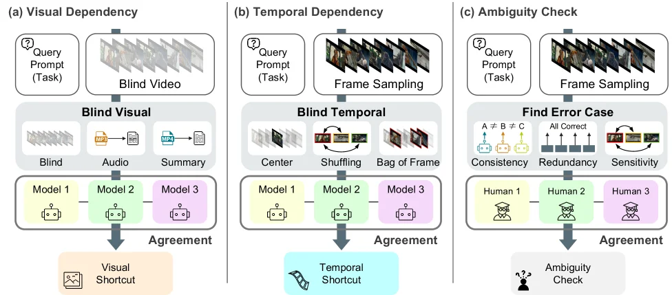
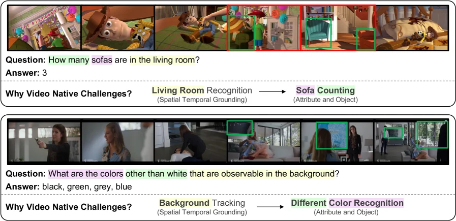
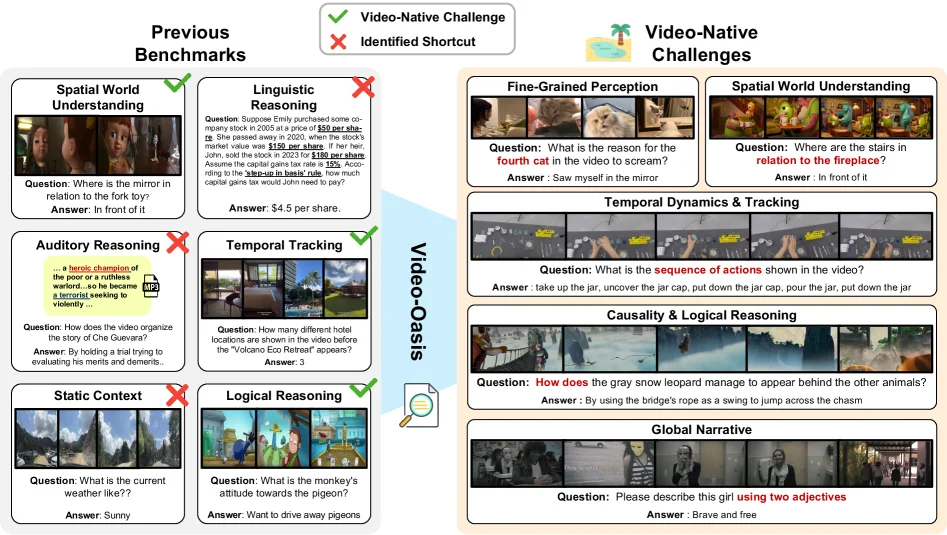
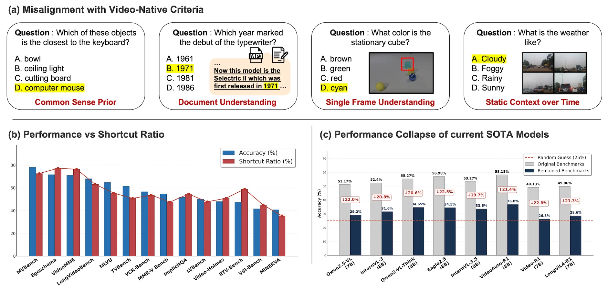
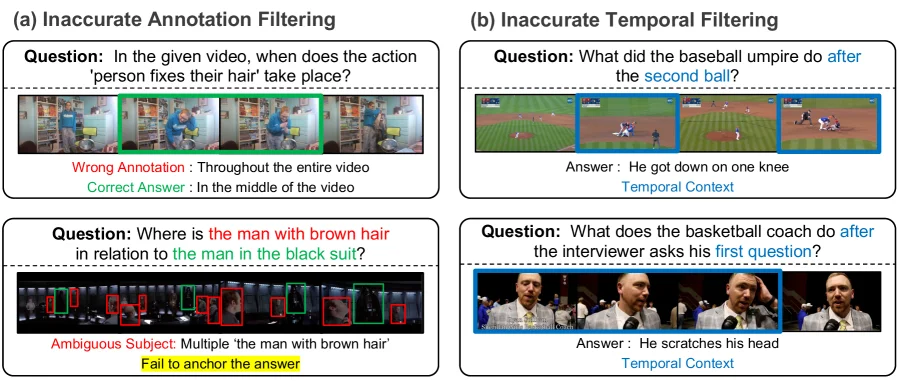

# Video-Oasis: Rethinking Evaluation of Video Understanding

[arXiv](https://arxiv.org/abs/2603.29616) · [HuggingFace](https://huggingface.co/papers/2603.29616) · ▲58

## Abstract (verbatim)

> The inherent complexity of video understanding makes it difficult to determine whether Video-LLM benchmark performance stems from visual perception, linguistic reasoning, or knowledge priors. While many benchmarks have emerged to assess high-level reasoning, shared criteria for evaluating video understanding remain largely overlooked. Instead of introducing yet another benchmark, we take a step back to re-examine the criteria for evaluating video understanding. In this work, we introduce Video-Oasis, a sustainable diagnostic suite for systematically auditing existing video understanding benchmarks. This audit reveals that 55\% of existing benchmark samples are solvable without visual input or temporal context. After filtering these shortcuts, the remaining video-native challenges expose a substantial capability gap: state-of-the-art models perform only marginally above random guessing. Building on these findings, we use the distilled challenges as a testbed to investigate which algorithmic design choices contribute to robust video understanding. We hope our work provides a practical foundation for constructing rigorous video benchmarks and evaluating future Video-LLMs. Code is available at https://github.com/sejong-rcv/Video-Oasis.

## Background

### Background Analysis  

**1. Technical Context**  
With the advancement of multimodal large models, video understanding technology has evolved from single-task applications (e.g., action recognition) to more complex scenarios combining perception and reasoning. The core demand for such technology is to enable AI models to "understand" videos like humans—recognizing not only objects or actions but also temporal sequences, causal relationships, and even logical reasoning (e.g., "Why did this person fall?"). Typical applications include intelligent surveillance, video question answering, and environmental perception in autonomous driving. However, current benchmarks often fail to accurately evaluate whether models truly grasp the essence of video understanding, as performance gains might stem from visual perception, linguistic reasoning, or background knowledge rather than genuine video comprehension.  

**2. Previous Limitations**  
Early benchmarks focused on specific domains, but video large language models (Video-LLMs) now need to handle more complex dynamic and long-form reasoning tasks. A key flaw in existing evaluations is that many tasks can be solved using "shortcuts," such as relying solely on text descriptions or static images without analyzing spatiotemporal dependencies. This biases benchmarks, making it difficult to distinguish whether models truly understand video content. For example, a model might excel at "describing a video" but actually guess answers from text rather than observing the visual content. Such evaluation gaps hinder progress in video understanding research.  

**3. Proposed Solution**  
This paper introduces Video-Oasis, a diagnostic framework that systematically audits existing video understanding benchmarks. Its core idea is to test whether tasks truly require spatiotemporal reasoning by masking visual or temporal information. For instance, if a task can be solved with only text descriptions, it likely relies on shortcuts rather than genuine video understanding. Using this method, Video-Oasis finds that 55% of tasks in existing benchmarks can be completed without video input, while the remaining "pure video challenges" reveal significant performance gaps—even state-of-the-art models perform only slightly better than random guessing.  

**4. Unique Approach**  
Unlike previous work, Video-Oasis does not introduce a new benchmark but re-examines the fundamental criteria for video understanding. It addresses prior limitations through three key designs: (1) filtering out tasks with shortcuts via visual-temporal decoupling tests; (2) reducing bias and uncertainty through cross-model consensus; (3) resolving ambiguities in video QA via human-in-the-loop verification. This approach makes evaluations more rigorous and reliable, providing practical guidelines for future benchmark design.

## Method, Figure by Figure

> Figure 2 : Overview of the V-Oasis diagnostic suite, which assesses (a) whether visual information is required, (b) whether temporal context is necessary, and (c) whether the task contains ambiguity in video data, followed by human verification.

This diagram (Figure 2) provides an overview of the Video-Oasis diagnostic toolkit, which is primarily used to evaluate three key aspects of video understanding tasks: visual dependency, temporal dependency, and ambiguity checking.

First, let's look at part (a), titled "Visual Dependency." The purpose of this section is to determine whether a video understanding task truly requires visual information.
1.  Data Input: From left to right, we first have the "Query Prompt (Task)" (query prompt or task description), followed by "Blind Video." Here, "Blind Video" likely refers to a video without visual content provided, or a video used to test whether a model relies on visual input.
2.  Processing Flow:
    *   The "Blind Visual" module receives the "Blind Video" and processes it into different forms, as shown in the diagram: "Blind" (original blind video), "Audio" (audio), and "Summary" (summary). This suggests that the module is trying to extract clues from non-visual information (such as audio or text summary).
    *   Next, there are three models (Model 1, Model 2, Model 3), each receiving these processed information (for example, Model 1 might mainly look at the "Blind" part, Model 2 at the "Audio," Model 3 at the "Summary," or they combine these information in some way). Each model has an output (represented by symbols inside circles).
    *   Finally, the outputs of these models are summarized in an "Agreement" (agreement) module, which determines whether the models reach a consistent result without visual input. If they do, a "Visual Shortcut" (visual shortcut) conclusion is drawn, meaning the task may not require true visual understanding, and the model can solve it through other means (such as audio or text).

Next is part (b), titled "Temporal Dependency." This section evaluates whether a task requires temporal context.
1.  Data Input: It also starts with the "Query Prompt (Task)," followed by "Frame Sampling" (frame sampling), which means extracting some keyframes from the video.
2.  Processing Flow:
    *   The "Blind Temporal" module receives these sampled frames and processes them. The diagram shows three processing methods: "Center" (center frame), "Shuffling" (shuffling the order of frames), and "Bag of Frame" (treating frames as a set without considering the order). This indicates that the module is testing the model's sensitivity to the time order.
    *   Next, the same three models (Model 1, Model 2, Model 3) receive the processed frame information. Each model has an output.
    *   The outputs of the models are again summarized in the "Agreement" module. If the models reach a consensus without the correct time order, a "Temporal Shortcut" (temporal shortcut) conclusion is drawn, meaning the task may not require true temporal understanding, and the model can solve it through other means (such as single-frame content).

Finally, there is part (c), titled "Ambiguity Check." This section checks whether the task in the video data contains ambiguity.
1.  Data Input: It starts with the "Query Prompt (Task)," followed by "Frame Sampling."
2.  Processing Flow:
    *   The "Find Error Case" module receives the sampled frames and checks them from three aspects: "Consistency" (consistency), "Redundancy" (redundancy), and "Sensitivity" (sensitivity). The diagram shows the "All Correct" (all correct) situation, as well as some possible error situations (marked with red crosses).
    *   Then, there are three human evaluators (Human 1, Human 2, Human 3) who check these frames, and they may have different judgments (represented by icons of different colors).
    *   Finally, the judgments of these human evaluators are summarized in the "Agreement" module to determine whether the task is ambiguous. If there is ambiguity, a further "Ambiguity Check" (ambiguity check) will be conducted.

In summary, this diagram shows how Video-Oasis diagnoses video understanding tasks through three steps: first, checking whether visual information is required, then checking whether temporal context is needed, and finally checking whether the task contains ambiguity. Each step involves the evaluation of models and/or humans, and the "Agreement" module is used to determine whether there is a certain "shortcut" or ambiguity. This process helps to reveal potential problems in existing video understanding benchmarks and provides a basis for building more rigorous video benchmarks.

---

> Table 7 : Benchmarking state-of-the-art models under video-native challenges. The metric is accuracy. Table 8: Ablation study of temporal grounding in video-LLMs. The metric is accuracy. Table 9: Upper bound performance (%) with oracle temporal grounding. Table 10: Ablation study of reasoning depth modulation. The metric is accuracy. Table 11: Comparison of SFT and RLVR training paradigms for video understanding. All models share the same base LLM, Qwen2.5-VL [ 2 ] . The metric is accuracy. (a) Blind Test (b) Audio (c) Narrative (d) Center-Frame (e) Frame Shuffling (f) Bag-of-Frames Table S1 : Quantitative results of Video-Oasis under different diagnostic model configurations to evaluate robustness. The metric is accuracy. Table S2: Per-benchmark statistics before and after Video-Oasis filtering. Table S3: Benchmark-wise results (%) for the Blind Test, where the model answers without visual input or auxiliary context, relying only on linguistic priors. Table S4: Benchmark-wise results (%) for the Audio Test, where the model answers using only the speech transcript from the video’s audio. Table S5: Benchmark-wise results (%) for the Narrative Test, where the model answers using concatenated video captions as textual context. Table S6: Benchmark-wise results (%) for the Center-Frame Test, where the model answers using only the center frame of the video. Table S7: Benchmark-wise results (%) for the Frame Shuffling Test, where the temporal order of video frames is randomly permuted. Table S8: Benchmark-wise results (%) for the Bag-of-Frames Test, where frames are processed independently without modeling temporal relations. Table S9: Prompt template used in the visual dependency tests with different context. Algorithm 1 Temporal Dependency Diagnostic Procedure Table S10: Statistics of the identified video-native challenges: (a) category distribution and (b) video duration statistics. Table S11: Multiple-Choice Answer distribution across categories. Table S12 : Per-benchmark distribution of samples across video-native challenges. Figure S1: Qualitative examples of Fine-Grained Perception Challenges. Figure S2: Qualitative examples of Spatial World Understanding Challenges. Figure S3: Qualitative examples of Temporal Dynamics & Tracking Challenges. Figure S4: Qualitative examples of Causality & Logical Reasoning Challenges. Figure S5: Qualitative examples of Global Narrative Challenges. Figure S6: Qualitative examples of shortcut problems identified by Video-Oasis. Table S13: Reproduction results on LongVideoBench and VideoMME. For each comparison, higher scores are highlighted in bold , while lower scores are underlined .

This image is from the paper "Video-Oasis: Rethinking Evaluation of Video Understanding" and shows two **qualitative examples** to illustrate the concept of "Video-Native Challenges." These examples aim to reveal the specific visual perception and spatiotemporal reasoning capabilities that models need to solve problems in videos, capabilities that cannot be addressed by simple text-based reasoning or knowledge priors.

Let's analyze these two examples separately:

**First Example (Upper Part):**
*   **Question and Answer:** The question is "How many sofas are in the living room?" and the answer is "3." This indicates the task is **sofa counting**, which involves identifying attributes of specific objects.
*   **Video Frame Sequence:** The top part shows a sequence of video frames capturing a dynamic scene. These frames together form the visual context for the question.
*   **Annotations and Process:**
    *   Key visual elements (sofas) are highlighted with green boxes. These boxes appear in different frames, indicating that the sofas appear at different time points in the video.
    *   A red box encircles a broader area, possibly representing the spatial context of the "living room."
    *   The text below, "Why Video Native Challenges?" introduces a process: from "Living Room Recognition" to "Sofa Counting."
    *   "Living Room Recognition" is labeled with "(Spatiotemporal Grounding)," meaning the model first needs to spatiotemporally determine which area is the "living room."
    *   "Sofa Counting" is labeled with "(Attribute and Object)," meaning after identifying the living room, the model needs to recognize and count the "sofas" within that area.
*   **Information Flow and Method Revelation:** This example demonstrates how the method works: To solve the "counting sofas" problem, the model cannot rely solely on single-frame images or text descriptions. It needs to:
    1.  **Spatiotemporal Understanding:** Track spatial regions (the living room) over time.
    2.  **Object Recognition and Counting:** Recognize and count specific objects (sofas) within that spatial region.
    This process requires the model to have inherent capabilities for handling video, rather than simply memorizing or reasoning.

**Second Example (Lower Part):**
*   **Question and Answer:** The question is "What are the colors other than white that are observable in the background?" and the answer is "black, green, grey, blue." This indicates the task is **different color recognition**, which involves perceiving attributes of the background.
*   **Video Frame Sequence:** Similarly, a sequence of video frames is shown, forming the visual context for the question.
*   **Annotations and Process:**
    *   Key visual elements (color regions in the background) are highlighted with green boxes. These boxes appear in different frames, indicating that the background colors may change over time or require observation across frames.
    *   The text below, "Why Video Native Challenges?" introduces another process: from "Background Tracking" to "Different Color Recognition."
    *   "Background Tracking" is labeled with "(Spatiotemporal Grounding)," meaning the model first needs to spatiotemporally track and understand the "background" area.
    *   "Different Color Recognition" is labeled with "(Attribute and Object)," meaning after tracking the background, the model needs to recognize and distinguish different color attributes within it.
*   **Information Flow and Method Revelation:** This example also demonstrates how the method works: To solve the "recognizing background colors" problem, the model needs to:
    1.  **Spatiotemporal Understanding:** Track the background area in the video.
    2.  **Attribute Recognition:** Recognize and distinguish different colors within that background area.
    This again emphasizes the reliance of video understanding tasks on spatiotemporal perception and specific visual attribute recognition.

**Summary:**
This image, through two concrete examples, clearly explains the core idea of "Video-Native Challenges." It shows that solving these problems requires models to have:
*   **Spatiotemporal Localization Capability:** The ability to identify and track relevant regions or objects (like "living room" or "background") in both time and space.
*   **Specific Visual Attribute Recognition Capability:** The ability to recognize and count specific objects (like "sofas") or distinguish specific attributes (like "colors").
These challenges are unique to video understanding tasks and cannot be solved by text understanding or static image analysis alone. The flow arrows in the image (e.g., "Living Room Recognition" -> "Sofa Counting") clearly show the information processing order from high-level spatial understanding to specific object recognition and attribute analysis. Through these examples, readers can intuitively understand what the paper refers to as "Video-Native Challenges" and how models need to operate to address them.

---

> Figure 4 : Video-native challenges such as temporal continuity, causal interaction, and multi-event narratives distilled from existing benchmarks.

This figure is from the paper "Video-Oasis: Rethinking Evaluation of Video Understanding" and clearly illustrates the problems in existing video understanding benchmarks, as well as the derived video-native challenges.

First, let's look at the "Previous Benchmarks" section on the left. Here, several different types of video understanding tasks are listed, and green checkmarks (✔️) and red crosses (❌) are used to mark whether these tasks can be easily solved by "shortcuts" (Identified Shortcut). A green checkmark indicates that the task mainly relies on inherent video information such as visual perception or temporal context, while a red cross indicates that the task can be solved through non-video-native information such as linguistic reasoning or static context, meaning there is a shortcut.

Specifically:
- The "Spatial World Understanding" task, for example, "Where is the mirror relative to the fork toy?" with the answer "In front of it." This task is marked with a green checkmark, indicating that it requires true video understanding ability.
- The "Linguistic Reasoning" task, for example, a mathematical problem about stock prices with the answer "$4.5 per share." This task is marked with a red cross, indicating that it can be solved directly through linguistic understanding without watching the video.
- The "Auditory Reasoning" task, for example, "How does the video organize the story of Che Guevara?" with the answer "By conducting a trial to evaluate his merits and demerits." This task is also marked with a red cross, indicating that it may rely on text descriptions rather than video content.
- The "Temporal Tracking" task, for example, "How many different hotel locations were shown in the video before 'Volcano Eco Retreat' appeared?" with the answer "3." This task is marked with a green checkmark, indicating that it requires temporal context.
- The "Static Context" task, for example, "What's the current weather like?" with the answer "Sunny." This task is marked with a red cross, indicating that it may only need a static image to be solved.
- The "Logical Reasoning" task, for example, "What is the monkey's attitude towards the pigeon?" with the answer "Want to drive the pigeon away." This task is marked with a green checkmark, indicating that it requires true video understanding ability.

Next, let's look at the "Video-Oasis" section in the middle. This part represents the method proposed in the paper, which is to systematically audit existing video understanding benchmarks to reveal which tasks truly test video understanding ability and which tasks have shortcuts. This process is like a filter, dividing the tasks in existing benchmarks into two categories: tasks that can be solved by shortcuts and true video-native challenges.

Then, let's look at the "Video-Native Challenges" section on the right. This part shows the video-native challenges derived from existing benchmarks, including:
- "Fine-Grained Perception": For example, "Why did the fourth cat in the video scream?" with the answer "Saw itself in the mirror." This task requires fine-grained visual perception.
- "Spatial World Understanding": For example, "Where is the stairs relative to the fireplace?" with the answer "In front of it." This task requires understanding spatial relationships.
- "Temporal Dynamics & Tracking": For example, "What is the sequence of actions shown in the video?" with the answer "Pick up the jar, open the lid, put down the lid, pour out the contents of the jar, put down the jar." This task requires understanding the temporal order.
- "Causality & Logical Reasoning": For example, "How did the snow leopard appear behind other animals?" with the answer "Used the rope on the bridge as a swing to jump over the canyon." This task requires understanding causal relationships.
- "Global Narrative": For example, "Please describe this girl with two adjectives" with the answer "Brave and free." This task requires understanding the entire video narrative.

The conclusion of this figure is that 55% of the tasks in existing benchmarks can be solved by shortcuts without true video understanding ability. After filtering out these shortcuts, the remaining video-native challenges expose a huge capability gap: the performance of state-of-the-art models on these tasks is only slightly better than random guessing. This indicates that existing video understanding benchmarks cannot effectively evaluate the video understanding ability of models, and new methods are needed to build more rigorous benchmarks.

---

> Figure 1 : (a) Examples of video-QA instances that can be solved without spatio-temporal video understanding. (b) Benchmarks with higher ratios of video-independent samples tend to exhibit inflated video-QA scores.(c) Current SOTA models consistently exhibit a substantial drop when facing video-native challenges, revealing the inherent difficulty of robust spatio-temporal understanding.

This figure (Figure 1) is from the paper "Video-Oasis: Rethinking Evaluation of Video Understanding" and aims to reveal problems in current video understanding benchmarks while providing diagnostic evidence for future research. We can divide this figure into three main parts for a detailed explanation:

**First Part: (a) Misalignment with Video-Native Criteria (与视频原生标准的错位)**

This part uses four specific "video-QA" examples to show which questions can be solved **without** spatiotemporal video understanding. Each example includes a question, several options, a highlighted correct answer, and labels the type of ability the question relies on.

1.  **First Example (leftmost):**
    *   **Question:** "Which of these objects is the closest to the keyboard?" (哪个物体离键盘最近？)
    *   **Options:** A. bowl (碗), B. ceiling light (天花板灯), C. cutting board (砧板), D. computer mouse (电脑鼠标).
    *   **Correct Answer:** D. computer mouse (highlighted).
    *   **Ability Type:** Common Sense Prior (常识先验). This means solving this problem mainly relies on common sense rather than visual perception or temporal understanding of video content. Even without seeing the video, one can infer that a mouse is usually close to a keyboard based on common sense.

2.  **Second Example (second from left):**
    *   **Question:** "Which year marked the debut of the typewriter?" (哪一年是打字机首次亮相的年份？)
    *   **Options:** A. 1961, B. 1971, C. 1981, D. 1986.
    *   **Correct Answer:** B. 1971 (highlighted).
    *   **Ability Type:** Document Understanding (文档理解). There is a small inset in the figure showing text that mentions "Selelectric II which was first released in 1971". Solving this problem requires extracting information from documents (or similar textual information) rather than analyzing the visual or temporal dynamics of the video.

3.  **Third Example (second from right):**
    *   **Question:** "What color is the stationary cube?" (静止的立方体是什么颜色？)
    *   **Options:** A. brown (棕色), B. green (绿色), C. red (红色), D. cyan (青色).
    *   **Correct Answer:** D. cyan (highlighted).
    *   **Ability Type:** Single Frame Understanding (单帧理解). The figure shows a static image containing several objects, with one cube highlighted by a red box. Solving this problem only requires observing a single image (or a frame in the video) without needing to understand the temporal changes in the video.

4.  **Fourth Example (rightmost):**
    *   **Question:** "What is the weather like?" (天气怎么样？)
    *   **Options:** A. Cloudy (多云), B. Foggy (有雾), C. Rainy (下雨), D. Sunny (晴朗).
    *   **Correct Answer:** A. Cloudy or B. Foggy (both are highlighted, possibly indicating the image is blurry and it's hard to judge precisely, but the answer falls into this category).
    *   **Ability Type:** Static Context over Time (静态上下文). The figure shows four similar scenes, possibly snapshots at different time points, but the weather condition appears static in these snapshots. Solving this problem may rely on understanding static images or visual information that doesn't change over a short period, rather than dynamic analysis of a long sequence.

**Conclusion (part a):** This part reveals that there are many "shortcut" problems in existing video understanding benchmarks. These problems can be solved using common sense, document understanding, single-frame analysis, or static context without real spatiotemporal video understanding ability. This leads to benchmark results that may not accurately reflect a model's performance on core video understanding tasks.

**Second Part: (b) Performance vs Shortcut Ratio (性能与捷径比例)**

This is a bar chart used to show the relationship between the performance of different video understanding benchmarks and the proportion of "video-independent samples" (i.e., problems that can be solved without video understanding) they contain.

*   **X-axis:** Different video understanding benchmarks, such as MVBench, EgoSchema, VideoMME, LongVideoBench, MLVU, TVBench, VCR-Bench, MMR-V Bench, ImplicitQA, LVBench, Video-Holmes, RTV-Bench, VSI-Bench, MINERVA.
*   **Y-axis:** Percentage (%).
*   **Blue bars:** Accuracy (%), representing the model's accuracy on the benchmark.
*   **Red line:** Shortcut Ratio (%), representing the proportion of problems in the benchmark that can be solved using video-independent methods.

**Data Flow and Conclusion (part b):**
*   Observing the chart, we can find that benchmarks with a higher Shortcut Ratio (red line) (e.g., MVBench, EgoSchema, VideoMME) also have relatively higher Accuracy (blue bars).
*   Conversely, benchmarks with a lower Shortcut Ratio have relatively lower Accuracy.
*   **Conclusion:** The higher the proportion of "video-independent samples" in a benchmark, the higher the model's score (accuracy) on that benchmark tends to be. This further confirms the finding in part (a): models may be using these shortcuts to achieve high scores rather than truly mastering video understanding ability.

**Third Part: (c) Performance Collapse of current SOTA Models (当前SOTA模型的性能崩溃)**

This part shows the performance of current state-of-the-art (SOTA) video understanding models when facing "video-native challenges". Here, "video-native challenges" refer to problems that cannot be solved using shortcuts and truly require spatiotemporal video understanding ability.

*   **X-axis:** Different SOTA models, such as Qwen2.5-VL (7B), InternVL-3 (8B), Qwen3-VL-Think (8B), Eagle2.5 (8B), InternVL-3.5 (8B), VideoAuto-R1 (8B), Video-R1 (7B), LongViLA-R1 (7B).
*   **Y-axis:** Accuracy (%).
*   **Gray bars:** Original Benchmarks, representing the model's accuracy on the original benchmarks.
*   **Dark blue bars:** Remained Benchmarks, representing the model's accuracy on true video-native challenges after filtering out all "video-independent samples".
*   **Red dashed line:** Random Guess (25%), serving as a performance baseline, indicating that if a model guesses randomly, its accuracy should be 25% (for multiple-choice questions with four options).
*   **Red percentage labels:** Represent the percentage decrease in the model's accuracy on the remained benchmarks compared to the original benchmarks (e.g., ↓22.0% means the accuracy decreased by 22.0%).

**Data Flow and Conclusion (part c):**
*   For all models shown, the accuracy of the Remained Benchmarks (dark blue bars) is significantly lower than that of the Original Benchmarks (gray bars).
*   For example, Qwen2.5-VL (7B) has an accuracy of 51.17% on the original benchmarks but only 29.2% on the remained benchmarks, a decrease of 22.0%.
*   More importantly, many models have very low accuracy on the remained benchmarks, even close to or below the random guess level (25%). For example, Video-R1 (7B) has an accuracy of only 26.3% on the remained benchmarks, VideoAuto-R1 (8B) has 33.6%, and LongViLA-R1 (7B) has 28.6%.
*   **Conclusion:** Current SOTA models experience a significant performance drop ("performance collapse") when facing true video-native challenges. This reveals the inherent difficulty of robust spatiotemporal understanding ability, indicating that existing models still have a huge gap in core video understanding tasks.

**How the Overall Method Works (Based on the Figure's Conclusions):**

1.  **Identify Problems:** The paper first shows through part (a) that there are many problems in existing video understanding benchmarks that can be solved without video understanding (shortcuts).
2.  **Quantify Problems:** Through part (b), the paper quantifies the proportion of shortcut problems in different benchmarks and correlates it with model performance, proving that a high proportion of shortcuts leads to inflated performance scores.
3.  **Filter Shortcuts:** The paper's method (Video-Oasis) aims to systematically audit existing benchmarks, filter out these shortcut problems, and leave behind "video-native challenges" that truly require spatiotemporal video understanding.
4.  **Evaluate Real Ability:** Through part (c), the paper shows that when models face these filtered "video-native challenges," their performance drops significantly, even close to random guess levels. This indicates that existing models are still weak in core video understanding ability.
5.  **Provide Diagnostic Tools:** Video-Oasis, as a suite of diagnostic tools, helps researchers identify weaknesses in benchmarks and understand in which aspects models truly need improvement, thus providing a foundation for building stricter video benchmarks and evaluating future Video-LLMs.

In summary, this figure clearly demonstrates the core problems in current video understanding research and evaluation: existing benchmarks contain many shortcuts, leading to overestimated model performance; and when facing true video-native challenges, even SOTA models perform poorly. This emphasizes the necessity of rethinking and redesigning video understanding evaluation standards.

---

> Figure 3 : (a) Inaccurate annotations identified by the redundancy and consistency tests. (b) Questions incorrectly filtered by the shuffling test but manually restored.

This figure (Figure 3) is from the paper "Video-Oasis: Rethinking Evaluation of Video Understanding" and clearly illustrates two key issues in video understanding evaluation: inaccurate annotation filtering and inaccurate temporal filtering. The figure uses specific examples to demonstrate how these issues are identified and addressed.

The layout of the figure is divided into two main parts: (a) Inaccurate Annotation Filtering and (b) Inaccurate Temporal Filtering. Each part contains two subfigures to showcase different types of problems.

**Left Part: (a) Inaccurate Annotation Filtering**

This section aims to illustrate that some annotations in video understanding tasks are problematic, leading models to rely on incorrect or insufficient information to derive answers.

1.  **Top Subfigure:**
    *   **Question:** "In the given video, when does the action 'person fixes their hair' take place?" (在给定的视频中，“人整理头发”的动作发生在什么时候？)
    *   **Video Frame Example:** Several consecutive video frames are shown below. The green box highlights the frames related to the "fixing hair" action.
    *   **Wrong Annotation:** Red text points out that the original annotation was "Throughout the entire video" (在整个视频中). This is clearly an inaccurate annotation as it is too broad and does not precisely indicate the specific time when the action occurred.
    *   **Correct Answer:** Green text provides the correct answer: "In the middle of the video" (在视频中间). This shows that through analysis, the error in the original annotation can be discovered and the correct answer determined.
    *   **Method Interpretation:** This example demonstrates how inaccurate annotations can be identified through a **redundancy test** or **consistency test**. For instance, if multiple models or human annotators provide inconsistent answers for the same action's timing, or if the answer is illogical (like "entire video"), then the annotation may be considered inaccurate.

2.  **Bottom Subfigure:**
    *   **Question:** "Where is the man with brown hair in relation to the man in the black suit?" (棕色头发的男人相对于穿黑色西装的男人在哪里？)
    *   **Video Frame Example:** A series of video frames are shown below, with different people highlighted by red and green boxes.
    *   **Ambiguous Subject:** Red text indicates that the question has "Multiple 'the man with brown hair'" (多个“棕色头发的男人”). This means there might be multiple subjects in the video that match the description, making it impossible to anchor the answer definitively.
    *   **Fail to Anchor the Answer:** Yellow text emphasizes this issue, i.e., due to the unclear subject, the model cannot provide a definite answer.
    *   **Method Interpretation:** This example is also identified through a **redundancy test** or **consistency test**. When a question involves an ambiguous subject, different annotations or models might point to different objects, leading to inconsistent or undeterminable answers. This method helps filter out samples that cannot effectively evaluate a model's capabilities due to annotation issues.

**Right Part: (b) Inaccurate Temporal Filtering**

This part focuses on the problems in handling temporal information during video understanding evaluation, leading to some time-context-dependent questions being incorrectly filtered out.

1.  **Top Subfigure:**
    *   **Question:** "What did the baseball umpire do after the second ball?" (棒球裁判在第二球之后做了什么？)
    *   **Video Frame Example:** Several consecutive video frames are shown below, with blue boxes highlighting the key frames related to the question, especially the scene "after the second ball."
    *   **Answer:** "He got down on one knee" (他单膝跪下).
    *   **Temporal Context:** Blue text emphasizes the importance of "Temporal Context" (时间上下文). This question requires understanding the sequence of actions.
    *   **Method Interpretation:** This example represents questions that were incorrectly filtered out by a **shuffling test**. A shuffling test might involve scrambling the order of video frames and then evaluating the model's performance. If a model can still provide the correct answer without the correct temporal order (or if the question itself becomes meaningless when the time is shuffled but is incorrectly retained), then the question might be wrongly filtered. Here, "manually restored" (手动恢复) means researchers manually identified these questions as important for evaluating temporal understanding and should be kept in the evaluation set.

2.  **Bottom Subfigure:**
    *   **Question:** "What does the basketball coach do after the interviewer asks his first question?" (篮球教练在采访者提出第一个问题后做了什么？)
    *   **Video Frame Example:** Several consecutive video frames are shown below, with blue boxes highlighting the key frames related to the question, especially the scene "after the first question."
    *   **Answer:** "He scratches his head" (他挠了挠头).
    *   **Temporal Context:** Blue text again emphasizes the importance of "Temporal Context" (时间上下文).
    *   **Method Interpretation:** Similar to the previous subfigure, this question was also incorrectly filtered by a **shuffling test** but was later manually restored. This indicates that these questions are crucial for evaluating a model's understanding of temporal order and should not be excluded due to flaws in the testing method.

**Summary:**

This figure vividly demonstrates how the Video-Oasis diagnostic suite systematically audits existing video understanding benchmarks through specific examples. It reveals two main evaluation issues:
*   **Inaccurate Annotations:** Leading models to rely on incorrect or insufficient information (as shown in Figure (a)).
*   **Inaccurate Temporal Filtering:** Causing some key questions requiring temporal context to be incorrectly excluded (as shown in Figure (b)).

By identifying and filtering out these problematic samples, the remaining "native video challenges" can more accurately assess a model's true video understanding capabilities. The core method of this figure is to diagnose the quality of benchmark data using means such as **redundancy tests**, **consistency tests**, and **shuffling tests**, and to manually recover questions that are crucial for evaluation. This enables researchers to better understand the capability gaps of existing models and provides a basis for building stricter video benchmarks.
