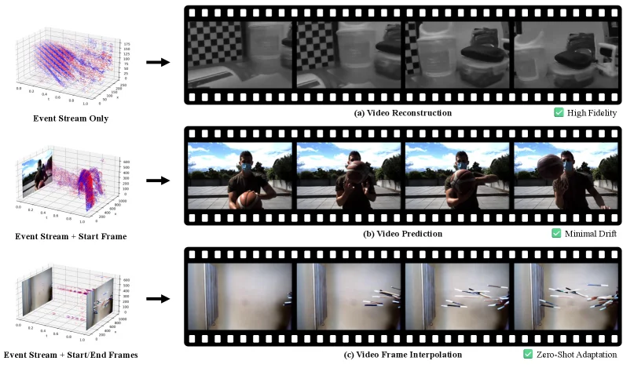
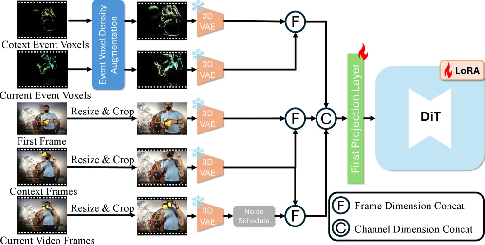
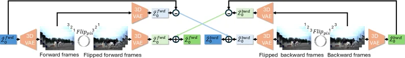
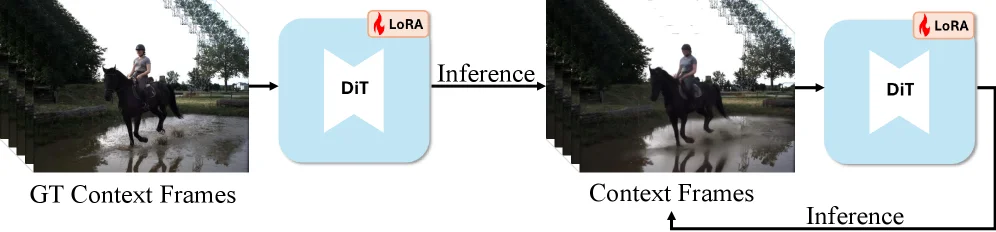
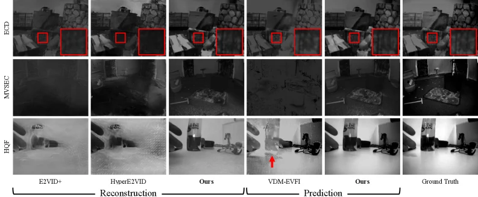

# LongE2V: Long-Horizon Event-based Video Reconstruction, Prediction, and Frame Interpolation with Video Diffusion Models

[arXiv](https://arxiv.org/abs/2607.08770) · [HuggingFace](https://huggingface.co/papers/2607.08770) · ▲28

## 摘要（原文）

> Recovering high-quality video from sparse event streams is a challenging task. Regression methods often blur textures, while existing generative models struggle with long-term stability. We propose LongE2V, a novel approach that leverages pre-trained video diffusion priors to jointly handle event-based video reconstruction, prediction, and frame interpolation. By fine-tuning a foundational video model, our approach achieves high data efficiency and superior perceptual quality. We introduce Autoregressive Unrolling and Adaptive Context Switching to mitigate temporal drift in extremely long sequences. We also propose Reencoding Alignment with Cross Residual Correction to ensure precise bidirectional consistency during frame interpolation. Furthermore, Event Voxel Density Augmentation ensures robustness across varying sensor resolutions. Extensive experiments on real-world benchmarks demonstrate that LongE2V outperforms state-of-the-art methods across all three tasks, exhibiting exceptional temporal coherence and zero-shot generalization. Project page: https://cdfan0627.github.io/LongE2V-page/

## 摘要（中译）

从稀疏事件流中恢复高质量视频是一项具有挑战性的任务。回归方法通常会使纹理模糊，而现有的生成模型在长期稳定性方面存在困难。我们提出了LongE2V，这是一种新颖的方法，它利用预训练的视频扩散先验来共同处理基于事件的视频重建、预测和帧插值。通过微调一个基础视频模型，我们的方法实现了高数据效率和卓越的感知质量。我们引入了自回归展开（Autoregressive Unrolling）和自适应上下文切换（Adaptive Context Switching）来减轻极长序列中的时间漂移。我们还提出了带交叉残差校正的重新编码对齐（Reencoding Alignment with Cross Residual Correction），以确保帧插值期间的精确双向一致性。此外，事件体素密度增强（Event Voxel Density Augmentation）确保了在不同传感器分辨率下的鲁棒性。在真实世界基准上的广泛实验表明，LongE2V在所有三个任务上都优于最先进的方法，表现出卓越的时间一致性和零样本泛化能力。项目页面：https://cdfan0627.github.io/LongE2V-page/

## 背景剖析

事件相机技术源于对生物视觉系统的模仿，能在微秒级分辨率和宽动态范围下捕捉亮度变化，特别适用于高速运动场景（如工业检测、自动驾驶）。这类技术的核心需求是将稀疏的异步事件流还原为人类可理解的高清视频，但传统方法面临多重挑战：回归模型（如E2VID）会因“平均化”导致纹理模糊，而直接应用扩散模型又容易在长序列预测中出现误差累积和时序漂移，帧插值任务则常产生鬼影伪影。  

此前的研究主要依赖CNN/RNN或早期Transformer架构，虽能处理时序信息，但任务特异性强——重建、预测和插值往往需要独立模型，缺乏统一框架。更关键的是，现有方法在真实场景中表现不稳定：回归模型丢失细节，扩散模型长期预测失效，插值方法难以应对复杂动态。这些问题的根源在于事件数据的稀疏性和异步性，使得传统算法难以建立稳定的时序关联。  

本文提出的LongE2V通过视频扩散模型（VDM）的预训练先验来解决这些矛盾。其核心思路是将重建、预测和插值统一为“基于事件体素的条件生成任务”，并通过两个创新机制突破瓶颈：一是“自回归展开+自适应上下文切换”，动态调整时序依赖以缓解长序列漂移；二是“重编码对齐+交叉残差校正”，确保帧插值时的双向时序一致性。此外，针对传感器分辨率差异，设计了“事件体素密度增强”提升泛化能力。  

与前人工作相比，LongE2V的关键差异在于：1）首次将预训练VDM用于多任务统一框架，而非单独优化；2）通过动态时序调整机制解决长期稳定性问题；3）采用条件生成范式替代传统的回归或端到端映射。实验表明，该方法在真实基准测试中显著优于现有方法，同时实现了零样本泛化和更高的感知质量。

## 方法图解

> Figure 1. Event-based video generation. We leverage pre-trained video diffusion priors to address three distinct inverse problems within a single architecture. Depending on the input condition, our model performs: (a) Video Reconstruction , recovering high-fidelity textures from sparse event streams, (b) Video Prediction , generating long-term sequences from a single start frame with minimal drift via our autoregressive unrolling strategy, and (c) Video Frame Interpolation , achieving zero-shot adaptation to synthesize intermediate frames by leveraging event dynamics as temporal guidance.

这张图（图1）来自论文《LongE2V: Long-Horizon Event-based Video Reconstruction, Prediction, and Frame Interpolation with Video Diffusion Models》，它清晰地展示了该方法（LongE2V）如何利用预训练的视频扩散模型来解决基于事件的视频生成中的三个不同逆问题。整个图分为三个主要部分（a, b, c），每个部分展示了一种不同的任务及其输入输出。

首先，我们看最左边的一列，这里展示了三种不同的输入条件，每种条件都对应一个事件流（Event Stream）的可视化。事件流通常用三维体素图（3D voxel grid）表示，其中颜色和密度代表了事件发生的位置和强度。

1.  **第一行 (a) 视频重建 (Video Reconstruction)**:
    *   **输入条件**: 左侧显示的是“仅事件流”（Event Stream Only）。这意味着模型只有事件的时空信息，没有初始图像帧。
    *   **信息流动**: 箭头从“仅事件流”的体素图指向右侧的一系列重建后的视频帧。
    *   **输出结果**: 右侧展示了一系列重建后的视频帧。这些帧具有“高保真度”（High Fidelity），如图中标注的绿色对勾所示。这表明该方法能够从稀疏的事件流中恢复出高质量的纹理细节。
    *   **方法运作方式**: 这部分展示了模型如何仅利用事件数据来重建视频。通过预训练的视频扩散模型，LongE2V能够从事件的动态信息中推断出清晰的图像内容。

2.  **第二行 (b) 视频预测 (Video Prediction)**:
    *   **输入条件**: 左侧显示的是“事件流 + 起始帧”（Event Stream + Start Frame）。这意味着模型除了有事件的时空信息外，还得到了序列的第一个图像帧。
    *   **信息流动**: 箭头从“事件流 + 起始帧”的体素图和起始帧（虽然起始帧未直接画出，但文字说明其存在）指向右侧的一系列预测视频帧。
    *   **输出结果**: 右侧展示了一系列预测的视频帧。这些帧具有“最小漂移”（Minimal Drift），如图中标注的绿色对勾所示。这表明该方法能够基于起始帧和事件流，生成长期稳定的视频序列，而不会出现明显的累积误差或视觉上的漂移。
    *   **方法运作方式**: 这部分展示了模型如何进行视频预测。通过“自回归展开”（Autoregressive Unrolling）策略，模型能够逐步生成后续帧，同时保持时间上的一致性。事件流提供了动态变化的指导，而起始帧则设定了初始状态。

3.  **第三行 (c) 视频帧插值 (Video Frame Interpolation)**:
    *   **输入条件**: 左侧显示的是“事件流 + 起始/结束帧”（Event Stream + Start/End Frames）。这意味着模型得到了序列的第一个和最后一个图像帧，以及中间的事件流。
    *   **信息流动**: 箭头从“事件流 + 起始/结束帧”的体素图和这两个边界帧（虽然边界帧未直接画出，但文字说明其存在）指向右侧的一系列插值后的视频帧。
    *   **输出结果**: 右侧展示了一系列插值后的中间视频帧。这种方法具有“零样本适应”（Zero-Shot Adaptation）的能力，如图中标注的绿色对勾所示。这意味着模型能够利用事件动态作为时间指导，合成出自然的中间帧，即使它可能没有针对特定场景进行显式训练。
    *   **方法运作方式**: 这部分展示了模型如何进行视频帧插值。通过利用事件流提供的动态信息，并结合起始和结束帧的约束，模型能够估计出中间时刻的图像内容。这里的“零样本适应”强调了模型的泛化能力。

**总结来说，这张图揭示了LongE2V方法的核心运作机制**：
*   该方法基于预训练的视频扩散模型，通过微调来处理基于事件的视频生成任务。
*   它能够根据不同的输入条件（仅事件流、事件流+起始帧、事件流+起始/结束帧）执行三种不同的任务：视频重建、视频预测和视频帧插值。
*   对于视频重建，它从稀疏事件中恢复高保真纹理。
*   对于视频预测，它从单个起始帧和事件流生成长期稳定的序列，最小化漂移。
*   对于视频帧插值，它利用事件动态作为时间指导，实现零样本适应的中间帧合成。
*   图中还暗示了该方法使用了“自回归展开”和“自适应上下文切换”（Adaptive Context Switching）来处理长序列中的时间漂移，并使用“重新编码对齐与交叉残差校正”（Reencoding Alignment with Cross Residual Correction）来确保帧插值的双向一致性。

这张图通过直观的示例展示了LongE2V在不同任务上的有效性，强调了其在数据效率、感知质量和时间一致性方面的优势。

---

> Figure 4. Overview of our training pipeline. To enhance robustness against sensor variations, input event voxels undergo Event Voxel Density Augmentation, and the first frame, context frames, and current video frames are synchronously resized and cropped to ensure spatial alignment. All inputs are encoded into latents via a frozen 3D VAE. These latents are aligned and fused through frame dimension concatenation and channel dimension concatenation. Finally, we expand and fully fine-tune the First Projection Layer to accommodate the additional event channels, while the DiT backbone is efficiently fine-tuned using LoRA.

这张图展示了论文《LongE2V: Long-Horizon Event-based Video Reconstruction, Prediction, and Frame Interpolation with Video Diffusion Models》中提出的训练管道的概述。它详细描述了从输入数据到模型训练的整个流程，旨在增强对传感器变化的鲁棒性，并有效地联合处理基于事件的视频重建、预测和帧插值任务。

数据的流动和处理过程如下：

1.  **输入数据处理**：
    *   **事件体素 (Event Voxels)**：图中有两类事件体素输入：“Cotext Event Voxels”（可能是“Context Event Voxels”的笔误，即上下文事件体素）和“Current Event Voxels”（当前事件体素）。这些事件体素首先经过一个名为“Event Voxel Density Augmentation”（事件体素密度增强）的模块。这个模块的作用是增强对不同传感器分辨率的鲁棒性，通过改变事件体素的密度来模拟不同的传感器特性。
    *   **图像帧 (Frames)**：图中有三类图像帧输入：“First Frame”（第一帧）、“Context Frames”（上下文帧）和“Current Video Frames”（当前视频帧）。这些图像帧会同步进行“Resize & Crop”（调整大小和裁剪）操作，以确保它们在空间上对齐，即具有相同的尺寸和位置。

2.  **潜在表示编码**：
    *   经过处理的事件体素和图像帧分别被送入一个“frozen 3D VAE”（冻结的3D变分自编码器）。这里的“frozen”意味着VAE的权重在训练过程中不会更新，它仅用于将输入数据编码成潜在表示（latents）。每个输入（无论是增强后的事件体素还是调整后的图像帧）都会被编码成一个潜在表示，图中用带有雪花图标的橙色块表示这些潜在表示，暗示它们是经过某种预处理或编码的状态。

3.  **潜在表示的对齐与融合**：
    *   编码后的潜在表示需要进行对齐和融合，以便后续处理。
    *   对于图像帧的潜在表示（来自“First Frame”、“Context Frames”和“Current Video Frames”），图中显示了一个“Noise Schedule”（噪声调度）模块，这通常是扩散模型中的一个组成部分，用于控制去噪过程中的噪声水平。
    *   所有潜在表示（包括事件体素的和图像帧的）通过两种方式进行融合：
        *   **Frame Dimension Concat (F)**：即帧维度拼接。这表示将不同来源的潜在表示在帧的维度上进行连接。图中有多个标有“F”的圆形节点，表示执行此操作。
        *   **Channel Dimension Concat (C)**：即通道维度拼接。这表示将不同来源的潜在表示在通道的维度上进行连接。图中有一个标有“C”的圆形节点，表示执行此操作。
    *   这些拼接操作（F和C）将不同模态（事件和图像）和时间步的潜在表示融合成一个统一的特征表示。

4.  **模型输入与微调**：
    *   融合后的特征表示被送入“First Projection Layer”（第一个投影层）。这个层的任务是扩展并完全微调，以适应额外的事件通道。图中这个层用绿色表示，并带有一个火焰图标，可能表示这是一个关键的处理步骤或需要特别注意的部分。
    *   最终，处理后的特征被输入到“DiT”（Diffusion Transformer，扩散变压器）模型的骨干网络中。图中DiT模块用蓝色表示，并带有一个“LoRA”标签。LoRA（Low-Rank Adaptation，低秩适应）是一种高效的微调技术，它允许在冻结大部分模型权重的同时，只微调一小部分参数，从而提高训练效率和数据效率。

总结来说，这张图展示了一个训练管道，该管道首先对输入的事件体素和图像帧进行预处理（增强和空间对齐），然后将它们编码成潜在表示。这些潜在表示通过帧维度和通道维度的拼接进行融合，接着通过一个专门设计的投影层进行调整，最后输入到一个使用LoRA技术微调的DiT模型中进行训练。整个流程旨在利用预训练的视频扩散模型先验知识，有效地处理基于事件的视频任务，并解决长期序列中的时间漂移和帧插值中的双向一致性等问题。

这张图清晰地揭示了LongE2V方法的具体运作方式：它通过多模态输入（事件和图像）、潜在空间表示、特征融合以及高效的模型微调策略，来实现高质量的基于事件的视频重建、预测和帧插值。

---

> Figure 5. Reencoding Alignment and Cross Residual Correction. To address temporal misalignment caused by the discrepancy between latent-space and pixel-space flipping, we propose Reencoding Alignment. The denoised latents, Z ^ 0 f ​ w ​ d \hat{Z}_{0}^{fwd} and Z ^ 0 b ​ w ​ d \hat{Z}_{0}^{bwd} , are decoded into pixel space, flipped temporally ( F ​ l ​ i ​ p p ​ i ​ x Flip_{pix} ), and then re-encoded via the 3D VAE to yield the aligned latents Z ~ 0 f ​ w ​ d \tilde{Z}_{0}^{fwd} and Z ~ 0 b ​ w ​ d \tilde{Z}_{0}^{bwd} . To mitigate information loss inherent in this re-encoding process, we employ Cross Residual Correction. We calculate the residual difference between the original and the re-encoded latents (e.g., the subtraction node Z ^ 0 f ​ w ​ d − Z ¯ 0 f ​ w ​ d \hat{Z}_{0}^{fwd}-\bar{Z}_{0}^{fwd} ) and inject this detail information into the opposite branch. Specifically, the forward residual is added to the backward aligned latents Z ~ 0 b ​ w ​ d \tilde{Z}_{0}^{bwd} to produce the final corrected latents Z 0 ′ ⁣ b ​ w ​ d Z^{\prime bwd}_{0} , and symmetrically, the backward residual is injected into Z ~ 0 f ​ w ​ d \tilde{Z}_{0}^{fwd} to obtain Z 0 ′ ⁣ f ​ w ​ d Z^{\prime fwd}_{0} . This symmetric Cross Injection mechanism promotes temporal consensus between branches while preserving fine-grained details. Light-colored boxes represent information loss.

这张图展示了论文中提出的**Reencoding Alignment（重新编码对齐）**和**Cross Residual Correction（交叉残差校正）**机制的工作流程，用于解决潜在空间和像素空间翻转导致的时序错位问题，并缓解重新编码过程中的信息损失。

### 组件与信息流动：
1. **初始潜变量（Latents）**：
   - 左侧起始的是`$\hat{Z}_0^{\text{fwd}}$`（前向潜变量），右侧起始的是`$\hat{Z}_0^{\text{bwd}}$`（后向潜变量）。这些潜变量来自3D VAE的编码过程，代表了视频帧的潜在表示。
2. **解码与前向翻转（Forward Frames Path）**：
   - `$\hat{Z}_0^{\text{fwd}}$`首先通过一个3D VAE解码（图中橙色的“3D VAE”模块），生成前向帧（Forward frames）。
   - 前向帧经过`Flip_{pix}`（像素时间翻转，即时间维度上的翻转，比如将帧序列倒序）操作，得到“Flipped forward frames”（翻转的前向帧）。
   - 翻转后的前向帧再次通过3D VAE编码，得到`$\tilde{Z}_0^{\text{fwd}}$`（对齐后的前向潜变量）。这个过程中，由于重新编码，会存在信息损失（图中浅色框表示），对应`$\bar{Z}_0^{\text{fwd}}$`（重新编码后的前向潜变量，与`$\hat{Z}_0^{\text{fwd}}$`有差异）。
3. **解码与后向翻转（Backward Frames Path）**：
   - 类似地，`$\hat{Z}_0^{\text{bwd}}$`通过3D VAE解码生成后向帧（Backward frames）。
   - 后向帧经过`Flip_{pix}`操作（时间翻转，比如将帧序列倒序），得到“Flipped backward frames”（翻转的后向帧）。
   - 翻转后的后向帧再次通过3D VAE编码，得到`$\tilde{Z}_0^{\text{bwd}}$`（对齐后的后向潜变量），同样存在信息损失，对应`$\bar{Z}_0^{\text{bwd}}$`。
4. **交叉残差校正（Cross Residual Correction）**：
   - 计算原始潜变量与重新编码后潜变量的残差（即“减法节点”）：
     - 前向残差：`$\hat{Z}_0^{\text{fwd}} - \bar{Z}_0^{\text{fwd}}$`（图中蓝色箭头的减法操作）。
     - 后向残差：`$\hat{Z}_0^{\text{bwd}} - \bar{Z}_0^{\text{bwd}}$`（图中绿色箭头的减法操作）。
   - 将前向残差注入到后向对齐潜变量`$\tilde{Z}_0^{\text{bwd}}$`中（图中蓝色箭头的加法操作），得到最终校正的后向潜变量`$Z_0'^{\text{bwd}}$`。
   - 对称地，将后向残差注入到前向对齐潜变量`$\tilde{Z}_0^{\text{fwd}}$`中（图中绿色箭头的加法操作），得到最终校正的前向潜变量`$Z_0'^{\text{fwd}}$`。
   - 这个“交叉注入”机制确保了两个分支（前向和后向）之间的时序一致性，同时保留了细粒度的细节。

### 方法运作原理：
- **Reencoding Alignment**：通过将潜变量解码为像素帧，进行时间翻转，再重新编码为潜变量，解决了潜在空间和像素空间翻转的时序错位问题。这一步生成了对齐后的潜变量`$\tilde{Z}_0^{\text{fwd}}$`和`$\tilde{Z}_0^{\text{bwd}}$`，但过程中会有信息损失（浅色框）。
- **Cross Residual Correction**：计算原始潜变量和重新编码后潜变量的残差，将这些残差交叉注入到对面的分支中，弥补了重新编码的信息损失，同时增强了两个分支之间的时序一致性。例如，前向的细节信息（残差）被添加到后向的对齐潜变量中，后向的细节信息被添加到前向的对齐潜变量中，从而得到更准确、细节更丰富的校正后潜变量`$Z_0'^{\text{fwd}}$`和`$Z_0'^{\text{bwd}}$`。

### 结果与结论（从图中逻辑推导）：
- 图中展示了如何通过对齐潜变量（`$\tilde{Z}_0^{\text{fwd}}$`和`$\tilde{Z}_0^{\text{bwd}}$`）和交叉残差校正，解决时序错位和信息损失问题。
- 最终的校正后潜变量（`$Z_0'^{\text{fwd}}$`和`$Z_0'^{\text{bwd}}$`）应该比原始的`$\hat{Z}_0^{\text{fwd}}$`和`$\hat{Z}_0^{\text{bwd}}$`或对齐后的`$\tilde{Z}_0^{\text{fwd}}$`和`$\tilde{Z}_0^{\text{bwd}}$`具有更好的时序一致性和细节保留，这对于视频重建、预测和帧插值任务至关重要。
- 这种机制确保了双向（前向和后向）潜变量之间的精确一致性，同时保留了细粒度细节，从而提升了方法的性能。

---

> Figure 3. Autoregressive Unrolling. To bridge the domain gap between training and inference, we employ an iterative training strategy. Initially, the model is trained with Ground Truth (GT) context frames for convergence (left). Subsequently, we activate the unrolling mechanism by performing an inference pass to generate predictions, which then replace the GT context frames for fine-tuning (right). This iterative feedback loop forces the model to adapt to its own generation errors, mitigating error accumulation during long video generation.

这张图（图3：自回归展开）直观地展示了论文《LongE2V》中提出的一种关键训练策略，旨在解决基于事件的视频生成中长期预测时的误差累积问题。我们可以将图中的流程分解为两个主要阶段，通过数据和信息的流动来理解其工作原理：

1.  **初始训练阶段（左侧部分）**：
    *   **输入数据**：最左边是“GT Context Frames”（Ground Truth Context Frames，即真实标签上下文帧）。这代表在训练的初始阶段，模型使用的是真实的、高质量的连续视频帧作为输入。这些帧构成了模型学习的“上下文”或“历史”信息。
    *   **模型组件**：中间是一个蓝色的方框，内部标有“DiT”（可能是指某种Diffusion Transformer模型，一种结合了扩散模型和Transformer架构的视频生成模型），其右上角有一个“LoRA”的标志。LoRA（Low-Rank Adaptation）是一种参数高效微调技术，意味着这个预训练的DiT模型正在被微调以适应特定的任务。
    *   **过程与输出**：箭头从“GT Context Frames”指向“DiT”模型，表示这些真实帧被输入到模型中进行处理。接着，一个标有“Inference”（推理）的箭头从第一个“DiT”模型指向右侧的另一组“Context Frames”。这表示在初始训练收敛后，模型会进行一次推理（或生成）步骤。这个推理步骤的输出是“Context Frames”（上下文帧），这些帧是基于真实帧生成的预测帧，但此时它们被标记为“Context Frames”，意味着它们将用于后续的训练迭代。

2.  **自回归展开与迭代微调阶段（右侧部分）**：
    *   **输入数据更新**：现在，“Context Frames”（即上一阶段模型生成的预测帧）成为了新的输入，替代了原来的“GT Context Frames”。这一步是“自回归展开”的核心——模型开始基于自己的生成结果进行进一步的预测。
    *   **模型组件与过程**：同样的“DiT”模型（带有LoRA标志）再次接收这些新的“Context Frames”作为输入。然后，又一个“Inference”箭头从这个“DiT”模型指回左侧的“Context Frames”。这个箭头形成了一个反馈回路，表示模型会不断地用新生成的帧来更新其上下文，并进行进一步的微调。
    *   **目的与效果**：这种迭代反馈循环的目的是让模型适应并修正其自身在生成过程中产生的错误。通过不断地用新生成的帧（可能包含一些误差）作为输入来重新训练模型，模型可以学习如何从这些误差中恢复，从而减轻在生成极长视频序列时可能出现的误差累积问题。这种方法迫使模型“自我修正”，提高其长期预测的稳定性和准确性。

总结来说，这张图揭示了LongE2V方法中“自回归展开”的具体运作方式：首先使用真实帧训练模型，然后让模型基于自身生成的帧进行迭代式的再训练和预测。这个过程通过反馈回路不断优化模型，使其能够更好地处理长期的视频生成任务，减少误差的累积。

数据或信息的流动顺序是：
`GT Context Frames` → `DiT (with LoRA)` → `Inference` → `Context Frames` → `DiT (with LoRA)` → `Inference` (并反馈回 `Context Frames` 进行下一轮迭代)。

---

> Figure 6. Qualitative comparisons on ECD (Mueggler et al . , 2017 ) , MVSEC (Zhu et al . , 2018 ) , and HQF (Stoffregen et al . , 2020 ) datasets. Our LongE2V recovers high-frequency textures where regression baselines (E2VID+, HyperE2VID) suffer from blurring (Row 1). In prediction tasks, we avoid the severe noise accumulation and ghosting artifacts (red arrow) seen in VDM-EVFI (Rows 2–3), maintaining superior structural fidelity and temporal stability.

这张图是论文《LongE2V: Long-Horizon Event-based Video Reconstruction, Prediction, and Frame Interpolation with Video Diffusion Models》中的一个关键结果图（图6），用于定性比较作者提出的LongE2V方法与其他现有方法在不同事件相机视频任务上的表现。我们可以通过以下几个方面来详细解读这张图：

首先，图的**行（Rows）**代表了不同的数据集或任务类型：
*   **第一行（ECD）**：展示了在ECD数据集（Mueggler等人，2017年）上的重建结果。这一行的图像是灰度的，主要关注场景中的结构和纹理恢复。
*   **第二行（MVSEC）**：展示了在MVSEC数据集（Zhu等人，2018年）上的预测结果。这一行的图像也是灰度的，但场景与第一行不同，更侧重于动态场景的预测能力。
*   **第三行（HQF）**：展示了在HQF数据集（Stoffregen等人，2020年）上的重建或预测结果。这一行的图像是彩色的，重点在于高保真细节的恢复和预测。

其次，图的**列（Columns）**代表了不同的方法或基准：
*   **前两列（E2VID+, HyperE2VID）**：这些是基于回归的方法，作为基线进行比较。从图中可以看出，这些方法在恢复高频纹理时容易出现模糊（如第一行红色方框内所示）。
*   **中间列（Ours）**：这是作者提出的LongE2V方法。在“Reconstruction”（重建）部分，LongE2V能够恢复出更清晰的纹理和结构（对比E2VID+和HyperE2VID）。在“Prediction”（预测）部分，LongE2V的结果也显示出更高的质量。
*   **VDM-EVFI列**：这是另一种现有的生成模型方法。在预测任务中（第二行和第三行），该方法出现了严重的噪声累积和重影伪影（如第三行红色箭头所指），导致结构保真度和时间稳定性较差。
*   **最后一列（Ground Truth）**：这是真实的参考帧，用于评估各种方法的重建或预测质量。所有方法的结果都应该尽可能接近这一列的图像。

图的**底部标签**进一步解释了列的分组：
*   **Reconstruction（重建）**：指从事件流中恢复已有的视频帧。这一部分包括了E2VID+、HyperE2VID和第一个“Ours”列。
*   **Prediction（预测）**：指从已有的事件流或帧中预测未来的视频帧。这一部分包括了VDM-EVFI和第二个“Ours”列。

**图中揭示的方法运作方式：**
1.  **针对重建任务（第一行和第二行的部分）**：LongE2V通过利用预训练的视频扩散模型先验，并结合自回归展开（Autoregressive Unrolling）和自适应上下文切换（Adaptive Context Switching）等技术，能够有效地从稀疏的事件流中恢复出清晰的高频纹理和结构细节。与传统的回归方法（如E2VID+和HyperE2VID）相比，LongE2V避免了纹理模糊的问题。
2.  **针对预测任务（第二行和第三行的部分）**：LongE2V通过其提出的方法，能够在长期序列中减轻时间漂移，并在帧插值中确保精确的双向一致性（通过重新编码对齐与交叉残差校正，Reencoding Alignment with Cross Residual Correction）。这使得LongE2V在预测未来帧时，能够避免像VDM-EVFI那样出现严重的噪声累积和重影伪影，从而保持优越的结构保真度和时间稳定性。

**对比对象和结论：**
*   **对比对象**：图中将LongE2V与E2VID+、HyperE2VID（回归基线）以及VDM-EVFI（现有生成模型）进行了对比。
*   **结论**：从图中可以清晰地看出，LongE2V在所有三个任务（ECD上的重建、MVSEC上的预测、HQF上的重建/预测）中都优于最先进的方法。具体来说：
    *   在重建任务中（第一行），LongE2V恢复了高频率纹理，而回归基线则出现模糊。
    *   在预测任务中（第二行和第三行），LongE2V避免了VDM-EVFI中出现的严重噪声累积和重影伪影，保持了更好的结构保真度和时间稳定性。
    这张图直观地展示了LongE2V方法在处理基于事件的视频重建、预测和帧插值任务时的优越性能，特别是在处理长期序列和保持时间一致性方面的优势。
