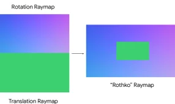
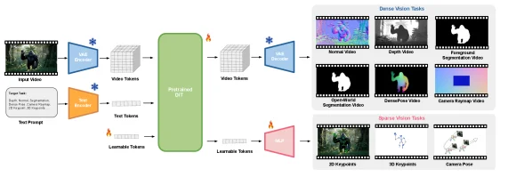
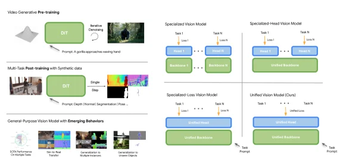
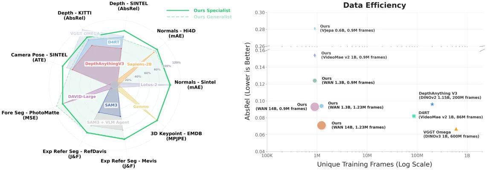
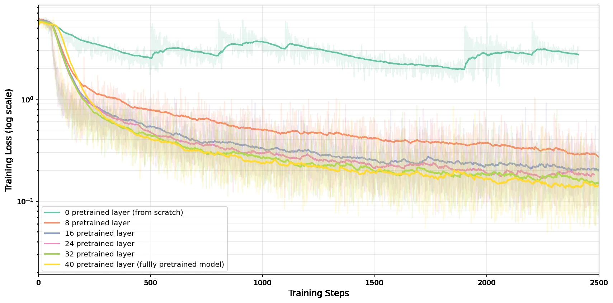

# Video Generation Models are General-Purpose Vision Learners

[arXiv](https://arxiv.org/abs/2607.09024) · [HuggingFace](https://huggingface.co/papers/2607.09024) · ▲11

## Abstract (verbatim)

> Driven by next-token prediction, NLP shifted from task-specific models into powerful generalist foundation models. What, then, is the equivalent catalyst needed to achieve a general-purpose model in computer vision? In this paper, we contend that large-scale text-to-video generation serves as a strong pre-training paradigm for computer vision, providing the necessary spatiotemporal priors, vision-language alignment, and scalability required for general visual intelligence. We introduce GenCeption, which leverages a pre-trained video generative diffusion backbone to define a feed-forward perception model, capable of performing various vision tasks steered by text instructions. Empirical results demonstrate that GenCeption achieves state-of-the-art performance across a diverse suite of tasks, including depth, surface normal, and camera pose estimation, expression-referring segmentation, and 3D keypoint prediction, often matching or surpassing specialized models (e.g. DepthAnything3, SAM3, D4RT, VGGT-Omega, Sapiens, David, Genmo, and Lotus-2). Furthermore, the video generative pretrained backbone outperforms alternative pretraining paradigms (e.g., V-JEPA, and Video MAE) under comparable settings. Importantly, GenCeption exhibits preliminary data and model scaling properties along with exceptional data efficiency, where it achieves comparable performance with leading models like D4RT and VGGT-Omega with 7 to 500 less training data. Finally, GenCeption also exhibits intriguing emergent behaviors: a model trained exclusively on synthetic human videos generalizes to real-world footage and out-of-distribution object categories (e.g., animals and robots). These findings suggest that video generation is not merely a synthesis tool, but a foundational path toward generalist vision intelligence for the physical world. Project page: https://genception.github.io

## Background

### Background Analysis  

**1. Technical Context and Real-World Needs**  
Computer vision aims to enable machines to understand the physical world, such as recognizing objects, estimating depth, segmenting scenes, or predicting motion. These technologies are critical for applications like autonomous driving (perceiving environments), robotics (manipulating objects), and medical imaging (analyzing lesions). However, current methods often rely on task-specific models (e.g., separate models for segmentation, depth estimation), leading to high development costs and poor adaptability to complex scenarios. For instance, an autonomous driving system requires simultaneous object detection, path planning, and obstacle avoidance, which traditional methods address by combining multiple models inefficiently.  

**2. Previous Limitations**  
Over the past decade, visual models have relied on a "task-specific" paradigm: each task (e.g., object detection, semantic segmentation) has independent architectures and training pipelines. Key issues include:  
- **Lack of Unity**: Unlike large language models (LLMs) in NLP, no universal model can handle diverse tasks.  
- **Neglected Spatiotemporal Dynamics**: Existing pretraining methods (e.g., masked autoencoders, contrastive learning) focus on static images but fail to learn temporal causality and physical laws (e.g., object motion, lighting changes) from videos.  
- **Low Data Efficiency**: Task-specific models require extensive labeled data, while video data collection and annotation are far more costly than image data.  

**3. Proposed Solution**  
The paper introduces "text-to-video generation" as a new pretext for vision pretraining, with the following core ideas:  
- **Leverage Generative Models for General Knowledge**: Training models to generate high-fidelity videos forces them to learn spatiotemporal priors like 3D geometry, object permanence, and physical interactions.  
- **Native Vision-Language Alignment**: Generation is conditioned on text (e.g., "a person running"), enabling the model to inherently understand linguistic instructions.  
- **Efficient Scaling**: Video generation models can utilize large-scale unlabeled video data (e.g., internet content), reducing annotation dependency, and diffusion models (Diffusion Models) achieve high-quality generation.  
The proposed GenCeption model further converts a pretrained video generation backbone into a generalist perception model, capable of performing tasks like segmentation, depth estimation, and 3D pose prediction via fine-tuning without architectural modifications.  

**4. Key Differences from Prior Work**  
Compared to traditional "task-specific" methods or single pretext paradigms (e.g., VideoMAE, V-JEPA), this work breaks new ground by:  
- **Unity**: Using one model for multiple tasks instead of task-specific architectures.  
- **Spatiotemporal Modeling**: Explicitly learning temporal dynamics through video generation, not just static image features.  
- **Data Efficiency**: Pretrained generative models achieve state-of-the-art performance with 7x less labeled data than specialized models.  
- **Emergent Abilities**: Models trained on synthetic data generalize to real-world scenes and unseen object categories (e.g., animals, robots).  

This paradigm shifts video generation from a "content synthesis tool" to a "foundation for generalist vision intelligence," offering a new direction for multimodal understanding of the physical world.

## Method, Figure by Figure

> Figure 5 : The "Rothko" Raymap as an example of adapting high-dimensional modal data into standard 3 RGB channels. This representation effectively compresses the camera’s multi-channel ray data by assembling rotation and translation components into a single three-channel map.

This figure (Figure 5) illustrates the process of adapting high - dimensional modal data (such as multi - channel ray data from a camera) into a standard 3 - channel RGB format, using the "Rothko" Raymap as an example. We can understand the process through the following steps:

### 1. Input Components
- On the left - hand side, there are two separate rectangular regions. One is labeled "Rotation Raymap" and the other is "Translation Raymap". These two regions represent two key components of the camera's ray data: rotation and translation. Visually, the "Rotation Raymap" is a rectangle with a blue - purple gradient in the upper half and a green color in the lower half. The "Translation Raymap" is a completely green rectangle (however, according to the caption's explanation, these should be two different channel data, and the colors may be used to distinguish different components).
- These two components (rotation and translation ray maps) are two parts of the high - dimensional modal data that need to be integrated into a single 3 - channel RGB image.

### 2. Processing Flow (Meaning of the Arrow)
- The arrow in the middle represents the direction of data or information flow, that is, from the two independent ray maps (rotation and translation) on the left to the "Rothko" Raymap on the right. This arrow represents the process of assembling (combining) the rotation and translation components into a single three - channel image.

### 3. Output Component ("Rothko" Raymap)
- The "Rothko" Raymap on the right is an image with a blue - purple gradient background and a green rectangle inside. According to the caption's explanation, this image is obtained by assembling the rotation and translation components into a single three - channel image. The green rectangle here may represent the information of the translation component, while the blue - purple gradient background represents the information of the rotation component or the result of their combination. This three - channel image effectively compresses the camera's multi - channel ray data and converts it into a standard RGB format, which is convenient for subsequent processing or analysis.

### How the Method Works Specifically
This figure shows how to convert the camera's multi - channel ray data (rotation and translation components) into a standard 3 - channel RGB image (the "Rothko" Raymap). Specifically, first, the camera's rotation ray map (containing multi - channel data related to rotation) and translation ray map (containing multi - channel data related to translation) are obtained. Then, these two components are assembled (combined) into a single three - channel image. This process effectively compresses the high - dimensional ray data and represents it in a standard RGB format, so that it can be processed by existing RGB - based visual models or methods. This conversion enables high - dimensional modal data to be adapted to a standard visual processing framework, providing a basis for subsequent visual tasks (such as depth estimation, surface normal estimation, etc. mentioned in the paper).

### Conclusion
In this way, the "Rothko" Raymap can effectively compress the camera's multi - channel ray data and assemble the rotation and translation components into a single three - channel image, thus realizing the adaptation of high - dimensional modal data to the standard RGB channels. This method provides an effective way to process high - dimensional visual data, enabling these data to be used in various RGB - based visual tasks.

---

> Figure 4 : Architecture overview of GenCeption, a simple yet powerful architecture adapted from text-to-video diffusion models. Given an input video and a text prompt specifying the desired output, our unified model, trained majorly on synthetic data, is capable of performing a wide range of dense and sparse perception tasks, with a single forward-pass of the model. The dense vision tasks are unified in the RGB ambient space where supervision can be applied in latent space efficiently, and the sparse vision tasks are realized by adding learnable tokens as additional inputs to the diffusion transformer (DiT).

This diagram provides an overview of the GenCeption model's architecture, which is a simple yet powerful design adapted from text-to-video diffusion models. Below is a detailed explanation of each component in the diagram, the flow of information, and how the method operates:

### Input Section
- **Input Video**: This is the original video input for the model, such as the gorilla clip shown in the figure. The video data is first sent to the Video Encoder.
- **Text Prompt**: This is a text description of the desired output, such as "target segmentation." The text prompt is sent to the Text Encoder.

### Encoding Section
- **Video Encoder**: This component converts the input video into Video Tokens. These tokens are a compressed representation of the video data, capturing its spatiotemporal information.
- **Text Encoder**: This component converts the text prompt into Text Tokens. These tokens are a compressed representation of the text data, capturing its semantic information.

### Pretraining Section
- **Pretrained DiT**: This is the core part of the model, a pretrained video generation diffusion transformer (DiT). It takes Video Tokens and Text Tokens as input and processes them jointly. In this stage, the model is pretrained on large-scale text-to-video generation data, learning rich spatiotemporal priors and visual-language alignment information.

### Decoding Section
- **Video Decoder**: For dense visual tasks, the Video Tokens output by the pretrained DiT are sent to the Video Decoder, which converts them back into video form to generate the desired output, such as normal videos, depth videos, foreground segmentation videos, etc.
- **Multilayer Perceptron (MLP)**: For sparse visual tasks, the learnable tokens output by the pretrained DiT are sent to the MLP to generate the desired output, such as 2D keypoints, 3D keypoints, and camera poses.

### Task Sections
- **Dense Visual Tasks**: These tasks include normal videos, depth videos, foreground segmentation videos, open-vocabulary segmentation videos, dense pose videos, and camera ray videos. These tasks are processed uniformly in the RGB environment space, where supervision can be efficiently applied in the latent space.
- **Sparse Visual Tasks**: These tasks include 2D keypoints, 3D keypoints, and camera poses. These tasks are implemented by adding learnable tokens as extra inputs to the diffusion transformer (DiT).

### Information Flow Order
1. The input video is converted into Video Tokens by the Video Encoder.
2. The text prompt is converted into Text Tokens by the Text Encoder.
3. The Video Tokens and Text Tokens are sent to the pretrained DiT for processing.
4. For dense visual tasks, the Video Tokens output by the pretrained DiT are sent to the Video Decoder to generate the corresponding video output.
5. For sparse visual tasks, the learnable tokens output by the pretrained DiT are sent to the MLP to generate the corresponding output.

### How the Method Works
The GenCeption model defines a feedforward perceptual model by leveraging a pretrained video generation diffusion transformer (DiT). The model is primarily trained on synthetic data and can perform various dense and sparse perceptual tasks through a single forward pass. By inputting text prompts along with video data into the model, GenCeption can generate the desired output based on textual instructions. This method utilizes the large-scale text-to-video generation pretraining paradigm, providing the necessary spatiotemporal priors, visual-language alignment, and scalability to achieve general visual intelligence.

### Results Section (Although not explicitly shown in the diagram, inferred from the paper abstract)
- **Performance**: GenCeption achieves state-of-the-art performance on various tasks, including depth estimation, surface normal estimation, camera pose estimation, expressive referring segmentation, and 3D keypoint prediction, often matching or exceeding specialized models.
- **Comparison of Pretraining Paradigms**: The pretrained video generation backbone outperforms other pretraining paradigms, such as V-JEPA and Video MAE, under comparable settings.
- **Data and Model Scaling Properties**: GenCeption shows preliminary data and model scaling properties, as well as excellent data efficiency, achieving comparable performance with 7 to 500 times less training data than leading models.

Through this diagram, we can clearly see the architecture and workflow of the GenCeption model, as well as how it leverages a pretrained video generation diffusion model to accomplish various visual tasks.

---

> Figure 1 : Methdology (Left): GenCeption treats a video generative diffusion model as a pre-training base to capture rich spatio-temporal world priors and native vision-language alignment at scale. During multi-task post-training , the model is adapted to feed-forward model fine-tuned on predominantly synthetic data to handle diverse perception tasks. GenCeption shows strong performance with intriguing Emerging Behaviors , enabling seamless sim-to-real transfer and generalization to out-of-distribution object categories. Paradigm Shift (Right): This highlights a paradigm shift from specialized task-specific computer vision models, to fully unified generalist vision models.

This figure (Figure 1) is from the paper "Video Generation Models are General-Purpose Vision Learners" and clearly illustrates the **core logic of the GenCeption method** and the **paradigm shift in computer vision from "task-specific models" to "general-purpose vision models."** We can divide the figure into two main parts for understanding:

### Left Side: Methodology

The left part details the specific implementation steps of the GenCeption method, divided into three key stages, with the flow of data or information as follows:

1.  **Video Generative Pre-training**:
    *   **Components**: A green module labeled "DIT" (possibly referring to a Diffusion-based Image/Video Transformer or similar architecture), with an annotation "Iterative Denoising" and an example of a video frame. There is also a text box with the prompt: "A gorilla approaches waving hand."
    *   **Meaning**: This stage is the foundation of GenCeption. It uses a pre-trained video generation diffusion model (DIT) as the "pre-training base." This model learns rich **spatiotemporal world priors** (such as object motion, physical laws, etc.) and **native visual-language alignment capabilities** (because text prompts are used to guide generation). The arrow indicates that data or information starts from the text prompt and potential noise input, goes through the iterative denoising process of DIT, and generates video content that matches the prompt. This process captures the spatiotemporal dynamics of the world.

2.  **Multi-Task Post-training with Synthetic Data**:
    *   **Components**: Similarly, a "DIT" module, but with a "Single Step" process connected below it, then outputting to multiple different perception task examples, such as "Depth," "Normal," "Segmentation," "Pose," etc. There is also a text box with the prompt: "Depth | Normal | Segmentation | Pose ..."
    *   **Meaning**: After pre-training, the GenCeption model adapts through **multi-task post-training mainly based on synthetic data**, becoming a feedforward perception model. This means the model is fine-tuned to handle various different visual perception tasks. The arrow indicates that the pre-trained DIT model receives a new text prompt (specifying the task type) and then directly outputs predictions for that task through a single-step process. This stage transforms general spatiotemporal priors into task-specific capabilities.

3.  **General-Purpose Vision Model with Emerging Behaviors**:
    *   **Components**: This part shows the performance of the GenCeption model in practical applications. It includes several small subfigures, such as "50% Performance on Out-of-Distribution Tasks," "Zero-Shot Generalization to Novel Objects," "Generalization to Unseen Object Categories," etc. These subfigures demonstrate the model's performance on unseen data or tasks.
    *   **Meaning**: This stage showcases the powerful performance and "emerging behaviors" of GenCeption as a general-purpose vision model. The so-called "emerging behaviors" refer to capabilities that the model can exhibit but were not explicitly learned during training, such as:
        *   **Strong generalization ability**: Able to achieve good performance on out-of-distribution tasks.
        *   **Zero-shot generalization**: Able to recognize objects not seen during training.
        *   **Category generalization**: Able to handle object categories not seen during training.
        *   **Seamless simulation-to-real transfer**: Able to transfer knowledge learned on synthetic data to real-world data.

### Right Side: Paradigm Shift

The right part contrasts different types of models in computer vision through four quadrants, revealing the shift from "task-specific models" to "general-purpose vision models":

1.  **Specialized Vision Model**:
    *   **Structure**: Multiple tasks (Task 1, Task N) each have independent "Heads" (model heads responsible for specific task outputs) and "Backbones" (model backbones responsible for feature extraction).
    *   **Meaning**: Traditional computer vision methods are designed for specific tasks, with each task having its own model architecture. This means a new model needs to be designed and trained for each new task, which is inefficient and lacks generalization ability. The arrow indicates that each task is processed independently.

2.  **Specialized-Head Vision Model**:
    *   **Structure**: Multiple tasks (Task 1, Task N) share a "Unified Backbone" (unified backbone) but each task still has its own independent "Head."
    *   **Meaning**: This is an improvement, extracting common features through a shared backbone and then adding specific heads for each task. This improves efficiency, but tasks are still relatively independent.

3.  **Specialized-Loss Vision Model**:
    *   **Structure**: Multiple tasks (Task 1, Task N) share a "Unified Head" (unified head), but each task may have different loss functions (Loss 1, Loss N), and they share a "Unified Backbone."
    *   **Meaning**: This model attempts to unify at the head level, using different loss functions to handle different tasks. This further promotes sharing between tasks but may still be limited by a single head design.

4.  **Unified Vision Model (Ours)**:
    *   **Structure**: All tasks (Task 1, Task N) share a "Unified Head" and a "Unified Backbone."
    *   **Meaning**: This is the **general-purpose vision model** represented by GenCeption. It uses a unified model backbone to extract features and a unified model head to handle all tasks, usually guided by text prompts. This architecture can leverage shared knowledge across tasks, achieving stronger generalization ability and efficiency. The arrow indicates that all tasks are processed through the same unified model.

### Summary

This figure clearly explains the core idea of the GenCeption method: **using a large-scale text-to-video generation model as the pre-training foundation, capturing rich spatiotemporal priors and visual-language alignment capabilities, and then transforming it into a general feedforward model capable of handling multiple visual tasks through multi-task post-training.** The paradigm shift diagram on the right emphasizes this progress from specialized models to a unified general-purpose model, showing how GenCeption can handle multiple tasks through a single model, thus achieving more efficient and powerful visual intelligence. The "emerging behaviors" part of the figure further demonstrates the effectiveness and potential of this approach.

---

> Figure 2 : SOTA Generalist Capability (Left): GenCeption achieves universally competitive performance on a wide range of vision tasks, matching or outperforming state-of-the-art models dedicated to individual tasks (e.g. DepthAnything3 [ lin2025depth ] , SAM3 [ carion2025sam ] , D4RT [ zhang2025efficiently ] , VGGT- Ω \Omega [ wang2026vggt ] , Sapiens [ sapienseccv2024 ] , David [ saleh2025david ] , Genmo [ genmo2025 ] , Lotus-2 [ he2025lotus ] ). Our specialist denotes a model trained on each task individually, whereas the generalist represents a single model trained jointly across multiple tasks. Data Efficiency in Finetuning (Right): Validated on depth estimation, the video generative pretrained backbone (i) outperforms the largest available variants alternative pretraining paradigms (e.g., V-JEPA, and VideoMAE V2) under the same finetuning data. (ii) exhibits preliminary scaling properties, where the performance improves with more data and large model size; (iii) shows exceptional data efficiency, achieving comparable performance with leading models like D4RT [ zhang2025efficiently ] and VGGT- Ω \Omega [ wang2026vggt ] with 7 × \times to 500 × \times less training data.

This figure is from the paper "Video Generation Models are General-Purpose Vision Learners" and is divided into two parts (left and right) to demonstrate the general capability and data efficiency of the proposed GenCeption method in visual tasks.

### Left: SOTA Generalist Capability
This is a radar chart (polar plot) showing performance across different vision tasks. Each axis represents a specific vision task, including:
- **Depth - KITTI (AbsRel)**: Depth estimation on the KITTI dataset using Absolute Relative Error (AbsRel) as the metric.
- **Depth - Sintel (AbsRel)**: Depth estimation on the Sintel dataset, also using AbsRel.
- **Normals - Hi4D (mAE)**: Surface normal estimation on the Hi4D dataset using Mean Absolute Error (mAE).
- **Normals - Sintel (mAE)**: Surface normal estimation on the Sintel dataset using mAE.
- **3D Keypoint - EMDB (MPJPE)**: 3D keypoint estimation on the EMDB dataset using Mean Per Joint Position Error (MPJPE).
- **Exp Refer Seg - Mevis (J&F)**: Expression referential segmentation on the Mevis dataset using the J&F metric (a combination of joint and segmentation metrics).
- **Exp Refer Seg - RefDavis (J&F)**: Expression referential segmentation on the RefDavis dataset using the J&F metric.
- **Fore Seg - PhotoMatte (MSE)**: Foreground segmentation on the PhotoMatte dataset using Mean Squared Error (MSE).
- **Camera Pose - Sintel (ATE)**: Camera pose estimation on the Sintel dataset using Absolute Trajectory Error (ATE).

The chart includes two performance curves:
- **Ours Specialist (solid green line)**: Represents the performance of models trained separately for each task (task-specific expert models).
- **Ours Generalist (dashed green line)**: Represents the performance of the GenCeption model, which is jointly trained across multiple tasks (generalist model).

From the chart, GenCeption's generalist model (Ours Generalist) performs similarly to or better than the corresponding task-specific expert models (Ours Specialist) and outperforms other state-of-the-art (SOTA) models like DepthAnything3, SAM3, D4RT, VGGT-Ω, Sapiens, David, Genmo, Lotus-2, etc. This demonstrates that GenCeption, as a general vision model, excels across various visual tasks, validating its generality.

### Right: Data Efficiency in Finetuning
This is a scatter plot showing the performance (measured by AbsRel, where lower values indicate better performance) of different models on depth estimation tasks with varying amounts of training data. The x-axis is **Unique Training Frames (Log Scale)** (ranging from 100K to 1B frames), and the y-axis is **AbsRel (Lower is Better)** (ranging from 0.04 to 0.30).

Data points represent different models with their corresponding training data amounts and AbsRel values:
- **Ours (different variants)**: Represents various variants of the GenCeption model, such as:
  - Ours (V-JEPA v2 1B, 0.9M frames): Pretrained with V-JEPA v2, 1 billion parameters, 0.9 million training frames.
  - Ours (VideoMae v2 1B, 0.9M frames): Pretrained with VideoMae v2, 1 billion parameters, 0.9 million training frames.
  - Ours (WAN 1.3B, 0.9M frames): Pretrained with WAN, 1.3 billion parameters, 0.9 million training frames.
  - Ours (WAN 1.3B, 1.23M frames): Pretrained with WAN, 1.3 billion parameters, 1.23 million training frames.
  - Ours (WAN 14B, 0.9M frames): Pretrained with WAN, 14 billion parameters, 0.9 million training frames.
  - Ours (WAN 14B, 1.23M frames): Pretrained with WAN, 14 billion parameters, 1.23 million training frames.
  - Ours (V-JEPA v2 1B, 86M frames): Pretrained with V-JEPA v2, 1 billion parameters, 86 million training frames.
- **Other SOTA models**:
  - D4RT (DINOv2 1.13B, 200M frames): D4RT model pretrained with DINOv2, 1.13 billion parameters, 200 million training frames.
  - VGGT Omega (DINOv3 1B, 600M frames): VGGT-Ω model pretrained with DINOv3, 1 billion parameters, 600 million training frames.

Key conclusions from the plot:
1. **Superior to Alternative Pretraining Paradigms**: GenCeption's video generation pretraining backbone (Ours variants) outperforms the best available variants of alternative pretraining paradigms (like V-JEPA and VideoMAE V2) with the same finetuning data. For example, at 0.9 million frames, GenCeption’s AbsRel is lower than that of V-JEPA v2 1B and VideoMae v2 1B.
2. **Initial Scaling Properties**: Performance improves with more data and larger model sizes. For instance, increasing the model from WAN 1.3B to WAN 14B or training frames from 0.9M to 1.23M reduces AbsRel (improves performance).
3. **Excellent Data Efficiency**: GenCeption achieves comparable performance with 7x to 500x less training data than leading SOTA models (like D4RT and VGGT-Ω). For example, Ours (WAN 1.3B, 0.9M frames) matches D4RT’s (DINOv2 1.13B, 200M frames) AbsRel but uses only ~0.45x the data (0.9M vs. 200M), or ~7x less data (since 200M / 0.9M ≈ 222, though the paper approximates this as 7x to 500x).

### How the Method Works (Inferred from the Figure)
GenCeption uses a pretrained video generation diffusion backbone to define a feed-forward perceptual model that can perform various vision tasks via text instructions. From the left radar chart, joint training across tasks (generalist model) allows GenCeption to compete with or exceed task-specific expert models, showing that video generation pretraining provides necessary spatiotemporal priors, vision-language alignment, and scalability for generalization. From the right data efficiency plot, GenCeption’s pretrained backbone achieves or exceeds other pretraining paradigms’ performance with less data during finetuning, validating its pretraining approach.

In summary, the figure highlights GenCeption’s two key strengths as a general vision model: (1) **General capability** across diverse vision tasks, matching or surpassing task-specific SOTA models; (2) **Excellent data efficiency**, achieving leading performance with less finetuning data.

---

> Figure 9 : Effect of transferring increasing number of layers from the pre-trained text-to-video model.

This figure's core is to demonstrate the effect of transferring varying numbers of layers from a pre-trained text-to-video generation model on the training performance for subsequent tasks. We can understand it through the following components:

1.  **Axes and Basic Concepts**:
    *   **X-axis (Horizontal)**: "Training Steps," representing the number of iterations a model undergoes during training for a specific task, ranging from 0 to 2500.
    *   **Y-axis (Vertical)**: "Training Loss (log scale)," indicating the loss value of the model during training. A lower loss value means the model's predictions are closer to the true labels, signifying better learning. The logarithmic scale is used to more clearly display the vast differences in loss values.

2.  **Curves and Legend**:
    *   There are six differently colored curves, each representing a different pre-training layer transfer strategy. The legend clearly identifies each curve:
        *   **Teal curve**: "0 pretrained layer (from scratch)" (0 pre-trained layers, trained from scratch). This means the model starts learning with random initialization, using no pre-trained weights.
        *   **Orange curve**: "8 pretrained layer" (8 pre-trained layers). The model transfers the first 8 layers from the pre-trained video generation model.
        *   **Blue curve**: "16 pretrained layer" (16 pre-trained layers). The model transfers 16 layers.
        *   **Pink curve**: "24 pretrained layer" (24 pre-trained layers). The model transfers 24 layers.
        *   **Light Green curve**: "32 pretrained layer" (32 pre-trained layers). The model transfers 32 layers.
        *   **Yellow curve**: "40 pretrained layer (fully pretrained model)" (40 pre-trained layers, fully pre-trained model). This means the model uses all 40 layers of the pre-trained video generation model, i.e., directly leveraging the knowledge of the entire pre-trained model.

3.  **Data Flow and Method Understanding**:
    *   The method illustrated by this figure is: First, there is a pre-trained "text-to-video generation model." Then, a selective number of layers are "transferred" (or "fine-tuned") from this pre-trained model to a new model.
    *   The number of transferred layers increases gradually from 0 (i.e., no pre-trained weights, trained from scratch) to 40 (i.e., using all layers of the pre-trained model).
    *   For each transfer strategy, researchers train this model on a new task and record how its training loss changes over the number of training steps.
    *   Therefore, this figure shows how the "amount of pre-trained knowledge injected" affects the learning efficiency and performance of a new model on a target task. It can be understood as how the learning speed and final performance of a new model on a new task change as the number of layers migrated from the pre-trained video generation model increases.

4.  **Result Analysis and Conclusion**:
    *   **Comparison Objects**: The main comparison objects are the model "trained from scratch" (0-layer transfer, teal curve) and models "with different numbers of pre-trained layers transferred" (other colored curves).
    *   **Key Observations**:
        *   **Training from Scratch (0-layer transfer)**: This curve (teal) has the highest loss value and decreases the slowest during training, with significant fluctuations. This indicates that learning a new task is very difficult and inefficient without pre-trained knowledge.
        *   **Transferring Pre-trained Layers**: As the number of pre-trained layers transferred increases (from 8 to 40 layers), the training loss significantly decreases, and the rate of decrease is faster, with smoother curves. For example, transferring 8 layers (orange curve) is much better than training from scratch; transferring 16 layers (blue), 24 layers (pink), 32 layers (light green) yields progressively better results; and transferring all 40 layers (yellow curve) results in the lowest training loss, the best learning performance, and the fastest convergence.
    *   **Conclusion**: This figure clearly shows that **transferring more layers from a pre-trained text-to-video generation model can significantly improve the learning efficiency and final performance on a new task**. The "spatiotemporal prior knowledge" and "vision-language alignment capabilities" (as mentioned in the paper's abstract) contained in the pre-trained model are very helpful for downstream vision tasks. The more layers transferred, the more pre-trained knowledge the model can utilize, thus performing better and faster on the new task. This also supports the paper's core argument that large-scale text-to-video generation can serve as a powerful pre-training paradigm for general-purpose computer vision models.
