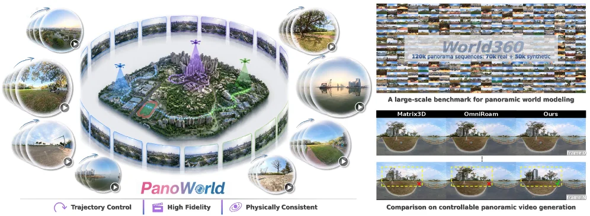
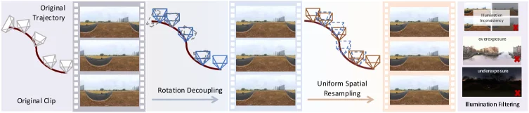
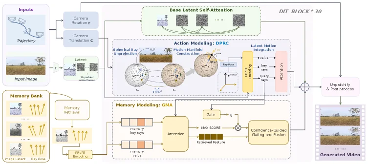
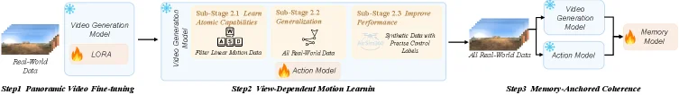
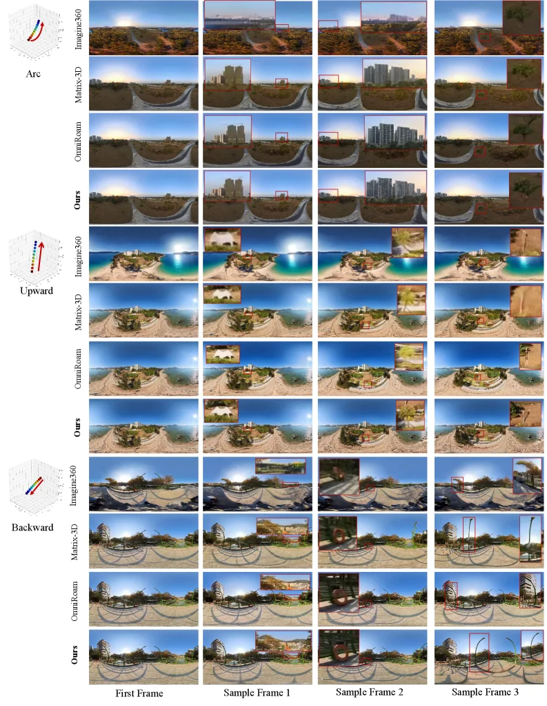

# PanoWorld: Real-World Panoramic Generation

[arXiv](https://arxiv.org/abs/2607.09661) · [HuggingFace](https://huggingface.co/papers/2607.09661) · ▲5

## Abstract (verbatim)

> In this work, we aim to address the challenge of long-range memory in panoramic world models by exploiting the rotation-equivariant property of omnidirectional representations, where rotation can be treated as an implicit geometric transformation.Building on this insight, we propose PanoWorld, which simplifies camera trajectories into translations via fixed headings for both current-action modeling and long-range memory through Dense Panoramic Ray-Conditioning (DPRC) and Geometry-aware Memory Augmentation (GMA).Then, a three-stage training pipeline is introduced to progressively optimize each component. To better evaluate physical consistency under large-scale spatial variations and diverse illumination conditions, where existing datasets are relatively stable, we construct World360, a large-scale dataset consisting of both real-world video clips collected via panoramic unmanned aerial vehicles and high-quality simulated clips generated by AirSim360.Extensive experiments on World360 demonstrate the effectiveness of PanoWorld, outperforming alternative methods by a large margin.Our models, training code, and dataset will be publicly available. More information can be found on our project page: https://lihaoy-ux.github.io/panoworld-page/.

## Background

### Background Analysis  

**1. Technical Background and Real-world Needs**  
Recent advances in panoramic world models have shown great potential in robotics (e.g., autonomous driving, drone navigation) and dynamic environment modeling. These models capture full-field-of-view visual information to help agents understand their surroundings and make decisions. For instance, self-driving cars need real-time perception of obstacles and road changes in 360 degrees, while drones require consistent panoramic video generation for environmental monitoring. However, existing methods struggle to maintain physical consistency (e.g., geometry and lighting) under large-scale spatial variations (e.g., rotation, illumination changes), which becomes a key bottleneck for practical applications.  

**2. Limitations of Previous Methods**  
Traditional panoramic modeling relies on memory mechanisms (e.g., 3D point clouds or KV caches) to retrieve historical information for spatiotemporal consistency. However, these methods assume perspective projection, ignoring the unique properties of panoramic data (e.g., equirectangular projection, ERP). For example, when the viewpoint rotates, perspective-based memory retrieval fails due to severe distortion, leading to inconsistent results. Additionally, existing datasets are mostly indoor or simulation-based with stable physical conditions, making them insufficient for evaluating real-world performance.  

**3. Solution Proposed in This Paper**  
To address these issues, PanoWorld introduces a framework that leverages the rotation-equivariant property of panoramic representations. Specifically, rotation only alters the distortion pattern without destroying scene content, so it can be treated as an implicit geometric transformation while explicitly modeling translation. PanoWorld solves key challenges with two modules:  
- **Dense Panoramic Ray-Conditioning (DPRC):** Provides dense geometric conditioning for accurate current-action modeling.  
- **Geometry-aware Memory Augmentation (GMA):** Enhances memory retrieval robustness and spatiotemporal consistency in panoramic space.  
A three-stage training pipeline is also introduced to optimize components progressively. The World360 dataset, combining real-world drone videos and high-fidelity simulations, supports training and evaluation under diverse physical conditions.  

**4. Key Differences from Previous Work**  
Unlike traditional methods relying on perspective projection assumptions, PanoWorld directly exploits the rotation-equivariant property of panoramic data, simplifying camera motion modeling. Additionally, World360’s diversity (covering real-world physical variations) addresses the limitations of existing datasets, enabling superior performance in complex scenarios. This data-driven design approach is the core innovation distinguishing PanoWorld from others.

## Method, Figure by Figure

> Figure 1: PanoWorld is a novel framework for high-fidelity and controllable panoramic video generation. Our approach achieves precise trajectory control across complex movements while maintaining high-fidelity visual synthesis with physical consistency in diverse real-world environments.

This figure, Figure 1 from the paper "PanoWorld: Real-World Panoramic Generation," comprehensively illustrates the core concepts, key features, and advantages of the PanoWorld framework for high-fidelity and controllable panoramic video generation. We can break down the image into two main sections: the left side provides an overview of the PanoWorld framework and its core characteristics, while the right side introduces its dataset, World360, and presents result comparisons for controllable panoramic video generation.

Starting with the left section:
*   **Central Area**: This displays a 3D city model surrounded by a series of panoramic images. This represents PanoWorld's goal of generating or processing continuous panoramic views around a central scene. The panoramas appear to be arranged along a circular trajectory, suggesting camera movement around the central scene.
*   **Surrounding Panoramic Images**: These smaller images showcase various environmental scenes, such as urban landscapes, natural scenery (trees, grasslands), and bodies of water. Each small image has a play button, possibly indicating these are video frames or dynamically viewable panoramas. This indicates PanoWorld can handle diverse real-world environments.
*   **Three Core Features Below**: These are labeled "Trajectory Control," "High Fidelity," and "Physically Consistent."
    *   **Trajectory Control (轨迹控制)**: The icon is a curved arrow, signifying PanoWorld's ability to achieve precise control over the camera trajectory. According to the abstract, this involves simplifying complex camera motions into translations by fixing the heading.
    *   **High Fidelity (高保真度)**: The icon is a film strip, indicating that PanoWorld generates visually realistic and detailed content.
    *   **Physically Consistent (物理一致性)**: The icon is an eye or lens, signifying that PanoWorld maintains consistency with physical laws (e.g., lighting, shadows) across different frames.
*   **Information Flow**: Overall, the left diagram conveys the core idea of the PanoWorld framework: it processes or generates panoramic images around a central scene to achieve precise trajectory control, while ensuring high fidelity and physical consistency in the generated content.

Moving to the right section:
This part is divided into two sub-figures, introducing the World360 dataset and the result comparisons, respectively.

**Upper Part: World360 Dataset Introduction**
*   **Top Large Image**: Titled "World360," with a subtitle stating "120k panorama sequences: 70k real + 50k synthetic." This indicates World360 is a large-scale dataset combining real-world captured and high-quality simulated data. The image itself is a mosaic of many small panoramic thumbnails, showcasing the dataset's diversity and scale.
*   **Text Below**: "A large-scale benchmark for panoramic world modeling." This clarifies that World360 serves not only as a dataset but also as a benchmark for evaluating panoramic modeling methods.
*   **Data Source**: The paper abstract mentions World360 consists of real-world video clips collected via panoramic unmanned aerial vehicles and high-quality simulated clips generated by AirSim360.

**Lower Part: Comparison of Controllable Panoramic Video Generation Results**
*   **Title**: "Comparison on controllable panoramic video generation."
*   **Comparison Objects**: The chart compares three methods: Matrix3D, OmniRoam, and "Ours" (i.e., PanoWorld).
*   **Displayed Content**: The chart is divided into two rows, each showing panoramic video frames generated by the three methods. These frames appear to be from a street-like scene, possibly involving camera translation or rotation.
*   **Analysis**:
    *   In the first row (perhaps a specific scene or time point), the results from all three methods look relatively similar, showing streets, buildings, and sky.
    *   In the second row (another scene, time point, or a different processing of the same scene), clear differences are visible. For example, the position or appearance of certain objects (like trees, buildings) in the results from "Matrix3D" and "OmniRoam" might differ from those in "Ours." Yellow dashed boxes highlight these difference areas, and red/green markers might indicate specific points of discrepancy or interest.
*   **Conclusion**: From the visual comparison, "Ours" (PanoWorld) appears to generate results that are visually superior or more consistent with expectations, supporting the paper's claim of "outperforming alternative methods by a large margin." This comparison aims to demonstrate PanoWorld's superiority in controllable panoramic video generation, especially in handling large-scale spatial variations and diverse lighting conditions while maintaining physical consistency.

In summary, this figure clearly communicates the core functionality of the PanoWorld framework: it is a framework for high-fidelity and controllable panoramic video generation. It leverages the rotation-equivariant properties of panoramic representations to simplify camera trajectories and uses DPRC (Dense Panoramic Ray-Conditioning) and GMA (Geometry-aware Memory Augmentation) to handle long-range memory issues. The method is evaluated on the large-scale World360 dataset, and experimental results show it significantly outperforms existing methods like Matrix3D and OmniRoam. The various components in the figure collectively demonstrate the method's concept, the scale and diversity of its dataset, and its excellent performance in practical tasks.

---

> Figure 2: The Data Curation Pipeline. The pipeline converts raw panoramic clips into high-quality sequences by: (1) Rotation Decoupling to isolate pure translation; (2) Uniform Spatial Resampling to standardize motion scales; and (3) Illumination Filtering to ensure exposure consistency.

This figure illustrates the "Data Curation Pipeline" from the paper "PanoWorld: Real-World Panoramic Generation." The pipeline's purpose is to process raw panoramic video clips into high-quality sequences for subsequent model training or analysis. The data flow is from left to right, sequentially through three main processing steps.

First, the leftmost section shows the "Original Trajectory" and "Original Clip." This represents an unprocessed input data, consisting of a panoramic video clip with multiple frames. The camera's motion trajectory (red curve) involves a complex combination of rotation and translation. The camera pose icons (white polyhedra) illustrate the camera's orientation changes along the trajectory.

Next is the first processing step: "Rotation Decoupling." This step aims to decompose the complex motion (a combination of rotation and translation) to isolate "pure translation." In the diagram, after this step, the rotational component of the original camera trajectory (red curve) and the camera pose icons (white polyhedra) is eliminated or fixed, leaving primarily translational motion. The new camera trajectory (blue dashed line) and camera icons (blue polyhedra) show a simpler, more linear or smoothly curved translational path. The output is the "after rotation decoupling" clip, where the camera's motion is simplified to primarily translation, thus isolating the complexity introduced by rotation.

Then comes the second processing step: "Uniform Spatial Resampling." This step aims to "standardize motion scales." In the diagram, the clip after rotation decoupling (with blue dashed trajectory and blue polyhedra) serves as input. After resampling, the output camera trajectory (brown solid line) and camera icons (brown polyhedra) show more uniformly distributed sampling points. This means that the data is resampled in space to make the motion speed or scale more consistent across different clips, facilitating subsequent processing.

Finally, the third processing step is "Illumination Filtering." This step aims to "ensure exposure consistency." In the diagram, the clip after uniform spatial resampling serves as input. This step identifies and processes frames with unstable lighting conditions, such as overexposure, underexposure, or rapid illumination changes (as shown on the far right with examples marked with red "X"s). After this step, the output sequence data has more consistent lighting conditions, thereby improving data quality.

In summary, this figure reveals how the data preprocessing in the PanoWorld method works: it first simplifies the camera's complex motion through rotation decoupling, transforming it into primarily translational motion; then it standardizes the scale of these motions through uniform spatial resampling; and finally, it ensures consistency in lighting conditions through illumination filtering. The data processed in this way is more suitable for training panoramic world models that need to handle long-range memory and physical consistency.

---

> Figure 3: PanoWorld Network Architecture. Built on the Wan2.2 backbone, PanoWorld employs a triple-stream DiT that fuses visual self-attention, DPRC-based action modeling, and a GMA module for memory-anchored synthesis via a shared geometric manifold.

This diagram illustrates the network architecture of PanoWorld, which is built upon the Wan2.2 backbone network and employs a three-stream DiT (Diffusion Transformer) to fuse visual self-attention, DPRC-based action modeling, and GMA memory modules, synthesizing memory-anchored outputs through a shared geometric manifold.

First, let's examine the input section. The "Inputs" panel on the left shows that the model receives three main inputs: a diagram representing the camera trajectory (Trajectory), the camera's rotation parameters (Camera Rotation r), the camera's translation parameters (Camera Translation t), and an input image (Input Image). These inputs collectively define the perspective and content of the scene to be generated or predicted.

Next, the data flows through several key modules:

1.  **Base Latent Self-Attention**: The input image is first processed into a latent representation (Latent), which, along with the camera parameters, is fed into the "Base Latent Self-Attention" module. This module handles the basic visual features and spatial relationships of the image and forms the foundation of the DiT.

2.  **Action Modeling: DPRC (Action Modeling: DPRC)**: This module is one of PanoWorld's core innovations, used to process current actions (i.e., changes in the camera's perspective).
    *   It receives the latent representation (Latent) and camera parameters.
    *   "Spherical Ray Unprojection" maps the image's planar pixels to rays on a sphere, leveraging the rotation-equivariant properties of panoramic images.
    *   "Motion Manifold Construction" builds a motion model on this spherical manifold based on the camera's translation and rotation parameters.
    *   Finally, through "Ray Encoding" and "Attention" mechanisms, action information is integrated into the latent representation, generating the result of "Latent Motion Integration."

3.  **Memory Modeling: GMA (Memory Modeling: GMA)**: This module handles long-term memory to achieve consistent scene generation.
    *   It retrieves relevant memories from a "Memory Bank," which stores previously generated image latent representations (Image Latent) and corresponding ray information (Ray Pose).
    *   "Memory Retrieval" extracts relevant memory entries from the memory bank based on the current latent representation and ray information.
    *   Within the "GMA" module, the retrieved memories (memory key, rays, and memory value) are processed along with the current latent representation through an attention mechanism. A "Gate" mechanism and "MAX SCORE" calculation are used to select the most relevant memory features (Retrieved Feature).
    *   Finally, the "Confidence-Guided Blending and Fusion" module fuses these retrieved memory features with the current features to enhance the coherence and consistency of the generation.

4.  **DiT BLOCK * 30**: The outputs of the three modules mentioned above (Base Latent Self-Attention, DPRC Action Modeling, GMA Memory Modeling) are integrated into a sequence of 30 DiT blocks. These DiT blocks further process and fuse these features, gradually generating the final latent representation.

5.  **Unpatchify & Post process (Unpatchify & Post process)**: After being processed by all DiT blocks, the final latent representation is converted back to image space (unpatchified) and passed through post-processing steps to generate the final "Generated Video" (Generated Video).

The entire process demonstrates how PanoWorld, by fusing visual self-attention, DPRC-based action modeling, and GMA memory modules, leverages the rotation-equivariant properties of panoramic representations to address long-term memory challenges and generate physically consistent panoramic videos. Data starts from the input, goes through multiple feature processing and fusion modules, and ultimately outputs the generated video.

In summary, PanoWorld operates as follows:
*   It simplifies the camera trajectory to translation under a fixed orientation, utilizing the rotation-equivariant properties of panoramic representations.
*   It uses the DPRC module to explicitly model the impact of current camera actions (translation and rotation) on the perspective.
*   It uses the GMA module to retrieve and fuse relevant long-term memories from the memory bank to maintain scene consistency.
*   Through a backbone network consisting of 30 DiT blocks, these features are iteratively processed and fused, ultimately generating high-quality panoramic videos.

---

> Figure 4: Overview of the progressive three-stage pipeline. Stage 1 focuses on geometric adaptation for panoramic video generation; Stage 2 targets view-dependent motion learning ; and Stage 3 enables memory-anchored coherence to enforce long-term temporal consistency.

This figure illustrates the overview of the proposed three-stage progressive training pipeline in the paper "PanoWorld: Real-World Panoramic Generation," aimed at addressing the long-range memory challenge in panoramic world models.

**Step 1: Panoramic Video Fine-tuning**
The input to this stage is "Real-World Data," depicted as a sequence of panoramic images on the far left. This data is fed into a "Video Generation Model." Within this model, a technique called "LORA" (indicated by a flame icon, typically representing some optimization or fine-tuning method) is used to fine-tune the model. The goal of this stage is to perform geometric adaptation for panoramic video generation, making the model capable of handling and generating panoramic content with specific geometric properties. The output from this stage flows to the next stage.

**Step 2: View-Dependent Motion Learning**
This stage receives the "Video Model" fine-tuned in the previous step. It is further divided into three sub-stages:
*   **Sub-Stage 2.1: Learn Atomic Capabilities**: This sub-stage aims to have the model learn basic, independent motion capabilities. It uses "Filtered Linear Motion Data" as input and might involve some fundamental transformations (as suggested by the AB CD diagram).
*   **Sub-Stage 2.2: Generalization**: In this sub-stage, the model generalizes its learning using "All Real-World Data" to improve its adaptability to different scenes and motions. An "Action Model" (flame icon) is shown associated with this sub-stage, indicating that this stage might involve learning specific actions or behavioral patterns.
*   **Sub-Stage 2.3: Improve Performance**: The goal of this sub-stage is to enhance the model's performance, particularly for tasks requiring precise control labels. It uses "Synthetic Data with Precise Control Labels" as input (as indicated by the AirSim360 reference, suggesting the use of simulated data). After processing through these three sub-stages, the model outputs "All Real-World Data," implying that the model can now handle and generate complex real-world panoramic video sequences and is ready for the third stage.

**Step 3: Memory-Anchored Coherence**
The input to this stage is "All Real-World Data," along with two models: the "Video Generation Model" and the "Action Model." These two models work together to achieve "memory-anchored coherence," ensuring that the generated video maintains temporal consistency over long durations. Ultimately, the interaction between these models and the data leads to the formation of a "Memory Model" (flame icon), which is responsible for storing and utilizing long-term memory information to maintain the coherence and consistency of the video content.

In summary, this figure reveals how the PanoWorld method operates:
1.  First, a video generation model is fine-tuned using real-world data to adapt it to the panoramic generation task.
2.  Then, view-dependent motion is learned through three sub-stages: initially learning basic motion capabilities, then generalizing on real-world data, and finally improving performance using synthetic data with precise labels.
3.  Finally, a model with long-term memory capabilities is constructed by combining the video generation model, action model, and all real-world data, ensuring high temporal and spatial coherence in the generated video.

This three-stage pipeline progressively optimizes each component to achieve high-quality, coherent panoramic video generation.

---

> Figure 5: Qualitative comparison on real-world outdoor sequences.

This figure (Figure 5) is a qualitative comparison from the paper "PanoWorld: Real-World Panoramic Generation," showcasing the performance of the proposed method (Ours) against existing methods (Imagine360, Matrix-3D, OmniRoom) in generating panoramic images for real-world outdoor sequences. The caption "Figure 5: Qualitative comparison on real-world outdoor sequences" accurately describes its content.

**Overall Structure and Information Flow of the Figure:**

The image is organized as a grid divided into three main sections (row groups), each corresponding to a different type of camera motion: Arc, Upward, and Backward. These motion types are visually represented on the far left with 3D coordinate systems and arrows to help understand the geometric characteristics of each motion.

1.  **Left-side Motion Type Labels:**
    *   **Arc (Curved Motion):** Indicates the camera moves along an arc path, maintaining a roughly constant altitude with changing direction. The corresponding 3D diagram shows a curved trajectory on a horizontal plane.
    *   **Upward (Vertical Motion):** Indicates the camera moves vertically upwards, typically simulating an ascent or change in viewing angle from above. The corresponding 3D diagram shows an upward arrow.
    *   **Backward (Linear Motion):** Indicates the camera moves straight backward with a relatively fixed direction. The corresponding 3D diagram shows a backward arrow.

2.  **Top-row Method Labels:**
    Within each motion type section, different methods are listed from top to bottom:
    *   **Imagine360:** A baseline method.
    *   **Matrix-3D:** Another baseline method.
    *   **OmniRoom:** A third baseline method.
    *   **Ours:** The method proposed in the paper (PanoWorld).

3.  **Bottom-row Frame Labels:**
    Each column represents a different frame from a video sequence, from left to right:
    *   **First Frame:** The initial frame of the video sequence, serving as a reference.
    *   **Sample Frame 1:** An intermediate frame in the sequence.
    *   **Sample Frame 2:** Another intermediate frame in the sequence.
    *   **Sample Frame 3:** A subsequent frame in the sequence.

**Revealing How the Method Works:**

This figure visually demonstrates how PanoWorld handles different types of camera motions and generates high-quality panoramic images by comparing its results with baseline methods. Specifically:

*   **Adaptability to Different Motion Types:** The figure categorizes results by the three motion types (Arc, Upward, Backward), indicating that PanoWorld can handle diverse camera trajectories. Observing the generated results for each motion type allows for an assessment of the method's adaptability.
*   **Comparison with Baseline Methods:** For each motion type and every sample frame, the results from PanoWorld (Ours) are displayed side-by-side with those from Imagine360, Matrix-3D, and OmniRoom. This side-by-side comparison enables intuitive identification of PanoWorld's advantages in terms of image quality, detail preservation, and lighting consistency.
*   **Red Box Annotations:** Red boxes highlight specific regions of interest in many generated panoramas. These regions are typically used to emphasize improvements of PanoWorld over other methods in detail restoration, structural integrity, or visual realism. For example, in "Sample Frame 1" under Arc motion, a red box might highlight the clarity of distant buildings or the continuity of the road.
*   **Assessment of Image Quality:** By observing the generated images, one can evaluate several aspects:
    *   **Detail Clarity:** Are the regions highlighted by PanoWorld (e.g., within red boxes) clearer and less blurry than those from baseline methods?
    *   **Structural Integrity:** Do the generated scene structures (e.g., buildings, roads, trees) appear more realistic and less distorted or broken compared to other methods?
    *   **Lighting Consistency:** Does the lighting condition remain consistent or change naturally across different frames?
    *   **Overall Visual Realism:** Do the generated images look more lifelike and closer to real-world observations?

**Conclusion:**

This qualitative comparison figure clearly demonstrates the superiority of the proposed PanoWorld method in real-world outdoor panoramic generation tasks. By categorizing results by different camera motion types (Arc, Upward, Backward) and comparing them frame-by-frame with existing methods (Imagine360, Matrix-3D, OmniRoom), the figure reveals that PanoWorld can generate panoramas that are clearer, more detailed, more structurally intact, and have more consistent lighting. The red box annotations further emphasize PanoWorld's improvements in key areas, strongly supporting the paper's argument that leveraging rotation-equivariant properties and the proposed Dense Panoramic Ray-Conditioning (DPRC) and Geometry-aware Memory Augmentation (GMA) techniques effectively addresses the long-range memory challenge in panoramic world models and achieves excellent performance in physical consistency.
