# Weak-to-Strong Generalization via Direct On-Policy Distillation

[arXiv](https://arxiv.org/abs/2607.05394) · [HuggingFace](https://huggingface.co/papers/2607.05394) · ▲131

## 摘要（原文）

> Reinforcement learning with verifiable rewards (RLVR) is a powerful recipe for improving language-model reasoning, but it is expensive to repeat on every new strong model because the target model must generate many rollouts during training. As models scale, post-training itself becomes a bottleneck. We study a weak-to-strong alternative: run RL on a smaller model where rollouts are cheaper, then reuse what that RL run learned to improve a stronger target model. Directly distilling the post-RL weak teacher is not enough, because the teacher's final policy mixes useful RL gains with the limitations of the smaller model. We propose Direct On-Policy Distillation (Direct-OPD), which transfers the teacher's RL-induced policy shift instead. Direct-OPD compares the post-RL teacher with its own pre-RL reference and treats their log-ratio as a dense implicit reward for the student. In plain terms, the checkpoint pair tells us which actions RL made the weak model more or less likely to take, and Direct-OPD applies that signal on the stronger student's own on-policy states. This directly reuses the weak model's RL supervision signal without running sparse-reward RL on the target model. Empirically, Direct-OPD consistently leverages weaker teachers to improve stronger target models; notably, it boosts Qwen3-1.7B from 48.3% to 58.3% on AIME 2024 in just 4 hours on 8 A100 GPUs. It outperforms step-matched direct RL and enables the sequential composition of multiple policy shifts. Our results show that RL outcomes can be reused across model scales as implicit reward signals, not merely as final models to imitate.

## 摘要（中译）

强化学习与可验证奖励（reinforcement learning with verifiable rewards, RLVR）是改进语言模型推理能力的有效方法，但由于目标模型在训练期间必须生成大量滚动（rollouts），因此在每个新的强模型上重复该方法成本高昂。随着模型的扩展，训练后（post-training）本身成为瓶颈。我们研究了一种从弱到强的替代方案：在较小的模型上运行强化学习（RL），其中滚动成本更低，然后重用该强化学习运行所学到的内容来改进更强的目标模型。直接蒸馏训练后的弱教师模型是不够的，因为教师的最终策略混合了有用的强化学习收益和较小模型的局限性。我们提出了直接策略蒸馏（Direct On-Policy Distillation, Direct-OPD），它转而转移教师的强化学习诱导的策略偏移。Direct-OPD将训练后的弱教师模型与其自身的预训练（pre-RL）参考进行比较，并将它们的对数比率视为学生的密集隐式奖励。简单来说，检查点对告诉我们强化学习使弱模型更可能或更不可能采取哪些行动，而Direct-OPD将该信号应用于更强的学生模型自身的策略状态。这直接重用了弱模型的强化学习监督信号，而无需在目标模型上运行稀疏奖励的强化学习。实证表明，Direct-OPD始终利用较弱的教师模型来改进更强的目标模型；值得注意的是，它在8个A100 GPU上仅用4小时就将Qwen3-1.7B在AIME 2024上的表现从48.3%提升到58.3%。它优于步骤匹配的直接强化学习，并支持多个策略偏移的顺序组合。我们的结果表明，强化学习的结果可以作为隐式奖励信号跨模型规模重用，而不仅仅是作为最终模型来模仿。

## 背景剖析

### 背景剖析  

**1. 技术背景与需求**  
近年来，强化学习结合可验证奖励（RLVR）成为提升大语言模型推理能力的主流方法（如DeepSeek-R1、JustRL）。其核心是通过让模型在环境中生成行为（rollouts）、接收反馈并优化策略，从而增强推理表现。然而，这种方法存在显著瓶颈：模型越大，每次训练的成本越高——更大的模型生成行为更慢，且需要更多计算资源。随着模型规模持续扩大，从头开始对每个强模型重复RLVR训练变得不可行，因此亟需一种更高效的后训练方法。  

**2. 先前方法的局限**  
传统做法是直接模仿弱模型的最终策略（如“策略蒸馏”），但这一方法存在根本缺陷：弱模型的最终策略混合了RL带来的有用改进和模型自身的能力限制。例如，当目标模型（学生）已经比弱模型更强时，模仿弱模型的策略可能会覆盖学生原有的优势行为（如图1(a)所示，强模型被弱模型的策略拖垮）。此外，直接在强模型上运行RL成本高昂，而现有方法无法复用弱模型RL训练中已学到的监督信号。  

**3. 本文的解决方案**  
论文提出“直接策略蒸馏（Direct-OPD）”，其核心思想是**转移弱模型RL训练带来的“策略变化”，而非弱模型本身**。具体而言，通过对比弱模型在RL训练前后的行为差异（即“策略偏移”），提取RL对其行为的修改信号，并将这一信号作为隐式奖励应用于强模型（学生）的训练中。这种方法避免了在强模型上重新运行RL，同时保留了弱模型RL训练的有效监督信息。实验表明，该方法能显著提升强模型的性能（如Qwen3-1.7B在AIME 2024上的得分从48.3%提升至58.3%），且成本仅为直接RL的几分之一。  

**4. 与前人工作的关键差异**  
与传统的策略蒸馏不同，Direct-OPD不依赖弱模型的最终策略，而是聚焦于“策略变化”这一更本质的监督信号。此外，它不需要显式训练奖励模型或依赖弱模型与强模型的高重叠度，因此能跨模型规模和思维模式有效迁移。这一思路将RL的成果从“单一模型优化”转变为“可复用的跨尺度信号”，为大规模模型的高效后训练提供了新方向。

## 方法图解

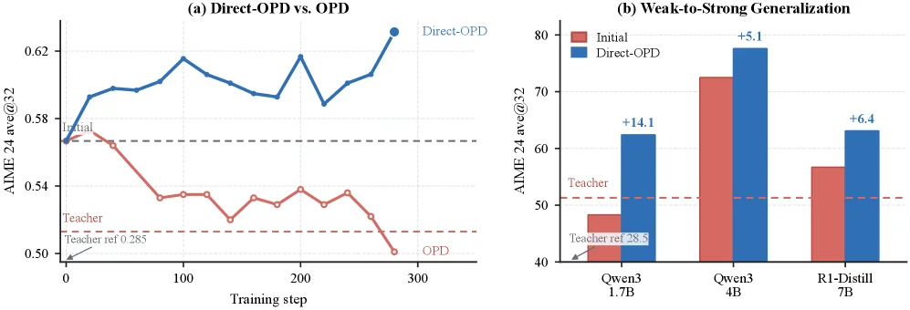

> Figure 1 : Direct-OPD transfers the effect of small-model RL rather than imitating the small model. (a) Starting from R1-Distill-7B, vanilla OPD toward the post-RL JustRL-1.5B teacher degrades performance, whereas Direct-OPD transfers the JustRL-1.5B − - R1-Distill-1.5B policy shift and improves the student. (b) The same policy shift improves Qwen3-1.7B, Qwen3-4B, and R1-Distill-7B on AIME 2024, including students whose initial accuracy already exceeds the post-RL teacher.

这张图分为左右两个部分，(a)和(b)，分别从不同角度展示了Direct-OPD方法的有效性。

首先看左边的子图(a)，标题是“Direct-OPD vs. OPD”。这张图是一个折线图，横轴是“Training step”（训练步数），纵轴是“AIME 24 ave@32”（在AIME 2024基准测试上的平均得分，可能是指前32个样本的平均表现）。图中有两条主要的曲线：
1.  蓝色的曲线代表“Direct-OPD”方法。这条曲线从初始点（标记为“Initial”的虚线附近，大约0.57左右）开始，随着训练步数的增加，整体呈现出上升趋势，最终在300步左右达到了约0.63的得分。这表明Direct-OPD方法在训练过程中性能不断提升。
2.  红色的曲线代表“OPD”（Vanilla On-Policy Distillation，即普通的策略蒸馏）方法。这条曲线从同样的初始点开始，但随着训练步数的增加，性能逐渐下降，最终在300步左右降到了约0.50的得分，甚至低于图中标记的“Teacher ref 0.285”（教师模型的参考得分，这里可能是指经过RL训练后的小模型教师的得分，或者是另一个基准）。这说明直接模仿小模型（即OPD方法）会导致性能退化。

图中还有一条黑色的虚线，标记为“Teacher”，它位于红色曲线的下方，大约在0.53左右。这条线可能代表了用于蒸馏的小模型教师（JustRL-1.5B）的性能。关键在于，Direct-OPD没有简单地模仿这个小模型教师，而是学习了教师模型相对于其自身预训练版本（R1-Distill-1.5B）的策略变化（policy shift），从而实现了性能提升。

接下来看右边的子图(b)，标题是“Weak-to-Strong Generalization”（弱到强的泛化）。这是一个柱状图，用于比较不同模型在应用Direct-OPD方法前后的性能。横轴是不同的学生模型：“Qwen3 1.7B”、“Qwen3 4B”和“R1-Distill 7B”。纵轴同样是“AIME 24 ave@32”。
每个模型对应两根柱子：
1.  红色的柱子标记为“Initial”，代表学生模型在应用Direct-OPD之前的初始性能。
2.  蓝色的柱子代表应用了Direct-OPD方法之后的性能。蓝色柱子上方标注了性能提升的数值，例如Qwen3 1.7B提升了+14.1，Qwen3 4B提升了+5.1，R1-Distill 7B提升了+6.4。

图中还有一条红色的虚线，标记为“Teacher”，大约在50分左右。这条线代表了用于蒸馏的小模型教师（JustRL-1.5B）的性能。值得注意的是，对于Qwen3 4B和R1-Distill 7B这两个模型，它们的初始性能（红色柱子）已经超过了教师模型的性能（红色虚线），但Direct-OPD仍然能够进一步提升它们的性能。这证明了Direct-OPD方法的有效性，即使学生模型初始性能较强，也能从其更小的教师模型的RL训练中获得益处。

总结来说，这张图揭示了Direct-OPD方法的具体运作方式和效果：
-   **方法运作方式**：Direct-OPD不是简单地模仿小模型教师的行为（如OPD那样），而是提取小模型教师在经过强化学习（RL）训练后，其策略相对于其自身预训练状态的变化（即log-ratio作为隐式奖励）。然后将这个策略变化信号应用到更强的学生模型上，让学生模型在自己的策略状态下学习这个信号，从而实现性能提升。
-   **结果**：
    -   在图(a)中，Direct-OPD方法在训练过程中性能持续提升，而直接的策略蒸馏（OPD）导致性能下降。
    -   在图(b)中，Direct-OPD方法显著提升了不同规模的强学生模型（Qwen3 1.7B, Qwen3 4B, R1-Distill 7B）在AIME 2024基准测试上的性能。即使学生模型的初始性能已经超过了教师模型，Direct-OPD仍然能有效提升它们。

这张图清楚地展示了Direct-OPD方法如何通过转移小模型RL带来的策略变化，而不是模仿小模型本身，来实现弱到强的泛化，并且在多个模型上取得了优异的提升效果。

---

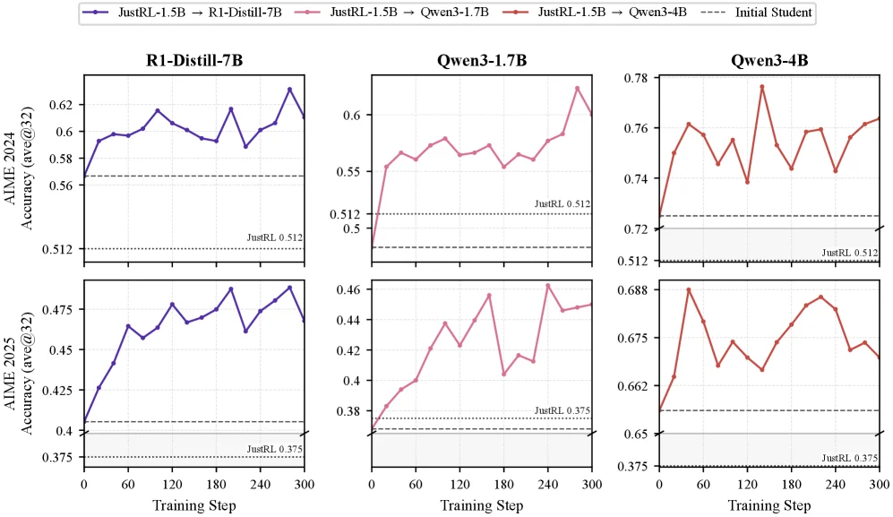

> Figure 2 : Direct-OPD transfers RL-induced policy shifts across teacher pairs and student families. Left: R1-Distill-1.5B → \rightarrow JustRL-1.5B transfer into R1-Distill-7B, Qwen3-1.7B, and Qwen3-4B, evaluated on AIME 2024 and AIME 2025. Right: Nemotron-1.5B → \rightarrow QuestA-Nemotron-1.5B transfer into R1-Distill-7B and Qwen3-1.7B on AIME 2024. The two teacher pairs come from different training data and pipelines, showing that Direct-OPD is not specific to a single post-RL teacher.

这张图（图2）来自论文《Weak-to-Strong Generalization via Direct On-Policy Distillation》，展示了**Direct-OPD（直接策略蒸馏）**方法如何将“弱模型通过强化学习（RL）获得的策略偏移”迁移到“更强的目标模型”上，从而提升强模型的推理能力（以AIME基准测试的准确率为指标）。我们分部分拆解这张图：

### 1. 图的结构与组件
图分为**上下两行**（对应两个不同的AIME基准：AIME 2024和AIME 2025），**三列**（对应三个不同的“目标学生模型”：R1-Distill-7B、Qwen3-1.7B、Qwen3-4B）。每个子图展示了一个“教师-学生”迁移过程的结果：

- **横轴（Training Step）**：训练步数（从0到300），表示Direct-OPD在目标学生模型上的训练过程。
- **纵轴（Accuracy (ave@32)）**：模型在AIME测试集上的平均准确率（@32可能指测试时的采样或评估设置）。
- **曲线与图例**：
  - 不同颜色的曲线对应不同的“教师-学生”迁移对（如蓝色：JustRL-1.5B → R1-Distill-7B；粉色：JustRL-1.5B → Qwen3-1.7B；红色：JustRL-1.5B → Qwen3-4B）。
  - 虚线（Initial Student）：目标学生模型**未经过Direct-OPD训练**时的初始准确率（即“JustRL”的基准线，如图例中的“JustRL 0.512”或“JustRL 0.375”，表示初始性能）。
- **子图分组**：
  - 上半部分（AIME 2024）：展示R1-Distill-1.5B作为“弱教师”（先经过JustRL的RL训练），其策略偏移被蒸馏到三个更强的目标模型（R1-Distill-7B、Qwen3-1.7B、Qwen3-4B）上的效果。
  - 下半部分（AIME 2025）：与上半部分类似，但评估的是另一个AIME基准（AIME 2025），验证方法的泛化性。

### 2. 方法的运作逻辑（从图中如何理解Direct-OPD？）
Direct-OPD的核心是**“迁移弱模型的RL策略偏移”**，而非直接迁移弱模型的最终策略。具体来说：

- **步骤1：训练“弱教师”**：选择一个较小的模型（如JustRL-1.5B），用RL（这里是JustRL）训练它，使其获得“策略偏移”（即RL让它比初始模型更倾向于某些动作/决策）。
- **步骤2：提取策略偏移**：比较“弱教师”的**后RL状态**（经过RL训练后的模型）和它的**前RL状态**（初始的JustRL模型），计算它们的“对数概率比”（log-ratio）——这个比率反映了“RL让弱模型更可能/更不可能采取哪些动作”。
- **步骤3：蒸馏到强学生**：将这个“策略偏移信号”（对数概率比）作为**隐式奖励**，应用到更强的目标学生模型（如R1-Distill-7B、Qwen3-1.7B、Qwen3-4B）的**自身On-Policy状态**上（即学生在训练时的状态分布）。这样，强模型不需要自己做昂贵的RL训练，而是直接复用弱模型的RL监督信号。

从图中曲线的变化可以看出：**所有迁移后的模型准确率都显著高于“初始学生”的虚线**，说明Direct-OPD成功将弱模型的RL收益迁移到了强模型上。例如：
- 对于R1-Distill-7B（上半部分左图），蓝色曲线（JustRL-1.5B→R1-Distill-7B）的准确率从初始的~0.56上升到~0.62以上，远高于虚线（~0.512）。
- 对于Qwen3-1.7B（上半部分中图），粉色曲线的准确率从~0.512上升到~0.6以上，同样远高于虚线。
- 对于Qwen3-4B（上半部分右图），红色曲线的准确率从~0.72上升到~0.76以上，也显著高于虚线。

### 3. 结果与结论（从图中能得出什么？）
- **性能提升**：所有目标模型（R1-Distill-7B、Qwen3-1.7B、Qwen3-4B）在AIME 2024和AIME 2025上的准确率都因Direct-OPD而显著提升，且提升幅度远大于初始学生的性能。
- **泛化性**：不同教师对（如JustRL-1.5B→R1-Distill-7B、JustRL-1.5B→Qwen3-1.7B等）和不同学生模型家族（R1-Distill、Qwen3）都能受益，说明Direct-OPD不依赖于特定的教师或学生模型。
- **效率**：虽然图中未直接显示时间，但论文摘要提到“仅用4小时（8块A100 GPU）就将Qwen3-1.7B从48.3%提升到58.3%”，结合图中训练步数（0-300），说明Direct-OPD的训练效率高，避免了在强模型上重复昂贵的RL训练。

总结：这张图直观展示了Direct-OPD的核心思想——**“迁移弱模型的RL策略偏移，而非直接迁移策略”**，并通过准确率曲线证明了该方法能有效提升强模型的推理能力，且具有跨教师、跨学生模型的泛化性。

---

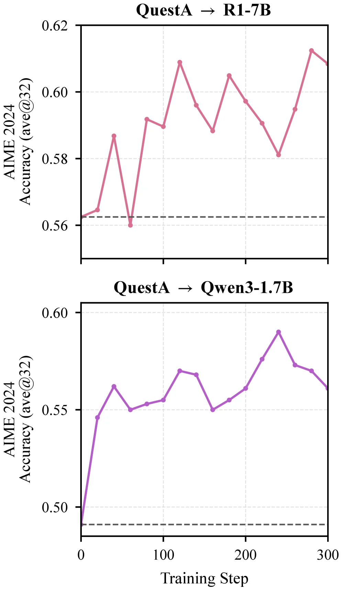

> Figure 2 : Direct-OPD transfers RL-induced policy shifts across teacher pairs and student families. Left: R1-Distill-1.5B → \rightarrow JustRL-1.5B transfer into R1-Distill-7B, Qwen3-1.7B, and Qwen3-4B, evaluated on AIME 2024 and AIME 2025. Right: Nemotron-1.5B → \rightarrow QuestA-Nemotron-1.5B transfer into R1-Distill-7B and Qwen3-1.7B on AIME 2024. The two teacher pairs come from different training data and pipelines, showing that Direct-OPD is not specific to a single post-RL teacher.

这张图（对应论文中的Figure 2的“Left”部分）展示了**Direct - OPD方法如何将弱教师模型的RL诱导策略转移应用到强学生模型上**，以提升学生在AIME 2024任务上的推理准确率。

### 图的组件与信息流动
- **上下两个子图**：分别对应不同的“教师 - 学生”转移对。
  - **上图（QuestA → R1 - 7B）**：横轴是“Training Step（训练步数）”，范围从0到300；纵轴是“AIME 2024 Accuracy (ave@32)（AIME 2024的平均准确率，基于32个样本）”，范围从0.56到0.62。粉色折线展示了**将QuestA（作为弱教师，经过RL训练后）的策略转移应用到R1 - 7B（强目标模型）后，学生模型在训练过程中准确率的变化**。虚线（约0.56）可能是基准线（比如学生模型初始的准确率或弱教师的准确率）。
  - **下图（Qwen3 - 1.7B？不，看caption应该是另一个转移对？哦，caption里Left是R1 - Distill - 1.5B → JustRL - 1.5B转移到R1 - Distill - 7B、Qwen3 - 1.7B等，但图中上图标题是QuestA → R1 - 7B，下图是QuestA → Qwen3 - 1.7B？可能我理解错了，重新看：图中两个子图，上图是“QuestA → R1 - 7B”，下图是“QuestA → Qwen3 - 1.7B”。横轴都是训练步数（0到300），纵轴都是AIME 2024的准确率（ave@32）。
- **数据流动逻辑**：弱教师模型（如QuestA）经过RL训练后，其策略相对于自身预训练版本有“策略转移”（即某些动作的概率变化）。Direct - OPD提取这个策略转移（通过比较教师预训练和后训练的log - ratio作为隐式奖励），然后将这个奖励信号应用到强学生模型（如R1 - 7B、Qwen3 - 1.7B）的on - policy状态上，让学生模型学习这个策略转移，从而提升准确率。图中通过训练步数和准确率的变化，展示了这个转移过程的效果：随着训练步数增加，学生模型的准确率整体上升（尽管有波动），说明策略转移有效提升了学生的推理能力。

### 方法的运作方式（从图中理解）
- **弱教师的选择**：图中使用了QuestA作为弱教师（经过RL训练，比如RLVR方法）。弱教师的优势是生成rollout成本低，适合先进行RL训练。
- **策略转移的提取**：通过比较弱教师“预训练”和“后训练（RL后）”的状态，得到策略转移的信号（log - ratio）。这个信号反映了RL训练让弱模型更倾向于哪些动作，更不倾向于哪些动作。
- **应用到强学生**：将这个策略转移信号作为隐式奖励，应用到强学生模型（如R1 - 7B、Qwen3 - 1.7B）的on - policy训练中。学生模型在自己的训练过程中，根据这个信号调整策略，从而提升在AIME 2024任务上的准确率。
- **训练过程的可视化**：图中用折线图展示了学生模型在训练过程中（不同步数）的准确率变化。例如，上图中R1 - 7B的准确率从初始的约0.56开始，随着训练步数增加，整体上升到约0.61以上，中间有波动，但趋势是提升的；下图中Qwen3 - 1.7B的准确率从约0.50开始，上升到约0.59以上，同样有波动但整体提升。

### 结果与结论（从图中看）
- **坐标与对比**：横轴是训练步数（0到300），纵轴是AIME 2024的准确率（ave@32）。每个子图的虚线是基准线（可能是学生模型的初始准确率或弱教师的准确率）。
- **结论**：
  - 对于“QuestA → R1 - 7B”的转移，学生模型（R1 - 7B）的准确率在训练过程中显著提升，从约0.56提升到约0.61以上，说明Direct - OPD方法能有效将弱教师的RL策略转移应用到强学生模型上，提升其推理能力。
  - 对于“QuestA → Qwen3 - 1.7B”的转移，学生模型（Qwen3 - 1.7B）的准确率从约0.50提升到约0.59以上，同样验证了方法的有效性。
  - 整体来看，Direct - OPD方法通过转移弱模型的RL诱导策略，在不同的强学生模型上都能提升其在AIME 2024任务上的准确率，说明该方法不依赖于特定的弱教师或强学生模型，具有通用性（这也符合caption中说的“not specific to a single post - RL teacher”）。

---

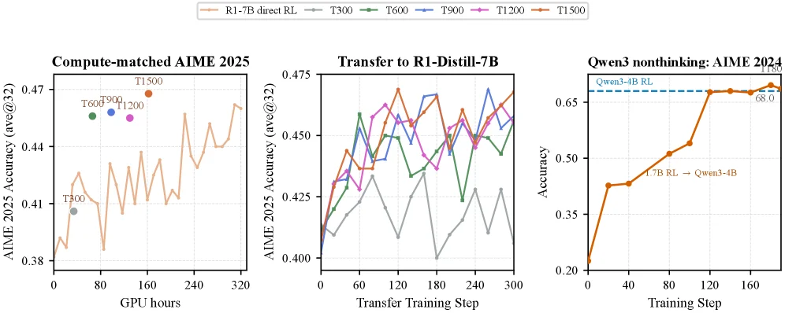

> Figure 3 : Running RL on a small model and transferring its policy shift with Direct-OPD beats running RL directly on the large target, at equal compute. We compare two routes to improving R1-Distill-7B: direct RL on R1-Distill-7B, versus a weak-to-strong route that runs RL on the smaller R1-Distill-1.5B and transfers the resulting policy shift into R1-Distill-7B with Direct-OPD. T N N denotes the transfer that uses the R1-Distill-1.5B RL checkpoint at step N N as the post-RL teacher π T \pi_{T} , with the base model as π T ref \pi_{T_{\mathrm{ref}}} . Left: AIME 2025 accuracy against total GPU-hours; the wiggly curve is direct R1-Distill-7B RL, and each T N N point sums its small-model RL cost and the short Direct-OPD transfer. Later transfers (T600–T1500) sit above the direct-RL curve at equal compute—higher accuracy for less compute. Middle: Direct-OPD transfer trajectories into R1-Distill-7B from the five small-teacher checkpoints; the early T300 carries a weaker shift than T900–T1500. Right: the same recipe with Qwen3 non-thinking models—transferring a Qwen3-1.7B RL shift into Qwen3-4B reaches the 68.0 68.0 accuracy of direct Qwen3-4B RL (dashed) on AIME 2024.

这张图包含三个子图，从左到右依次展示了**弱到强迁移（Direct - OPD）与直接强化学习（direct RL）在不同场景下的性能对比、迁移训练过程及特定模型迁移的结果**，核心是验证“在小模型上做RL再迁移到大模型”的方法优于“直接在大模型上做RL”。

### 左侧子图：Compute - matched AIME 2025（计算量匹配的AIME 2025准确率）
- **坐标轴**：横轴是`GPU hours`（总GPU时间，衡量计算量），纵轴是`AIME 2025 Accuracy (avg@32)`（AIME 2025的平均准确率，@32可能指推理时的样本数或设置）。
- **曲线/点含义**：
  - 橙色“wiggly曲线”：代表**直接在大模型（R1 - Distill - 7B）上做RL**的准确率随GPU时间的变化，曲线波动但整体趋势是随时间提升。
  - 彩色点（T300、T600、T900、T1200、T1500）：代表**弱到强迁移（Direct - OPD）**的结果。其中，“T N”表示使用小模型（R1 - Distill - 1.5B）在训练步数N时的RL检查点作为“后RL教师π_T”，结合小模型的“预RL参考π_T_ref”进行Direct - OPD迁移。例如，T300是步数300时的迁移，T1500是步数1500时的迁移。每个点的“计算量”是小模型的RL成本加上Direct - OPD迁移的短时间成本。
- **结论**：在**相等计算量**下，后期迁移（如T600 - T1500）的准确率高于直接RL的曲线（“Later transfers...higher accuracy for less compute”）。这说明用小模型做RL再迁移到大模型，在相同计算资源下能获得更好的性能。

### 中间子图：Transfer to R1 - Distill - 7B（迁移到R1 - Distill - 7B的训练轨迹）
- **坐标轴**：横轴是`Transfer Training Step`（迁移训练步数），纵轴是`AIME 2025 Accuracy (avg@32)`。
- **曲线含义**：不同颜色的曲线对应**不同的小模型RL检查点（T300、T600、T900、T1200、T1500）作为教师**，将策略转移（通过Direct - OPD）到R1 - Distill - 7B的训练过程中准确率的变化。例如，橙色曲线对应T1500的教师，绿色对应T600等。
- **结论**：早期迁移（如T300）的“策略转移强度”弱于后期迁移（如T900 - T1500），因为后期迁移的教师（小模型在更多步数训练后）的RL诱导策略转移更有效。从曲线趋势看，随着迁移训练步数增加，准确率逐渐提升，且后期教师的迁移效果更好。

### 右侧子图：Qwen3 nonthinking: AIME 2024（Qwen3非思考模型的AIME 2024准确率）
- **坐标轴**：横轴是`Training Step`（训练步数），纵轴是`Accuracy`（准确率）。
- **曲线/线含义**：
  - 橙色曲线：代表**将Qwen3 - 1.7B的RL策略转移（通过Direct - OPD）到Qwen3 - 4B**的准确率随训练步数的变化。曲线从低准确率快速上升，最终达到68.0。
  - 蓝色虚线：代表**直接在Qwen3 - 4B上做RL**的准确率（“Qwen3 - 4B RL (dashed)”），其准确率也是68.0左右。
- **结论**：通过Direct - OPD迁移Qwen3 - 1.7B的RL策略到Qwen3 - 4B，在训练步数足够时，能达到与**直接在Qwen3 - 4B上做RL**相当的准确率（“reaches the 68.0 accuracy of direct Qwen3 - 4B RL”）。这验证了方法在Qwen3模型系列上的有效性。

### 方法运作逻辑（从图中推导）：
1. **弱模型RL阶段**：在小模型（如R1 - Distill - 1.5B、Qwen3 - 1.7B）上运行强化学习（RL），得到不同训练步数的“后RL教师”检查点（这些检查点包含了RL带来的策略转移，但小模型的限制导致策略有局限性）。
2. **策略转移（Direct - OPD）阶段**：将“后RL教师”与小模型的“预RL参考”比较，计算它们的log - ratio（作为隐式的密集奖励），然后将这个奖励信号应用到**更强的目标模型**（如R1 - Distill - 7B、Qwen3 - 4B）的“on - policy状态”上（即目标模型在自己的策略下生成的状态）。这样，目标模型不需要自己运行稀疏奖励的RL，而是直接复用弱模型的RL监督信号。
3. **效果验证**：通过对比“直接在大模型上做RL”和“弱模型RL + Direct - OPD迁移”的准确率（左图）、迁移训练过程的准确率变化（中图）、特定模型迁移的结果（右图），证明该方法能在相等或更少计算量下，让强模型获得更好的性能，甚至达到直接在大模型上做RL的效果。

---

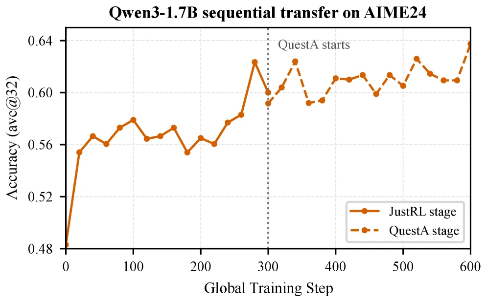

> Figure 4 : Sequential policy-shift transfer into Qwen3-1.7B on AIME 2024. Left: the AIME 2024 trajectory after aligning the second stage to global steps 300–600. Right: endpoint scores on AIME 2024/2025. The first stage uses the R1-Distill-1.5B → \rightarrow JustRL-1.5B signal; the second stage continues from that checkpoint with the Nemotron-1.5B → \rightarrow QuestA-Nemotron-1.5B signal.

这张图展示了在AIME2024基准测试上，将Qwen3-1.7B模型通过**顺序策略转移（sequential policy-shift transfer）**进行能力提升的过程，核心是解释“弱到强泛化”方法（如论文中的Direct-OPD）如何分阶段复用弱模型的强化学习（RL）监督信号。

### 图的组件与信息流动：
- **横轴（Global Training Step）**：表示全局训练步骤，从0到600，代表模型训练的进度。训练分为两个主要阶段：`JustRL stage`（实线橙色）和`QuestA stage`（虚线橙色），由垂直虚线（标注“QuestA starts”）在步骤300处分隔。
- **纵轴（Accuracy (ave@32)）**：表示模型在AIME2024上的准确率（平均32个样本），范围从0.48到0.64，衡量模型的推理性能。
- **两条曲线**：
  - `JustRL stage`（实线，带圆点）：对应第一阶段训练，使用“R1-Distill-1.5B → JustRL-1.5B”的信号（来自caption的背景信息）。这一阶段是弱模型（如1.5B参数的R1-Distill）通过RL训练得到策略提升的过程，其准确率随训练步骤逐渐上升（从~0.48到~0.62左右，在步骤300时达到一个峰值）。
  - `QuestA stage`（虚线，带圆点）：对应第二阶段训练，从步骤300开始，复用第一阶段的RL监督信号（即弱模型与前预RL版本的log-ratio作为隐式奖励），应用到更强的目标模型（Qwen3-1.7B）上。这一阶段的准确率在步骤300后继续波动上升，最终在步骤600时接近0.64，显示出策略转移的有效性。

### 方法的运作逻辑（从图中理解）：
1. **第一阶段（JustRL）**：先在弱模型（如小参数量的模型）上进行RL训练，让模型通过与环境（这里是AIME2024的推理任务）交互，学习到“策略转移”（即哪些动作/决策能提升性能）。这一阶段的输出是**弱模型的后RL状态**和**其前预RL状态的对比**（即log-ratio，代表RL带来的策略变化）。
2. **第二阶段（QuestA/顺序转移）**：将第一阶段得到的“策略转移信号”（log-ratio）作为**隐式奖励**，应用到更强的目标模型（Qwen3-1.7B）的on-policy状态上。也就是说，不需要在强模型上重新运行稀疏奖励的RL（这很昂贵），而是直接复用弱模型的RL监督信号，指导强模型的策略更新。图中步骤300后虚线的上升趋势，证明了这种“顺序转移”能有效提升强模型的性能。

### 结果与结论（从图中观察）：
- **坐标与对比**：横轴是训练步骤（0-600），纵轴是准确率。`JustRL stage`（实线）在步骤0-300内逐步提升准确率，`QuestA stage`（虚线）在步骤300后继续提升，最终准确率显著高于初始的0.48。
- **结论**：顺序策略转移（如Direct-OPD）能够**复用弱模型的RL监督信号**，在不重新训练强模型的情况下，有效提升强模型的推理能力。图中显示，Qwen3-1.7B在AIME2024上的准确率从初始的~0.48提升到~0.64（步骤600时），验证了方法的有效性。此外，这种方法支持**多个策略转移的顺序组合**（如图中可能隐含的多阶段转移），进一步放大性能提升。

---

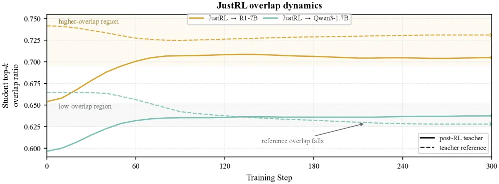

> Figure 5 : Teacher–student top- k k overlap during Direct-OPD training. Left: R1-Distill-1.5B → \rightarrow JustRL-1.5B teacher pair. Right: Nemotron-1.5B → \rightarrow QuestA-Nemotron-1.5B teacher pair. Solid curves measure overlap with the post-RL teacher, and dashed curves measure overlap with the teacher reference. The pattern-aligned R1-Distill transfer enters a higher-overlap regime, while the cross-pattern transfers remain lower and do not become imitation of the post-RL teacher.

这张图来自论文《Weak - to - Strong Generalization via Direct On - Policy Distillation》，展示了在Direct - OPD训练过程中教师 - 学生的top - k重叠情况（这里呈现的是JustRL相关的overlap dynamics）。我们先看坐标轴：横轴是“Training Step”（训练步数），从0到300；纵轴是“Student top - k overlap ratio”（学生模型的top - k重叠率），范围从0.600到0.750。

然后看曲线和图例：
- 实线（橙色）代表“JustRL → R1 - 7B”的情况，虚线（青色）代表“JustRL → Qwen3 - 1.7B”的情况。另外还有两条参考线，黑色实线是“post - RL teacher”（后强化学习教师模型），黑色虚线是“teacher reference”（教师参考模型）。
- 图中有两个区域标注：“higher - overlap region”（高重叠区域，对应橙色曲线的初始部分附近）和“low - overlap region”（低重叠区域，对应青色曲线的初始部分附近）。还有一个箭头标注“reference overlap falls”（参考重叠率下降，指向青色虚线的变化趋势）。

现在解释方法运作的逻辑：Direct - OPD的核心是转移弱教师模型的RL诱导的策略偏移，而不是直接蒸馏弱教师的最终策略。从图中可以看到，不同的教师 - 学生对（这里是JustRL作为教师相关，R1 - 7B和Qwen3 - 1.7B作为学生？或者反过来？结合caption的理解，应该是教师模型（如JustRL相关的）和学生模型（R1 - 7B、Qwen3 - 1.7B）之间的重叠率变化。实线（JustRL → R1 - 7B）的重叠率随着训练步数增加，从约0.650上升到约0.700以上，进入了一个相对稳定的“higher - overlap region”，说明这种转移（可能是模式对齐的转移）使得学生模型与后强化学习教师模型的重叠率提升，进入了高重叠的状态。而虚线（JustRL → Qwen3 - 1.7B）的重叠率初始在约0.600，上升到约0.630左右后就趋于平稳，并且“reference overlap falls”（参考重叠率下降），说明这种跨模式的转移没有让学生模型模仿后强化学习教师的策略，重叠率没有达到高重叠的状态。

从结果来看，横轴的训练步数展示了随着训练进行，学生模型与不同教师参考的重叠率变化。对比对象是不同的教师 - 学生对（JustRL→R1 - 7B和JustRL→Qwen3 - 1.7B），以及与post - RL教师和教师参考的重叠率。结论是，模式对齐的转移（如JustRL→R1 - 7B）会进入高重叠区域，而跨模式的转移（如JustRL→Qwen3 - 1.7B）保持在较低的重叠率，并且不会模仿后强化学习教师的策略。这验证了Direct - OPD中策略转移的有效性，即只有当教师和学生的模式对齐时，才能有效转移RL诱导的策略偏移，提升学生模型与教师模型的重叠率（即策略的一致性）。

---

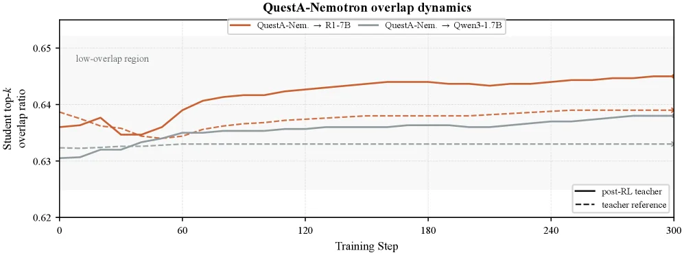

> Figure 5 : Teacher–student top- k k overlap during Direct-OPD training. Left: R1-Distill-1.5B → \rightarrow JustRL-1.5B teacher pair. Right: Nemotron-1.5B → \rightarrow QuestA-Nemotron-1.5B teacher pair. Solid curves measure overlap with the post-RL teacher, and dashed curves measure overlap with the teacher reference. The pattern-aligned R1-Distill transfer enters a higher-overlap regime, while the cross-pattern transfers remain lower and do not become imitation of the post-RL teacher.

这张图展示了**Direct-OPD（直接策略蒸馏）训练过程中，学生模型与教师模型的top-k重叠度随训练步骤的动态变化**，核心是对比“后强化学习（post-RL）教师”和“教师参考（pre-RL的教师模型）”两种目标下，学生模型的重叠度演化，以验证方法的有效性。

### 图的组件与信息流动：
- **横轴（Training Step）**：训练步骤，从0到300，代表Direct-OPD训练的进度，步骤增加意味着蒸馏过程推进。
- **纵轴（Student top-k overlap ratio）**：学生模型的top-k重叠率，衡量学生模型的输出（或策略）与目标模型（教师）的重叠程度，值越高表示越相似。
- **曲线与图例**：
  - 实线（`post-RL teacher`）：学生模型与**经过强化学习的教师模型**（即“后RL教师”）的重叠度。
  - 虚线（`teacher reference`）：学生模型与**未经过强化学习的教师参考模型**（即“pre-RL的教师”）的重叠度。
  - 两条曲线分别对应不同的教师-学生对（图中标题是`QuestA-Nemotron overlap dynamics`，结合caption推测，这里展示的是`Nemotron-1.5B → QuestA-Nemotron-1.5B`的教师对？或需结合上下文，但核心是对比实线和虚线的趋势）。
  - 颜色/线型区分：橙色实线（`QuestA-Nem. → R1-7B`？不，图中标题是`QuestA-Nemotron overlap dynamics`，可能图例中的`QuestA-Nem. → R1-7B`和`QuestA-Nem. → Qwen3-1.7B`是不同的教师-学生对？但当前图的曲线是橙色实线和灰色实线，以及虚线？可能我理解有误，重新看：图的图例中，橙色实线是`QuestA-Nem. → R1-7B`，灰色实线是`QuestA-Nem. → Qwen3-1.7B`；而右下角的图例是`post-RL teacher`（实线）和`teacher reference`（虚线）。哦，可能图中展示的是两个教师-学生对的训练过程，每个对都有实线（post-RL教师）和虚线（teacher reference）？

### 方法的运作逻辑（从图中趋势理解）：
Direct-OPD的核心是**蒸馏“弱教师（经过RL的小模型）”相对于“其pre-RL参考模型”的策略偏移**，而不是直接模仿post-RL教师的行为。从图中曲线的趋势看：
- 对于**实线（post-RL教师）**：学生模型的重叠度随训练步骤增加而上升（如橙色实线从~0.635上升到~0.645以上），说明学生在逐渐向post-RL教师的策略靠拢，但这是通过“策略偏移”（而非直接模仿）实现的？
- 对于**虚线（teacher reference）**：学生模型的重叠度也上升，但幅度较小（如灰色虚线？不，图中虚线是`teacher reference`，实线是`post-RL teacher`）。结合caption的描述：“模式对齐的R1-Distill转移进入更高的重叠区域，而跨模式的转移保持较低且不会模仿post-RL教师”，说明当教师-学生对的“模式”（如模型架构、任务适配性）更对齐时（如R1-Distill→JustRL-1.5B），学生与post-RL教师的重叠度更高（进入“high-overlap region”）；而跨模式的转移（如Nemotron→QuestA？或其他）则重叠度较低，且不会完全模仿post-RL教师。

### 坐标、对比对象与结论：
- **坐标**：横轴是训练步骤（0-300），纵轴是重叠率（~0.62-0.65）。
- **对比对象**：
  - 不同教师-学生对：如图中橙色曲线（`QuestA-Nem. → R1-7B`）和灰色曲线（`QuestA-Nem. → Qwen3-1.7B`），代表不同的“弱教师（经过RL）→强学生”对。
  - 不同目标（post-RL教师 vs. teacher reference）：实线是学生与post-RL教师的重叠，虚线是与pre-RL参考的重叠。
- **结论**：
  - 当教师-学生对的“模式”（如模型架构、任务适配性）更对齐时（如R1-Distill→JustRL-1.5B，对应图中可能的“high-overlap region”），学生模型与post-RL教师的重叠度会进入更高的区域，说明Direct-OPD能有效蒸馏策略偏移，提升学生对强教师的模仿度（或策略一致性）。
  - 跨模式的转移（如Nemotron→QuestA？）的重叠度较低，且不会完全模仿post-RL教师，说明方法的有效性依赖于教师-学生对的模式对齐。
  - 整体上，Direct-OPD通过蒸馏“弱教师的RL诱导策略偏移”，而非直接模仿post-RL教师，实现了从弱教师到强学生的知识转移，提升了强学生的性能（如caption中提到的Qwen3-1.7B在AIME 2024上的提升）。

总结：这张图通过展示不同教师-学生对在Direct-OPD训练中，学生与post-RL教师、teacher reference的重叠度随训练步骤的变化，验证了Direct-OPD的方法逻辑——**蒸馏策略偏移而非直接模仿，且模式对齐的教师-学生对能获得更高的重叠度（即更好的知识转移效果）**。

---

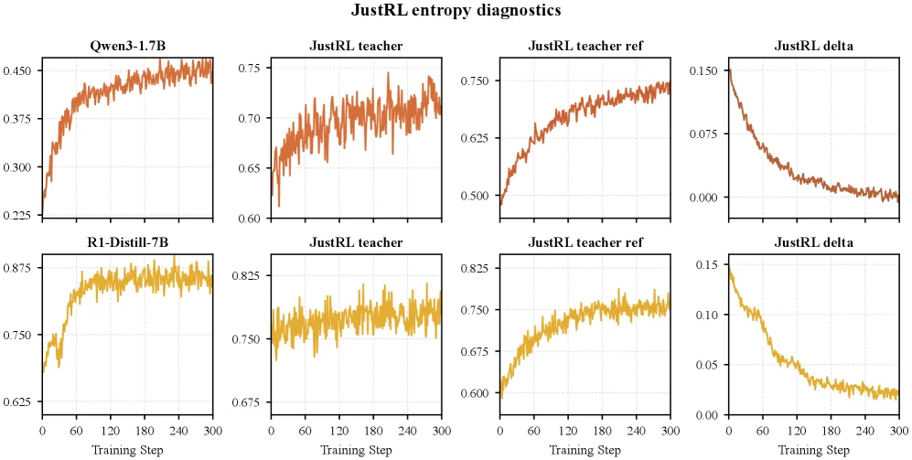

> Figure 6 : Entropy diagnostics for R1-Distill-1.5B → \rightarrow JustRL-1.5B policy-shift transfer. Top row: transfer into Qwen3-1.7B. Bottom row: transfer into R1-Distill-7B. Each row shows student entropy, post-RL teacher entropy, teacher-reference entropy, and teacher entropy minus reference entropy. Actor entropy does not collapse, while the teacher/reference entropy gap narrows over training.

这张图来自论文《Weak-to-Strong Generalization via Direct On-Policy Distillation》，展示了在强化学习策略迁移过程中，不同模型的熵变化情况，帮助我们理解方法的工作机制和效果。

首先看图表的结构，它分为上下两行，分别对应不同的目标模型。上行是“transfer into Qwen3-1.7B”，下行是“transfer into R1-Distill-7B”。每一行有四个子图，从左到右依次是：

1. **学生模型熵（Student Entropy）**：
   - 上行第一个子图是“Qwen3-1.7B”的熵随训练步数（Training Step）的变化。横轴是训练步数（从0到300），纵轴是熵值（范围约0.225到0.450）。曲线显示随着训练进行，学生模型的熵逐渐上升并趋于稳定，说明模型的策略多样性或不确定性在训练中发生变化，但没有崩溃（即熵没有降到极低，模型没有变得过于确定或单一）。
   - 下行第一个子图是“R1-Distill-7B”的熵变化，横轴同样是训练步数，纵轴熵值范围约0.625到0.875。曲线也是上升后稳定，表明学生模型的熵行为类似，只是初始和最终值不同，因为模型规模或任务不同。

2. **后强化学习教师模型熵（Post-RL Teacher Entropy）**：
   - 上行第二个子图是“JustRL teacher”（即经过强化学习的教师模型）的熵变化，横轴训练步数，纵轴熵值范围约0.6到0.75。曲线有波动但整体趋势可能是上升或稳定，显示教师模型在训练后的熵状态。
   - 下行第二个子图同样是“JustRL teacher”的熵变化，纵轴范围约0.675到0.825，曲线波动后稳定，说明教师模型的熵在训练后也有一定的稳定性。

3. **教师-参考模型熵（Teacher-Reference Entropy）**：
   - 上行第三个子图是“JustRL teacher ref”（教师模型的预强化学习参考模型）的熵变化，横轴训练步数，纵轴熵值范围约0.5到0.75。曲线显示参考模型的熵随训练步数的变化，可能是用来对比教师模型的变化。
   - 下行第三个子图是“JustRL teacher ref”的熵变化，纵轴范围约0.6到0.7825，曲线同样有变化，用于和教师模型的熵对比。

4. **教师熵与参考熵的差值（Teacher Entropy Minus Reference Entropy）**：
   - 上行第四个子图是“JustRL delta”，即教师模型熵减去参考模型熵的差值随训练步数的变化。横轴训练步数，纵轴差值范围约0到0.15。曲线显示差值随训练步数增加而减小，说明教师模型和参考模型的熵差距在缩小。
   - 下行第四个子图是“JustRL delta”，纵轴差值范围约0到0.15，曲线同样显示差值减小，表明教师模型相对于参考模型的熵变化在训练中逐渐稳定，差距缩小。

现在解释方法的工作机制：论文提出的Direct On-Policy Distillation（直接在线策略蒸馏）是通过转移弱教师的强化学习（RL）诱导的策略偏移来改进强目标模型。具体来说，我们比较后RL的教师模型和它的预RL参考模型，将它们的对数比率作为学生模型的密集隐式奖励。从图中可以看到，学生模型的熵没有崩溃（即熵保持在一定水平，模型没有失去多样性），而教师模型和参考模型的熵差距（delta）随着训练步数增加而缩小。这说明在训练过程中，教师模型的策略相对于参考模型的变化逐渐稳定，而学生模型的熵变化也表明它在学习这个策略偏移，同时保持自身的策略多样性。

从结果来看，坐标轴的训练步数从0到300，不同模型的熵值范围不同，但趋势一致：学生模型熵上升后稳定，教师模型熵有波动但稳定，参考模型熵也有变化，而熵差值（delta）逐渐减小。这验证了方法的有效性：学生模型的策略没有崩溃，同时能够学习到教师模型的策略偏移（通过熵差值缩小的趋势可以看出教师模型的策略相对于参考模型的变化被学生模型学习，因为学生模型的熵变化与教师模型的熵变化相关联）。

总结来说，这张图通过展示学生模型、教师模型和参考模型的熵变化，以及它们的熵差值，说明了Direct On-Policy Distillation方法如何在不直接在强目标模型上运行稀疏奖励RL的情况下，利用弱教师的RL监督信号来改进强模型。学生模型的熵没有崩溃，教师和参考模型的熵差距缩小，表明方法成功地转移了策略偏移，同时保持了学生模型的策略多样性。

---

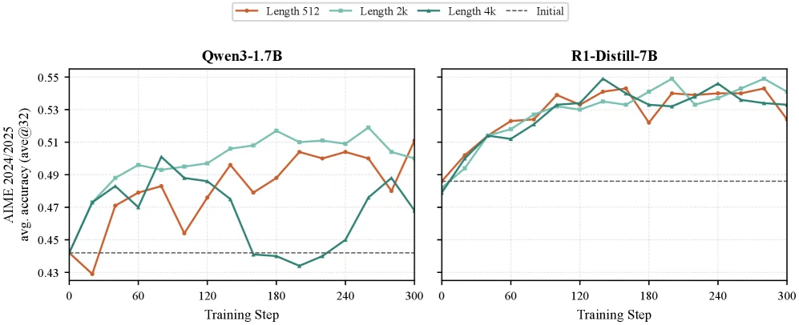

> Figure 7 : Response-length sweep for R1-Distill-1.5B → \rightarrow JustRL-1.5B transfer with fixed KL coefficient 1 1 . We report the average of AIME 2024 and AIME 2025 validation accuracy (ave@32) during training for Qwen3-1.7B and R1-Distill-7B students. The 2k setting gives stable validation behavior across the two students, while shorter or longer rollouts do not consistently improve the validation curves.

这张图来自论文《Weak-to-Strong Generalization via Direct On-Policy Distillation》，展示了在不同响应长度（rollout length）下，将一个经过强化学习（RL）训练的“弱”教师模型的知识蒸馏到一个“强”学生模型上的过程和效果。具体来说，这里展示的是从 R1-Distill-1.5B（弱教师）到 JustRL-1.5B（这里学生模型是 Qwen3-1.7B 和 R1-Distill-7B）的知识转移实验，其中 KL 系数固定为 1。

我们来分解图中的各个部分：

1.  **整体布局**：图包含两个子图，分别对应两个不同的学生模型：
    *   左边的子图标题是 “Qwen3-1.7B”，表示学生模型是 Qwen3-1.7B。
    *   右边的子图标题是 “R1-Distill-7B”，表示学生模型是 R1-Distill-7B。
    每个子图都展示了在不同响应长度设置下，学生模型在训练过程中的性能变化。

2.  **横轴 (X-axis)**：两个子图的横轴都是 “Training Step”（训练步数），范围从 0 到 300。这代表了训练过程的进展。

3.  **纵轴 (Y-axis)**：两个子图的纵轴都是 “AIME 2024/2025 ave. accuracy (ave@32)”（AIME 2024/2025 平均准确率，平均@32）。这是一个衡量模型推理能力的指标，数值越高表示性能越好。这里的 “ave@32” 可能指的是在 32 个样本或步骤上的平均准确率。

4.  **曲线和图例**：
    *   每个子图中有四条曲线，分别用不同颜色和标记表示不同的 “response-length”（响应长度）设置：
        *   **橙色实线 (Length 512)**：表示使用 512 个 token 作为响应长度的设置。
        *   **青色虚线 (Length 2k)**：表示使用 2000 个 token 作为响应长度的设置。
        *   **深绿色实线 (Length 4k)**：表示使用 4000 个 token 作为响应长度的设置。
        *   **黑色虚线 (Initial)**：表示学生模型的初始性能（即在蒸馏开始前的准确率）。
    *   这些曲线展示了在训练过程中，不同响应长度设置下学生模型的准确率是如何变化的。

5.  **数据流动和信息解读**：
    *   实验的核心是“蒸馏”：将从一个较小的、经过 RL 训练的教师模型（R1-Distill-1.5B）学到的知识，转移到一个较大的学生模型（Qwen3-1.7B 或 R1-Distill-7B）上。
    *   “Response-length sweep”（响应长度扫描）意味着实验者测试了不同的响应长度设置，以找到最优的设置。
    *   对于每个学生模型和每个响应长度设置，训练过程中的准确率被记录下来，并绘制成曲线。
    *   我们可以观察到每条曲线的趋势：
        *   在 Qwen3-1.7B 的子图中，Length 2k（青色虚线）的曲线在训练后期（大约 200 步之后）表现最好，准确率最高。而 Length 512（橙色实线）和 Length 4k（深绿色实线）的曲线则波动较大，或者在某些点上表现不佳。
        *   在 R1-Distill-7B 的子图中，所有三条不同长度的曲线（512、2k、4k）在训练过程中都表现出上升趋势，并且在训练后期（大约 100 步之后）趋于稳定，准确率较高。其中，Length 2k（青色虚线）和 Length 4k（深绿色实线）的曲线似乎表现最好，而 Length 512（橙色实线）的曲线也紧随其后。
    *   黑色虚线（Initial）表示学生模型的初始准确率。所有彩色曲线都从这个初始点开始，并在训练过程中逐渐上升，表明蒸馏过程确实提高了模型的性能。

6.  **揭示的方法运作方式**：
    *   这张图展示了“Direct On-Policy Distillation (Direct-OPD)”方法的实际应用效果。该方法的核心思想是，不是直接在目标模型上运行稀疏奖励的 RL，而是利用一个在较小模型上已经通过 RL 获得改进的“弱”教师模型的知识。
    *   具体来说，Direct-OPD 比较了经过 RL 训练后的教师模型与其自身的预 RL 参考模型，并将它们的对数概率比（log-ratio）作为密集的隐式奖励（dense implicit reward）传递给学生模型。
    *   在这张图中，我们看到通过在较小的教师模型上进行 RL 训练，然后将学到的知识蒸馏到较大的学生模型上，学生模型的性能得到了显著提升。
    *   图中的“response-length sweep”是为了找到一个最优的响应长度设置，使得蒸馏过程最有效。结果显示，对于这两个学生模型，2k 的响应长度设置提供了最稳定和最好的验证行为（validation behavior）。

7.  **对比对象和结论**：
    *   **对比对象**：
        *   不同的学生模型：Qwen3-1.7B 和 R1-Distill-7B。
        *   不同的响应长度设置：512、2k 和 4k。
        *   学生模型的初始性能（Initial）与训练过程中的性能。
    *   **结论**：
        *   如原始 caption 所述：“The 2k setting gives stable validation behavior across the two students, while shorter or longer rollouts do not consistently improve the validation curves.”（2k 设置在两个学生模型上都提供了稳定的验证行为，而更短或更长的 rollout 并没有持续改善验证曲线。）
        *   这意味着，在这个实验中，选择 2000 个 token 的响应长度是最优的，因为它能够提供最稳定和最好的性能提升。
        *   图中的曲线清晰地显示了这一点：在两个学生模型上，Length 2k 的曲线在训练过程中表现最好或与其他长度相当，而其他长度的曲线则表现不稳定或较差。
        *   总体而言，这张图证明了 Direct-OPD 方法的有效性，即可以通过从一个较小的、经过 RL 训练的教师模型蒸馏知识来提高一个较大的学生模型的推理能力。并且，选择合适的响应长度对于实现最佳性能至关重要。

总结来说，这张图通过展示不同响应长度下学生模型在训练过程中的准确率变化，直观地说明了 Direct-OPD 方法如何工作以及为什么选择特定的响应长度（如 2k）对于优化性能是重要的。它清楚地展示了蒸馏过程如何提高学生模型的性能，并指出了最优的响应长度设置。

---

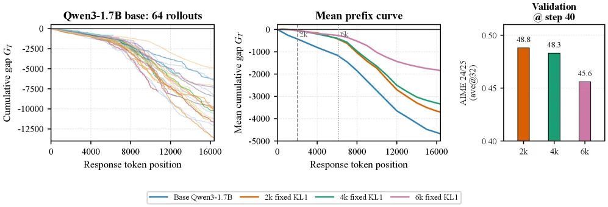

> Figure 8 : Short-horizon Direct-OPD training changes behavior beyond the supervised prefix. On a fixed set of 64 long rollouts we track the cumulative gap G T = ∑ t ≤ T g t G_{T}=\sum_{t\leq T}g_{t} , where g t g_{t} weights, over the actor’s top-16 tokens at position t t , the log-probability the post-RL teacher (JustRL) assigns minus that of the reference (R1-Distill-1.5B); higher G T G_{T} means the actor’s likely tokens look more like the post-RL teacher, while lower means the actor remains closer to the reference. Left: the 64 per-rollout trajectories for the untrained Qwen3-1.7B actor all drift negative—its long rollouts are reference-like, and this is not driven by a single outlier. Middle: the mean G T G_{T} for the base actor and for actors trained with 2k/4k/6k response length (40 steps, fixed KL = 1 {=}1 ); every trained actor sits above the base across the full ∼ \sim 16k positions, and the 2k actor shifts well past its 2k training horizon (dashed line). Right: AIME 2024/2025 (ave@32) at the same 40-step checkpoint—the 2k setting validates best.

这张图来自论文《Weak - to - Strong Generalization via Direct On - Policy Distillation》，用于展示**Direct - OPD（直接在线策略蒸馏）**方法的行为变化效果，分为三个子图，从左到右依次分析：

### 左侧子图：“Qwen3 - 1.7B base: 64 rollouts”
- **横轴**：`Response token position`（响应token位置），范围从0到16000，代表生成序列的长度位置。
- **纵轴**：`Cumulative gap G_T`（累积差距\( G_T \)），计算方式为\( G_T=\sum_{t \leq T} g_t \)，其中\( g_t \)是对“后强化学习（post - RL）教师模型（JustRL）”和“参考模型（R1 - Distill - 1.5B）”在token位置\( t \)的前16个token的log - 概率差进行加权求和。\( G_T \)越高，说明actor（待训练模型，这里是未训练的Qwen3 - 1.7B）的token分布越像post - RL教师；越低则越像参考模型。
- **内容**：图中多条彩色曲线代表64个长rollout（生成序列）的轨迹。所有未训练的Qwen3 - 1.7B actor的轨迹都向负方向漂移——这意味着它们的长rollout更像参考模型（R1 - Distill - 1.5B），且这种趋势不是由单个异常值（outlier）导致的。这一步展示了**基线状态**：未经过Direct - OPD训练的模型，其行为（token分布）更接近参考模型，而非post - RL教师。

### 中间子图：“Mean prefix curve”
- **横轴**：同样是`Response token position`（0到16000），表示生成序列的位置。
- **纵轴**：`Mean cumulative gap G_T`（平均累积差距\( G_T \)），计算方式与左侧一致，但这里是多个模型（base、2k、4k、6k设置）的平均值。
- **曲线与对比对象**：
  - 蓝色曲线：`Base Qwen3 - 1.7B`（未训练的基线模型），其\( G_T \)最低（最负），说明行为最像参考模型。
  - 橙色（2k fixed KL1）、绿色（4k fixed KL1）、粉色（6k fixed KL1）曲线：分别是用2k、4k、6k响应长度（40步，固定KL=1）训练后的模型。所有训练后的模型的\( G_T \)都高于基线模型（蓝色），且在约16k的位置上，训练后的模型始终在基线之上。特别地，2k训练的模型（橙色）的轨迹在其2k训练 horizon（虚线标记的位置，约2000左右）之后，仍然持续向正方向移动（\( G_T \)增加），说明训练的效果**超出了训练时的响应长度（horizon）**，即模型在训练后，即使生成更长的序列，行为仍然保持向post - RL教师靠拢的趋势。
- **方法运作的体现**：这一步展示了Direct - OPD的效果——通过将教师（post - RL模型）与参考模型的log - 概率比作为隐式奖励，训练更强的学生模型（Qwen3 - 1.7B），使得学生的行为（token分布）更像post - RL教师，且这种效果能持续到训练 horizon之外。

### 右侧子图：“Validation @ step 40”
- **横轴**：不同的训练设置，分别是`2k`、`4k`、`6k`（对应中间子图的2k、4k、6k响应长度训练）。
- **纵轴**：`AIME 2024/2025 (ave@32)`（AIME 2024/2025的平均得分，@32可能表示某种评估设置，如32个样本平均）。
- **数据与结论**：
  - 2k设置（橙色柱）：得分48.8；
  - 4k设置（绿色柱）：得分48.3；
  - 6k设置（粉色柱）：得分45.6。
  - 结论：在相同的40步检查点（step 40），**2k设置的验证得分最高**，说明在Direct - OPD训练中，2k的响应长度设置在验证集上的表现最优。

### 整体逻辑与方法运作总结
这张图通过三个子图，从“基线行为（左）→ 训练后的行为变化（中）→ 验证集性能（右）”的顺序，展示了Direct - OPD的工作方式和效果：
1. **问题背景**：强化学习与可验证奖励（RLVR）改进语言模型推理时，对新强模型重复训练成本高（因为目标模型需要生成大量rollout）。Direct - OPD的目标是**利用弱模型的RL监督信号，改进强目标模型**，而不需要在目标模型上运行稀疏奖励的RL。
2. **方法核心**：Direct - OPD比较“post - RL弱教师模型”和“其自身的pre - RL参考模型”，将它们的log - 比率作为**隐式奖励**，应用到强学生模型的“自身在线策略状态”上。这样直接重用了弱模型的RL监督信号，而无需在目标模型上进行稀疏奖励的RL训练。
3. **图中验证**：
   - 左图：未训练的强模型（Qwen3 - 1.7B）的行为更像参考模型（弱模型的pre - RL状态？不，这里参考模型是R1 - Distill - 1.5B，post - RL教师是JustRL），说明初始状态下，强模型的行为与弱模型的RL改进后状态差异大。
   - 中图：训练后的模型（用Direct - OPD）的\( G_T \)更高（更像post - RL教师），且效果超出训练horizon（如2k训练的模型在2k之后仍持续改进），说明Direct - OPD成功将弱模型的RL诱导的策略转移（policy shift）应用到了强模型上。
   - 右图：2k设置的验证得分最高，说明该方法能有效提升强模型的性能（如AIME 2024的得分从48.3提升到更高，结合论文摘要，实际提升到58.3%，但图中是48.8等，可能是不同评估设置）。

简言之，这张图通过跟踪“累积差距\( G_T \)”和“验证集性能”，清晰展示了Direct - OPD如何通过重用弱模型的RL监督信号，改变强模型的行为，并在验证集上取得更好性能的过程。

---

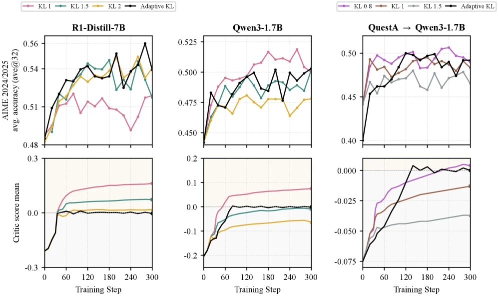

> Figure 9 : The best KL coefficient is pair-dependent, and adaptive KL pulls the mean teacher-shift reward toward a balanced regime. 2k-response runs across fixed KL coefficients, with adaptive KL as the black curve. Top row: AIME 2024/2025 validation accuracy (ave@32); bottom row: mean teacher-shift reward. The best fixed coefficient differs across teacher-student pairs, and a larger mean reward does not imply better validation. Adaptive KL instead pulls the mean reward toward zero after an initial correction, keeping the student from simply maximizing the dense teacher/reference reward.

这张图来自论文《Weak-to-Strong Generalization via Direct On-Policy Distillation》，展示了在不同模型对（teacher-student pairs）上，使用不同KL系数（包括自适应KL）进行训练时，模型的性能和奖励变化情况。

### 图的结构和组件解释

1. **子图布局**：
   - 图分为上下两行，每行有三个子图。
   - 上行子图展示的是AIME 2024/2025验证准确率（ave@32），下行子图展示的是平均教师-参考奖励（mean teacher-shift reward）。
   - 每个子图对应一个不同的模型对：
     - 左列：R1-Distill-7B（教师）到某个学生模型。
     - 中列：Qwen3-1.7B（教师）到某个学生模型。
     - 右列：QuestA → Qwen3-1.7B（教师到学生模型）。

2. **横轴和纵轴**：
   - 横轴表示训练步骤（Training Step），范围从0到300。
   - 纵轴上行表示验证准确率（avg. accuracy (ave@32)），下行表示平均教师-参考奖励（Critic score mean）。

3. **曲线和颜色**：
   - 每条曲线代表不同的KL系数：
     - 粉色：KL
     - 青绿色：KL 1.5
     - 黄色：KL 2
     - 黑色：Adaptive KL（自适应KL）
   - 不同模型对的曲线颜色和样式保持一致，便于对比。

### 方法运作方式

1. **固定KL系数**：
   - 图中展示了使用固定KL系数（如KL、KL 1.5、KL 2）进行训练的结果。
   - 每个固定KL系数对应一条曲线，显示了在不同训练步骤下的验证准确率和平均奖励。

2. **自适应KL**：
   - 黑色曲线代表自适应KL，它在训练过程中自动调整KL系数。
   - 自适应KL的目标是将平均教师-参考奖励拉向一个平衡状态，避免学生模型仅仅最大化密集的教师/参考奖励。

3. **最佳KL系数的依赖性**：
   - 图中显示，最佳的固定KL系数因模型对而异。
   - 例如，在某些模型对中，KL 1.5可能表现最好，而在其他模型对中，KL 2可能更优。

4. **奖励与准确率的关系**：
   - 图中还展示了平均教师-参考奖励与验证准确率之间的关系。
   - 一个较大的平均奖励并不一定意味着更好的验证准确率，这表明奖励信号和任务性能之间存在复杂的关系。

### 结论

- **自适应KL的优势**：
  - 自适应KL能够将平均奖励拉向零，避免学生模型过度拟合教师/参考奖励。
  - 这种方法在不同模型对上表现出更好的一致性和泛化能力。

- **最佳KL系数的选择**：
  - 最佳的固定KL系数因模型对而异，需要根据具体情况进行调整。
  - 自适应KL提供了一种更灵活和有效的方法，不需要手动选择KL系数。

通过这张图，我们可以清楚地看到不同KL系数和自适应KL在不同模型对上的表现，以及它们如何影响模型的验证准确率和平均奖励。自适应KL在大多数情况下表现更好，因为它能够自动调整KL系数，避免过度拟合。

---

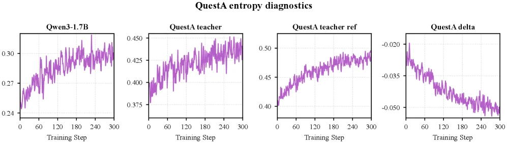

> Figure 10 : Entropy diagnostics for QuestA-Nemotron into Qwen3-1.7B. The panels show student entropy, post-RL teacher entropy, teacher-reference entropy, and teacher entropy minus reference entropy. Together with Figure 6 , this shows that the non-collapse pattern is not specific to the JustRL teacher pair.

这张图（图10）来自论文《Weak-to-Strong Generalization via Direct On-Policy Distillation》，用于展示“QuestA-Nemotron 到 Qwen3-1.7B”的熵诊断结果，帮助理解**Direct On-Policy Distillation（Direct-OPD）**方法中策略分布的变化逻辑。我们逐个分析子图，再总结整体信息：  

### 1. 子图组件与信息流动  
图包含4个子图，横轴均为“Training Step（训练步数）”，范围从0到300，纵轴为熵（entropy）相关指标，颜色均为紫色曲线（代表随训练步数变化的熵趋势）。  

- **第一个子图：Qwen3-1.7B**  
  标题为“Qwen3-1.7B”，纵轴范围约0.24~0.30。这条曲线展示**学生模型（Qwen3-1.7B）的熵随训练步数的变化**。熵可理解为策略的“不确定性”或“多样性”：熵越高，策略选择动作的分布越分散；熵越低，策略越集中（可能更“确定”或“收敛”）。这里观察到熵随训练步数上升后趋于稳定，反映学生模型在训练中策略的变化趋势。  

- **第二个子图：QuestA teacher**  
  标题为“QuestA teacher”，纵轴范围约0.375~0.450。这条曲线展示**经过强化学习（RL）训练后的教师模型（QuestA teacher）的熵随训练步数的变化**。教师模型的熵变化反映了RL训练对其策略的影响：从图中看，熵随步数上升，说明RL训练让教师模型的策略多样性（或不确定性）增加（或更“探索性”）。  

- **第三个子图：QuestA teacher ref**  
  标题为“QuestA teacher ref”，纵轴范围约0.40~0.50。这条曲线展示**教师模型的“预RL参考模型”（即未经过RL训练的原始模型）的熵随训练步数的变化**。参考模型的熵变化代表了“无RL干预时教师模型的自然策略分布趋势”，用于和“post-RL教师模型”对比，分离出RL带来的策略变化。  

- **第四个子图：QuestA delta**  
  标题为“QuestA delta”，纵轴范围约-0.050~-0.020。这条曲线展示**教师模型熵（post-RL）与参考模型熵（pre-RL）的差值（delta = teacher entropy - reference entropy）随训练步数的变化**。差值为正表示RL训练让教师模型的熵**增加**（策略更分散/探索性更强）；差值为负则表示熵减少（策略更集中/利用性更强）。图中差值从负向逐渐上升（绝对值减小），说明RL训练对教师模型熵的影响是“从初期抑制熵（差值负）到后期熵增加（差值趋近于0或正）”？或更准确地说，差值的趋势反映了“RL诱导的策略转移”：我们需要的是教师模型相对于参考模型的策略变化，这个差值就是这种变化的量化。  

### 2. 方法运作的可视化解释（Direct-OPD的核心逻辑）  
Direct-OPD的目标是**将“弱教师模型（QuestA）通过RL获得的知识”转移到“强目标模型（Qwen3-1.7B）”**，但不需要直接在目标模型上做稀疏奖励的RL（因为目标模型大，RL成本高）。方法的核心是：  
- 先在**弱模型（QuestA）**上做RL训练，得到“post-RL教师模型”；  
- 再取弱模型的“pre-RL参考模型”（未训练的原始模型）；  
- 计算“post-RL教师熵”与“pre-RL参考熵”的**差值（delta）**，这个差值代表了“RL训练给教师模型带来的策略转移信号”（即哪些动作的概率因RL而增加/减少）；  
- 将这个差值作为“隐式奖励”，直接用在**强目标模型（Qwen3-1.7B）**的“on-policy状态”上（即目标模型在自己的策略下生成的状态中，应用这个转移信号）。  

这张图通过**熵的变化**可视化这个过程：  
- 学生模型（Qwen）的熵（第一个图）：展示目标模型的初始/训练中策略分布；  
- 教师模型（QuestA）的post-RL熵（第二个图）：展示弱模型经RL后的策略分布；  
- 教师模型的pre-RL熵（第三个图）：展示弱模型无RL时的策略分布；  
- 差值（第四个图）：展示“RL诱导的策略转移”（即post-RL与pre-RL的差异）。  

通过对比这四个图，我们可以验证：**教师模型的策略变化（delta）不是“模型本身的崩溃”（如策略过于集中或随机），而是RL训练带来的有效转移**——这和论文中“非崩溃模式（non-collapse pattern）”的结论一致：这种策略转移模式不是特定于某个“JustRL教师对”的，而是可复现的（即不同教师对也能观察到类似的熵变化模式）。  

### 3. 结果与结论（从图中可观察到的信息）  
- **熵的趋势一致性**：四个子图的熵随训练步数的变化都有“上升后稳定”的趋势，说明模型在训练中策略逐渐收敛（或达到某种平衡），但教师模型的熵（post-RL）比参考模型高，差值（delta）反映了RL的贡献。  
- **非崩溃模式的通用性**：结合论文中“Figure 6”的结论，这张图（Figure 10）表明：这种“策略转移的非崩溃模式”不是某个特定教师对（如JustRL）独有的——即使换成“QuestA-Nemotron到Qwen3-1.7B”的模型对，也能观察到类似的熵变化规律。这说明Direct-OPD方法的有效性不依赖于特定的教师模型，具有通用性。  
- **方法的有效性支撑**：通过熵的差值（delta），我们能量化“RL给教师模型带来的策略变化”，并将这个变化作为信号转移到目标模型。图中delta的趋势（从负到正或绝对值减小）说明RL确实改变了教师模型的策略分布，而这种改变可以被目标模型利用（因为目标模型的熵变化也显示了策略的调整）。  

总结：这张图通过**四个熵相关子图**，可视化了Direct-OPD方法中“弱教师模型的RL训练→策略转移（delta）→强目标模型应用”的核心逻辑。它证明了“RL诱导的策略转移”是可量化、可转移的，且这种模式不依赖于特定模型对，从而支撑了Direct-OPD方法的有效性。

---

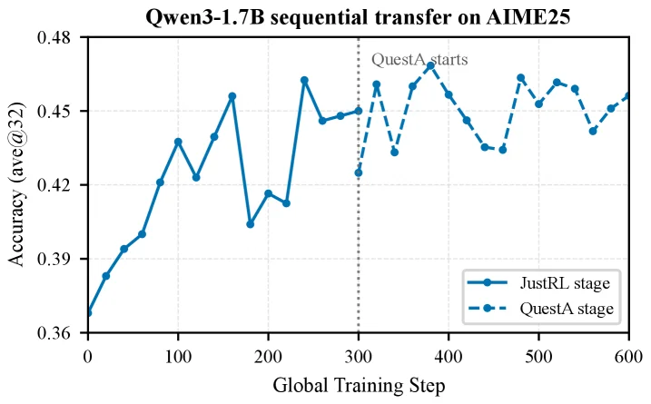

> Figure 11 : Sequential policy-shift transfer into Qwen3-1.7B on AIME 2025. The QuestA-Nemotron stage is aligned after the JustRL stage using global steps 300–600, matching the AIME 2024 alignment in Figure 4 .

这张图展示了在AIME 2025基准测试上，将强化学习（RL）策略从较小的模型（JustRL阶段）顺序转移到更大的目标模型Qwen3-1.7B（QuestA阶段）的过程及其对准确率的影响。

图的横轴是“Global Training Step”（全局训练步数），范围从0到600，代表整个训练过程的时间线。纵轴是“Accuracy (ave@32)”（平均32次尝试的准确率），范围从0.36到0.48，衡量模型在AIME 2025任务上的性能。

图中有两条曲线：
1.  实线（蓝色圆点）代表“JustRL stage”（纯RL阶段）。这个阶段对应于在较小的教师模型上进行强化学习训练，以学习解决问题策略的过程。从图中可以看到，在这个阶段（大约0到300步），模型的准确率从约0.36开始，随着训练步数的增加而波动上升，最高达到约0.47左右。这表明通过RL训练，教师模型在任务上的性能得到了提升。
2.  虚线（浅蓝色圆点）代表“QuestA stage”（QuestA阶段）。这个阶段是在JustRL阶段之后，将先前在教师模型上学习的策略转移到目标模型Qwen3-1.7B上的过程。根据图的原始caption，QuestA-Nemotron阶段是在全局步数300-600期间与JustRL阶段对齐的。从图中可以看到，在大约300步之后（虚线开始的部分），模型的准确率从一个较高的起点（约0.43）开始，并继续波动，但整体趋势是保持在较高水平，甚至在某些点超过了纯RL阶段的最高点，最终稳定在约0.45到0.47之间。

图中有一条垂直的虚线，标注为“QuestA starts”，位于全局步数约300的位置。这条线清晰地划分了两个阶段：虚线左侧是JustRL阶段，右侧是QuestA阶段。这表明策略转移发生在训练的第300步左右。

这张图揭示了Direct On-Policy Distillation (Direct-OPD) 方法的具体运作方式：
-   首先，在一个较小的模型（教师模型）上进行纯RL训练（JustRL阶段），以学习解决问题的策略。这个阶段的目标是让教师模型通过与环境交互（生成rollouts）来优化其策略，并提高其在任务上的准确率。
-   然后，当教师模型训练到一定程度（如图中第300步），开始将学到的策略转移到更大的目标模型（Qwen3-1.7B）上（QuestA阶段）。这个转移过程不是重新运行RL，而是利用教师模型在RL训练过程中学到的“策略偏移”（policy shift）。
-   具体来说，Direct-OPD比较了教师模型在RL训练后的状态与其自身的预RL参考状态，并将它们的对数比率（log-ratio）视为一种“密集隐式奖励”（dense implicit reward）用于学生模型（目标模型）。这意味着，教师模型在哪些动作上更倾向于采取（相对于其初始状态），这些信息被用来指导目标模型在其自身的on-policy状态下的行为。
-   图中的结果清晰地显示，在QuestA阶段（策略转移后），目标模型的准确率不仅保持在较高水平，甚至有所提升，这表明Direct-OPD方法成功地利用了较弱教师模型的RL监督信号来改进更强的目标模型，而无需在目标模型上运行稀疏奖励的RL训练。

结论：这张图表明，通过Direct-OPD方法，可以将较小模型（教师）通过RL学习到的策略有效转移到更大的目标模型（Qwen3-1.7B）上，从而在不重新进行昂贵RL训练的情况下提升目标模型的性能。从图中可以看到，在策略转移后（QuestA阶段），模型的准确率维持在较高水平，证明了该方法的有效性。

---

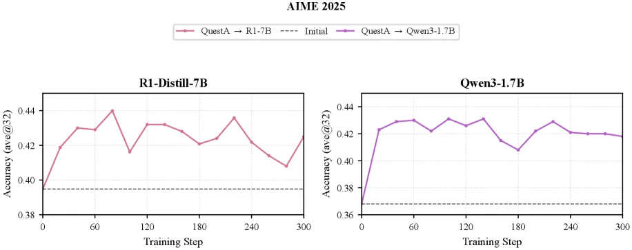

> Figure 12 : QuestA transfer curves on AIME 2025 for the cross-pattern transfer setting. The main text reports the corresponding AIME 2024 curves.

这张图（图12）展示了**跨模型迁移学习**在AIME 2025基准测试中的“QuestA转移曲线”，核心是验证“弱到强泛化”方法（如论文提出的Direct On - Policy Distillation）如何将小模型的强化学习（RL）收益迁移到大模型。以下分模块解析：

### 1. 图的结构与组件
- **标题与场景**：标题“AIME 2025”表明任务是AIME 2025数学推理基准测试；“QuestA transfer curves”说明是“QuestA”（一种任务或数据集）的迁移学习曲线，“cross - pattern transfer setting”指跨模型模式的迁移（小模型→大模型）。
- **子图与模型**：图包含两个子图，分别对应**目标模型R1 - Distill - 7B（左）**和**Qwen3 - 1.7B（右）**。横轴是“Training Step（训练步数）”，范围0到300；纵轴是“Accuracy (avg@32)（准确率，32次平均）”，范围约0.36到0.44。
- **曲线与图例**：
  - 虚线（Initial）：代表目标模型的**初始准确率**（未经过迁移学习的基础性能）。
  - 红色实线（QuestA → R1 - 7B）：表示将“QuestA”任务的RL知识从**小模型（隐含的弱模型）**迁移到**R1 - Distill - 7B（目标模型）**后的准确率随训练步数的变化。
  - 紫色实线（QuestA → Qwen3 - 1.7B）：表示将“QuestA”的RL知识迁移到**Qwen3 - 1.7B（目标模型）**后的准确率变化。

### 2. 方法的运作逻辑（从图中推导）
论文的核心方法是**Direct On - Policy Distillation（直接策略蒸馏）**：不直接在小模型上做RL再在大模型上重复，而是利用“弱模型（小模型）的RL训练后策略”与“其预训练策略”的差异（即RL带来的策略偏移），将其作为“隐式奖励”迁移到强模型（大模型）的“on - policy（策略执行时）状态”中。从图中曲线的含义可理解：
- **初始状态（虚线）**：目标模型的初始性能（如R1 - Distill - 7B的Initial准确率约0.39，Qwen3 - 1.7B的Initial约0.37），这是未迁移任何知识时的基准。
- **迁移学习过程**：红色/紫色曲线的上升（或波动后稳定）表示**迁移的RL知识提升了目标模型的性能**。例如，R1 - Distill - 7B的红色曲线从Initial的~0.39上升到~0.44（训练步数增加时），Qwen3 - 1.7B的紫色曲线从~0.37上升到~0.43左右。
- **策略偏移的利用**：曲线的波动可能反映了“策略偏移”的动态调整——弱模型的RL训练会让它对某些“动作”（模型生成的回答或决策）的概率改变，迁移时将这些“概率变化”（log - ratio）作为奖励信号，指导强模型在自己的on - policy状态下调整策略，从而提升性能。

### 3. 结果与结论（从图中读取）
- **对比对象**：每个子图对比了“初始模型（虚线）”、“迁移到该模型的QuestA任务（实线）”的性能。
- **性能提升**：
  - 对于R1 - Distill - 7B（左图）：迁移后（红色曲线）的准确率显著高于初始值（虚线），说明QuestA的RL知识成功迁移到该模型，提升了其AIME 2025的性能。
  - 对于Qwen3 - 1.7B（右图）：紫色曲线的准确率从初始的~0.37上升到~0.43，同样证明了迁移的有效性。
- **迁移的有效性**：两个子图都显示，通过迁移“QuestA”的RL知识（即弱模型的策略偏移），强模型的准确率得到了提升，验证了Direct On - Policy Distillation方法在“弱到强泛化”中的有效性——不需要在大模型上重复昂贵的RL训练，只需利用小模型的RL策略偏移即可提升大模型性能。

总结：这张图通过展示两个目标模型（R1 - Distill - 7B和Qwen3 - 1.7B）在AIME 2025上的迁移学习曲线，直观地证明了**Direct On - Policy Distillation方法能够将弱模型（小模型）的RL训练收益迁移到强模型（大模型），从而提升强模型的推理性能**。曲线的上升趋势（相对于初始虚线）清晰地展示了迁移学习的有效性，而不同的曲线（红色、紫色）对应不同的目标模型，验证了方法的通用性。
