# 4D Human-Scene Reconstruction from Low-Overlap Captures

[arXiv](https://arxiv.org/abs/2607.09125) · [HuggingFace](https://huggingface.co/papers/2607.09125) · ▲53

## 摘要（原文）

> Existing volumetric capture of dynamic human performance achieves high fidelity with dense camera arrays. However, in real-world scenarios, only a handful of low-overlap cameras are available, which degrades the output quality and leaves large areas unobserved. Recent 4D reconstruction methods have focused on low-overlap settings, yet they still produce noticeable artifacts in under-observed regions. Video diffusion models have emerged as another option, but they show geometrically inconsistent results for humans. To address these limitations, we propose StudioRecon, a pipeline that reconstructs 4D human scenes from sparse, low-overlap cameras by decoupling background and humans. We densify background supervision by synthesizing hundreds of camera-controlled novel views with a video diffusion model. We also robustly initialize deformable Gaussian humans with cross-view identity association and triangulated multi-view keypoint fitting. Finally, our recursive enhancement module with motion-adaptive consistency injection harmonizes the composed output, thereby further avoiding remaining artifacts. We achieve state-of-the-art novel view synthesis across four real-world datasets and demonstrate applications such as novel trajectory rendering and human replacement.

## 摘要（中译）

现有的动态人体表演体积捕捉通过密集相机阵列实现了高保真度。然而，在现实世界场景中，只有少数低重叠相机可用，这降低了输出质量并留下了大片未观测区域。最近的4D重建方法集中在低重叠设置上，但它们在观测不足的区域仍然产生明显的伪影。视频扩散模型已成为另一种选择，但它们对人类的几何结果不一致。为了解决这些局限性，我们提出了StudioRecon，这是一种通过解耦背景和人类来从稀疏、低重叠相机重建4D人体场景的流程。我们通过使用视频扩散模型合成数百个相机控制的新视图来加强背景监督。我们还通过跨视图身份关联和三角测量多视图关键点拟合来稳健地初始化可变形高斯人体。最后，我们的递归增强模块带有运动自适应一致性注入，协调了合成输出，从而进一步避免了剩余的伪影。我们在四个真实世界数据集上实现了最先进的新型视图合成，并展示了诸如新型轨迹渲染和人体替换等应用。

## 背景剖析

### 背景剖析  

**1. 技术背景与真实需求**  
高精度4D人体场景重建在娱乐（如虚拟制片）、体育广播和元宇宙应用中至关重要。专业级系统通过密集相机阵列实现高质量动态捕捉，但需要数十至数百台相机且依赖受控环境。然而，现实场景（如健身房、家庭）通常只有少量未校准、低重叠的相机，且存在多人交互和频繁遮挡。这种“野外工作室”场景需要技术能在有限相机条件下，仍能生成连贯、无伪影的动态重建结果，同时支持新视角合成、轨迹渲染或人物替换等实用功能。  

**2. 先前方法的局限性**  
现有方法主要面临两个核心问题：  
- **背景与人体表示纠缠**：传统联合重建方法（如4D高斯溅射）在低重叠场景下，背景和人体的错误会相互影响，导致未观测区域出现明显伪影。  
- **几何一致性与覆盖不足**：视频扩散模型虽能合成合理背景，但在多人动态场景中无法保证人体运动的一致性；而基于参数化人体模型（如SMPL）的方法依赖多视图匹配，但稀疏相机下的遮挡和视差会导致初始化失败。  

**3. 本文的解决思路**  
论文提出**解耦重建框架（StudioRecon）**，通过分离背景与人体重建来解决上述问题：  
- **背景重建**：利用相机控制的视频扩散模型，从稀疏输入合成数百个新视角，为背景提供密集监督，避免因视野不足导致的退化。  
- **人体重建**：结合SMPL等参数化模型的几何先验，通过跨视图身份关联和多视图关键点三角化，鲁棒地初始化动态人体。  
- **时序一致性增强**：通过单步扩散模型和运动自适应一致性注入，消除静态伪影并确保帧间连贯性，避免传统方法中的闪烁问题。  

**4. 与前人工作的关键差异**  
- **解耦策略**：不同于以往联合优化背景与人体，本文利用扩散模型（背景）和参数化模型（人体）的互补优势，避免表示纠缠。  
- **多视图人体估计**：通过空间和姿态亲和力结合的关键点三角化，提升稀疏视图下的人体初始化鲁棒性。  
- **时序一致性**：首次将单步扩散与运动自适应注入结合，实现动态场景的长期连贯渲染。  

这一方法在真实世界数据集（如EgoHumans、Harmony4D）上实现了SOTA性能，并支持新视角合成和人物替换等应用，填补了低重叠场景下高保真4D重建的技术空白。

## 方法图解

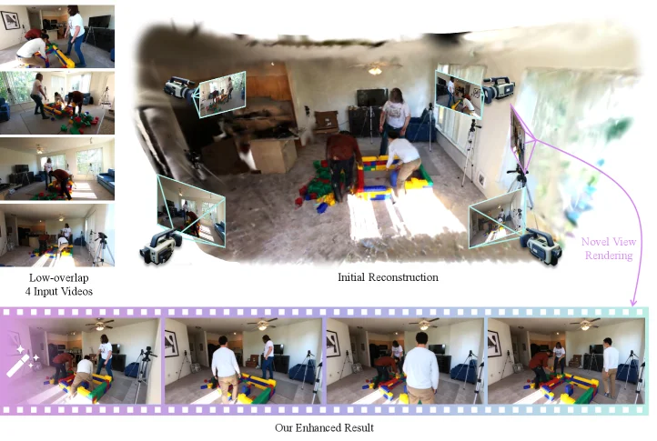

> Figure 1. Given only as few as four sparse, low-overlap input videos (left), StudioRecon first reconstructs decoupled Gaussians for background and humans (right). The reconstructed Gaussians enable rendering from novel viewpoints, and our recursive enhancement module further refines the rendered output (bottom).

这张图清晰地展示了论文《4D Human-Scene Reconstruction from Low-Overlap Captures》中提出的StudioRecon方法的核心流程和效果。

首先，我们看图片的左上角，这里标有“Low-overlap 4 Input Videos”。这部分展示了四段输入视频，这些视频的特点是拍摄角度之间重叠很少，也就是所谓的“低重叠”设置。这是现实世界中常见的情况，比如用少量摄像头从不同方向拍摄一个场景，但摄像头之间的视野交叉部分不多。这些视频是整个重建过程的原始数据输入。

接下来，图片的中上部标有“Initial Reconstruction”（初始重建）。这部分展示了一个房间的3D重建场景，其中包含了人物和背景。你可以看到，这个初始重建尝试将四段低重叠视频中的信息融合起来，形成一个初步的3D模型。在这个初始重建的场景中，还嵌入了几个小的窗口，这些窗口显示了从不同视角渲染这个初始重建结果的样子，这对应了caption中提到的“reconstructed Gaussians enable rendering from novel viewpoints”（重建的高斯体使得可以从新的视角进行渲染）。同时，图中有一个紫色箭头指向右侧，并标注了“Novel View Rendering”（新视角渲染），这进一步说明了初始重建的结果可以用于生成新的视角图像，尽管此时可能还存在一些不完美之处。

然后，我们看图片的底部，这里标有“Our Enhanced Result”（我们的增强结果）。这部分展示了经过StudioRecon方法的递归增强模块处理后的最终结果。底部有一排连续的图像，这些图像展示了从不同视角或不同时间点渲染的场景。与“Initial Reconstruction”相比，“Our Enhanced Result”看起来更加清晰、连贯，细节也更丰富。这表明StudioRecon的方法通过其递归增强模块，进一步优化了初始重建的结果，减少了伪影，提高了渲染质量。这个过程对应了caption中提到的“our recursive enhancement module further refines the rendered output”（我们的递归增强模块进一步优化了渲染输出）。

整个图的流程可以理解为：首先，使用四段低重叠的输入视频作为数据源；然后，StudioRecon方法对这些视频进行处理，进行背景和人物的解耦重建，得到初始的3D高斯体表示；接着，利用这些高斯体进行新视角渲染，得到初始的渲染结果；最后，通过递归增强模块对新视角渲染的结果进行进一步优化，得到高质量的最终渲染结果。

这张图揭示了StudioRecon方法的具体运作方式：它通过解耦背景和人物的重建，利用视频扩散模型合成大量受相机控制的新型视图来增强背景监督，并通过跨视图身份关联和多视图关键点三角测量来稳健地初始化可变形高斯人体模型。最后，通过带有运动自适应一致性注入的递归增强模块来和谐化组合输出，从而避免剩余的伪影。图中的“Initial Reconstruction”展示了方法的中间步骤，而“Our Enhanced Result”则展示了方法最终达到的高质量渲染效果，证明了该方法在低重叠设置下进行4D人体场景重建的有效性。

---

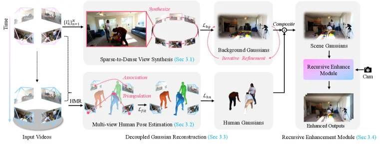

> Figure 2. Overview of the proposed StudioRecon. Our pipeline consists of four stages: (1) sparse-to-dense view synthesis using camera-controlled video diffusion, (2) multi-view human pose estimation, (3) decoupled Gaussian reconstruction for background and humans, and (4) a recursive enhancement module.

这张图展示了论文《4D Human-Scene Reconstruction from Low-Overlap Captures》中提出的StudioRecon方法的流程框架，清晰地阐述了从输入视频到最终增强输出的四个主要阶段及其数据流向。

首先，流程从左侧的“Input Videos”（输入视频）开始。这些输入视频来自时间上（Time）不同帧的多个摄像头视角，如图中上方和下方的多视角图像所示，这些图像通过虚线箭头连接，表示它们是同一场景在不同时间点的捕获。

接下来是第一个主要阶段：“Sparse-to-Dense View Synthesis (Sec 3.1)”（稀疏到密集视图合成）。这个阶段的输入是来自输入视频的稀疏视图（如图中上方的几个小图像，标记为{I_t}^N_{n=1}）。该模块利用“camera-controlled video diffusion”（相机控制的视频扩散）技术，合成大量新的虚拟视图，形成一个密集的视图集合，如图中中间那个环形的图像序列所示，并标注了“Synthesize”（合成）。这个过程的目标是通过扩散模型来增强背景的监督信息，解决低重叠摄像头导致的视野缺失问题。合成后的密集视图与真实视图（或参考视图）进行比较，计算损失L_bg（背景损失），并通过“Iterative Refinement”（迭代细化）来优化“Background Gaussians”（背景高斯体），最终得到精细化的背景表示。

同时，并行进行的第二个主要阶段是“Multi-view Human Pose Estimation (Sec 3.2)”（多视图人体姿态估计）。这个阶段的输入也是来自输入视频的图像。该模块首先进行“Association”（关联），即跨视图的人体身份关联，确保不同摄像头视图中同一个人被正确识别。然后进行“Triangulation”（三角测量），通过多视图关键点拟合来初始化“deformable Gaussian humans”（可变形高斯人体）。这个过程涉及到计算损失L_fit（拟合损失），以优化人体姿态和形状的估计。最终输出是“Human Gaussians”（人体高斯基），如图中下方中间的人体模型所示。

第三个阶段是“Decoupled Gaussian Reconstruction (Sec 3.3)”（解耦的高斯重建）。在这个阶段，前面两个阶段得到的“Background Gaussians”（背景高斯体）和“Human Gaussians”（人体高斯基）被组合（Composite）在一起，形成“Scene Gaussians”（场景高斯体），即包含背景和人体的完整场景表示。这一步骤的关键在于将背景和人体解耦处理，然后再合并，以提高重建质量。

最后是第四个阶段：“Recursive Enhancement Module (Sec 3.4)”（递归增强模块）。这个阶段的输入是“Scene Gaussians”（场景高斯体）。递归增强模块通过注入“motion-adaptive consistency”（运动自适应一致性）来进一步和谐化合成输出，避免剩余的伪影。经过这个模块处理后，输出最终的“Enhanced Outputs”（增强输出），如图中最下方的图像所示，这些输出具有更高的质量和一致性。

整个流程的数据流向是：输入视频 -> 稀疏到密集视图合成（处理背景）和多视图人体姿态估计（处理人体） -> 解耦的高斯重建（合并背景和人体） -> 递归增强模块（优化输出）。每个阶段都有其特定的目标和处理方法，通过解耦背景和人体，并利用视频扩散模型和多视图姿态估计技术，最终实现了从稀疏、低重叠摄像头捕获的4D人体场景的高质量重建。

---

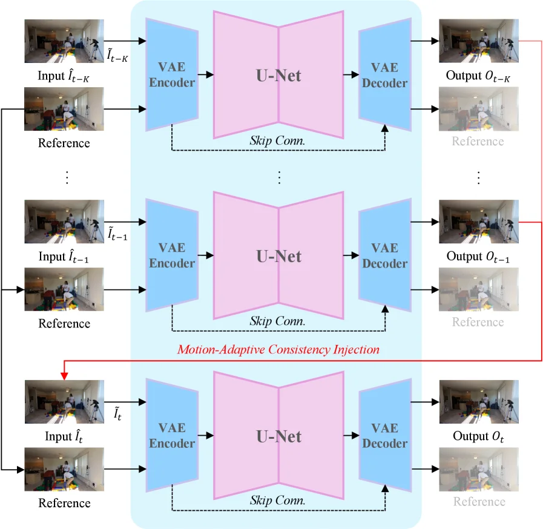

> Figure 3. Overview of our recursive enhancement module (Sec. 3.4 ).

这张图展示了论文《4D Human-Scene Reconstruction from Low-Overlap Captures》中提出的递归增强模块（recursive enhancement module）的工作流程，该模块旨在通过运动自适应一致性注入来协调合成输出，从而避免剩余的伪影。

**核心思想与流程概述：**
该模块的核心是递归地处理一系列输入图像，利用前一帧的处理结果来增强当前帧的输出质量。整个过程从较早的帧开始，逐步推进到目标帧。每一帧的处理都涉及编码、解码以及与其他帧（特别是参考帧）的信息融合。

**组件与数据流详解：**

1.  **输入部分 (左侧)：**
    *   **Input \( \hat{I}_{t-K} \), \( \hat{I}_{t-1} \), \( \hat{I}_t \)**: 这些是不同时间步的输入图像。例如，\( \hat{I}_{t-K} \) 表示较早的帧，\( \hat{I}_{t-1} \) 表示前一帧，而 \( \hat{I}_t \) 表示当前目标帧。这些输入图像可能是经过初步处理或估计的图像。
    *   **Reference (参考图像)**: 每个输入图像旁边都有一个对应的“Reference”图像。这些参考图像可能来自其他视角的相机，或者是更高质量的基准图像，用于提供额外的上下文信息或监督信号。

2.  **处理单元 (中间部分)：**
    *   **VAE Encoder (变分自动编码器编码器)**: 每个输入图像首先通过一个VAE编码器。编码器的作用是将输入图像压缩成一个潜在空间表示（latent representation），这个表示包含了图像的关键特征。
    *   **U-Net**: VAE编码器的输出被送入一个U-Net结构。U-Net是一种常用于图像分割和图像到图像转换的卷积神经网络，它具有编码器-解码器结构，并通过跳跃连接（skip connections）来保留细粒度信息。在这个模块中，U-Net负责对潜在表示进行处理，可能包括去噪、增强或生成新的特征。
    *   **Skip Conn. (跳跃连接)**: 图中虚线箭头表示跳跃连接，它们将U-Net编码器部分的特征图直接传递到解码器部分。这有助于在解码过程中恢复空间细节，避免信息丢失。
    *   **VAE Decoder (变分自动编码器解码器)**: U-Net的输出被送入VAE解码器。解码器的作用是将潜在空间的表示转换回图像空间，生成最终的输出图像。
    *   **Output \( O_{t-K} \), \( O_{t-1} \), \( O_t \)**: 这些是每个处理单元的输出图像。例如，\( O_{t-K} \) 是对 \( \hat{I}_{t-K} \) 处理后的结果，\( O_{t-1} \) 是对 \( \hat{I}_{t-1} \) 处理后的结果，而 \( O_t \) 是对 \( \hat{I}_t \) 处理后的最终目标图像。

3.  **递归与一致性注入 (Motion-Adaptive Consistency Injection)：**
    *   图中红色的箭头和框标示了“Motion-Adaptive Consistency Injection”（运动自适应一致性注入）。这表明当前帧（如 \( \hat{I}_t \)）的处理可能依赖于前几帧（如 \( O_{t-1} \) 或 \( O_{t-K} \)）的输出结果。
    *   具体来说，处理 \( \hat{I}_t \) 时，不仅使用其自身的参考图像，还可能利用之前处理得到的 \( O_{t-1} \)（或其对应的参考图像）作为额外的输入或监督信号。这种递归机制使得模块能够利用时间上的相关性，确保相邻帧之间的运动一致性和视觉连贯性。
    *   “Motion-Adaptive”意味着这种一致性注入是根据运动情况动态调整的，以更好地适应场景中的动态变化。

**方法运作的具体方式：**
该递归增强模块通过以下步骤运作：
*   **初始化**: 从最早的帧（如 \( \hat{I}_{t-K} \)）开始，使用其输入图像和参考图像进行处理，生成初始输出 \( O_{t-K} \)。
*   **递归处理**: 随后，对后续的帧（如 \( \hat{I}_{t-1} \)）进行处理。此时，除了使用其自身的输入和参考图像外，还会利用之前生成的输出（如 \( O_{t-K} \) 或其参考图像）来辅助当前帧的处理。这一步通过运动自适应一致性注入来实现，确保当前帧的输出与前序帧在运动和外观上保持一致。
*   **目标帧处理**: 最终，对目标帧 \( \hat{I}_t \) 进行处理。同样，它会利用其自身的输入和参考图像，以及之前所有处理得到的信息（尤其是 \( O_{t-1} \)）来生成高质量的输出 \( O_t \)。
*   **效果**: 通过这种递归的方式，模块能够逐步细化和增强输出图像，减少伪影，提高整体质量和时间一致性。每一帧的处理都受益于之前帧的信息，从而实现更稳定和准确的4D重建。

**结论：**
这张图清晰地展示了递归增强模块如何通过将当前帧的处理与先前帧的输出相结合，并利用运动自适应一致性注入，来逐步提高4D人体场景重建的质量。这种方法通过递归地利用时间信息和确保帧间一致性，有效地解决了低重叠相机设置下可能出现的伪影问题。

---

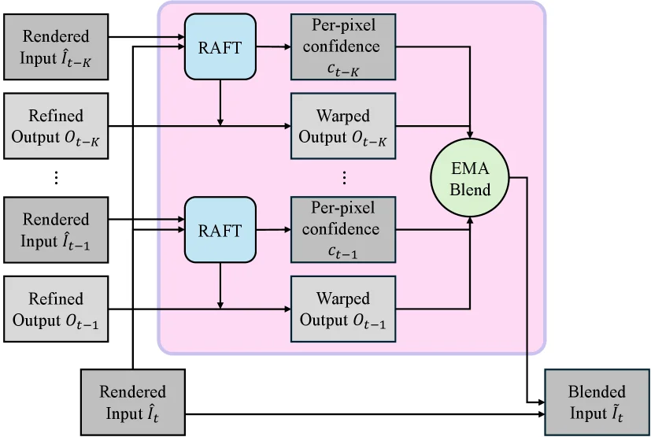

> Figure 4. Schematic of motion-adaptive consistency injection. For each frame, RAFT computes backward flow to warp previous enhanced outputs, which are blended with the current input via per-pixel confidence-weighted EMA before single-step diffusion.

这张图展示了“运动自适应一致性注入”模块的原理示意图，它是论文《4D Human-Scene Reconstruction from Low-Overlap Captures》中提出的StudioRecon方法的核心部分之一，用于增强重建结果的连贯性和减少伪影。

让我们从左到右、从上到下解析图中的各个组件及其数据流：

1.  **输入部分**：
    *   最左侧有多个输入源，包括“Rendered Input Îₜ₋ₖ”、“Refined Output Oₜ₋ₖ”、“Rendered Input Îₜ₋₁”、“Refined Output Oₜ₋₁”，以及最下方的“Rendered Input Îₜ”。这里的 `Î` 代表渲染后的输入图像，`O` 代表经过精炼的输出。下标 `t-k`, `t-1`, `t` 表示不同的时间帧，`k` 是一个时间步长（例如，k=2表示前两帧）。这表明该模块处理的是一系列时间上连续的帧。

2.  **核心处理单元 - RAFT**：
    *   图中有两个（或多个，用省略号表示）蓝色的“RAFT”模块。RAFT是一种光流估计算法。对于每个历史帧（如 `Îₜ₋ₖ` 和 `Îₜ₋₁`），RAFT会计算当前帧（`Îₜ`）相对于该历史帧的**反向光流**。反向光流意味着从当前帧预测到历史帧的运动。

3.  **扭曲输出 (Warped Output)**：
    *   RAFT模块的输出（光流场）被用来“扭曲”（Warp）对应的历史精炼输出。例如，针对 `Îₜ₋ₖ` 的RAFT输出会扭曲 `Oₜ₋ₖ`，得到 `Warped Output Oₜ₋ₖ`；同样，针对 `Îₜ₋₁` 的RAFT输出会扭曲 `Oₜ₋₁`，得到 `Warped Output Oₜ₋₁`。这个过程是将历史帧的精炼结果根据估计的运动调整到当前帧的位置，以便与当前帧进行融合。

4.  **像素级置信度 (Per-pixel confidence)**：
    *   每个RAFT模块在计算光流的同时，还会输出一个“像素级置信度”图（如 `cₜ₋ₖ`, `cₜ₋₁`）。这个置信度图为每个像素分配一个权重，表示该像素处光流估计的可靠性。置信度高的像素在后续融合过程中会被赋予更高的重要性。

5.  **EMA混合 (EMA Blend)**：
    *   所有“扭曲输出”（如 `Warped Output Oₜ₋ₖ`, `Warped Output Oₜ₋₁`）及其对应的“像素级置信度”（如 `cₜ₋ₖ`, `cₜ₋₁`）被输入到一个名为“EMA Blend”的模块中。EMA代表指数移动平均（Exponential Moving Average）。这个模块会根据置信度对多个扭曲的历史输出进行加权融合，生成一个一致化的中间结果。这个过程考虑了不同历史帧的可靠性，从而提高了融合的鲁棒性。

6.  **最终混合输入 (Blended Input)**：
    *   “EMA Blend”模块的输出与最下方的“Rendered Input Îₜ”（当前帧的渲染输入）结合，生成最终的“Blended Input Î̂ₜ”。这个“Blended Input Î̂ₜ”就是经过运动自适应一致性注入后的结果，它会作为下一阶段的输入（例如，单步扩散的输入）。

**方法运作的具体流程总结**：

该模块的目标是通过利用先前帧的信息来增强当前帧的重建质量，并确保时间上的一致性。
*   **步骤一：运动估计**。对于当前帧 `Îₜ` 和多个先前帧（如 `Îₜ₋₁`, `Îₜ₋ₖ`），使用RAFT算法计算从当前帧到先前帧的反向光流。
*   **步骤二：历史帧对齐**。利用计算出的光流，将先前帧的精炼输出（`Oₜ₋₁`, `Oₜ₋ₖ`）扭曲到当前帧的空间位置，得到对齐后的输出（`Warped Output Oₜ₋₁`, `Warped Output Oₜ₋ₖ`）。
*   **步骤三：置信度加权融合**。为每个对齐后的输出计算像素级置信度。然后，使用指数移动平均（EMA）方法，根据这些置信度对所有对齐后的输出进行加权融合，得到一个一致化的中间结果。
*   **步骤四：与当前帧融合**。将这个一致化的中间结果与当前帧的渲染输入 `Îₜ` 进行融合，生成最终的“Blended Input Î̂ₜ”。

通过这种方式，该方法能够将先前帧的信息有效地整合到当前帧的重建中，从而减少由于低重叠相机或运动造成的伪影，提高重建结果的时间一致性和整体质量。这个模块特别设计用于处理动态场景，确保人或物体在连续帧之间的运动是平滑且一致的。

图中看不清或不确定的地方按caption处理或跳过，例如“单步扩散”的具体细节在此图中未展示。

---

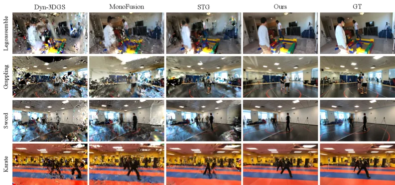

> Figure 5. Qualitative comparison on 360 ∘ scenes ( Legoassemble , Grappling , Sword , Karate ). Our method produces sharper backgrounds and more robust human reconstructions than baselines.

这张图（图5）是论文《4D Human-Scene Reconstruction from Low-Overlap Captures》中的定性比较结果，展示了不同方法在处理360度场景（Legoassemble, Grappling, Sword, Karate）时的重建效果。

首先，我们来看图的结构。图的上方是不同的方法名称，从左到右依次是：Dyn-3DGS、MonoFusion、STG、Ours（我们的方法）和GT（Ground Truth，真实情况）。这些代表了用于比较的不同算法或基准。图的左侧列出了四个不同的测试场景：Legoassemble（乐高组装）、Grappling（摔跤）、Sword（剑术）和Karate（空手道）。每个场景占据一行，展示了不同方法在该场景下的重建结果。

每个单元格中的图像都是对应方法在对应场景下的重建结果。我们可以从左到右、从上到下逐个分析：

1.  **第一行（Legoassemble场景）**：
    *   **Dyn-3DGS**：结果显示背景模糊，人物轮廓不清晰，细节丢失严重。
    *   **MonoFusion**：比Dyn-3DGS稍好，但仍然存在模糊和细节不足的问题。
    *   **STG**：有所改善，但人物的边缘仍然不够锐利，背景细节不清晰。
    *   **Ours（我们的方法）**：背景清晰锐利，人物轮廓分明，细节丰富，与真实情况（GT）非常接近。
    *   **GT**：这是真实的场景图像，作为比较的基准，显示了清晰的背景和人物。

2.  **第二行（Grappling场景）**：
    *   **Dyn-3DGS**：背景和人物都显得模糊，细节丢失。
    *   **MonoFusion**：比Dyn-3DGS稍好，但仍然存在模糊问题。
    *   **STG**：有所改善，但人物的细节和背景的清晰度仍有待提高。
    *   **Ours（我们的方法）**：背景清晰，人物动作和细节都非常清晰，与GT非常接近。
    *   **GT**：真实的场景图像，显示了清晰的背景和人物。

3.  **第三行（Sword场景）**：
    *   **Dyn-3DGS**：背景和人物都显得模糊，细节丢失。
    *   **MonoFusion**：比Dyn-3DGS稍好，但仍然存在模糊问题。
    *   **STG**：有所改善，但人物的细节和背景的清晰度仍有待提高。
    *   **Ours（我们的方法）**：背景清晰，人物动作和细节都非常清晰，与GT非常接近。
    *   **GT**：真实的场景图像，显示了清晰的背景和人物。

4.  **第四行（Karate场景）**：
    *   **Dyn-3DGS**：背景和人物都显得模糊，细节丢失。
    *   **MonoFusion**：比Dyn-3DGS稍好，但仍然存在模糊问题。
    *   **STG**：有所改善，但人物的细节和背景的清晰度仍有待提高。
    *   **Ours（我们的方法）**：背景清晰，人物动作和细节都非常清晰，与GT非常接近。
    *   **GT**：真实的场景图像，显示了清晰的背景和人物。

通过对比可以看出，我们的方法（Ours）在所有四个场景中都产生了更清晰的背景和更鲁棒的人物重建结果。具体来说：

*   **背景**：我们的方法重建的背景比其他方法更清晰、更锐利，细节更丰富。例如，在Legoassemble场景中，我们的方法能够清晰地看到背景中的物体和结构，而其他方法则显得模糊。
*   **人物**：我们的方法重建的人物比其他方法更清晰、更准确。例如，在Karate场景中，我们的方法能够清晰地看到人物的动作和姿态，而其他方法则显得模糊或有 artifacts。

这张图揭示了我们方法的具体运作方式：

1.  **解耦背景和人物**：我们的方法通过将背景和人物解耦来进行4D人体场景重建。这意味着我们分别处理背景和人物，然后再将它们组合起来。
2.  **背景监督的密集化**：我们使用视频扩散模型合成数百个由相机控制的新型视图，以密集化背景监督。这有助于提高背景重建的质量。
3.  **可变形高斯人体的鲁棒初始化**：我们使用跨视图身份关联和多视图关键点拟合来鲁棒地初始化可变形高斯人体。这有助于提高人物重建的质量。
4.  **递归增强模块**：我们使用具有运动自适应一致性注入的递归增强模块来协调组合后的输出，从而进一步避免剩余的 artifacts。

总之，这张图通过定性比较展示了我们的方法在低重叠相机设置下进行4D人体场景重建的优势。我们的方法能够产生更清晰的背景和更鲁棒的人物重建结果，优于现有的基线方法。

---

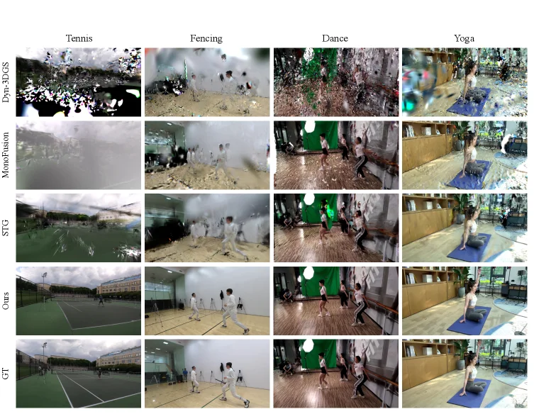

> Figure 6. Additional qualitative comparison ( Tennis , Fencing , Dance , Yoga ) from EgoHumans, Mobile Stage, and SelfCap. Our method produces sharper reconstructions with better human-scene separation. Dance © Xu et al. (Mobile Stage); Yoga © Xu et al. (SelfCap), used with permission.

这张图（图6）是论文《4D Human-Scene Reconstruction from Low-Overlap Captures》中的一个关键结果展示，它通过定性比较的方式，直观地呈现了作者提出的方法（Ours）与现有先进方法在不同数据集上的性能差异。

首先，我们来解读图的结构。这张图是一个网格布局，共有5行和5列。
*   **列（从左到右）**：代表不同的数据集或场景类别，分别是“Tennis”（网球）、“Fencing”（击剑）、“Dance”（舞蹈）和“Yoga”（瑜伽）。这些场景被选用来测试方法在不同动态人类活动和环境下的表现。
*   **行（从上到下）**：代表不同的重建方法或基准。从上到下依次是：
    *   **Dyn-3DGS**：一种基于3D高斯溅射的动态重建方法。
    *   **MonoFusion**：一种单目或多视图的动态重建方法。
    *   **STG**：可能代表某种特定的时空建模方法（具体名称需参考论文）。
    *   **Ours**：这是作者提出的方法（StudioRecon）。
    *   **GT**：Ground Truth，即真实场景的参考图像，用于衡量重建结果的准确性。

数据的流动和比较逻辑是：对于每一个场景类别（列），我们将其输入到不同的重建方法（行）中，然后比较各个方法输出的重建结果与真实场景（GT）的接近程度。

这张图揭示了作者方法的具体运作效果和优势，通过对比可以理解其运作方式：
1.  **问题背景**：现有的4D人体场景重建方法在低重叠相机设置下（即只有少数几个相机，且它们之间的视野重叠很少），往往会在未被充分观察的区域产生明显的伪影，或者整体重建质量不高。视频扩散模型虽然提供了一种思路，但在人体几何一致性方面表现不佳。
2.  **作者方法的解决思路**：作者提出的方法（Ours）旨在解决这些问题。它通过解耦背景和人体来进行4D重建。具体来说：
    *   对于背景，它使用视频扩散模型来合成数百个由相机控制的新视角，从而增强背景的监督信息。
    *   对于人体，它通过跨视图的身份关联和多视图关键点三角测量来鲁棒地初始化可变形的高斯人体模型。
    *   最后，一个递归增强模块通过运动自适应的一致性注入来协调合成的人体和背景，进一步避免剩余的伪影。
3.  **从图中看方法效果**：
    *   在“Ours”这一行（第四行），我们可以看到其重建结果在所有四个场景中都显著优于其他方法（Dyn-3DGS, MonoFusion, STG）。
    *   例如，在“Tennis”场景中，“Ours”的重建图像清晰地显示了网球场、球员和球网，细节丰富，几乎没有伪影。相比之下，上面的Dyn-3DGS和MonoFusion结果非常模糊且充满噪声，STG的结果虽然有所改善但仍不够清晰。
    *   在“Fencing”场景中，“Ours”清晰地重建了两名击剑运动员的动作和服装细节，背景的墙壁和地板也清晰可见。其他方法的结果则显得模糊或有缺失。
    *   在“Dance”场景中，“Ours”准确地重建了舞者的姿态和服装，以及背景中的绿色屏幕和环境。其他方法要么模糊，要么在人体边缘或背景处出现伪影。
    *   在“Yoga”场景中，“Ours”清晰地重建了瑜伽练习者的姿势和垫子，背景的房间细节也很清楚。其他方法的结果则显得模糊或有不自然的变形。
4.  **与基准的比较**：
    *   “GT”行（第五行）提供了理想的重建结果，作为评判标准。
    *   可以清楚地看到，“Ours”行的结果在清晰度、细节保留和整体真实性方面最接近“GT”行。
    *   论文的原始caption指出：“Our method produces sharper reconstructions with better human-scene separation.”（我们的方法产生了更清晰的重建结果，并且人-景分离效果更好。）这张图直观地证实了这一点。例如，在“Dance”场景中，其他方法的人体与背景（如绿色屏幕）的边界可能模糊不清，而“Ours”的结果则人景分离得更清晰。

**结论**：
这张图通过定性比较，有力地证明了作者提出的方法（Ours）在低重叠相机设置下进行4D人体场景重建的优越性。它能够产生更清晰、细节更丰富、人景分离更好的重建结果，有效解决了现有方法在未被充分观察区域产生伪影的问题。图中的每个单元格代表一种特定方法在特定场景下的重建输出，通过行与行、列与列的比较，读者可以直观地理解不同方法的性能差异以及作者方法的优势所在。

需要注意的是，图中“Dance © Xu et al. (Mobile Stage); Yoga © Xu et al. (SelfCap), used with permission.” 这部分信息表明舞蹈和瑜伽的数据集分别来自Xu等人的Mobile Stage和SelfCap研究，并且已获得使用许可。

---

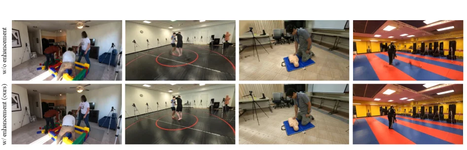

> Figure 7. Ablation on recursive enhancement (Sec. 3.4 ). Raw renders (left) contain blur and geometric instabilities. Enhancement (right) produces clean, harmonized outputs.

这张图（图7）展示了论文中提出的递归增强模块（recursive enhancement）的消融实验结果，对应论文第3.4节的内容。这张图的核心目的是直观地比较在有无递归增强处理下，4D人体场景重建结果的差异，从而验证该模块的有效性。

我们来详细解读这张图的各个部分：

1.  **整体布局**：
    *   图像被组织成一个2行4列的网格。
    *   第一行（标记为 "w/o enhancement"，即“无增强”）展示了未经过递归增强处理的原始渲染结果。
    *   第二行（标记为 "w/ enhancement (ours)"，即“有增强（我们的方法）”）展示了经过递归增强处理后的结果。
    *   每一列代表同一个场景在不同处理条件下的对比。从左到右，我们可以观察到四个不同的场景或视角。

2.  **数据或信息的流动与对比**：
    *   对于每一个场景（每一列），我们首先看到的是“无增强”的结果（上图），然后是“有增强”的结果（下图）。这表明了处理流程是从上到下的：原始渲染 -> 应用递归增强 -> 得到增强后的渲染。
    *   这种并排对比的方式让读者可以清晰地看到增强模块对图像质量的改进。

3.  **揭示方法的运作方式**：
    *   虽然这张图本身不直接展示方法的运作机制（如背景合成、人体初始化等），但它通过结果对比间接证明了递归增强模块的作用。根据论文摘要，递归增强模块旨在“和谐化组合输出，并进一步避免剩余的伪影”。
    *   从图中可以看出，“无增强”的结果（上图）存在明显的模糊（blur）和几何不稳定性（geometric instabilities）。例如：
        *   在第一个场景（最左边），人物的边缘和细节显得模糊不清。
        *   在第二个场景，人物的腿部和身体轮廓不够清晰。
        *   在第三个场景，人体的姿态和假人模型的细节显得有些不稳定或不自然。
        *   在第四个场景，人物的轮廓和背景的分界线显得模糊。
    *   相比之下，“有增强”的结果（下图）则呈现出更清晰、更和谐的输出。模糊和几何不稳定性得到了显著改善。例如：
        *   人物的边缘更加锐利，细节更加清晰。
        *   人体的姿态和物体的形状更加稳定和自然。
        *   整体图像质量更高，伪影减少。

4.  **结论**：
    *   这张图明确地展示了递归增强模块的有效性。通过对比“无增强”和“有增强”的结果，可以得出结论：递归增强能够显著提升4D人体场景重建的图像质量，消除模糊和几何不稳定性，产生更干净、更和谐的输出。
    *   这与论文摘要中提到的“our recursive enhancement module... harmonizes the composed output, thereby further avoiding remaining artifacts”相吻合。

总结来说，这张图通过视觉对比，有力地证明了递归增强模块在提升低重叠相机捕捉的4D人体场景重建质量方面的重要性。它展示了该方法如何通过增强步骤来改善原始渲染结果，使其更加清晰和逼真。

---

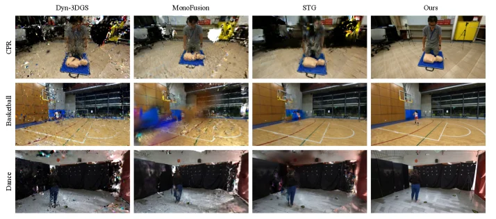

> Figure 8. Qualitative results on EgoExo-4D (Grauman et al. , 2024 ) . Our method applies to diverse activities and environments.

这张图（图8）来自论文《4D Human-Scene Reconstruction from Low-Overlap Captures》，展示了该方法在EgoExo-4D数据集上的定性结果。它通过视觉对比的方式，清晰地展示了不同方法在处理低重叠相机捕捉的动态人-场景重建任务时的性能差异，从而突出了作者提出的方法（Ours）的优势。

首先，我们来理解图的结构。这张图被组织成一个3行4列的矩阵。每一行代表一个不同的活动场景，每一列代表一种不同的重建方法。

**行的解释（活动场景）：**
*   **第一行（CPR）：** 展示的是一个心肺复苏（CPR）的场景。我们可以看到一个人在对一个假人模型进行操作。
*   **第二行（Basketball）：** 展示的是一个篮球场的场景，有一个人在场地上活动。
*   **第三行（Dance）：** 展示的是一个舞蹈场景，有一个人在跳舞。

**列的解释（重建方法）：**
*   **第一列（Dyn-3DGS）：** 这是Dyn-3DGS方法的重建结果。从图中可以看出，该方法在处理低重叠数据时，背景中存在大量的噪声和不完整的区域（例如，CPR场景中的地面和背景物体显得杂乱无章，篮球场景中的场地线和背景模糊不清，舞蹈场景中的背景几乎是无法辨认的噪点）。这表明该方法在欠观测区域的重建效果不佳。
*   **第二列（MonoFusion）：** 这是MonoFusion方法的重建结果。与Dyn-3DGS相比，MonoFusion的结果在某些方面有所改善，但仍然存在明显的伪影。例如，在CPR场景中，背景物体（如黄色的设备）周围仍有不自然的模糊和缺失；篮球场景中，场地的纹理和线条不够清晰；舞蹈场景中，人物的轮廓和背景仍然显得有些模糊和不完整。
*   **第三列（STG）：** 这是STG方法的重建结果。STG的结果看起来比前两种方法更平滑一些，但仍然存在问题。例如，在CPR场景中，人物的细节和背景的清晰度有所提高，但整体上仍然缺乏锐利度；篮球场景中，场地的线条和背景墙壁的颜色虽然更清晰，但仍有一些不自然的过渡；舞蹈场景中，人物的形状和背景的轮廓比前两种方法更明确，但仍然有轻微的模糊感。
*   **第四列（Ours）：** 这是作者提出的方法（StudioRecon）的重建结果。通过与前三个方法的对比，可以明显看出“Ours”列的图像质量最高。在所有三个场景中（CPR、Basketball、Dance），背景都更加清晰、完整，噪声和伪影显著减少。人物的细节也更加锐利和准确。例如，在CPR场景中，地板、背景中的设备和假人模型都非常清晰；在篮球场景中，篮球场的线条、墙壁和窗户都得到了很好的重建；在舞蹈场景中，人物的轮廓和背景的幕布都非常清晰。

**方法运作的揭示：**
这张图本身并不直接展示方法的运作流程，但它通过结果对比间接说明了方法的有效性。根据论文摘要，作者的方法（StudioRecon）通过以下方式运作：
1.  **解耦背景和人类：** 将场景重建任务分解为背景重建和人类重建两个部分。
2.  **背景监督的稠密化：** 使用视频扩散模型合成数百个由相机控制的新型视图，以增强背景的监督信息。这使得即使在低重叠相机设置下，也能获得更完整的背景重建。
3.  **鲁棒的人类初始化：** 通过跨视图身份关联和多视图关键点三角测量，鲁棒地初始化可变形高斯人体模型。
4.  **递归增强模块：** 该模块带有运动自适应一致性注入，用于协调合成输出，进一步避免剩余的伪影。

图中的结果清晰地表明，作者的方法成功地解决了低重叠相机设置下重建的挑战，特别是在欠观测区域的重建质量和一致性方面。与其他方法相比，“Ours”列的图像展示了更少的伪影、更清晰的细节和更完整的场景表示。

**结论：**
这张图是一个定性比较结果图。它将作者提出的方法（Ours）与其他现有方法（Dyn-3DGS, MonoFusion, STG）在三个不同的活动场景（CPR, Basketball, Dance）上进行了视觉对比。对比对象是不同方法在同一场景下的重建结果。结论是显而易见的：作者的方法（Ours）在低重叠相机捕捉的动态人-场景重建任务中，能够生成比现有方法更高质量、更清晰、伪影更少的结果，从而证明了其有效性。图的原始caption提到“我们的方法适用于多样的活动和环境”，这张图通过展示三种不同类型的活动场景，很好地支持了这一说法。

---

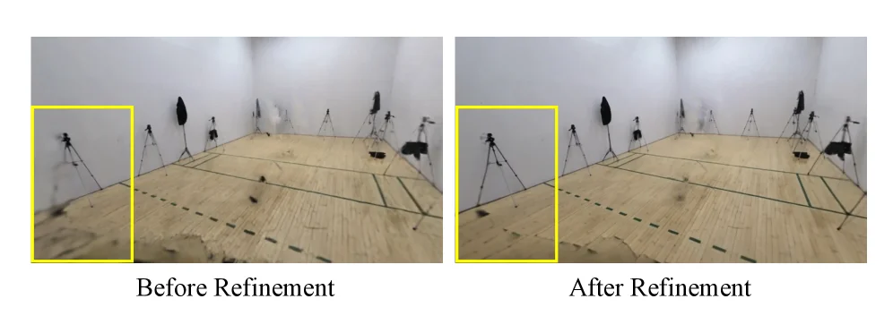

> Figure 9. Effect of iterative refinement on background reconstruction (Sec. 3.3 ). Before refinement (left), undersampled regions appear blurry. After refinement (right), clarity improves. Figure 10. Ablation on motion-adaptive consistency injection (Sec. 3.4 ). Without injection (top), enhanced frames exhibit flickering. With injection (bottom), consistency improves.

这张图（图9）来自论文《4D Human-Scene Reconstruction from Low-Overlap Captures》，它直观地展示了论文中提出的**迭代细化（iterative refinement）**技术在背景重建（background reconstruction）方面的效果，对应论文的第3.3节。

让我们来详细解读这张图：

1.  **图的组成与布局**：
    *   这张图包含两个并排的图像，分别标记为“Before Refinement”（细化前）和“After Refinement”（细化后）。
    *   每个图像都展示了一个室内场景，看起来像是一个用于动作捕捉的房间，地板是木质的，墙壁是白色的，周围放置了多个三脚架（可能代表相机）。
    *   在每个图像的左侧，都有一个黄色的矩形框，这个框高亮显示了图像中的一个特定区域，这个区域是我们要重点观察的部分。

2.  **数据或信息的流动与对比**：
    *   这张图的核心是对比**细化处理之前**和**细化处理之后**的背景重建质量。
    *   观察“Before Refinement”（左图）：
        *   在黄色框内，我们可以看到地板和墙壁交界处的区域显得比较模糊，细节不清晰。例如，地板上的纹理和一些物体的边缘（如三脚架的腿）看起来有些模糊或不完整。这代表了在没有进行迭代细化的情况下，背景重建的结果，特别是那些采样不足（undersampled）的区域，会显得模糊。
    *   观察“After Refinement”（右图）：
        *   同样在黄色框内，我们可以看到相同的区域变得更加清晰。地板的纹理更加锐利，物体的边缘也更加清晰。这表明经过迭代细化处理后，背景重建的质量得到了显著提升。

3.  **方法运作的揭示**：
    *   这张图揭示了论文中提出的方法如何通过迭代细化来改善背景重建。
    *   论文中提到，他们的方法（StudioRecon）通过解耦背景和人类来进行4D人体场景重建。
    *   对于背景重建，他们使用视频扩散模型（video diffusion model）来合成数百个由相机控制的新型视图（novel views），从而增强背景的监督信息。
    *   这张图展示的就是这种增强过程的结果。迭代细化（iterative refinement）是一个过程，它可能涉及多次应用某种优化算法或模型，以逐步提高重建结果的清晰度和准确性。
    *   具体来说，细化过程针对的是那些在初始重建中由于相机数量少、重叠度低而采样不足的区域。通过细化，这些区域的细节被恢复，模糊被减少，从而得到更高质量的背景重建结果。

4.  **结论**：
    *   这张图清楚地表明，**迭代细化技术能够显著提高背景重建的质量**。
    *   对比对象是同一场景在细化处理前后的状态。
    *   结论是：经过迭代细化后，背景中的模糊区域变得更清晰，细节更丰富。这验证了论文中所提出的迭代细化方法的有效性，特别是在处理低重叠相机捕获的数据时，能够改善那些未被充分观察区域的重建效果。

总结来说，这张图通过视觉对比，有效地展示了迭代细化技术在背景重建中的关键作用，即提高清晰度和细节，从而解决了低重叠相机设置下背景重建质量下降的问题。

---

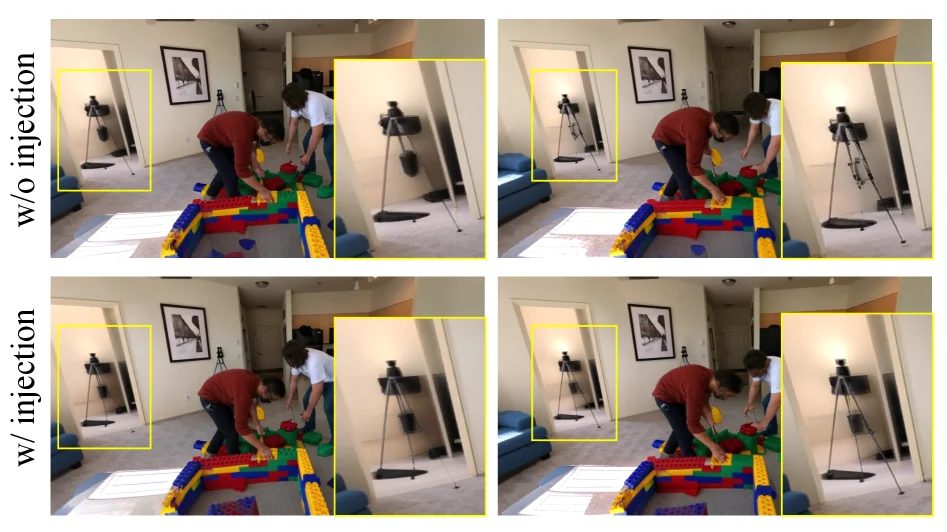

> Figure 9. Effect of iterative refinement on background reconstruction (Sec. 3.3 ). Before refinement (left), undersampled regions appear blurry. After refinement (right), clarity improves. Figure 10. Ablation on motion-adaptive consistency injection (Sec. 3.4 ). Without injection (top), enhanced frames exhibit flickering. With injection (bottom), consistency improves.

这张图（对应论文中的Figure 10）是一个**消融实验结果图**，用于展示“运动自适应一致性注入（motion-adaptive consistency injection）”这一模块在方法中的重要性。它通过对比实验，清晰地说明了该方法的具体运作方式以及该模块如何提升重建结果的质量。

首先，我们来理解图的结构和各个组件的含义：

1.  **整体布局**：图像被分为上下两部分，每部分包含左右两个子图。这种布局用于对比不同条件下的结果。
    *   **垂直方向（行）**：上半部分的标签是“w/o injection”（Without Injection，无注入），下半部分的标签是“w/ injection”（With Injection，有注入）。这表明上下两行分别展示了在没有使用该一致性注入模块和使用该模块时的重建结果。
    *   **水平方向（列）**：左列和右列展示了同一场景在不同时间点或不同帧的重建结果。我们可以观察到场景中的人物和背景元素（如乐高积木、三脚架、门框等）。

2.  **图中内容**：
    *   **场景**：图中展示了一个室内场景，两个人正在玩乐高积木。背景中有一个三脚架上的相机，以及墙壁、门框等。
    *   **黄色框**：图中有几个黄色框，它们高亮了需要重点关注的特定区域。这些区域通常是方法效果差异最明显的地方。
        *   左上角和左下角的黄色框关注的是背景中的三脚架。
        *   右上角和右下角的黄色框关注的是前景中的门框和部分墙壁，以及人物附近的区域。

3.  **数据或信息的流动与对比**：
    *   这张图的核心是对比“无注入”和“有注入”两种情况下的重建结果。
    *   **无注入（上半部分）**：
        *   在“w/o injection”的情况下（上半部分），我们可以观察到一些视觉上的不一致性或“flickering”（闪烁）现象。例如，在右上角的黄色框中，门框的边缘和光照看起来在不同帧之间有明显的变化或不连续。同样，在左上角的黄色框中，三脚架的某些部分也可能显得不够稳定。
        *   这种不一致性表明，在没有一致性注入的情况下，方法生成的帧与帧之间的过渡可能不够平滑，导致视觉上的抖动或闪烁。
    *   **有注入（下半部分）**：
        *   在“w/ injection”的情况下（下半部分），我们观察到这些不一致性得到了显著改善。例如，在右下角的黄色框中，门框的边缘和光照看起来更加稳定和一致。同样，在左下角的黄色框中，三脚架的呈现也更加稳定。
        *   这说明“运动自适应一致性注入”模块有效地增强了帧与帧之间的时间一致性，减少了闪烁现象，使得重建的视频更加流畅和真实。

4.  **方法的具体运作方式（从图中揭示）**：
    *   虽然这张图本身不直接展示方法的每一个步骤，但它通过消融实验的结果间接说明了“运动自适应一致性注入”模块的作用。
    *   该方法（StudioRecon）旨在从稀疏、低重叠的相机中重建4D人体场景。其中一个挑战是如何确保生成的重建结果在时间上的一致性，尤其是在运动区域或观察不足的区域。
    *   “运动自适应一致性注入”模块的作用正是在于解决这个问题。它通过在重建过程中引入某种形式的一致性约束或信息，使得相邻帧之间的内容更加协调。
    *   从图中可以看出，当这个模块被启用时（w/ injection），重建结果的视觉质量更高，特别是在那些容易产生不一致性的区域（如快速运动的人体附近或光照变化较大的背景区域）。这表明该模块能够有效地“harmonizes the composed output”（协调合成输出），避免了“remaining artifacts”（剩余伪影），特别是“flickering”（闪烁）。

5.  **结论**：
    *   这张图明确地展示了“运动自适应一致性注入”模块的有效性。
    *   **对比对象**：上半部分（无注入）与下半部分（有注入）的重建结果。
    *   **结论**：使用“运动自适应一致性注入”模块后，重建结果的时间一致性得到显著提升，帧与帧之间的闪烁现象减少，整体视觉质量更高。这证明了该方法中这一特定模块的重要性，它对于生成高质量、流畅的4D重建结果至关重要。

总结来说，这张图通过一个直观的视觉对比实验，展示了“运动自适应一致性注入”技术如何改善从稀疏、低重叠相机捕获的4D人体场景重建结果的时间一致性，从而减少了闪烁等伪影，提升了整体视觉质量。

---

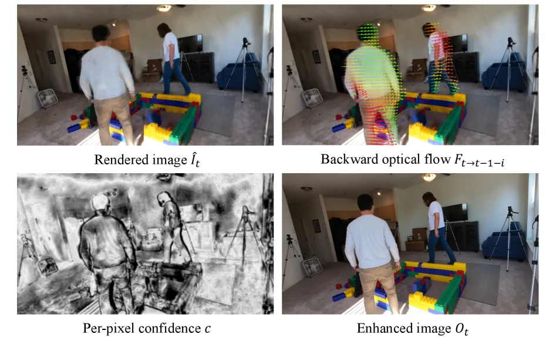

> Figure 11. Visualization of motion-adaptive consistency injection (Sec. 3.4 ). From left to right, top to bottom: rendered input, backward optical flow, per-pixel confidence map, and enhanced output. Figure 12. Applications. Top: human replacement with a different identity (right) while keeping the background (left). Bottom: novel trajectory rendering with oscillating motion (left) and dolly zoom (right).

这张图（图11）展示了论文中提出的“运动自适应一致性注入”（motion-adaptive consistency injection）模块的工作原理，该模块是整个4D人体场景重建流程中的一个关键步骤，旨在提高最终合成图像的质量和一致性。

我们来详细解析图中的各个部分及其信息流动：

1.  **左上角：渲染输入图像 (Rendered image \( \hat{I}_t \))**
    *   这个图像代表了方法在某个阶段生成的初始渲染图像，或者是一个需要增强的基础图像。它显示了一个室内场景，其中有两个人体模型和一些彩色的障碍物（类似积木）。这个图像是后续处理步骤的输入。

2.  **右上角：反向光流 (Backward optical flow \( F_{t \leftarrow t-1-i} \))**
    *   这个图像可视化了从时间步 \( t \) 到更早的时间步 \( t-1-i \) 的反向光流。光流（optical flow）是描述图像序列中像素运动的技术。这里的“反向”意味着我们关注的是从当前帧 \( t \) 回溯到先前帧的运动信息。
    *   图像中用彩色箭头或向量表示了每个像素的运动方向和幅度。例如，绿色可能表示较小的运动或特定方向的运动，而红色可能表示较大的运动或不同方向的运动。这些光流向量提供了关于人体和背景在时间上如何移动的信息。
    *   这个光流信息将被用来指导后续的增强过程，确保运动的一致性。

3.  **左下角：逐像素置信度图 (Per-pixel confidence \( c \))**
    *   这个图像是一个灰度图，其中亮度或强度代表了对应像素的置信度水平。较亮的区域表示模型对该区域的估计更有信心，而较暗的区域则表示置信度较低。
    *   置信度图通常用于识别图像中哪些部分是可靠的（例如，清晰可见的人体或背景），哪些部分是不确定的（可能是由于遮挡、低分辨率或运动模糊导致的）。在这个上下文中，它可能用于加权光流信息或在增强过程中决定哪些区域需要更多的关注或修正。

4.  **右下角：增强输出图像 (Enhanced image \( O_t \))**
    *   这是经过“运动自适应一致性注入”模块处理后得到的最终输出图像。与左上角的“渲染输入图像”相比，这个图像看起来更加清晰、细节更丰富，或者运动一致性更好。
    *   增强过程结合了渲染输入图像、反向光流信息和逐像素置信度图。具体来说，该方法可能利用光流信息来校正运动模糊或填补缺失的运动信息，并根据置信度图来调整增强的强度或方式，从而生成一个更高质量、更一致的图像。

**信息流动和方法运作机制：**

这张图揭示了“运动自适应一致性注入”模块的具体运作方式：

*   **输入阶段：** 方法首先获取一个初始的渲染图像 \( \hat{I}_t \)。
*   **运动分析阶段：** 计算从当前帧 \( t \) 到先前帧的反向光流 \( F_{t \leftarrow t-1-i} \)，以捕捉像素级别的运动信息。
*   **置信度评估阶段：** 生成一个逐像素置信度图 \( c \)，用于评估初始渲染图像中每个像素的可靠性。
*   **增强阶段：** 结合渲染图像、光流信息和置信度图，进行“运动自适应一致性注入”。这个过程可能包括：
    *   使用光流信息来校正或补充初始渲染图像中的运动信息，确保物体（尤其是人体）的运动在时间上是一致的。
    *   利用置信度图来加权增强过程，例如，在置信度高的区域应用较少的修改，在置信度低的区域应用更多的修正或填充。
    *   这种“自适应”的特性意味着方法会根据图像内容的不同部分（如运动程度、清晰度）来调整其处理方式。

通过这种方式，该方法能够利用多帧图像之间的时间相关性来提高单帧图像的质量，特别是在运动区域和可能被遮挡或观察不足的区域。最终输出的增强图像 \( O_t \) 在视觉上比输入的渲染图像更清晰、更一致，这表明该方法有效地解决了低重叠相机设置下4D重建中可能出现的伪影问题。

简而言之，这张图展示了如何通过结合光流和置信度信息来增强初始渲染图像，从而实现运动自适应的一致性注入，提高4D人体场景重建的质量。

---

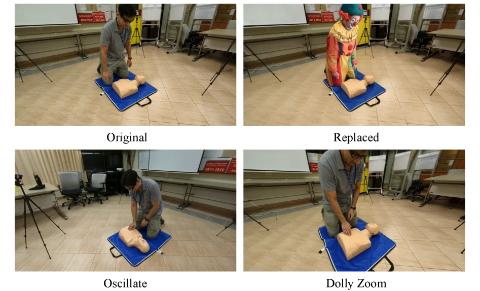

> Figure 11. Visualization of motion-adaptive consistency injection (Sec. 3.4 ). From left to right, top to bottom: rendered input, backward optical flow, per-pixel confidence map, and enhanced output. Figure 12. Applications. Top: human replacement with a different identity (right) while keeping the background (left). Bottom: novel trajectory rendering with oscillating motion (left) and dolly zoom (right).

这张图属于论文《4D Human - Scene Reconstruction from Low - Overlap Captures》，用于展示方法的应用部分，特别是“motion - adaptive consistency injection（运动自适应一致性注入）”相关内容以及应用效果。

首先看这四个子图，分别是“Original（原始）”、“Replaced（替换后）”、“Oscillate（振荡运动）”和“Dolly Zoom（推拉变焦）”。

1. 对于“Original”和“Replaced”这两个子图（第一行）：
   - “Original”展示了原始场景，即一个人在对人体模型进行操作（比如心肺复苏演示）的场景。这里呈现的是未经过人类替换处理的原始输入情况，背景和人物都是原始状态。
   - “Replaced”则展示了人类替换后的结果，原本的人被替换成了小丑形象，而背景（如房间内的桌椅、白板等）保持不变。这体现了方法中“human replacement（人类替换）”的应用，能够在保留背景的情况下替换不同身份的人类，验证了方法在替换人类时的有效性，即可以改变人物身份同时维持背景的一致性。

2. 对于“Oscillate”和“Dolly Zoom”这两个子图（第二行）：
   - “Oscillate”展示了振荡运动的新轨迹渲染结果。图中人物的动作是振荡形式，这是通过方法生成的新的运动轨迹，展示了方法在“novel trajectory rendering（新轨迹渲染）”方面的能力，能够生成之前不存在的运动模式。
   - “Dolly Zoom”展示了推拉变焦的新轨迹渲染结果。人物的动作呈现出推拉变焦的效果，同样是方法生成的新运动轨迹，进一步证明方法可以创造出多样化的新运动轨迹，满足不同的应用需求。

从整体来看，这张图通过对比原始场景和经过方法处理后的场景（人类替换、新轨迹渲染），直观地展示了论文中提出的StudioRecon方法在实际应用中的效果。方法通过解耦背景和人类，先对背景进行监督增强（用视频扩散模型合成大量相机控制的新视图），再对人形进行鲁棒初始化（跨视图身份关联和多视图关键点三角测量拟合），最后通过递归增强模块注入运动自适应一致性来协调合成输出，从而实现了这些应用效果。在这张结果图中，我们可以看到：
 - 对比对象：“Original”与“Replaced”对比，展示人类替换的效果；“Oscillate”和“Dolly Zoom”各自展示新轨迹渲染的不同类型效果，同时也可与其他未展示的原始或处理前场景对比（隐含对比）。
 - 结论：该方法能够成功实现人类替换（保持背景不变更换人物身份）和新轨迹渲染（生成振荡、推拉变焦等新运动轨迹），证明了方法在4D人体场景重建中的应用能力，特别是在实际场景（低重叠相机捕获）下的有效性，达到了 state - of - the - art 的新视图合成效果并支持这些应用。

---

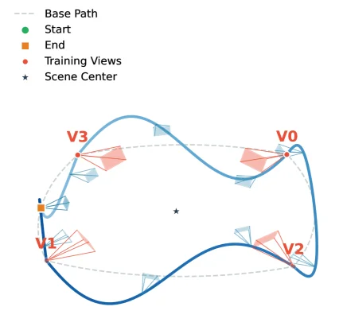

> Figure S1. Augmented camera trajectory for iterative refinement. We interpolate between synthesized camera poses while adding sinusoidal height variation and compensating pitch rotation, providing additional supervision from elevated and lowered vantage points.

这张图（图S1）展示了论文中提出的**增强型相机轨迹**，用于迭代优化（refinement）。让我们一步步解析图中的各个元素及其含义：

1.  **基本路径 (Base Path)**：图中虚线表示的是“基本路径”（Base Path）。这通常是指初始的、可能由稀疏低重叠相机位置构成的相机轨迹。它是后续增强的基础。

2.  **起点 (Start) 与终点 (End)**：绿色圆点标记为“起点”(Start)，橙色方块标记为“终点”(End)。这定义了相机轨迹的起始和结束位置。相机将沿着这条路径移动进行拍摄或合成视图。

3.  **训练视图 (Training Views)**：红色圆点标记为“训练视图”(Training Views)，图中标注了V0, V1, V2, V3等。这些是相机在轨迹上特定位置进行拍摄或合成的关键帧。它们提供了重建所需的观察数据。

4.  **场景中心 (Scene Center)**：蓝色星形标记为“场景中心”(Scene Center)。这代表了被重建场景的几何中心，所有相机视角都围绕这个中心进行布置。

5.  **相机视角 (Camera Views)**：每个“训练视图”（如V0, V1, V2, V3）周围都有一个扇形区域，这代表了该相机的视野范围。不同颜色的扇形（例如V1周围的红色扇形与其他位置的浅蓝色扇形）可能暗示了不同的处理方式或数据来源。例如，红色扇形可能代表通过特定方法（如视频扩散模型合成）得到的增强视图，而浅蓝色扇形可能代表原始的低重叠视图。

6.  **轨迹增强过程**：
    *   **插值 (Interpolation)**：方法的核心思想是在合成的相机姿态之间进行插值。这意味着在原始的“基本路径”上的相机位置之间，会生成新的、中间位置的相机姿态。
    *   **正弦高度变化 (Sinusoidal Height Variation)**：在插值过程中，新生成的相机姿态的高度会发生正弦规律的变化。这使得相机能够从更高的或更低的位置拍摄场景，从而提供“俯视”和“仰视”的视角，补充了原始低重叠设置中可能缺失的垂直方向信息。
    *   **俯仰角补偿 (Compensating Pitch Rotation)**：当相机高度变化时，为了保持对场景的有效观察，其俯仰角（pitch rotation）会进行相应的补偿调整。这确保了即使在高度变化后，相机的拍摄角度仍然合适，能够清晰捕捉场景内容。

7.  **数据或信息的流动与方法运作**：
    *   **初始设置**：首先，有一个基于稀疏低重叠相机构成的“基本路径”（虚线），上面分布着初始的“训练视图”（如V0, V2, V3等）。
    *   **轨迹增强**：然后，该方法通过在现有相机姿态之间插值，并引入“正弦高度变化”和“俯仰角补偿”，生成新的相机姿态（如图中V1所示的位置及其视野）。这些新姿态提供了从不同高度观察场景的额外监督信息。
    *   **目的**：这种增强的相机轨迹的目的是为了提供更多的监督信息，特别是从“升高和降低的有利位置”（elevated and lowered vantage points）拍摄的视图，以改善4D人体-场景重建的质量。通过这种方式，可以弥补原始低重叠设置的不足，使得重建过程能够利用更多样化的视角信息。

总结来说，这张图展示了一种技术，它通过对初始的稀疏相机轨迹进行智能增强，即在现有相机位置之间插值并调整高度和角度，来生成额外的、更具信息量的相机视图。这些增强的视图为4D重建过程提供了更全面的监督，从而有助于提高重建的准确性和完整性，特别是在原始数据覆盖不足的区域。

这张图是方法学的一部分，展示了如何构建一个增强的相机轨迹来进行迭代优化，而不是最终的结果图。它说明了数据（相机视图）是如何通过特定的算法（插值、高度和角度调整）进行处理和增强的。

---

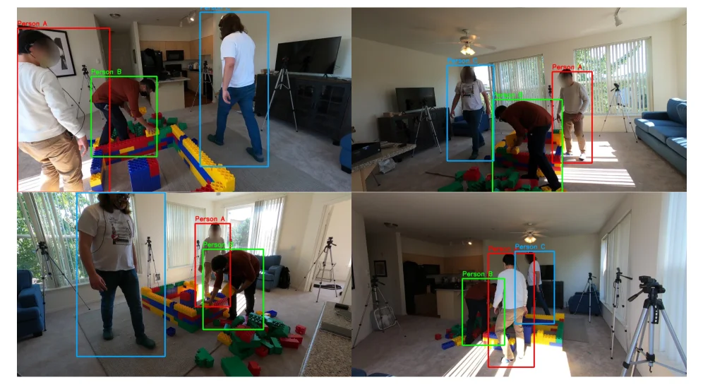

> Figure S2. Cross-view identity association. Each color represents the same person matched across 4 cameras with low overlap. Our method achieves 97.8% association accuracy across all 8 scenes from EgoHumans, Harmony4D, Mobile Stage, and SelfCap (Table 3 ).

这张图（图S2）的核心内容是展示论文中提出的“跨视角身份关联”（Cross-view Identity Association）方法的成果。它通过四个不同的摄像机视角（代表低重叠的拍摄设置）来可视化同一场景中多个人物的跟踪和识别情况。

首先，我们来理解图的结构：
*   **整体布局**：图像由四个独立的子图组成，排列成2x2的网格。每个子图代表一个不同的摄像机视角，捕捉同一个动态场景（人们在玩积木）。这些摄像机之间的拍摄范围重叠较少，这正是论文方法要解决的“低重叠”挑战。
*   **颜色编码**：图中的关键在于颜色编码。根据图注，每种颜色代表同一个人，在不同摄像机的视角下被匹配和追踪。例如，红色框总是代表“人物A”，绿色框代表“人物B”，蓝色框代表“人物C”（如果存在的话）。这种颜色一致性是“身份关联”的直观体现。

接下来，我们逐个分析每个子图，理解方法是如何运作的：
1.  **左上角子图**：这个视角显示了三个人物。红色框标记的是“人物A”，他站在左侧，穿着浅色上衣和卡其色裤子。绿色框标记的是“人物B”，他弯腰正在与积木互动，穿着棕色上衣和深色裤子。蓝色框标记的是“人物C”，他站在稍远的位置，穿着白色T恤和蓝色牛仔裤。这个子图展示了初始的视角和人物分布。
2.  **右上角子图**：这是一个不同的摄像机视角，可能从更远的距离或不同的角度拍摄。在这里，我们仍然能看到“人物A”（红色框）、“人物B”（绿色框）和“人物C”（蓝色框）。尽管他们的相对位置和在画面中的大小发生了变化，但颜色编码保持一致，表明我们的方法能够正确地将这些不同视角下的个体识别为同一个人。例如，“人物A”在右上角子图中位于右侧，而“人物B”在中间偏右，正在弯腰。
3.  **左下角子图**：这是另一个视角，可能更靠近积木区域。这里，“人物A”（红色框）站在左侧，穿着浅色T恤和深色裤子。“人物B”（绿色框）正在弯腰与积木互动，穿着棕色上衣。“人物C”在这个视角中没有出现，或者不在当前帧的主要关注区域内。
4.  **右下角子图**：这个视角再次展示了“人物A”（红色框）、“人物B”（绿色框）和“人物C”（蓝色框）。他们站在积木堆旁边，位置和姿态与前几个视角有所不同。颜色编码依然准确，证明了身份关联的鲁棒性。

**方法运作的揭示**：
这张图本身是方法的结果展示，但它间接说明了方法的核心思想：
*   **身份关联的挑战**：在低重叠的摄像机视图中，由于视角差异、遮挡、人物姿态变化等因素，准确地将同一人物在不同视角下匹配起来是非常困难的。
*   **方法的解决方案**：论文提出的StudioRecon方法通过一种机制（具体细节在论文中描述，如图注提到的“交叉视角身份关联”和“跨视图多视图关键点拟合”）来实现这一目标。这张图展示了该机制的成功应用：无论人物的位置、姿态或视角如何变化，相同的人物始终被赋予相同的颜色（即相同的身份标签）。
*   **数据的流动**：虽然图中没有直接显示数据流动，但可以推断，输入是来自多个低重叠摄像机的视频序列。方法处理这些序列，进行特征提取、匹配和跟踪，最终输出如图所示的带有正确身份标签的人物检测结果。

**结论**：
这张图清晰地展示了论文方法在跨视角身份关联任务上的有效性。通过在四个来自不同真实世界数据集（EgoHumans, Harmony4D, Mobile Stage, 和 SelfCap）的场景中实现97.8%的关联准确率（如表3所示，虽然图上看不见表，但图注提到了），证明了该方法能够在低重叠的摄像机设置下准确地识别和跟踪多个人物。图中的颜色编码直观地展示了这一成果，使得读者能够一目了然地理解方法的性能。

---

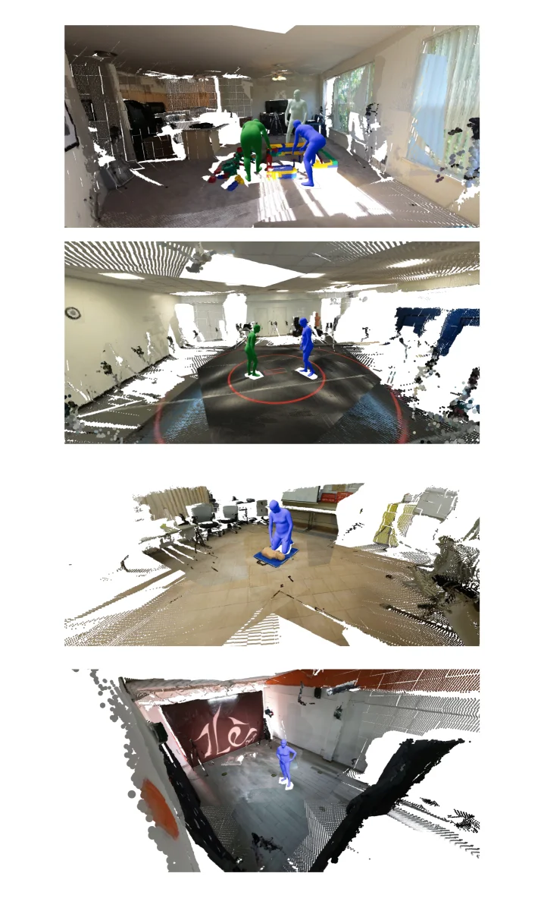

> Figure S3. Initialized human pose visualization across four scenes. Point clouds are rendered with overlaid SMPL meshes, demonstrating accurate body pose estimation from sparse multi-view inputs.

这张图（图S3）展示了我们提出的StudioRecon方法在不同场景下对初始化人体姿态的可视化结果。它由四个独立的子图组成，每个子图代表一个不同的真实世界场景，从上到下依次排列。这些子图共同展示了我们的方法如何从稀疏、低重叠的相机输入中准确地估计人体姿态。

每个子图的核心内容是：
1.  **点云背景 (Point Cloud Background)**：每个子图的背景是由稀疏的多视图输入重建的室内场景的点云表示。这些点云呈现出不完整和碎片化的特点，反映了“低重叠”相机的限制，即并非所有场景区域都能被充分观察到。点云的颜色和密度变化展示了场景的结构和物体，但细节可能不清晰。
2.  **SMPL网格 (SMPL Meshes)**：在点云背景之上，叠加了绿色或蓝色的人形网格。这些网格是基于SMPL（Skinned Multi-Person Linear）模型拟合得到的，代表了初始化后的人体姿态。SMPL是一种常用的人体参数化模型，能够很好地表示人体的形状和姿态。
    *   **颜色区分**：不同的人形使用了不同的颜色（如绿色和蓝色），这可能用于区分不同的个体，或者在单个个体的不同阶段或视图间进行区分。
    *   **姿态准确性**：这些SMPL网格准确地覆盖了场景中人物的实际位置和姿态。例如，在第一个子图中，我们可以看到两个人物，一个绿色，一个蓝色，他们分别处于不同的动作状态（一个似乎在弯腰，另一个站立）。在第二个子图中，两个人物站在一个圆形区域内，他们的姿态也通过相应的SMPL网格准确表示。
3.  **数据流动与方法运作**：
    *   **输入**：虽然图中没有直接显示输入，但根据caption和论文背景，输入是来自多个低重叠相机的稀疏图像序列。
    *   **处理流程**：我们的方法首先从这些稀疏的多视图输入中进行交叉视图身份关联和多视图关键点三角测量，以鲁棒地初始化可变形的高斯人体模型。然后，这些初始化的人体姿态被可视化在对应的场景点云上。
    *   **输出**：图中展示的就是这个初始化过程的输出结果——准确的人体姿态估计，以SMPL网格的形式叠加在场景点云上。
4.  **结论**：这张图通过四个不同场景的例子，直观地证明了我们的方法能够从稀疏的多视图输入中准确地估计人体姿态。SMPL网格与场景中实际人物的位置和姿态高度吻合，表明了方法的有效性和准确性。这为后续的4D重建和增强步骤奠定了良好的基础。

总而言之，这张图通过展示在真实世界场景中，将准确估计的SMPL人体姿态网格叠加在稀疏多视图重建的点云背景上的结果，有效地说明了我们的方法在初始化人体姿态方面的准确性和鲁棒性，即使在低重叠相机的挑战性条件下也是如此。

---

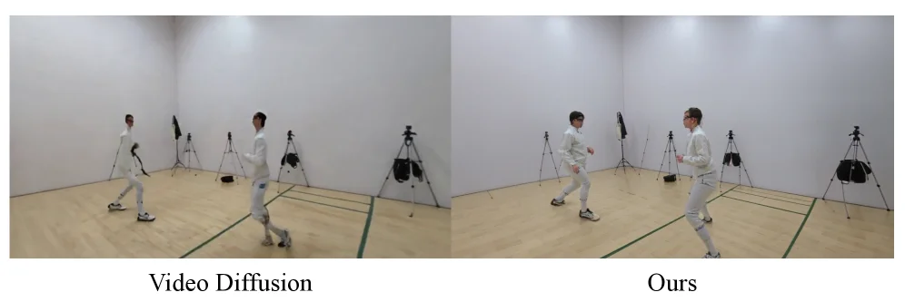

> Figure S4. Video diffusion models (Ren et al. , 2025 ) produce geometrically inconsistent humans (left), while our explicit reconstruction maintains accurate body shape (right).

这张图是一个直接的视觉对比，用于展示本文提出的方法与现有视频扩散模型在处理动态人体重建时的性能差异。

首先，我们来分析图中的两个主要部分，分别标记为“Video Diffusion”（左侧）和“Ours”（右侧）。

1.  **左侧部分：“Video Diffusion”**
    *   **内容**：这部分展示了使用视频扩散模型（如 Ren 等人，2025 年的工作）重建的动态人体场景。
    *   **观察点**：图中有两名穿着白色击剑服的人物在一个室内场地中进行活动。背景是浅色的墙壁和木地板，场地上有一些三脚架和设备，可能是摄像机或其他捕捉设备。
    *   **问题揭示**：根据图的原始说明，这部分的主要问题是“产生几何不一致的人体”。从图中可以观察到，左侧人物的姿态和形状似乎存在一些不自然或不连贯的地方。例如，左边人物的腿部姿态或右边人物的整体轮廓可能显得有些扭曲或不符合物理规律。这表明视频扩散模型在处理人体运动时，可能无法保持人体结构的一致性和准确性。

2.  **右侧部分：“Ours”**
    *   **内容**：这部分展示了本文提出的方法（标记为“Ours”，即我们的方法）重建的同一场景。
    *   **观察点**：同样是两名穿着白色击剑服的人物在相同的室内场地中活动。背景和前景元素与左侧部分基本一致。
    *   **优势展示**：根据图的原始说明，这部分的特点是“保持准确的身体形状”。从图中可以观察到，右侧人物的姿态和形状看起来更加自然和准确。例如，人物的腿部、躯干和手臂的比例和位置似乎更符合真实人体的结构。这表明本文提出的方法能够更好地处理人体运动的几何一致性，从而生成更准确的人体重建结果。

3.  **对比与结论**：
    *   **对比对象**：这张图将视频扩散模型的输出（左）与本文提出方法的输出（右）进行了直接对比。
    *   **数据或信息流动**：图的意图是让读者通过视觉比较，理解两种不同方法在处理相同或相似场景时的表现差异。信息流是从观察左侧模型的不足，到观察右侧模型的改进，从而得出结论。
    *   **坐标与场景**：虽然图中没有明确的坐标轴，但可以推断这是一个典型的室内运动捕捉场景。场景中的元素（如人物、背景设备）在两个部分中是对应的，便于进行直接比较。
    *   **结论**：这张图清晰地揭示了本文方法的具体运作效果优于视频扩散模型。具体来说，本文方法能够解决视频扩散模型在人体重建中出现的几何不一致问题，从而生成更准确、更自然的动态人体模型。这支持了论文摘要中提到的观点，即本文提出的方法（StudioRecon）通过解耦背景和人类，并采用其他技术（如用视频扩散模型合成大量受相机控制的新型视图来增强背景监督，以及用跨视图身份关联和多视图关键点三角测量来鲁棒地初始化可变形高斯人体等），能够实现更高质量的4D人体场景重建。

总结来说，这张图通过视觉对比，直观地展示了本文提出的方法在动态人体重建任务中，相较于视频扩散模型，在保持人体几何一致性方面的显著优势。

---

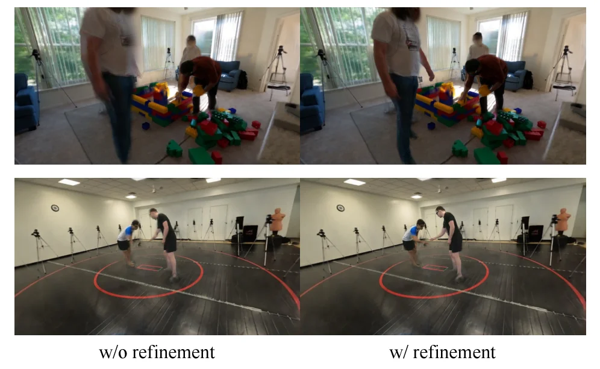

> Figure S5. Effect of multi-view pose refinement. Without refinement (left), inaccurate SMPL poses cause blurry or semi-transparent body parts. With refinement (right), poses are corrected via cross-view triangulation, producing a sharper human reconstruction.

这张图（图S5）展示了**多视图姿态优化（multi - view pose refinement）**在4D人体场景重建中的作用，通过对比“无优化（w/o refinement）”和“有优化（w/ refinement）”的结果，清晰呈现方法的运作逻辑与效果提升。

### 图的组件与信息流动
- **布局结构**：图分为上下两组，每组包含左右两个子图，分别对应“无优化”（左）和“有优化”（右）的情况。上组场景是室内有积木和人物的环境，下组是室内有两人互动（带红色圆圈标记区域）的环境。
- **对比对象**：每组的左图（标注“w/o refinement”）和右图（标注“w/ refinement”）是同一场景、同一人物动作在不同处理阶段的结果，用于对比姿态优化前后的差异。
- **信息流动逻辑**：从左到右，展示了“未经过姿态优化的人体重建”到“经过姿态优化的人体重建”的变化过程，核心是对比姿态优化对重建质量的影响。

### 方法的运作方式（从图中揭示）
1. **问题背景（无优化时）**：在“w/o refinement”的子图中（如上下两组的左图），由于单目或多视图姿态估计（如SMPL模型拟合）的不准确，人体的某些部分会出现模糊、半透明或形状失真的情况。这是因为低重叠相机下，单视角的姿态估计容易出错，且缺乏多视图的一致性约束，导致人体模型的几何结构不一致（如肢体扭曲、部分缺失）。
2. **优化方法（姿态优化）**：“w/ refinement”的子图（如上下两组的右图）展示了**跨视图三角测量（cross - view triangulation）**的作用。该方法通过结合多个低重叠相机的视图，利用三角测量的原理（从不同视角的相机位置和观测到的2D关键点，计算3D空间中人体的准确姿态），修正不准确的SMPL姿态。
3. **效果体现**：优化后，人体的重建结果更清晰、更准确。例如，在上下两组的右图中，人物的肢体（如手臂、腿部）的形状更完整，没有模糊或半透明的现象，说明姿态优化解决了低重叠相机下姿态估计不准确导致的重建质量问题。

### 结果图的细节（坐标、对比与结论）
- **坐标与场景**：图中没有明确的坐标标注，但场景是真实的室内环境（上组为积木场景，下组为互动场景），人物在场景中的位置相对固定，便于对比同一位置的重建效果。
- **对比对象**：每组的左（无优化）和右（有优化）子图是直接对比的对象，变量是“是否进行多视图姿态优化”，其他因素（如场景、人物动作、相机设置）保持一致。
- **结论**：通过对比可以得出，**多视图姿态优化（尤其是跨视图三角测量）能够显著提升低重叠相机下的人体重建质量**，解决因姿态估计不准确导致的模糊、半透明或几何不一致问题，使重建的人体更清晰、更符合真实形态。这也验证了论文中提出的StudioRecon方法中“通过跨视图三角测量修正姿态”这一环节的有效性。

---

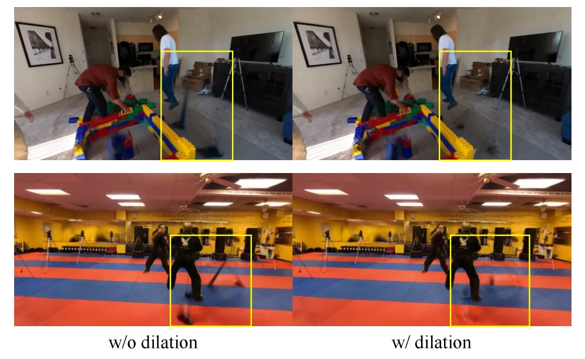

> Figure S6. Effect of mask dilation. Without dilation (left), insufficiently masked human regions at t = 0 t{=}0 are baked into the static background Gaussians, leaving ghosting artifacts as humans move. With 21px dilation (right), the background is cleanly separated.

这张图（图S6）展示了**掩码膨胀（mask dilation）**技术在处理动态人体与静态背景分离时的关键作用，通过对比“无膨胀（w/o dilation）”和“有膨胀（w/ dilation）”两种情况，直观呈现了方法如何避免鬼影伪影（ghosting artifacts）并实现背景的干净分离。

### 图的结构与组件解释：
- **整体布局**：图分为上下两部分，每部分包含左右两个子图，分别对应“无膨胀”和“有膨胀”的情况。上半部分的场景是一个室内环境（有乐高积木、电视、人物互动），下半部分是另一个室内场景（有红蓝相间的垫子、人物运动）。
- **子图对比**：
  - **左列（w/o dilation）**：表示未使用掩码膨胀的情况。在这两个子图中，黄色框标记的区域显示了人体运动时的鬼影伪影。例如，上半部分左图中，移动的人物腿部区域在背景中留下了模糊的残留；下半部分左图中，运动的人物的脚部区域也有类似的鬼影。
  - **右列（w/ dilation）**：表示使用了21像素膨胀的情况。黄色框标记的区域显示，经过膨胀处理后，背景变得干净，鬼影伪影消失。人体运动时，背景不再残留人体的模糊影像，实现了背景与动态人体的清晰分离。
- **数据/信息流动**：这里的“流动”可以理解为处理流程的结果对比。首先，方法需要对场景进行掩码（mask）处理，以区分人体和背景。当掩码未膨胀时（左列），人体的部分区域（尤其是在运动初期或边缘）可能未被充分掩码，导致这些区域在背景建模时被错误地“烘焙”（baked）到静态背景的高斯模型中。当人体移动时，这些残留的背景信息会与当前人体位置产生冲突，形成鬼影。而当使用掩码膨胀（右列）时，掩码的范围被扩大（21像素），确保了人体区域（包括运动中的区域）被充分排除在背景建模之外，从而在后续的重建过程中，背景能够保持静态且干净，即使人体运动也不会留下伪影。

### 方法运作原理（从图中推断）：
这张图揭示了方法中**背景与人体分离**的关键步骤：
1. **掩码生成与膨胀**：首先，需要对场景中的每个时间帧（如图中的t=0）生成人体掩码，以识别人体区域。为了确保背景建模的准确性，需要对这个人体掩码进行膨胀操作（如21像素的膨胀）。膨胀的目的是扩大掩码的范围，覆盖人体的边缘区域（尤其是运动时可能出现的模糊或未完全检测到的区域），从而避免这些区域被错误地包含在背景模型中。
2. **背景建模**：在背景建模阶段（例如使用视频扩散模型合成新视图或初始化高斯模型时），膨胀后的掩码用于确保背景区域（即非人体区域）被正确建模。这样，当人体移动时，背景模型不会包含人体的残留信息，从而避免了鬼影伪影。
3. **结果验证**：通过对比“无膨胀”和“有膨胀”的结果，图中展示了膨胀技术如何有效分离背景和动态人体。无膨胀时，背景中存在鬼影（人体运动的残留）；有膨胀时，背景干净，人体运动时没有伪影。这验证了掩码膨胀在处理低重叠相机捕获的4D人体场景重建中的重要性，特别是在稀疏相机设置下，背景监督的稠密化和准确分离是关键。

### 结果图的细节：
- **坐标/区域**：黄色框标记了需要重点观察的区域，即人体运动时容易产生鬼影的位置。在上半部分，黄色框位于人物的腿部和乐高积木附近；在下半部分，黄色框位于运动的人物的脚部附近。
- **对比对象**：对比的是“无膨胀（w/o dilation）”和“有膨胀（w/ dilation）”两种情况下的背景分离效果。左列是未膨胀的情况，右列是膨胀（21像素）的情况。
- **结论**：从图中可以得出，掩码膨胀（特别是21像素的膨胀）能够有效分离背景和动态人体，避免鬼影伪影的产生。这对于从稀疏、低重叠相机捕获的4D人体场景重建至关重要，因为它确保了背景模型的准确性，从而提高了整体重建质量（如小说视图合成、轨迹渲染等应用）。

---

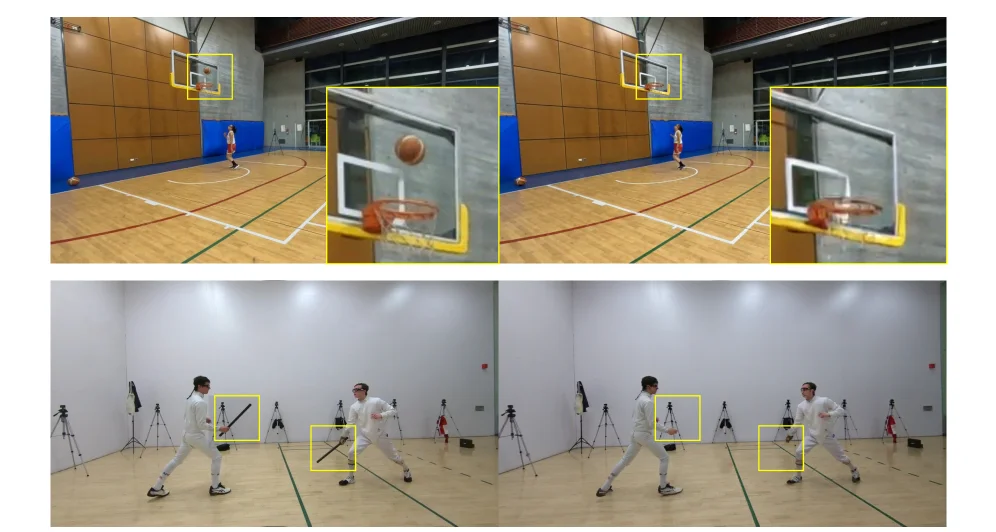

> Figure S7. Limitations of our method. Comparing ground truth (left) with our reconstruction (right), dynamic objects held by actors are not reconstructed because they lie outside the SMPL body model.

这张图（图S7）展示了我们方法的一个局限性。它通过对比“真实情况”（左侧图像）和我们方法的“重建结果”（右侧图像），来说明当动态物体超出SMPL人体模型范围时，这些物体无法被我们的方法重建。

让我们详细解析这张图：

1.  **图像布局与对比对象**：
    *   整个图分为上下两组对比，每组都包含左右两个子图。左侧子图代表“ground truth”（真实情况），即实际拍摄到的场景；右侧子图代表我们方法的“reconstruction”（重建结果）。
    *   上半部分的场景是一个篮球场，下半部分的场景是击剑训练室。

2.  **上半部分（篮球场场景）**：
    *   **左侧（真实情况）**：我们可以看到一个穿着红色短裤的人站在篮球场上，他正在投篮。篮球（一个棕色的球体）在空中，正朝着篮筐飞去。篮筐和篮球都被清晰地捕捉到。
    *   **右侧（重建结果）**：在这个场景中，人物和篮筐被重建出来了，但空中的篮球却消失了。这是因为篮球属于动态物体，并且它的位置和运动超出了SMPL人体模型的定义范围。我们的方法主要针对人体模型进行重建，对于超出该模型的动态物体（如篮球）无法准确捕捉和重建。
    *   **黄色框**：黄色框用于高亮显示对比的关键区域。在上半部分，黄色框分别框出了篮筐和篮球（左图）以及篮筐（右图），强调了篮球在重建结果中的缺失。

3.  **下半部分（击剑场景）**：
    *   **左侧（真实情况）**：这里有两个人穿着击剑服，正在进行击剑动作。其中一个人手持一把剑（黑色的细长物体）。这把剑是他们动作的一部分，也是一个动态物体。
    *   **右侧（重建结果）**：在这个场景中，两个人物被重建出来了，但他们手中的剑却不见了。原因与篮球的情况类似：剑作为动态物体，其位置和形态超出了SMPL人体模型的范围，因此无法被我们的方法重建。
    *   **黄色框**：黄色框同样高亮了对比的关键区域。在下半部分，黄色框分别框出了持剑者的剑（左图）和持剑者原本持剑的位置（右图），强调了剑在重建结果中的缺失。

4.  **方法运作的揭示（通过此图）**：
    *   这张图揭示了我们方法的一个重要局限性：它依赖于SMPL人体模型来表示人体。当动态物体（如篮球、剑）的运动或位置不在这个模型的表示范围内时，这些物体就无法被有效地重建。
    *   尽管我们的方法在处理人体本身和背景方面可能表现良好，但对于超出SMPL模型范围的动态附属物或独立动态物体，重建能力有限。

5.  **结论**：
    *   图中清晰地展示了，当动态物体（如篮球、剑）位于SMPL人体模型的表示范围之外时，我们的方法无法重建这些物体。这导致了重建结果中这些物体的缺失，如左右对比图所示。这是我们方法的一个已知局限性。

---

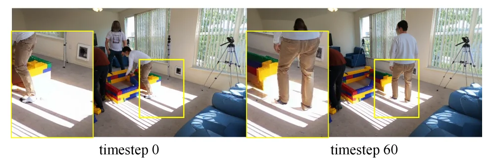

> Figure S8. Shadow artifacts. Shadows baked into the static background at t = 0 t{=}0 (left) remain fixed and do not follow human motion at later timesteps (right).

这张图（图S8）来自论文《4D Human-Scene Reconstruction from Low-Overlap Captures》，它直观地展示了一个关键问题：**静态背景中烘焙的阴影不会随人体运动而更新**。

首先，我们来分析图中的各个组件：

1.  **整体布局**：图像被分为左右两个主要部分，分别标注为“timestep 0”（时间步0）和“timestep 60”（时间步60）。这表示场景在两个不同时间点的状态。
2.  **timestep 0（左侧）**：
    *   这个部分展示了场景在初始时间点（t=0）的样子。
    *   我们可以看到一个室内环境，有窗户、三脚架上的相机、蓝色沙发以及一些彩色的积木结构。
    *   图中有几个人物，其中一个人物（穿着浅色上衣和卡其色裤子）正在弯腰与积木互动。
    *   **关键点**：在这个时间点，地面上存在明显的阴影，特别是在人物周围和积木结构附近。这些阴影是当时光照条件和物体位置的结果，并且已经被“烘焙”到静态背景中。
3.  **timestep 60（右侧）**：
    *   这个部分展示了同一场景在稍后的时间点（t=60）的样子。
    *   注意到人物的位置和姿态发生了变化：之前弯腰的人物现在站直了身体，并且位置也有所移动。
    *   **关键点**：尽管人物的位置和姿态改变了，但地面上之前在timestep 0时形成的阴影（如图中黄色方框内所示）并没有随之移动或更新。这些阴影仍然固定在原来的位置，与新的人物姿态不匹配。

**数据或信息的流动与方法揭示**：

这张图并不是展示一个方法的流程，而是用来揭示一个现有方法或简单处理方式可能存在的问题。具体来说：

*   **问题揭示**：当尝试从稀疏、低重叠的相机捕捉中重建4D人景场景时，如果背景（包括阴影）是静态烘焙的，那么当人物移动时，这些阴影将无法正确反映新的光照条件。这会导致视觉上的不一致，即阴影伪影。
*   **隐含的方法需求**：这张图暗示了一个有效的4D重建方法需要能够处理动态变化的阴影。理想情况下，背景中的阴影应该能够根据人物的运动和环境光的变化而实时更新。
*   **与论文方法的关联**：虽然图中没有直接展示论文提出的StudioRecon方法如何解决这个问题，但它突出了问题的严重性。论文中提到的方法，如使用视频扩散模型来合成新的相机视角以增强背景监督，以及递归增强模块注入运动自适应一致性，其目的之一就是为了避免这类阴影伪影，确保重建的场景在不同时间步上保持视觉一致性。

**坐标、对比对象和结论**：

*   **坐标/时间点**：对比发生在两个明确的时间点：timestep 0 和 timestep 60。
*   **对比对象**：对比的对象是同一场景在不同时间点的视觉表现，特别是地面上的阴影相对于人物位置的变化。
*   **结论**：图中清晰地表明，如果静态背景中的阴影没有被正确更新以匹配人物的运动，就会出现阴影伪影。具体来说，在timestep 0时烘焙到背景中的阴影，在timestep 60时人物已经移动，但阴影仍然固定在原位，没有跟随人物运动。这证明了处理动态场景中阴影的重要性，也是论文方法试图解决的关键挑战之一。
