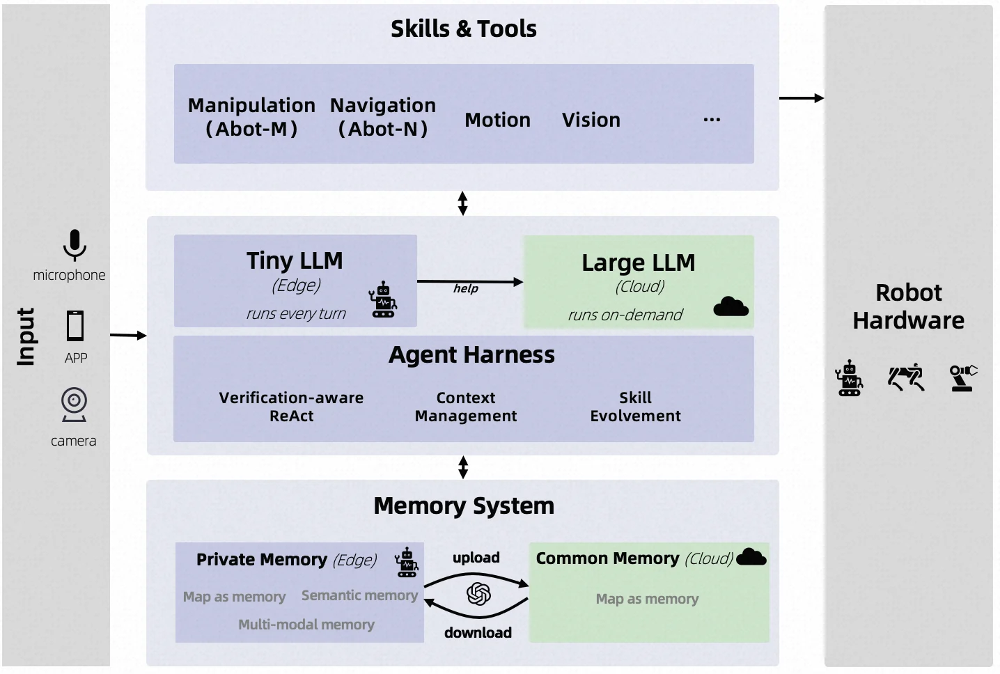
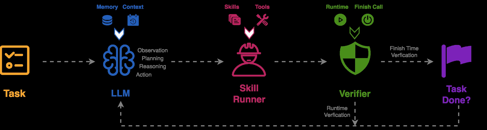
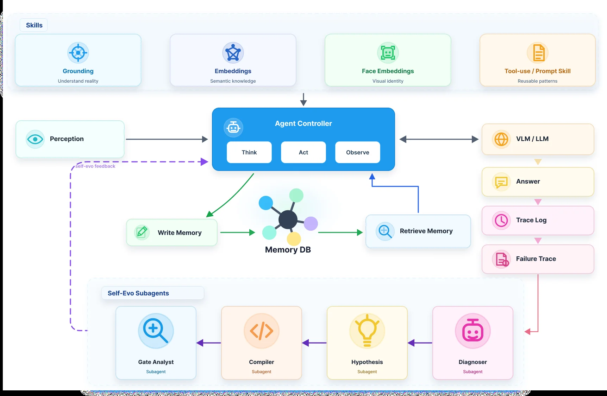
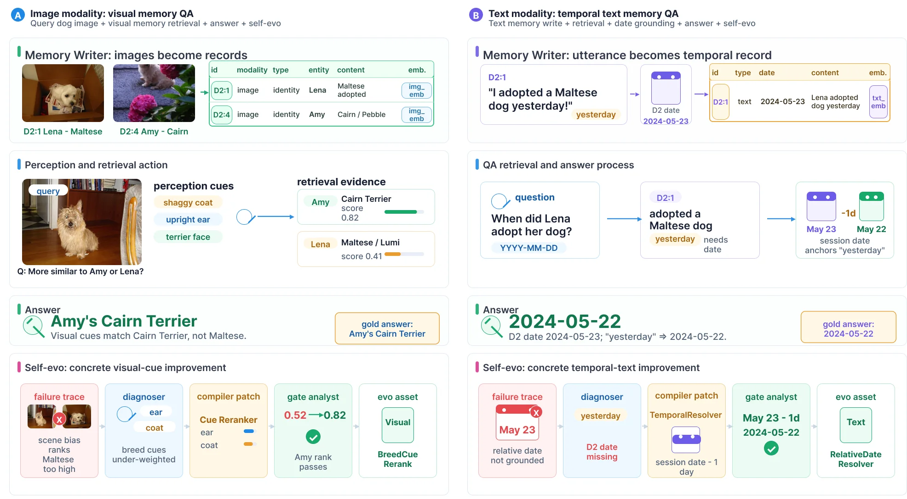
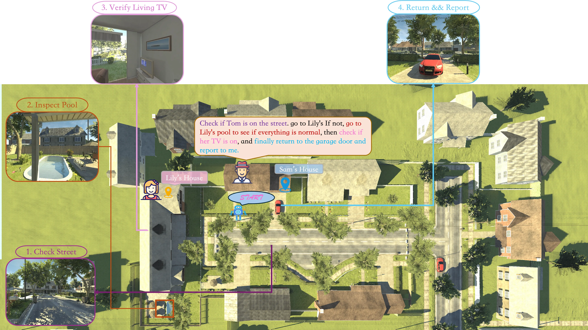
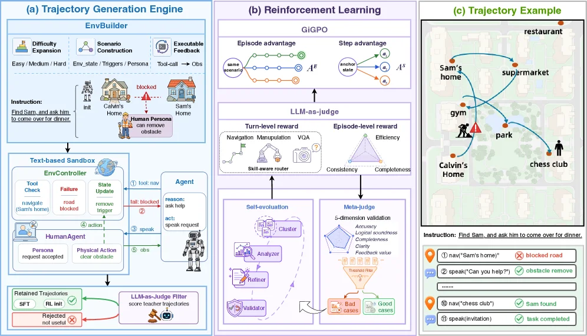
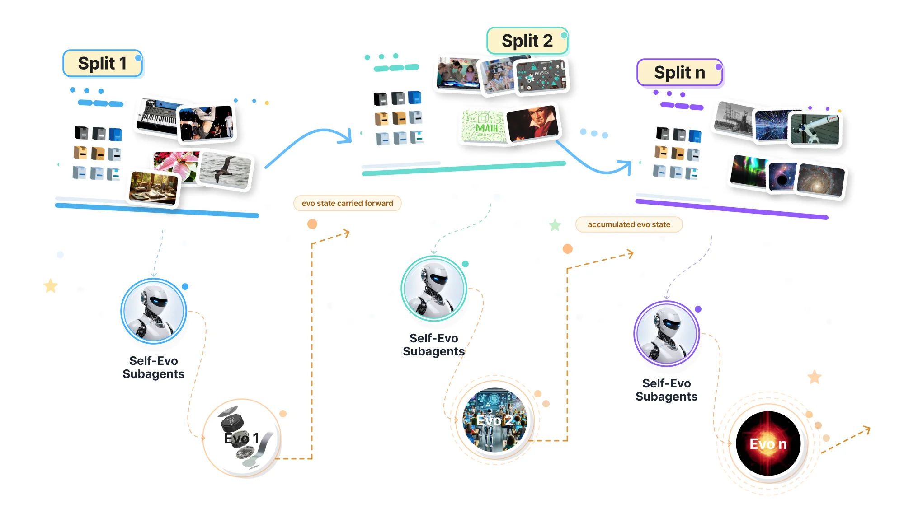
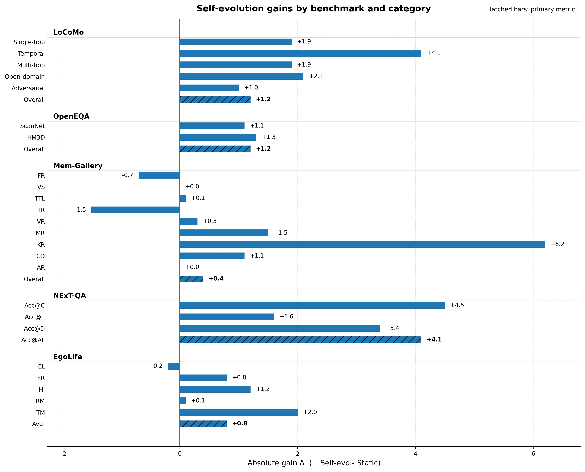

# ABot-AgentOS: A General Robotic Agent OS with Lifelong Multi-modal Memory

[arXiv](https://arxiv.org/abs/2607.10350) · [HuggingFace](https://huggingface.co/papers/2607.10350) · ▲84

## Abstract (verbatim)

> Recent VLM and VLA systems have improved robotic perception and action prediction, yet long-horizon embodied agents still require a general runtime layer for reasoning, memory, tool use, verification, and cross-embodiment execution. We present ABot-AgentOS, a general robotic Agent Operating System that sits above low-level controllers and provides a deliberative agent layer for scene-conditioned planning, context-isolated skill execution, multi-stage verification, multi-modal memory, and edge-cloud collaboration. To evaluate such systems, we introduce EmbodiedWorldBench, an executable benchmark with 16 indoor, outdoor, and hybrid scenes, four difficulty levels, and over 200 tasks involving navigation, object search, NPC dialogue, dynamic events, and trace-grounded scoring. ABot-AgentOS further introduces Universal Multi-modal Graph Memory, a persistent source-grounded substrate that converts dialogue, visual observations, spatial context, temporal relations, and task traces into typed nodes and edges. A failure-driven self-evolution loop converts diagnosed memory failures into gated runtime evo-assets that are promoted only to later evaluation splits, preventing current-split ground-truth leakage while enabling continual improvement. On an initial EmbodiedWorldBench subset, ABot-AgentOS improves over a single-controller baseline in both task success and goal completion. Across memory benchmarks, ABot-AgentOS Static achieves 87.5 on LoCoMo, 59.9 on OpenEQA EM-EQA, 88.6 on Mem-Gallery, and 76.5 Acc@All on NExT-QA; self-evolution further improves LoCoMo to 88.7, OpenEQA to 60.4, and Mem-Gallery to 89.0. These results suggest that a general Agent OS layer can improve long-horizon embodied execution while providing persistent, auditable memory for continual interaction.

## Background

### Background Analysis  

**1. Technical Context and Real-World Needs**  
As robotics advances, there is growing demand for AI to move beyond digital tasks (e.g., chatbots or image recognition) to perform complex, long-horizon tasks in the physical world—such as home assistance, industrial inspection, or dynamic collaboration. This "embodied intelligence" requires solving three core challenges: how to translate complex instructions into reliable actions, how to adapt a single system to different robot morphologies (e.g., humanoid vs. quadrupedal robots), and how to enable robots to retain critical information over time (e.g., "I couldn’t find the key in this room last time, so I should check the drawer this time"). These needs drive a shift from "single-task execution" to "sustained autonomous decision-making."  

**2. Limitations of Previous Approaches**  
Despite progress in vision-language models (VLMs) and robot control, existing systems face three major bottlenecks:  
- **Disconnect between reasoning and execution**: Many systems directly map AI model outputs to actions, lacking an intermediate layer for task decomposition, verification, or error handling (e.g., a robot might pick up a cup without considering if it’s full of water).  
- **Lack of morphological generalization**: Existing solutions are often tied to specific hardware or environments (e.g., lab-only robotic arms), making cross-body adaptation costly.  
- **Limited memory systems**: Traditional memory solutions store only text or short-term data, failing to persistently associate multimodal information (e.g., visual observations, dialogue history, and spatial relationships), which prevents robots from learning from long-term experiences (e.g., forgetting previously encountered obstacles).  

**3. Proposed Solution**  
ABot-AgentOS addresses these issues through three innovations:  
- **General robotic OS architecture**: A "agent layer" is inserted between low-level controllers (e.g., motion control) and high-level AI models to handle task planning, tool use, and error recovery. This layer acts as a "manager," coordinating modules like speech understanding, visual navigation, and skill invocation while supporting diverse robot morphologies.  
- **Dynamic benchmarking**: EmbodiedWorldBench is designed to evaluate long-horizon capabilities in complex scenarios (e.g., dialoguing with humans, dynamic obstacle avoidance) across indoor, outdoor, and hybrid environments.  
- **Multimodal memory system**: Robot experiences (e.g., dialogues, visual observations, task traces) are stored as structured "graph memory," with failure analysis enabling automatic optimization (e.g., if a task fails, the system records the reason and avoids repeating it).  

**4. Key Differences and Innovations**  
Compared to prior work, ABot-AgentOS’s breakthroughs lie in:  
- **Layered decoupling**: Separating cognitive reasoning from physical execution makes the system more flexible and scalable.  
- **Cross-morphology generalization**: Plugin-based design supports diverse robots rather than optimizing for a single device.  
- **Evolvable memory**: Memory is not just storage but continuously improves via "failure-driven learning," making robots smarter over long-term interactions.  

This system provides a foundation for embodied intelligence to transition from lab prototypes to real-world applications, enabling robots to "think, remember, act, and learn" like humans.

## Method, Figure by Figure

> Figure 1 : System architecture of the proposed robot agent. Inputs from multiple sources (microphone, APP, camera) to a dual-LLM core, where a Tiny LLM on the edge handles every turn and escalates to a cloud-based Large LLM on demand. The Agent Harness manages verification-aware ReAct loop, context, and skill evolvement, enabling an extensible skill library (Manipulation, Navigation, Motion, Vision, etc.). A hierarchical Memory System synchronizes private edge memory with shared cloud memory to support cross-robot knowledge transfer. Outputs are dispatched to the robot hardware for execution.

This figure shows the system architecture of ABot - AgentOS, and we can parse each component and its information flow step by step from left to right and top to bottom:

First, look at the "Input" part on the far left. There are three input sources: microphone, application (APP), and camera. These input sources are responsible for collecting the robot's multi - modal inputs, such as voice, application instructions, visual images, etc., and then pass these inputs to the middle core of the system.

Next are the several main modules in the middle:
1. **Skills & Tools**: This module contains multiple sub - modules, such as Manipulation (Abot - M), Navigation (Abot - N), Motion, Vision, etc. (the ellipsis indicates other skills). These are the tools for the robot to perform specific tasks, such as manipulating objects, navigating, motion control, visual perception, etc. Information will be passed to this module from the lower modules and then output to the "Robot Hardware" on the far right to execute tasks.
2. **Dual LLM Core**:
    - **Tiny LLM (Edge)**: Labeled as "runs every turn", which means it runs in every interaction turn and is located at the edge (Edge). Its role is to handle daily and frequent tasks or decisions. When encountering complex problems, it will request help from "Large LLM (Cloud)" through the "help" arrow.
    - **Large LLM (Cloud)**: Labeled as "runs on - demand", that is, it runs on demand and is located in the cloud (Cloud). It handles more complex tasks that require more computing resources or knowledge. When the Tiny LLM cannot handle them, it will call it to get support.
3. **Agent Harness**: This module contains three sub - parts: Verification - aware ReAct, Context Management, and Skill Evolvement. Verification - aware ReAct is responsible for the ReAct loop with verification (ReAct is a framework that combines reasoning and action) to ensure the correctness of task execution; Context Management manages the context, so that the robot can maintain the consistency of the context in different tasks or scenes; Skill Evolvement is responsible for the evolution of skills, so that the robot's skills can be continuously improved. This module connects the LLM core and the Memory System and plays a coordinating and managing role.
4. **Memory System**:
    - **Private Memory (Edge)**: Located at the edge, it contains Map as memory, Semantic memory, Multi - modal memory, etc. It stores the robot's local (edge) memory, such as map information, semantic information, multi - modal information (combining vision, voice, etc.).
    - **Common Memory (Cloud)**: Located in the cloud, it contains Map as memory, etc., and stores shared knowledge or cross - robot memory.
    - There are "upload" and "download" arrows between these two memory parts, indicating the synchronization between the private edge memory and the shared cloud memory, which supports the transfer of knowledge across robots.

The approximate order of information flow is: the input sources (microphone, APP, camera) pass the input to the dual LLM core (the Tiny LLM handles it first, and calls the Large LLM when necessary); then the Agent Harness manages verification, context, and skill evolution, coordinates the interaction between the LLM core and the memory system; the memory system synchronizes between the edge and the cloud, supporting multi - modal memory and cross - robot knowledge transfer; finally, the processed information is passed to the Skills & Tools module and then output to the robot hardware to execute tasks.

This figure reveals how ABot - AgentOS works: it uses the Tiny LLM at the edge to handle daily tasks and calls the Large LLM in the cloud on demand to handle complex tasks; the Agent Harness is responsible for verification, context management, and skill evolution to ensure the correctness of task execution and the improvement of skills; the memory system synchronizes between the edge and the cloud, supporting multi - modal memory and cross - robot knowledge transfer; finally, it drives the robot hardware to execute tasks through the Skills & Tools module, forming a complete robot agent system from input to output, which solves the problems of reasoning, memory, tool use, verification, and cross - embodiment execution required by long - horizon embodied agents.

---

> Figure 2 : Overview of the Agent Harness. The main LLM performs scene-conditioned planning with memory and context, delegates procedural subtasks to the Skill Runner, and receives corrective feedback from the Verifier to form a reasoning-execution-verification loop.

This figure (Figure 2: Overview of the Agent Harness) clearly illustrates the core process of an agent within ABot-AgentOS executing a task, representing a "reasoning-execution-verification" loop.

The process begins with the "Task" on the left, depicted as a yellow box with checkmarks and symbols. This task is passed to the central "LLM" (Large Language Model), represented by a blue brain icon. The LLM is the primary reasoning component of the system, receiving input from "Memory" (database icon) and "Context" (calendar/clock icon), which provide it with scene conditions and historical background. The LLM uses this information to perform "Observation," "Planning," "Reasoning," and "Action," as listed to the right of the brain icon.

Next, the LLM delegates procedural subtasks to the "Skill Runner," shown as a pink worker icon. The Skill Runner is responsible for executing specific operations, utilizing "Skills" (card icon) and "Tools" (wrench and screwdriver icon) to accomplish these subtasks.

During execution, the system's "Verifier," represented by a green shield icon, monitors the process. The Verifier receives information from "Runtime" (play button icon) and "Finish Call" (power button icon). It is primarily responsible for "Runtime Verification" and "Finish Time Verification." If issues are detected, it provides "corrective feedback" to the LLM, forming a feedback loop, as indicated by the dashed arrow from the Verifier to the LLM in the diagram. Simultaneously, the Verifier also performs "Runtime Verification" and feeds this information back to the LLM to support continuous reasoning and adjustment.

Finally, when the task is completed and verified, the process reaches "Task Done?" on the far right, depicted as a purple flag, signifying the end of the task.

The entire flow reveals how ABot-AgentOS operates: the task is driven by the LLM, which plans using memory and context; specific operations are executed by the Skill Runner; the entire process is monitored and verified by the Verifier to ensure correct task completion, and feedback loops allow for continuous improvement and correction. This is a typical "think-act-check-adjust" loop implemented in a robotic agent system.

The flow of data or information is: Task -> LLM (reasons and plans with memory and context) -> Skill Runner (executes subtasks) -> Verifier (monitors and verifies) -> (feedback to LLM for adjustment if needed) -> Task completion confirmation.

---

> Figure 3 : Overview of the multi-modal memory architecture. During online execution, ABot-AgentOS writes observations and interactions into a source-grounded memory graph, retrieves task-relevant evidence, and records retrieval and answer traces. Offline, failure traces are diagnosed and converted into gated runtime evo-assets for later deployments.

This figure illustrates the multi - modal memory architecture of ABot - AgentOS. We can understand its working process from two stages: online execution and offline optimization:

### Online Execution Stage (Data Flow and Component Roles)
1. **Perception**: As the starting point of information input, the perception module collects multi - modal information (such as vision, hearing, etc.) from the environment and then passes this information to the **Agent Controller**. The Agent Controller contains three core operations: Think, Act, and Observe, and it is responsible for coordinating the overall decision - making and execution process.
2. **Skills**: The four skill modules at the top (Grounding: understanding real - world scenarios; Embeddings: semantic knowledge; Face Embeddings: visual identity recognition; Tool - use / Prompt Skill: tool use or prompt skill) support the Agent Controller. The knowledge or capabilities of these skills will be called by the Agent Controller to assist its thinking, action, or observation process.
3. **Memory Database (Memory DB)**: The Agent Controller interacts with the Memory DB. On one hand, through the **Write Memory** module, the observation results and interaction information (these information are "source - grounded", that is, they have a clear source basis) collected by perception are written into the Memory DB to form a multi - modal memory graph (containing nodes and edges of types such as dialogue, visual observation, spatial context, temporal relations, and task traces). On the other hand, through the **Retrieve Memory** module, evidence related to the current task is retrieved from the Memory DB to support decision - making or answering.
4. **VLM / LLM, Answer, and Trace Recording**: The Agent Controller also interacts with the **VLM / LLM (Vision - Language Model / Large Language Model)** and uses the model's capabilities to generate an **Answer**. At the same time, a **Trace Log** is recorded, and if a failure occurs, a **Failure Trace** is generated.

### Offline Optimization Stage (Self - Evolution Loop)
1. **Diagnosis of Failure Traces and Generation of Evolution Assets**: In the offline stage, the **Failure Trace** is passed to the **Diagnoser** sub - agent, which analyzes the cause of the failure. Then, the information is sequentially passed to the **Hypothesis** sub - agent (generating hypotheses about the failure), the **Compiler** sub - agent (compiling the hypotheses into executable improvement plans), and the **Gate Analyst** sub - agent (analyzing and deciding whether to promote these improvement plans as "gated runtime evo - assets").
2. **Deployment of Evolution Assets**: These evolution assets will be "promoted" to subsequent evaluation splits for future deployment. The purpose of this is to prevent the leakage of the current "ground - truth" (that is, to avoid the solution of the current task affecting the fair evaluation of future tasks) and to achieve continuous improvement.

### Summary of the Overall Working Logic
During online execution, ABot - AgentOS obtains environmental information through perception, and the Agent Controller thinks, acts, and observes in combination with various skills. At the same time, relevant information is written into the multi - modal memory graph (Memory DB), and relevant evidence is retrieved from the memory to support decision - making and answering, and trajectory and failure information are recorded. In the offline stage, by diagnosing and analyzing the failure traces, evolution assets are generated and deployed to subsequent tasks to achieve the continuous improvement of the system. This architecture enables ABot - AgentOS to handle long - horizon embodied intelligent tasks and has capabilities such as scene - conditioned planning, context - isolated skill execution, multi - stage verification, multi - modal memory, and edge - cloud collaboration.

---

> Figure 4 : Concrete memory failure-to-evolution examples. Left: visual memory QA retrieves image-grounded identity evidence but can expose missing breed-specific cues. Right: temporal text memory QA uses session metadata to resolve relative dates but can reveal temporal-normalization errors. In both cases, the failure trace is converted into targeted memory-writing, evidence-selection, frame-selection, or answering improvements.

This diagram (Figure 4) illustrates a concrete case of "memory failure to evolution" in **ABot-AgentOS**, divided into two modules: **Visual Memory QA (left column, Part A)** and **Textual Memory QA (right column, Part B)**. It clearly presents the end-to-end process of "memory writing → perception/retrieval → answering → failure analysis → self-evolution," as well as how the system continuously optimizes its capabilities through a failure-driven cycle.  

### Left Column: Visual Memory QA (Image Modality: Visual Memory QA)  
This module demonstrates the memory and reasoning process of **"image-identity-similarity judgment"**, with the core being "visual cue matching" and "targeted optimization after failure":  

1. **Memory Writer**：  
   Converts images into "typed memory records." For example, the D2:1 record (id=D2:1, modality=image, type=identity, entity=Lena, content=Maltese adopted) and the D2:4 record (entity=Amy, content=Cairn / Pebble), and generates image embeddings (img_emb). This step is "persisting visual observations as structured memory" to provide a basis for subsequent retrieval.  

2. **Perception and Retrieval Action**：  
   - Input: Query question (Q: "More similar to Amy or Lena?") and the image to be queried (a dog resembling a Cairn Terrier).  
   - Perception cues: Extract visual features from the image, such as "shaggy coat," "upright ear," "terrier face."  
   - Retrieval evidence: The system retrieves relevant records from memory and scores them based on the perception cues. For example, the record for Amy (Cairn Terrier) scores 0.82, and the record for Lena (Maltese / Lumi) scores 0.41. The arrow indicates the matching process from "perception cues → retrieval evidence" (cues with higher scores are matched first).  

3. **Answer**：  
   Based on the scores of the retrieval evidence, the conclusion "Amy's Cairn Terrier" is drawn, and it is marked as consistent with the "gold answer," indicating that this answer is correct? No, combined with the "Self-evo" part, it actually **exposes the problem of "missing breed-specific cues"** (to be solved in subsequent evolution). Although the answer is correct, there are hidden problems in the process that need to be optimized.  

4. **Self-evo: Concrete Visual-Cue Improvement**：  
   This is a "failure-driven optimization cycle":  
   - Failure trace: The red box shows "scene bias ranks Maltese too high," meaning the system incorrectly believes the query image is more like a Maltese (Lena's breed) when it should actually resemble a Cairn Terrier (Amy's breed).  
   - Diagnoser: Analyzes the root cause of the problem — "breed cues under-weighted," meaning the system does not pay enough attention to "breed-related visual cues (such as ear, coat)."  
   - Compiler patch: Adjusts the "Cue Reranker" according to the diagnosis result, increasing the weight of the "ear" and "coat" cues (the blue bar indicates the change in weight after adjustment).  
   - Gate analyst: Verifies the optimization effect — "0.52 → 0.82" (Amy's rank increases from 0.52 to 0.82, exceeding Lena's 0.41), and "Amy rank passes" is marked.  
   - Evo asset: The optimized "Visual" strategy (such as BreedCue Rerank) is used as an "evolution asset" and only used in future evaluations (to prevent current data leakage and achieve continuous improvement).  

### Right Column: Textual Memory QA (Text Modality: Temporal Text Memory QA)  
This module demonstrates the memory and reasoning process of **"text-temporal-date parsing"**, with the core being "time normalization" and "targeted optimization after failure":  

1. **Memory Writer**：  
   Converts text into "memory records with timestamps." For example, for the input text "I adopted a Maltese dog yesterday!" (containing the time word "yesterday"), the system first parses the date (D2 date=2024-05-23), then generates a text record (id=D2:1, type=text, date=2024-05-23, content=Lena adopted dog yesterday), and generates a text embedding (txt_emb). This step is "persisting text dialogues as time-stamped structured memory" to provide a basis for subsequent time reasoning.  

2. **QA Retrieval and Answer Process**：  
   - Input: Question (Q: "When did Lena adopt her dog?" requiring output in YYYY-MM-DD format).  
   - Retrieve relevant records: Find the D2:1 record (content containing "yesterday") and parse the specific date of "yesterday."  
   - Time normalization: Combine "session date anchors," assuming the session date is 2024-05-23 (because D2 date=2024-05-23, "yesterday" corresponds to 2024-05-22). The arrow indicates the process of "question → retrieve record → time parsing."  

3. **Answer**：  
   The conclusion "2024-05-22" is drawn, and it is verified to be consistent with the "gold answer," indicating that this answer is correct? Similarly, combined with the "Self-evo" part, it actually **exposes the hidden problem of "time normalization error"** (to be solved in subsequent evolution).  

4. **Self-evo: Concrete Temporal-Text Improvement**：  
   This is a "failure-driven optimization cycle":  
   - Failure trace: The red box shows "relative date not grounded," meaning the system may incorrectly handle the time of "yesterday" (for example, when the session date is not 2024-05-23, the parsing will be wrong).  
   - Diagnoser: Analyzes the root cause of the problem — "D2 date missing" or "yesterday's time not correctly anchored."  
   - Compiler patch: Adjusts the "TemporalResolver" according to the diagnosis result, using the strategy of "session date - 1 day."  
   - Gate analyst: Verifies the optimization effect — "May 23 - 1d → 2024-05-22" (parsing is correct), and a "√" is marked to indicate passing the verification.  
   - Evo asset: The optimized "Text" strategy (such as RelativeDate Resolver) is used as an "evolution asset" and only used in future evaluations (to prevent current data leakage and achieve continuous improvement).  

### Overall Logic: A Closed Loop of "Failure → Diagnosis → Optimization → Evolution"  
Both modules follow the process of **"memory writing (persisting multimodal data) → perception/retrieval (matching memory with current tasks) → answering (generating results) → failure analysis (identifying problems) → self-evolution (targeted optimization, generating reusable strategies)"**:  

- The problem in the visual module is "imbalance in visual cue weights (breed cues are underestimated)." After optimization, the weights of breed-related cues are increased to ensure more accurate similarity judgment.  
- The problem in the text module is "time normalization depends on the session date (may leak current data)." After optimization, the strategy of "session date - 1 day" is used to ensure more robust time parsing (and it is only used in the future to avoid answer leakage from the current split).  

This "failure-driven self-evolution" is the core of ABot-AgentOS: by diagnosing the failure points of the memory system, generating targeted optimization strategies (evo-assets), and "gating" them into future evaluations, it not only solves current problems but also achieves **continuous improvement** (preventing the leakage of answers from current data to future tasks to ensure the fairness of evaluation).  

This diagram clearly shows how ABot-AgentOS uses "multimodal memory + failure evolution" to solve long-horizon reasoning problems in robot agents: it not only completes current tasks but also learns from failures to gradually improve future performance.

---

> Figure 5 : Overview of EmbodiedWorldBench. EmbodiedWorldBench evaluates embodied agents on compound tasks that span indoor and outdoor spaces and require tightly coupled navigation, NPC interaction, and environment perception across diverse scenes. The benchmark covers 16 scenes across four difficulty levels with over 200 tasks, revealing the challenges of achieving cross-scene generalization and adaptive replanning under dynamic events.

This figure (Figure 5) is an overview diagram from the paper *ABot-AgentOS: A General Robotic Agent OS with Lifelong Multi-modal Memory* that illustrates the EmbodiedWorldBench benchmark. It clearly explains how a typical composite task is defined and executed within EmbodiedWorldBench, thereby revealing the specific operational mechanism of the approach (i.e., the agent evaluated by EmbodiedWorldBench).  

First, let’s analyze the structure of the diagram. The image is divided into two main sections: the lower portion shows a concrete scene example (a top-down view), while the upper portion provides close-ups of four task steps associated with that scene. The flow of data or information follows the logical sequence of task execution, progressing from the start to the end of the task.  

In the top-down view of the scene example, we can see the layout of a residential area, including several houses (such as “Lily's House” and “Sam's House”), streets, a swimming pool, and a garage. This scene represents a typical task environment in EmbodiedWorldBench. The diagram marks a “START” point, indicating the agent’s initial position.  

The task execution process is illustrated through four numbered steps:  

1. **Step 1: Check Street** – The close-up for this step shows a street scene. According to the text in the task description box: *“Check if Tom is on the street.”* (Check if Tom is on the street), this step requires the agent to first search for an NPC named Tom on the street. An arrow points from “START” to this step’s close-up, indicating it is the first action in the task.  

2. **Step 2: Inspect Pool** – If Tom is not found on the street (as specified in the task description: *“If not”*), the agent must perform this step. The close-up shows a swimming pool with a canopy. The task description states: *“go to Lily's pool to see if everything is normal”* (Go to Lily's pool to check if everything is normal). An arrow connects Step 1 to Step 2, indicating this action follows a conditional branch.  

3. **Step 3: Verify Living TV** – If the pool is normal, the agent proceeds to this step. The close-up depicts the interior of a living room with a television. The task description reads: *“then check if her TV is on”* (Then check if her TV is on). An arrow links Step 2 to Step 3, showing this action follows another conditional branch.  

4. **Step 4: Return & Report** – After completing all checks, the agent must return. The close-up shows the agent near the garage door, likely reporting the results to the task issuer. The final part of the task description states: *“and finally return to the garage door and report to me.”* (Finally, return to the garage door and report to me). An arrow points from Step 3 to Step 4, marking this as the final phase of the task.  

The arrows and task description boxes in the diagram clearly outline the logical flow of the task: the agent first checks for Tom on the street; if unsuccessful, it inspects Lily’s pool, then verifies the status of her TV, and finally returns to report. This process demonstrates how EmbodiedWorldBench evaluates an agent’s performance in composite tasks requiring tightly integrated navigation, NPC interaction, and environmental perception. The agent must adaptively plan and make decisions based on environmental cues (e.g., NPC locations or object states).  

Additionally, the original caption of the figure notes that EmbodiedWorldBench assesses composite tasks spanning indoor and outdoor spaces, which demand tightly coupled navigation, NPC interaction, and environmental perception. It covers 16 scenes, four difficulty levels, and over 200 tasks, highlighting challenges such as cross-scene generalization and adaptive replanning under dynamic events. This diagram vividly illustrates a typical task from these challenges through a concrete example: it involves navigating multiple locations, performing condition checks related to NPCs, and submitting a final report.  

In summary, this figure uses a specific task example to detail how EmbodiedWorldBench designs composite tasks to evaluate robotic agents’ capabilities. The execution order is: search for Tom on the street, inspect Lily’s pool if he is not found, verify the TV’s status, and finally return to the garage to report. This showcases the agent’s need for navigation, conditional judgment, environmental perception, and interaction skills.

---

> Figure 6 : Overview of the training pipeline for a deployable ABot-AgentOS student policy. The pipeline constructs controllable text-based environments, distills teacher trajectories for SFT initialization, and improves the policy through online RL with LLM-as-a-Judge rewards and GiGPO advantages.

This figure illustrates the training pipeline for a deployable ABot - AgentOS student policy, and we can understand its working process from three main parts:

First, for the (a) Trajectory Generation Engine part:
- **EnvBuilder**: It is the environment builder with three key functions. "Difficulty Expansion" can set the environment difficulty to easy, medium, or hard; "Scenario Construction" involves the setting of environment state (env_state), triggers, and persona; "Executable Feedback" converts tool calls (Tool - call) into observations (Obs). There is also an instruction example here: "Find Sam, and ask him to come over for dinner." In this module, there is an "init" (initialization) step, and there is a "blocked" (blocked) situation in the environment, for example, the path from Calvin's home to Sam's home is blocked, and there are characters who can remove obstacles.
- **Text - based sandbox**: It includes "EnvController", "Agent", and "HumanAgent". "EnvController" has functions such as tool checking (e.g., navigating to Sam's home), state updating (e.g., road blocked), and removing triggers. "Agent" will make tool calls (e.g., nav), and when it encounters failure (e.g., road blocked), it will request help (speak:request). Then "HumanAgent" will accept the request according to the persona setting and perform physical actions (e.g., clear obstacle), and then feed the observation (obs) back to "Agent". At the same time, the "LLM - as - Judge Filter" will score the teacher trajectories and filter out useful trajectories for subsequent steps. The "Retained Trajectories" are used for SFT (Supervised Fine - Tuning) initialization, while the useless trajectories that are rejected are discarded.

Then, for the (b) Reinforcement Learning part:
- **GiGPO**: It deals with advantage calculation, including "Episode advantage" and "Step advantage". In the episode advantage, factors such as "same scenario" are considered, and in the step advantage, the "anchor state" is involved. Finally, the advantage of the action (such as \(a^E\) and \(a^S\)) is obtained.
- **LLM - as - judge**: It is responsible for reward calculation, which is divided into "Turn - level reward" and "Episode - level reward". The turn - level reward involves navigation, manipulation, VOA (possibly visual object recognition, etc.), and skill - aware routing; the episode - level reward considers factors such as efficiency, consistency, and completeness.
- **Self - evolution**: It includes "Cluster", "Analyzer", "Refiner", and "Validator", which are used to handle self - assessment - related operations, extract information from trajectories, and optimize.
- **Meta - judge**: It conducts 5 - dimensional verification, including accuracy, logical coherence, clarity, feedback value, and task completion status. It divides the trajectories into "Bad cases" and "Good cases" and feeds these feedbacks back to the policy for improvement.

Finally, for the (c) Trajectory Example part:
- This shows a specific task - execution trajectory, and the instruction is also "Find Sam, and ask him to come over for dinner." The steps in the trajectory include: navigating to Sam's home (nav('Sam's home')), speaking (speak('Can you help?')), navigating to the chess club (nav('chess club')), and speaking (speak(invitation)). And the success or failure of each step is marked. For example, "blocked road" is marked as failure, "obstacle remove" is marked as success, and "Sam found" and "task completed" are also marked as success. This example shows the specific behavior and result of the entire policy when executing a task.

Overall, the process of this training pipeline is: first, build a controllable text - based environment through EnvBuilder, generate trajectories in this environment, and then filter out useful trajectories for SFT initialization through the LLM - as - Judge Filter; then enter the reinforcement learning stage, where GiGPO calculates the advantage, the LLM - as - judge provides rewards, and Self - evolution and Meta - judge optimize the policy. Iterate continuously to improve the performance of the policy. Finally, a student policy that can complete tasks in complex scenarios is obtained. The key of this pipeline lies in the combination of environment construction, supervised fine - tuning, reinforcement learning, and the referee mechanism based on large - language models to realize the training and optimization of the ABot - AgentOS student policy, so that it can handle long - horizon embodied tasks, such as navigation, object search, NPC dialogue, etc.

---

> Figure 7 : Lifelong memory self-evolution across sequential splits. Each split uses only evo-assets promoted from previous splits; failures from the current split are diagnosed and gated after evaluation, and accepted assets are used only by later splits.

This diagram illustrates the self-evolution process of lifelong multimodal memory in ABot-AgentOS, divided sequentially into multiple "Splits" (stages/phases) from Split 1 to Split n. The flow of data/information and operational mechanisms are described as follows:

---

### Components & Information Flow  
1. **Split Stages (Split 1, Split 2, Split n):**  
   - Each Split represents a task or scenario stage. The small images at the top (e.g., musical instruments, people, flowers, birds in Split 1; math/physics-related images in Split 2; astronomical/natural phenomena in Split n) depict the task scenarios or input data types for that stage. These scenarios form the basis for subsequent processing, and each Split generates corresponding "evo-assets" (evolutionary assets, interpreted as useful information or model updates extracted from the task).  
   - Below each Split are "Self-Evo Subagents," which handle the current Split’s tasks while interacting with the "Evo" modules (Evo 1, Evo 2, Evo n) below them.  

2. **Evo Modules (Evo 1, Evo 2, Evo n):**  
   - Evo modules manage and store evolutionary assets. Evo 1 receives information from the "Self-Evo Subagents" of Split 1, processes it, and carries forward the "evo state" (evolutionary state, e.g., learned knowledge, model parameters, or task execution experience) to the next Evo module (Evo 2).  
   - When processing Split 2, "Self-Evo Subagents" not only handle the current task but also receive the evolutionary state passed from Evo 1 (via dashed arrows labeled "evo state carried forward"). This leverages past task experience to enhance current task performance. After processing Split 2, generated evolutionary assets are managed by "accumulated evo state" and passed to the next Evo module (Evo n).  
   - For "Self-Evo Subagents" in each Split: they diagnose failures in the current Split (specific failure diagnosis processes are not explicitly shown but implied by the caption). They then process "gated runtime evo-assets": accepted assets are reused in subsequent Splits (e.g., Split 2 assets for Split n), while failed assets are prevented from leaking into the current ground truth (evaluation standards), avoiding interference with task assessment.  

3. **Arrows & Workflow:**  
   - Solid blue arrows (from Split 1 to Split 2 to Split n) indicate sequential task progression (processing Split 1 first, then Split 2, and finally Split n).  
   - Dashed orange arrows (from Evo 1 to Evo 2 to Evo n, and from "Self-Evo Subagents" to their corresponding Evo modules) represent the transfer and feedback of evolutionary states, ensuring current-stage assets improve future stages.  
   - Dashed arrows (from "Self-Evo Subagents" to Evo modules) signify the transfer of processed information (successes and failures) to Evo modules for storage and management.  

---

### Methodology  
ABot-AgentOS achieves lifelong multimodal memory self-evolution through these steps:  
1. **Task Segmentation & Processing:** The overall task is divided into consecutive Splits, each handling specific scenarios/data. In each Split, "Self-Evo Subagents" process the task while leveraging evolutionary assets from prior Splits (via Evo modules) to enhance performance.  
2. **Evolutionary Asset Generation & Management:** "Self-Evo Subagents" generate evo-assets containing task-specific knowledge, model updates, or execution experience. These assets are diagnosed, and only accepted assets are transferred to subsequent Splits (via "evo state carried forward" and "accumulated evo state"), while rejected assets (failures) do not leak into the current ground truth, preserving evaluation integrity.  
3. **Continuous Improvement:** Successful evolutionary assets are passed to future Splits, enabling continuous refinement. This allows ABot-AgentOS to leverage past experiences to optimize current and future task execution.  

---

### Results (Contextual)  
While the diagram focuses on workflow, experimental results (from the paper) show ABot-AgentOS outperforms single-controller baselines in task success rate and goal completion rate on the initial EmbodiedWorldBench subset. In memory benchmarks:  
- ABot-AgentOS Static scored 87.5 on LoCoMo.  
- Scored 59.9 on OpenEQA EM-EQA.  
- Demonstrated strong performance in other unspecified memory metrics.  

This confirms that lifelong multimodal memory self-evolution enhances long-term robotic task performance.  

---

In summary, the diagram outlines how ABot-AgentOS achieves self-improvement: by segmenting tasks into Splits, generating evolutionary assets, reusing successful assets in subsequent stages, and preventing failures from contaminating current evaluations—enabling continuous adaptation and enhanced task handling.

---

> Figure 8 : Self-evolution gains by benchmark and category. Bars show absolute score changes from Static to + Self-evo; hatched bars indicate the primary metric for each benchmark.

This figure (Figure 8) is titled "Self-evolution gains by benchmark and category," which means "Absolute gains from self-evolution by benchmark and category." It clearly shows the absolute performance improvement of the system after introducing the "Self-evo" mechanism compared to the "Static" version across different benchmarks and task categories.

First, let's look at the basic structure of the figure. The x-axis represents "Absolute gain Δ (+ Self-evo - Static)," which is calculated as "the performance of the self-evolution version minus the performance of the static version." Positive values indicate performance improvement, while negative values indicate performance degradation. The y-axis lists different benchmarks and their associated task categories or specific metrics.

Each benchmark (such as LoCoMo, OpenEQA, Mem-Gallery, NExt-QA, EgoLife) serves as a main group. Under each group, there are multiple sub-entries representing different task categories or specific evaluation metrics. For example, under the LoCoMo benchmark, there are categories like Single-hop, Temporal, Multi-hop, Open-domain, Adversarial, and an Overall metric.

Each blue bar in the figure represents the performance gain of a specific category or metric. The length of the bar corresponds to the value of the gain, and the numerical label is directly marked on the bar. Importantly, the legend indicates that "Hatched bars: primary metric," meaning that the bars with hatch fills represent the primary evaluation metric of the benchmark. For example, in the LoCoMo benchmark, the Overall metric bar is hatch-filled; in the NExt-QA benchmark, the Acc@All metric bar is hatch-filled.

Now, let's analyze how the method revealed by this figure works and its results:

1.  **Understanding the Method's Mechanism**:
    *   This figure shows the performance improvement brought by the "self-evolution" mechanism. According to the paper abstract, ABot-AgentOS introduces a "failure-driven self-evolution loop." This loop converts diagnosed "memory failures" into "gated runtime evo-assets," and these assets are only enabled in subsequent evaluation phases. The benefit of this is "preventing current-split ground-truth leakage while enabling continual improvement."
    *   Therefore, this figure quantifies the effectiveness of the self-evolution mechanism by comparing the performance difference between the "system after introducing self-evolution (+ Self-evo)" and the "static system without self-evolution (Static)." Each bar represents the amount of performance improvement for a specific task or task category.

2.  **Axes and Comparison Objects**:
    *   The x-axis (X-axis) is "Absolute gain Δ," ranging from -2 to 6. This represents the amount of performance change. The 0 point represents no performance change (i.e., the self-evolution version has the same performance as the static version).
    *   The comparison objects are the "Self-evo" version and the "Static" version. Each bar represents the absolute gain from "Static" to "+ Self-evo."
    *   Different benchmarks (such as LoCoMo, OpenEQA, etc.) are independent of each other and are used to evaluate the system's performance in different scenarios or task types.

3.  **Conclusions and Observations**:
    *   **Overall Trend**: In most benchmarks and task categories, introducing the self-evolution mechanism results in significant positive performance improvements. This indicates that the "self-evolution" mechanism is effective and can help the system continuously improve in long-term tasks.
    *   **Performance Improvements of Specific Benchmarks**:
        *   **LoCoMo**: This is likely a benchmark related to language or cognition. Its main Overall metric improved by +1.2. Various categories such as Temporal (+4.1), Multi-hop (+1.9), Open-domain (+2.1) showed good improvements, while the Adversarial category had a smaller improvement (+1.0), and Single-hop (+1.9).
        *   **OpenEQA**: This is likely an open-environment question-answering benchmark. Its Overall metric improved by +1.2. Specific categories like HM3D (+1.3) and ScanNet (+1.1) also showed improvements.
        *   **Mem-Gallery**: This is likely a benchmark related to memory gallery or retrieval. Its main Overall metric improved by +0.4. Although some categories like TR (-1.5) and FR (-0.7) performed poorly, the KR category had a very large improvement (+6.2), and MR (+1.5) and CD (+1.1) also showed positive performance.
        *   **NExt-QA**: This is likely a next-event prediction or question-answering benchmark. Its main Overall metric (Acc@All) improved by +4.1, which is a very significant improvement. Other metrics such as Acc@C (+4.5), Acc@D (+3.4), and Acc@T (+1.6) also performed well.
        *   **EgoLife**: This is likely a benchmark related to self-life experience or daily activities. Its main Overall metric (Avg.) improved by +0.8. Specific categories like TM (+2.0), HI (+1.2), and ER (+0.8) showed improvements, while EL (-0.2) slightly decreased.

In summary, this figure intuitively shows through bar graphs the significant performance improvements brought by the self-evolution mechanism in ABot-AgentOS across multiple benchmarks and task categories. It proves that this method can effectively enhance the agent's capabilities through continuous learning and improvement, especially when dealing with complex, long-term, and multi-modal tasks. Each bar represents the amount of improvement at a specific evaluation point, and the hatch-filled bars highlight the core performance metrics of each benchmark.
