# ABot-N1: Toward a General Visual Language Navigation Foundation Model

[arXiv](https://arxiv.org/abs/2607.10383) · [HuggingFace](https://huggingface.co/papers/2607.10383) · ▲101

## 摘要（原文）

> Visual Language Navigation foundation models aim to unify deep reasoning for grounded spatial decisions with broad versatility for diverse embodied tasks. Current approaches typically achieve this integration via monolithic policies that map observations directly to actions, yet they often suffer from coordinate drift and poor handling of long-tail semantics. Furthermore, these black-box mappings lack interpretability, hindering the simultaneous achievement of generality, robustness, and transparency. We present ABot-N1, a step toward a general Visual Language Navigation foundation model, that addresses these challenges by decoupling cognition from control via a slow-fast architecture guided by dual visual-language signals. More specifically, a slow vision-language reasoner performs explicit Chain-of-Thought reasoning while producing a pixel goal. This compact set of image-space anchor points serves as a universal interface for diverse tasks, including point-goal, object-goal, poi-goal, instruction-following, and person-following. Subsequently, a fast action expert leverages both the textual cues and the pixel guidance to generate continuous waypoints at the native control frequency. By bridging high-level intents and low-level control through pixel-grounded anchors paired with explicit linguistic traces, our approach ensures robust, generalizable, and interpretable navigation across simulation and real-world benchmarks. ABot-N1 establishes new state-of-the-art records, delivering massive gains specifically in urban-scale navigation: boosting POI arrival by 35.0% (to 77.3%) and achieving 95.4%/92.9% SR in complex indoor and outdoor scenes. It also maintains superior robustness across object-reaching, person-following, and instruction-following tasks. New Point-Goal/POI-Goal benchmarks are released as open source to advance the field of urban-scale navigation.

## 摘要（中译）

视觉语言导航基础模型旨在将用于基于场景的空间决策的深度推理与适用于多样化具身任务的广泛通用性相统一。当前的方法通常通过整体式策略来实现这种集成，这些策略将观测直接映射到动作，但它们常常遭受坐标漂移和长尾语义处理不佳的问题。此外，这些黑箱映射缺乏可解释性，阻碍了同时实现通用性、鲁棒性和透明性。我们提出了ABot - N1，它是迈向通用视觉语言导航基础模型的一步，通过由双重视觉 - 语言信号引导的慢 - 快架构将认知与控制解耦来解决这些挑战。更具体地说，一个慢速视觉 - 语言推理器执行显式的思维链推理，同时生成一个像素目标。这组紧凑的图像空间锚点作为多种任务的通用接口，包括点目标、对象目标、兴趣点目标、指令遵循和人员跟随。随后，一个快速动作专家利用文本线索和像素引导，在原生控制频率下生成连续的路径点。通过将与显式语言痕迹配对的基于像素的锚点连接高级意图和低级控制，我们的方法确保了在模拟和真实世界基准测试中稳健、可推广且可解释的导航。ABot - N1创造了新的最先进记录，在城市规模导航方面尤其取得了巨大提升：将兴趣点到达率提高了35.0%（达到77.3%），并在复杂的室内和室外场景中实现了95.4%/92.9%的成功率。它在到达对象、人员跟随和指令遵循任务中保持了卓越的鲁棒性。新的点目标/兴趣点目标基准已作为开源发布，以推进城市规模导航领域的发展。

## 背景剖析

### 背景剖析  

**1. 技术背景**  
视觉语言导航（VLN）技术旨在让机器人或智能体通过结合视觉观察和语言指令，在复杂环境中自主完成导航任务。这类技术的核心需求来自现实场景中的多样化挑战：例如，机器人在城市中需要根据自然语言指令找到特定地点（如“咖啡馆”），在室内环境中遵循精确坐标到达目标点，或跟踪移动的人。这些任务要求智能体不仅具备空间定位能力，还要理解开放词汇的语义（如识别未见过的物体）、处理动态环境变化（如人群移动），并确保行为的安全性和可解释性。  

**2. 之前的问题**  
传统方法通常采用“一体化策略”，直接将视觉输入映射到动作输出。这种方法存在三个关键缺陷：  
- **坐标漂移与语义处理不足**：依赖局部坐标的目标（如“向前5米”）在地图或定位误差下可能指向不可行区域（如车道或花坛），而端到端训练会破坏预训练的语义知识（如识别新物体）。  
- **缺乏可解释性**：黑箱模型无法提供决策的中间步骤，导致故障分析困难（例如无法区分是感知错误还是推理错误）。  
- **任务碎片化**：不同导航任务（如点目标、对象搜索、指令跟随）使用独立的架构和数据，难以统一到一个系统中，限制了跨任务迁移能力。  

**3. 本文的解法**  
论文提出了ABot-N1模型，通过**慢-快架构**和**像素目标接口**解决上述问题：  
- **慢系统（认知模块）**：一个4B参数的多模态模型（VLM）负责高层次推理，生成自然语言解释（Chain-of-Thought）和一个“像素目标”（如图像中的锚点区域）。这一步将语言指令接地到视觉实体，并确保语义合理性。  
- **快系统（控制模块）**：一个2B参数的专家模型根据慢系统的输出和实时视觉输入，生成连续的运动路径。这种分离确保语义推理（慢）和反应控制（快）独立优化，避免相互干扰。  
- **统一接口**：所有任务（如点目标、对象搜索）被分解为“跟踪由语言解释的像素目标”，从而实现跨任务通用性。  

**4. 切入角度**  
与前人工作相比，ABot-N1的关键创新在于：  
- **解耦认知与控制**：通过慢-快架构分离语义推理和运动控制，解决了传统方法中动态不匹配的问题。  
- **显式可解释性**：像素目标和自然语言解释提供了每一步决策的透明性，便于故障诊断和安全验证。  
- **数据驱动的扩展**：通过引入像素级监督和强化学习，提升了模型在开放世界中的鲁棒性，而非依赖静态标记数据。  

这一设计使ABot-N1在复杂城市导航任务中实现了新的最佳性能，同时为未来研究提供了一个可扩展的框架。

## 方法图解

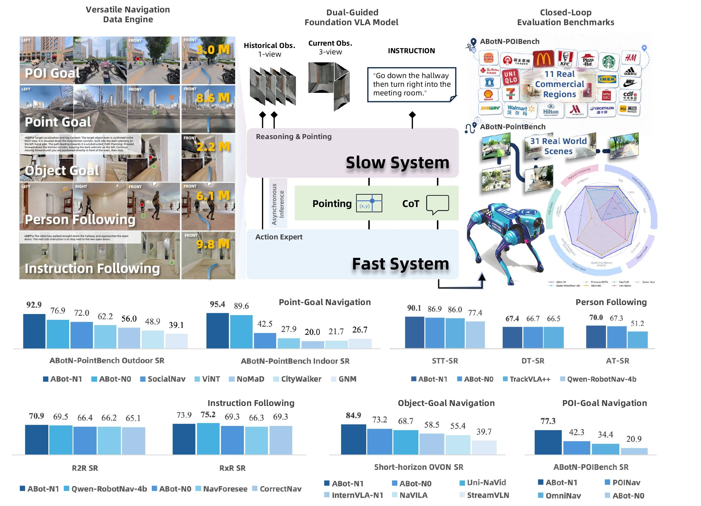

> Figure 1 : Overview of ABot-N1. The model trained on 30M samples across five tasks adopts a slow–fast control architecture: a slow system performs CoT reasoning and emits pixel goals, while a fast action expert consumes this dual language-and-vision guidance to execute safe waypoints. Closed-loop evaluation is conducted on our newly proposed ABotN-PointBench and ABotN-POIBench, together with three established benchmarks (VLN-CE R2R/RxR, Short-Horizon OVON, and EVT-Bench). ABot-N1 achieves leading performance across all 5 benchmarks.

这张图是论文《ABot-N1: Toward a General Visual Language Navigation Foundation Model》中的Figure 1，标题为“Overview of ABot-N1”，它全面展示了ABot-N1模型的架构、训练数据、工作流程以及评估结果。

首先，我们来看图的左上角部分，标题为“Versatile Navigation Data Engine”。这部分展示了模型训练所用的五种不同类型的导航任务及其对应的数据量：
*   **POI Goal (兴趣点目标)**：使用了3.0M（百万）样本，展示了从不同视角（左、右、前）观察到的场景，目标是导航到一个特定的兴趣点。
*   **Point Goal (点目标)**：使用了8.6M样本，同样展示了多视角场景，目标是导航到一个具体的点。
*   **Object Goal (物体目标)**：使用了2.2M样本，场景中包含一个目标物体，需要导航到该物体附近。
*   **Person Following (跟随人)**：使用了6.1M样本，场景中有一个需要跟随的人。
*   **Instruction Following (遵循指令)**：使用了9.8M样本，这部分通常涉及自然语言指令，要求智能体根据指令进行导航。
这些任务共同构成了模型的训练数据集，总数据量相当可观，旨在赋予模型广泛的适应性。

接下来是图的中上部，标题为“Dual-Guided Foundation VLA Model”。这部分是ABot-N1模型的核心架构，它采用了一种“慢-快”控制架构：
*   **Slow System (慢系统)**：这个系统接收“Historical Obs. (历史观测，1-view)”和“Current Obs. (当前观测，3-view)”作为输入，同时接收一个“INSTRUCTION”（指令）。它执行“Reasoning & Pointing”（推理与指向）功能，具体包括：
    *   **Asynchronous Inference (异步推理)**：可能指推理过程与快速控制系统的异步执行。
    *   **Pointing (指向)**：生成一个像素级的目标（图中用(x,y)坐标表示），这是一个图像空间的锚点。
    *   **CoT (Chain-of-Thought，思维链)**：模型进行显式的思维链推理，以解释其决策过程。
    这个慢系统负责高层次的认知和规划，生成一个紧凑的图像空间锚点，作为不同任务的通用接口。
*   **Fast System (快系统)**：这个系统被称为“Action Expert”（动作专家），它接收来自慢系统的“Pointing”（像素目标）和“CoT”（推理信息）作为输入。它的作用是“leverage both the textual cues and the pixel guidance to generate continuous waypoints at the native control frequency”（利用文本提示和像素引导，在原生控制频率下生成连续的路径点）。这意味着快系统负责低层次的、实时的动作执行。

数据或信息的流动顺序是：训练数据（左上角）用于训练整个模型。在推理时，环境观测（历史和当前）和指令输入到慢系统，慢系统进行推理并生成像素目标和思维链，然后将这些信息传递给快系统，快系统最终生成控制信号来执行导航。

图的右上角部分是“Closed-Loop Evaluation Benchmarks”（闭环评估基准）。这里展示了用于评估模型的基准测试：
*   **ABotN-POIBench**：包含“11 Real Commercial Regions”（11个真实商业区域），展示了如麦当劳、宜家、星巴克等商业标志，表明评估场景的真实性和多样性。
*   **ABotN-PointBench**：包含“31 Real World Scenes”（31个真实世界场景），并展示了一个机器人（看起来像波士顿动力公司的Spot机器人）在这些场景中进行导航。旁边还有一个雷达图，可能用于可视化模型在不同评估维度上的性能。
这些基准测试用于对模型进行闭环评估，即模型需要在真实或模拟的环境中完成导航任务，并评估其成功率等指标。

图的底部是各种评估结果的柱状图，每个子图代表不同的任务和基准：
*   **ABotN-PointBench Outdoor SR (Success Rate, 成功率)**：比较了ABot-N1、ABot-N0、SocialNav、ViNT、NoMaD、CityWalker、GNM等模型在户外点目标导航任务上的成功率。ABot-N1（深蓝色）表现最佳，得分为92.9。
*   **ABotN-PointBench Indoor SR**：比较了上述模型在室内点目标导航任务上的成功率。ABot-N1得分为95.4，同样表现最佳。
*   **STT-SR (Speech-to-Text Success Rate?) 和 DT-SR (Dialogue Turn Success Rate?) 及 AT-SR (Action Turn Success Rate?)**：这些可能是不同类型的成功率的细分。例如，STT-SR比较了ABot-N1、ABot-N0和TrackVLA++等模型。ABot-N1在STT-SR上得分为90.1。
*   **Person Following (跟随人)**：比较了不同模型在跟随人任务上的成功率。ABot-N1得分为70.0。
*   **R2R SR (Room-to-Room Success Rate) 和 RxR SR (Round-trip Room Success Rate?)**：这些是经典的视觉语言导航基准（如VLN-CE R2R/RxR）。ABot-N1在R2R SR上得分为70.9，在RxR SR上得分为73.9。
*   **Instruction Following (遵循指令)**：比较了不同模型在遵循指令任务上的成功率。ABot-N1得分为73.9。
*   **Object-Goal Navigation (物体目标导航)**：比较了不同模型在物体目标导航任务上的成功率。ABot-N1得分为84.9。
*   **Short-horizon OVON SR (Short-horizon Object Visual-Observation Navigation Success Rate)**：比较了不同模型在短视距物体视觉观察导航任务上的成功率。ABot-N1得分为73.2。
*   **POI-Goal Navigation (兴趣点目标导航)**：比较了不同模型在兴趣点目标导航任务上的成功率。ABot-N1得分为77.3。

这些结果表明，ABot-N1在所有展示的基准测试中都取得了领先的性能（state-of-the-art records），这验证了其方法的有效性。图的原始caption提到，模型在五个任务上训练了30M样本，采用了慢-快控制架构，通过双视觉-语言信号引导，并在新的ABotN-PointBench和ABotN-POIBench以及三个已建立的基准（VLN-CE R2R/RxR, Short-Horizon OVON, 和 EVT-Bench）上进行了闭环评估，取得了领先的性能。我们的讲解与这些信息一致，并更详细地解释了图中的各个组件及其工作流程。

总结来说，这张图清晰地展示了ABot-N1模型的设计理念：通过一个慢系统进行高层次的视觉-语言推理和目标生成（像素级），然后由一个快系统根据这些高级指导和文本线索执行具体的动作。这种架构旨在解决现有方法的坐标漂移和长尾语义处理不佳的问题，并提高可解释性。评估结果证明了该方法的有效性和优越性。

---

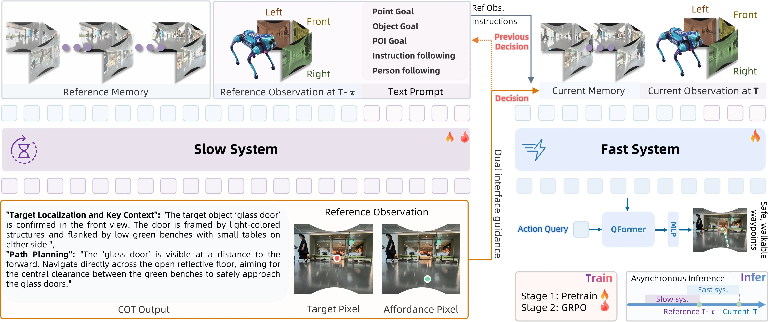

> Figure 2 : The Slow-Fast Dual-System Architecture of ABot-N1. Navigation is decoupled into asynchronous cognition and high-frequency control. Slow System (left): A vision-language reasoner processes historical frames and task prompts at low frequency, producing explicit CoT reasoning and visual anchors (Target Pixel and Affordance Pixel). Dual Vision-Language Interface (middle): The language and visual outputs form a unified bridge between the two systems. Fast System (right): A lightweight-VLM-based action expert integrates the dual guidance with real-time observations; a learnable action query attends to the output hidden states via a QFormer module, and an MLP decodes the queries to predict continuous waypoints. The system is trained with pretraining and GRPO, enabling complex reasoning without blocking the reactive control loop.

这张图展示了ABot - N1的慢 - 快双系统架构，用于视觉语言导航任务，我们可以从组件的功能、信息流动顺序以及方法的运作方式来详细讲解：

### 组件与信息流动
1. **慢系统（Slow System，左侧）**：
    - 输入包括“Reference Memory”（参考记忆，存储历史帧等信息）、“Reference Observation at T - τ”（T - τ时刻的参考观测，即过去某一时刻的多视角观测，如左、前、右视角的图像）和“Text Prompt”（文本提示，包含任务目标如点目标、物体目标、兴趣点目标、指令跟随、人物跟随等）。
    - 慢系统是一个视觉 - 语言推理器，以低频率处理这些历史帧和任务提示，进行显式的链式思考（Chain - of - Thought, CoT）推理，并生成视觉锚点（“Target Pixel”目标像素和“Affordance Pixel”可行走像素）。例如，在图的下方示例中，针对“glass door”的目标定位和关键上下文，慢系统输出了CoT推理（描述目标物体的位置和路径规划），同时确定了“Target Pixel”（红色圆点，目标物体的像素位置）和“Affordance Pixel”（绿色圆点，可行走的像素位置）。
    - 慢系统的输出（CoT推理、目标像素和可行走像素）通过“Dual Interface guidance”（双接口引导）传递给快系统，同时还会接收“Previous Decision”（之前的决策）作为反馈，形成参考观测的一部分。
2. **双视觉 - 语言接口（中间）**：
    - 这个部分是慢系统和快系统之间的统一桥梁，将慢系统产生的语言（CoT推理）和视觉（目标像素、可行走像素）输出整合起来，为快系统提供指导。
3. **快系统（Fast System，右侧）**：
    - 输入包括“Current Memory”（当前记忆，存储当前时刻的相关信息）、“Current Observation at T”（T时刻的当前观测，多视角图像）以及来自慢系统的双接口引导（语言和视觉输出）。
    - 快系统是一个轻量级的基于视觉 - 语言模型的动作专家，它利用文本线索和像素引导来生成连续的路径点（waypoints）。具体来说，“Action Query”（动作查询）会关注QFormer模块的输出隐藏状态，QFormer模块处理这些输入后，通过MLP（多层感知机）解码查询以预测连续的路径点。例如，图中展示了从当前观测生成安全、可行走的路径点的过程。
    - 快系统的训练包括“Pretrain”（预训练）和“GRPO”（一种强化学习算法）两个阶段，这样可以在不阻塞反应控制循环的情况下实现复杂推理。

### 方法的运作方式
ABot - N1的方法核心是将认知（慢系统）和控制（快系统）解耦，通过双视觉 - 语言信号引导的慢 - 快架构来实现：
- **慢系统（认知部分）**：以低频率处理历史信息和任务提示，进行显式的CoT推理，明确目标的位置（目标像素）和可行走的区域（可行走像素），这些像素锚点作为通用接口，连接不同的任务（如点目标、物体目标、兴趣点目标、指令跟随、人物跟随等）。这样的设计解决了当前方法中常见的坐标漂移和长尾语义处理差的问题，同时通过显式的CoT推理提高了可解释性。
- **快系统（控制部分）**：以高频率运行，利用慢系统提供的像素锚点和文本线索，结合当前的实时观测，生成连续的路径点，用于控制机器人的运动。快系统的轻量级设计和快速推理能力确保了机器人能够及时响应环境变化，而慢系统的深度推理则保证了导航的准确性和鲁棒性。
- **训练过程**：通过预训练让模型学习基本的视觉 - 语言理解和动作生成，然后通过GRPO算法进行强化学习，优化模型在复杂任务中的表现，使得模型能够在不阻塞反应控制循环的情况下进行复杂推理。

### 结果相关（从图中示例和架构设计推断）
从图中的示例可以看到，慢系统能够准确地定位目标物体（如“glass door”）并确定可行走区域，这为快系统生成准确的路径点提供了基础。通过这种慢 - 快架构，ABot - N1在模拟和真实世界的基准测试中建立了新的最先进记录，证明了其在导航任务中的鲁棒性、泛化性和可解释性。例如，在处理不同的任务（如点目标、物体目标等）时，慢系统的像素锚点和CoT推理能够适应不同的任务需求，快系统则能够根据这些锚点和实时观测生成合适的路径，从而实现高效的视觉语言导航。

总的来说，ABot - N1的慢 - 快双系统架构通过将高认知需求的推理（慢系统）和高频率的控制（快系统）解耦，利用双视觉 - 语言信号作为接口，实现了鲁棒、泛化且可解释的视觉语言导航，解决了当前方法的一些关键问题。

---

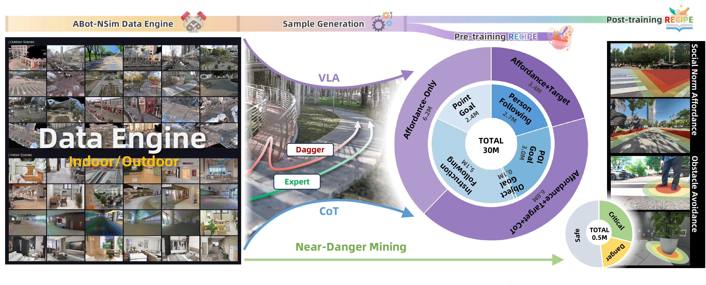

> Figure 3 : Data Pipeline and Composition. The data engine (left) provides diverse indoor and outdoor simulation scenes; trajectory generation (middle) produces expert and Dagger rollouts; the resulting samples (right) span both stages—the five pre-training navigation tasks broken down by slow-system (high-level) and fast-system (low-level) counts, together with the post-training composition stratified into Safe, Critical, Danger, and discarded data.

这张图展示了ABot - N1方法的数据管道和组成，我们可以从左到右、按数据流动的顺序来理解每个部分：

首先看最左侧的“ABot - NSim Data Engine”板块，这个数据引擎负责提供多样的室内和室外模拟场景。从图中能看到，上方是“Outdoor Scenes”（室外场景），展示了各种户外环境如街道、公园等的图像；下方是“Indoor Scenes”（室内场景），呈现了商场、房间等室内环境的图像，并且标注了“Indoor/Outdoor”，说明数据引擎生成的是涵盖室内外不同环境的模拟场景，为后续的轨迹生成提供基础数据来源。

接下来是中间的“Sample Generation”（样本生成）部分。这里有两个主要的轨迹生成方式：一个是标注为“Dagger”的红色箭头流程，另一个是标注为“Expert”的绿色箭头流程，还有“VLA”（可能是某种视觉 - 语言 - 动作相关的模块）和“CoT”（Chain - of - Thought，思维链）以及“Near - Danger Mining”（近危险挖掘）的相关流程。具体来说，“Dagger”和“Expert”应该是两种生成专家轨迹和类似专家轨迹（Dagger通常是一种模仿学习中的迭代方法，这里可能用于生成接近专家行为的轨迹）的方式，而“VLA”和“CoT”可能分别与慢系统（高阶认知）和快系统（低阶控制）相关，“Near - Danger Mining”则是从这些轨迹中挖掘近危险场景的数据，用于后续的处理。数据的流动方向是从数据引擎的场景输入，经过这些轨迹生成方法，产生用于训练的样本。

然后看中间偏右的圆形图表，这是“Pre - training RECIPE”（预训练配方）的部分，展示了预训练的五个导航任务及其对应的慢系统（高阶）和快系统（低阶）的样本数量。总样本数是30M（3000万）。具体的任务和数量如下：
 - “Affordance - Only”（仅可供性）：6.2M；
 - “Point Goal”（点目标）：2.4M；
 - “Instruction Following”（指令跟随）：5.7M；
 - “Object Goal”（物体目标）：0.1M；
 - “POI Goal”（兴趣点目标）：3.0M；
 - “Person Following”（人物跟随）：2.7M；
 - “Affordance + Target”（可供性 + 目标）：3.4M；
 - “Affordance + Target + CoT”（可供性 + 目标 + 思维链）：6.8M。
这里的任务被分为慢系统（高阶，比如需要进行显式的Chain - of - Thought推理的任务）和快系统（低阶，比如直接根据像素目标生成动作的任务），通过不同的任务类型和数量，展示了预训练阶段数据的组成，这些数据来自于中间样本生成部分的轨迹。

再看最右侧的“Post - training RECIPE”（后训练配方）部分，这里是一个关于数据安全性的分类，总共有0.5M（50万）数据，分为“Safe”（安全）、“Critical”（关键）、“Danger”（危险）和“discarded data”（丢弃数据），不过图中主要展示了“Safe”“Critical”“Danger”的比例，其中“Safe”是灰色部分，“Critical”是绿色部分，“Danger”是黄色部分。这部分是对后训练阶段的数据进行分类，可能是根据场景的安全性来划分，用于进一步的分析或优化模型。

从数据流动的整体逻辑来看，首先是数据引擎生成室内外模拟场景，然后通过样本生成部分（包括Dagger、Expert、VLA、CoT、Near - Danger Mining等方法）产生用于预训练的样本，这些样本被用于五个预训练导航任务（慢系统和快系统的任务），之后再进行后训练的数据分类（按安全性）。整个过程展示了从数据生成、样本生成、预训练到后训练的数据管道，说明了ABot - N1方法如何利用多样的场景数据，通过不同的轨迹生成方法和任务类型来训练模型，并且对后训练数据进行分类以确保模型的鲁棒性和安全性。

这张图揭示了ABot - N1方法的运作方式：首先构建多样化的室内外模拟场景数据引擎，然后通过多种轨迹生成方法（专家轨迹、Dagger轨迹等）结合视觉 - 语言推理（CoT）和近危险挖掘来生成训练样本，接着将这些样本用于五个预训练导航任务（区分慢系统的显式推理任务和快系统的动作生成任务），最后对后训练数据进行安全性分类，从而实现从数据到模型训练再到后处理的完整流程，以解决当前视觉语言导航方法中的坐标漂移、长尾语义处理差和缺乏可解释性等问题，通过解耦认知（慢系统）和控制（快系统）来实现更鲁棒、可泛化、可解释的导航。

---

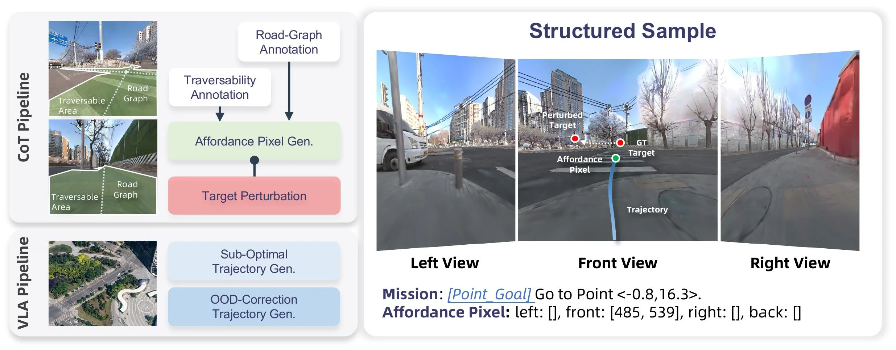

> Figure 4 : Data Construction Pipeline for the Point-Goal Corpus. Left: the data construction pipeline in two parts. The top half is the CoT data construction, which generates affordance pixels from the traversability and road-graph annotations and perturbs the target coordinate; the bottom half is the VLN data construction, comprising sub-optimal trajectory and OOD-correction trajectory synthesis. Right: an example structured sample with tri-view observations and affordance pixel annotation.

这张图（图4）展示了论文中用于**点目标导航语料库（Point-Goal Corpus）**的数据构建流程，并通过一个结构化样本示例说明了数据的组织形式。

我们来分解图的左侧部分，即数据构建管道：

1.  **左侧上半部分：CoT 数据构建流程 (CoT Pipeline)**
    *   **输入图像与标注**：最左边展示了两张带有标注的图像。这些图像上用绿色区域标示了“Traversable Area”（可行走区域），并用虚线框出了“Road Graph Area”（道路图区域）。这代表了环境的语义分割或结构化信息。
    *   **Road-Graph Annotation (道路图标注)**：这是一个处理步骤，它从输入图像中提取或利用已有的道路图信息。道路图通常包含道路的拓扑结构、车道线等信息。
    *   **Traversability Annotation (可通行性标注)**：这是另一个处理步骤，它从输入图像中提取或利用已有的可通行性信息，即哪些区域是机器人可以安全行走的。
    *   **Affordance Pixel Gen. (可供性像素生成)**：这个模块接收来自“Road-Graph Annotation”和“Traversability Annotation”的信息。它的作用是生成“可供性像素”。在图中右侧的示例中，“Affordance Pixel”被标注为“front: [485, 539]”，这意味着在前视图中，坐标(485, 539)处的像素被标记为一个具有特定可供性的位置（例如，一个可以到达的目标点或其附近）。这个过程是将高层次的道路和可通行性信息转化为图像空间中的具体锚点。
    *   **Target Perturbation (目标扰动)**：这个模块接收来自“Affordance Pixel Gen.”的输出，并对目标坐标进行扰动。在图中右侧的示例中，可以看到一个“Target”（目标，绿色点）和一个“Perturbed Target”（扰动后的目标，红色点）。这种扰动可能是为了增加训练数据的多样性，使模型更能适应目标位置的微小变化。
    *   **数据流**：图像 -> Road-Graph Annotation -> Traversability Annotation -> Affordance Pixel Gen. -> Target Perturbation。这个流程生成了带有扰动目标的可供性像素标注的图像数据。

2.  **左侧下半部分：VLN 数据构建流程 (VLA Pipeline)**：这里的“VLA”可能是指“Visual Language Action”或类似的概念，与点目标语料库的构建相关。
    *   **Sub-Optimal Trajectory Gen. (次优轨迹生成)**：这个模块负责生成次优的导航轨迹。次优轨迹可以用来训练模型避免不良路径或学习恢复策略。
    *   **OOD-Correction Trajectory Gen. (域外校正轨迹生成)**：这个模块负责生成用于域外校正的轨迹。OOD（Out-Of-Distribution）表示模型可能遇到的未见过的或分布外的情况，校正轨迹可以帮助模型在这些情况下恢复或调整行为。
    *   **数据流**：这部分流程相对独立，可能用于生成不同类型的训练轨迹数据，以增强模型的鲁棒性和泛化能力。

接下来，我们看图的右侧部分，即**结构化样本示例 (Structured Sample)**：

1.  **多视图观察 (Tri-view Observations)**：
    *   **Left View (左视图)**：显示了机器人左侧的视觉观察。
    *   **Front View (前视图)**：显示了机器人正前方的视觉观察。在这个视图中，有一个蓝色的轨迹线，一个绿色的“Target”点，一个红色的“Perturbed Target”点，以及一个绿色的“Affordance Pixel”点。轨迹线从机器人的当前位置（隐含在视图左下角）指向目标。
    *   **Right View (右视图)**：显示了机器人右侧的视觉观察。
    *   这些多视图图像模拟了机器人实际的视觉输入。

2.  **任务描述与标注 (Mission and Annotation)**：
    *   **Mission (任务)**：`[Point_Goal] Go to Point <-0.8, 16.3>.` 这表明任务是一个点目标导航任务，目标是到达世界坐标系中的点(-0.8, 16.3)。
    *   **Affordance Pixel (可供性像素)**：`left: [], front: [485, 539], right: [], back: []` 这表明在左视图中没有可供性像素，在前视图中坐标(485, 539)处有一个可供性像素，在右视图和后视图中也没有。这个可供性像素就是从左侧CoT数据构建流程中生成的，它作为图像空间的锚点，与高层级的任务目标（世界坐标）相关联。

**这张图揭示的方法运作方式**：

该方法（ABot-N1的一部分）通过以下步骤运作：

*   **数据准备阶段**：
    *   首先，构建一个点目标导航语料库。这个语料库的构建分为两个主要部分：
        1.  **CoT 数据构建**：利用道路图和可通行性标注来生成图像空间中的“可供性像素”。这些像素作为具体的目标点或关键锚点。通过对目标坐标进行扰动，可以增加训练数据的多样性。这个过程结合了视觉语言推理（Chain-of-Thought）来明确地生成这些锚点。
        2.  **VLN 数据构建**：生成次优轨迹和域外校正轨迹，用于训练模型的鲁棒性和恢复能力。
*   **模型运作阶段**（虽然图中未直接展示模型，但可以从数据构建推断）：
    *   模型（如ABot-N1）会接收当前的多视图图像观察。
    *   模型会利用在CoT数据上学习的知识，识别图像中的“可供性像素”，这些像素代表了可以到达的目标或关键位置。
    *   模型将这些图像空间的锚点与高层级的任务指令（如“Go to Point <x,y>”）联系起来。
    *   然后，一个“快速动作专家”模块会利用这些图像空间的锚点和文本线索来生成连续的路径点，以控制机器人的运动。

**总结**：

这张图详细展示了为点目标导航任务构建数据集的过程。它强调了将高层次的任务目标（如世界坐标系中的点）转化为低层次的图像空间锚点（可供性像素）的重要性。通过这种方式，模型可以更好地理解空间关系，并在不同的视图和环境下进行导航。图中的结构化样本示例清晰地展示了多视图观察、任务描述以及图像空间锚点（可供性像素）之间的对应关系。这种方法旨在提高视觉语言导航模型的通用性、鲁棒性和可解释性。

图的右侧示例具体说明了：
*   任务是前往世界坐标 `<-0.8, 16.3>`。
*   在前视图中，坐标 `[485, 539]` 的像素被标记为“Affordance Pixel”，这代表了通往目标的路径上的一个关键点或目标本身。
*   图像中还显示了实际的“Target”（绿色点）和经过扰动的“Perturbed Target”（红色点），以及从当前位置到目标的“Trajectory”（蓝色线）。

---

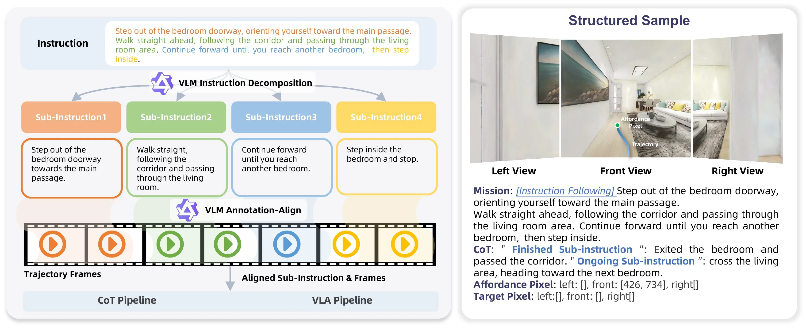

> Figure 5 : Data Construction Pipeline for the Instruction-Following Corpus. Left: a three-stage pipeline that decomposes long natural-language instructions into short sub-instructions, aligns each sub-instruction to its corresponding frame range along the milestone path, and generates and verifies affordance and target pixels for CoT and VLN data. Right: an example structured sample showing tri-view observations with the language instruction and pixel-level annotations for affordance and target.

这张图（图5）展示了用于指令遵循语料库的数据构建流程，它分为左右两个主要部分，清晰地解释了从自然语言指令到结构化数据样本的转换过程。

首先看左侧部分，这是一个三阶段的数据处理管道，用于将长自然语言指令分解为短子指令，并将这些子指令与轨迹路径上的对应帧范围对齐，同时生成和验证用于思维链（CoT）和视觉语言导航（VLN）数据的可供性像素和目标像素。

1.  **指令分解（Instruction Decomposition）**：
    *   顶部的“Instruction”框包含一个完整的自然语言导航指令，例如：“Step out of the bedroom doorway, orienting yourself toward the main passage. Walk straight ahead, following the corridor and passing through the living room area. Continue forward until you reach another bedroom, then step inside.”
    *   这个长指令通过“VLM Instruction Decomposition”（视觉语言模型指令分解）模块被分解成几个较短的“Sub-Instruction”（子指令）。图中展示了四个子指令：
        *   **Sub-Instruction1** (橙色): "Step out of the bedroom doorway towards the main passage."
        *   **Sub-Instruction2** (绿色): "Walk straight, following the corridor and passing through the living room."
        *   **Sub-Instruction3** (蓝色): "Continue forward until you reach another bedroom."
        *   **Sub-Instruction4** (黄色): "Step inside the bedroom and stop."
    *   这个过程是将一个复杂的导航任务拆解为一系列更简单、更易处理的步骤。

2.  **子指令与轨迹帧对齐（Sub-Instruction & Frame Alignment）**：
    *   分解后的子指令通过“VLM Annotation-Align”（视觉语言模型注释对齐）模块与“Trajectory Frames”（轨迹帧）对齐。
    *   “Trajectory Frames”部分显示了一系列视频帧，每个帧或一组帧都有一个播放按钮图标，并用不同颜色（橙色、绿色、蓝色、黄色）标记，这些颜色与对应的子指令颜色相匹配。这表示每个子指令对应轨迹中的一段特定帧范围。
    *   对齐后的结果是“Aligned Sub-Instruction & Frames”，这意味着每个子指令都被精确地映射到其在执行轨迹中的视觉表现。

3.  **像素级注释生成与验证（Pixel Annotation Generation & Verification）**：
    *   对齐后的数据用于生成和验证“Affordance Pixel”（可供性像素）和“Target Pixel”（目标像素）。这些像素是图像空间中的锚点，用于指导导航。
    *   数据流从对齐的子指令和帧流向“CoT Pipeline”（思维链管道）和“VLA Pipeline”（视觉语言动作管道），表明这些对齐的数据被用于后续的推理和控制阶段。

接下来看右侧部分，这是一个结构化样本的示例，展示了三视图观察结果以及语言指令和像素级可供性/目标注释。

1.  **三视图观察（Tri-view Observations）**：
    *   图像展示了“Left View”（左视图）、“Front View”（前视图）和“Right View”（右视图）。这些是从一个代理（如机器人）的视角拍摄的环境图像，模拟了导航过程中的视觉输入。
    *   在“Front View”中，可以看到一条蓝色的“Trajectory”（轨迹线）和一个绿色的“Affordance Pixel”（可供性像素），这表示当前或下一个重要的位置或目标。

2.  **语言指令（Language Instruction）**：
    *   “Mission”部分重复了左侧示例中的完整自然语言指令，明确了任务目标。

3.  **像素级注释（Pixel-level Annotations）**：
    *   **Affordance Pixel**：指定了在三个视图（左、前、右）中可供性像素的坐标。例如，在“Front”视图中，坐标是 [426, 734]，而“left”和“right”视图为空 []。
    *   **Target Pixel**：类似地，指定了目标像素的坐标，但在这个示例中，所有视图的坐标都为空 []，可能表示目标尚未到达或未在此帧中标注。

4.  **思维链（Chain-of-Thought, CoT）**：
    *   CoT部分提供了代理在执行任务时的思考过程。它区分了“Finished Sub-instruction”（已完成的子指令）和“Ongoing Sub-instruction”（正在进行的子指令）。
    *   例如，“Finished Sub-instruction”: "Exited the bedroom and passed the corridor." 表示代理已经完成了第一个子指令。
    *   “Ongoing Sub-instruction”: "cross the living area, heading toward the next bedroom." 表示代理当前正在执行的子指令。

**数据构建流程总结**：
该方法通过以下步骤构建数据：
*   **第一步**：将长的自然语言导航指令分解为多个短的、具体的子指令。
*   **第二步**：将这些子指令与实际的导航轨迹帧对齐，确保每个子指令对应轨迹中的一段特定视觉场景。
*   **第三步**：在轨迹帧中生成和验证像素级的注释（可供性像素和目标像素），这些像素作为代理导航的精确目标点。
*   **第四步**：将这些对齐的子指令、轨迹帧和像素注释组合成一个结构化的样本，该样本还包含完整的任务指令和代理执行任务时的思维链（CoT）。

这个流程揭示了ABot-N1方法的核心思想之一：通过明确的分解和对齐，将高层的自然语言指令转换为低层的、像素级的导航目标，从而实现可解释、鲁棒且通用的视觉语言导航。这种方法确保了复杂的导航任务可以被分解为更易管理的步骤，并且每个步骤都有明确的视觉和语言对应关系，为后续的推理和控制提供了清晰的基础。

---

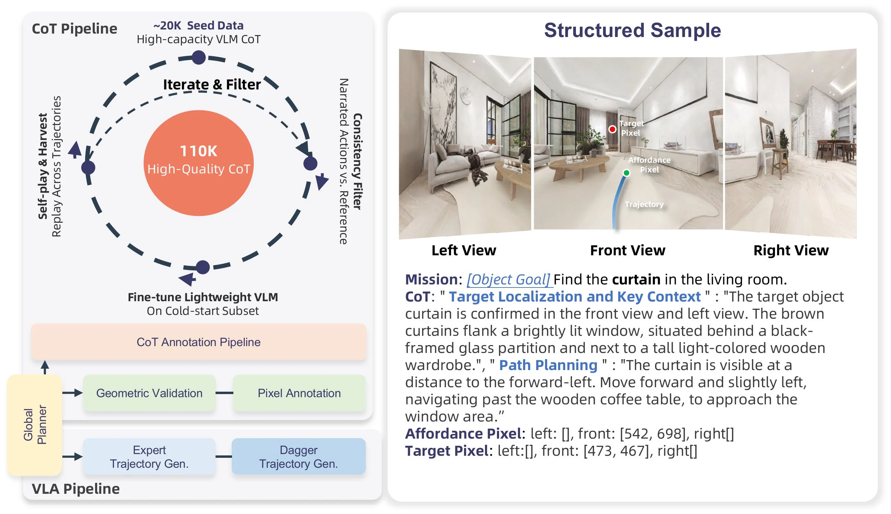

> Figure 6 : Data Construction Pipeline for the Object-Goal Corpus. The left panel comprises two parts: the top half illustrates the iterative data flywheel that constructs the CoT rationales, scaling high-capacity VLM data seeds to 110 K high-quality structured samples through A ∗ {}^{\!*} consistency filtering and self-play harvesting; the bottom half depicts the VLN pipeline that produces the low-level supervision, including pixel annotation and OOD-correction trajectory generation. The right panel demonstrates the resulting structured tuple, featuring tri-view observations, explicit object and affordance pixel grounding, and detailed two-block CoT rationales.

这张图（图6）展示了**目标导向语料库（Object-Goal Corpus）的数据构建流程**，分为左右两个面板，清晰地解释了从原始数据到高质量结构化样本的整个过程，以及最终生成的结构化元组的组成。

首先看**左侧面板**，它包含上下两个部分：

1.  **上半部分：CoT推理的迭代数据飞轮**：
    *   这个部分描述了如何构建“思维链（Chain-of-Thought, CoT）”解释。
    *   流程从一个“~20K Seed Data”（约2万条种子数据）开始，这些数据是通过“High-capacity VLM CoT”（高容量视觉语言模型思维链）生成的。
    *   这些种子数据进入一个迭代和过滤的过程，标记为“Iterate & Filter”（迭代与过滤）。这个过程通过“A*一致性过滤（A* consistency filter）”和“自博弈收集（self-play harvesting）”来扩展和优化数据。
    *   箭头显示数据在这个循环中流动，不断迭代，最终生成“110K High-Quality CoT”（11万条高质量思维链）。这意味着通过多次迭代和过滤，数据质量和数量都得到了提升。
    *   这个循环的输入还包括“Consistency Filter Narrated Actions vs. Reference”（一致性过滤：叙述动作与参考对比），这表明在过滤过程中会对比生成的叙述动作与参考动作以确保一致性。
    *   这个上半部分被称为“CoT Annotation Pipeline”（CoT注释管道）。

2.  **下半部分：VLN管道（视觉语言导航管道）**：
    *   这个部分描述了如何产生低层次的监督信号，用于指导实际的导航行为。
    *   流程从一个“Global Planner”（全局规划器）开始。
    *   全局规划器的输出分为两条路径：
        *   一条路径是“Geometric Validation”（几何验证），然后是“Pixel Annotation”（像素标注）。这表明会对规划路径进行几何上的验证，并为图像中的特定区域（如目标或可交互对象）标注像素坐标。
        *   另一条路径是“Expert Trajectory Gen.”（专家轨迹生成），然后是“Dagger Trajectory Gen.”（Dagger轨迹生成）。Dagger是一种模仿学习算法，这里可能表示先由专家生成轨迹，然后通过算法进一步优化或生成更多样化的轨迹。
    *   这个下半部分被称为“VLA Pipeline”（可能是指低层次动作管道，尽管图中写的是VLA）。

接下来看**右侧面板**，它展示了**最终生成的结构化样本**：

*   **顶部**：“Structured Sample”（结构化样本）标题。
*   **图像部分**：展示了三个不同视角的观察图像：“Left View”（左视图）、“Front View”（前视图）和“Right View”（右视图）。这些图像模拟了智能体在环境中看到的视觉输入。
*   **任务描述（Mission）**：“[Object Goal] Find the curtain in the living room.”（目标：在客厅找到窗帘。）这明确了当前任务的目标。
*   **CoT（思维链）**：分为两个部分：
    *   “Target Localization and Key Context”（目标定位和关键上下文）：描述了目标对象（窗帘）在图像中的位置和周围环境。例如，“The target object curtain is confirmed in the front view and left view. The brown curtains flank a brightly lit window, situated behind a black-framed glass partition and next to a tall light-colored wooden wardrobe.”（目标对象窗帘在前视图和左视图中得到确认。棕色的窗帘环绕着一个明亮的窗户，位于黑色框架的玻璃隔断后面，旁边是一个高大的浅色木制衣柜。）
    *   “Path Planning”（路径规划）：描述了如何到达目标的路径。例如，“The curtain is visible at a distance to the forward-left. Move forward and slightly left, navigating past the wooden coffee table, to approach the window area.”（窗帘在左前方远处可见。向前并稍微向左移动，绕过木制咖啡桌，接近窗户区域。）
*   **像素锚点（Pixel Anchors）**：
    *   “Affordance Pixel”（可交互像素）：指定了图像中可交互对象的像素坐标。例如，“left: [], front: [542, 698], right[]”（左视图：无，前视图：[542, 698]，右视图：无）。这里的坐标可能指的是咖啡桌或其他可交互对象的像素位置。
    *   “Target Pixel”（目标像素）：指定了目标对象（窗帘）的像素坐标。例如，“left:[], front: [473, 467], right[]”（左视图：无，前视图：[473, 467]，右视图：无）。这里的坐标指向了前视图中窗帘的位置。
*   **信息流动**：左侧的两个管道（CoT注释管道和VLN管道）共同作用，生成右侧所示的结构化样本。CoT管道提供高层次的推理和目标定位信息，而VLN管道提供低层次的像素标注和轨迹生成。这些信息被整合到一个结构化的元组中，包含多视角观察、明确的对象和可交互像素锚点，以及详细的两段式CoT理由。

总结来说，这张图揭示了ABot-N1方法中数据构建的核心流程：首先通过迭代和过滤机制生成高质量的思维链（CoT）解释，同时通过全局规划和轨迹生成机制产生低层次的监督信号（像素标注和轨迹）。然后将这些信息整合，形成结构化的训练样本，每个样本包含多视角图像、目标对象的像素锚点、可交互对象的像素锚点，以及详细的思维链理由。这种方法通过将高层意图（CoT）与低层控制（像素锚点和轨迹）解耦，实现了更稳健、可解释和通用的视觉语言导航。

---

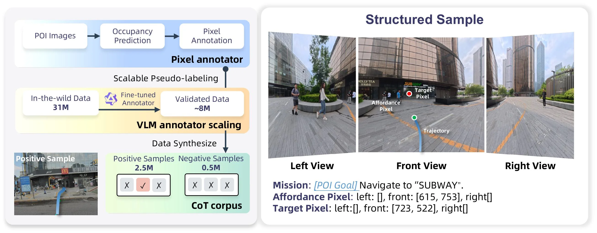

> Figure 7 : The Data Construction Pipeline for the POI-Goal Corpus . Left: the three-stage construction flow—generating geometric seed annotations via monocular depth (Stage 1), scaling and filtering 31 M street-view pairs using a distilled VLM (Qwen-3.5-4B) to yield 8 M valid paths (Stage 2), and synthesizing tri-view episodes into positive and negative sample pairs that harden the system’s rejection capability under missing-target conditions (Stage 3). Right: an example structured sample.

这张图（图7）展示了POI目标语料库的数据构建流程，分为左右两个主要部分，清晰地呈现了从原始数据到结构化样本的完整构建过程。

首先看左侧部分，它描述了数据构建的三个阶段，数据或信息按从上到下、从左到右的顺序流动：

1.  **第一阶段（顶部，蓝色背景框）：生成几何种子注释**
    *   **POI Images**：流程的起点是“兴趣点图像”（Point of Interest Images）。这些是包含目标地点的原始图像数据。
    *   **Occupancy Prediction**：这些POI图像首先经过“占用预测”处理。这一步可能是利用单目深度估计等技术，预测图像中物体的占用情况或空间位置，从而生成初步的几何注释。
    *   **Pixel Annotation**：占用预测的结果进一步转化为“像素级注释”。这一步为图像中的特定目标（如POI）标注具体的像素坐标，形成几何种子注释。
    *   这个阶段被标记为“Pixel annotator”（像素注释器），负责生成初始的、精确的像素级目标位置。

2.  **第二阶段（中间，黄色背景框）：数据缩放与过滤**
    *   **In-the-wild Data (31M)**：接下来，流程引入了大量的“野外数据”，即从真实世界收集的3100万对街景图像（或数据对）。
    *   **Fine-tuned Annotator & Validated Data (~8M)**：这些大规模的野外数据通过一个“微调注释器”（Fine-tuned Annotator）进行处理。根据caption，这个注释器是蒸馏后的VLM（视觉语言模型），例如Qwen-3.5-4B。这个注释器的作用是对数据进行缩放（scaling）和过滤（filtering），最终得到约800万条“有效路径”（Valid Paths）或“有效数据”（Validated Data）。这个过程旨在从海量原始数据中筛选出高质量、符合要求的数据。
    *   这个阶段被标记为“VLM annotator scaling”（VLM注释器缩放），强调了利用VLM模型处理大规模数据并提升数据质量的能力。

3.  **第三阶段（底部，绿色背景框）：合成结构化样本**
    *   **Data Synthesize**：经过验证的有效数据被用于“数据合成”（Data Synthesize）。
    *   **Positive Samples (2.5M) & Negative Samples (0.5M)**：合成的结果是生成了250万个“正样本”（Positive Samples）和50万个“负样本”（Negative Samples）。正样本是指包含目标POI的样本，负样本则不包含。
    *   **CoT corpus**：这些正负样本对被组织成一个“思维链语料库”（Chain-of-Thought corpus）。根据caption，这些样本是“三视图剧集”（tri-view episodes），并被设计用来“强化系统在目标缺失条件下的拒绝能力”（harden the system’s rejection capability under missing-target conditions）。这意味着数据集中包含了目标存在和不存在的各种情况，以训练模型更好地处理复杂场景。
    *   左侧还有一个“Positive Sample”的示例图，显示了一个带有蓝色轨迹的街景图像，直观地展示了一个正样本的样子。

接下来看右侧部分，它提供了一个“Structured Sample”（结构化样本）的示例：

*   **图像视图**：展示了三个不同视角的图像，分别是“Left View”（左视图）、“Front View”（前视图）和“Right View”（右视图）。这些图像模拟了机器人在环境中观察到的多视角视觉输入。
*   **任务描述（Mission）**：任务是“[POI Goal] Navigate to 'SUBWAY'”，即导航到“SUBWAY”（地铁站）。
*   **Affordance Pixel**：这指定了在各个视图中，哪些像素区域与“可达性”或“目标类别”相关。例如，在前视图中，坐标[615, 753]处的像素与目标类别相关（可能是指地铁入口的一般区域），而左右视图中没有（用[]表示）。
*   **Target Pixel**：这指定了在各个视图中，目标“SUBWAY”的具体像素坐标。例如，在前视图中，目标像素的坐标是[723, 522]。左右视图中没有（用[]表示）。
*   **轨迹（Trajectory）**：在前视图中，有一条蓝色的曲线（Trajectory）和一个绿色的点，可能表示机器人的规划路径或当前位置。
*   **注释**：图中还标注了“Affordance Pixel”和“Target Pixel”的含义，帮助理解这些坐标是如何与图像内容关联的。

总结来说，这张图揭示了ABot-N1方法中POI目标语料库的构建方法：
1.  首先，从POI图像生成精确的像素级几何注释。
2.  然后，利用微调的VLM模型对大规模野外数据进行缩放和过滤，得到高质量的有效数据。
3.  最后，将这些有效数据合成为包含正负样本的结构化数据集，用于训练模型，特别是增强其在目标缺失情况下的鲁棒性。
整个流程确保了训练数据的多样性和质量，为后续的视觉语言导航任务提供了坚实的基础。右侧的示例则直观地展示了结构化样本的具体内容和格式，包括多视图图像、任务描述、目标像素位置和相关语义信息。

---

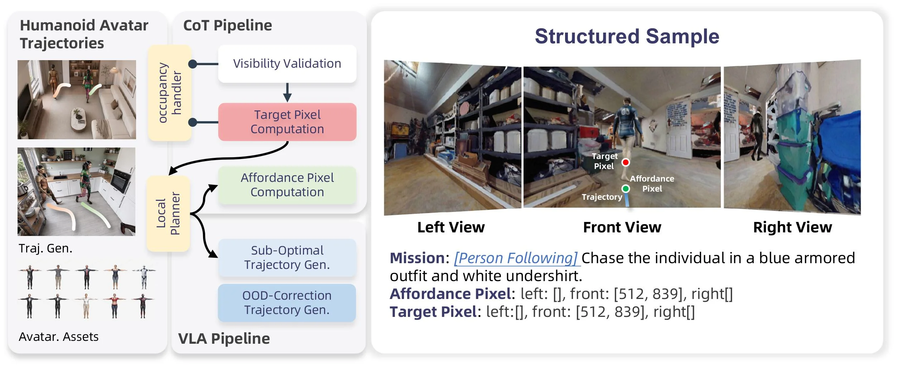

> Figure 8 : Data Construction Pipeline for the Person-Following Corpus. Left: the data construction pipeline covering both CoT and VLN data. The pixel (CoT) data derives affordance and target pixels from human avatar trajectories through A ∗ waypoint planning, visibility detection, and stochastic prediction perturbation, while the VLN data comprises sub-optimal trajectory and OOD-correction trajectory synthesis. Right: an example structured sample showing tri-view observations with affordance and target pixel annotations, along with the language instruction specifying the target appearance.

这张图（图8）展示了“Person - Following Corpus”（人物跟随语料库）的数据构建流程，分为左侧的流程部分和右侧的结构化样本示例部分，我们逐部分讲解：

### 左侧流程部分
- **Humanoid Avatar Trajectories（人形化身轨迹）**：这部分展示了两张包含人形化身的场景图（如客厅、厨房场景），还有下方的“Traj. Gen.”（轨迹生成）和“Avatar. Assets”（化身资产）。这里的“Traj. Gen.”展示了不同姿态的人形化身，可能是用于生成或提供人物运动的参考轨迹；“Avatar. Assets”则是这些化身的外观资产，为后续轨迹生成提供视觉基础。
- **CoT Pipeline（思维链管道）**：由“occupancy handler”（占用处理程序）驱动，包含两个主要模块：
    - **Visibility Validation（可见性验证）**：接收来自“occupancy handler”的信息，可能用于验证目标或相关像素在场景中的可见性，确保后续计算的有效性。
    - **Target Pixel Computation（目标像素计算）**：在可见性验证之后，计算目标像素的位置。这里的“目标”对应人物跟随任务中的目标人物（如右侧示例中的穿蓝色装甲服和白色内衣的人）。
- **VLA Pipeline（视觉语言动作管道）**：由“Local Planner”（局部规划器）驱动，包含三个模块：
    - **Affordance Pixel Computation（可供性像素计算）**：计算可供性像素，可供性像素可能表示场景中与任务相关的可交互或可参考的区域（如右侧示例中的绿色点，可能是一个可供行走或参考的位置）。
    - **Sub - Optimal Trajectory Gen.（次优轨迹生成）**：生成次优的轨迹，这可能是为了模拟实际导航中可能出现的非最优但合理的路径，增加数据的多样性。
    - **OOD - Correction Trajectory Gen.（OOD修正轨迹生成）**：OOD（Out - Of - Distribution，分布外）修正轨迹生成，用于处理超出正常分布的情况，提高模型对异常情况的处理能力。
- **数据流动顺序**：从“Humanoid Avatar Trajectories”开始，“occupancy handler”的信息分别流入“CoT Pipeline”的“Visibility Validation”和“Target Pixel Computation”，同时“Local Planner”的信息流入“VLA Pipeline”的三个模块。另外，“Traj. Gen.”和“Avatar. Assets”为整个流程提供基础的轨迹和化身资产支持。

### 右侧结构化样本示例部分
- **多视角观察（Tri - view Observations）**：展示了“Left View”（左视图）、“Front View”（前视图）和“Right View”（右视图）三个视角的场景图。在前视图中，标注了“Target Pixel”（目标像素，红色点）、“Affordance Pixel”（可供性像素，绿色点）和“Trajectory”（轨迹，蓝色线），这直观地展示了目标人物、可供性区域和运动轨迹的空间关系。
- **语言指令（Language Instruction）**：“Mission: [Person Following] Chase the individual in a blue armored outfit and white undershirt.” 明确了任务是人物跟随，目标是追逐穿蓝色装甲服和白色内衣的人。
- **像素标注（Pixel Annotations）**：
    - “Affordance Pixel: left: [], front: [512, 839], right[]” 表示在左视图和右视图中可供性像素的位置未标注（或为空），在前视图中可供性像素的位置是[512, 839]。
    - “Target Pixel: left:[], front: [512, 839], right[]” 表示在左视图和右视图中目标像素的位置未标注（或为空），在前视图中目标像素的位置是[512, 839]。
- **方法运作的体现**：通过这个结构化样本，我们可以看到方法是如何将高层的任务意图（如人物跟随的语言指令）与低层的像素级目标（目标像素和可供性像素）结合起来的。首先，通过CoT Pipeline中的可见性验证和目标像素计算，确定目标的位置；然后，通过VLA Pipeline中的可供性像素计算、次优轨迹生成和OOD修正轨迹生成，为动作执行提供路径规划支持。多视角的观察和像素标注则确保了空间信息的准确性和完整性，使得模型能够在不同的视角下理解和执行任务。

### 整体方法的运作方式总结
这张图展示的ABot - N1的数据构建流程，是为了支持人物跟随等视觉语言导航任务。它通过分离认知（CoT Pipeline中的思维链推理和像素目标生成）和控制（VLA Pipeline中的动作规划）来实现。首先，利用CoT Pipeline中的可见性验证和目标像素计算，明确任务的目标位置（以像素形式）；然后，通过VLA Pipeline中的可供性像素计算、次优轨迹生成和OOD修正轨迹生成，生成适合动作执行的轨迹。多视角的观察和像素标注确保了空间信息的准确性，而语言指令则提供了高层任务的指导。这种方法通过像素级的锚点（目标像素和可供性像素）将高层意图和低层控制连接起来，确保了导航的鲁棒性、可推广性和可解释性。

---

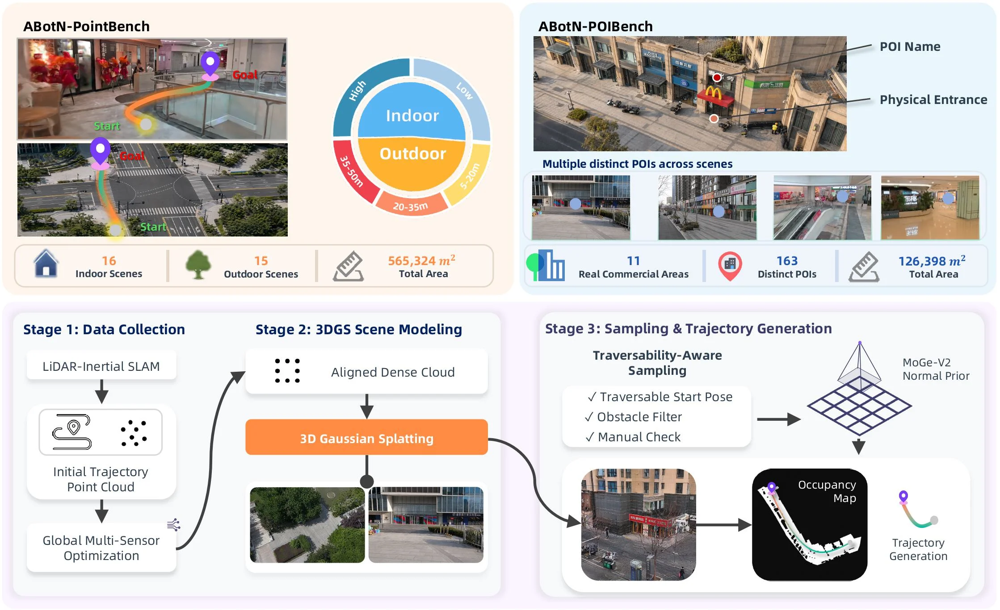

> Figure 9 : Overview of the ABotN Benchmark Suites and their Unified Scene Construction Pipeline. Top: Dataset statistics and hierarchical distance splits for ABotN-PointBench (left) and ABotN-POIBench (right). Bottom: The unified three-stage generation pipeline: (1) high-fidelity data collection via LiDAR-inertial SLAM; (2) photorealistic 3DGS scene modeling initialized by aligned dense point clouds; and (3) traversability-aware query sampling and ground-truth reference trajectory generation using A ∗ {}^{\!*} on MoGe-V2-derived 2D occupancy grids.

这张图是论文《ABot-N1: Toward a General Visual Language Navigation Foundation Model》中的Figure 9，标题为“ABotN基准测试套件及其统一场景构建流程概述”。它分为上下两个主要部分，清晰地展示了ABotN基准的两个关键组成部分（ABotN-PointBench和ABotN-POIBench）以及它们共同的、统一的三阶段场景构建流程。

**上半部分：数据集统计与层次距离划分**

这部分展示了两个主要的基准数据集：ABotN-PointBench（左侧）和ABotN-POIBench（右侧），并提供了它们的统计数据和一些视觉示例。

*   **ABotN-PointBench（左上角）**：
    *   **视觉示例**：展示了两张图片，分别代表室内和室外导航场景。每张图片都标示了“Start”（起点）和“Goal”（目标点），并用彩色路径连接，直观地展示了导航任务。
    *   **数据统计**：
        *   “16 Indoor Scenes”：表示该数据集包含16个室内场景。
        *   “15 Outdoor Scenes”：表示该数据集包含15个室外场景。
        *   “565,324 m² Total Area”：表示所有场景的总面积为565,324平方米。
    *   **层次距离划分**：中间有一个圆形图表，将场景按距离分为不同的层次。中心是“Indoor”（室内）和“Outdoor”（室外）。室内场景进一步细分为“Low”（低）、“5-20m”（5到20米）、“20-35m”（20到35米）和“35-50m”（35到50米）的距离范围。这表明数据集考虑了不同难度的导航任务。

*   **ABotN-POIBench（右上角）**：
    *   **视觉示例**：顶部展示了一张街景图片，标示了“POI Name”（兴趣点名称，如麦当劳）和“Physical Entrance”（实际入口）。下方展示了四个小图，代表“Multiple distinct POIs across scenes”（跨场景的多个不同兴趣点）。
    *   **数据统计**：
        *   “11 Real Commercial Areas”：表示该数据集包含11个真实的商业区域。
        *   “163 Distinct POIs”：表示数据集中有163个不同的兴趣点。
        *   “126,398 m² Total Area”：表示所有场景的总面积为126,398平方米。

**下半部分：统一的三阶段场景构建流程**

这部分详细描述了构建这些基准场景所使用的统一三阶段流程，箭头指示了数据和处理的流动方向。

*   **第一阶段：数据收集 (Stage 1: Data Collection)**：
    *   这是流程的起点。
    *   **LiDAR-Inertial SLAM**：首先使用激光雷达-惯性SLAM（同步定位与地图构建）技术。这是一个核心感知模块，用于在环境中进行定位和建图。
    *   **Initial Trajectory Point Cloud**：SLAM过程生成初始的轨迹点云数据，这包含了机器人（或代理）在环境中移动时的位置信息和环境的三维结构。
    *   **Global Multi-Sensor Optimization**：对初始轨迹点云进行全局多传感器优化。这一步是为了提高数据的准确性和一致性，可能涉及融合来自不同传感器的数据并进行全局调整。

*   **第二阶段：3DGS场景建模 (Stage 2: 3DGS Scene Modeling)**：
    *   这一阶段的目标是创建逼真的三维场景模型。
    *   **Aligned Dense Cloud**：从第一阶段优化后的数据中得到对齐的密集点云。这是3D建模的基础数据。
    *   **3D Gaussian Splatting**：使用3D高斯溅射（3DGS）技术，这是一种先进的渲染技术，能够从点云数据生成高质量的、照片级真实感的三维场景模型。
    *   **输出示例**：展示了两个通过3DGS建模后的场景图片，这些图片看起来非常逼真，细节丰富。

*   **第三阶段：采样与轨迹生成 (Stage 3: Sampling & Trajectory Generation)**：
    *   这一阶段侧重于从构建好的场景中采样查询（如起点和目标）并生成导航轨迹。
    *   **Traversability-Aware Sampling**：这是一个关键的采样步骤，它考虑了环境的可通行性。
        *   **√ Traversable Start Pose**：确保采样的起点是可通行的。
        *   **√ Obstacle Filter**：应用障碍物过滤器，排除被障碍物阻挡或不可行的路径。
        *   **√ Manual Check**：可能还包括人工检查以确保数据质量。
    *   **MoGe-V2 Normal Prior**：这个组件可能提供了一个基于MoGe-V2模型的法线先验知识，用于辅助后续的轨迹生成或场景理解。
    *   **Occupancy Map**：从采样和场景模型中生成占用网格图（Occupancy Map）。这是一个二维表示，显示了环境中哪些区域是可通行的（自由空间），哪些是不可通行的（障碍物）。
    *   **Trajectory Generation**：最终，在占用网格图上生成连续的导航轨迹。图中展示了一个示例，其中一条彩色的路径（从起点到终点）被规划在占用网格图上，并对应到一个实际的场景图片中。这个过程可能使用了A*算法或其变体（如图中提到的A*^! on MoGe-V2-derived 2D occupancy grids）来找到最优路径。

**总结与方法理解**：

这张图清晰地揭示了ABot-N基准的构建过程以及其背后的理念。该方法通过一个统一的、三阶段的管道来创建高质量的基准数据集：
1.  **数据收集**：利用先进的SLAM技术获取准确的环境感知数据。
2.  **场景建模**：使用3D高斯溅射技术从点云数据生成逼真的三维场景，为导航任务提供真实的视觉输入。
3.  **查询生成与轨迹规划**：在生成的场景中，考虑环境的可通行性，采样有意义的起点和目标点，并在占用网格图上生成导航轨迹。

这个流程确保了基准数据集的多样性（如ABotN-PointBench和ABotN-POIBench针对不同类型的导航任务）、真实性（照片级真实感建模）和实用性（考虑可通行性的轨迹生成）。通过这种方式，研究人员可以评估视觉语言导航模型在各种真实感和挑战性场景下的性能。图中的箭头清晰地指示了数据从原始感知到最终轨迹生成的流动过程，展示了从数据采集到场景建模再到任务设计的完整链条。

---

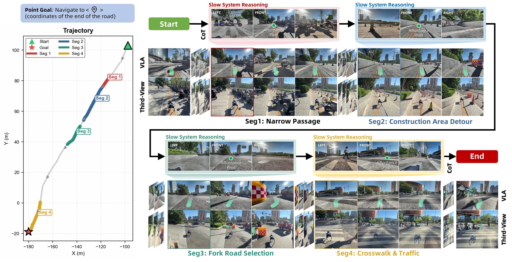

> Figure 10 : Point-Goal Deployment. Four segments of a long-range outdoor episode showcasing obstacle avoidance on narrow roads, construction area detour, correct fork selection, and traffic-light-compliant crosswalk traversal.

这张图展示了ABot - N1模型在点目标导航任务中的一个长距离户外场景部署过程，我们可以从左到右、从上到下逐步解析每个部分的内容和信息流动：

### 左侧轨迹图（Trajectory）
- **坐标轴**：横轴是X（米），纵轴是Y（米），表示机器人在二维平面上的位置。
- **路径与分段**：白色曲线是机器人的导航轨迹，被分为四个段落（Seg1 - Seg4），分别用不同颜色标注：
    - Seg1（红色）：对应“Narrow Passage（狭窄通道）”场景，是轨迹的起始后较早的一段，从起点（绿色三角形）附近开始，向中间延伸。
    - Seg2（蓝色）：对应“Construction Area Detour（施工区域绕行）”场景，在Seg1之后，继续向目标方向延伸。
    - Seg3（绿色）：对应“Fork Road Selection（岔路选择）”场景，在Seg2之后，轨迹出现分支选择的部分。
    - Seg4（黄色）：对应“Crosswalk & Traffic（人行横道与交通）”场景，是轨迹的最后一段，通向终点（红色五角星，目标点，坐标为道路终点的坐标）。
- **图例**：绿色三角形是起点（Start），红色五角星是目标点（Goal），不同颜色的线段代表不同的导航段落（Seg1 - Seg4）。

### 右侧的流程与场景展示（从Start到End）
- **Start（绿色按钮）**：导航任务的起点，机器人从这里开始执行导航任务。
- **Slow System Reasoning（慢系统推理）**：
    - 这部分是模型的“慢思考”阶段，进行显式的Chain - of - Thought（CoT）推理，同时生成像素目标（Affordance Pixel，图中绿色圆点标记的位置）。这个像素目标是图像空间中的锚点，用于指导后续的动作。
    - 每个慢推理阶段都有三个视角的图像：LEFT（左）、FRONT（前）、RIGHT（右），展示机器人在该阶段的视觉输入。例如，在Seg1的慢推理阶段，三个视角的图像显示了狭窄通道周围的场景，绿色圆点标记了可通行的像素目标。
- **VLA（Visual - Language - Action？或者视觉 - 语言 - 锚点？结合上下文，应该是基于视觉 - 语言的锚点引导）和Third - View（第三视角）**：
    - VLA部分展示了机器人在该阶段的实际视觉感知（可能是机器人自身的视角或多视角拼接），Third - View是第三视角的场景展示，帮助理解机器人的周围环境。
    - 每个段落（Seg1 - Seg4）都有对应的VLA和Third - View图像：
        - **Seg1: Narrow Passage**：红色框标记的图像展示了狭窄通道的场景，机器人需要在有限的空间的通行。慢推理阶段的图像（上方）和VLA、Third - View图像（下方）展示了机器人如何在这个场景中进行推理和行动。
        - **Seg2: Construction Area Detour**：蓝色框标记的图像展示了施工区域的场景，机器人需要绕行。慢推理阶段的图像（上方）和VLA、Third - View图像（下方）展示了机器人如何识别施工区域并选择绕行路径。
        - **Seg3: Fork Road Selection**：绿色框标记的图像展示了岔路的场景，机器人需要选择正确的道路。慢推理阶段的图像（上方）和VLA、Third - View图像（下方）展示了机器人如何在这个场景中进行推理和选择。
        - **Seg4: Crosswalk & Traffic**：黄色框标记的图像展示了人行横道和交通场景，机器人需要遵守交通规则（如红灯停、绿灯行？图中可能展示了交通灯的情况）通过人行横道。慢推理阶段的图像（上方）和VLA、Third - View图像（下方）展示了机器人如何在这个场景中进行推理和行动。
- **CoT（Chain - of - Thought）**：在某些慢推理阶段的旁边有CoT标注，表示模型在这个阶段进行了显式的思维链推理，以做出决策。
- **End（红色按钮）**：导航任务的终点，机器人到达目标点（红色五角星），完成任务。

### 方法运作流程总结
1. **任务开始**：机器人从起点（Start）开始，进入“慢系统推理”阶段。
2. **慢系统推理（Slow System Reasoning）**：
    - 模型进行显式的CoT推理，分析当前场景（通过LEFT、FRONT、RIGHT三个视角的图像输入）。
    - 生成像素目标（Affordance Pixel），作为图像空间的锚点，这个锚点是一个紧凑的图像空间点集，用于指导后续的动作，它是连接高层意图和低层控制的通用接口。
3. **动作执行与场景感知（VLA和Third - View）**：
    - 快动作专家（fast action expert）利用文本线索（目标任务，如点目标导航的坐标）和像素目标的引导，生成连续的路径点（在原生控制频率下）。
    - VLA和Third - View图像展示了机器人在该阶段的实际视觉感知和周围环境，帮助理解机器人如何在具体场景中行动（如狭窄通道通行、施工区域绕行、岔路选择、人行横道通过等）。
4. **任务结束**：机器人到达终点（End），完成任务。

### 结果与结论（从图中可推断）
- 图中展示了ABot - N1模型在四个不同的导航场景（狭窄通道、施工区域绕行、岔路选择、人行横道与交通）中的成功导航过程，说明模型能够处理多样化的户外导航任务。
- 通过慢系统推理生成像素目标，结合快动作专家的动作生成，模型能够在不同的场景中做出合理的决策，避免障碍物、绕行施工区域、选择正确的岔路、遵守交通规则通过人行横道，最终到达目标点。
- 这种慢 - 快架构（decoupling cognition from control via a slow - fast architecture）通过双视觉 - 语言信号（dual visual - language signals）引导，确保了导航的鲁棒性、泛化性和可解释性，因为慢系统推理的显式CoT和像素目标的锚点提供了清晰的决策过程和目标指引。

---

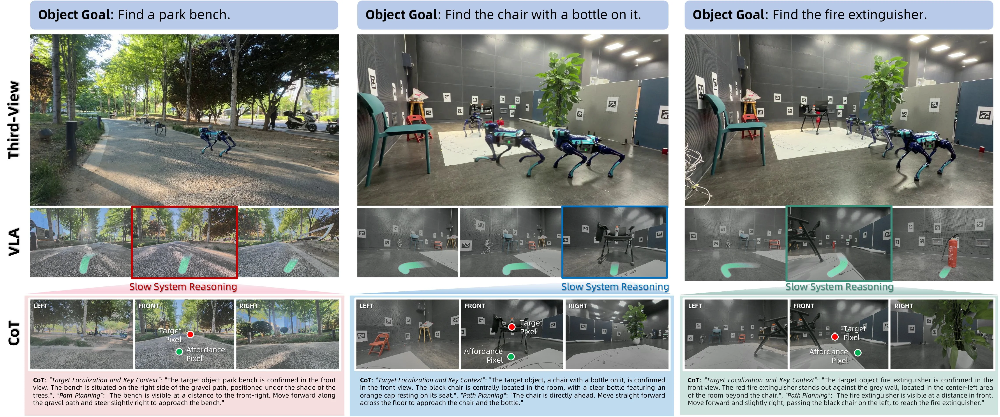

> Figure 11 : Object-Goal Deployment. Three cases—outdoor bench under dappled tree shade at long range, indoor chair with a water bottle (spatial reasoning), and partially occluded fire extinguisher—with CoT, affordance, and target pixel overlays.

这张图展示了ABot - N1模型在**目标导向导航任务**中的部署流程与结果，分为三个核心案例（户外长椅、室内带瓶椅子、部分遮挡的灭火器），通过“慢系统推理→像素目标生成→快行动专家执行”的流程，解释模型如何结合视觉语言信号完成导航。以下从组件、信息流、方法逻辑三方面拆解：

### 1. 组件与信息流（从左到右、从上到下）
- **最上层（Object Goal）**：明确每个案例的目标（如“找公园长椅”“找带瓶的椅子”“找灭火器”），定义任务的“高层意图”。  
- **Third - View（第三视角）**：展示真实场景的全局视图，帮助理解机器人所处的环境（如户外林荫道、室内实验场地），机器人（四足机器人）在其中移动，这是任务的“现实背景”。  
- **VLA（视觉语言对齐？或中间视觉表示）**：包含多个子图，其中红色/蓝色/绿色框标注“Slow System Reasoning”（慢系统推理）的区域。这部分是**视觉 - 语言推理的核心输出**：慢系统通过Chain - of - Thought（CoT）显式推理，定位目标物体的像素位置（“Target Pixel”）和“Affordance Pixel”（可能是与任务相关的可交互/关键上下文像素，如图中长椅的阴影区、椅子的位置、灭火器的位置）。  
- **CoT（思维链）**：每个案例下方的文字框，详细解释推理过程：  
  - 目标定位（如“长椅在碎石路右侧、树荫下”）；  
  - 关键上下文（如“椅子在房间中央、带橙色瓶盖的瓶子在座位上”）；  
  - 路径规划（如“沿碎石路前进、微调方向接近长椅”）。  
  这部分是**显式的语言化推理**，将视觉信息转化为可解释的决策逻辑，解决了“黑箱映射”的问题。  

### 2. 方法如何运作（从推理到行动的逻辑）
ABot - N1采用**“慢 - 快”架构**，分离“认知（推理）”与“控制（行动）”：  
- **慢系统（Slow System Reasoning）**：通过视觉 - 语言信号（图像 + 文本提示）进行显式CoT推理，输出**像素级目标**（Target Pixel）和关键上下文像素（Affordance Pixel）。这一步是“高 level 意图”的细化，将模糊的任务目标（如“找长椅”）转化为具体的像素位置（图像空间的锚点），为后续行动提供“通用接口”。  
- **快行动专家（Fast Action Expert）**：利用慢系统输出的像素目标和文本线索，在**原生控制频率**下生成连续的路径点（waypoints），驱动机器人移动。图中机器人的移动轨迹（如Third - View中机器人的位置变化）验证了这一过程：从初始位置，根据像素目标和路径规划，逐步接近目标物体。  

### 3. 结果与结论（从案例看有效性）
三个案例分别对应不同难度的目标（长距离、空间推理、部分遮挡），模型的表现可通过以下方式验证：  
- **目标定位准确性**：CoT中的“Target Pixel”和“Affordance Pixel”准确覆盖了目标物体（如长椅在树荫下、带瓶的椅子、灭火器），说明慢系统的推理能有效定位目标。  
- **路径规划合理性**：路径规划描述（如“沿碎石路前进”“直走接近椅子”）与Third - View中机器人的移动方向一致，说明快行动专家能根据像素目标和文本线索生成合理的行动路径。  
- **通用性与鲁棒性**：三个案例覆盖了户外、室内、遮挡等场景，模型均能完成任务，证明ABot - N1在多样任务（点目标、物体目标、指令跟随等）中的通用性，且通过显式推理（CoT）和像素锚点，解决了“坐标漂移”和“长尾语义处理差”的问题，实现了**鲁棒、可解释、通用的导航**。  

简言之，这张图通过三个案例，清晰展示了ABot - N1“视觉 - 语言推理（慢系统）→像素目标→行动执行（快系统）”的工作流程：慢系统用CoT显式推理并定位目标像素，快系统用像素和文本线索生成行动路径，最终实现不同场景下的目标导向导航，验证了方法的通用性、鲁棒性和可解释性。

---

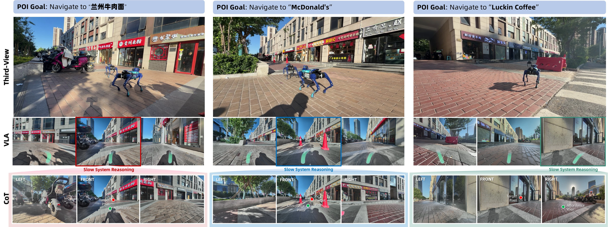

> Figure 12 : POI-Goal Deployment. Locating a Lanzhou noodle restaurant (large viewing angle), McDonald’s (obstacle avoidance en route), and Luckin Coffee (slope navigation and staircase avoidance).

这张图展示了ABot - N1模型在POI（兴趣点）目标导航任务中的部署情况，针对三个不同的POI目标：“兰州牛肉面”、“麦当劳”和“瑞幸咖啡”，分别呈现了模型的认知推理和控制执行过程，以说明方法的具体运作方式。

### 整体结构与信息流动
图中分为三列，每列对应一个POI目标（从左到右依次为“兰州牛肉面”、“麦当劳”、“瑞幸咖啡”）。每列又包含三个部分：**Third - View（第三人称视角）**、**VLA（视觉语言推理的中间表示）**和**CoT（思维链推理与像素目标生成）**，信息从上方的场景观测，经过中间的推理阶段，最终生成用于控制的像素目标和动作指令，体现了“感知 - 推理 - 控制”的流程。

### 各组件含义与流程（按列分析）
#### 第一列：POI目标为“兰州牛肉面”
- **Third - View**：展示机器人（四足机器人）在实际街道场景中的位置，周围有商铺（如“兰州牛肉面”招牌）、电动车等环境元素，这是模型接收的原始视觉观测，提供了场景的整体空间信息。
- **VLA**：包含多个视角的图像（类似多帧或多视角的视觉输入），其中红色框标注的区域是“Slow System Reasoning（慢系统推理）”的关注区域，该区域聚焦于包含目标（兰州牛肉面店铺）的视觉内容，用于进行显式的思维链（Chain - of - Thought）推理，识别目标的位置和相关环境特征（如店铺招牌、周围障碍物等）。
- **CoT**：分为LEFT（左）、FRONT（前）、RIGHT（右）三个视角的图像，展示了模型在推理过程中对不同方向的视觉信息处理。图中标注了“Target Pixel（目标像素）”（红色点）和“Affordance Pixel（可行走像素）”（绿色点），说明模型通过思维链推理，确定了目标的位置（目标像素）和可通行的区域（可行走像素），这些像素级的锚点作为“universal interface（通用接口）”，连接高层意图（找到目标店铺）和低层控制（生成行走路径）。

#### 第二列：POI目标为“麦当劳”
- **Third - View**：机器人在街道场景中，周围有商铺（含“麦当劳”相关招牌？或目标区域的商铺）、交通锥等障碍物，原始观测提供了包含目标（麦当劳）和障碍物的场景信息。
- **VLA**：多视角图像，蓝色框标注的是“Slow System Reasoning”的关注区域，聚焦于包含目标（麦当劳）和障碍物（交通锥）的视觉内容，用于推理如何避开障碍物并找到目标。
- **CoT**：LEFT、FRONT、RIGHT视角的图像，标注了“Target Pixel”（红色点）和“Affordance Pixel”（绿色点），模型通过推理确定目标位置和可行走区域，同时考虑障碍物（交通锥）的规避，生成的像素锚点指导后续的动作专家生成连续的路径点。

#### 第三列：POI目标为“瑞幸咖啡”
- **Third - View**：机器人在街道场景中，周围有商铺（含“瑞幸咖啡”相关招牌？或目标区域的商铺）、斜坡、楼梯等环境元素，原始观测提供了包含目标（瑞幸咖啡）和地形/障碍物的场景信息。
- **VLA**：多视角图像，绿色框标注的是“Slow System Reasoning”的关注区域，聚焦于包含目标（瑞幸咖啡）和地形特征（斜坡、楼梯入口）的视觉内容，用于推理如何进行斜坡导航和楼梯规避。
- **CoT**：LEFT、FRONT、RIGHT视角的图像，标注了“Target Pixel”（红色点）和“Affordance Pixel”（绿色点），模型通过推理确定目标位置和可行走区域（考虑斜坡和楼梯的规避），生成的像素锚点用于控制机器人的移动。

### 方法运作机制（从图中揭示）
ABot - N1采用**慢 - 快架构**（slow - fast architecture）：
1. **慢系统推理（Slow System Reasoning）**：由视觉 - 语言推理器执行，通过显式的思维链（CoT）推理，分析场景中的目标（POI）和环境特征（如障碍物、地形），生成**像素目标（Target Pixel）**和**可行走像素（Affordance Pixel）**。这一步是“认知”阶段，将高层的视觉 - 语言指令（如“导航到兰州牛肉面”）转化为图像空间的锚点，解决了传统方法中坐标漂移和长尾语义处理差的问题，因为显式的推理和像素级的锚点提供了更鲁棒和可解释的空间决策。
2. **快动作专家（Fast Action Expert）**：利用慢系统推理生成的像素锚点（目标像素和可行走像素）以及文本提示（如POI名称），在本地控制频率下生成连续的路径点（waypoints），这是“控制”阶段，将高层的意图（找到目标）转化为低层的动作指令，确保机器人在实际环境中准确移动。

### 结果与结论（从图中推断）
图中展示了模型在三种不同POI目标场景下的成功部署：
- 对于“兰州牛肉面”（大视角场景）：模型能识别目标店铺的位置，生成的像素锚点指导机器人在包含电动车等障碍物的场景中导航。
- 对于“麦当劳”（途中障碍物规避）：模型能识别目标并规避交通锥等障碍物，说明方法在障碍物规避任务中的有效性。
- 对于“瑞幸咖啡”（斜坡和楼梯规避）：模型能识别目标并处理地形特征（斜坡、楼梯），说明方法在地形导航任务中的有效性。

通过将高层意图（视觉 - 语言指令）与低层控制（像素锚点引导的动作生成）通过**像素级锚点**和**显式语言痕迹**（思维链推理）连接，ABot - N1实现了**鲁棒、可泛化、可解释**的导航，能够在模拟和真实世界基准测试中取得优异成绩，建立了新的最先进记录（如摘要所述）。这种方法解决了传统方法的坐标漂移、长尾语义处理差和缺乏可解释性的问题，为视觉 - 语言导航的基础模型提供了一种有效的架构。

---

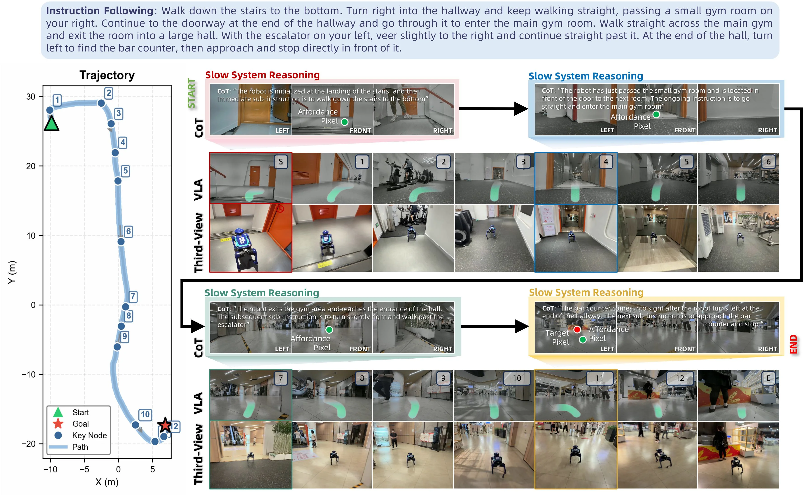

> Figure 13 : Instruction-Following Deployment. Slow-system reasoning at four critical moments—stair descent, gym entry, gym exit, and bar approach—with CoT, affordance pixel, and target pixel visualizations.

这张图展示了ABot - N1模型在指令跟随任务中的部署过程，清晰呈现了方法的运作机制：

### 左侧轨迹图（Trajectory）
- 这是一个二维坐标图（X轴和Y轴单位为米），展示了机器人从起点（绿色三角形“Start”）到目标点（红色五角星“Goal”）的路径。
- 蓝色圆点是“Key Node”（关键节点），编号从1到12，代表机器人在导航过程中的重要位置；蓝色曲线是“Path”（路径），连接这些关键节点，显示机器人的移动轨迹。

### 中间与右侧的“Slow System Reasoning”和“Third - View VLA”板块
图中按时间顺序（通过箭头连接）展示了四个关键时刻的“Slow System Reasoning”（慢系统推理）和对应的“Third - View VLA”（第三人称视角的视觉 - 语言 - 动作？或视觉 - 语言 - 锚点？结合上下文，VLA可能是视觉 - 语言 - 锚点可视化）：
1. **楼梯下降（Stair Descent）时刻**：
    - “Slow System Reasoning”部分：包含“CoT”（思维链，即模型的推理过程文字说明）、“Affordance Pixel”（可供性像素，可能是模型关注的空间区域，绿色圆点标记）和左右前后的视角图（LEFT、FRONT、RIGHT）。这里的CoT解释了机器人初始位置在楼梯平台，当前子指令是走下楼梯到底部。
    - “Third - View VLA”部分：上方是机器人视角的图像（带绿色轨迹？可能是模型预测的路径），下方是第三人称视角的机器人图像，红色框标记了这个关键时刻的机器人位置和周围环境，对应轨迹图中的早期关键节点（如节点1 - 5附近）。
2. **进入健身房（Gym Entry）时刻**：
    - “Slow System Reasoning”：CoT说明机器人刚经过小健身房，位于下一个房间门的正前方，当前指令是直走进入主健身房。同样有Affordance Pixel和视角图。
    - “Third - View VLA”：蓝色框标记了这个时刻的机器人位置（轨迹图中节点5 - 6附近），上方是机器人视角，下方是第三人称视角，展示机器人进入健身房的过程。
3. **离开健身房（Gym Exit）时刻**：
    - “Slow System Reasoning”：CoT指出机器人离开健身房区域，到达大厅入口，后续子指令是稍微向右转并走过自动扶梯。有Affordance Pixel和视角图。
    - “Third - View VLA”：绿色框标记了这个时刻的机器人位置（轨迹图中节点7 - 9附近），展示机器人从健身房进入大厅的场景。
4. **接近吧台（Bar Approach）时刻**：
    - “Slow System Reasoning”：CoT说明吧台在机器人走到走廊尽头左转后进入视野，下一个子指令是接近吧台并停下，这里有“Target Pixel”（目标像素，红色圆点标记目标位置）和视角图。
    - “Third - View VLA”：黄色框标记了这个时刻的机器人位置（轨迹图中节点11 - 12附近），展示机器人接近并到达吧台的过程，最终到达目标（END）。

### 信息流动与方法运作逻辑
- **信息流动**：从左侧轨迹图的起点开始，机器人按照指令逐步移动，每个关键时刻（楼梯下降、健身房进入、健身房退出、吧台接近）触发“Slow System Reasoning”。慢系统推理通过Chain - of - Thought（CoT）明确当前任务和子指令，同时识别“Affordance Pixel”（可供性区域，即需要关注的空间位置）或“Target Pixel”（目标位置）。然后，“Third - View VLA”从第三人称视角和机器人自身视角可视化这个过程，帮助理解机器人在环境中的位置和动作。最后，这些高层次的推理（慢系统）传递给“fast action expert”（快速动作专家，图中未直接显示，但根据论文摘要，它会利用文本线索和像素引导生成连续路径点），从而控制机器人移动，完成从起点到目标的导航。
- **方法运作方式**：ABot - N1通过“慢 - 快”架构工作。“慢系统”负责显式的思维链推理，生成像素级目标（如可供性像素或目标像素），作为不同任务的通用接口（包括点目标、对象目标、兴趣点目标、指令跟随和人跟随等）。“快系统”（动作专家）利用文本线索和像素引导，在原生控制频率下生成连续路径点。通过像素锚点（像素级目标）和显式语言痕迹（思维链推理）连接高层次意图和低层次控制，确保导航的鲁棒性、可推广性和可解释性。

### 结果与结论（从图中可推断）
- 图中展示了机器人成功从起点导航到目标（吧台）的过程，每个关键时刻的慢系统推理都正确识别了任务和空间位置，第三人称视角的可视化也显示机器人在正确的路径上移动。这表明ABot - N1的方法能够处理长指令的导航任务，在不同的环境场景（楼梯、健身房、大厅）中做出正确的空间决策，验证了其通用性、鲁棒性和可解释性。例如，在楼梯下降时正确识别下楼任务，在健身房进出时正确识别方向和目标区域，在接近吧台时正确识别目标位置并停止。

这张图通过可视化的方式，详细展示了ABot - N1在指令跟随任务中的认知（慢系统推理）和控制（动作执行，通过VLA可视化体现）过程，清晰地说明了方法如何将高层次的语言意图转化为低层次的导航动作，同时保证了导航的准确性和可解释性。

---

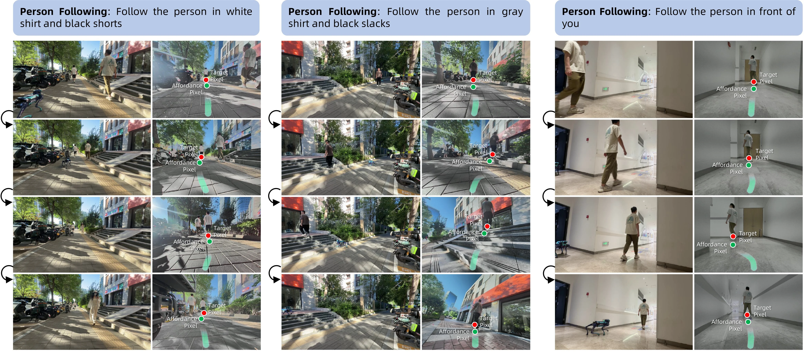

> Figure 14 : Person-Following Deployment. Outdoor tracking under pedestrian distraction, stair-climbing following, and indoor corner-rounding with temporary occlusion.

这张图展示了ABot - N1模型在“人员跟随”任务中的部署情况，分为三个主要板块，分别对应不同的跟随场景：户外行人干扰下的跟踪、爬楼梯时的跟随以及室内转弯时的临时遮挡跟踪。

### 板块结构与组件含义
- **每个板块的标题**：每个板块上方的蓝色标题栏明确了该板块的任务目标，例如“Person Following: Follow the person in white shirt and black shorts”（跟随穿白衬衫黑短裤的人）、“Follow the person in gray shirt and black slacks”（跟随穿灰衬衫黑长裤的人）、“Follow the person in front of you”（跟随你前面的人）。这些标题定义了当前任务的特定目标对象或场景。
- **图像序列与箭头**：每个板块内的图像以网格形式排列，左侧的黑色箭头表示时间顺序或任务执行的流程，即从上到下（或从左到右，根据布局）展示任务执行的不同阶段。例如，在第一个板块中，图像从上到下展示了模型在不同时间步对穿白衬衫黑短裤的人的跟踪过程。
- **目标像素（Target Pixel，红色点）**：在每个图像的右侧子图中，红色点标记了目标人物（或要跟随的对象）的位置。这显示了模型识别到的目标在图像空间中的位置。
- **可达性像素（Affordance Pixel，绿色点）**：右侧子图中的绿色点标记了模型认为的“可达”或“可行动”的位置，通常与模型的动作规划相关，指示下一步应该移动到的位置。
- **绿色路径（Affordance Pixel的轨迹）**：右侧子图中的绿色虚线或实线表示模型的动作轨迹，即从当前位置到目标位置（或下一个可达位置）的路径。这展示了模型的运动规划结果。

### 方法运作的揭示
ABot - N1的方法通过“慢 - 快”架构来处理人员跟随任务：
1. **慢视觉 - 语言推理器（Slow Vision - Language Reasoner）**：首先，模型进行显式的“链式思考”（Chain - of - Thought）推理，分析当前环境和任务目标（例如，识别要跟随的人）。这一阶段生成一个“像素目标”（即图中的红色点），作为高层的意图表示。这个像素目标是通用的接口，适用于多种任务（如点目标、对象目标、人员跟随等）。
2. **快动作专家（Fast Action Expert）**：然后，模型利用文本提示（任务指令）和像素目标（红色点）来生成连续的路径点（即图中的绿色点和路径），这些路径点在本地控制频率下使用。这一阶段将高层意图（像素目标）转换为低层控制信号（动作轨迹），确保模型能够准确地跟随目标。

### 结果与结论
- **场景覆盖**：图中展示了三种不同的场景：
  - 户外行人干扰：模型能够在有其他行人的情况下跟踪目标（如第一个板块中，尽管有其他行人，模型仍能跟踪穿白衬衫黑短裤的人）。
  - 爬楼梯：模型能够在爬楼梯时跟踪目标（如第二个板块中，目标人物爬楼梯，模型也能跟随）。
  - 室内转弯与临时遮挡：模型能够在室内转弯时处理临时遮挡（如第三个板块中，目标人物转弯或被部分遮挡，模型仍能跟踪）。
- **结论**：这些结果表明ABot - N1能够在多样化的环境中（户外、室内、有干扰、有遮挡）有效地执行人员跟随任务，验证了其鲁棒性和泛化能力。模型通过将高层认知（慢推理）与低层控制（快动作）解耦，结合像素锚点和显式语言痕迹，实现了稳健、可泛化且可解释的导航。
