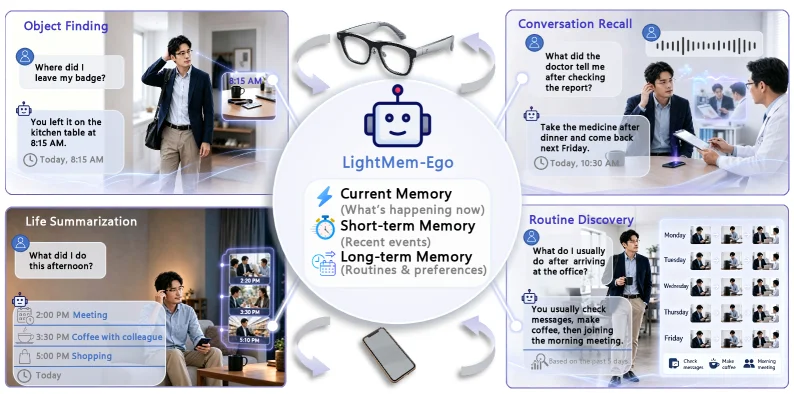
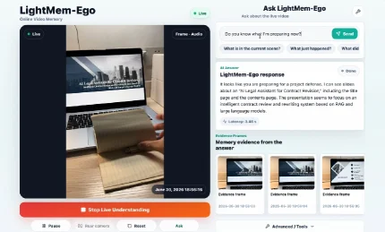
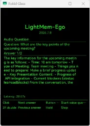
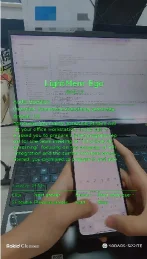
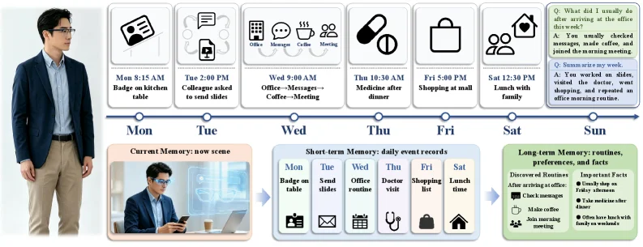

# LightMem-Ego: Your AI Memory for Everyday Life

[arXiv](https://arxiv.org/abs/2607.11487) · [HuggingFace](https://huggingface.co/papers/2607.11487) · ▲47

## 摘要（原文）

> Personal AI assistants on mobile and wearable devices continuously perceive users' daily lives through visual and audio streams. However, answering queries about past experiences requires lightweight multimodal memory that can continuously accumulate, organize, and retrieve long-term experiences, which remains challenging. To address this challenge, we present LightMem-Ego, a lightweight streaming multimodal memory system for everyday-life assistance. The system continuously captures egocentric visual and audio streams, aligns them on a shared timeline, and organizes them into a hierarchical memory consisting of current, short-term, and long-term memory. Given a user query, LightMem-Ego dynamically routes retrieval to the appropriate memory level and generates answers grounded in multimodal evidence. The demonstration can be deployed on smartphones and AI glasses, supporting object finding, conversation recall, life summarization, routine discovery, and personalized assistance. Code is available at https://github.com/zjunlp/LightMem-Ego.

## 摘要（中译）

移动和可穿戴设备上的个人人工智能助手通过视觉和音频流持续感知用户的日常生活。然而，回答有关过去经历的问题需要一种轻量级的多模态记忆，它能够持续积累、组织和检索长期经历，这仍然是一个挑战。为应对这一挑战，我们提出了LightMem - Ego，这是一个用于日常生活辅助的轻量级流式多模态记忆系统。该系统持续捕获以自我为中心的视觉和音频流，在共享时间线上对齐它们，并将它们组织成一个由当前记忆、短期记忆和长期记忆组成的分层记忆。给定用户查询，LightMem - Ego会动态地将检索路由到合适的内存级别，并基于多模态证据生成答案。该演示可以部署在智能手机和智能眼镜上，支持物体查找、对话回忆、生活总结、日常发现和个性化辅助。代码可在https://github.com/zjunlp/LightMem - Ego获取。

## 背景剖析

随着智能手机和智能眼镜等可穿戴设备的普及，个人AI助手正逐渐成为我们日常生活中不可或缺的一部分。这些设备能够持续捕捉用户的视觉和音频信息，为AI助手提供了丰富的日常经验数据。然而，现有的AI助手在处理与用户过去经验相关的问题时仍面临挑战。

技术背景方面，这类技术主要应用于日常生活中的个人记忆辅助。例如，帮助用户找到丢失的物品、回忆最近的对话、总结每日活动以及分析长期习惯和例行公事。这些功能可以显著提高用户的生活质量和效率。

之前的问题主要集中在三个方面：首先，日常经验以连续的视觉-音频流形式出现，没有明确的事件边界，这使得AI助手难以将这些原始观察转化为连贯的事件级经验。其次，如何将不断积累的经验有效地组织成当前、短期、情景和语义记忆，同时保持长期部署的效率，也是一个难题。最后，用户查询通常跨越多个时间范围，需要跨不同记忆级别进行动态路由，而不是依赖于单一的上下文窗口或平面检索存储。

为了解决这些问题，本文提出了LightMem-Ego系统。该系统通过将轻量级的智能手机或智能眼镜客户端与后端连接起来，接收以自我为中心的视觉-音频流，将最近的观察划分为事件，并将其组织成三级记忆层次结构：当前记忆用于正在进行的上下文，短期记忆用于最近的微事件，长期记忆用于整合的事件和语义事实。在回答问题时，记忆路由器根据查询的时间范围和意图选择证据，使系统能够在统一的界面中提供关于现在、最近过去和长期例行公事的可靠回答。

与前人工作的关键差异在于，LightMem-Ego采用了流式多模态记忆系统的方法，能够持续捕获、组织、检索和推理日常生活经验。这使得系统能够更好地适应用户的实际需求，并在各种任务中提供更准确和高效的帮助。

## 方法图解

> Figure 1: Overview of LightMem-Ego ’s motivating scenarios and memory hierarchy. The system supports everyday memory assistance across object finding, conversation recall, life summarization, and routine discovery by routing user queries to current, short-term, and long-term memory.

这张图（图1）是论文《LightMem-Ego: Your AI Memory for Everyday Life》的核心示意图，它清晰地展示了LightMem-Ego系统的核心理念、记忆层级结构以及它在日常生活中的主要应用场景。

首先，我们来看图的中心部分，这里标注为“LightMem-Ego”，并展示了一个机器人图标，象征着这个AI系统。在中心区域下方，明确列出了系统的三个核心记忆层级：
1.  **Current Memory (What's happening now)**：表示当前正在发生的事情的记忆，这部分记忆处理的是实时的、最新的信息。
2.  **Short-term Memory (Recent events)**：表示近期事件的记忆，用于存储和处理最近一段时间内发生的事件。
3.  **Long-term Memory (Routines & preferences)**：表示长期记忆，主要用于存储用户的习惯、偏好以及重复发生的事件模式。

这三个记忆层级构成了LightMem-Ego系统的核心架构，它们通过箭头与周围的四个应用场景相连，表明系统如何根据用户的查询调用不同层级的记忆来提供帮助。

接下来，我们分析图中的四个主要应用场景板块：

1.  **左上角：Object Finding（物品查找）**
    *   **场景描述**：一个用户在思考“我把徽章落在哪里了？”（Where did I leave my badge?）。系统通过检索记忆，在左侧给出了回答：“你今天8:15把它落在了厨房的桌子上。”（You left it on the kitchen table at 8:15 AM Today, 8:15 AM）。
    *   **信息流动**：用户的查询（物品丢失）触发了系统的记忆检索。在这个场景中，系统可能主要调用了短期记忆或当前记忆（如果事件刚发生不久），找到了与该物品相关的具体位置和时间信息，并以文本形式呈现给用户。图像中还显示了用户当时的环境（办公室或家中）和一个时间戳为8:15 AM的设备界面，这可能是系统获取信息的来源之一。

2.  **右上角：Conversation Recall（对话回忆）**
    *   **场景描述**：一个用户在思考“医生看完报告后对我说了什么？”（What did the doctor tell me after checking the report?）。系统通过检索记忆，在右侧给出了回答：“晚饭后吃药，下周五再来。”（Take the medicine after dinner and come back next Friday.）。
    *   **信息流动**：用户的查询（回忆对话内容）触发了系统的记忆检索。这个场景可能需要系统从短期或长期记忆中提取具体的对话内容。图像中显示了用户与医生的对话场景，以及一个时间戳为10:30 AM的设备界面，这可能是对话发生的时间或系统记录该对话的时间。

3.  **左下角：Life Summarization（生活总结）**
    *   **场景描述**：一个用户在思考“我今天下午做了什么？”（What did I do this afternoon?）。系统通过检索记忆，在左侧给出了一个时间线形式的总结：“2:00 PM 会议”（2:00 PM Meeting）、“3:30 PM 和同事喝咖啡”（3:30 PM Coffee with colleagues）、“5:00 PM 购物”（5:00 PM Shopping）。
    *   **信息流动**：用户的查询（总结一天活动）触发了系统的记忆检索，特别是短期和长期记忆的结合。系统将一天中的关键事件按时间顺序整理并呈现给用户。图像中显示了用户坐在沙发上，旁边有一个手机，可能代表查询的输入设备或结果的展示设备。

4.  **右下角：Routine Discovery（习惯发现）**
    *   **场景描述**：一个用户在思考“我通常到办公室后做什么？”（What do I usually do after arriving at the office?）。系统通过检索记忆，在右侧给出了回答：“你通常查看消息、泡咖啡，然后参加早会。”（You usually check messages, make coffee, then join the morning meeting.）。
    *   **信息流动**：用户的查询（了解自己的日常习惯）触发了系统的长期记忆检索。系统分析了用户过去的行为模式，识别出重复发生的活动序列，并以概括性的方式呈现给用户。图像中显示了一个日历视图，上面有不同日期的活动快照，这可能代表了系统用于发现习惯的数据来源。

**数据或信息的流动顺序**：
用户的查询（如物品查找、对话回忆等）首先被系统接收。然后，系统根据查询的性质（是关于即时事件、近期事件还是长期习惯）动态地将检索请求路由到相应的记忆层级（当前记忆、短期记忆或长期记忆）。系统在这些记忆层级中搜索相关的多模态信息（视觉、音频等）。找到相关信息后，系统将其整合并生成一个基于多模态证据的回答，然后呈现给用户。图中的箭头表示了这种从用户查询到记忆检索再到回答生成的流程方向。

**这张图揭示了方法具体是怎么做的**：
这张图直观地展示了LightMem-Ego系统的工作流程：
*   **多模态数据捕获**：系统通过可穿戴设备（如AI眼镜）或移动设备持续捕获用户的视觉和音频流。
*   **记忆分层组织**：捕获到的数据被对齐到一个共享的时间线上，并组织成一个分层的记忆结构，包括当前记忆（处理即时信息）、短期记忆（处理近期事件）和长期记忆（处理习惯和偏好）。
*   **动态查询路由**：当用户提出查询时，系统会根据查询的类型（例如，寻找丢失的物品可能需要短期记忆，而了解日常习惯可能需要长期记忆）智能地选择合适的记忆层级进行检索。
*   **多模态证据生成**：系统从选定的记忆层级中检索相关信息，并结合多模态证据（如图像、文本、时间戳）生成一个准确且有上下文的回答。
*   **支持多种应用**：该系统旨在支持多种日常生活辅助任务，如图中所示的物品查找、对话回忆、生活总结和习惯发现。

总而言之，这张图清晰地传达了LightMem-Ego系统如何作为一个轻量级的流式多模态记忆系统，通过分层记忆和动态查询路由，为用户提供个性化的日常生活的记忆辅助服务。它通过四个具体的应用场景示例，展示了系统的实用性和有效性。

---

> (a) Web client. (b) Glasses app UI. (c) First-person overlay. Figure 2: Interfaces of LightMem-Ego across web and wearable deployments. The web client visualizes live multimodal capture and retrieved evidence; the glasses client app provides a lightweight interaction surface; and the first-person overlay illustrates how memory-grounded responses are presented in the user’s egocentric view.

这张图展示了论文《LightMem-Ego: Your AI Memory for Everyday Life》中提出的LightMem-Ego系统的**Web客户端界面**，它直观地呈现了该系统如何处理用户的日常多模态数据并提供基于记忆的回答。

首先，我们来看图的左侧部分，这是**实时多模态捕捉区域**：
*   顶部有“Live”标识，表明这是一个实时视频流。
*   中间的主要区域显示了一个笔记本电脑屏幕和一只手正在翻阅笔记本的画面，这代表了系统通过摄像头捕捉的用户第一人称视角（egocentric view）的视觉流。
*   视频流下方有一个时间戳“June 30, 2024 18:50:59”，记录了当前捕捉到的时刻。
*   最下方是一个醒目的红色按钮“Stop Live Understanding”，用于停止实时的多模态数据捕获和处理。
*   在红色按钮下方，还有几个功能按钮，如“Pause”（暂停）、“Rear camera”（切换后置摄像头）、“Reset”（重置）和“Ask”（提问），这些是用户与系统交互的控制选项。

接下来，我们看图的右侧部分，这是**用户查询和系统响应区域**：
*   顶部是“Ask LightMem-Ego”的标题，下面有一个输入框，提示用户“Ask about the live video”（询问关于实时视频的内容）。图中示例的问题是“Do you know why I'm preparing now?”（你知道我现在为什么在准备吗？）。
*   输入框下方有几个快捷问题选项，如“What is in the current scene?”（当前场景中有什么？）、“What just happened?”（刚刚发生了什么？）和“What did I...”（我做了什么...），方便用户快速提问。
*   再往下是“AI Answer”部分，标题为“LightMem-Ego response”。这里显示了系统对用户问题的回答：“It looks like you are preparing for a project defense. I can see notes about an 'AI Legal assistant for Contract revision', including the title page and some hand-written notes. The prospective system seems to be based on RAG and large language models.”（看起来你正在为一个项目答辩做准备。我能看到关于“用于合同修订的AI法律助手”的笔记，包括标题页和一些手写笔记。这个预期系统似乎是基于RAG和大型语言模型的。）
*   回答下方是“Evidence frames”部分，标题为“Memory-grounded evidence from the answer”。这里展示了三张小图片，作为系统回答的证据来源。每张图片都有一个时间戳，例如“2024-06-30 18:50:53”、“2024-06-30 18:50:54”和“2024-06-30 18:50:50”。这些图片对应于系统从捕捉到的多模态流中检索到的、与回答相关的关键帧。这些证据帧帮助用户理解系统回答的依据。

**数据或信息的流动顺序**：
1.  系统通过摄像头和麦克风**实时捕捉**用户的第一人称视觉和音频流（如图左侧所示）。
2.  这些多模态数据被**连续地**捕获并存储在系统的层次化记忆中（当前记忆、短期记忆、长期记忆）。
3.  当用户在右侧的输入框中**提出问题**时，系统会根据问题动态地**路由检索**到适当的记忆层级（例如，如果问题是关于刚刚发生的事情，系统可能会优先检索短期记忆）。
4.  系统从选定的记忆层级中**检索**与问题相关的多模态证据（如图右侧的“Evidence frames”所示）。
5.  系统利用检索到的证据生成**回答**（如图右侧的“AI Answer”所示），并确保回答是“基于多模态证据的”（grounded in multimodal evidence）。
6.  最后，系统将回答和相应的证据呈现给用户（如图右侧的整个区域所示）。

**这张图揭示了方法具体是怎么做的**：
这张图清晰地展示了LightMem-Ego系统的工作流程：
*   **多模态数据捕获**：系统持续获取用户日常生活的视觉和音频信息。
*   **记忆组织**：捕获的数据被组织成一个层次化的记忆结构，以便有效地存储和检索长期经验。
*   **查询处理与检索**：当用户提出关于过去经历的查询时，系统能够动态地选择合适的记忆层级进行检索。
*   **证据生成与回答**：系统基于检索到的多模态证据生成回答，并将这些证据展示给用户，以增强回答的可信度和透明度。
*   **用户交互**：用户可以通过简单的界面（如图中的输入框和快捷问题）与系统交互，查询自己的过去经历。

总而言之，这张图通过一个具体的用户界面示例，生动地演示了LightMem-Ego系统如何作为一个个人AI助手，帮助用户回忆和管理日常生活中的经历。它展示了从数据捕获、记忆组织、查询处理到回答生成的完整过程。

---

> (a) Web client. (b) Glasses app UI. (c) First-person overlay. Figure 2: Interfaces of LightMem-Ego across web and wearable deployments. The web client visualizes live multimodal capture and retrieved evidence; the glasses client app provides a lightweight interaction surface; and the first-person overlay illustrates how memory-grounded responses are presented in the user’s egocentric view.

这张图展示的是LightMem - Ego的**Web客户端界面**（对应原文caption中的(a)部分），用于可视化实时的多模态捕获和检索到的证据，帮助我们理解该系统的工作流程：

1. **界面组件与信息流动**：
    - **标题与版本**：顶部的“LightMem - Ego”和“2024.7.8”是系统的名称和可能的版本或时间戳，标识当前使用的系统实例。
    - **音频问题（Audio Question）模块**：
        - “Question: What are the key points of the upcoming meeting?” 是用户的查询问题，要求提取即将召开的会议的关键点。这一步是用户发起查询，触发系统的检索流程。
        - “Answer 1/2” 表示这是检索到的第1个答案（共2个），说明系统可能从不同记忆层级或证据源中检索到多个相关回答。
        - 答案内容：“The key information for the upcoming meeting is as follows: - Time: 10 am tomorrow - Type of Meeting: Team meeting - Things you need to prepare: Make a brief progress update - Key Presentation Content: - Progress of API integration - Current blockers (obstacles/roadblocks) From the conversation, the...” 这是从多模态记忆（结合视觉和音频流）中检索到的、与会议相关的关键信息，这些信息被组织成结构化的回答，以文本形式呈现给用户。这里的信息流动是：用户查询→系统从当前、短期或长期记忆中检索相关多模态证据→将证据整理成自然语言回答并展示。
    - **延迟（Latency: 28.07s）**：显示从用户发起查询到获得回答的时间，反映了系统的响应速度，这对于实时交互的系统（如移动或可穿戴设备上的个人AI助手）很重要，说明系统在处理查询时的效率。
    - **交互按钮**：
        - “Click Next answer”：点击后可切换到下一个检索到的答案（这里是第2个），说明系统可能从多个来源或层级检索到多个相关回答，用户可以通过此按钮浏览所有相关答案。
        - “Button Start voice que...”（可能是“Start voice query”的缩写）：点击后可以开始语音查询，说明系统支持语音输入的查询方式，扩展了交互的便捷性。
        - “2F double Previous answer”：可能是通过双击（2F可能指双击操作）切换到上一个答案，提供另一种浏览答案的方式。
        - “Hold Stop”：按住（Hold）可以停止当前的操作（如语音查询或答案浏览），提供操作的终止方式。

2. **方法运作的揭示**：
    - 从界面的“Audio Question”和答案内容可以看出，LightMem - Ego能够处理音频形式的用户查询（这里是关于会议关键点的问题），并从多模态记忆（结合视觉和音频流的长期、短期或当前记忆）中检索相关信息。
    - 系统将检索到的信息组织成结构化的文本回答，包含时间、会议类型、准备事项、演示内容等关键信息，这些信息是基于多模态证据的（即结合了用户之前的视觉和音频体验，比如会议的安排、讨论的内容等）。
    - 界面提供了多种交互方式（点击、双击、按住）来浏览答案和管理查询，说明系统设计为便于用户在日常场景中（如使用智能手机或AI眼镜时）快速获取所需信息。
    - 延迟信息显示了系统的实时性，这对于需要快速响应的个人AI助手至关重要，说明系统能够在合理的时间内处理查询并返回结果。

3. **结果与结论（针对此图）**：
    - 此图展示了LightMem - Ego的Web客户端如何呈现用户的查询和系统的回答，验证了系统能够处理音频查询并从多模态记忆中检索出相关、结构化的信息。
    - 界面的交互设计（如多答案浏览、语音查询支持）表明系统考虑了用户在日常使用中的便捷性需求。
    - 延迟信息（28.07s）虽然不是极低的延迟，但对于一个需要处理多模态流数据的系统来说，可能是在合理范围内，说明系统在实际部署中具有一定的实用性。
    - 总体而言，这张图展示了LightMem - Ego的核心功能：处理用户查询、从多模态记忆中检索证据、生成结构化回答，并通过Web客户端提供给用户，支持日常生活的辅助任务（如会议回顾、信息检索等）。

---

> (a) Web client. (b) Glasses app UI. (c) First-person overlay. Figure 2: Interfaces of LightMem-Ego across web and wearable deployments. The web client visualizes live multimodal capture and retrieved evidence; the glasses client app provides a lightweight interaction surface; and the first-person overlay illustrates how memory-grounded responses are presented in the user’s egocentric view.

这张图展示了LightMem - Ego系统在不同部署场景下的界面，帮助我们理解该系统如何运作以提供日常生活的AI辅助。

首先看这张图（结合caption可知这是其中的一个子图，比如可能是web客户端或者相关界面展示），从图中可以看到有设备（如笔记本电脑和手机）的界面。对于LightMem - Ego的工作流程，系统会持续捕获用户的以自我为中心的视觉和音频流（这对应着图中所展示的设备可能在进行的多模态数据采集，比如手机或眼镜捕捉的视觉、音频信息）。然后，这些多模态流会在共享的时间线上对齐，这样不同模态的数据（视觉和音频）就能在时间维度上对应起来，方便后续的处理。

接下来，系统会将这些对齐后的多模态数据组织成一个分层的记忆结构，包括当前记忆、短期记忆和长期记忆。当前记忆可能存储的是最新的、正在发生的体验；短期记忆存储近期的一段时间内的重要体验；长期记忆则存储更久远的、具有长期价值的体验。

当用户提出查询时，LightMem - Ego会动态地将检索路由到合适的内存级别。例如，如果查询是关于刚刚发生的事情，可能会检索当前或短期记忆；如果是关于很久以前的经历，就会检索长期记忆。然后，系统会基于多模态证据生成答案，这些证据可能来自视觉、音频或者两者的结合，就像图中可能展示的界面（比如笔记本电脑上的界面可能在可视化实时的多模态捕获和检索到的证据，手机界面可能是用户进行查询或查看结果的交互界面）。

从图中的界面来看，比如笔记本电脑的屏幕上可能显示了系统的操作界面，包含一些文本信息（虽然图中文字有些模糊，但结合论文内容，应该是关于系统的功能展示，比如对象查找、对话回忆、生活总结、日常发现和个性化辅助等功能的说明或示例）。手机被用户握持，可能是在进行查询输入或者查看系统返回的结果，这体现了系统的可部署性，既可以在智能手机上，也可以在AI眼镜上（虽然这张图主要展示的是手机和电脑的界面，但结合caption，眼镜应用UI和第一人称叠加也是系统的界面部分，第一人称叠加展示了记忆支持的响应如何在用户的自我中心视图中呈现，比如在AI眼镜的视野中，系统会将相关的记忆信息以叠加的方式呈现给用户，帮助用户回忆或获取信息）。

总结来说，这张图通过展示不同设备（如电脑、手机）的界面，让我们理解LightMem - Ego的工作流程：捕获多模态流→时间对齐→分层记忆组织→动态检索→多模态证据生成答案，并且展示了系统在不同设备上的部署界面，说明其可以在智能手机和AI眼镜等设备上运行，支持多种日常生活辅助功能。

---

> Figure 3: Representative demonstration scenarios of LightMem-Ego . The system supports immediate assistance, conversation recall, life summarization, and routine discovery by retrieving evidence from hierarchical memory.

这张图是论文《LightMem - Ego: Your AI Memory for Everyday Life》中的Figure 3，展示了LightMem - Ego的代表性演示场景，该系统通过从分层记忆中检索证据来支持即时协助、对话回忆、生活总结和惯例发现。

首先看时间轴部分，从周一（Mon）到周日（Sun），展示了用户一周的日常活动，比如周一8:15在厨房桌子上佩戴徽章（Badge on kitchen table）、周二2:00 PM被同事要求发送幻灯片（Colleague asked to send slides）、周三9:00 AM处理办公室事务（Office - Messenger - Coffee - Meeting）、周四10:30 PM饭后服药（Medicine after dinner）、周五5:00 PM在商场购物（Shopping at mall）、周六12:30和家人吃午餐（Lunch with Family），还有周日的活动提示。这些日常活动是用户生活的记录，会流入到短期记忆（Short - term Memory: daily event records）中。

然后看短期记忆部分，它包含了周一到周六的日常事件记录，比如周一的“Badge on table”、周二的“Send slides”、周三的“Office routine”、周四的“Doctor visit”、周五的“Shopping list”、周六的“Lunch time”，这些是对时间轴上日常活动的更结构化的记录，短期记忆会进一步和当前记忆（Current Memory: now scene）交互。当前记忆部分展示的是用户当前的场景，图中是一个人在使用手机，旁边有咖啡杯和电脑，这代表系统持续捕获的以自我为中心的视觉和音频流，即用户当前的情境信息。

接下来是长期记忆（Long - term Memory: routines, preferences, and facts），这里包含了发现的惯例（Discovered Routines），比如“After arriving at office this morning: Check messages”等，还有重要事实（Important Facts），比如“You usually choose coffee, went shopping, and repeated an office morning routine”等。长期记忆是从短期记忆中积累和组织的，包含了用户的惯例、偏好和事实。

信息的流动顺序是：当前记忆（用户当前场景的视觉音频流）→ 短期记忆（日常事件的结构化记录）→ 长期记忆（惯例、偏好、事实的积累）。当有用户查询时，系统会动态地将检索路由到合适的内存级别（当前、短期或长期），并生成基于多模态证据的答案。例如，当需要回忆对话或日常活动时，系统会从短期或长期记忆中检索相关信息；当需要发现惯例时，系统会从长期记忆中分析用户的日常行为模式。

从功能上看，这张图展示了LightMem - Ego的工作流程：系统持续捕获用户的视觉和音频流（当前记忆），将这些流按时间对齐并组织成短期记忆（日常事件记录），然后将短期记忆中的信息进一步整理成长期记忆（包含惯例、偏好和事实）。当用户有查询时，系统根据查询的类型（如即时协助、对话回忆、生活总结、惯例发现）从相应的内存级别（当前、短期或长期）检索证据，并生成回答。例如，在生活总结方面，系统可以从长期记忆中提取用户的一周活动并进行总结；在惯例发现方面，系统可以分析用户的日常行为，找出重复的模式（如每天早上到办公室后检查消息）。

总结来说，这张图清晰地展示了LightMem - Ego的分层记忆结构和信息流动方式，以及如何通过不同的内存级别来支持各种日常生活的协助任务。当前记忆捕获实时场景，短期记忆记录日常事件，长期记忆积累惯例和事实，查询时动态路由检索，从而实现个性化的日常协助。
