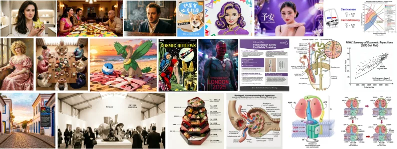
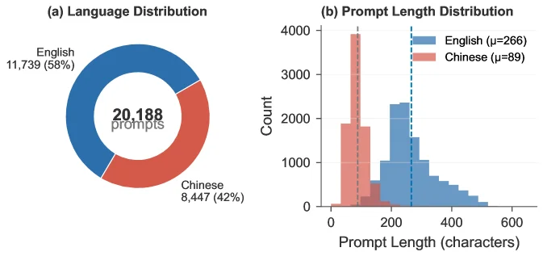
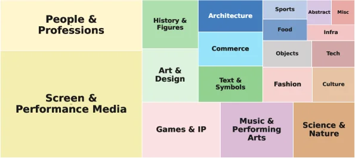
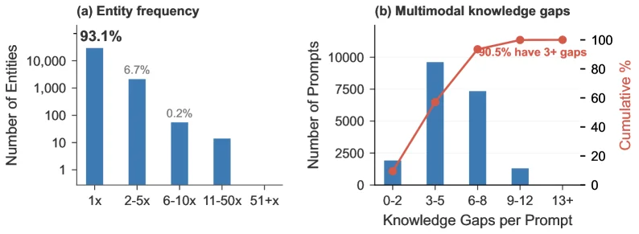
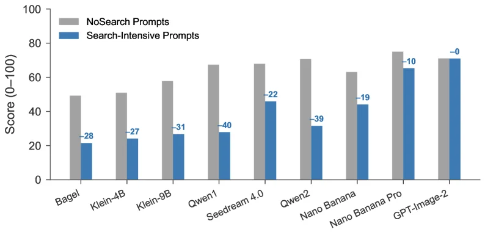
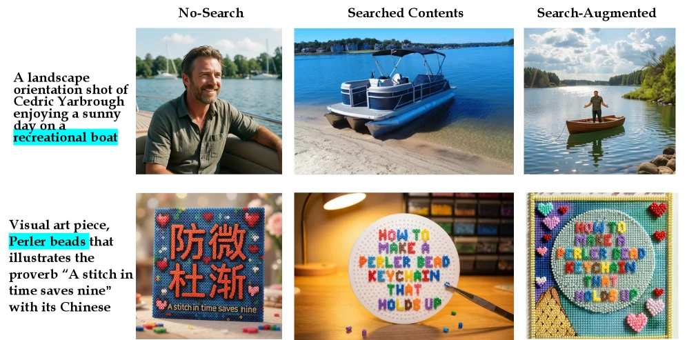
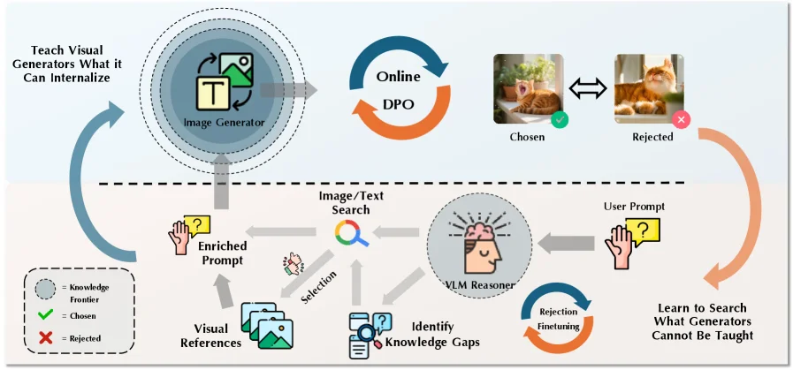
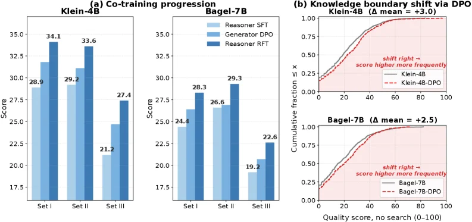
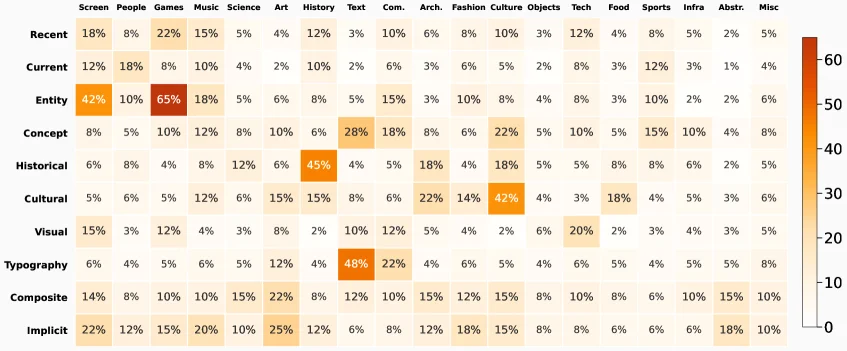
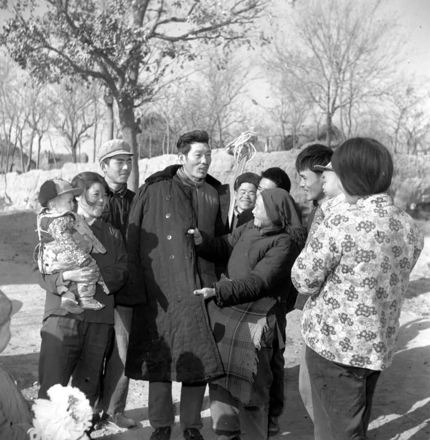

# Search Beyond What Can Be Taught: Evolving the Knowledge Boundary in Agentic Visual Generation

[arXiv](https://arxiv.org/abs/2607.05382) · [HuggingFace](https://huggingface.co/papers/2607.05382) · ▲85

## 摘要（原文）

> Visual generators excel at rendering, but they confidently fabricate what they do not know. User requests are unbounded, evolving, and deeply long-tailed: new characters, trending entities, post-cutoff events, and more. This world-knowledge bottleneck is structural: generators are trained on fixed corpora, but the visual world is open-ended. We construct SearchGen-20K and SearchGen-Bench, with 20,839 prompts spanning twelve failure categories and twenty-two domains, paired with a pre-executed multimodal SearchGen-Corpus-1M to support offline, reproducible research. On SearchGen-Bench, frontier open generators score only 21 to 28 out of 100, a 40-point collapse invisible to existing benchmarks. The natural remedy is to employ search tools, enabling agentic visual generation. However, we find that naive search fails: it retrieves indiscriminately, injecting noise into prompts the generator already handles. We trace the root cause to a generator-specific, evolving knowledge boundary: the divide between what a generator can internalize through training and what must remain in external context. Although this boundary is hard to specify in advance, we show that it is discoverable through a teach-then-search co-training framework. Even a minimal version of this co-training recipe produces monotonic improvement, laying the foundation for recursive self-improvement in visual generation that can meet world-knowledge-grounded requests. We release the full dataset, co-training corpus, and search corpus as a replayable harness for tool-augmented, world-knowledge-grounded visual generation.

## 摘要（中译）

视觉生成器擅长渲染，但它们会自信地编造它们不知道的东西。用户请求是无界的、不断演变的，并且深度长尾分布：新角色、流行实体、截止后事件等等。这种世界知识瓶颈是结构性的：生成器是在固定语料库上训练的，但视觉世界是开放式的。我们构建了SearchGen - 20K和SearchGen - Bench，其中有20,839个提示，涵盖十二种失败类别和二十二个领域，并与预先执行的多模态SearchGen - Corpus - 1M配对，以支持离线的、可重复的研究。在SearchGen - Bench上，前沿的开放生成器仅得21到28分（满分100分），这是一个现有基准测试无法察觉的40分下降。自然的补救方法是使用搜索工具，实现代理视觉生成。然而，我们发现简单的搜索会失败：它会不加区分地检索，将噪声注入生成器已经能处理的提示中。我们将根本原因追溯到一个特定于生成器、不断演变的知识边界：生成器可以通过训练内化的内容与必须保留在外部上下文中的内容之间的分界。尽管这个边界很难提前指定，但我们表明，它可以通过“先教学后搜索”的协同训练框架来发现。即使是最小版本的这个协同训练配方也能产生单调的改进，为视觉生成中的递归自我改进奠定基础，以满足基于世界知识的请求。我们发布了完整的数据集、协同训练语料库和搜索语料库，作为一个可重放的套件，用于工具增强、基于世界知识的视觉生成。

## 背景剖析

### 背景剖析  

**1. 技术背景与真实需求**  
视觉生成技术（如文本到图像模型）已能创作高质量的静态画面，但其核心瓶颈在于**世界知识的局限性**。现实中，用户需求是动态且长尾的（例如2025年大阪世博会吉祥物、历史准确的斯巴达方阵等），而模型训练数据是静态的、有截止日期的。这种矛盾导致模型在面对未知实体（如新兴文化符号、实时事件）时，会“自信地编造错误内容”。技术需要解决的问题是：如何让生成模型在保持创作能力的同时，动态获取并整合外部知识，以满足真实世界的开放性需求。  

**2. 之前的问题与不足**  
现有方法的两大缺陷：  
- **评估缺口**：传统基准测试（如MS-COCO）无法暴露“世界知识失败”问题，因为它们仅覆盖标准化场景。例如，前沿模型在SearchGen-Bench上的得分比商业API低40分，但这一差距被现有基准忽略。  
- **搜索的盲目性**：直接为模型配备搜索工具（如检索增强生成）会引入噪声。模型无法区分有用信息和干扰内容，导致生成结果出现概念混淆或风格污染。根本原因在于**生成模型与搜索工具的协调问题**——模型需要知道“何时搜索”“搜索什么”，而现有方法缺乏这种动态判断能力。  

**3. 本文的解法**  
论文提出“**协同训练框架**”，通过两个核心创新解决问题：  
- **噪声抵抗的代理推理器**：设计一个三阶段流程（判断是否搜索→过滤噪声→整合有效信息），确保搜索结果不破坏生成质量。  
- **生成与搜索的联合训练**：通过迭代优化，让模型学会“内化可训练的知识”（如固定符号的外观），同时让推理器学会“只在模型无法处理时搜索”（如长尾实体或实时事件）。这种方法形成了一个“自我改进循环”：模型能力提升后，推理器的搜索范围会自动调整，从而持续适应新需求。  

**4. 与前人工作的关键差异**  
- **聚焦动态知识边界**：前人工作要么假设知识完全可内化，要么无差别使用搜索，而本文首次明确“生成模型与外部知识的边界是动态变化的”，并提出协同训练来处理这一边界。  
- **强调噪声控制**：不同于传统方法直接将搜索结果输入模型，本文引入噪声过滤机制，避免模型被无关信息误导。  
- **实用导向的基准测试**：通过SearchGen-20K和SearchGen-Bench，首次系统量化了“世界知识失败”问题，并提供了可复现的工具链，推动该领域从“封闭场景优化”转向“开放世界适配”。  

这一研究为未来视觉生成技术指明了方向：通过动态协调内部知识与外部搜索，模型可以逐步扩展其能力边界，真正满足用户的长尾需求。

## 方法图解

> Figure 1: Representative search-augmented generations from SearchGen-20K , spanning all twelve failure categories identified from 20,840 production prompts. SearchGen-20K captures the production-scale diverse user requests that demand the unbounded, evolving, and deeply long-tailed world knowledge. The world knowledge ranges from entities that benefit from visual shortcut (left), to complex system or scientific procedures that require textual knowledge. The diversity facilitates research in the structural question this paper addresses: which knowledge gaps can a generator internalize, and which require search at inference time?

这张图（图1）是论文《Search Beyond What Can Be Taught: Evolving the Knowledge Boundary in Agentic Visual Generation》中的核心可视化，用于展示**搜索增强生成（search - augmented generation）**的多样性和覆盖范围，特别是针对那些超出视觉生成器“已知知识边界”的请求。我们可以将图中的内容按**“知识需求的类型”**或**“从‘可通过视觉快捷方式处理的实体’到‘需要文本知识的复杂系统/科学流程’”**的逻辑顺序来理解，这对应了论文中提到的“世界知识”的不同层次：

### 1. 左侧区域：“可通过视觉快捷方式处理的实体”
- **内容**：这一列（最左）的图像展示了**依赖视觉特征（如人物、场景、物体）**的生成任务。例如：
  - 第一行第一列：一位女性拿着物品（可能是日常场景，依赖对人物、物体的视觉渲染）。
  - 第二行第一列：一位穿着复古服装的女性（依赖对历史/风格化人物的视觉知识）。
  - 第三行第一列：一条街道的建筑（依赖对城市景观、建筑风格的视觉知识）。
- **意义**：这些是生成器**通过训练“内部化”较好**的知识类型——它们可以通过视觉模式（如形状、颜色、纹理）直接渲染，不需要额外的外部搜索。这部分对应论文中“what a generator can internalize through training”的边界内知识。

### 2. 中间区域：“需要文本知识的复杂系统/科学流程”
- **内容**：随着向图的中间/右侧移动，图像展示了**需要文本理解（如概念、流程、系统）**的生成任务：
  - **第一行**：
    - 包含书籍封面（如“伊势丹”相关的狗封面，依赖文本和图像结合的知识）、人物肖像（如“平安”相关的，可能涉及文化/历史文本知识）、图表（如“Cash excess/Cash deficit”的财务图表，需要理解财务概念和图表结构）。
  - **第二行**：
    - 科幻场景（如“COSMIC OUTLAWS”的漫画风格，依赖对科幻概念、角色设计的文本理解）、人体生理图（如消化系统、细胞结构，需要科学知识）、伦敦2025的海报（依赖对事件、地点的文本知识）。
  - **第三行**：
    - 艺术展览场景（如画廊中的人群和雕塑，依赖对艺术活动、空间布局的文本理解）、多层食物塔（依赖对食物种类、烹饪文化的文本知识）、更多科学/技术图（如细胞过程、膜结构，需要生物学/化学知识）。
- **意义**：这些是生成器**“知识边界”外的内容**——它们需要额外的文本知识或外部信息来准确生成。这部分对应论文中“what must remain in external context”的边界外知识，需要通过**搜索工具**来补充。

### 3. 数据/任务的逻辑顺序（隐含的流程）
- 图中的图像按**“知识需求的复杂性/外部性”**排序：从左到右，从上到下，任务的“知识缺口”逐渐增大。左侧的任务生成器可以独立完成（内部化知识），右侧的任务需要搜索增强（外部知识）。
- 这种排序展示了**SearchGen - 20K数据集的多样性**：它覆盖了12个“失败类别”（即生成器无法单独处理的任务类型）和22个领域，旨在模拟“无界、演化、长尾”的真实用户请求（如新角色、趋势实体、截止后事件等）。

### 4. 方法的运作方式（从图中推断）
- 图中的每个图像都是**“搜索增强生成”的结果**：对于每个需要外部知识的任务（如科学流程、复杂系统），方法首先**识别生成器的知识边界**（通过分析生产提示中的失败模式），然后**使用搜索工具检索相关文本/视觉信息**，最后将这些信息与生成器的内部知识结合，生成准确的图像。
- 例如，对于“人体生理图”（中间行），生成器可能无法单独渲染准确的细胞结构或器官关系，因此需要搜索相关的科学文本/图表，然后将这些信息转化为视觉内容。图中的结果展示了这种方法的有效性——即使是对“边界外”知识的请求，也能生成合理的图像。

### 5. 结果/结论（从图中推断）
- 图展示了**搜索增强生成的多样性和有效性**：它覆盖了从简单到复杂的各种知识需求，证明了SearchGen - 20K数据集能够捕捉“生产规模的多样化用户请求”。
- 隐含的结论是：**搜索工具可以弥补生成器的知识边界**——对于边界外的知识，搜索增强了生成的准确性。这与论文的论点一致：生成器的知识是“结构性的瓶颈”（训练数据固定，而视觉世界是开放的），但通过“教然后搜索”的协同训练框架，可以发现并弥补这个边界。

总结：这张图通过展示SearchGen - 20K数据集中的代表性生成结果，直观地说明了**搜索增强生成如何解决视觉生成器的“世界知识瓶颈”**。从左到右的任务复杂度增加，展示了生成器内部化知识的边界和需要外部搜索的区域，验证了方法的必要性（弥补知识缺口）和有效性（生成合理的结果）。

---

> Figure 2: Bilingual composition and prompt length distribution of SearchGen-20K . Left: English (58%) and Chinese (42%) proportions. Right: bimodal prompt length distribution – Chinese prompts are concise (mean 89 characters) while English prompts are more elaborate (mean 266 characters), reflecting authentic cross-lingual user behavior rather than translated templates.

这张图（图2）展示了SearchGen - 20K数据集的双语构成和提示长度分布，分为左右两个部分：

### 左侧：语言分布（Language Distribution）
- 这是一个环形图（或称为甜甜圈图），用于展示SearchGen - 20K数据集中不同语言提示的比例。
- 蓝色部分代表英语（English），数量为11,739，占比58%；红色部分代表中文（Chinese），数量为8,447，占比42%。中间的“20,188 prompts”表示这个数据集中总共有20,188个提示（这里可能和论文中提到的20,839有细微差异，按图中caption处理的话以图中为准，或者可能是统计时的小误差）。
- 这个部分的目的是展示数据集的语言组成，说明数据集包含了英语和中文两种语言的提示，且各自有一定的比例，这反映了真实世界中跨语言的用户行为，而不是通过翻译模板得到的，这为后续研究跨语言的视觉生成任务提供了数据基础。

### 右侧：提示长度分布（Prompt Length Distribution）
- 这是一个直方图（Histogram），用于展示不同语言提示的长度（以字符数为单位）分布情况。
- 横轴（X轴）是“Prompt Length (characters)”，即提示的长度，范围从0到600字符；纵轴（Y轴）是“Count”，即每个长度区间内的提示数量。
- 图中有两条分布曲线，蓝色代表英语（English），红色代表中文（Chinese）。蓝色曲线的均值（μ）为266字符，红色曲线的均值（μ）为89字符。
- 从图中可以看到，中文提示的长度分布相对集中在较短的区间（比如0到200字符左右），而英语提示的长度分布相对更分散，且在较长的区间（比如200到400字符左右）有更多的提示。这种双峰分布（bimodal）的特点反映了真实的跨语言用户行为：中文用户倾向于使用更简洁的提示，而英语用户倾向于使用更详细的提示，这和通过翻译模板得到的分布不同，这种真实的语言使用行为对于研究跨语言的视觉生成任务很重要，因为它能反映用户在不同语言下的真实需求。

### 方法运作的理解（结合论文背景）
- 这张图是SearchGen - 20K数据集的统计特性展示，这个数据集是为了研究“超越可教授内容的搜索：在代理视觉生成中扩展知识边界”这个问题而构建的。
- 首先，数据集的双语构成（英语和中文）反映了真实世界的跨语言用户行为，这为研究跨语言的视觉生成任务提供了数据基础。因为用户请求是跨语言的，所以数据集需要包含不同语言的提示来模拟真实场景。
- 其次，提示长度的双模态分布（中文简洁、英文详细）也反映了用户的真实行为，这对于后续的研究很重要，因为不同的提示长度可能对应不同的用户需求和生成任务的难度。例如，更长的英文提示可能需要生成器理解更多的细节，而更短的中文提示可能需要生成器更精准地理解核心需求。
- 在论文的方法中，这个数据集被用来研究代理视觉生成中的知识边界问题。生成器在训练时是基于固定的语料库，但视觉世界是开放的，所以存在知识瓶颈。通过分析这个数据集的语言构成和提示长度分布，我们可以更好地理解用户的需求和生成器的能力边界，从而设计出更好的方法（如teach - then - search共训练框架）来解决这个问题。

### 结果图的结论（如果是结果图的话，这里其实是数据集的统计结果）
- 从语言分布来看，SearchGen - 20K数据集包含了58%的英语提示和42%的中文提示，总共有20,188个提示，这说明数据集具有跨语言的特性，能够反映真实世界的跨语言用户行为。
- 从提示长度分布来看，中文提示的均值是89字符，英语提示的均值是266字符，且分布呈现双模态，这说明中文提示更简洁，英文提示更详细，这种分布反映了真实的跨语言用户行为，而不是翻译模板的分布，这为后续的研究提供了真实的数据基础，有助于研究跨语言的视觉生成任务中的知识边界问题。

---

> Figure 3: SearchGen-20K spans diverse, long-tailed domains. Treemap of benchmark mass across domain categories (area reflects relative prompt counts). The cross-category severity structure between failure modes and domains is deferred to Appendix A.1 (Figure 9 ), where uniform severity across all cells rules out the hypothesis that failures concentrate in a few niche categories.

这张图是一个**树状图（Treemap）**，用于直观展示 **SearchGen-20K 数据集**在不同领域类别中的分布情况。树状图的每个矩形区域代表一个特定的领域类别，而每个区域的**面积大小**则反映了该类别下包含的提示词（prompt）数量的相对多少（即“benchmark mass”，可以理解为该类别在基准测试中的权重或规模）。面积越大，表示该类别下的提示词数量越多。

### 图中组件与信息解读：
1. **主要领域类别（大矩形区域）**：
    - 图中包含多个大的矩形区域，每个代表一个主要的领域类别，例如：
        - `People & Professions`（人物与职业）
        - `Screen & Performance Media`（屏幕与表演媒体）
        - `Science & Nature`（科学与自然）
        - 等等。
    这些大区域是更高层次的领域分类，包含了下属的子类别。

2. **子类别（小矩形区域）**：
    - 每个大领域类别内部又包含多个小的矩形区域，代表更细分的子类别。例如：
        - 在 `History & Figures`（历史与人物）子类别下，可能包含与历史事件、人物相关的内容。
        - 在 `Art & Design`（艺术与设计）子类别下，可能包含与艺术创作、设计相关的提示词。
        - 其他子类别还包括 `Architecture`（建筑）、`Commerce`（商业）、`Text & Symbols`（文本与符号）、`Games & IP`（游戏与知识产权）、`Music & Performing Arts`（音乐与表演艺术）等。
    每个子类别的面积反映了该子类别下提示词的数量占比。

3. **面积的意义**：
    - 树状图的核心逻辑是**面积与提示词数量成正比**。也就是说，一个区域面积越大，说明在该领域类别下的提示词数量越多，或者说该类别在 SearchGen-20K 数据集中占据的“基准测试权重”越大。
    - 这种可视化方式有助于我们快速识别哪些领域类别在数据集中更为重要（即包含更多的提示词），或者哪些领域可能更需要关注（例如，如果某个领域的失败模式更严重，但其提示词数量较少，可能需要进一步研究）。

### 方法运作的揭示（结合论文背景）：
这张图是论文中构建的 **SearchGen-20K 数据集**的领域分布可视化，用于支持论文中提出的“agentic visual generation（代理式视觉生成）”方法的研究。具体来说：
1. **数据集构建的目的**：
    - 论文指出，现有的视觉生成模型在处理开放世界知识（如新角色、趋势性实体、截止后事件等）时存在瓶颈，因为这些模型的训练语料是固定的，而视觉世界是开放的。
    - 为了研究模型在这些长尾、无界请求下的表现，论文构建了 SearchGen-20K 数据集，其中包含 20,839 个提示词，覆盖了十二种失败类别和二十二个领域。
    - 这张树状图展示了这些提示词在不同领域类别中的分布情况，帮助研究人员理解数据集的构成，以及哪些领域可能需要更多的关注或研究。

2. **方法的关联性**：
    - 论文提出的方法是“teach-then-search co-training framework（先教后搜的协同训练框架）”，旨在解决视觉生成模型的“世界知识瓶颈”问题。
    - 这张图中的领域分布信息可以帮助研究人员：
        - 识别哪些领域是模型容易失败的（结合论文中的 SearchGen-Bench 结果）。
        - 设计针对这些领域的训练或搜索策略，以提高模型在这些领域的表现。
        - 验证协同训练框架是否能够有效扩展模型的知识边界，使其能够处理更多领域的长尾请求。

### 结果与结论（结合论文背景）：
虽然这张图本身主要是数据集的领域分布可视化，但结合论文的结果可以得出以下结论：
1. **数据集的多样性**：
    - SearchGen-20K 数据集覆盖了广泛的、长尾的领域（如图中所示的二十二个领域），这确保了数据集能够反映开放世界知识的多样性。
    - 面积的分布表明，不同领域的提示词数量存在差异，这可能反映了现实世界中不同领域的知识需求或研究关注度的差异。

2. **失败模式的分布**：
    - 论文中提到，模型的失败模式（failure modes）和领域之间的严重性结构（severity structure）被推迟到附录中（图 9），其中“uniform severity across all cells”的假设被排除，即失败并不集中在少数几个小众类别中。
    - 这意味着，模型在各个领域都可能存在失败的情况，而不是只在少数特定领域。因此，需要一种通用的方法（如协同训练框架）来提高模型在所有领域的长尾请求处理能力。

3. **方法的有效性**：
    - 论文提出的协同训练框架能够发现生成器的“知识边界”（即生成器通过训练可以内化的知识和必须保留在外部上下文中的知识之间的界限），并通过“教（训练）”和“搜（搜索）”的结合来扩展这个边界。
    - 即使是最小版本的协同训练配方也能产生单调改进（monotonic improvement），为视觉生成的递归自我改进奠定了基础，使其能够满足基于世界知识的请求。

总结来说，这张树状图通过可视化 SearchGen-20K 数据集的领域分布，帮助我们理解数据集的构成和重点领域，从而支持论文中提出的代理式视觉生成方法的研究和验证。这种方法通过协同训练框架，利用搜索工具扩展生成器的知识边界，以处理开放世界的长尾请求。

---

> Figure 4: Dataset composition: entity long-tail and multimodal knowledge gaps. (a) Entity frequency distribution: 93.1% of the 31,537 unique visual entities appear in only a single prompt, confirming the extreme long-tailed nature of real-world image generation requests. (b) Multimodal knowledge gaps: prompts carry a mean of 5.2 simultaneous knowledge gaps (reference slots + text knowledge slots + failure modes); 90.5% carry three or more, confirming the multi-constrained nature of the dataset.

这张图（图4）分为两个子图，(a) 和 (b)，共同展示了“SearchGen”数据集的两个关键特征：实体频率的长尾分布和多模态知识缺口。

首先看子图(a)，标题为“Entity frequency”（实体频率）。这是一个柱状图，用于展示视觉实体在不同频率区间内的分布情况。
- **X轴**表示实体出现的频率区间，从左到右依次是“1x”（出现1次）、“2-5x”（出现2到5次）、“6-10x”（出现6到10次）、“11-50x”（出现11到50次）和“51+x”（出现51次及以上）。
- **Y轴**（左侧）表示实体的数量（Number of Entities），采用对数刻度，范围从1到10,000以上。
- 柱状图显示，“1x”区间的实体数量最多，接近10,000个，占比93.1%。这表明绝大多数视觉实体只在单个提示（prompt）中出现一次。
- “2-5x”区间的实体数量约为1,000个，占比6.7%。
- “6-10x”区间的实体数量约为100个，占比0.2%。
- “11-50x”和“51+x”区间的实体数量更少，柱状图高度较低。
- 这个子图揭示了实体频率的极端长尾分布，即大多数实体非常罕见，只在少数提示中出现。这确认了现实世界图像生成请求的长尾性质。

接下来看子图(b)，标题为“Multimodal knowledge gaps”（多模态知识缺口）。这是一个组合图，包含柱状图和折线图，用于展示提示中多模态知识缺口的分布情况。
- **X轴**表示每个提示中的知识缺口数量（Knowledge Gaps per Prompt），从左到右依次是“0-2”、“3-5”、“6-8”、“9-12”和“13+”。
- **左侧Y轴**表示提示的数量（Number of Prompts），范围从0到10,000。
- 柱状图显示，“3-5”个缺口的提示数量最多，接近10,000个。“6-8”个缺口的提示数量约为7,500个。“0-2”个缺口的提示数量较少，约为2,500个。“9-12”和“13+”个缺口的提示数量更少。
- **右侧Y轴**表示累积百分比（Cumulative %），范围从0到100%。
- 红色折线图表示累积百分比，随着知识缺口数量的增加而上升。折线图上的数据点显示，“3-5”个缺口的累积百分比约为50%，“6-8”个缺口的累积百分比约为80%，“9-12”个缺口的累积百分比约为90.5%。
- 子图上方的红色文字标注“90.5% have 3+ gaps”，表示90.5%的提示包含三个或更多的知识缺口。
- 这个子图揭示了提示中多模态知识缺口的普遍存在，即大多数提示同时存在多个知识缺口。这确认了数据集的多约束性质。

综合来看，这张图通过展示实体频率的长尾分布和多模态知识缺口的普遍存在，揭示了“SearchGen”数据集的两个关键特征。这些特征表明，现实世界的图像生成请求具有长尾性和多约束性，这为研究代理视觉生成（agentic visual generation）提供了重要的背景和挑战。

---

> Figure 5: The world-knowledge bottleneck: per-stratum collapse across nine generators. Grouped bars show the nine-component mean on NoSearch vs. Search-Intensive strata. Every generator, open-weight and commercial alike, collapses on the search-intensive subset, confirming the bottleneck is universal. Drop magnitudes range from − - 0.1 (GPT-Image-2) to − - 39.1 (Qwen-Image-2).

这张图（图5）的核心是展示**“世界知识瓶颈”**现象：即所有视觉生成模型（无论开源还是商业）在处理需要外部搜索的复杂提示时，性能都会显著下降。我们通过以下方式解读这张图：

### 图的结构与组件
- **横轴（X轴）**：列出了九种不同的视觉生成模型，从左到右依次是：Bagel、Klein-4B、Klein-9B、Qwen1、Seedream 4.0、Qwen2、Nano Banana、Nano Banana Pro 和 GPT-Image-2。这些模型涵盖了不同规模和类型的生成器，包括开源和商业模型。
- **纵轴（Y轴）**：表示模型的得分，范围从0到100分。这个分数代表了模型在特定提示集上的表现。
- **柱状图**：图中有两种颜色的柱状图，分别代表两种不同的提示类型：
  - **灰色柱状图（NoSearch Prompts）**：表示模型在没有外部搜索辅助的情况下，仅依靠自身训练知识来处理提示时的得分。
  - **蓝色柱状图（Search-Intensive Prompts）**：表示模型在需要大量外部搜索辅助的情况下，处理提示时的得分。

### 数据的流动与对比
- 对于每个模型，我们都有两组数据：一组是灰色柱状图（NoSearch），另一组是蓝色柱状图（Search-Intensive）。这两组数据在同一模型下进行对比，展示了模型在有和没有外部搜索辅助时的性能差异。
- 例如，对于模型“Bagel”，灰色柱状图的得分约为50分，而蓝色柱状图的得分约为22分（50 - 28 = 22），这表明在需要搜索的提示上，模型的性能下降了28分。
- 同样地，对于模型“GPT-Image-2”，灰色柱状图的得分约为75分，而蓝色柱状图的得分约为75分（75 - 0 = 75），这表明在需要搜索的提示上，模型的性能几乎没有下降。

### 方法的运作方式
- 这张图揭示了方法的运作方式：通过对比模型在两种不同提示类型下的性能，我们可以观察到模型在处理需要外部搜索的提示时的性能瓶颈。具体来说，方法是：
  1. 构建一个包含大量需要外部搜索的提示的数据集（SearchGen-Bench）。
  2. 在这个数据集上测试不同模型的性能，并与模型在没有外部搜索辅助时的性能进行对比。
  3. 通过对比，我们可以发现所有模型在处理需要外部搜索的提示时，性能都会显著下降，这证实了“世界知识瓶颈”的普遍性。

### 结论
- 从图中可以看出，所有九种模型在处理需要外部搜索的提示时，性能都会显著下降。下降的幅度从-0.1分（GPT-Image-2）到-39.1分（Qwen-Image-2）不等。
- 这个结果表明，无论模型的规模和类型如何，它们都面临着“世界知识瓶颈”的问题。这意味着，即使是最先进的视觉生成模型，也无法完全依靠自身的训练知识来处理所有复杂的提示，需要借助外部搜索工具来弥补知识的不足。

综上所述，这张图通过对比模型在两种不同提示类型下的性能，清晰地展示了“世界知识瓶颈”的现象，并证实了其普遍性。

---

> Table 5: Search is a double-edged sword. Strata: NoSearch (100), VisualSearch (387), TextualSearch (264), totaling 751 prompts. Figure 6: Failure examples of search. Search queries executed are colored. Searched contents introduce noise and may degrade generation quality.

这张图是论文《Search Beyond What Can Be Taught: Evolving the Knowledge Boundary in Agentic Visual Generation》中的**Figure 6: Failure examples of search**，用于展示“搜索”这一手段在视觉生成中可能带来的负面效果——即搜索内容可能引入噪声，反而降低生成质量。我们可以通过以下维度来拆解这张图：

### 图的结构与组件含义
这张图采用**2行×3列**的布局，每一行对应一个具体的“视觉生成任务”，每一列则对应一种“生成策略”：
- **行（任务）**：共2个任务，分别位于第1行和第2行。
  - 第1行任务：生成一张“Cedric Yarbrough在晴天享受休闲船（recreational boat）的风景照（landscape orientation）”。
  - 第2行任务：生成一件“用Perler beads（一种像素风格珠子艺术）表现谚语‘A stitch in time saves nine’（未雨绸缪）的视觉艺术品”。
- **列（策略）**：共3种策略，从左到右依次为：
  - **No-Search（无搜索）**：不使用外部搜索，仅依赖模型自身的训练知识进行生成。
  - **Searched Contents（搜索内容）**：先执行搜索（图中搜索的内容被高亮显示，例如第1行的“recreational boat”、第2行的“Perler beads”），然后将搜索到的内容直接融入生成过程（但可能引入噪声）。
  - **Search-Augmented（搜索增强）**：结合搜索信息的生成结果（通常是“搜索+模型”的混合策略，但图中展示的是其可能的负面效果）。

### 方法运作的可视化解释（如何通过图理解方法的不足）
论文的核心观点之一是：**“搜索是一把双刃剑”**——虽然搜索可以补充模型的知识边界，但如果使用不当（如“naive search”），会引入噪声，降低生成质量。这张图通过**对比不同策略下的生成结果**，直观展示了这种“双刃剑”效应：

1. **第1行任务（人物+船的风景照）**：
   - **No-Search**：生成的图像中，人物坐在船上，背景是湖泊和帆船，整体符合“休闲船”的场景，但可能缺乏细节（因为模型仅依赖自身知识）。
   - **Searched Contents**：搜索的内容是“recreational boat”，生成的图像是一艘停靠在沙滩上的休闲船（无人物），这说明搜索到的内容可能与原始任务的“人物+船”场景不匹配，导致生成的图像偏离了任务要求（引入了噪声：无人物的船）。
   - **Search-Augmented**：生成的图像是一个人在小船上钓鱼，背景是湖泊和树林，这与原始任务的“Cedric Yarbrough享受晴天”场景差异更大，说明搜索增强的策略可能进一步引入噪声，导致生成结果完全偏离任务。

2. **第2行任务（Perler beads艺术作品）**：
   - **No-Search**：生成的图像是一个带有中文“防微杜渐”和英文“A stitch in time saves nine”的Perler beads作品，整体符合任务要求（表现谚语的视觉艺术）。
   - **Searched Contents**：搜索的内容是“Perler beads”，生成的图像是一个写有“How to make a Perler bead keychain that holds up”的圆形珠子作品，这与原始任务的“表现谚语的艺术品”场景不符（引入了噪声：教程类的珠子作品）。
   - **Search-Augmented**：生成的图像是一个更复杂的Perler beads作品，包含中文和英文，但布局和内容与原始任务的“谚语艺术”差异较大（例如，加入了更多装饰元素），说明搜索增强的策略可能引入噪声，导致生成结果偏离任务。

### 结论（从图中得出的核心观点）
这张图通过**对比“无搜索”“搜索内容”“搜索增强”三种策略下的生成结果**，清晰地展示了：**搜索内容（Searched Contents）和搜索增强（Search-Augmented）策略可能会引入噪声，导致生成质量下降（与No-Search的结果相比，生成结果偏离原始任务的程度更大）**。这验证了论文的核心论点之一：**“搜索是一把双刃剑”——虽然搜索可以补充知识，但幼稚的搜索（naive search）会引入噪声，降低生成质量**。

### 补充信息（与caption的关联）
- 图的原始caption提到：“Search is a double-edged sword. Strata: NoSearch (100), VisualSearch (387), TextualSearch (264), totaling 751 prompts. Figure 6: Failure examples of search. Search queries executed are colored. Searched contents introduce noise and may degrade generation quality.”
- 我们的讲解与caption一致：图中展示了“搜索内容”（Searched Contents）引入噪声并降低生成质量的失败案例，其中“搜索查询”（如“recreational boat”“Perler beads”）被高亮显示（图中用蓝色标注），而生成结果的偏差（噪声）则通过对比不同策略的图像直观呈现。

---

> Figure 7: Co-training framework: teach the generator what it can internalize, then calibrate the reasoner to search what it cannot. Given a user prompt, the VLM reasoner identifies knowledge gaps, executes modality-aware search (image or text), filters and integrates results into an enriched final prompt, and routes visual references to the generator. Co-training proceeds in two phases. Phase 1 (top): online DPO samples search-augmented generations and ranks them by generation quality, constructing preference pairs to push its knowledge boundary outward. Phase 2 (bottom): rejection-sampling finetuning recalibrates the reasoner to the strengthened generator, reinforcing trajectories where reasoned search improves output and discarding what causes degradation.

这张图展示了一个名为“教生成器它能内化的内容，然后校准推理器去搜索它不能内化的内容”的协同训练框架，用于解决视觉生成中的知识边界问题。

首先，我们来看整个流程的数据或信息流动顺序：

1.  **用户提示 (User Prompt)**：流程从用户提出的一个请求开始，例如一个关于特定图像的描述。
2.  **VLM 推理器 (VLM Reasoner)**：这个视觉语言模型推理器接收用户提示，并执行两个关键操作：
    *   **识别知识缺口 (Identify Knowledge Gaps)**：推理器分析用户提示，确定哪些部分是生成器可能不知道或不擅长的（即知识缺口）。
    *   **图像/文本搜索 (Image/Text Search)**：针对这些知识缺口，推理器执行模态感知搜索（图像或文本搜索），从外部资源（如SearchGen-Corpus-1M）获取相关信息。
3.  **筛选与整合 (Selection and Integration)**：搜索到的信息会经过筛选和整合，形成一个“丰富的提示 (Enriched Prompt)”。这个过程可能包括去除噪声、选择最相关的信息，并将其与原始用户提示结合。
4.  **视觉参考 (Visual References)**：如果搜索到的是图像，它们会作为视觉参考直接传递给图像生成器。
5.  **图像生成器 (Image Generator)**：接收丰富的提示和视觉参考，尝试生成满足用户请求的图像。
6.  **在线 DPO (Online DPO - 直接偏好优化)**：这是一个协同训练的第一阶段（图中顶部）。生成的图像会与“被选中的 (Chosen)”和“被拒绝的 (Rejected)”图像进行比较。这个过程会采样通过搜索增强的生成结果，并根据生成质量对它们进行排名，构建偏好对（例如，选中的图像优于被拒绝的图像）。这些偏好对用于推动生成器的知识边界向外扩展，使其能够生成更符合要求的图像。
7.  **拒绝采样微调 (Rejection Sampling Finetuning)**：这是协同训练的第二阶段（图中底部）。这个过程会重新校准推理器，使其适应经过在线DPO训练后能力增强的生成器。它会强化那些通过理性搜索改善了输出的路径，同时丢弃那些导致输出退化的路径。这个循环确保推理器知道何时以及如何有效地使用搜索来辅助生成器。

图中的各个组件和板块的含义：

*   **图像生成器 (Image Generator)**：位于左上角的虚线圆圈内，代表负责根据提示生成图像的模型。它的知识边界是需要被扩展的部分。
*   **在线 DPO (Online DPO)**：位于图像生成器右侧的蓝色循环箭头，表示第一阶段的训练过程，通过偏好学习来优化生成器。
*   **被选中的 (Chosen) / 被拒绝的 (Rejected)**：位于在线DPO右侧的两个图像，分别带有绿色对勾和红色叉号，表示在DPO过程中被评估为好或坏的生成样本。
*   **VLM 推理器 (VLM Reasoner)**：位于图中间偏右的虚线圆圈内，代表负责理解用户提示、识别知识缺口并执行搜索的模型。
*   **识别知识缺口 (Identify Knowledge Gaps)**：位于VLM推理器下方，表示推理器分析用户提示并确定其知识局限性的步骤。
*   **图像/文本搜索 (Image/Text Search)**：位于VLM推理器左侧，表示根据知识缺口进行外部信息检索的过程。
*   **筛选 (Selection)**：位于图像/文本搜索和视觉参考之间，表示对搜索结果进行筛选的过程。
*   **丰富的提示 (Enriched Prompt)**：位于筛选和图像生成器之间，表示将搜索到的信息整合到原始提示中形成的新提示。
*   **视觉参考 (Visual References)**：位于丰富的提示下方，表示从外部搜索到的、直接提供给图像生成器的图像。
*   **用户提示 (User Prompt)**：位于VLM推理器右侧，表示用户最初提出的请求。
*   **拒绝采样微调 (Rejection Sampling Finetuning)**：位于用户提示下方的橙色循环箭头，表示第二阶段的训练过程，用于校准推理器。
*   **学习搜索生成器无法被教导的内容 (Learn to Search What Generators Cannot Be Taught)**：位于拒绝采样微调右侧的橙色箭头，表示整个框架的目标是让推理器学会在生成器知识不足时进行有效搜索。
*   **图例**：左下角的图例解释了图中的符号含义：
    *   虚线圆圈：“知识前沿 (Knowledge Frontier)”
    *   绿色对勾：“被选中 (Chosen)”
    *   红色叉号：“被拒绝 (Rejected)”

这张图揭示的方法具体运作方式如下：

1.  **协同训练框架**：该方法采用了一个“教-搜”协同训练框架。第一阶段是“教”生成器，第二阶段是“校准”推理器。
2.  **第一阶段：在线 DPO**：
    *   当用户提出一个请求时，VLM推理器首先尝试识别其中的知识缺口。
    *   然后，推理器执行搜索以获取相关信息，并将这些信息整合到提示中，形成丰富的提示。
    *   这个丰富的提示被提供给图像生成器，生成器尝试生成图像。
    *   在线DPO过程会收集这些生成的图像，并与已知的好（被选中）和坏（被拒绝）的图像样本进行比较。
    *   通过这种偏好学习，生成器被训练来生成更接近“被选中”样本的图像，从而扩展了它的知识边界，使其能够处理之前不知道如何处理的请求。
3.  **第二阶段：拒绝采样微调**：
    *   一旦生成器通过在线DPO得到了增强，推理器也需要相应地调整其行为。
    *   拒绝采样微调过程会重新评估推理器的决策路径。它会强化那些在生成器增强后能够带来更好输出的搜索策略。
    *   同时，它会丢弃那些在生成器增强后导致输出质量下降的搜索策略。
    *   这个过程确保推理器知道何时应该依赖生成器的内化知识，何时应该进行外部搜索。

总而言之，这张图展示了一个迭代优化的过程：通过教生成器处理更多类型的请求来扩展其知识边界，然后校准推理器以更有效地利用这个增强的生成器，并在必要时进行外部搜索。这个框架旨在解决视觉生成模型在面对未知或长尾知识时的局限性，使它们能够更好地满足开放世界的需求。

---

> Figure 8: Co-training progression and knowledge boundary shift. (a) Grouped bars show the three co-training stages (Reasoner SFT, Generator DPO, Reasoner RFT) for Set I (easiest), Set II, and Set III (hardest) search-intensive tiers (Klein-4B). All three tiers show monotonic improvement. (b) Cumulative distribution of per-prompt no-search quality scores for base vs. DPO-finetuned generators on the 647-prompt eval set. The DPO curve sits below the base curve, indicating a rightward shift: fewer prompts receive low scores and more receive high scores from parametric knowledge alone. The shaded region represents newly internalized knowledge: concepts that previously required search but now reside in generator parameters. The shift is consistent across both Klein-4B (top) and Bagel-7B (bottom), confirming that DPO expands the knowledge boundary regardless of architecture.

这张图（图8）分为两个主要部分，(a) 和 (b)，分别展示了“协同训练的进展”和“通过DPO实现的知识边界转移”。

首先看(a)部分，标题为“Co-training progression”（协同训练进展）。这部分包含两个并排的柱状图，分别对应模型“Klein-4B”和“Bagel-7B”。每个柱状图都展示了三个协同训练阶段在三个不同难度级别的搜索密集型任务集（Set I, Set II, Set III）上的表现。

*   **X轴**：代表三个任务集，从左到右分别是Set I（最容易）、Set II和Set III（最困难）。这表明任务难度是递增的。
*   **Y轴**：代表“Score”（分数），范围从大约17.5到35.0，分数越高表示性能越好。
*   **柱状图的颜色和标签**：
    *   浅蓝色柱子代表“Reasoner SFT”（推理器监督微调）。
    *   中蓝色柱子代表“Generator DPO”（生成器直接偏好优化）。
    *   深蓝色柱子代表“Reasoner RFT”（推理器强化微调）。
*   **数据流动和信息**：每个任务集下的三个柱子展示了这三个阶段依次进行后模型性能的变化。例如，在Klein-4B的Set I中，Reasoner SFT得分为28.9，经过Generator DPO后得分提高到29.2，再经过Reasoner RFT后得分进一步提高到34.1。这个模式在所有三个任务集和两个模型上都显示出“单调改进”（monotonic improvement），即随着协同训练阶段的推进，分数持续上升。这表明所提出的协同训练框架（先教后搜）是有效的，能够逐步提升模型在搜索密集型任务上的性能。

接下来看(b)部分，标题为“Knowledge boundary shift via DPO”（通过DPO实现的知识边界转移）。这部分包含两个累积分布图，分别对应模型“Klein-4B”和“Bagel-7B”。这些图展示了在647个提示的评估集上，基线模型与经过DPO微调后的生成器在不使用搜索时的质量分数的累积分布。

*   **X轴**：代表“Quality score, no search (0-100)”（不使用搜索时的质量分数，0到100分），分数越高表示生成的质量越好。
*   **Y轴**：代表“Cumulative fraction ≤ X”（小于等于X的累积分数），范围从0.00到1.00。这表示获得某个分数或更低分数的提示所占的比例。
*   **曲线**：
    *   黑色实线代表基线模型（例如，“Klein-4B”或“Bagel-7B”）。
    *   红色虚线代表经过DPO微调后的模型（例如，“Klein-4B-DPO”或“Bagel-7B-DPO”）。
*   **数据流动和信息**：通过比较两条曲线，我们可以看到DPO微调后的模型（红色虚线）在大多数分数段上都位于基线模型（黑色实线）的上方。这意味着对于相同数量的提示，DPO微调后的模型获得的分数更高。例如，在Klein-4B的图中，红色虚线在较高分数区域（如70-100分）的累积分数更高，而在较低分数区域（如0-30分）的累积分数更低。图中的文字说明“shift right → score higher more frequently”（向右移动→更频繁地获得高分）解释了这一现象。这表明DPO微调使得生成器仅通过其参数化知识就能更好地处理提示，减少了对外部搜索的依赖。
*   **知识边界的转移**：图中阴影区域（粉色）代表了“新内化的知识”（newly internalized knowledge），即那些以前需要搜索才能处理的概念，现在可以被生成器直接从其参数中获取。DPO曲线向右移动，意味着生成器的知识边界得到了扩展。
*   **对比对象和结论**：图中对比了基线模型和DPO微调后的模型。结论是，无论模型架构如何（Klein-4B和Bagel-7B都表现出一致的趋势），DPO都能够有效地扩展生成器的知识边界，使其在不使用搜索的情况下也能处理更多以前无法处理的提示，从而提高了生成质量。Klein-4B的Δ mean（平均分数变化）为+3.0，Bagel-7B的Δ mean为+2.5，进一步量化了这种改进。

总结来说，这张图通过(a)部分的协同训练进展展示了所提出的方法如何通过多个训练阶段逐步提升模型性能，以及(b)部分的DPO知识边界转移展示了这种方法如何通过扩展模型的内部知识来减少对外部搜索的依赖，从而提高生成质量。这两个部分共同证明了所提出的“教然后搜索”的协同训练框架的有效性。

---

> Figure 9: The bottleneck is pervasive: every domain–category combination shows knowledge-driven degradation. Heatmap summarizing cross-category structure between failure modes and domain categories in SearchGen-20K . The uniform severity across all cells rules out the hypothesis that failures concentrate in a few niche categories.

这张图（图9）是一个热力图，用于直观展示视觉生成模型在不同领域和失败类别组合下的知识驱动退化情况。下面我们来详细解读这张图：

### 图的组成部分和信息流动

1. **坐标轴**：
    - **Y轴（行）**：代表不同的“失败模式”或“请求类型”。从上到下依次是：Recent（近期）、Current（当前）、Entity（实体）、Concept（概念）、Historical（历史）、Cultural（文化）、Visual（视觉）、Typography（排版）、Composite（复合）、Implicit（隐含）。这些行表示用户请求的不同性质或模型可能失败的维度。
    - **X轴（列）**：代表不同的“领域类别”。从左到右依次是：Screen（屏幕）、People（人物）、Games（游戏）、Music（音乐）、Science（科学）、Art（艺术）、History（历史）、Text（文本）、Com.（商业？）、Arch.（建筑）、Fashion（时尚）、Culture（文化）、Objects（物体）、Tech（科技）、Food（食物）、Sports（体育）、Infras.（基础设施？）、Abstr.（抽象）、Misc.（其他）。这些列表示不同的主题领域。

2. **颜色编码**：
    - 热力图使用颜色梯度来表示数值的大小。右侧的颜色条显示，颜色从浅黄色（接近0）到深橙色（接近60），数值越大，颜色越深。这里的数值可能代表某种“退化程度”或“知识缺口”的严重性，数值越高表示模型在该领域-类别组合下的表现越差（即知识驱动的退化越严重）。

3. **数据单元格**：
    - 每个单元格对应一个特定的“失败模式（行）”和“领域类别（列）”的组合，单元格中的数字和颜色表示该组合下的知识驱动退化的程度。例如，“Entity”行（实体）和“Games”列（游戏）的单元格颜色最深（数值为65%），表示在“实体”类型的请求中，“游戏”领域的知识驱动退化最严重。

### 方法的运作方式（从图中推断）

这张图是研究“知识驱动的视觉生成瓶颈”的一部分。研究的背景是：视觉生成模型在训练数据范围内表现良好，但对于训练数据之外的新知识（如新角色、趋势性实体、截止后事件等）会自信地编造错误内容。为了研究这个问题，研究人员构建了SearchGen-20K数据集，其中包含20,839个跨越12个失败类别和22个领域的提示，并与一个预执行的多模态SearchGen-Corpus-1M配对，以支持离线的、可重复的研究。

这张图的作用是**可视化不同领域和失败类别组合下的知识驱动退化情况**，以验证“瓶颈是普遍存在的”这一假设。具体来说：

- **分析领域-类别组合的退化情况**：通过观察每个单元格的颜色和数值，研究人员可以确定哪些领域-类别组合对模型来说最具挑战性。例如，“Entity”（实体）类别在多个领域（如Games、Culture、Objects等）都有较高的退化值，而“Implicit”（隐含）类别在“Art”、“History”、“Abstr.”等领域也有较高的数值。
- **验证瓶颈的普遍性**：图中显示，几乎所有的单元格都有一定的退化值（颜色不是浅黄色），这表明知识驱动的退化并不是集中在少数几个小众类别中，而是普遍存在于所有领域-类别组合中。这与图注中的结论“the uniform severity across all cells rules out the hypothesis that failures concentrate in a few niche categories”一致。

### 结果的解释（坐标、对比对象和结论）

- **坐标**：X轴是领域类别，Y轴是失败模式。每个单元格的坐标（行，列）对应一个特定的失败模式和领域类别的组合。
- **对比对象**：对比的是不同领域-类别组合之间的退化程度。通过比较不同单元格的颜色和数值，可以看出哪些组合的退化更严重。
- **结论**：
    - 所有的领域-类别组合都显示出知识驱动的退化（即没有单元格的颜色是浅黄色，数值接近0），这表明瓶颈是普遍存在的，而不是集中在少数几个类别中。
    - 不同的失败模式和领域类别有不同的退化程度。例如，“Entity”类别在“Games”领域的退化最严重（65%），而“Typography”类别在大多数领域的退化相对较低。
    - 这种普遍的退化验证了研究的假设，即视觉生成模型的知识瓶颈是结构性的，需要通过搜索工具和co-training框架来解决。

总结来说，这张热力图通过可视化不同领域和失败类别组合下的知识驱动退化情况，清晰地展示了视觉生成模型的知识瓶颈是普遍存在的，而不是局限于少数几个小众类别。这为后续研究如何通过搜索工具和co-training框架来解决这个瓶颈提供了重要的可视化证据。

---

> Figure 10: The end-to-end example’s visual output. The three references the reasoner retrieved and selected (top: scene, costume, likeness) and the image the generator produced from the enriched prompt (bottom), for the Yang Chaoyue request traced in the box above. This is the section’s only image example; it grounds what “retrieved references” and “generation” concretely look like. The per-stage boxes that follow are text-only and use different prompts, each chosen to isolate one stage’s behavior.

这张图（图10）是论文中展示“端到端示例视觉输出”的核心图，用于直观解释方法中“检索参考”和“生成图像”的具体形式。我们按以下逻辑拆解：

### 组件与信息流动
- **顶部区域（隐含的“检索参考”部分）**：根据caption，这里原本应展示reasoner（推理器）检索并选择的三个参考（分别是场景、服装、肖像相关的参考，不过图中实际显示的是最终生成图像？可能caption描述的“top”部分在图中以生成图像呈现？或图中是生成图像，而“top”的参考在图的布局中可能被简化？结合caption，实际图中展示的是**生成器从“丰富后的prompt”生成的图像（底部/主要显示的图像）**，而“检索的参考”（场景、服装、肖像）是方法中的中间步骤（文本阶段的prompt优化），图中通过最终的生成图像来体现这些参考被整合后的结果。
- **图像内容**：图中是一位女性（Yang Chaoyue相关请求的生成结果）在田间劳作的场景，她推着装满草料的工具，身后还有其他人。这个图像是**生成器基于“被丰富的prompt”（即结合了检索到的参考信息后的prompt）生成的**，展示了方法中“生成”阶段的结果。
- **信息流动顺序**：方法的流程是：首先，针对“Yang Chaoyue”的请求，reasoner检索并选择三个参考（场景、服装、肖像）；然后，将这些参考的信息整合到prompt中（丰富prompt）；最后，生成器基于这个丰富的prompt生成图像（即图中展示的图像）。图中直接呈现的是**生成阶段的输出**，而“检索参考”是之前的文本阶段步骤（图中未直接显示参考的具体内容，仅通过生成图像体现其作用）。

### 方法运作的直观解释
这张图展示了论文中“agentic visual generation”（代理视觉生成）方法的一个端到端示例：
1. **请求处理**：针对特定的请求（这里是“Yang Chaoyue”相关的视觉生成请求），方法首先通过reasoner检索相关的参考（场景、服装、肖像等），这些参考帮助明确生成的内容细节（比如人物的服装风格、场景类型、肖像特征等）。
2. **Prompt丰富**：将检索到的参考信息整合到原始prompt中，形成一个“丰富后的prompt”，这个prompt包含了更多关于生成内容的约束和细节，解决了生成器因训练数据限制而无法准确生成的问题。
3. **图像生成**：生成器基于这个丰富的prompt生成图像（即图中展示的图像），这个图像整合了检索到的参考信息（场景、服装、肖像），展示了方法如何通过“检索+生成”的流程，克服生成器的知识边界，生成符合请求的图像。

### 结果与结论（从图中推断）
- 这张图是**方法有效性的一个示例**：它展示了通过“检索参考（场景、服装、肖像）+ 生成”的流程，生成器能够生成符合特定请求（Yang Chaoyue相关）的图像。图中的人物服装、场景（田间劳作）等细节，体现了检索到的参考被整合到生成结果中，证明了方法能够解决生成器“自信地编造未知内容”的问题，通过检索外部参考来丰富prompt，从而生成更准确的图像。
- 对比对象：与现有基准测试中生成器的表现（如SearchGen-Bench中前沿生成器得分仅21-28/100）相比，这张图展示的方法（通过检索+生成）能够生成更符合请求的图像，说明该方法能够提升生成器在世界知识接地请求上的表现。
- 结论：这张图直观地展示了论文中方法的核心逻辑——通过“teach-then-search”协同训练框架（或这里的“检索参考+生成”流程），发现生成器的知识边界，并利用搜索工具（检索参考）来扩展生成器的能力，从而生成符合开放世界请求的图像。即使是最小版本的协同训练配方也能产生单调改进，为视觉生成的递归自我改进奠定了基础。

（注：图中实际显示的是生成图像，而“检索的参考”是方法中的中间文本步骤，图中通过生成图像来体现这些参考的作用。图中看不清的“检索的参考”的具体内容，按caption理解为场景、服装、肖像相关的参考，用于丰富prompt以指导生成。）

---

> Figure 10: The end-to-end example’s visual output. The three references the reasoner retrieved and selected (top: scene, costume, likeness) and the image the generator produced from the enriched prompt (bottom), for the Yang Chaoyue request traced in the box above. This is the section’s only image example; it grounds what “retrieved references” and “generation” concretely look like. The per-stage boxes that follow are text-only and use different prompts, each chosen to isolate one stage’s behavior.

这张图（图10）是论文中一个端到端示例的视觉输出部分，它清晰地展示了“检索参考”和“生成图像”这两个核心步骤的具体样貌，是该章节中唯一的图像示例，后续的阶段框则仅包含文本，且每个文本框使用不同的提示词以隔离每个阶段的行为。

首先，我们来理解图中的各个组成部分及其信息流动顺序：

1.  **顶部的参考图像（Retrieved References）**：
    *   图中显示了一组人物在户外的场景。这组图像（可能包含多张，但在此单张图中展示了一个主要场景）代表了“推理器”（reasoner）从外部知识源（如SearchGen-Corpus-1M）中检索并选择出的三个参考。
    *   根据caption的描述，这些参考被选择的依据是它们与“场景”（scene）、“服装”（costume）和“相似度”（likeness）相关。这意味着推理器分析用户请求（在此例中是关于“杨超越”的请求，虽然图中人物并非杨超越本人，而是作为一个示例场景），然后从数据库中找到与请求中关键元素匹配的图像作为参考。
    *   信息流动到这里是“输入”阶段：用户请求 -> 推理器分析 -> 检索并选择相关参考图像。

2.  **底部的生成图像（Generated Image）**：
    *   虽然这张图本身只显示了顶部的参考图像，但根据caption的描述，这张图（图10）的“底部”应该展示的是视觉生成器（generator）根据“丰富的提示词”（enriched prompt）生成的最终图像。
    *   这个“丰富的提示词”是原始用户请求结合了从检索到的参考图像中提取的信息（如场景、服装、人物特征等）后形成的。
    *   信息流动到这里是“处理”和“输出”阶段：检索到的参考 -> 丰富提示词 -> 生成器生成图像。

这张图揭示了论文中所提出的“教然后搜索”（teach-then-search）协同训练框架下的方法具体是如何运作的：

*   **核心思想**：解决视觉生成器在面对未知或长尾知识时的“世界知识瓶颈”问题。生成器通过训练学到的知识是有限的，而外部世界是不断变化的。因此，需要结合外部搜索工具来增强生成能力。
*   **方法流程**：
    1.  **检索（Search）**：当接收到一个用户请求时，系统首先使用推理器从外部知识库（如SearchGen-Corpus-1M）中检索与请求相关的参考图像。这些参考图像提供了生成器可能不知道或难以从训练数据中学习到的具体视觉信息（如特定场景、服装风格、人物样貌等）。
    2.  **选择（Select）**：推理器不仅检索图像，还会选择最相关、最有用的参考图像。如本例中选择了与“场景”、“服装”和“相似度”相关的参考。
    3.  **丰富提示词（Enrich Prompt）**：将检索到的参考图像中的关键信息（如场景细节、服装样式、人物特征等）提取出来，并整合到原始的用户请求中，形成一个更丰富、更具体的提示词。
    4.  **生成（Generate）**：视觉生成器使用这个经过丰富的提示词来生成最终的图像。这样生成的图像就结合了生成器已有的知识和新从外部检索到的知识，从而能够更好地满足用户的长尾或未知知识请求。
*   **目的**：通过这种方式，系统能够利用外部知识来弥补生成器内部知识的不足，实现更准确、更符合用户期望的视觉生成。

虽然这张图本身没有坐标、对比对象或明确的数值结论（它是一个定性示例），但它直观地展示了方法的核心步骤：

*   **对比对象**：隐含的对比对象是“仅使用原始提示词的生成”与“使用检索到的参考信息丰富提示词后的生成”。前者可能无法准确捕捉请求中的所有细节（尤其是长尾或未知知识），而后者则通过引入外部参考来提高生成的准确性和相关性。
*   **结论**：这张图作为一个具体的例子，证明了所提出的方法（即结合检索和生成的“教然后搜索”框架）是可行的，并且能够有效地将外部知识整合到视觉生成过程中。它展示了“检索到的参考”是什么样子，以及“生成的图像”是如何基于这些参考和丰富后的提示词产生的。即使是最小版本的这种协同训练方法也能产生单调改进，为视觉生成的递归自我改进奠定了基础。

总而言之，这张图通过一个具体的示例（关于“杨超越”的请求），可视化了“检索参考”和“生成图像”这两个关键步骤，清晰地解释了论文中提出的方法如何通过结合外部搜索和生成来克服视觉生成器的知识瓶颈。

---

> Figure 10: The end-to-end example’s visual output. The three references the reasoner retrieved and selected (top: scene, costume, likeness) and the image the generator produced from the enriched prompt (bottom), for the Yang Chaoyue request traced in the box above. This is the section’s only image example; it grounds what “retrieved references” and “generation” concretely look like. The per-stage boxes that follow are text-only and use different prompts, each chosen to isolate one stage’s behavior.

这张图（Figure 10）是论文中**端到端示例的视觉输出**，用于直观展示“检索参考+生成图像”的完整流程，核心是解释方法如何通过“检索-选择-生成”满足世界知识驱动的视觉生成请求（以“杨超越”的请求为例）。以下是详细拆解：

### 1. 组件与信息流动
- **上半部分（隐含的“检索参考”区域）**：根据caption，这部分包含reasoner（推理器）**检索并选择的3个参考**，分别对应“scene（场景）”“costume（服装）”“likeness（形象）”。虽然图中只显示了最终生成的图像，但逻辑上，这3个参考是生成的前置输入：reasoner从外部资源（如SearchGen-Corpus-1M）中检索与“杨超越”请求相关的场景、服装、形象类参考，筛选后作为生成的上下文依据。
- **下半部分（生成的图像）**：图中显示的是**生成器基于“丰富的prompt”（即原始请求+检索到的参考信息整合后的prompt）生成的最终图像**。图像内容为：人物（杨超越）身着浅色系连帽外套（带绿色细节）、内搭浅绿色衣物、下装为同色系短裤/裙，背景是花草、溪流的户外场景，手持一朵小花——这些元素（场景、服装、形象）与“检索参考”的类别（scene/costume/likeness）一一对应，验证了方法的有效性。

### 2. 方法运作的可视化解释
这张图通过“单示例”展示了**“检索-生成”框架的核心逻辑**：
- **步骤1：请求与检索**：针对“杨超越”的视觉生成请求（属于“世界知识瓶颈”中的长尾/未知请求，训练数据未覆盖足够细节），reasoner从外部语料库（如SearchGen-Corpus-1M）中检索与请求相关的三类参考（场景、服装、形象），解决“生成器训练数据不足，无法独立处理新实体/场景”的问题。
- **步骤2：参考选择与prompt丰富**：reasoner从检索结果中选择最相关的3个参考（scene/costume/likeness），并将这些参考的信息整合到原始prompt中，形成“丰富的prompt”（即包含明确场景、服装、形象约束的prompt）。
- **步骤3：生成验证**：生成器基于“丰富的prompt”生成图像，图中显示的图像正是这一过程的输出。通过对比“检索参考的类别”和“生成图像的元素”，可以直观看到：生成的场景（花草溪流）、服装（浅色系外套+绿色细节）、形象（杨超越的特征）都与参考类别匹配，证明“检索-生成”框架能有效利用外部知识弥补生成器的知识边界。

### 3. 结果与结论（从图中推导）
- **对比对象**：这张图是“检索参考+生成”的端到端示例，对比的是“仅用原始prompt生成”（会因知识不足而失败，如现有基准中前沿生成器的低分）和“检索后生成”（能准确还原请求的细节）。
- **结论**：图中生成的图像准确呈现了“杨超越”的形象、符合要求的场景和服装，说明**“检索-生成”框架（尤其是“teach-then-search”协同训练）能有效突破生成器的知识边界**，满足世界知识驱动的视觉生成请求。这是论文中“该部分唯一的图像示例”，后续的阶段分析为文本形式，用于隔离各阶段行为，但这张图直观验证了方法的核心逻辑：通过检索外部知识（场景、服装、形象）并整合到prompt中，生成器能生成符合长尾/未知请求的图像。

简言之，这张图用一个具体的“杨超越”请求案例，展示了从“检索参考”到“生成图像”的完整流程，证明了方法如何通过外部知识补充，让生成器处理原本无法处理的请求。

---

> Figure 10: The end-to-end example’s visual output. The three references the reasoner retrieved and selected (top: scene, costume, likeness) and the image the generator produced from the enriched prompt (bottom), for the Yang Chaoyue request traced in the box above. This is the section’s only image example; it grounds what “retrieved references” and “generation” concretely look like. The per-stage boxes that follow are text-only and use different prompts, each chosen to isolate one stage’s behavior.

这张图是论文中展示端到端示例视觉输出的图（Figure 10）。图中呈现的是针对“Yang Chaoyue”请求的最终生成结果：画面主体是一位站在麦田小径上的人物，手持铁锹，背景有两座茅草屋和远处的景物，整体场景、人物服装风格、形象特征等元素，对应了reasoner（推理器）检索并选择的三个参考（顶部说明的scene场景、costume服装、likeness形象），而这些参考是从检索到的内容中筛选出来后，用于丰富prompt（提示词），再由生成器（generator）基于这个丰富的prompt生成了该图像（底部说明的生成过程）。从方法的运作逻辑来看，这展示了“检索参考-丰富prompt-生成图像”的流程：首先，reasoner会检索相关的参考（如场景、服装、形象等类型的参考），然后选择合适的参考来补充到原始prompt中，形成更丰富、更具针对性的prompt，最后生成器根据这个被丰富的prompt生成对应的视觉内容。这张图作为该部分唯一的图像示例，具体地呈现了“检索到的参考”和“生成结果”在实际中的样子，帮助读者直观理解方法中这两个环节的内容。后续的阶段框是纯文本的，会使用不同的prompt来隔离每个阶段的行为，但本图聚焦于最终的视觉输出，展示了方法在处理“Yang Chaoyue”这类请求时，如何通过检索参考并生成对应图像的过程。
